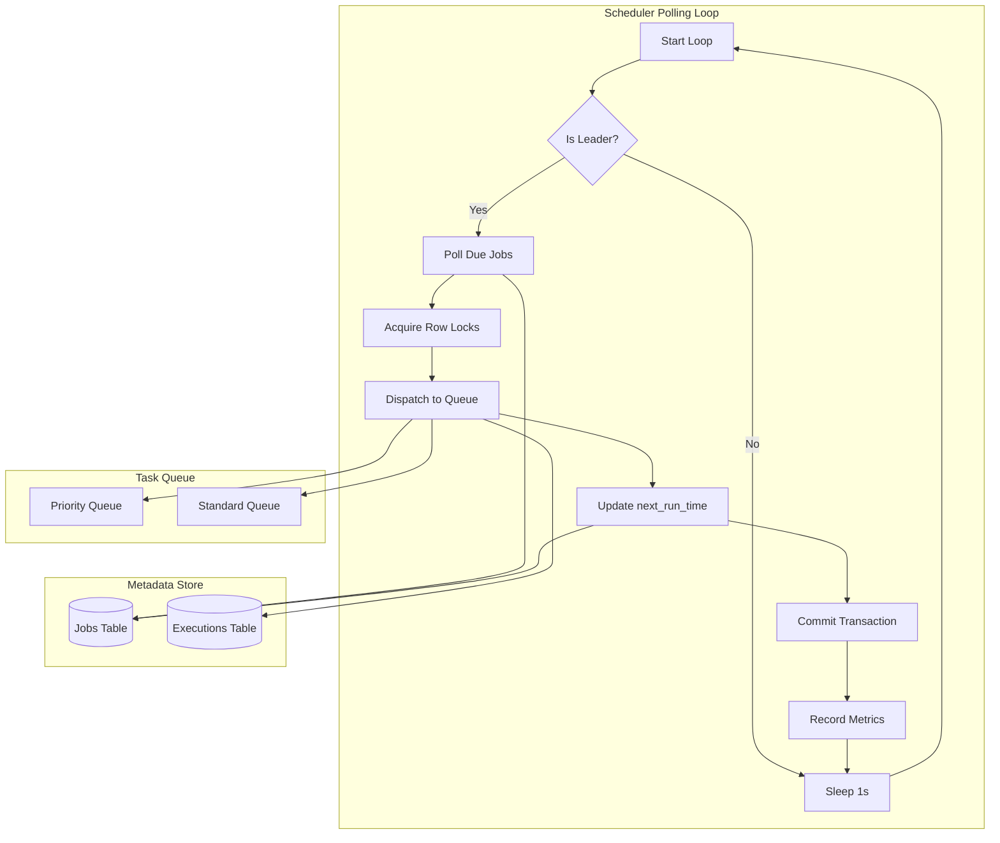
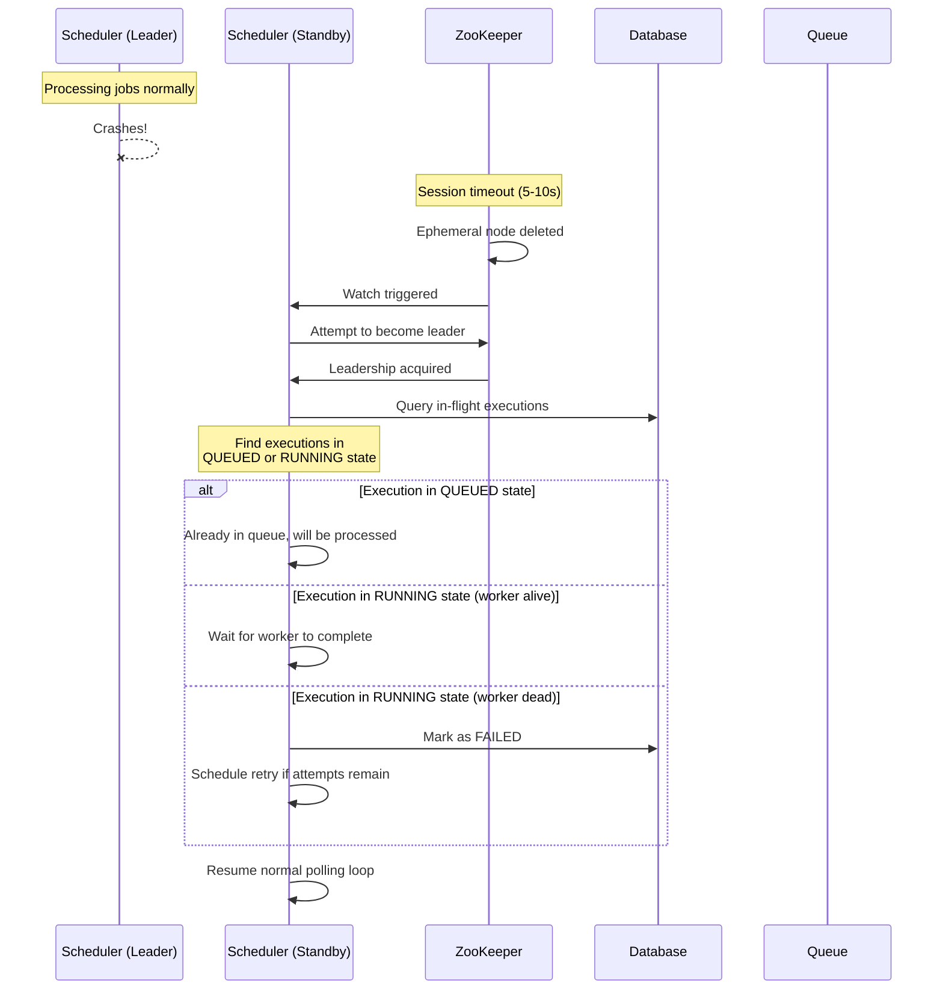
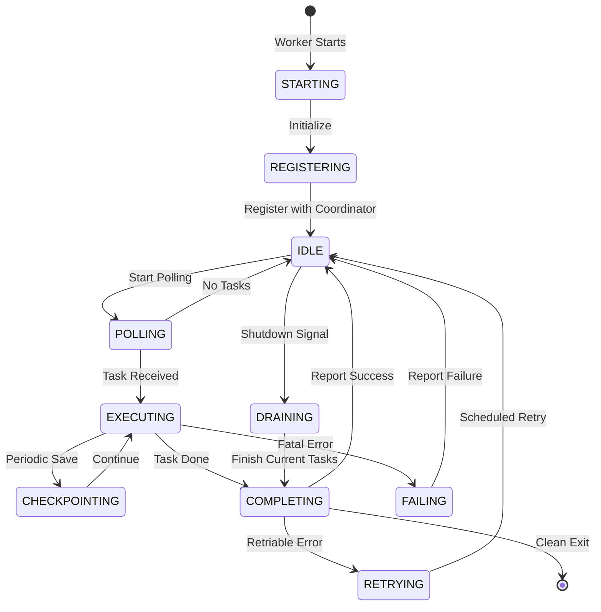
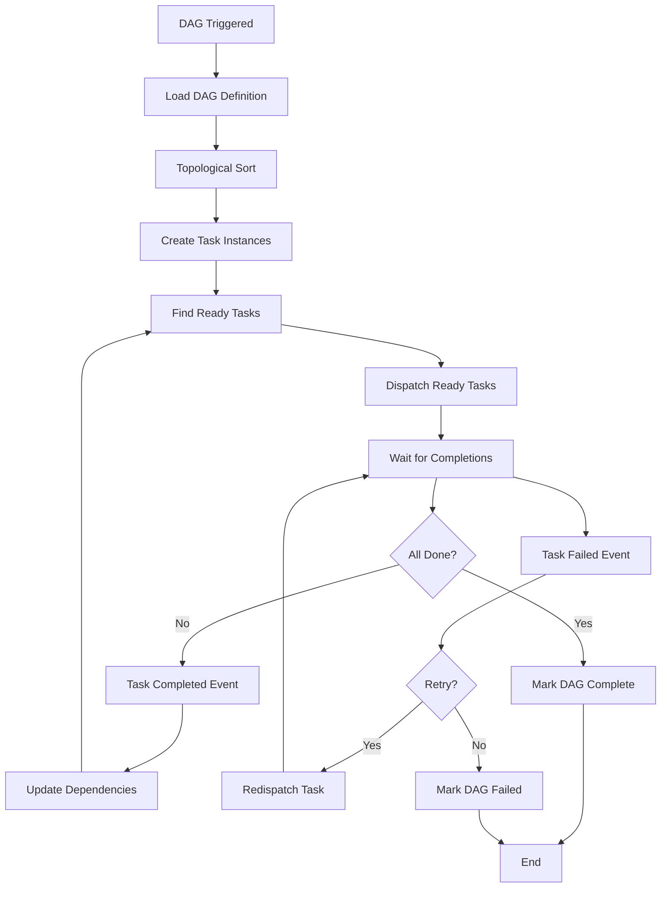

# Deep Dive & Bottlenecks

[← Back to Low-Level Design](./03-low-level-design.md) | [Next: Scalability & Reliability →](./05-scalability-and-reliability.md)

---

## Deep Dive 1: Scheduler Service

The scheduler service is the brain of the system—responsible for determining which jobs to execute and when. Its reliability directly impacts whether jobs run on time.

### Polling Loop Architecture



### Polling Window Strategy

The scheduler uses a safety window to handle edge cases:

```
Timeline:
|------ Safety Buffer (60s) ------|--- Now ---|
|                                  |           |
09:58:00                       09:59:00     10:00:00

Query: next_run_time BETWEEN 09:59:00 AND 10:00:00

Why Safety Buffer?
1. Scheduler restart: Jobs scheduled at 09:59:30 during restart
2. Clock skew: Different servers may have slightly different times
3. Transaction delays: Long-running transactions might delay commits

Trade-off: Buffer increases with deduplication required
- Too small: Risk missing jobs
- Too large: More duplicate dispatch attempts
```

### Deduplication Mechanisms

Since the safety buffer can cause the same job to be queried multiple times:

**Mechanism 1: Database-Level Optimistic Locking**

```sql
-- Only one scheduler can dispatch a job
UPDATE jobs
SET status = 'DISPATCHING',
    version = version + 1,
    last_dispatch_attempt = NOW()
WHERE job_id = ?
  AND version = ?
  AND status = 'ACTIVE'
  AND next_run_time <= NOW()

-- If rows_affected = 0, another scheduler won
```

**Mechanism 2: Queue-Level Deduplication**

```
Message with deduplication_id = execution_id

Queue behavior:
- First message accepted
- Duplicate messages (same deduplication_id) rejected
- Deduplication window: 5 minutes (configurable)
```

**Mechanism 3: Worker-Level Idempotency**

```
Before execution:
1. Check if execution_id already completed
2. If completed, skip execution
3. If not, proceed with execution

This is the final safety net.
```

### Handling Scheduler Failures



### Scheduler Metrics to Monitor

| Metric | Description | Alert Threshold |
|--------|-------------|-----------------|
| `scheduler.polling_latency_ms` | Time to query due jobs | > 500ms |
| `scheduler.jobs_dispatched_per_second` | Throughput | < expected or > 2x expected |
| `scheduler.dispatch_failures` | Failed dispatches | > 0 sustained |
| `scheduler.leadership_changes` | Leader elections | > 1 per hour |
| `scheduler.lag_seconds` | Oldest unprocessed due job | > 30s |

---

## Deep Dive 2: Worker Execution Engine

Workers are the execution workhorses—they fetch tasks, run job logic, handle failures, and report results.

### Worker Lifecycle



### Task Execution Flow

```
FUNCTION execute_task(task: TaskMessage):
    execution_id = task.execution_id

    // 1. Claim the task
    success = db.update_execution(
        execution_id = execution_id,
        status = 'RUNNING',
        worker_id = self.worker_id,
        started_at = NOW()
    )

    IF NOT success:
        LOG.warn("Task already claimed by another worker")
        RETURN

    // 2. Set up execution context
    context = ExecutionContext(
        execution_id = execution_id,
        timeout = task.timeout_seconds,
        checkpoint_interval = 30 seconds
    )

    TRY:
        // 3. Execute with timeout
        result = execute_with_timeout(
            task.payload,
            task.timeout_seconds,
            context
        )

        // 4. Report success
        db.update_execution(
            execution_id = execution_id,
            status = 'COMPLETED',
            completed_at = NOW(),
            result = result
        )

        queue.acknowledge(task.message_id)
        metrics.increment("worker.tasks_completed")

    CATCH TimeoutException:
        handle_timeout(task, context)

    CATCH RetriableException as e:
        handle_retriable_error(task, e)

    CATCH Exception as e:
        handle_fatal_error(task, e)
```

### Checkpointing for Long-Running Jobs

For jobs that run longer than a few minutes, checkpointing prevents losing progress:

```
FUNCTION execute_with_checkpoint(payload, timeout, context):
    // Load checkpoint if exists
    checkpoint = load_checkpoint(context.execution_id)

    IF checkpoint:
        state = checkpoint.state
        progress = checkpoint.progress
        LOG.info("Resuming from checkpoint", progress)
    ELSE:
        state = initial_state(payload)
        progress = 0

    WHILE NOT is_complete(state):
        // Process next batch
        state, batch_result = process_batch(state, payload)
        progress += batch_result.items_processed

        // Periodic checkpoint
        IF time_since_last_checkpoint() > context.checkpoint_interval:
            save_checkpoint(context.execution_id, state, progress)
            LOG.debug("Checkpoint saved", progress)

        // Check timeout
        IF elapsed_time() > timeout:
            save_checkpoint(context.execution_id, state, progress)
            THROW TimeoutException("Job timed out, checkpoint saved")

    RETURN final_result(state)


Checkpoint Storage:
{
    "execution_id": "exec-12345",
    "state": { ... serialized state ... },
    "progress": 75000,
    "last_updated": "2024-01-15T10:30:00Z"
}

Storage options:
- Database JSONB column
- Object storage (for large state)
- Redis (for fast access)
```

### Graceful Shutdown

When a worker receives a shutdown signal (deployment, scale-down):

```
FUNCTION handle_shutdown_signal():
    LOG.info("Shutdown signal received, draining...")

    // 1. Stop accepting new tasks
    stop_polling()

    // 2. Wait for current tasks (with timeout)
    max_drain_time = 5 minutes

    WHILE has_running_tasks() AND elapsed < max_drain_time:
        sleep(1 second)

    // 3. Handle tasks that didn't complete
    FOR task IN still_running_tasks():
        LOG.warn("Task didn't complete before shutdown", task.id)

        // Save checkpoint so another worker can resume
        save_checkpoint(task.execution_id, task.current_state)

        // Release task back to queue (negative ack)
        queue.negative_acknowledge(task.message_id)

    // 4. Deregister from coordinator
    coordinator.deregister(self.worker_id)

    LOG.info("Shutdown complete")
```

### Worker Isolation

Workers must isolate job executions to prevent interference:

| Isolation Level | Implementation | Use Case |
|-----------------|----------------|----------|
| **Process** | Fork per job | Strong isolation, higher overhead |
| **Container** | Docker per job | Full isolation, moderate overhead |
| **Thread** | Thread pool | Low overhead, weak isolation |
| **VM** | VM per job | Maximum isolation, highest overhead |

**Recommended:** Container-based isolation for production workloads

---

## Deep Dive 3: DAG Executor

The DAG Executor orchestrates multi-task workflows with dependencies.

### DAG Execution Algorithm



### Dependency Resolution (Pseudocode)

```
CLASS DAGExecutor:
    dag_run_id: UUID
    task_instances: Map<TaskId, TaskInstance>
    dependency_graph: Map<TaskId, Set<TaskId>>  // task -> dependencies
    reverse_graph: Map<TaskId, Set<TaskId>>     // task -> dependents

    FUNCTION execute_dag(dag_run_id):
        self.dag_run_id = dag_run_id

        // Load DAG structure
        dag = db.get_dag_run(dag_run_id)
        tasks = db.get_dag_tasks(dag.dag_id)
        dependencies = db.get_task_dependencies(dag.dag_id)

        // Build graphs
        FOR dep IN dependencies:
            dependency_graph[dep.task_id].add(dep.depends_on_task_id)
            reverse_graph[dep.depends_on_task_id].add(dep.task_id)

        // Create task instances
        FOR task IN tasks:
            instance = db.create_task_instance(
                dag_run_id = dag_run_id,
                task_id = task.id,
                status = 'PENDING'
            )
            task_instances[task.id] = instance

        // Start execution
        dispatch_ready_tasks()


    FUNCTION dispatch_ready_tasks():
        ready_tasks = []

        FOR task_id, instance IN task_instances:
            IF instance.status != 'PENDING':
                CONTINUE

            // Check all dependencies completed
            dependencies = dependency_graph.get(task_id, empty_set)
            all_deps_complete = TRUE

            FOR dep_id IN dependencies:
                dep_instance = task_instances[dep_id]
                IF dep_instance.status != 'COMPLETED':
                    all_deps_complete = FALSE
                    BREAK

            IF all_deps_complete:
                ready_tasks.append(task_id)

        // Dispatch all ready tasks in parallel
        FOR task_id IN ready_tasks:
            dispatch_task(task_id)


    FUNCTION on_task_completed(task_id):
        instance = task_instances[task_id]
        instance.status = 'COMPLETED'
        instance.completed_at = NOW()
        db.update_task_instance(instance)

        // Check if DAG is complete
        all_complete = ALL(
            inst.status == 'COMPLETED'
            FOR inst IN task_instances.values()
        )

        IF all_complete:
            mark_dag_complete()
        ELSE:
            // Find newly ready tasks
            dispatch_ready_tasks()


    FUNCTION on_task_failed(task_id, error):
        instance = task_instances[task_id]
        task = db.get_dag_task(task_id)

        IF instance.attempt_number < task.max_retries:
            // Retry
            instance.attempt_number++
            instance.status = 'PENDING'
            db.update_task_instance(instance)
            dispatch_task(task_id)
        ELSE:
            // Mark failed
            instance.status = 'FAILED'
            instance.error_message = error
            db.update_task_instance(instance)

            // Fail the entire DAG (or just downstream tasks)
            handle_dag_failure(task_id)
```

### Partial DAG Failure Strategies

| Strategy | Description | Use Case |
|----------|-------------|----------|
| **Fail-Fast** | Fail entire DAG on first task failure | Critical pipelines |
| **Fail-Downstream** | Fail only dependent tasks | Partial results acceptable |
| **Continue** | Continue unaffected branches | Independent parallel paths |
| **Pause** | Pause for manual intervention | Debugging, manual recovery |

```
Configuration in DAG definition:
{
    "failure_strategy": "FAIL_DOWNSTREAM",
    "allow_partial_completion": true
}
```

---

## Bottleneck Analysis

### Bottleneck 1: Database Polling Hotspot

**Problem:** All schedulers query the same `next_run_time` index every second.

```
Query pattern:
SELECT * FROM jobs
WHERE status = 'ACTIVE'
  AND next_run_time <= NOW()
ORDER BY next_run_time
LIMIT 1000
FOR UPDATE

At scale:
- 10M jobs
- Index scan every 1s
- Row locking contention
```

**Mitigations:**

| Solution | Implementation | Trade-off |
|----------|----------------|-----------|
| **Partitioned polling** | Scheduler 1 handles job_id % 3 = 0 | Requires coordination |
| **Time-bucket sharding** | Separate tables per hour/day | Complex schema |
| **Read replicas** | Query replica, lock on primary | Slight lag risk |
| **In-memory cache** | Cache next N minutes of jobs | Memory overhead |
| **Skip locked rows** | `FOR UPDATE SKIP LOCKED` | May miss jobs temporarily |

**Recommended:** Partitioned polling + Skip locked rows

```sql
-- Scheduler instance 0 of 3
SELECT * FROM jobs
WHERE status = 'ACTIVE'
  AND next_run_time <= NOW()
  AND job_id % 3 = 0  -- Partition
ORDER BY next_run_time
LIMIT 1000
FOR UPDATE SKIP LOCKED
```

### Bottleneck 2: Queue Contention

**Problem:** High-throughput job dispatch causes queue producer contention.

```
Scenario:
- 4,000 jobs/second at peak
- Single queue topic
- All schedulers writing to same partition
```

**Mitigations:**

| Solution | Implementation | Trade-off |
|----------|----------------|-----------|
| **Multiple partitions** | Hash jobs across 100+ partitions | Ordering per partition only |
| **Priority queues** | Separate queues by priority | Multiple consumers needed |
| **Batched enqueue** | Batch 100 jobs per enqueue call | Slight latency increase |
| **Local buffering** | Buffer then batch flush | Risk of loss on crash |

**Recommended:** Multiple partitions + Priority separation

```
Queue topology:
├── job-queue-priority-high    (10 partitions)
├── job-queue-priority-normal  (50 partitions)
└── job-queue-priority-low     (20 partitions)

Partition selection: hash(job_id) % partition_count
```

### Bottleneck 3: Worker Starvation/Overload

**Problem:** Uneven job distribution causes some workers to be overloaded while others are idle.

```
Symptoms:
- Some workers at 100% CPU
- Other workers polling empty queues
- Increasing queue depth despite available capacity
```

**Mitigations:**

| Solution | Implementation | Trade-off |
|----------|----------------|-----------|
| **Work stealing** | Idle workers steal from busy partitions | Complex coordination |
| **Dynamic rebalancing** | Reassign partitions based on load | Rebalancing overhead |
| **Weighted pull** | Busy workers poll less frequently | Delayed pickup |
| **Concurrency limits** | Cap concurrent jobs per worker | Underutilization |

**Recommended:** Concurrency limits + Dynamic scaling

```
Worker configuration:
{
    "max_concurrent_jobs": 10,
    "poll_interval_ms": 100,
    "backoff_when_busy": true
}

Auto-scaling trigger:
IF queue_depth > threshold AND worker_utilization > 80%:
    scale_up_workers()
```

### Bottleneck 4: Execution History Growth

**Problem:** Execution records grow unbounded, slowing queries.

```
Growth rate:
- 34M executions/day
- 1.2 KB per execution
- 40 GB/day, 1.2 TB/month

Query patterns:
- Recent executions (fast, small result)
- Job history (slow, large scan)
- Analytics (very slow, full scan)
```

**Mitigations:**

| Solution | Implementation | Trade-off |
|----------|----------------|-----------|
| **Table partitioning** | Partition by month | Partition management overhead |
| **Cold storage tiering** | Move old data to cheap storage | Query complexity |
| **Aggregation tables** | Pre-compute daily/hourly stats | Storage for aggregates |
| **TTL-based cleanup** | Delete records older than 90 days | Data loss |

**Recommended:** Monthly partitioning + Cold storage tiering

```sql
-- Partitioned table (PostgreSQL example)
CREATE TABLE executions (
    execution_id UUID,
    scheduled_time TIMESTAMP WITH TIME ZONE,
    ...
) PARTITION BY RANGE (scheduled_time);

-- Create monthly partitions
CREATE TABLE executions_2024_01 PARTITION OF executions
    FOR VALUES FROM ('2024-01-01') TO ('2024-02-01');

-- Automated partition management
-- Create future partitions, archive old ones
```

---

## Race Conditions

### Race 1: Duplicate Job Dispatch

```
Timeline:
T1: Scheduler A queries due jobs, sees Job X
T2: Scheduler B queries due jobs, sees Job X
T3: Scheduler A dispatches Job X
T4: Scheduler B dispatches Job X (DUPLICATE!)

Prevention:
- Single leader (only one scheduler active)
- Optimistic locking (version check on update)
- Queue deduplication (reject duplicate message IDs)
```

### Race 2: Concurrent Job Update

```
Timeline:
T1: User A reads Job X (version 1)
T2: User B reads Job X (version 1)
T3: User A updates Job X (version 1 → 2)
T4: User B updates Job X with version 1 (CONFLICT!)

Prevention:
- Optimistic locking with version field
- Return 409 Conflict, let client retry with fresh data
```

### Race 3: Worker Heartbeat and Task Reassignment

```
Timeline:
T1: Worker A takes Task X, heartbeat sent
T2: Network partition, heartbeats not received
T3: Coordinator marks Worker A dead
T4: Task X reassigned to Worker B
T5: Network heals, Worker A still running Task X
T6: Both workers complete Task X (DUPLICATE!)

Prevention:
- Fencing tokens: Worker must present valid token to update
- Lease-based execution: Task has a lease that must be renewed
- Idempotent execution: Design jobs to handle duplicate runs
```

**Fencing Token Implementation:**

```
FUNCTION claim_task(execution_id, worker_id):
    fence_token = generate_unique_token()

    success = db.update(
        execution_id = execution_id,
        SET fence_token = fence_token,
            worker_id = worker_id
        WHERE fence_token IS NULL  // Only if unclaimed
    )

    RETURN success, fence_token


FUNCTION complete_task(execution_id, fence_token, result):
    success = db.update(
        execution_id = execution_id,
        SET status = 'COMPLETED',
            result = result
        WHERE fence_token = fence_token  // Must match
    )

    IF NOT success:
        LOG.warn("Task was reassigned, our result discarded")
```

---

## Performance Optimization Summary

| Bottleneck | Primary Solution | Secondary Solution |
|------------|------------------|-------------------|
| DB polling hotspot | Partitioned polling | Skip locked rows |
| Queue contention | Multiple partitions | Batched enqueue |
| Worker imbalance | Concurrency limits | Auto-scaling |
| History growth | Table partitioning | Cold storage tiering |
| Race conditions | Fencing tokens | Idempotent design |

---

**Next:** [Scalability & Reliability →](./05-scalability-and-reliability.md)
