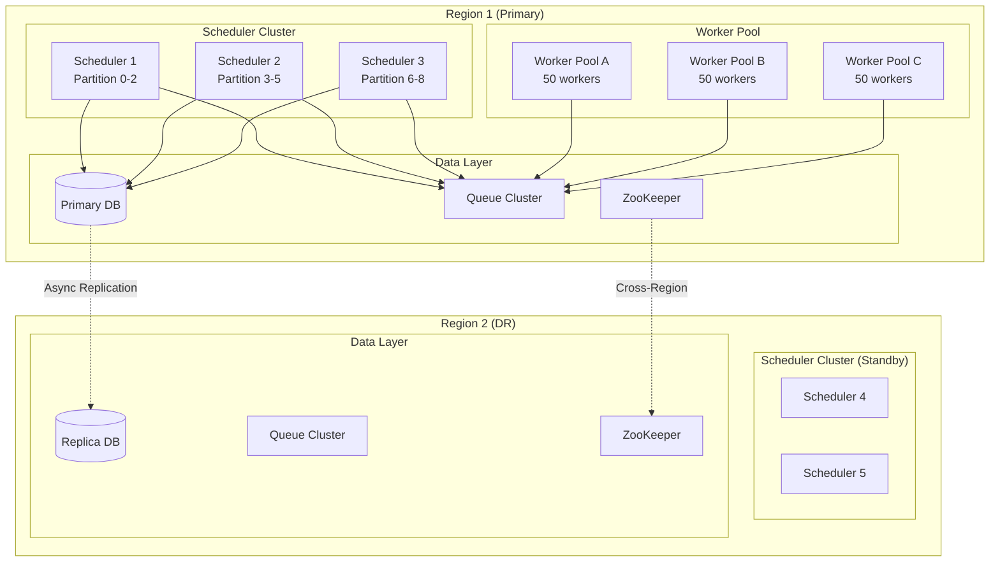
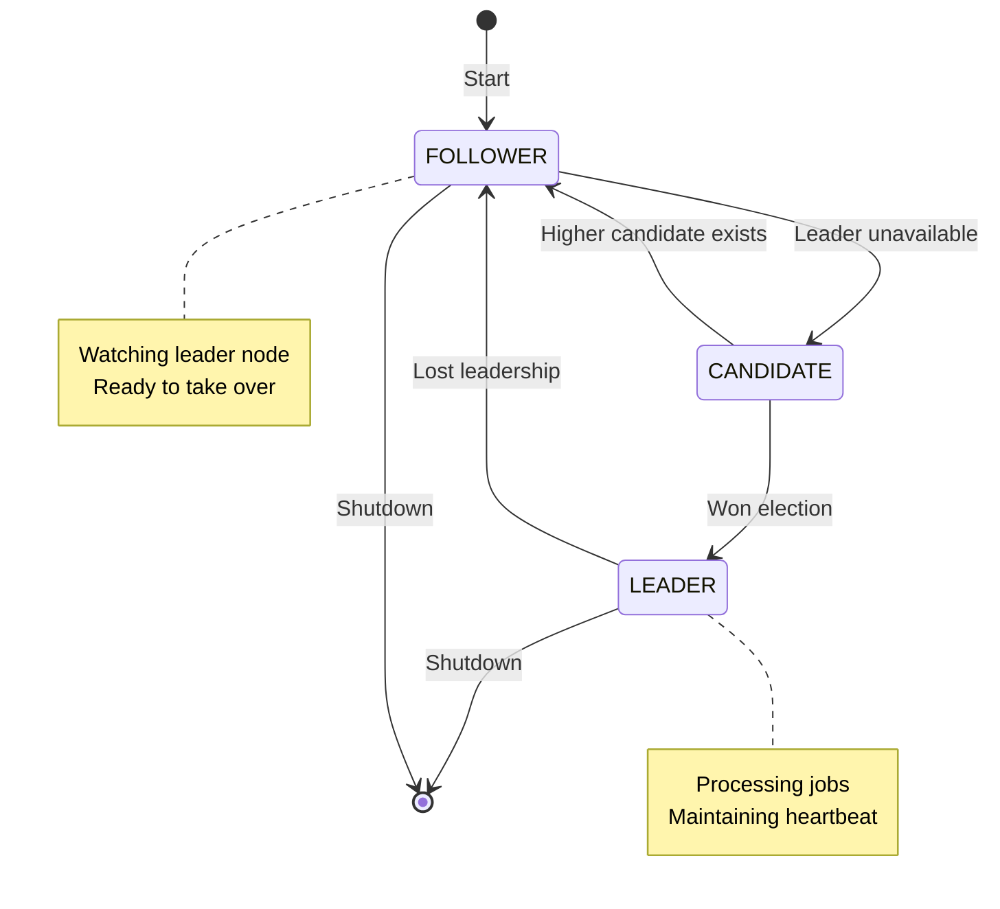
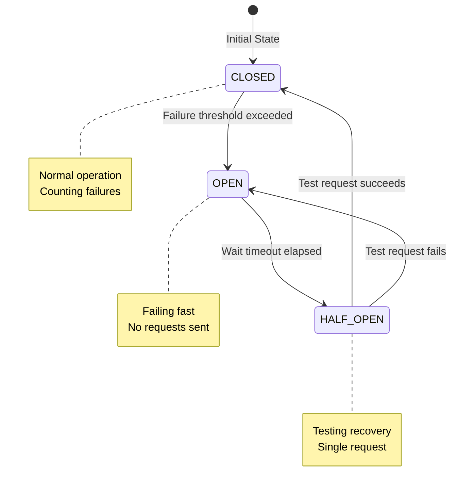
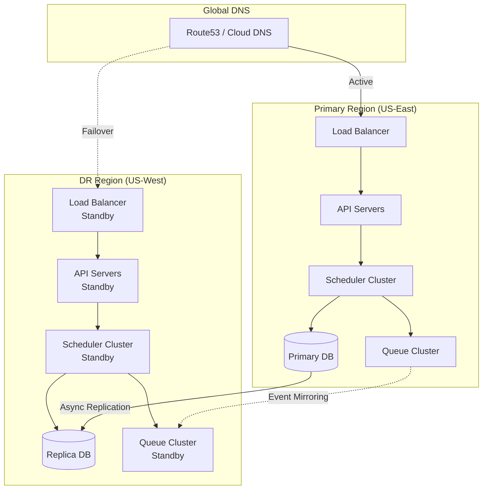

# Scalability & Reliability

[← Back to Deep Dive](./04-deep-dive-and-bottlenecks.md) | [Next: Security & Compliance →](./06-security-and-compliance.md)

---

## Scalability Strategies

### Horizontal Scaling Architecture



### Scheduler Scaling

**Single Leader to Partitioned Scaling:**

| Stage | Schedulers | Strategy | Jobs Supported |
|-------|------------|----------|----------------|
| **Stage 1** | 1 active + 2 standby | Leader-based | Up to 1M jobs |
| **Stage 2** | 3 active (partitioned) | Partition by job_id hash | Up to 5M jobs |
| **Stage 3** | 9 active (partitioned) | Partition by tenant + job_id | Up to 20M jobs |
| **Stage 4** | N active | Dynamic partitioning | Unlimited |

**Partitioning Strategies:**

```
Strategy 1: Job ID Hash Partitioning
- Partition = hash(job_id) % num_schedulers
- Even distribution
- Requires consistent hashing for rebalancing

Strategy 2: Tenant-Based Partitioning
- Partition = hash(tenant_id) % num_schedulers
- Tenant isolation
- Hot tenant can overload a partition

Strategy 3: Time-Based Partitioning
- Scheduler 1: next_run_time in [00:00, 08:00)
- Scheduler 2: next_run_time in [08:00, 16:00)
- Scheduler 3: next_run_time in [16:00, 24:00)
- Natural load distribution over day

Recommended: Tenant-based with overflow handling
```

### Worker Pool Scaling

**Auto-Scaling Configuration:**

```
AutoScaling Policy:
  min_workers: 50
  max_workers: 500
  target_utilization: 70%

  scale_up:
    trigger: queue_depth > 1000 OR worker_utilization > 80%
    action: add 20% more workers
    cooldown: 60 seconds

  scale_down:
    trigger: queue_depth < 100 AND worker_utilization < 40%
    action: remove 10% workers (graceful drain)
    cooldown: 300 seconds

  scheduled_scaling:
    - cron: "0 1 * * *"   # 1 AM daily batch
      min_workers: 200
    - cron: "0 6 * * *"   # Return to normal
      min_workers: 50
```

**Worker Pool Segmentation:**

```
Pool Configuration:
├── priority-high-pool
│   ├── Dedicated workers for P0 jobs
│   ├── Never scaled below minimum
│   └── Isolated queue partitions
│
├── standard-pool
│   ├── General job execution
│   ├── Auto-scaled based on demand
│   └── Shared queue partitions
│
├── long-running-pool
│   ├── Jobs > 1 hour duration
│   ├── Checkpointing enabled
│   └── Larger instance types
│
└── spot-pool
    ├── Cost-optimized instances
    ├── Interruptible workloads
    └── 2-minute warning handling
```

### Database Scaling

**Read Scaling:**

```
┌─────────────────┐
│   Primary DB    │──────┬──────────────────────────────────┐
│   (Writes)      │      │                                  │
└────────┬────────┘      │                                  │
         │               ▼                                  ▼
         │      ┌─────────────────┐              ┌─────────────────┐
         │      │   Read Replica  │              │   Read Replica  │
         │      │   (Status API)  │              │   (Analytics)   │
         │      └─────────────────┘              └─────────────────┘
         │
         ▼
┌─────────────────┐
│   Replica for   │
│   Scheduler     │
│   (Polling)     │
└─────────────────┘

Traffic Routing:
- Writes (job creation, status updates) → Primary
- Status queries → Read replicas
- Scheduler polling → Dedicated replica with low replication lag
- Analytics/reporting → Separate analytics replica
```

**Write Scaling (Sharding):**

```
Sharding Strategy: By Tenant ID

Shard Allocation:
├── Shard 0: tenant_id hash % 4 == 0
├── Shard 1: tenant_id hash % 4 == 1
├── Shard 2: tenant_id hash % 4 == 2
└── Shard 3: tenant_id hash % 4 == 3

Cross-Shard Considerations:
- Job queries within tenant: Single shard
- Global queries (admin): Fan-out to all shards
- DAG workflows: Must be on same shard (tenant-scoped)

Shard Router:
FUNCTION route_query(tenant_id, query):
    shard_id = hash(tenant_id) % num_shards
    connection = shard_connections[shard_id]
    RETURN connection.execute(query)
```

### Queue Scaling

```
Kafka Topic Configuration:
{
    "topic": "job-tasks",
    "partitions": 100,
    "replication_factor": 3,
    "retention_ms": 604800000,  // 7 days
    "min_insync_replicas": 2
}

Consumer Group Scaling:
- 1 consumer per partition maximum
- Scale workers to match partition count
- Rebalance on worker add/remove

Partition Strategy:
- Key: job_id (preserves per-job ordering)
- Distribution: Round-robin within key
```

---

## Reliability Strategies

### Leader Election with ZooKeeper



**ZooKeeper Election Implementation:**

```
Election Path: /scheduler/leader/candidates

Node Structure:
/scheduler/leader/candidates/scheduler_00000001  (ephemeral, sequential)
/scheduler/leader/candidates/scheduler_00000002  (ephemeral, sequential)
/scheduler/leader/candidates/scheduler_00000003  (ephemeral, sequential)

Leader Selection:
1. Each scheduler creates ephemeral sequential node
2. Lowest sequence number is leader
3. Others watch node immediately preceding them
4. If watched node deleted, re-evaluate leadership

Failover Timeline:
- Session timeout: 6 seconds (configurable)
- Watch notification: < 100ms
- Leadership acquisition: < 500ms
- Total failover: < 7 seconds
```

### Job Checkpointing

```
Checkpoint Strategy:

LEVEL 1: Execution State
- Store current progress percentage
- Resume from last known state
- Suitable for stateless transformations

LEVEL 2: Data Checkpoint
- Store intermediate data snapshots
- Resume processing from snapshot
- Suitable for data pipelines

LEVEL 3: Full State Checkpoint
- Serialize entire execution context
- Perfect resume capability
- Higher storage cost

Storage Location:
├── Small checkpoints (< 1 MB): Database JSONB
├── Medium checkpoints (1-100 MB): Object storage
└── Large checkpoints (> 100 MB): Distributed file system

Checkpoint Frequency:
- Time-based: Every 30 seconds
- Progress-based: Every 10% completion
- Event-based: After each significant operation
```

### Circuit Breakers



**Circuit Breaker Configuration:**

```
Circuit Breaker Settings:
{
    "failure_threshold": 5,        // Failures before opening
    "success_threshold": 3,        // Successes to close
    "timeout_seconds": 30,         // Time in open state
    "half_open_requests": 1,       // Test requests allowed

    "monitored_errors": [
        "TimeoutException",
        "ConnectionException",
        "ServiceUnavailableException"
    ]
}

Application Points:
├── Scheduler → Database: Prevent cascade on DB issues
├── Scheduler → Queue: Prevent pile-up on queue issues
├── Worker → External API: Protect external dependencies
└── DAG Executor → Task Dispatch: Prevent DAG flood
```

### Graceful Degradation

| Failure Scenario | Degradation Strategy | User Impact |
|------------------|---------------------|-------------|
| Database overloaded | Reject new jobs, continue executions | New jobs delayed |
| Queue unavailable | Buffer in local memory, retry | Slight delay |
| All workers down | Queue jobs, alert, wait for recovery | Jobs delayed |
| Scheduler down | Failover to standby | < 10s delay |
| External API down | Circuit break, retry later | Affected jobs fail |

**Degradation Levels:**

```
LEVEL 0: NORMAL
- All systems operational
- Full functionality

LEVEL 1: DEGRADED_WRITES
- Accept reads only
- Reject new job submissions
- Continue executing queued jobs

LEVEL 2: DEGRADED_PROCESSING
- Accept critical jobs only (P0)
- Pause P1/P2 jobs
- Reduce processing rate

LEVEL 3: MAINTENANCE
- Reject all new requests
- Complete in-flight executions
- Orderly shutdown

Automatic Transitions:
IF database_error_rate > 50%: LEVEL 1
IF queue_lag > 10 minutes: LEVEL 2
IF scheduler_unavailable: LEVEL 3 (manual recovery)
```

---

## Disaster Recovery

### Multi-Region Architecture



### Recovery Objectives

| Metric | Target | Description |
|--------|--------|-------------|
| **RPO** | 1 minute | Maximum data loss on failure |
| **RTO** | 5 minutes | Time to restore service |
| **MTTR** | 30 minutes | Mean time to full recovery |

### Failover Procedures

**Automatic Failover (Database):**

```
Trigger: Primary database unreachable for 30 seconds

Steps:
1. Health check fails 3 consecutive times (10s each)
2. Promote read replica to primary
3. Update connection strings via service discovery
4. Schedulers reconnect automatically
5. Alert operations team

Validation:
- Verify no split-brain (old primary fenced)
- Confirm replication caught up
- Test write operations
```

**Manual Regional Failover:**

```
Trigger: Entire primary region unavailable

Steps:
1. Confirm primary region is truly down (not network issue)
2. Update DNS to point to DR region
3. Promote DR database replica to primary
4. Activate DR scheduler cluster
5. Verify job processing resumes
6. Monitor for duplicate executions (idempotency handles)

Runbook Time: 15-30 minutes
```

### Backup Strategy

```
Backup Schedule:
├── Continuous: Transaction log shipping (1-minute RPO)
├── Hourly: Incremental database backup
├── Daily: Full database backup + verification
└── Weekly: Cross-region backup replication test

Retention:
├── Transaction logs: 7 days
├── Hourly backups: 7 days
├── Daily backups: 30 days
└── Weekly backups: 1 year

Recovery Testing:
- Monthly: Restore backup to test environment
- Quarterly: Full DR failover drill
- Annually: Chaos engineering exercise
```

---

## Capacity Planning

### Growth Projections

| Year | Jobs | Executions/Day | Workers | Database Size |
|------|------|----------------|---------|---------------|
| Y1 | 10M | 34M | 200 | 10 TB |
| Y2 | 25M | 85M | 500 | 25 TB |
| Y3 | 50M | 170M | 1,000 | 50 TB |

### Scaling Triggers

| Metric | Threshold | Action |
|--------|-----------|--------|
| Scheduler CPU | > 70% sustained | Add scheduler partition |
| Queue depth | > 10,000 for 5 min | Scale workers |
| DB connections | > 80% pool | Add read replicas |
| Storage usage | > 70% capacity | Expand storage |
| Execution latency P99 | > 30 seconds | Investigate bottleneck |

### Cost Optimization

```
Cost Reduction Strategies:

1. Spot/Preemptible Workers
   - Use for non-critical P2 jobs
   - 60-70% cost savings
   - Handle 2-minute termination warnings

2. Right-Sizing
   - Monitor actual resource usage
   - Downsize over-provisioned instances
   - Use burstable instances for variable load

3. Reserved Capacity
   - Reserve baseline worker capacity
   - Use on-demand for peak scaling
   - 1-year or 3-year commitments

4. Storage Tiering
   - Hot: Recent 7 days (SSD)
   - Warm: 8-30 days (Standard)
   - Cold: 31-90 days (Archive)
   - Glacier: > 90 days (Deep archive)

5. Execution Optimization
   - Consolidate similar jobs
   - Batch small jobs together
   - Optimize job timeout settings
```

---

## Reliability Checklist

### Pre-Production

- [ ] Leader election tested with failover
- [ ] Database replica promotion tested
- [ ] Queue failover tested
- [ ] Circuit breakers configured and tested
- [ ] Graceful shutdown implemented
- [ ] Checkpointing tested for long jobs
- [ ] Idempotency verified for all job types

### Production Readiness

- [ ] Multi-AZ deployment configured
- [ ] DR region provisioned and tested
- [ ] Backup and restore procedures documented
- [ ] Runbooks for common failures
- [ ] On-call rotation established
- [ ] Monitoring and alerting configured
- [ ] Chaos engineering tests scheduled

---

**Next:** [Security & Compliance →](./06-security-and-compliance.md)
