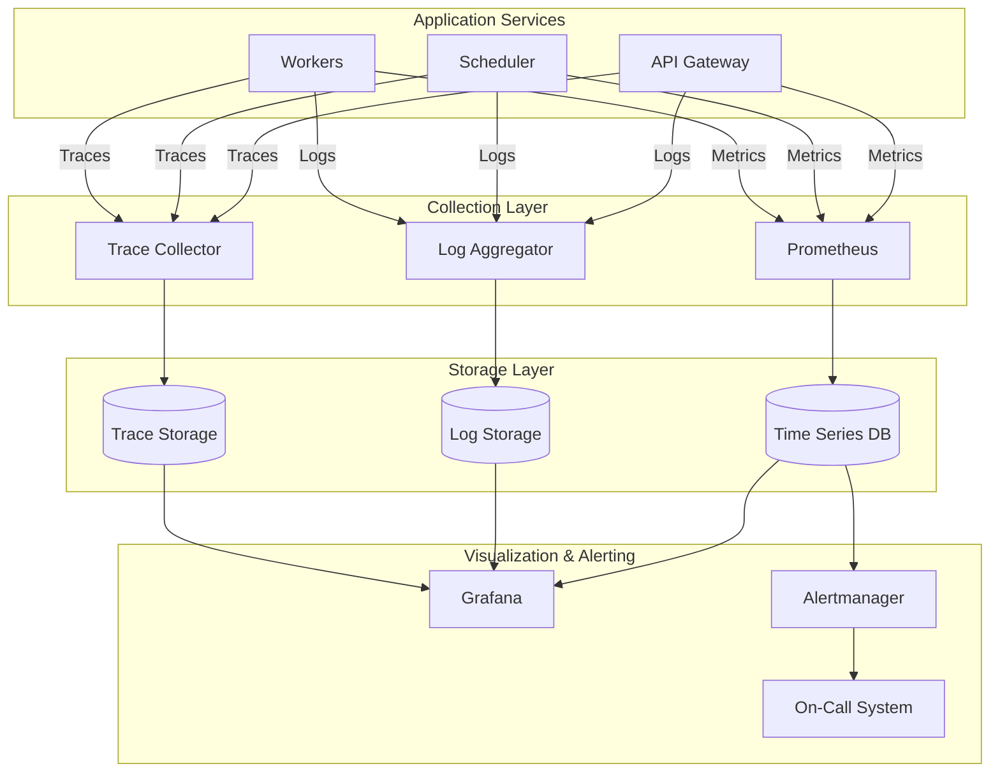
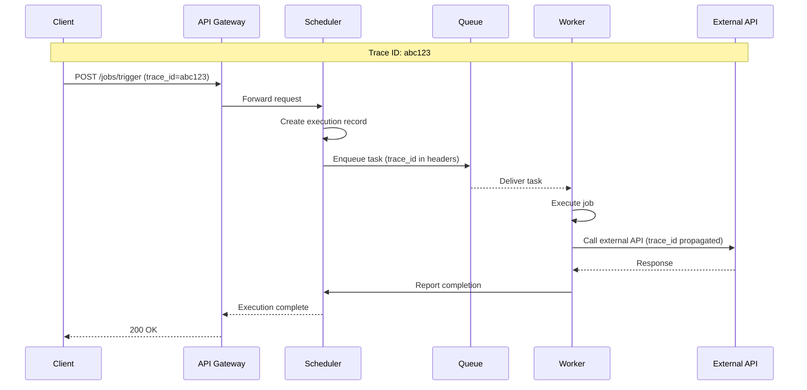

# Observability

[← Back to Security](./06-security-and-compliance.md) | [Next: Interview Guide →](./08-interview-guide.md)

---

## Observability Architecture



---

## Metrics

### Key Metrics Overview

| Category | Metric | Type | Description |
|----------|--------|------|-------------|
| **Throughput** | jobs_dispatched_total | Counter | Total jobs dispatched |
| **Throughput** | executions_completed_total | Counter | Completed executions by status |
| **Latency** | scheduling_latency_seconds | Histogram | Time from due to dispatch |
| **Latency** | execution_duration_seconds | Histogram | Job execution time |
| **Errors** | dispatch_failures_total | Counter | Failed dispatch attempts |
| **Saturation** | queue_depth | Gauge | Current queue size |
| **Saturation** | worker_utilization | Gauge | Worker capacity usage |

### Scheduler Metrics

```
# Scheduling performance
scheduler_polling_duration_seconds{scheduler_id}
scheduler_jobs_polled_total{scheduler_id}
scheduler_jobs_dispatched_total{scheduler_id, priority}
scheduler_dispatch_latency_seconds{scheduler_id}

# Leadership
scheduler_is_leader{scheduler_id}  # 1 = leader, 0 = follower
scheduler_leadership_transitions_total{scheduler_id}

# Health
scheduler_heartbeat_timestamp{scheduler_id}
scheduler_db_connection_errors_total{scheduler_id}
scheduler_queue_connection_errors_total{scheduler_id}

# Backlog
scheduler_overdue_jobs_count{scheduler_id}  # Jobs past their schedule time
scheduler_scheduling_lag_seconds{scheduler_id}  # Oldest unprocessed due job
```

### Worker Metrics

```
# Execution
worker_tasks_received_total{worker_id, pool}
worker_tasks_completed_total{worker_id, pool, status}
worker_execution_duration_seconds{worker_id, pool, job_type}

# Capacity
worker_concurrent_executions{worker_id, pool}  # Current running
worker_max_concurrent_executions{worker_id, pool}  # Configured limit
worker_utilization_percent{worker_id, pool}

# Health
worker_heartbeat_timestamp{worker_id, pool}
worker_last_task_completed_timestamp{worker_id, pool}
worker_checkpoint_success_total{worker_id, pool}
worker_checkpoint_failures_total{worker_id, pool}

# Resources
worker_cpu_usage_percent{worker_id, pool}
worker_memory_usage_bytes{worker_id, pool}
```

### Queue Metrics

```
# Depth
queue_depth{queue_name, partition}
queue_depth_by_priority{queue_name, priority}

# Throughput
queue_messages_enqueued_total{queue_name}
queue_messages_dequeued_total{queue_name}
queue_messages_acknowledged_total{queue_name}
queue_messages_rejected_total{queue_name}

# Latency
queue_message_age_seconds{queue_name}  # Time since oldest message enqueued
queue_consumer_lag_messages{queue_name, consumer_group}

# Health
queue_partitions_healthy{queue_name}
queue_replication_lag_bytes{queue_name}
```

### API Metrics

```
# Request volume
api_requests_total{method, endpoint, status_code}
api_request_duration_seconds{method, endpoint}

# Rate limiting
api_rate_limit_exceeded_total{tenant_id, endpoint}

# Authentication
api_auth_success_total{method}
api_auth_failure_total{method, reason}
```

### Golden Signals Dashboard

```
┌─────────────────────────────────────────────────────────────────┐
│                    JOB SCHEDULER DASHBOARD                      │
├─────────────────────────────────────────────────────────────────┤
│                                                                 │
│  LATENCY (P99)          TRAFFIC              ERROR RATE         │
│  ┌───────────────┐     ┌───────────────┐    ┌───────────────┐  │
│  │   45ms        │     │   4,200/s     │    │   0.02%       │  │
│  │   ▲ 5ms       │     │   ▲ 200/s     │    │   ▼ 0.01%     │  │
│  └───────────────┘     └───────────────┘    └───────────────┘  │
│                                                                 │
│  SATURATION                                                     │
│  ┌─────────────────────────────────────────────────────────┐   │
│  │ Queue Depth: 234 ████░░░░░░░░░░░░░░░░░░░░░░░░░░░ 2.3%   │   │
│  │ Workers:     127/200 ██████████████████░░░░░░░░░░ 63.5% │   │
│  │ DB Conn:     45/100 █████████░░░░░░░░░░░░░░░░░░░░ 45.0% │   │
│  └─────────────────────────────────────────────────────────┘   │
│                                                                 │
│  JOBS TREND (24h)                                               │
│  ┌─────────────────────────────────────────────────────────┐   │
│  │    ▲                            ▲▲                       │   │
│  │   ███                          ████                      │   │
│  │  █████      █                 ██████                     │   │
│  │ ███████   █████     ███     █████████                    │   │
│  │█████████████████████████████████████████████████████████ │   │
│  └─────────────────────────────────────────────────────────┘   │
│    00:00    04:00    08:00    12:00    16:00    20:00    24:00 │
│                                                                 │
└─────────────────────────────────────────────────────────────────┘
```

---

## Logging

### Log Levels

| Level | Usage | Examples |
|-------|-------|----------|
| **ERROR** | Failures requiring attention | Job execution failed, DB connection lost |
| **WARN** | Degraded but operational | Retry triggered, slow query detected |
| **INFO** | Significant events | Job dispatched, execution completed |
| **DEBUG** | Detailed debugging | State transitions, intermediate results |

### Structured Log Format

```
{
    "timestamp": "2024-01-15T10:30:00.123Z",
    "level": "INFO",
    "service": "scheduler",
    "instance_id": "scheduler-1",
    "trace_id": "abc123def456",
    "span_id": "789xyz",
    "event": "job_dispatched",
    "message": "Job dispatched to queue",
    "context": {
        "job_id": "job-12345",
        "execution_id": "exec-67890",
        "tenant_id": "tenant-abc",
        "queue": "priority-normal",
        "scheduled_time": "2024-01-15T10:30:00Z",
        "dispatch_latency_ms": 45
    }
}
```

### Log Patterns by Component

**Scheduler Logs:**
```
[INFO]  job_polled        job_id=X next_run_time=Y
[INFO]  job_dispatched    job_id=X execution_id=Y queue=Z latency_ms=N
[WARN]  dispatch_retry    job_id=X attempt=N error="..."
[ERROR] dispatch_failed   job_id=X error="..." after_attempts=N
[INFO]  leadership_acquired scheduler_id=X
[WARN]  leadership_lost   scheduler_id=X reason="..."
```

**Worker Logs:**
```
[INFO]  task_received     execution_id=X job_id=Y worker_id=Z
[INFO]  task_started      execution_id=X job_id=Y
[DEBUG] checkpoint_saved  execution_id=X progress=N%
[INFO]  task_completed    execution_id=X duration_ms=N status=SUCCESS
[WARN]  task_timeout      execution_id=X duration_ms=N limit_ms=M
[ERROR] task_failed       execution_id=X error="..." attempt=N
```

**DAG Executor Logs:**
```
[INFO]  dag_triggered     dag_id=X dag_run_id=Y
[INFO]  task_ready        dag_run_id=X task_id=Y
[INFO]  task_dispatched   dag_run_id=X task_id=Y execution_id=Z
[INFO]  task_completed    dag_run_id=X task_id=Y
[ERROR] task_failed       dag_run_id=X task_id=Y error="..."
[INFO]  dag_completed     dag_run_id=X status=SUCCESS duration_ms=N
[ERROR] dag_failed        dag_run_id=X failed_task=Y
```

### Log Aggregation Query Examples

```
# Find all logs for a specific execution
execution_id:"exec-67890"

# Find failed executions in last hour
level:ERROR AND event:task_failed AND @timestamp:[now-1h TO now]

# Find slow dispatches (> 100ms)
event:job_dispatched AND dispatch_latency_ms:>100

# Find jobs that timed out
event:task_timeout AND tenant_id:"tenant-abc"

# Trace a complete execution lifecycle
trace_id:"abc123def456" | sort @timestamp
```

---

## Distributed Tracing

### Trace Propagation



### Span Structure

```
Trace: abc123
│
├── Span: api_request (root)
│   ├── service: api-gateway
│   ├── duration: 250ms
│   └── attributes: {method: POST, endpoint: /jobs/trigger}
│
├── Span: schedule_job
│   ├── service: scheduler
│   ├── duration: 45ms
│   └── attributes: {job_id: X, execution_id: Y}
│
├── Span: queue_enqueue
│   ├── service: scheduler
│   ├── duration: 12ms
│   └── attributes: {queue: priority-normal, partition: 5}
│
├── Span: task_execution
│   ├── service: worker
│   ├── duration: 180ms
│   └── attributes: {worker_id: W, attempt: 1}
│
└── Span: external_api_call
    ├── service: worker
    ├── duration: 95ms
    └── attributes: {url: https://api.example.com, status: 200}
```

### Tracing Configuration

```
Sampling Strategy:
├── Always sample errors
├── Always sample slow executions (> P95)
├── Always sample new job types (first 100 executions)
├── Probabilistic: 1% of normal traffic

Trace Context Headers:
├── traceparent: 00-{trace_id}-{span_id}-{flags}
├── tracestate: scheduler=abc123
└── X-Correlation-ID: {execution_id}

Retention:
├── Error traces: 30 days
├── Slow traces: 14 days
├── Normal traces: 7 days
```

---

## Alerting

### Alert Definitions

| Alert | Condition | Severity | Action |
|-------|-----------|----------|--------|
| **SchedulerDown** | No heartbeat for 30s | Critical | Page on-call |
| **HighDispatchLatency** | P99 > 1s for 5m | Warning | Investigate |
| **QueueBacklog** | Depth > 10000 for 10m | Warning | Scale workers |
| **HighFailureRate** | Failure rate > 5% for 5m | Critical | Page on-call |
| **WorkerPoolLow** | < 20% workers healthy | Critical | Page on-call |
| **DatabaseConnectionExhausted** | > 90% connections used | Warning | Investigate |
| **MissedJobs** | Overdue jobs > 100 | Critical | Page on-call |

### Alert Configuration (Prometheus Rules)

```yaml
groups:
  - name: scheduler_alerts
    rules:
      - alert: SchedulerLeaderUnavailable
        expr: sum(scheduler_is_leader) == 0
        for: 30s
        labels:
          severity: critical
        annotations:
          summary: "No scheduler leader elected"
          description: "No scheduler instance is currently leader. Jobs are not being dispatched."

      - alert: HighJobDispatchLatency
        expr: histogram_quantile(0.99, rate(scheduler_dispatch_latency_seconds_bucket[5m])) > 1
        for: 5m
        labels:
          severity: warning
        annotations:
          summary: "Job dispatch latency is high"
          description: "P99 dispatch latency is {{ $value }}s (threshold: 1s)"

      - alert: JobExecutionFailureRate
        expr: |
          rate(worker_tasks_completed_total{status="FAILED"}[5m])
          /
          rate(worker_tasks_completed_total[5m]) > 0.05
        for: 5m
        labels:
          severity: critical
        annotations:
          summary: "High job failure rate"
          description: "Job failure rate is {{ $value | humanizePercentage }}"

      - alert: QueueBacklogGrowing
        expr: queue_depth > 10000 AND delta(queue_depth[10m]) > 0
        for: 10m
        labels:
          severity: warning
        annotations:
          summary: "Queue backlog is growing"
          description: "Queue {{ $labels.queue_name }} has {{ $value }} messages"

      - alert: MissedScheduledJobs
        expr: scheduler_overdue_jobs_count > 100
        for: 2m
        labels:
          severity: critical
        annotations:
          summary: "Jobs are not being scheduled on time"
          description: "{{ $value }} jobs are past their scheduled time"
```

### Escalation Policy

```
Severity: CRITICAL
├── 0 min: Alert fires → Slack #alerts-critical
├── 5 min: No ack → Page primary on-call (PagerDuty)
├── 15 min: No ack → Page secondary on-call
├── 30 min: No ack → Page engineering manager
└── 60 min: No resolution → Incident declared

Severity: WARNING
├── 0 min: Alert fires → Slack #alerts-warning
├── 30 min: No ack → Page primary on-call
└── 2 hours: Auto-resolve if condition clears

Severity: INFO
├── 0 min: Alert fires → Slack #alerts-info
└── 24 hours: Auto-archive
```

---

## Health Checks

### Endpoint Definitions

```
GET /health/live
Response: 200 OK if process is running
Use: Kubernetes liveness probe

GET /health/ready
Response: 200 OK if accepting traffic
Use: Kubernetes readiness probe

GET /health/status
Response: Detailed component status
Use: Monitoring dashboards

Example /health/status response:
{
    "status": "HEALTHY",
    "timestamp": "2024-01-15T10:30:00Z",
    "components": {
        "database": {
            "status": "HEALTHY",
            "latency_ms": 5
        },
        "queue": {
            "status": "HEALTHY",
            "depth": 234
        },
        "coordination": {
            "status": "HEALTHY",
            "is_leader": true
        }
    },
    "version": "1.2.3",
    "uptime_seconds": 86400
}
```

### Dependency Checks

| Dependency | Check | Healthy Threshold |
|------------|-------|-------------------|
| Database | SELECT 1 | < 100ms |
| Queue | Producer/consumer test | < 500ms |
| Coordination | Session active | Session valid |
| Secret Store | Fetch test secret | < 200ms |

---

## Runbook Examples

### High Queue Depth

```
SYMPTOM: queue_depth > 10000 for > 10 minutes

INVESTIGATION:
1. Check worker health
   $ kubectl get pods -l app=worker -o wide
   → Are all workers running?

2. Check worker metrics
   → worker_utilization_percent should be < 90%
   → If 100%, workers are overloaded

3. Check for poison messages
   → Look for repeated failures on same execution_id
   → Check dead letter queue depth

4. Check downstream dependencies
   → Are external APIs responding?
   → Check circuit breaker states

REMEDIATION:
1. If workers overloaded:
   $ kubectl scale deployment worker --replicas=200
   → Monitor queue_depth decreasing

2. If poison message:
   → Move message to dead letter queue
   → Investigate job configuration

3. If downstream issue:
   → Circuit breaker should auto-trip
   → Pause affected jobs if needed
```

### Scheduler Leader Not Elected

```
SYMPTOM: sum(scheduler_is_leader) == 0

INVESTIGATION:
1. Check scheduler pod status
   $ kubectl get pods -l app=scheduler
   → Are pods running? Any CrashLoopBackOff?

2. Check coordination service
   $ kubectl exec -it zookeeper-0 -- zkCli.sh
   > ls /scheduler/leader/candidates
   → Are candidates registered?

3. Check scheduler logs
   $ kubectl logs -l app=scheduler --tail=100
   → Look for connection errors to ZooKeeper

REMEDIATION:
1. If schedulers not registering:
   → Check ZooKeeper connectivity
   → Restart scheduler pods

2. If ZooKeeper issue:
   → Check ZooKeeper cluster health
   → Verify quorum (need 2 of 3)

3. If network partition:
   → Check network policies
   → Verify DNS resolution
```

---

## SLI/SLO Summary

| SLI | Measurement | SLO Target |
|-----|-------------|------------|
| Availability | Successful API requests / Total requests | 99.99% |
| Scheduling Accuracy | Jobs dispatched within 60s of schedule | 99.999% |
| Execution Latency | P99 time from schedule to completion | < 5 minutes |
| Error Rate | Failed executions / Total executions | < 0.1% |

---

**Next:** [Interview Guide →](./08-interview-guide.md)
