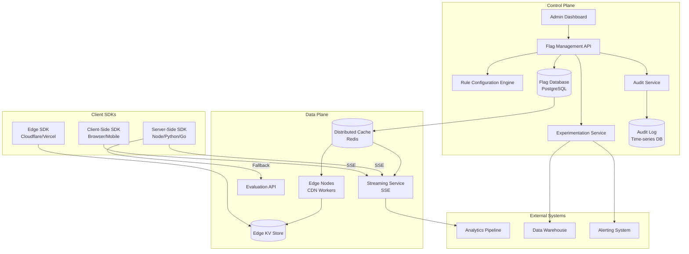
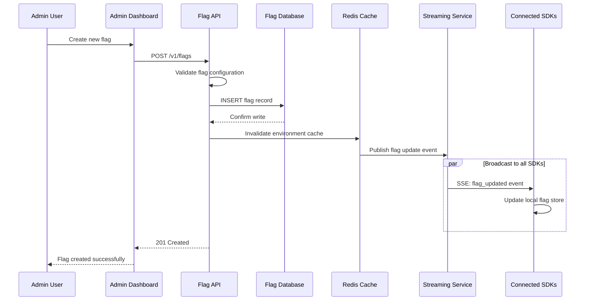
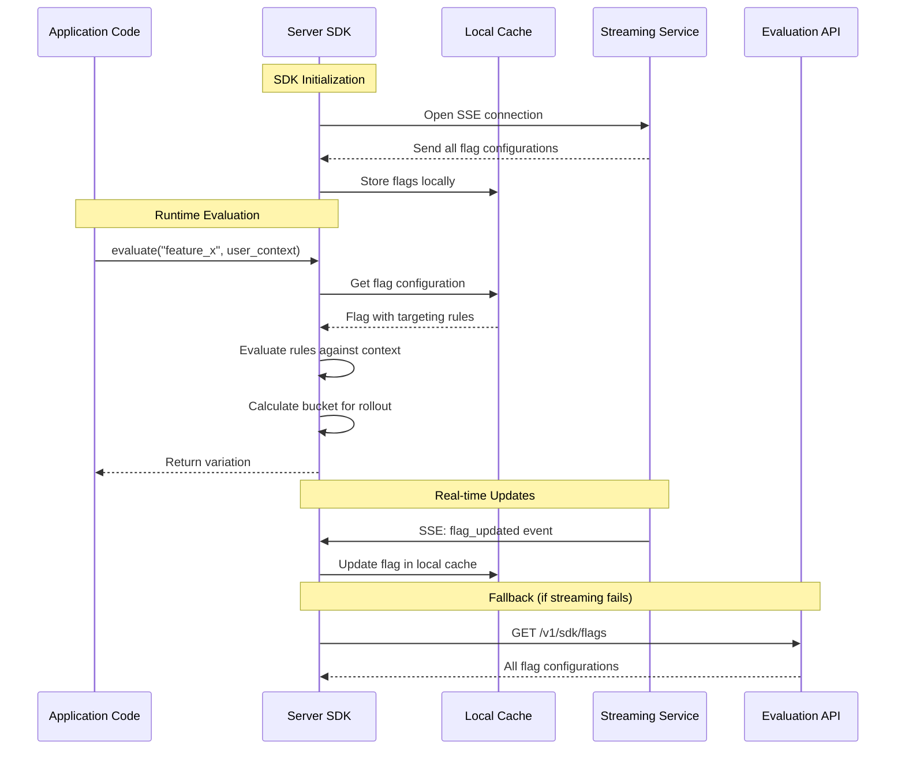
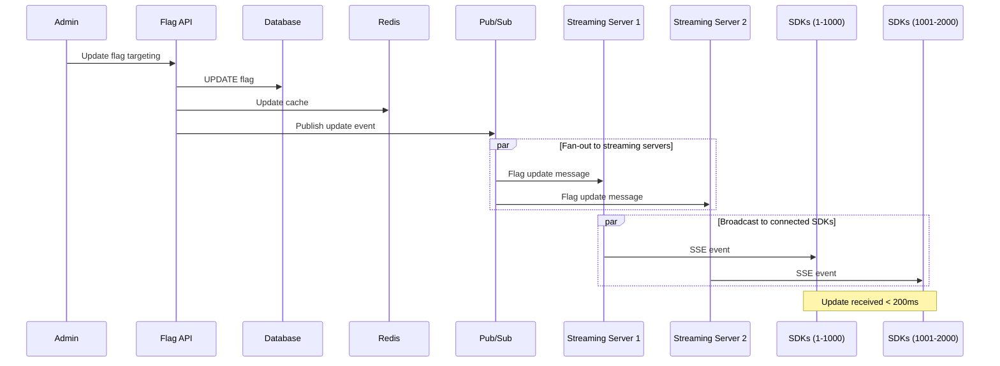
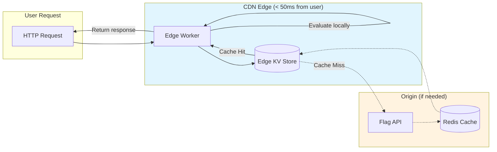
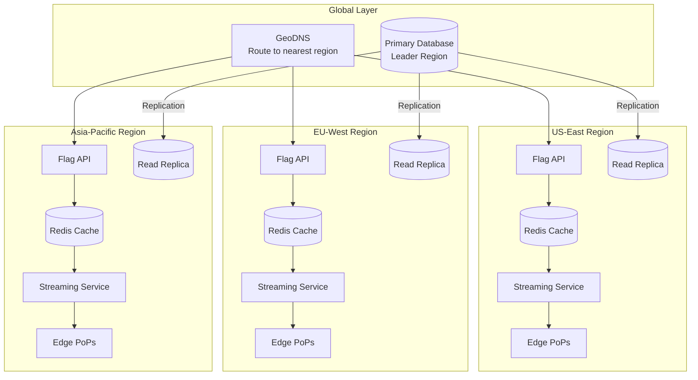

# High-Level Design

[← Back to Index](./00-index.md)

---

## System Architecture

The Feature Flag Management System follows a **Control Plane / Data Plane** separation pattern, similar to Kubernetes architecture. The Control Plane handles flag management and configuration, while the Data Plane handles high-throughput flag evaluation and distribution.



---

## Component Overview

### Control Plane Components

| Component | Responsibility | Technology Options |
|-----------|---------------|-------------------|
| **Admin Dashboard** | Web UI for flag management | React, Vue |
| **Flag Management API** | CRUD operations, validation | REST/GraphQL API |
| **Rule Configuration Engine** | Targeting rule compilation | Custom rule engine |
| **Audit Service** | Change tracking, compliance | Event sourcing |
| **Experimentation Service** | A/B test analysis, statistics | Bayesian/Frequentist engine |
| **Flag Database** | Primary flag storage | PostgreSQL (strong consistency) |

### Data Plane Components

| Component | Responsibility | Technology Options |
|-----------|---------------|-------------------|
| **Streaming Service** | Real-time flag distribution | SSE server (Go/Rust) |
| **Evaluation API** | Server-side flag evaluation | Stateless API |
| **Distributed Cache** | Flag data caching | Redis Cluster |
| **Edge Nodes** | CDN-based evaluation | Cloudflare Workers, Vercel Edge |
| **Edge KV Store** | Flag data at edge | Cloudflare KV, DynamoDB Global Tables |

---

## Data Flow: Flag Creation



---

## Data Flow: Flag Evaluation (Server SDK)



---

## Data Flow: Real-time Update Propagation



---

## Data Flow: Edge Evaluation



---

## Key Architectural Decisions

### Decision 1: Server-Side vs Client-Side Evaluation

| Aspect | Server-Side SDK | Client-Side SDK | Recommendation |
|--------|-----------------|-----------------|----------------|
| **Latency** | Network hop (10-50ms) | Local (< 1ms) | Client-side for web/mobile |
| **Context** | Full server context | Limited client context | Depends on targeting needs |
| **Security** | Rules stay on server | Rules exposed to client | Server-side for sensitive flags |
| **Offline** | Requires network | Works offline (cached) | Client-side more resilient |
| **Memory** | Server manages | Client memory used | Consider mobile constraints |

**Recommendation:** Use client-side SDKs for web/mobile apps (latency critical), server-side for API services (security critical).

### Decision 2: Push (SSE) vs Pull (Polling)

| Aspect | SSE Streaming (Push) | Polling (Pull) | Recommendation |
|--------|---------------------|----------------|----------------|
| **Latency** | Real-time (< 200ms) | Polling interval (30s+) | SSE for real-time |
| **Connection** | Persistent | Stateless | SSE preferred |
| **Scalability** | Connection limits | Simpler scaling | Hybrid approach |
| **Firewall** | May be blocked | Always works | Polling as fallback |
| **Battery** | Better (no polling) | Worse (constant polling) | SSE for mobile |

**Recommendation:** SSE streaming as primary with polling fallback. LaunchDarkly reports 10x improvement with streaming.

### Decision 3: Edge vs Origin Evaluation

| Aspect | Edge Evaluation | Origin Evaluation | Recommendation |
|--------|-----------------|-------------------|----------------|
| **Latency** | < 10ms (edge close to user) | 50-200ms (origin far) | Edge for global apps |
| **Freshness** | Eventually consistent | Always fresh | Origin for critical consistency |
| **Cost** | Higher (edge compute) | Lower | Origin for cost-sensitive |
| **Complexity** | Higher (sync required) | Simpler | Start with origin |

**Recommendation:** Use edge evaluation for latency-critical global applications; origin for simpler deployments.

### Decision 4: Evaluation Location Architecture

| Pattern | Description | Use Case |
|---------|-------------|----------|
| **SDK Local** | All evaluation in SDK | Standard web/mobile apps |
| **Relay Proxy** | Self-hosted proxy | Air-gapped environments |
| **Edge Workers** | CDN-based evaluation | Global latency optimization |
| **API Evaluation** | Server returns value | Simple integrations |

---

## Multi-Region Architecture



---

## Failure Modes and Mitigations

| Failure | Impact | Mitigation |
|---------|--------|------------|
| **Control Plane Down** | Cannot modify flags | SDKs continue with cached flags; changes queue |
| **Streaming Service Down** | No real-time updates | Polling fallback (30s interval) |
| **Database Down** | No flag persistence | Read from cache; queue writes |
| **Cache Down** | Slower reads | Direct database reads; SDK local cache |
| **Edge Down** | Higher latency | Fall back to regional origin |
| **Network Partition** | Regional isolation | Local cache serves stale data with TTL |

### Graceful Degradation Levels

```
Level 0: Full Operation
├── Real-time streaming active
├── All targeting rules evaluated
└── Full experimentation

Level 1: Degraded (Streaming Down)
├── Polling every 30 seconds
├── Updates delayed but working
└── Experiments continue

Level 2: Limited (API Down)
├── SDK uses cached flags only
├── No new flag updates received
└── Experiments paused for new users

Level 3: Minimal (Cache Expired)
├── Return default values only
├── No targeting, all users same
└── Application continues working
```

---

## Integration Points

| System | Integration | Purpose |
|--------|-------------|---------|
| **Analytics Platforms** | Evaluation events export | Track flag usage, funnel analysis |
| **Data Warehouse** | Experiment data export | Statistical analysis, reporting |
| **CI/CD Pipelines** | API integration | Automate flag management in deploys |
| **Incident Management** | Webhook notifications | Alert on flag changes, experiments |
| **APM Tools** | SDK instrumentation | Performance monitoring |

---

## Technology Stack Summary

| Layer | Component | Technology | Rationale |
|-------|-----------|------------|-----------|
| **Control Plane** | API | Go/Rust | Performance, concurrency |
| **Control Plane** | Database | PostgreSQL | Strong consistency, ACID |
| **Data Plane** | Streaming | Go (SSE) | Connection efficiency |
| **Data Plane** | Cache | Redis Cluster | Low latency, pub/sub |
| **Edge** | Workers | V8 Isolates | Fast cold start, global |
| **Edge** | Storage | KV Store | Global replication |
| **SDKs** | Server | Native (Go/Python/Node) | Performance |
| **SDKs** | Client | JavaScript/Swift/Kotlin | Platform support |

---

## High-Level Design Checklist

- [x] Control Plane / Data Plane separation
- [x] Server-side and client-side SDK support
- [x] Real-time streaming with polling fallback
- [x] Edge evaluation capability
- [x] Multi-region deployment
- [x] Graceful degradation modes
- [x] Audit trail for compliance
- [x] Experimentation integration

---

**Next:** [Low-Level Design →](./03-low-level-design.md)
