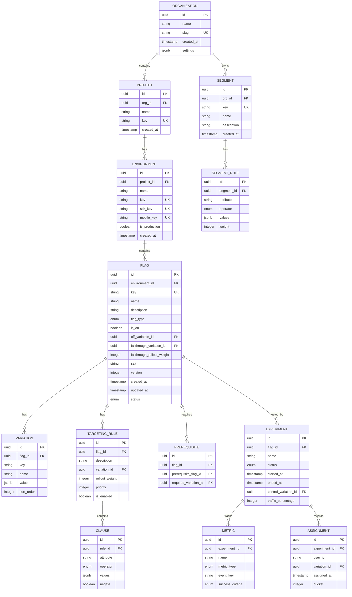
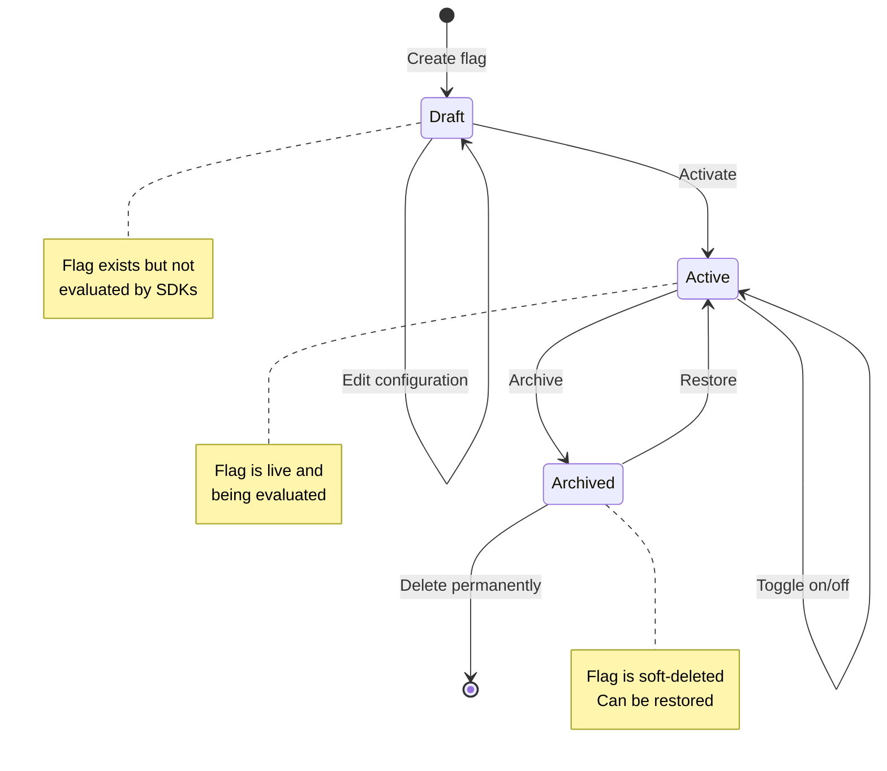
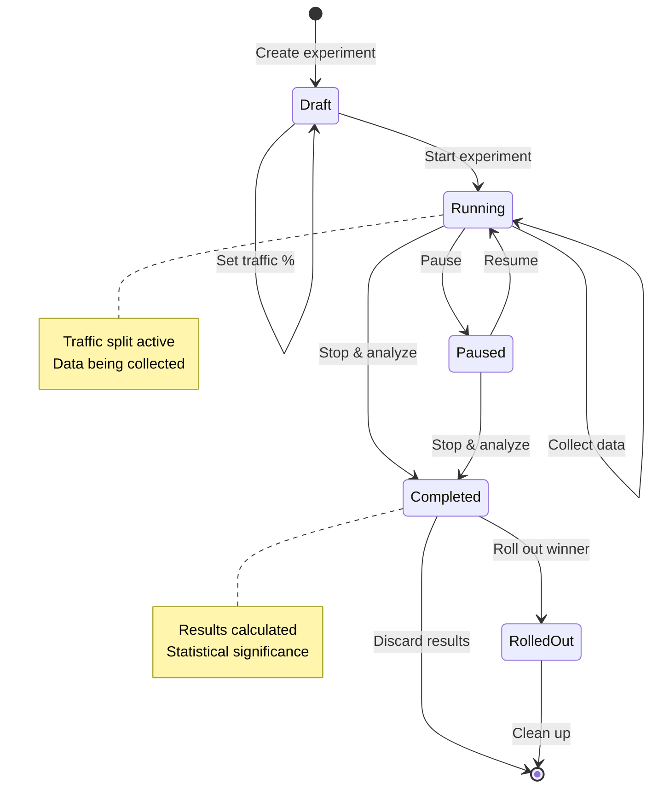
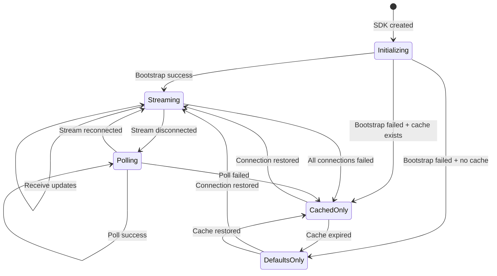
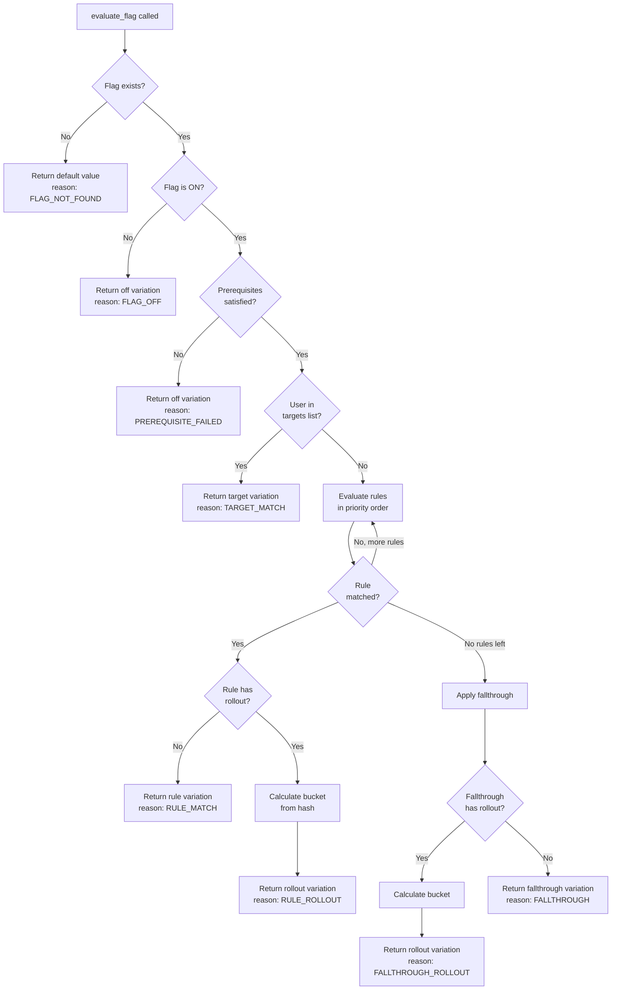

# Low-Level Design

[← Back to Index](./00-index.md)

---

## Data Model

### Entity Relationship Diagram



---

## Core Table Schemas

### Flags Table

```sql
CREATE TABLE flags (
    id              UUID PRIMARY KEY DEFAULT gen_random_uuid(),
    environment_id  UUID NOT NULL REFERENCES environments(id),
    key             VARCHAR(255) NOT NULL,
    name            VARCHAR(255) NOT NULL,
    description     TEXT,
    flag_type       flag_type_enum NOT NULL DEFAULT 'boolean',
    is_on           BOOLEAN NOT NULL DEFAULT false,
    off_variation_id UUID REFERENCES variations(id),
    fallthrough_variation_id UUID REFERENCES variations(id),
    fallthrough_rollout_weights JSONB, -- [{variation_id, weight}]
    salt            VARCHAR(64) NOT NULL DEFAULT encode(gen_random_bytes(32), 'hex'),
    version         INTEGER NOT NULL DEFAULT 1,
    status          flag_status_enum NOT NULL DEFAULT 'active',
    created_at      TIMESTAMP WITH TIME ZONE DEFAULT NOW(),
    updated_at      TIMESTAMP WITH TIME ZONE DEFAULT NOW(),
    archived_at     TIMESTAMP WITH TIME ZONE,

    UNIQUE(environment_id, key),
    INDEX idx_flags_env_status (environment_id, status),
    INDEX idx_flags_updated (updated_at)
);

CREATE TYPE flag_type_enum AS ENUM ('boolean', 'string', 'number', 'json');
CREATE TYPE flag_status_enum AS ENUM ('active', 'archived');
```

### Variations Table

```sql
CREATE TABLE variations (
    id          UUID PRIMARY KEY DEFAULT gen_random_uuid(),
    flag_id     UUID NOT NULL REFERENCES flags(id) ON DELETE CASCADE,
    key         VARCHAR(255) NOT NULL,
    name        VARCHAR(255),
    value       JSONB NOT NULL,
    sort_order  INTEGER NOT NULL DEFAULT 0,

    UNIQUE(flag_id, key),
    INDEX idx_variations_flag (flag_id)
);
```

### Targeting Rules Table

```sql
CREATE TABLE targeting_rules (
    id              UUID PRIMARY KEY DEFAULT gen_random_uuid(),
    flag_id         UUID NOT NULL REFERENCES flags(id) ON DELETE CASCADE,
    description     TEXT,
    variation_id    UUID REFERENCES variations(id),
    rollout_weights JSONB, -- [{variation_id, weight}] for percentage rollout
    priority        INTEGER NOT NULL DEFAULT 0,
    is_enabled      BOOLEAN NOT NULL DEFAULT true,
    created_at      TIMESTAMP WITH TIME ZONE DEFAULT NOW(),

    INDEX idx_rules_flag_priority (flag_id, priority)
);
```

### Clauses Table

```sql
CREATE TABLE clauses (
    id          UUID PRIMARY KEY DEFAULT gen_random_uuid(),
    rule_id     UUID NOT NULL REFERENCES targeting_rules(id) ON DELETE CASCADE,
    attribute   VARCHAR(255) NOT NULL,
    operator    clause_operator_enum NOT NULL,
    values      JSONB NOT NULL,
    negate      BOOLEAN NOT NULL DEFAULT false,

    INDEX idx_clauses_rule (rule_id)
);

CREATE TYPE clause_operator_enum AS ENUM (
    'equals', 'not_equals',
    'contains', 'not_contains',
    'starts_with', 'ends_with',
    'in', 'not_in',
    'less_than', 'less_than_or_equal',
    'greater_than', 'greater_than_or_equal',
    'matches_regex',
    'semver_equal', 'semver_less_than', 'semver_greater_than',
    'before_date', 'after_date',
    'segment_match'
);
```

### Segments Table

```sql
CREATE TABLE segments (
    id          UUID PRIMARY KEY DEFAULT gen_random_uuid(),
    org_id      UUID NOT NULL REFERENCES organizations(id),
    key         VARCHAR(255) NOT NULL,
    name        VARCHAR(255) NOT NULL,
    description TEXT,
    included    JSONB DEFAULT '[]', -- explicit user IDs
    excluded    JSONB DEFAULT '[]', -- explicit user IDs
    version     INTEGER NOT NULL DEFAULT 1,
    created_at  TIMESTAMP WITH TIME ZONE DEFAULT NOW(),
    updated_at  TIMESTAMP WITH TIME ZONE DEFAULT NOW(),

    UNIQUE(org_id, key),
    INDEX idx_segments_org (org_id)
);

CREATE TABLE segment_rules (
    id          UUID PRIMARY KEY DEFAULT gen_random_uuid(),
    segment_id  UUID NOT NULL REFERENCES segments(id) ON DELETE CASCADE,
    attribute   VARCHAR(255) NOT NULL,
    operator    clause_operator_enum NOT NULL,
    values      JSONB NOT NULL,
    weight      INTEGER, -- for percentage-based segment membership

    INDEX idx_segment_rules_segment (segment_id)
);
```

### Audit Log Table

```sql
CREATE TABLE audit_logs (
    id              UUID PRIMARY KEY DEFAULT gen_random_uuid(),
    org_id          UUID NOT NULL,
    resource_type   VARCHAR(50) NOT NULL, -- 'flag', 'segment', 'experiment'
    resource_id     UUID NOT NULL,
    action          VARCHAR(50) NOT NULL, -- 'created', 'updated', 'deleted'
    actor_id        UUID NOT NULL,
    actor_email     VARCHAR(255),
    previous_value  JSONB,
    new_value       JSONB,
    ip_address      INET,
    user_agent      TEXT,
    timestamp       TIMESTAMP WITH TIME ZONE DEFAULT NOW(),

    INDEX idx_audit_org_resource (org_id, resource_type, resource_id),
    INDEX idx_audit_timestamp (timestamp)
) PARTITION BY RANGE (timestamp);
```

---

## API Design

### Flag Management APIs

| Method | Endpoint | Description | Auth |
|--------|----------|-------------|------|
| `POST` | `/v1/flags` | Create a new flag | API Key |
| `GET` | `/v1/flags` | List all flags (paginated) | API Key |
| `GET` | `/v1/flags/{key}` | Get flag by key | API Key |
| `PATCH` | `/v1/flags/{key}` | Update flag | API Key |
| `DELETE` | `/v1/flags/{key}` | Archive flag | API Key |
| `POST` | `/v1/flags/{key}/toggle` | Toggle flag on/off | API Key |
| `GET` | `/v1/flags/{key}/history` | Get change history | API Key |

### Create Flag Request

```json
POST /v1/flags
Content-Type: application/json
Authorization: Bearer {api_key}

{
  "key": "new_checkout_flow",
  "name": "New Checkout Flow",
  "description": "Enables the redesigned checkout experience",
  "flag_type": "boolean",
  "variations": [
    { "key": "on", "value": true },
    { "key": "off", "value": false }
  ],
  "targeting": {
    "rules": [
      {
        "description": "Beta users",
        "clauses": [
          {
            "attribute": "user.segment",
            "operator": "segment_match",
            "values": ["beta_users"]
          }
        ],
        "variation": "on"
      }
    ],
    "fallthrough": {
      "rollout": [
        { "variation": "on", "weight": 10000 },
        { "variation": "off", "weight": 90000 }
      ]
    },
    "off_variation": "off"
  }
}
```

### Create Flag Response

```json
{
  "id": "550e8400-e29b-41d4-a716-446655440000",
  "key": "new_checkout_flow",
  "name": "New Checkout Flow",
  "version": 1,
  "is_on": false,
  "created_at": "2024-01-15T10:30:00Z",
  "variations": [
    { "id": "var_001", "key": "on", "value": true },
    { "id": "var_002", "key": "off", "value": false }
  ],
  "_links": {
    "self": "/v1/flags/new_checkout_flow"
  }
}
```

### SDK Evaluation APIs

| Method | Endpoint | Description | Auth |
|--------|----------|-------------|------|
| `GET` | `/v1/sdk/flags` | Get all flags for SDK bootstrap | SDK Key |
| `POST` | `/v1/evaluate` | Evaluate single flag | SDK Key |
| `POST` | `/v1/evaluate/batch` | Batch evaluate flags | SDK Key |
| `GET` | `/v1/streaming` | SSE endpoint for real-time updates | SDK Key |

### SDK Bootstrap Response

```json
GET /v1/sdk/flags
Authorization: {sdk_key}

{
  "flags": {
    "new_checkout_flow": {
      "key": "new_checkout_flow",
      "version": 3,
      "on": true,
      "prerequisites": [],
      "salt": "abc123...",
      "targets": [
        { "variation": 0, "values": ["user_123", "user_456"] }
      ],
      "rules": [
        {
          "variation": 0,
          "clauses": [
            { "attribute": "country", "op": "in", "values": ["US", "CA"] }
          ]
        }
      ],
      "fallthrough": {
        "rollout": {
          "variations": [
            { "variation": 0, "weight": 10000 },
            { "variation": 1, "weight": 90000 }
          ]
        }
      },
      "offVariation": 1,
      "variations": [true, false]
    }
  },
  "segments": {
    "beta_users": {
      "key": "beta_users",
      "version": 2,
      "included": ["user_789"],
      "excluded": [],
      "rules": [
        { "attribute": "plan", "op": "in", "values": ["beta", "alpha"] }
      ]
    }
  }
}
```

### Streaming API (SSE)

```
GET /v1/streaming
Authorization: {sdk_key}
Accept: text/event-stream

event: put
data: {"flags":{"new_checkout_flow":{...}}}

event: patch
data: {"key":"new_checkout_flow","version":4,"changes":{"on":true}}

event: ping
data: {"timestamp":1705312200}
```

---

## Core Algorithms

### Algorithm 1: Flag Evaluation Engine

```
FUNCTION evaluate_flag(flag_key, context):
    flag = get_flag_from_cache(flag_key)

    IF flag IS NULL:
        RETURN {value: DEFAULT_VALUE, reason: "FLAG_NOT_FOUND"}

    // Step 1: Check if flag is on
    IF NOT flag.is_on:
        RETURN {
            value: flag.variations[flag.off_variation],
            reason: "FLAG_OFF"
        }

    // Step 2: Check prerequisites
    FOR prereq IN flag.prerequisites:
        prereq_result = evaluate_flag(prereq.flag_key, context)
        IF prereq_result.variation_id != prereq.required_variation:
            RETURN {
                value: flag.variations[flag.off_variation],
                reason: "PREREQUISITE_FAILED"
            }

    // Step 3: Check individual targets (explicit user IDs)
    FOR target IN flag.targets:
        IF context.user_id IN target.values:
            RETURN {
                value: flag.variations[target.variation],
                reason: "TARGET_MATCH"
            }

    // Step 4: Evaluate targeting rules in priority order
    FOR rule IN sort_by_priority(flag.rules):
        IF evaluate_rule(rule, context):
            IF rule.variation IS NOT NULL:
                RETURN {
                    value: flag.variations[rule.variation],
                    reason: "RULE_MATCH",
                    rule_index: rule.priority
                }
            ELSE:
                // Percentage rollout within rule
                variation = evaluate_rollout(rule.rollout, context, flag.salt)
                RETURN {
                    value: flag.variations[variation],
                    reason: "RULE_ROLLOUT"
                }

    // Step 5: Fall through to default rollout
    IF flag.fallthrough.rollout IS NOT NULL:
        variation = evaluate_rollout(flag.fallthrough.rollout, context, flag.salt)
        RETURN {
            value: flag.variations[variation],
            reason: "FALLTHROUGH_ROLLOUT"
        }
    ELSE:
        RETURN {
            value: flag.variations[flag.fallthrough.variation],
            reason: "FALLTHROUGH"
        }
```

### Algorithm 2: Consistent Bucketing

```
FUNCTION get_bucket(user_id, flag_key, salt):
    // Create deterministic hash input
    hash_input = concatenate(salt, ".", flag_key, ".", user_id)

    // SHA256 hash (use first 8 bytes for numeric value)
    hash_bytes = sha256(hash_input)
    hash_value = bytes_to_int(hash_bytes[0:8])

    // Map to bucket space (0 to 99999 for 0.001% precision)
    bucket = hash_value % 100000

    RETURN bucket


FUNCTION evaluate_rollout(rollout, context, salt):
    bucket = get_bucket(context.user_id, context.flag_key, salt)

    cumulative_weight = 0
    FOR variation IN rollout.variations:
        cumulative_weight = cumulative_weight + variation.weight
        IF bucket < cumulative_weight:
            RETURN variation.variation_index

    // Fallback to last variation (shouldn't reach here if weights sum to 100000)
    RETURN rollout.variations[LAST].variation_index


// Example: 10% rollout
// rollout.variations = [
//   {variation_index: 0, weight: 10000},  // 10% (buckets 0-9999)
//   {variation_index: 1, weight: 90000}   // 90% (buckets 10000-99999)
// ]
```

### Algorithm 3: Targeting Rule Evaluation

```
FUNCTION evaluate_rule(rule, context):
    // All clauses must match (AND logic)
    FOR clause IN rule.clauses:
        IF NOT evaluate_clause(clause, context):
            RETURN false
    RETURN true


FUNCTION evaluate_clause(clause, context):
    // Get attribute value from context
    attribute_value = get_attribute(context, clause.attribute)

    IF attribute_value IS NULL:
        RETURN clause.negate  // Missing attribute fails unless negated

    result = false

    SWITCH clause.operator:
        CASE "equals":
            result = attribute_value == clause.values[0]

        CASE "in":
            result = attribute_value IN clause.values

        CASE "contains":
            result = any(v IN str(attribute_value) FOR v IN clause.values)

        CASE "starts_with":
            result = any(str(attribute_value).starts_with(v) FOR v IN clause.values)

        CASE "ends_with":
            result = any(str(attribute_value).ends_with(v) FOR v IN clause.values)

        CASE "matches_regex":
            result = regex_match(clause.values[0], str(attribute_value))

        CASE "less_than":
            result = to_number(attribute_value) < to_number(clause.values[0])

        CASE "greater_than":
            result = to_number(attribute_value) > to_number(clause.values[0])

        CASE "semver_less_than":
            result = semver_compare(attribute_value, clause.values[0]) < 0

        CASE "semver_greater_than":
            result = semver_compare(attribute_value, clause.values[0]) > 0

        CASE "before_date":
            result = parse_date(attribute_value) < parse_date(clause.values[0])

        CASE "after_date":
            result = parse_date(attribute_value) > parse_date(clause.values[0])

        CASE "segment_match":
            result = evaluate_segment(clause.values[0], context)

    // Apply negation if specified
    IF clause.negate:
        result = NOT result

    RETURN result


FUNCTION evaluate_segment(segment_key, context):
    segment = get_segment_from_cache(segment_key)

    IF segment IS NULL:
        RETURN false

    // Check explicit inclusions
    IF context.user_id IN segment.included:
        RETURN true

    // Check explicit exclusions
    IF context.user_id IN segment.excluded:
        RETURN false

    // Evaluate segment rules
    FOR rule IN segment.rules:
        IF evaluate_clause(rule, context):
            IF rule.weight IS NULL:
                RETURN true
            ELSE:
                // Percentage-based segment membership
                bucket = get_bucket(context.user_id, segment.key, segment.salt)
                IF bucket < rule.weight:
                    RETURN true

    RETURN false
```

### Algorithm 4: SDK Initialization and Streaming

```
FUNCTION initialize_sdk(sdk_key, options):
    sdk_state = {
        flags: {},
        segments: {},
        initialized: false,
        stream_connection: null
    }

    // Step 1: Load cached data if available
    cached_data = load_from_persistent_cache()
    IF cached_data IS NOT NULL:
        sdk_state.flags = cached_data.flags
        sdk_state.segments = cached_data.segments

    // Step 2: Bootstrap from API
    TRY:
        response = http_get("/v1/sdk/flags", headers={Authorization: sdk_key})
        sdk_state.flags = response.flags
        sdk_state.segments = response.segments
        save_to_persistent_cache(response)
    CATCH error:
        log_warning("Bootstrap failed, using cached data", error)

    sdk_state.initialized = true

    // Step 3: Open streaming connection
    IF options.streaming_enabled:
        open_streaming_connection(sdk_key, sdk_state)
    ELSE:
        start_polling(sdk_key, sdk_state, options.polling_interval)

    RETURN sdk_state


FUNCTION open_streaming_connection(sdk_key, sdk_state):
    connection = sse_connect("/v1/streaming", headers={Authorization: sdk_key})
    sdk_state.stream_connection = connection

    connection.on("put", (data) => {
        // Full flag data replacement
        sdk_state.flags = data.flags
        sdk_state.segments = data.segments
        save_to_persistent_cache(data)
        emit_event("flags_updated")
    })

    connection.on("patch", (data) => {
        // Incremental update
        flag_key = data.key
        IF data.version > sdk_state.flags[flag_key].version:
            apply_patch(sdk_state.flags[flag_key], data.changes)
            save_to_persistent_cache(sdk_state)
            emit_event("flag_updated", flag_key)
    })

    connection.on("ping", (data) => {
        // Heartbeat - connection is alive
        update_last_ping_time(data.timestamp)
    })

    connection.on("error", (error) => {
        log_error("Streaming error", error)
        schedule_reconnect(sdk_key, sdk_state)
    })

    connection.on("close", () => {
        // Fall back to polling
        start_polling(sdk_key, sdk_state, 30000)
        schedule_reconnect(sdk_key, sdk_state)
    })


FUNCTION schedule_reconnect(sdk_key, sdk_state):
    backoff = exponential_backoff(attempt_count, base=1000, max=30000)

    AFTER backoff milliseconds:
        TRY:
            open_streaming_connection(sdk_key, sdk_state)
            stop_polling()
            attempt_count = 0
        CATCH:
            attempt_count = attempt_count + 1
            schedule_reconnect(sdk_key, sdk_state)
```

---

## State Machines

### Flag Lifecycle State Machine



### Experiment State Machine



### SDK Connection State Machine



---

## Evaluation Decision Flowchart



---

## SDK Data Format (Compact)

### Wire Format for Flags

```json
{
  "f": {
    "new_checkout": {
      "v": 3,
      "on": true,
      "s": "abc123",
      "t": [[0, ["u1", "u2"]]],
      "r": [
        {
          "v": 0,
          "c": [{"a": "country", "o": "in", "vs": ["US"]}]
        }
      ],
      "ft": {"r": [[0, 10000], [1, 90000]]},
      "ov": 1,
      "vs": [true, false]
    }
  },
  "s": {
    "beta": {
      "v": 1,
      "i": ["u5"],
      "e": [],
      "r": [{"a": "plan", "o": "in", "vs": ["beta"]}]
    }
  }
}
```

### Field Compression Legend

| Compact | Full Name |
|---------|-----------|
| `f` | flags |
| `s` | segments |
| `v` | version |
| `on` | is_on |
| `s` | salt |
| `t` | targets |
| `r` | rules |
| `ft` | fallthrough |
| `ov` | off_variation |
| `vs` | variations |
| `c` | clauses |
| `a` | attribute |
| `o` | operator |
| `i` | included |
| `e` | excluded |

---

## Index Strategy

| Table | Index | Type | Purpose |
|-------|-------|------|---------|
| `flags` | `(environment_id, key)` | Unique B-tree | Flag lookup by key |
| `flags` | `(environment_id, status)` | B-tree | List active flags |
| `flags` | `(updated_at)` | B-tree | Change detection |
| `targeting_rules` | `(flag_id, priority)` | B-tree | Rule ordering |
| `clauses` | `(rule_id)` | B-tree | Clause lookup |
| `segments` | `(org_id, key)` | Unique B-tree | Segment lookup |
| `audit_logs` | `(org_id, resource_type, resource_id)` | B-tree | Audit history |
| `audit_logs` | `(timestamp)` | B-tree | Time-based queries |
| `assignments` | `(experiment_id, user_id)` | Unique B-tree | Prevent duplicate assignments |

---

**Next:** [Deep Dive & Bottlenecks →](./04-deep-dive-and-bottlenecks.md)
