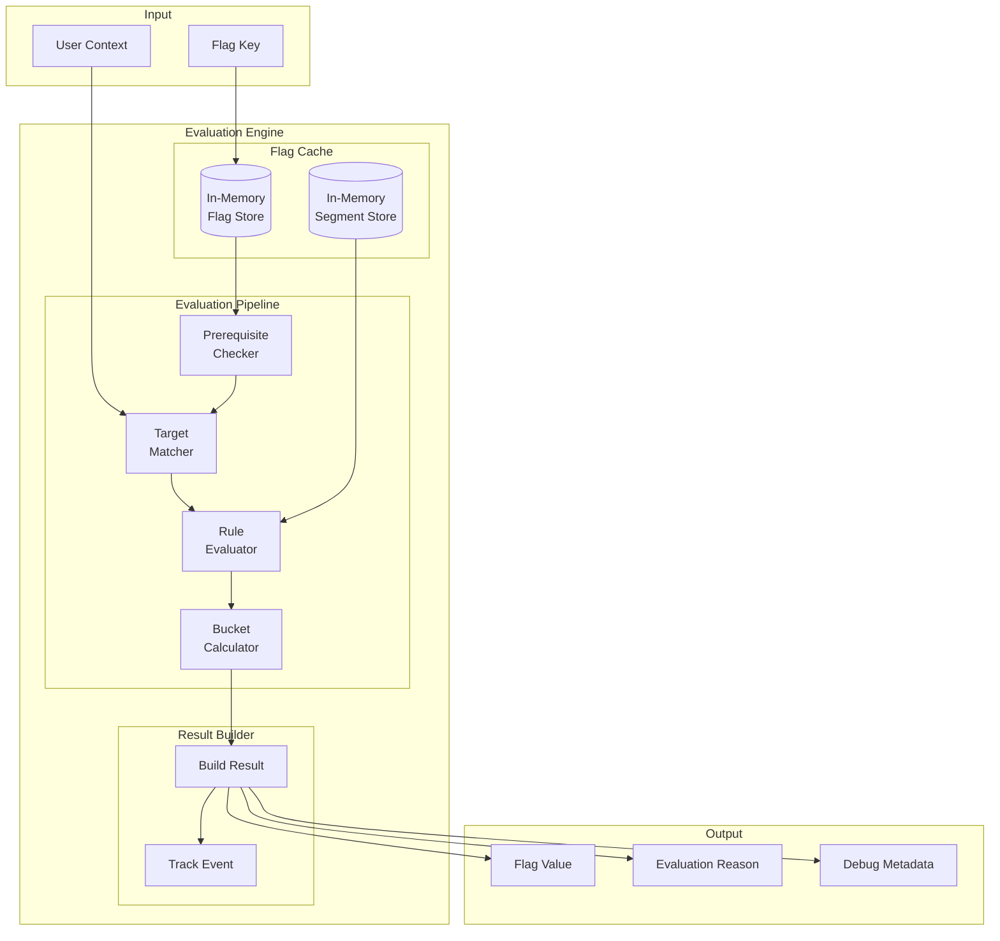
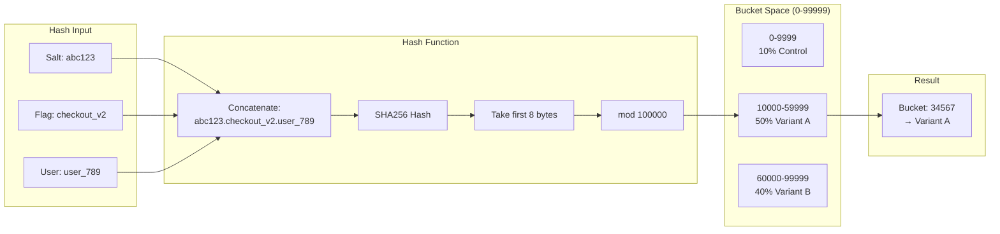
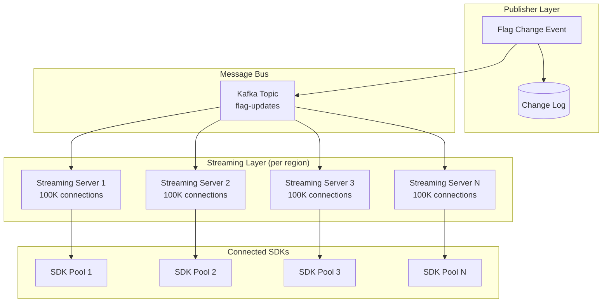
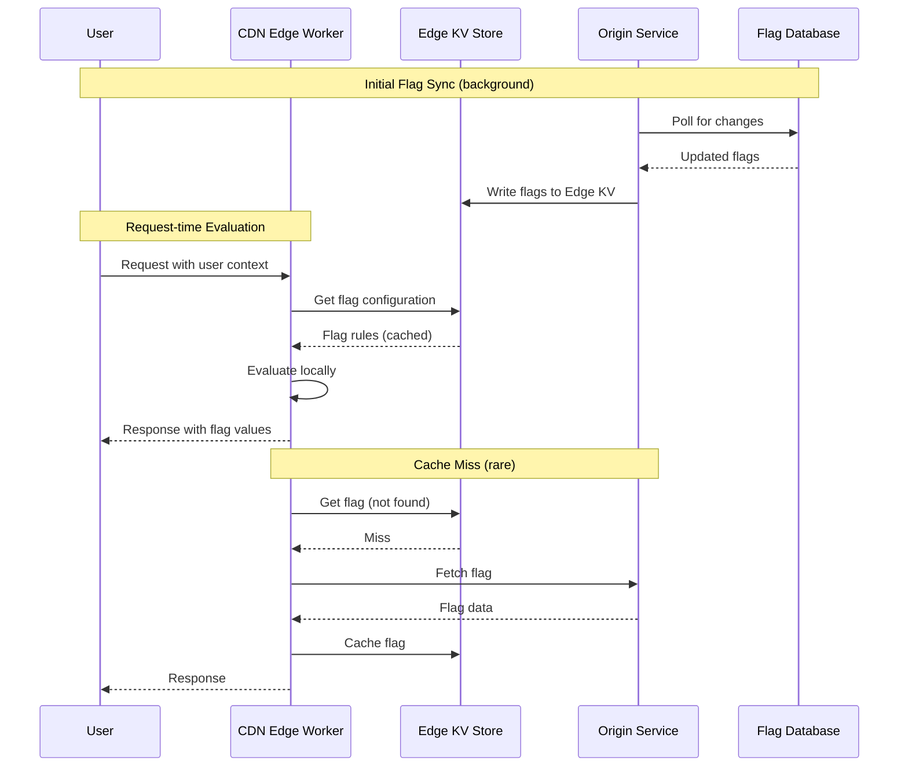

# Deep Dive & Bottlenecks

[← Back to Index](./00-index.md)

---

## Deep Dive 1: Flag Evaluation Engine

The evaluation engine is the heart of the feature flag system. It must be extremely fast (< 1ms), deterministic (same input = same output), and memory-efficient (runs in every SDK instance).

### Internal Architecture



### Performance Optimizations

| Optimization | Description | Impact |
|--------------|-------------|--------|
| **Compiled Rules** | Pre-compile regex patterns, parse semver | 10x faster rule matching |
| **Indexed Targets** | Hash set for O(1) target lookup | Fast individual targeting |
| **Segment Caching** | Pre-evaluate segment membership | Avoid repeated evaluation |
| **Short-circuit Evaluation** | Stop at first matching rule | Reduces average case |
| **Lazy Attribute Access** | Only fetch attributes used in rules | Less context serialization |

### Rule Evaluation Complexity

```
Best Case: O(1)
- Flag is OFF → immediate return
- User is in explicit target list → hash lookup

Average Case: O(R × C)
- R = number of rules to evaluate before match
- C = number of clauses per rule

Worst Case: O(R × C × S)
- S = segment evaluation cost (if segments used)
- All rules evaluated, no match, fallthrough to rollout
```

### Memory Layout

```
Flag Object (estimated sizes):
├── key: 32 bytes
├── version: 8 bytes
├── is_on: 1 byte
├── salt: 64 bytes
├── targets[]: 24 bytes + (n × 32 bytes per user)
├── rules[]: 24 bytes + (n × rule_size)
│   └── rule: 16 bytes + clauses
│       └── clause: 48 bytes + values
├── variations[]: 24 bytes + (n × value_size)
└── Total: ~500 bytes (simple flag) to ~50KB (complex targeting)

SDK Memory Budget:
- 1000 flags × 2KB average = 2MB
- 100 segments × 1KB average = 100KB
- Overhead (indexes, etc.) = ~500KB
- Total: ~3MB per SDK instance
```

---

## Deep Dive 2: Consistent Bucketing

Consistent bucketing ensures users always receive the same flag variation, which is critical for:
- User experience consistency (no feature flicker)
- A/B test validity (same bucket across sessions)
- Gradual rollout integrity (10% to 20% adds users, doesn't reshuffle)

### Bucketing Algorithm Visualization



### Additive Rollout (Key Property)

When increasing rollout percentage, existing users must stay in their bucket:

```
Initial: 10% rollout (buckets 0-9999)
Users A, B, C are in buckets 5000, 15000, 45000
→ Only User A sees feature

Increased: 50% rollout (buckets 0-49999)
Same users A, B, C still in buckets 5000, 15000, 45000
→ Users A, B, C now see feature (A was already included)

This works because:
- User's bucket is deterministic (hash doesn't change)
- Rollout expands bucket range, doesn't reshuffle
```

### Salt Rotation

Salts enable re-randomization when needed:

| Scenario | Salt Strategy |
|----------|--------------|
| **Standard rollout** | Keep salt constant |
| **New experiment on same flag** | Rotate salt to re-randomize |
| **Kill and restart experiment** | New salt for fresh start |
| **Cross-flag consistency** | Share salt between related flags |

### Bucket Collision Handling

```
FUNCTION get_bucket_with_jitter(user_id, flag_key, salt, attempt=0):
    IF attempt > MAX_ATTEMPTS:
        RETURN deterministic_fallback(user_id)

    hash_input = concat(salt, ".", flag_key, ".", user_id, ".", attempt)
    bucket = sha256_to_bucket(hash_input)

    // Check for known collision (rare edge case)
    IF is_collision(bucket, flag_key):
        RETURN get_bucket_with_jitter(user_id, flag_key, salt, attempt + 1)

    RETURN bucket
```

---

## Deep Dive 3: SSE Streaming at Scale

Real-time flag updates require maintaining millions of concurrent Server-Sent Events (SSE) connections efficiently.

### Fan-out Architecture



### Connection Management

```
STRUCTURE StreamingServer:
    connections: Map<sdk_key, List<Connection>>
    environment_subscriptions: Map<environment_id, Set<sdk_key>>

FUNCTION handle_sse_connection(request):
    sdk_key = authenticate(request)
    environment_id = get_environment(sdk_key)

    connection = create_sse_connection(request)

    // Register connection
    connections[sdk_key].append(connection)
    environment_subscriptions[environment_id].add(sdk_key)

    // Send initial data
    flags = get_all_flags(environment_id)
    send_event(connection, "put", flags)

    // Heartbeat loop
    WHILE connection.is_open:
        WAIT 30 seconds
        send_event(connection, "ping", {timestamp: now()})
        IF NOT connection.is_alive:
            cleanup_connection(connection, sdk_key, environment_id)
            BREAK

FUNCTION broadcast_flag_update(environment_id, flag_update):
    sdk_keys = environment_subscriptions[environment_id]

    FOR sdk_key IN sdk_keys:
        FOR connection IN connections[sdk_key]:
            TRY:
                send_event(connection, "patch", flag_update)
            CATCH:
                mark_connection_unhealthy(connection)
```

### Scaling Strategy

| Scale Level | Connections | Architecture |
|-------------|-------------|--------------|
| Small (< 10K) | Single server | Simple SSE server |
| Medium (10K-100K) | Multi-server | Load balancer + sticky sessions |
| Large (100K-1M) | Regional clusters | Kafka fan-out + regional streaming |
| Very Large (1M+) | Edge termination | CDN edge + regional aggregation |

### Reconnection Protocol

```
CLIENT reconnection logic:

1. Connection lost
2. Wait: exponential_backoff(attempt, base=1s, max=30s, jitter=0.5)
3. Reconnect with Last-Event-ID header
4. Server sends missed events since Last-Event-ID
5. If Last-Event-ID too old, server sends full "put" event
6. Reset attempt counter on successful connection
```

---

## Deep Dive 4: Edge Evaluation

Edge evaluation moves flag evaluation from origin servers to CDN edge nodes, reducing latency from 50-200ms to < 10ms globally.

### Edge Architecture



### Edge KV Data Model

```
Key Structure:
  flags:{environment_id}:{flag_key} → Flag configuration JSON
  segments:{org_id}:{segment_key} → Segment configuration JSON
  meta:{environment_id}:version → Current version number

Example:
  flags:env_123:checkout_v2 → {"v":3,"on":true,"rules":[...]}
  segments:org_456:beta_users → {"v":2,"included":["u1"],...}
  meta:env_123:version → "1705312200"
```

### Staleness Trade-offs

| Strategy | Staleness | Consistency | Latency |
|----------|-----------|-------------|---------|
| **Read-through** | 0 (always fresh) | Strong | Higher (origin hit) |
| **TTL-based** | Up to TTL | Eventual | Low (edge hit) |
| **Version-check** | Near-zero | Strong | Medium (version check) |
| **Push invalidation** | Seconds | Eventual | Lowest (cached) |

**Recommended:** Push invalidation with TTL fallback (30s) for balance.

### Edge Worker Pseudocode

```
FUNCTION handle_request(request):
    context = extract_context(request)
    environment_id = get_environment_from_key(request.sdk_key)

    // Get flags from edge KV
    flags = edge_kv.get("flags:" + environment_id)

    IF flags IS NULL:
        // Cache miss - fetch from origin
        flags = fetch_from_origin(environment_id)
        edge_kv.put("flags:" + environment_id, flags, ttl=30)

    // Evaluate all requested flags locally
    results = {}
    FOR flag_key IN request.flag_keys:
        results[flag_key] = evaluate_flag(flags[flag_key], context)

    // Return results with cache metadata
    RETURN {
        flags: results,
        cache_age: flags.cached_at,
        version: flags.version
    }
```

---

## Bottleneck Analysis

### Bottleneck 1: Streaming Connection Limits

**Problem:** Each streaming server has a limit on concurrent connections (~100K per server due to file descriptors and memory).

**Symptoms:**
- Connection refused errors
- High memory usage on streaming servers
- Increased latency during connection storms

**Mitigations:**

| Mitigation | Description | Trade-off |
|------------|-------------|-----------|
| Horizontal scaling | Add more streaming servers | Increased infra cost |
| Connection pooling | Relay proxy aggregates connections | Added hop latency |
| Edge termination | Terminate SSE at CDN edge | Higher edge compute cost |
| Reduce polling interval | Switch to 60s polling | Delayed updates |

### Bottleneck 2: Flag Payload Size

**Problem:** Large targeting rules create bloated SDK payloads (100KB+ per flag possible).

**Symptoms:**
- Slow SDK initialization
- High bandwidth consumption
- Mobile app memory issues

**Mitigations:**

| Mitigation | Description | Trade-off |
|------------|-------------|-----------|
| Rule compilation | Pre-compute rule outcomes | Less flexibility |
| Segment references | Store segments separately | Additional lookup |
| Delta updates | Send only changes | More complex sync |
| Pagination | Load flags on-demand | Delayed evaluation |

### Bottleneck 3: Evaluation Hotspots

**Problem:** Popular flags evaluated millions of times per second create hotspots.

**Symptoms:**
- CPU spikes in SDK
- Garbage collection pressure
- Inconsistent latency

**Mitigations:**

| Mitigation | Description | Trade-off |
|------------|-------------|-----------|
| Result caching | Cache evaluation results | Stale on context change |
| Batch evaluation | Evaluate all flags at once | Memory spike |
| Lazy evaluation | Only evaluate when accessed | Unpredictable latency |

### Bottleneck 4: Database Write Amplification

**Problem:** Single flag change triggers updates to many environments and cache layers.

**Symptoms:**
- High database load on flag updates
- Slow flag change propagation
- Cache stampede

**Mitigations:**

| Mitigation | Description | Trade-off |
|------------|-------------|-----------|
| Async propagation | Queue-based cache updates | Delayed consistency |
| Batched writes | Collect changes before write | Delayed propagation |
| Regional isolation | Propagate to regions independently | Cross-region staleness |

---

## Race Conditions

### Race 1: Flag Update During Evaluation

**Scenario:** SDK receives flag update via SSE while in the middle of evaluating that flag.

**Problem:** Evaluation might use partially updated data.

**Solution: Copy-on-Write**

```
FUNCTION update_flag_store(new_flag):
    // Create new store with update (immutable)
    new_store = current_store.copy()
    new_store[new_flag.key] = new_flag

    // Atomic swap (single pointer update)
    current_store = new_store

    // Old store garbage collected when evaluations complete
```

### Race 2: Experiment Assignment Collision

**Scenario:** User qualifies for multiple experiments simultaneously.

**Problem:** Overlapping experiments can corrupt each other's results.

**Solution: Mutual Exclusion Groups**

```
FUNCTION assign_to_experiment(user_id, experiment_id):
    mutex_group = experiment.mutex_group

    IF mutex_group IS NOT NULL:
        existing = get_user_assignment(user_id, mutex_group)
        IF existing IS NOT NULL AND existing != experiment_id:
            RETURN null  // User already in different experiment

    // Safe to assign
    bucket = get_bucket(user_id, experiment.salt)
    IF bucket < experiment.traffic_percentage:
        variation = get_variation_from_bucket(bucket, experiment)
        save_assignment(user_id, experiment_id, variation)
        RETURN variation

    RETURN null  // Not in experiment traffic
```

### Race 3: SSE Reconnection Gap

**Scenario:** Client disconnects, misses updates, reconnects.

**Problem:** Client has stale flag values, doesn't know what it missed.

**Solution: Versioned Updates with Catch-up**

```
// Client sends Last-Event-ID on reconnect
CLIENT: GET /streaming
        Last-Event-ID: event_12345

// Server checks gap and sends appropriate response
SERVER:
    last_event = get_last_event_id()

    IF event_12345 exists in recent_events:
        // Send all events since event_12345
        FOR event IN get_events_since(event_12345):
            send_event(connection, "patch", event)
    ELSE:
        // Gap too large, send full state
        send_event(connection, "put", get_all_flags())
```

---

## Metrics to Monitor

| Component | Metric | Alert Threshold | Action |
|-----------|--------|-----------------|--------|
| **Evaluation** | `p99_latency` | > 5ms | Profile hot flags |
| **Evaluation** | `error_rate` | > 0.1% | Check flag configs |
| **Streaming** | `active_connections` | > 80% capacity | Scale out |
| **Streaming** | `reconnection_rate` | > 5%/min | Check network |
| **Edge** | `cache_hit_rate` | < 95% | Increase TTL |
| **Edge** | `origin_latency` | > 100ms | Check origin health |
| **Database** | `write_latency` | > 50ms | Check indexes |

---

**Next:** [Scalability & Reliability →](./05-scalability-and-reliability.md)
