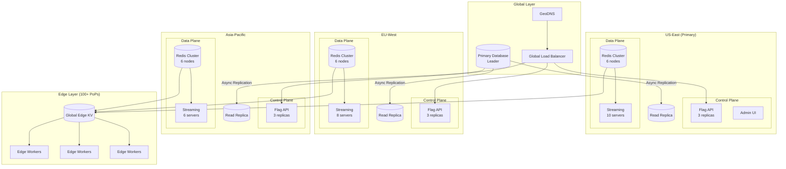
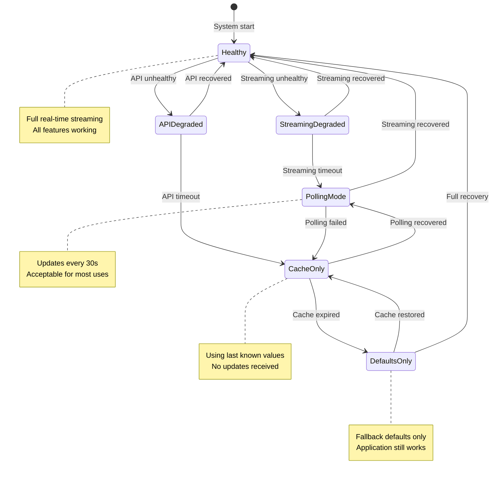
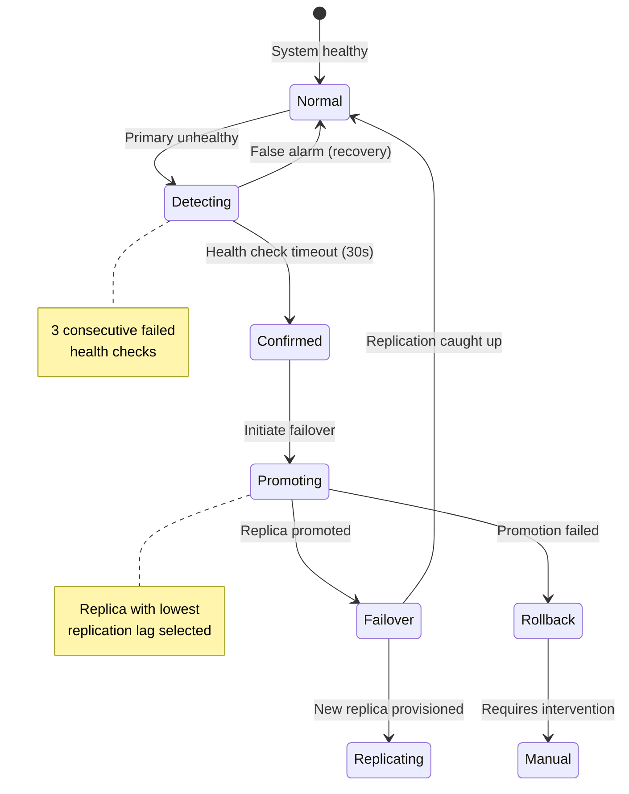

# Scalability & Reliability

[← Back to Index](./00-index.md)

---

## Scaling Architecture Overview



---

## Component Scaling Strategies

### Control Plane Scaling

| Component | Scaling Strategy | Trigger | Target |
|-----------|------------------|---------|--------|
| **Flag API** | Horizontal (stateless) | CPU > 70% | 3-10 replicas/region |
| **Admin UI** | Horizontal (stateless) | Request latency > 200ms | 2-5 replicas/region |
| **Database** | Read replicas + sharding | Query latency > 50ms | 1 primary + 3 replicas |
| **Audit Service** | Horizontal (async) | Queue depth > 1000 | 2-5 replicas |

### Data Plane Scaling

| Component | Scaling Strategy | Trigger | Target |
|-----------|------------------|---------|--------|
| **Streaming Service** | Horizontal (sticky) | Connections > 80K/server | 10-100 servers/region |
| **Redis Cache** | Cluster mode (sharding) | Memory > 70% | 6-30 nodes/region |
| **Edge Workers** | Auto-scaled by CDN | Requests/second | Unlimited (CDN managed) |
| **Edge KV** | Globally replicated | CDN managed | All edge PoPs |

### SDK Connection Scaling

```
Stage 1: Direct Streaming (< 100K connections)
├── SDKs connect directly to streaming servers
├── Load balancer distributes connections
└── Simple architecture, low latency

Stage 2: Regional Pools (100K - 1M connections)
├── Regional streaming server pools
├── Connection routing by SDK key hash
├── Sticky sessions for efficiency
└── Regional cache warming

Stage 3: Edge Termination (> 1M connections)
├── SSE terminated at CDN edge
├── Edge aggregates and fans out
├── Reduced origin connection count
└── Sub-10ms propagation at edge
```

---

## Auto-Scaling Configuration

### Streaming Service Auto-Scaling

```yaml
scaling_policy:
  service: streaming
  min_replicas: 5
  max_replicas: 50
  metrics:
    - type: connections_per_instance
      target: 80000
      scale_up_threshold: 75000
      scale_down_threshold: 50000
    - type: cpu_utilization
      target: 60%
    - type: memory_utilization
      target: 70%
  scale_up:
    cooldown: 60s
    increment: 2
  scale_down:
    cooldown: 300s
    increment: 1
  health_check:
    path: /health
    interval: 10s
    threshold: 3
```

### Redis Cluster Scaling

```yaml
redis_cluster:
  nodes: 6  # 3 primary + 3 replica
  max_memory: 16GB
  eviction_policy: volatile-lru
  scaling:
    trigger: memory > 12GB
    action: add_shard
    rebalance: automatic
  persistence:
    rdb: enabled
    aof: disabled  # Performance over durability
```

---

## Graceful Degradation

### Degradation State Machine



### Degradation Levels

| Level | Name | Behavior | User Impact |
|-------|------|----------|-------------|
| **0** | Healthy | Real-time streaming, full targeting | None |
| **1** | Streaming Degraded | Polling every 30s | Delayed updates |
| **2** | API Degraded | Cache-only, no new flags | Static flags |
| **3** | Cache Expired | Default values only | No targeting |
| **4** | SDK Error | Application defaults | Feature flags disabled |

### SDK Resilience Implementation

```
STRUCTURE SDKState:
    level: DegradationLevel
    last_successful_sync: Timestamp
    cached_flags: Map<FlagKey, FlagConfig>
    default_values: Map<FlagKey, Value>

FUNCTION evaluate_with_resilience(flag_key, context, sdk_state):
    SWITCH sdk_state.level:
        CASE Healthy, StreamingDegraded:
            // Normal evaluation
            RETURN evaluate_flag(sdk_state.cached_flags[flag_key], context)

        CASE CacheOnly:
            // Use cached flags but log staleness
            IF now() - sdk_state.last_successful_sync > STALENESS_WARNING:
                log_warning("Using stale flag data", age=now() - last_sync)
            RETURN evaluate_flag(sdk_state.cached_flags[flag_key], context)

        CASE DefaultsOnly:
            // Return configured defaults
            IF flag_key IN sdk_state.default_values:
                RETURN {value: sdk_state.default_values[flag_key], reason: "DEFAULT"}
            ELSE:
                RETURN {value: false, reason: "NO_DEFAULT"}  // Safe default

        CASE SDKError:
            // Application should handle
            THROW FeatureFlagUnavailableException
```

---

## Fault Tolerance

### Redundancy Strategy

| Component | Redundancy | Failover Time | Data Loss |
|-----------|------------|---------------|-----------|
| **Database** | Primary + 3 replicas | < 30s (automatic) | < 1s (async replication) |
| **Redis Cache** | Cluster with replicas | < 5s (automatic) | None (write-through) |
| **Streaming** | N+2 servers per region | Instant (reconnect) | None |
| **Edge** | Multi-PoP | Instant (DNS) | None |
| **API** | N+1 instances | < 10s (health check) | None (stateless) |

### Failover Procedure



### Circuit Breaker Configuration

```
circuit_breaker:
  streaming_service:
    failure_threshold: 5
    success_threshold: 3
    timeout: 10s
    half_open_requests: 3

  flag_api:
    failure_threshold: 10
    success_threshold: 5
    timeout: 30s
    half_open_requests: 5

  database:
    failure_threshold: 3
    success_threshold: 2
    timeout: 60s
    half_open_requests: 1

FUNCTION call_with_circuit_breaker(service, request):
    breaker = get_circuit_breaker(service)

    IF breaker.state == OPEN:
        IF now() > breaker.next_attempt_time:
            breaker.state = HALF_OPEN
        ELSE:
            RETURN fallback_response(service)

    TRY:
        response = make_request(service, request)
        breaker.record_success()
        IF breaker.state == HALF_OPEN AND breaker.successes >= SUCCESS_THRESHOLD:
            breaker.state = CLOSED
        RETURN response
    CATCH error:
        breaker.record_failure()
        IF breaker.failures >= FAILURE_THRESHOLD:
            breaker.state = OPEN
            breaker.next_attempt_time = now() + breaker.timeout
        THROW error
```

---

## Disaster Recovery

### RPO/RTO Targets

| Scenario | RPO | RTO | Strategy |
|----------|-----|-----|----------|
| **Single server failure** | 0 | < 1 min | Auto-scaling replacement |
| **Availability zone failure** | 0 | < 5 min | Multi-AZ deployment |
| **Region failure** | < 1 min | < 15 min | Cross-region failover |
| **Data corruption** | < 1 hour | < 1 hour | Point-in-time recovery |
| **Complete outage** | < 24 hours | < 4 hours | Backup restoration |

### Backup Strategy

```
Database Backups:
├── Continuous: WAL archiving to object storage
├── Hourly: Incremental snapshots
├── Daily: Full snapshots (retained 30 days)
└── Monthly: Archive snapshots (retained 1 year)

Cache Backups:
├── Redis RDB: Every 15 minutes
└── Exported to object storage

Configuration Backups:
├── Flag configurations: Every change (audit log)
├── Infrastructure: Terraform state in versioned bucket
└── Secrets: Vault with automatic backup
```

### SDK Offline Resilience

```
SDK Persistence Strategy:

1. Memory Cache (Primary)
   - All flags in memory
   - Instant access
   - Lost on process restart

2. Local Storage (Secondary)
   - Persist to disk/localStorage
   - Survives restart
   - Updated on every sync

3. Bundled Defaults (Tertiary)
   - Compiled into application
   - Never changes at runtime
   - Ultimate fallback

FUNCTION get_flag_value(flag_key):
    // Try memory first
    IF memory_cache.has(flag_key):
        RETURN memory_cache.get(flag_key)

    // Try local storage
    IF local_storage.has(flag_key):
        value = local_storage.get(flag_key)
        memory_cache.set(flag_key, value)
        RETURN value

    // Fall back to bundled defaults
    IF bundled_defaults.has(flag_key):
        RETURN bundled_defaults.get(flag_key)

    // No value available
    RETURN null
```

---

## Load Testing Scenarios

### Scenario 1: Flag Evaluation Storm

**Setup:**
- 1M concurrent SDK instances
- Each evaluating 100 flags/second
- Total: 100B evaluations/second

**Validation:**
- p99 latency < 1ms (local evaluation)
- No SDK crashes
- Memory stable

### Scenario 2: Mass Reconnection

**Setup:**
- 1M SDKs simultaneously disconnected
- All attempt reconnection within 60s

**Validation:**
- Exponential backoff spreads load
- Streaming servers don't crash
- All SDKs eventually reconnect (< 5 min)

### Scenario 3: Flag Update Propagation

**Setup:**
- Update flag used by 1M SDKs
- Measure propagation time

**Validation:**
- 99% of SDKs updated within 200ms
- 99.9% updated within 1s
- No lost updates

### Scenario 4: Regional Failover

**Setup:**
- Simulate US-East region failure
- All traffic redirected to EU-West

**Validation:**
- Failover complete < 15 minutes
- No flag evaluation errors
- Data consistency maintained

---

## Capacity Planning

### Growth Projections

| Metric | Current | +1 Year | +3 Years |
|--------|---------|---------|----------|
| Organizations | 10K | 25K | 100K |
| Flags (total) | 5M | 15M | 50M |
| SDK Connections | 10M | 30M | 100M |
| Evaluations/sec | 1B | 5B | 20B |

### Infrastructure Scaling Plan

| Timeframe | Streaming | Redis | Database | Edge |
|-----------|-----------|-------|----------|------|
| Current | 30 servers | 18 nodes | 4 nodes | CDN |
| +1 Year | 100 servers | 36 nodes | 8 nodes | CDN |
| +3 Years | 300 servers | 100 nodes | 16 nodes + sharding | CDN + custom edge |

### Cost Optimization

| Strategy | Savings | Trade-off |
|----------|---------|-----------|
| Reserved instances | 30-50% | Commitment |
| Spot instances (non-critical) | 60-80% | Availability |
| Edge caching | 40% bandwidth | Staleness |
| Connection pooling | 50% streaming | Relay latency |

---

**Next:** [Security & Compliance →](./06-security-and-compliance.md)
