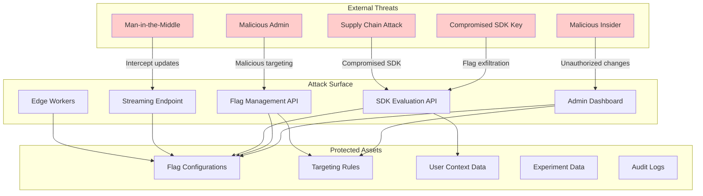

# Security & Compliance

[← Back to Index](./00-index.md)

---

## Threat Model

### Attack Surface Diagram



### Threat Categories

| Threat | Description | Likelihood | Impact | Priority |
|--------|-------------|------------|--------|----------|
| **SDK Key Theft** | Attacker obtains SDK key and retrieves all flag configs | Medium | Medium | High |
| **Flag Poisoning** | Malicious flag changes affect all users | Low | Critical | Critical |
| **Targeting Manipulation** | Modify rules to target specific users maliciously | Low | High | High |
| **Experiment Tampering** | Corrupt A/B test results | Medium | Medium | Medium |
| **Data Exfiltration** | Extract user context data from SDKs | Low | Medium | Medium |
| **Denial of Service** | Overwhelm streaming/API services | Medium | High | High |

---

## Authentication

### SDK Key Types

| Key Type | Format | Scope | Security Level |
|----------|--------|-------|----------------|
| **Server SDK Key** | `sdk-server-{env}-{random}` | Full flag access, hidden from users | High |
| **Client SDK Key** | `sdk-client-{env}-{random}` | Public flag access, exposed to browser | Medium |
| **Mobile SDK Key** | `sdk-mobile-{env}-{random}` | Mobile-specific, can be extracted | Medium |
| **Edge SDK Key** | `sdk-edge-{env}-{random}` | Edge worker access | High |

### API Authentication

```
Authentication Methods:

1. API Keys (Flag Management)
   Header: Authorization: Bearer {api_key}
   Scope: CRUD operations on flags
   Rotation: Every 90 days recommended

2. SDK Keys (Evaluation)
   Header: Authorization: {sdk_key}
   Scope: Read-only flag access
   Rotation: On compromise only

3. OAuth 2.0 (Admin UI)
   Flow: Authorization Code + PKCE
   Provider: SSO integration (Okta, Auth0)
   Session: JWT with 1-hour expiry

4. Service Accounts (CI/CD)
   Type: API key with limited scope
   Scope: Specific projects/environments
   Audit: All actions logged
```

### Key Rotation Procedure

```
PROCEDURE rotate_sdk_key(environment_id):
    // Generate new key
    new_key = generate_sdk_key(environment_id)

    // Keep both keys valid during transition
    add_key_to_environment(environment_id, new_key)

    // Notify connected SDKs
    broadcast_key_rotation_event(environment_id, new_key)

    // Wait for SDK migration (configurable grace period)
    WAIT 24 hours

    // Monitor old key usage
    IF old_key_still_in_use():
        extend_grace_period()
    ELSE:
        revoke_old_key(environment_id, old_key)

    // Audit log
    log_key_rotation(environment_id, actor, timestamp)
```

---

## Authorization

### Role-Based Access Control (RBAC)

| Role | Flags | Targeting | Experiments | Segments | Settings |
|------|-------|-----------|-------------|----------|----------|
| **Viewer** | Read | Read | Read | Read | None |
| **Developer** | CRUD | CRUD | CRUD | CRUD | None |
| **Manager** | CRUD | CRUD | CRUD | CRUD | Read |
| **Admin** | CRUD | CRUD | CRUD | CRUD | CRUD |
| **Owner** | CRUD | CRUD | CRUD | CRUD | CRUD + Billing |

### Environment-Level Permissions

| Permission | Development | Staging | Production |
|------------|-------------|---------|------------|
| **View Flags** | All roles | All roles | All roles |
| **Toggle Flag** | Developer+ | Developer+ | Manager+ |
| **Edit Targeting** | Developer+ | Developer+ | Admin+ |
| **Delete Flag** | Manager+ | Manager+ | Admin+ |
| **Export Data** | Admin+ | Admin+ | Admin+ |

### Permission Check Implementation

```
FUNCTION check_permission(user, action, resource):
    // Get user's role for the resource's project
    role = get_user_role(user.id, resource.project_id)

    // Get environment restrictions
    env_permissions = get_environment_permissions(
        role,
        resource.environment.type  // dev, staging, prod
    )

    // Check if action is allowed
    IF action NOT IN env_permissions[role]:
        RETURN DENIED

    // Check resource-level overrides
    IF resource.has_custom_permissions:
        IF NOT check_custom_permissions(user, action, resource):
            RETURN DENIED

    // Log authorization decision
    audit_log(user, action, resource, ALLOWED)
    RETURN ALLOWED


FUNCTION require_approval(action, resource):
    // Production changes may require approval workflow
    IF resource.environment.type == PRODUCTION:
        IF action IN [DELETE_FLAG, EDIT_TARGETING]:
            RETURN create_approval_request(action, resource)

    RETURN auto_approve(action, resource)
```

---

## Data Security

### Encryption

| Data | At Rest | In Transit | Key Management |
|------|---------|------------|----------------|
| **Flag Configurations** | AES-256 | TLS 1.3 | KMS |
| **Targeting Rules** | AES-256 | TLS 1.3 | KMS |
| **User Context** | Not stored | TLS 1.3 | N/A |
| **Audit Logs** | AES-256 | TLS 1.3 | KMS |
| **SDK Keys** | AES-256 + salted hash | TLS 1.3 | KMS |
| **API Keys** | Salted hash (Argon2) | TLS 1.3 | N/A |

### Client-Side SDK Security

| Risk | Mitigation |
|------|------------|
| **Rules exposed in browser** | Only send evaluated values, not rules (bootstrap mode) |
| **SDK key in source code** | Use client keys with limited scope |
| **Flag values visible in DevTools** | Accept as trade-off; no sensitive data in flags |
| **SDK tampering** | Subresource Integrity (SRI) for script tags |

### PII in Targeting Rules

```
PROHIBITED in targeting rules:
- Email addresses
- Phone numbers
- Social Security numbers
- Credit card numbers
- Personal names

ALLOWED (with caution):
- Hashed user IDs
- Country/region codes
- Subscription tiers
- Device types
- App versions

VALIDATION on rule save:
FUNCTION validate_targeting_rule(rule):
    FOR clause IN rule.clauses:
        // Check for PII patterns
        FOR value IN clause.values:
            IF matches_email_pattern(value):
                REJECT("Email addresses not allowed in targeting rules")
            IF matches_phone_pattern(value):
                REJECT("Phone numbers not allowed in targeting rules")
            IF matches_ssn_pattern(value):
                REJECT("SSN not allowed in targeting rules")

    RETURN VALID
```

---

## SDK Security

### Client-Side Key Protection

```
Best Practices:

1. Environment Variables
   - Never hardcode keys in source code
   - Use build-time injection

2. Key Scope Limitation
   - Client keys: Read-only, public flags only
   - Server keys: Full access, never expose

3. Domain Restriction
   - Bind client keys to specific domains
   - Reject requests from unauthorized origins

4. Rate Limiting
   - Limit requests per SDK key
   - Detect and block abuse patterns

CONFIGURATION example:
sdk_key_policy:
  key: sdk-client-prod-abc123
  allowed_origins:
    - "https://myapp.com"
    - "https://*.myapp.com"
  rate_limits:
    bootstrap: 10/minute
    streaming: 1 connection
    evaluation: 1000/minute
  flags_access:
    - "public_*"  # Only flags with public_ prefix
```

### Mobile SDK Hardening

| Technique | Description | Effectiveness |
|-----------|-------------|---------------|
| **Certificate Pinning** | Pin TLS certificates | Prevents MITM |
| **Code Obfuscation** | Obfuscate SDK code | Deters reverse engineering |
| **Key Derivation** | Derive key from device + secret | Harder to extract |
| **Jailbreak Detection** | Detect compromised devices | Refuse on rooted devices |
| **Attestation** | Use platform attestation | Verify app integrity |

---

## Audit Logging

### Audit Events

| Category | Event | Logged Data |
|----------|-------|-------------|
| **Authentication** | Login, logout, key rotation | User, IP, timestamp, success/failure |
| **Flags** | Create, update, toggle, delete | Flag key, changes, actor, timestamp |
| **Targeting** | Rule add/modify/delete | Rule details, before/after, actor |
| **Experiments** | Start, stop, winner declared | Experiment ID, decision, actor |
| **Access** | Permission change, role assignment | User, role, actor, timestamp |
| **SDK** | Key issued, key revoked | Key type, environment, actor |

### Audit Log Format

```json
{
  "id": "audit_123456",
  "timestamp": "2024-01-15T10:30:00.000Z",
  "organization_id": "org_abc",
  "actor": {
    "id": "user_xyz",
    "email": "admin@company.com",
    "type": "user",  // user, service_account, system
    "ip_address": "192.168.1.100",
    "user_agent": "Mozilla/5.0..."
  },
  "action": "flag.targeting.updated",
  "resource": {
    "type": "flag",
    "id": "flag_123",
    "key": "new_checkout",
    "environment": "production"
  },
  "changes": {
    "before": {
      "rules": [{"description": "Beta users", "variation": "on"}]
    },
    "after": {
      "rules": [
        {"description": "Beta users", "variation": "on"},
        {"description": "US users", "variation": "on"}
      ]
    }
  },
  "metadata": {
    "request_id": "req_abc123",
    "source": "admin_ui"
  }
}
```

### Audit Retention

| Data Type | Retention | Storage | Access |
|-----------|-----------|---------|--------|
| **Flag changes** | 2 years | Time-series DB | Admin |
| **Login events** | 1 year | Time-series DB | Admin |
| **SDK access** | 90 days | Log aggregator | Admin |
| **API requests** | 30 days | Log aggregator | Admin |

---

## Compliance

### GDPR Considerations

| Requirement | Implementation |
|-------------|----------------|
| **Data minimization** | Don't store user context; only evaluate |
| **Right to erasure** | No PII in targeting rules; segments use hashed IDs |
| **Data portability** | Export flag configurations via API |
| **Consent** | Feature flags don't collect user data by default |
| **Cross-border transfer** | Regional deployment; data stays in region |

### SOC 2 Requirements

| Control | Implementation |
|---------|----------------|
| **Access Control** | RBAC, MFA, SSO integration |
| **Audit Logging** | Comprehensive audit trail |
| **Change Management** | Approval workflows for production |
| **Incident Response** | Documented runbooks, alerting |
| **Encryption** | TLS 1.3, AES-256 at rest |

### Data Residency

```
Regional Deployment Options:

US:
- Control plane: us-east-1
- Data plane: us-east-1, us-west-2
- Edge: US PoPs only

EU:
- Control plane: eu-west-1
- Data plane: eu-west-1, eu-central-1
- Edge: EU PoPs only

APAC:
- Control plane: ap-southeast-1
- Data plane: ap-southeast-1, ap-northeast-1
- Edge: APAC PoPs only

CONFIGURATION:
organization_settings:
  data_residency: "eu"
  allowed_regions:
    - eu-west-1
    - eu-central-1
  edge_restriction: "eu_only"
```

---

## Security Checklist

### Development

- [ ] SDK keys never hardcoded in source code
- [ ] Client SDK keys have limited scope
- [ ] No PII in targeting rules
- [ ] TLS 1.3 for all connections
- [ ] Input validation on all APIs

### Deployment

- [ ] Environment isolation (dev/staging/prod)
- [ ] Network segmentation
- [ ] WAF in front of public APIs
- [ ] Rate limiting enabled
- [ ] DDoS protection

### Operations

- [ ] Key rotation schedule established
- [ ] Audit logging enabled and monitored
- [ ] Incident response runbook documented
- [ ] Regular security reviews
- [ ] Penetration testing annually

### Access Control

- [ ] MFA required for admin access
- [ ] SSO integration for enterprise
- [ ] Principle of least privilege
- [ ] Regular access reviews
- [ ] Approval workflow for production changes

---

**Next:** [Observability →](./07-observability.md)
