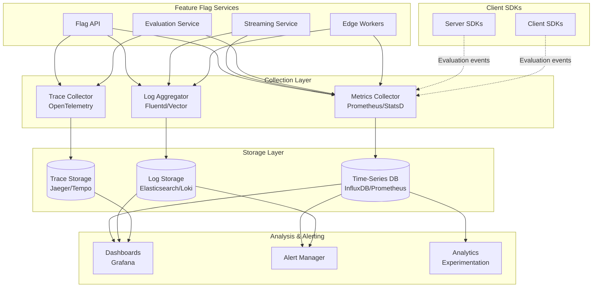
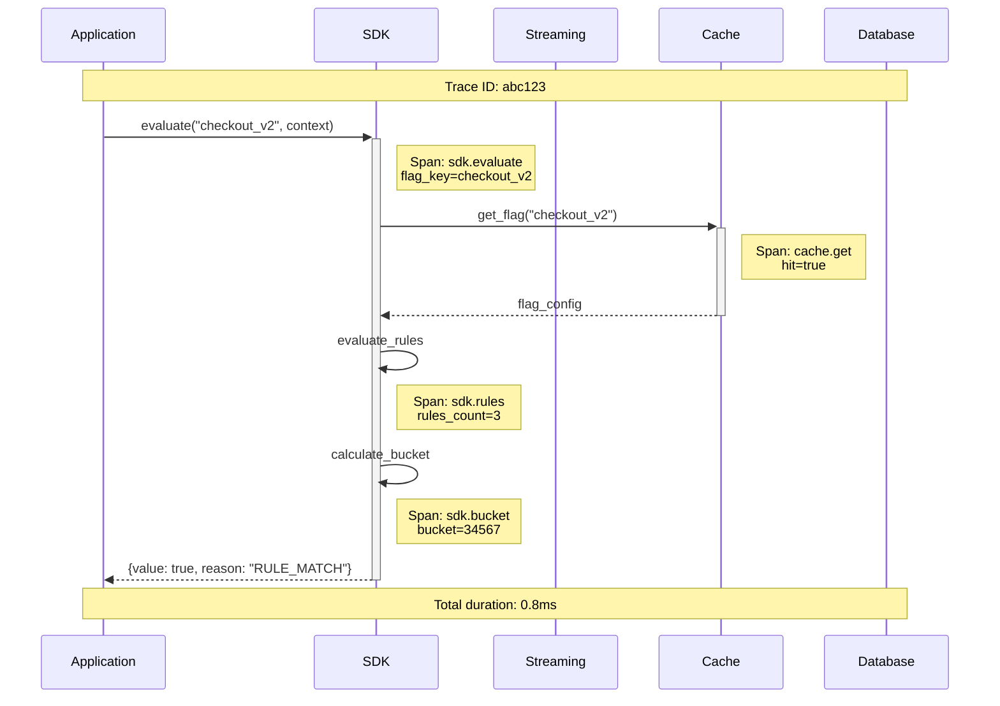

# Observability

[← Back to Index](./00-index.md)

---

## Observability Architecture



---

## Key Metrics

### Metrics Overview

| Category | Metric | Type | Labels |
|----------|--------|------|--------|
| **Evaluation** | `flag_evaluations_total` | Counter | flag_key, variation, reason |
| **Evaluation** | `evaluation_latency_ms` | Histogram | flag_key, sdk_type |
| **Streaming** | `streaming_connections_active` | Gauge | region, environment |
| **Streaming** | `streaming_messages_sent_total` | Counter | message_type, environment |
| **Streaming** | `streaming_connection_duration_seconds` | Histogram | sdk_type |
| **API** | `api_requests_total` | Counter | endpoint, method, status |
| **API** | `api_request_latency_ms` | Histogram | endpoint, method |
| **Cache** | `cache_hit_rate` | Gauge | cache_type |
| **Cache** | `cache_size_bytes` | Gauge | cache_type |
| **Edge** | `edge_evaluations_total` | Counter | region, flag_key |
| **Edge** | `edge_cache_hit_rate` | Gauge | region |

### Evaluation Metrics

```
# Total evaluations by flag and outcome
flag_evaluations_total{
    flag_key="checkout_v2",
    variation="on",
    reason="RULE_MATCH",
    environment="production"
}

# Evaluation latency distribution
evaluation_latency_ms_bucket{
    flag_key="checkout_v2",
    sdk_type="server",
    le="1"      // < 1ms
} 950000

evaluation_latency_ms_bucket{
    flag_key="checkout_v2",
    sdk_type="server",
    le="5"      // < 5ms
} 990000

evaluation_latency_ms_bucket{
    flag_key="checkout_v2",
    sdk_type="server",
    le="10"     // < 10ms
} 999000
```

### Streaming Metrics

```
# Active connections by region
streaming_connections_active{
    region="us-east-1",
    environment="production",
    sdk_type="server"
} 125000

# Connection churn
streaming_connections_opened_total{region="us-east-1"} 1500000
streaming_connections_closed_total{region="us-east-1"} 1375000

# Message delivery
streaming_messages_sent_total{
    message_type="patch",
    environment="production"
} 500000

streaming_message_delivery_latency_ms_bucket{
    le="100"    // < 100ms (target)
} 980000

streaming_message_delivery_latency_ms_bucket{
    le="200"    // < 200ms (SLO)
} 995000
```

### Experimentation Metrics

```
# Experiment assignments
experiment_assignments_total{
    experiment_id="exp_123",
    variation="treatment"
} 50000

experiment_assignments_total{
    experiment_id="exp_123",
    variation="control"
} 50000

# Sample ratio mismatch detection
experiment_srm_ratio{
    experiment_id="exp_123"
} 1.02  // Should be ~1.0

# Conversion events
experiment_conversions_total{
    experiment_id="exp_123",
    variation="treatment",
    metric="purchase"
} 5000
```

---

## Golden Signals Dashboard

```
┌─────────────────────────────────────────────────────────────────────────────┐
│                         FEATURE FLAGS - GOLDEN SIGNALS                       │
├─────────────────────────────────────────────────────────────────────────────┤
│                                                                              │
│  LATENCY (p99)                           TRAFFIC                             │
│  ┌────────────────────┐                  ┌────────────────────┐             │
│  │ SDK Evaluation     │                  │ Evaluations/sec    │             │
│  │ ████████ 0.8ms    │ ✓ < 10ms         │ ████████████ 1.2M │             │
│  │                    │                  │                    │             │
│  │ API Response       │                  │ Streaming Conn     │             │
│  │ ██████ 45ms       │ ✓ < 100ms        │ ████████ 2.1M     │             │
│  │                    │                  │                    │             │
│  │ Update Propagation │                  │ API Requests/sec   │             │
│  │ ████ 120ms        │ ✓ < 200ms        │ ██ 5.2K           │             │
│  └────────────────────┘                  └────────────────────┘             │
│                                                                              │
│  ERRORS                                  SATURATION                          │
│  ┌────────────────────┐                  ┌────────────────────┐             │
│  │ Evaluation Errors  │                  │ Streaming Servers  │             │
│  │ █ 0.001%          │ ✓ < 0.1%         │ ████████ 75%      │ ⚠ > 70%     │
│  │                    │                  │                    │             │
│  │ API Errors (5xx)   │                  │ Redis Memory       │             │
│  │ █ 0.01%           │ ✓ < 0.1%         │ ██████ 62%        │ ✓ < 80%     │
│  │                    │                  │                    │             │
│  │ Stream Disconnects │                  │ Database CPU       │             │
│  │ ██ 2.1%/hr        │ ⚠ > 2%           │ ████ 45%          │ ✓ < 70%     │
│  └────────────────────┘                  └────────────────────┘             │
│                                                                              │
└─────────────────────────────────────────────────────────────────────────────┘
```

---

## Logging Strategy

### Log Levels

| Level | Usage | Retention |
|-------|-------|-----------|
| **ERROR** | Failures requiring attention | 90 days |
| **WARN** | Degraded behavior, approaching limits | 30 days |
| **INFO** | Key events (flag changes, connections) | 14 days |
| **DEBUG** | Detailed troubleshooting | 3 days |

### Structured Log Format

```json
{
  "timestamp": "2024-01-15T10:30:00.123Z",
  "level": "INFO",
  "service": "streaming-service",
  "instance": "stream-us-east-1-a-001",
  "trace_id": "abc123def456",
  "span_id": "789ghi",
  "message": "Flag update broadcast completed",
  "context": {
    "environment_id": "env_prod_123",
    "flag_key": "checkout_v2",
    "flag_version": 5,
    "recipients": 125000,
    "duration_ms": 45,
    "message_size_bytes": 1024
  }
}
```

### Log Patterns by Component

| Component | Key Events to Log |
|-----------|-------------------|
| **Flag API** | Flag CRUD, targeting changes, toggle events |
| **Streaming** | Connection open/close, broadcast events, errors |
| **Evaluation** | Errors, fallback to defaults, cache misses |
| **SDK** | Initialization, sync failures, degradation events |
| **Edge** | Cache hits/misses, origin fetches, errors |

---

## Distributed Tracing

### Trace Propagation



### Key Spans

| Span Name | Attributes | Purpose |
|-----------|------------|---------|
| `sdk.init` | sdk_type, environment, duration_ms | SDK initialization time |
| `sdk.evaluate` | flag_key, variation, reason | Individual evaluation |
| `sdk.sync` | flags_count, sync_type | Flag synchronization |
| `streaming.connect` | client_id, region | SSE connection |
| `streaming.broadcast` | environment, recipients | Update fan-out |
| `api.request` | endpoint, method, status | API call |
| `cache.get` | key, hit | Cache lookup |
| `db.query` | operation, table, rows | Database query |

---

## Alerting

### Alert Definitions

| Alert | Condition | Severity | Action |
|-------|-----------|----------|--------|
| **HighEvaluationLatency** | p99 > 5ms for 5min | Warning | Investigate hot flags |
| **CriticalEvaluationLatency** | p99 > 10ms for 2min | Critical | Scale evaluation tier |
| **StreamingConnectionDrop** | Connections drop > 10%/min | Critical | Check streaming servers |
| **HighErrorRate** | 5xx rate > 1% for 5min | Critical | Check service health |
| **CacheHitRateLow** | Hit rate < 90% for 10min | Warning | Check cache capacity |
| **DatabaseLatencyHigh** | Query p99 > 100ms for 5min | Warning | Check database load |
| **SRMDetected** | Sample ratio > 1.1 for experiment | Warning | Investigate bucketing |

### Alert Rules (Prometheus)

```yaml
groups:
  - name: feature-flags
    rules:
      - alert: HighEvaluationLatency
        expr: histogram_quantile(0.99, rate(evaluation_latency_ms_bucket[5m])) > 5
        for: 5m
        labels:
          severity: warning
        annotations:
          summary: "High flag evaluation latency"
          description: "p99 evaluation latency is {{ $value }}ms"

      - alert: StreamingConnectionDrop
        expr: rate(streaming_connections_closed_total[1m]) / rate(streaming_connections_opened_total[1m]) > 1.1
        for: 2m
        labels:
          severity: critical
        annotations:
          summary: "Streaming connections dropping rapidly"
          description: "Connection close rate exceeds open rate"

      - alert: ExperimentSRM
        expr: experiment_srm_ratio > 1.1 or experiment_srm_ratio < 0.9
        for: 1h
        labels:
          severity: warning
        annotations:
          summary: "Sample Ratio Mismatch detected"
          description: "Experiment {{ $labels.experiment_id }} has SRM ratio {{ $value }}"
```

### Runbook Examples

```
RUNBOOK: HighEvaluationLatency

SYMPTOMS:
- p99 evaluation latency > 5ms
- Users may experience delayed feature flag evaluation

INVESTIGATION:
1. Check flag complexity
   Query: top_flags_by_rules_count{environment="production"}

2. Check for targeting rule changes
   Query: flag_targeting_changes_total[1h]

3. Check SDK memory pressure
   Query: sdk_memory_usage_bytes

MITIGATION:
1. If specific flag is hot:
   - Simplify targeting rules
   - Use segment references instead of inline rules

2. If general slowdown:
   - Check for GC pressure in SDKs
   - Consider evaluation result caching

ESCALATION:
- Page on-call if p99 > 10ms for 5 minutes
- Notify product if persists > 30 minutes
```

---

## SLI/SLO Summary

| Service | SLI | SLO | Measurement |
|---------|-----|-----|-------------|
| **SDK Evaluation** | Evaluation latency p99 | < 1ms | SDK telemetry |
| **SDK Evaluation** | Evaluation success rate | > 99.999% | SDK telemetry |
| **Streaming** | Update propagation time p99 | < 200ms | End-to-end trace |
| **Streaming** | Connection availability | > 99.99% | Connection metrics |
| **API** | Request latency p99 | < 100ms | API metrics |
| **API** | Request success rate | > 99.9% | API metrics |
| **Edge** | Cache hit rate | > 95% | Edge metrics |
| **Experiments** | Assignment accuracy | 100% | Audit comparison |

### Error Budget Calculation

```
Monthly Error Budget:

SDK Evaluation (99.999% SLO):
- Budget: 0.001% = ~26 seconds/month of errors
- Current burn: 0.0005% = 13 seconds used
- Remaining: 13 seconds

Streaming (99.99% SLO):
- Budget: 0.01% = ~4.3 minutes/month
- Current burn: 0.005% = 2.1 minutes used
- Remaining: 2.2 minutes

API (99.9% SLO):
- Budget: 0.1% = ~43 minutes/month
- Current burn: 0.03% = 13 minutes used
- Remaining: 30 minutes
```

---

## Health Checks

### Service Health Endpoints

| Service | Endpoint | Check | Timeout |
|---------|----------|-------|---------|
| **Flag API** | `/health/live` | Process running | 1s |
| **Flag API** | `/health/ready` | DB + Cache connected | 5s |
| **Streaming** | `/health/live` | Process running | 1s |
| **Streaming** | `/health/ready` | Can accept connections | 3s |
| **Edge** | `/health` | KV accessible | 1s |

### Dependency Checks

```
FUNCTION check_health():
    status = {
        service: "flag-api",
        status: "healthy",
        checks: {}
    }

    // Database check
    TRY:
        db.execute("SELECT 1")
        status.checks["database"] = {status: "up", latency_ms: measure()}
    CATCH:
        status.checks["database"] = {status: "down", error: error.message}
        status.status = "unhealthy"

    // Cache check
    TRY:
        cache.ping()
        status.checks["cache"] = {status: "up", latency_ms: measure()}
    CATCH:
        status.checks["cache"] = {status: "down", error: error.message}
        status.status = "degraded"  // Can operate without cache

    // Streaming check
    TRY:
        streaming.health_check()
        status.checks["streaming"] = {status: "up"}
    CATCH:
        status.checks["streaming"] = {status: "down", error: error.message}
        status.status = "degraded"  // SDKs will poll

    RETURN status
```

---

**Next:** [Interview Guide →](./08-interview-guide.md)
