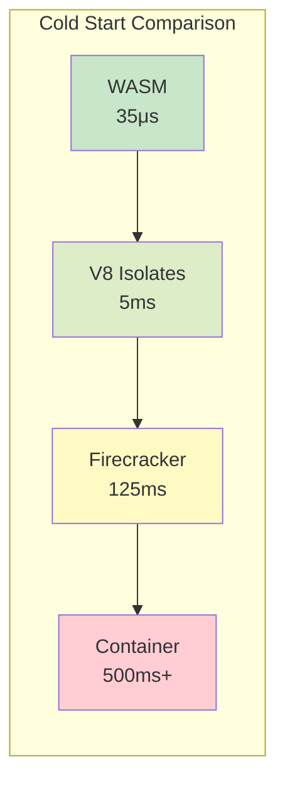
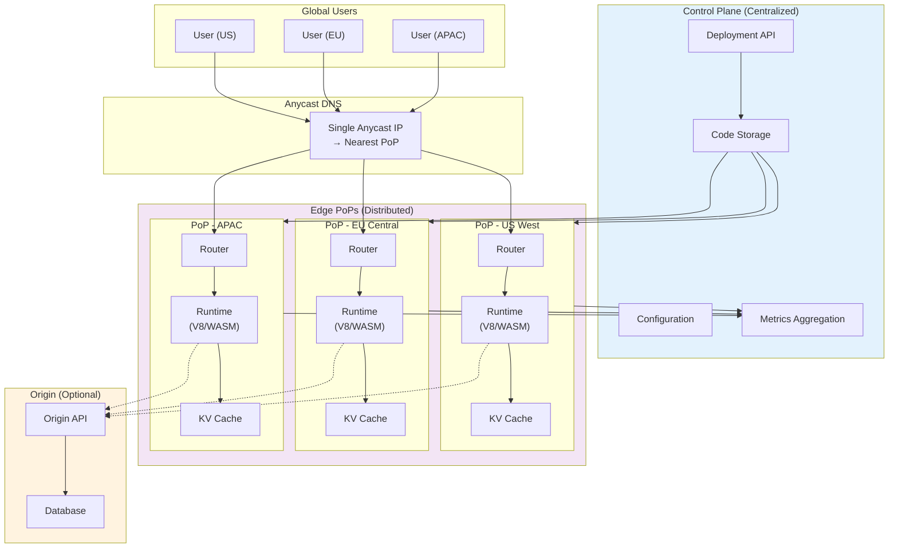

# Edge Computing Platform

[Back to System Design Index](../README.md)

---

## Overview

An **Edge Computing Platform** enables developers to deploy and execute code at globally distributed Points of Presence (PoPs), bringing computation closer to end users. By running application logic at the network edge rather than in centralized data centers, these platforms achieve sub-50ms latency for request handling, eliminate cold start overhead through lightweight isolation technologies, and provide seamless global distribution via anycast routing.

Modern edge platforms use innovative isolation mechanisms—V8 isolates, Firecracker microVMs, or WebAssembly sandboxes—to run thousands of tenant workloads on shared infrastructure while maintaining security boundaries. This architecture powers real-time personalization, A/B testing at the edge, authentication, request routing, and low-latency API responses.

---

## Key Characteristics

| Characteristic | Value | Implication |
|----------------|-------|-------------|
| Traffic Pattern | Billions of requests/day, globally distributed | Anycast routing, PoP-local processing |
| Latency Sensitivity | p99 < 50ms end-to-end | Edge execution mandatory, no origin round-trip |
| Cold Start Requirement | < 5ms (isolates), < 125ms (microVMs) | V8 isolates or WASM for latency-critical paths |
| State Model | Mostly stateless, optional edge state | KV stores (eventual), Durable Objects (strong) |
| Isolation Model | Multi-tenant on shared infrastructure | Process-level (isolates) or VM-level (Firecracker) |
| Consistency | Eventual for KV, strong for Durable Objects | Choose based on use case requirements |
| Availability Target | 99.99% per PoP, 99.999% global | Automatic failover to nearest healthy PoP |

---

## Quick Navigation

| Document | Purpose |
|----------|---------|
| [01 - Requirements & Estimations](./01-requirements-and-estimations.md) | Functional/non-functional requirements, capacity planning, SLOs |
| [02 - High-Level Design](./02-high-level-design.md) | Architecture diagrams, data flow, key decisions |
| [03 - Low-Level Design](./03-low-level-design.md) | Data models, API design, algorithms (pseudocode) |
| [04 - Deep Dive & Bottlenecks](./04-deep-dive-and-bottlenecks.md) | V8 isolates, Durable Objects, routing deep dives |
| [05 - Scalability & Reliability](./05-scalability-and-reliability.md) | Scaling strategies, fault tolerance, disaster recovery |
| [06 - Security & Compliance](./06-security-and-compliance.md) | Isolation model, threat analysis, compliance |
| [07 - Observability](./07-observability.md) | Metrics, logging, tracing, alerting |
| [08 - Interview Guide](./08-interview-guide.md) | 45-min pacing, trap questions, trade-offs |

---

## Complexity Rating: High

| Aspect | Complexity | Reason |
|--------|------------|--------|
| Global Distribution | High | 300+ PoPs, anycast routing, inter-PoP networking |
| Isolation Technology | High | V8 isolates, memory protection, security sandboxing |
| State Management | High | Eventual vs strong consistency, Durable Object routing |
| Cold Start Optimization | Medium | Warm pools, code pre-optimization, caching |
| Observability | Medium | Distributed tracing across global PoPs |
| Security | High | Multi-tenant isolation, DDoS protection, code sandboxing |

---

## Isolation Technology Comparison

| Technology | Cold Start | Memory Overhead | Security Model | Best For |
|------------|------------|-----------------|----------------|----------|
| **V8 Isolates** | < 5ms | ~2MB per isolate | Process-level isolation, MPK | JavaScript/TypeScript workloads |
| **Firecracker microVM** | ~125ms | ~5MB per VM | Hardware virtualization (KVM) | Full OS control, custom runtimes |
| **WASM Sandbox** | ~35μs | Minimal (~KB) | Per-request sandbox | Compiled languages (Rust, Go, C++) |
| **Containers** | 500ms-2s | 50-200MB | Namespace isolation | Long-running services (not edge) |

---

## Real-World Systems

| Platform | Isolation | Key Features | Scale |
|----------|-----------|--------------|-------|
| **Cloudflare Workers** | V8 Isolates | Workers KV, Durable Objects, R2 Storage | 300+ PoPs, millions of workers |
| **Fly.io** | Firecracker | Full VM control, WireGuard networking, LiteFS | Global regions, persistent VMs |
| **Deno Deploy** | V8 Isolates | TypeScript-first, Deno KV, Deno Queues | 35+ regions, sub-second deploys |
| **Vercel Edge Functions** | V8 Runtime | Next.js integration, Edge Middleware | Global edge network |
| **Fastly Compute** | WASM (Wasmtime) | 35μs cold start, any compiled language | 90+ PoPs, high-performance |
| **AWS Lambda@Edge** | Container-based | CloudFront integration, viewer/origin hooks | CloudFront edge locations |

---

## Architecture Overview

---

## Key Design Decisions Summary

| Decision | Options | Recommendation | Rationale |
|----------|---------|----------------|-----------|
| Isolation Model | V8 Isolates / Firecracker / WASM | V8 Isolates (default) | Best cold start, sufficient isolation |
| Routing | Anycast / GeoDNS | Anycast | Simpler, automatic nearest-PoP |
| State Storage | KV (eventual) / Durable Objects (strong) | KV for most, DO for coordination | Match consistency to use case |
| Code Distribution | Push (proactive) / Pull (on-demand) | Hybrid | Push for popular, pull for long-tail |
| Cold Start Strategy | Warm pools / On-demand | Warm pools for hot paths | Predictable latency for critical routes |

---

## Interview Quick Reference

### Must-Know Concepts

1. **V8 Isolates**: Lightweight execution contexts within a single process, ~5ms cold start
2. **Anycast Routing**: Single IP advertised from multiple locations, BGP routes to nearest
3. **Durable Objects**: Strongly consistent, single-instance-per-ID edge state
4. **Workers KV**: Eventually consistent, globally replicated key-value store
5. **Cold Start**: Time to initialize new execution environment

### Key Trade-offs

| Trade-off | Option A | Option B |
|-----------|----------|----------|
| Isolation strength vs latency | Firecracker (stronger, slower) | V8 Isolates (weaker, faster) |
| Consistency vs latency | Durable Objects (strong, routed) | KV (eventual, local) |
| Flexibility vs cold start | Containers (flexible, slow) | WASM (compiled, instant) |
| Push vs pull deployment | Eager (higher bandwidth) | Lazy (cold start on first request) |

### Red Flags in Interviews

- Proposing containers for edge workloads (cold start too slow)
- Ignoring eventual consistency implications of KV stores
- Not considering PoP failure and automatic failover
- Assuming unlimited CPU/memory at edge (strict limits apply)
- Forgetting about debugging/observability challenges at edge

---

## Related System Designs

- [1.15 - Content Delivery Network (CDN)](../1.15-content-delivery-network-cdn/00-index.md) - Edge caching layer
- [1.14 - API Gateway](../1.14-api-gateway-design/00-index.md) - Request routing and transformation
- [2.3 - Function-as-a-Service (FaaS)](../2.3-function-as-a-service/00-index.md) - Serverless compute comparison
- [1.16 - DNS System Design](../1.16-dns-system-design/00-index.md) - Anycast and GeoDNS fundamentals

---

**Next: [01 - Requirements & Estimations](./01-requirements-and-estimations.md)**
