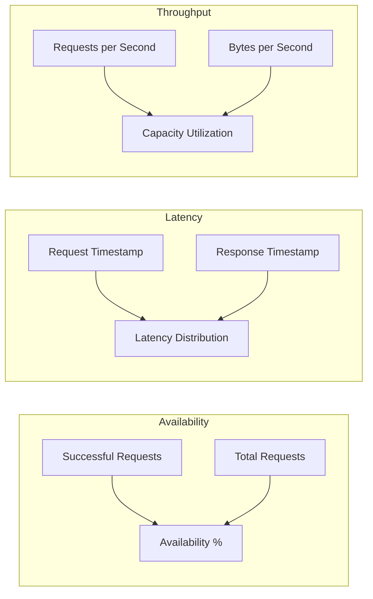

# Requirements & Estimations

[Back to Index](./00-index.md) | [Next: High-Level Design](./02-high-level-design.md)

---

## Functional Requirements

### Core Features (P0 - Must Have)

| ID | Requirement | Description |
|----|-------------|-------------|
| FR-1 | Code Deployment | Deploy JavaScript/TypeScript/WASM code to edge locations globally |
| FR-2 | Request Handling | Execute deployed code in response to HTTP requests |
| FR-3 | Global Routing | Route requests to nearest PoP via anycast DNS |
| FR-4 | Isolation | Securely isolate tenant workloads on shared infrastructure |
| FR-5 | Edge KV Storage | Provide eventually consistent key-value storage at edge |
| FR-6 | Environment Variables | Support secrets and configuration per deployment |
| FR-7 | Custom Domains | Map custom domains to edge deployments with TLS |
| FR-8 | Logging | Stream execution logs to external destinations |

### Enhanced Features (P1 - Should Have)

| ID | Requirement | Description |
|----|-------------|-------------|
| FR-9 | Durable Objects | Provide strongly consistent, stateful edge compute |
| FR-10 | Scheduled Execution | Run code on cron schedules at edge |
| FR-11 | WebSocket Support | Handle persistent WebSocket connections |
| FR-12 | Streaming Responses | Support chunked/streaming HTTP responses |
| FR-13 | Request Queuing | Queue and batch requests for processing |
| FR-14 | Edge Database | Provide SQL-like queries at edge (SQLite-based) |
| FR-15 | Rollback | Instantly rollback to previous deployment versions |

### Nice-to-Have Features (P2)

| ID | Requirement | Description |
|----|-------------|-------------|
| FR-16 | Tail Workers | Chain worker executions for post-processing |
| FR-17 | Email Handling | Process inbound emails at edge |
| FR-18 | AI/ML Inference | Run ML models at edge locations |
| FR-19 | Pub/Sub | Edge-native publish/subscribe messaging |

### Out of Scope

- **Full container orchestration** - Use dedicated platforms (Kubernetes)
- **Long-running batch jobs** - Edge optimized for request/response
- **Large file processing** - Use blob storage + origin compute
- **GPU compute** - Not available at edge PoPs
- **Stateful session affinity** - Use Durable Objects instead

---

## Non-Functional Requirements

### Performance

| Metric | Target | Rationale |
|--------|--------|-----------|
| Cold Start (V8 Isolate) | < 5ms | Imperceptible to users |
| Cold Start (WASM) | < 100μs | Near-instant for compiled code |
| Cold Start (Firecracker) | < 200ms | Acceptable for longer-running workloads |
| Request Latency (p50) | < 10ms | Edge processing overhead |
| Request Latency (p99) | < 50ms | Includes cold start variance |
| Time to First Byte | < 20ms | Critical for user experience |
| KV Read Latency | < 5ms | Local PoP read |
| KV Write Propagation | < 60s | Eventually consistent globally |
| Durable Object Latency | < 50ms | May route to remote PoP |

### Availability & Reliability

| Metric | Target | Measurement |
|--------|--------|-------------|
| Platform Availability | 99.99% | Monthly uptime |
| Per-PoP Availability | 99.9% | Per-location uptime |
| Global Availability | 99.999% | With automatic failover |
| Deployment Success Rate | 99.95% | Successful deployments |
| Data Durability (KV) | 99.999999% | 8 nines durability |

### Scalability

| Metric | Target |
|--------|--------|
| Concurrent Requests | Millions per second globally |
| Deployed Functions | Millions of unique deployments |
| PoP Count | 300+ locations |
| Requests per Function | Unlimited (auto-scaling) |
| KV Storage per Account | 1TB+ |

### Security

| Requirement | Target |
|-------------|--------|
| Tenant Isolation | Complete memory isolation between tenants |
| Encryption in Transit | TLS 1.3 for all connections |
| Encryption at Rest | AES-256 for stored code and data |
| Secret Management | Encrypted environment variables |
| DDoS Protection | Automatic mitigation at edge |

### Consistency Model

| Component | Consistency | Propagation |
|-----------|-------------|-------------|
| Code Deployment | Eventual | < 30s globally |
| Workers KV | Eventual | < 60s globally |
| Durable Objects | Strong | Single-writer, routed |
| Configuration | Eventual | < 30s globally |

---

## Capacity Estimations

### Assumptions

| Parameter | Value | Source |
|-----------|-------|--------|
| Total deployed functions | 10 million | Large platform scale |
| Active functions (daily) | 1 million | 10% active |
| Avg requests per active function | 100,000/day | Varies widely |
| Average code bundle size | 500 KB | Compressed |
| Average request payload | 2 KB | Request + headers |
| Average response payload | 10 KB | Response + headers |
| KV reads per request | 2 | Cache + config |
| KV writes per request | 0.1 | 10% of requests |

### Traffic Calculations

```
Daily Requests = Active Functions × Requests per Function
               = 1,000,000 × 100,000
               = 100 billion requests/day

QPS (average) = 100B / 86,400
              = 1.16 million QPS

QPS (peak)    = 3× average (traffic spikes)
              = 3.5 million QPS

Requests per PoP (300 PoPs, even distribution)
              = 1.16M / 300
              = ~3,900 QPS per PoP

Peak per PoP  = ~12,000 QPS per PoP
```

### Storage Calculations

```
Code Storage = Total Functions × Avg Bundle Size
             = 10,000,000 × 500 KB
             = 5 TB (raw)
             = ~2 TB (deduplicated)

Per-PoP Cache = Hot Functions × Bundle Size
              = 100,000 × 500 KB
              = 50 GB per PoP

Total PoP Storage = 300 PoPs × 50 GB
                  = 15 TB globally

KV Storage = Accounts × Avg KV Usage
           = 1,000,000 × 100 MB
           = 100 PB globally (replicated)
```

### Bandwidth Calculations

```
Inbound Bandwidth = QPS × Request Size
                  = 1.16M × 2 KB
                  = 2.3 GB/s

Outbound Bandwidth = QPS × Response Size
                   = 1.16M × 10 KB
                   = 11.6 GB/s

Total Bandwidth = ~14 GB/s (average)
                = ~42 GB/s (peak)

Per PoP = ~140 MB/s (peak)
```

### Memory Calculations

```
Isolates per Server = Available Memory / Memory per Isolate
                    = 64 GB / 2 MB
                    = 32,000 isolates max

Active Isolates (with overhead) = 10,000 per server
Servers per PoP = Peak QPS / Isolates per Server
                = 12,000 / 10,000
                = 2 servers minimum (with redundancy: 4+)
```

### Capacity Summary Table

| Metric | Value | Calculation |
|--------|-------|-------------|
| Daily Requests | 100 billion | 1M active × 100K req |
| Average QPS | 1.16 million | 100B / 86,400 |
| Peak QPS | 3.5 million | 3× average |
| QPS per PoP (peak) | 12,000 | 3.5M / 300 |
| Code Storage (total) | 2 TB | 10M × 500KB (deduped) |
| Code Cache per PoP | 50 GB | 100K hot × 500KB |
| KV Storage (global) | 100 PB | 1M accounts × 100MB × replication |
| Bandwidth (peak) | 42 GB/s | 3.5M × 12KB avg |
| Isolates per Server | 10,000 | 64GB / 2MB (with overhead) |
| Servers per PoP | 4+ | Redundancy requirement |

---

## SLOs & SLAs

### Service Level Objectives (SLOs)

| Metric | SLO Target | Measurement Window |
|--------|------------|-------------------|
| Availability | 99.99% | Monthly |
| Request Success Rate | 99.95% | Daily |
| Cold Start p99 | < 10ms | Hourly |
| Request Latency p50 | < 10ms | Hourly |
| Request Latency p99 | < 50ms | Hourly |
| Deployment Latency | < 30s global | Per deployment |
| KV Read Latency p99 | < 10ms | Hourly |
| KV Write Propagation | < 60s | Per write |

### Service Level Indicators (SLIs)



### SLA Tiers

| Tier | Availability | Support | Use Case |
|------|--------------|---------|----------|
| Free | 99.9% | Community | Development, small projects |
| Pro | 99.95% | Email (24h) | Production workloads |
| Business | 99.99% | Priority (4h) | Business-critical |
| Enterprise | 99.99% + custom | Dedicated (1h) | Mission-critical |

### Error Budget

```
Monthly Error Budget (99.99% SLA)
= Total Minutes × (1 - SLA)
= 43,200 × 0.0001
= 4.32 minutes/month

Weekly Burn Rate Target
= 4.32 / 4
= ~1 minute/week
```

---

## Cost Model Considerations

### Pricing Dimensions

| Dimension | Unit | Typical Range |
|-----------|------|---------------|
| Requests | Per million | $0.15 - $0.50 |
| CPU Time | Per GB-second | $0.00001 - $0.00005 |
| KV Reads | Per million | $0.50 - $1.00 |
| KV Writes | Per million | $5.00 - $10.00 |
| KV Storage | Per GB/month | $0.50 - $1.00 |
| Durable Objects | Per million requests | $0.15 - $1.00 |
| Bandwidth | Per GB (egress) | $0.05 - $0.10 |

### Cost Optimization Strategies

1. **Warm Pools**: Reduce cold starts to minimize CPU time billing
2. **Response Caching**: Cache at edge to reduce origin calls
3. **KV Read Batching**: Batch multiple KV reads in single request
4. **Code Size Optimization**: Smaller bundles = faster cold starts
5. **Regional Routing**: Route to specific regions when global not needed

---

## Interview Tips: Requirements Phase

### Questions to Ask Interviewer

1. "What's the expected global scale - requests per second, number of PoPs?"
2. "Is this primarily for JavaScript/TypeScript, or multi-language support?"
3. "What consistency guarantees do we need for edge state?"
4. "Are we handling long-running connections (WebSockets) or just request/response?"
5. "What's the target cold start latency?"

### Red Flags to Avoid

- Starting with architecture before understanding scale requirements
- Not clarifying isolation requirements (security is critical)
- Ignoring eventual consistency implications
- Assuming unlimited resources at edge (strict limits apply)
- Not asking about existing infrastructure (CDN, DNS)

### Estimation Shortcuts

| Quick Estimate | Formula |
|----------------|---------|
| Storage per PoP | Hot functions × bundle size |
| QPS per PoP | Total QPS / PoP count |
| Isolates needed | Peak QPS × avg duration / 1000 |
| Memory per server | Isolates × 2-5MB |

---

**Next: [02 - High-Level Design](./02-high-level-design.md)**
