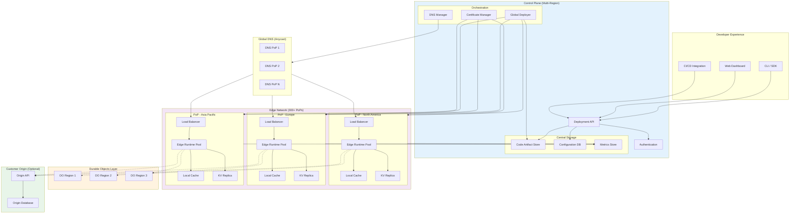
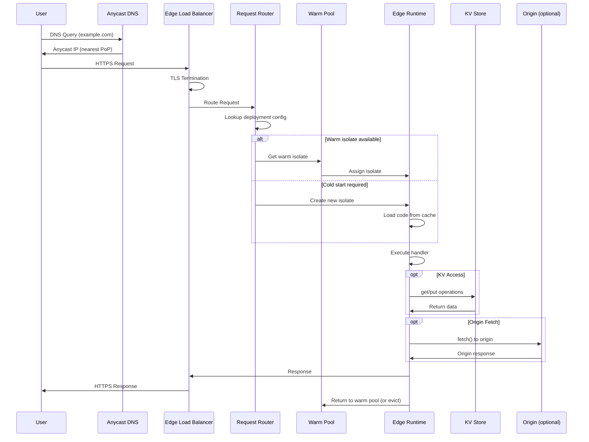
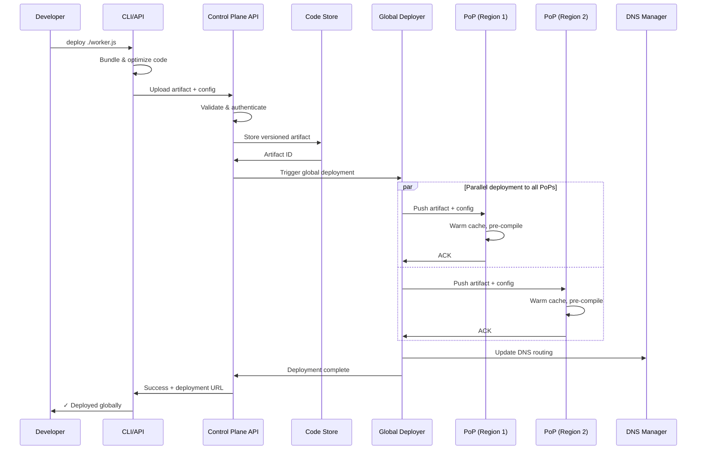
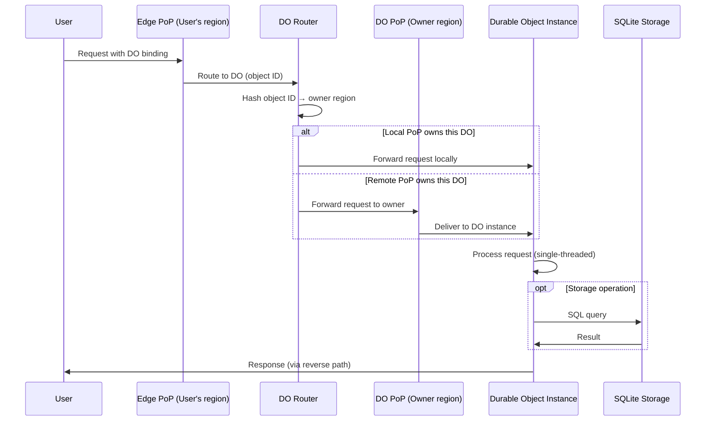

# High-Level Design

[Back to Index](./00-index.md) | [Previous: Requirements](./01-requirements-and-estimations.md) | [Next: Low-Level Design](./03-low-level-design.md)

---

## System Architecture

The edge computing platform follows a **control plane / data plane** separation with globally distributed edge locations (PoPs) handling user traffic and a centralized control plane managing deployments, configuration, and aggregation.

---

## Core Components

### Control Plane

| Component | Responsibility | Technology |
|-----------|---------------|------------|
| **Deployment API** | Accept code uploads, trigger global distribution | REST/gRPC API |
| **Code Artifact Store** | Store versioned code bundles | Object Storage |
| **Configuration DB** | Routes, environment variables, bindings | Distributed SQL |
| **Global Deployer** | Orchestrate code push to all PoPs | Event-driven pipeline |
| **DNS Manager** | Manage anycast DNS records | DNS API integration |
| **Certificate Manager** | TLS certificates for custom domains | ACME / PKI |
| **Metrics Aggregation** | Collect and aggregate edge metrics | Time-series DB |

### Data Plane (Edge PoP)

| Component | Responsibility | Technology |
|-----------|---------------|------------|
| **Load Balancer** | TLS termination, request routing | L7 proxy |
| **Edge Runtime** | Execute isolates/VMs for each request | V8 / Firecracker / Wasmtime |
| **Warm Pool Manager** | Maintain pre-warmed isolates | Custom scheduler |
| **Code Cache** | Local cache of frequently-used code | In-memory + SSD |
| **KV Replica** | Eventually consistent KV store | Distributed KV |
| **Log Shipper** | Stream logs to control plane | Async log pipeline |

### Durable Objects Layer

| Component | Responsibility | Technology |
|-----------|---------------|------------|
| **DO Router** | Route requests to correct DO instance | Consistent hashing |
| **DO Runtime** | Execute stateful Durable Objects | Single-threaded isolate |
| **DO Storage** | SQLite-backed persistent storage | Embedded SQLite |
| **DO Replicator** | Handle failover and migration | Raft-like consensus |

---

## Data Flow Diagrams

### Request Handling Flow

### Deployment Flow

### Durable Object Routing Flow

---

## Key Architectural Decisions

### Decision 1: Isolation Technology

| Option | Pros | Cons | Verdict |
|--------|------|------|---------|
| **V8 Isolates** | 5ms cold start, low memory, proven | JS/TS only, limited CPU | **Default choice** |
| **Firecracker microVM** | Full OS, any runtime, strong isolation | 125ms cold start, higher memory | For custom runtimes |
| **WASM (Wasmtime)** | 35μs cold start, any compiled language | Compilation step, WASI limitations | For performance-critical |
| **Containers** | Maximum flexibility, familiar tooling | 500ms+ cold start, heavy | **Not for edge** |

**Recommendation**: V8 Isolates as default for JavaScript/TypeScript workloads. Offer WASM for compiled languages. Reserve Firecracker for users needing full VM control.

### Decision 2: Request Routing

| Option | Pros | Cons | Verdict |
|--------|------|------|---------|
| **Anycast DNS** | Automatic nearest PoP, simple, DDoS resilient | No fine-grained control | **Default choice** |
| **GeoDNS** | Region-specific routing, more control | More complex, slower failover | For compliance needs |
| **Latency-based** | Optimal latency routing | Requires constant probing | For latency-critical |

**Recommendation**: Anycast DNS for simplicity and automatic failover. BGP naturally routes to nearest healthy PoP.

### Decision 3: State Management

| Option | Consistency | Latency | Use Case |
|--------|-------------|---------|----------|
| **Workers KV** | Eventual (~60s) | < 5ms (local read) | Config, sessions, cache |
| **Durable Objects** | Strong | 10-100ms (routed) | Coordination, counters, locks |
| **Origin Database** | Strong | 50-200ms | Complex queries, transactions |

**Recommendation**: Use KV for read-heavy, latency-sensitive data. Use Durable Objects when strong consistency is required. Fall back to origin for complex database needs.

### Decision 4: Code Distribution

| Option | Pros | Cons | Verdict |
|--------|------|------|---------|
| **Push (Proactive)** | No cold start on first request | Higher bandwidth, wasted for cold routes | For popular functions |
| **Pull (On-demand)** | Efficient bandwidth use | Cold start on first request | For long-tail functions |
| **Hybrid** | Best of both worlds | More complex | **Recommended** |

**Recommendation**: Push to all PoPs for top 10% of functions by traffic. Pull on-demand for remaining long-tail functions with aggressive caching.

### Decision 5: Cold Start Strategy

| Option | Cold Start | Memory | Complexity |
|--------|------------|--------|------------|
| **On-demand** | Full cold start | Minimal | Low |
| **Warm Pools** | Near-zero | Higher (idle isolates) | Medium |
| **Pre-warming** | Zero (predicted) | Highest | High |

**Recommendation**: Maintain warm pools sized based on recent traffic patterns. Pre-warm for scheduled/cron workloads.

---

## Architecture Pattern Checklist

| Pattern | Decision | Rationale |
|---------|----------|-----------|
| Sync vs Async | **Sync** for requests, **Async** for logs/metrics | Request latency critical |
| Event-driven vs Request-response | **Request-response** primary | Edge handles HTTP directly |
| Push vs Pull (code) | **Hybrid** | Popular push, long-tail pull |
| Stateless vs Stateful | **Stateless** default, **Stateful** via DO | Simplifies scaling |
| Read vs Write optimization | **Read-heavy** | 1000:1 read:write typical |
| Real-time vs Batch | **Real-time** for requests, **Batch** for logs | Latency vs efficiency |
| Edge vs Origin | **Edge-first** | Minimize origin round-trips |

---

## Failure Modes & Mitigations

| Failure Mode | Impact | Detection | Mitigation |
|--------------|--------|-----------|------------|
| PoP outage | Traffic to that PoP fails | Health checks, BGP withdraw | Anycast auto-routes to next PoP |
| Isolate crash | Single request fails | Process monitoring | Retry on different isolate |
| Code deployment failure | New code not available | Deployment health check | Automatic rollback |
| KV replication lag | Stale data served | Lag monitoring | Accept eventual consistency |
| DO instance failure | Requests to that DO fail | Health monitoring | DO migration to healthy node |
| Control plane outage | No new deployments | Multi-region control plane | Existing deployments unaffected |
| DNS outage | All traffic fails | DNS monitoring | Multi-provider DNS |

---

## Graceful Degradation Levels

| Level | Trigger | Behavior |
|-------|---------|----------|
| **Level 0 (Normal)** | All systems healthy | Full functionality |
| **Level 1 (KV Degraded)** | KV replication slow | Serve stale data, log warnings |
| **Level 2 (PoP Overloaded)** | PoP at capacity | Spillover to nearby PoPs |
| **Level 3 (Partial Outage)** | Multiple PoPs down | Route to remaining PoPs, higher latency |
| **Level 4 (Control Plane Down)** | Control plane unreachable | Existing deployments work, no changes |

---

## Technology Stack Summary

| Layer | Technology | Rationale |
|-------|------------|-----------|
| **Edge Runtime** | V8 (JavaScript), Wasmtime (WASM) | Fast cold start, security |
| **Load Balancer** | Custom L7 proxy | Fine-grained control |
| **KV Store** | Distributed KV (Cassandra-style) | Global replication |
| **Durable Objects** | SQLite + custom routing | Strong consistency |
| **DNS** | Anycast DNS | Automatic geo-routing |
| **TLS** | TLS 1.3 | Security, performance |
| **Control Plane API** | REST + gRPC | Compatibility + performance |
| **Code Store** | Object Storage | Durability, versioning |
| **Metrics** | Time-series DB | High-cardinality metrics |
| **Logs** | Streaming pipeline | Real-time log delivery |

---

## Interview Tips: High-Level Design Phase

### Key Points to Cover

1. **Control Plane / Data Plane separation** - Critical for scalability
2. **Anycast routing** - Explain BGP-based automatic nearest-PoP routing
3. **Isolation technology choice** - V8 isolates for JavaScript, WASM for compiled
4. **State management spectrum** - KV (eventual) vs Durable Objects (strong)
5. **Cold start optimization** - Warm pools, code caching

### Common Follow-up Questions

- "How does anycast work?" → BGP advertises same IP from multiple locations
- "What happens when a PoP fails?" → BGP withdraws route, traffic shifts automatically
- "How do you handle global state?" → Eventual consistency for reads, Durable Objects for coordination
- "Why not just use containers?" → Cold start (5ms vs 500ms) makes containers unsuitable for edge

### Diagram Tips

- Start with users → DNS → PoPs → runtime
- Show control plane separately from data plane
- Highlight the request path (most important flow)
- Add Durable Objects as a separate layer (routed, not local)

---

**Next: [03 - Low-Level Design](./03-low-level-design.md)**
