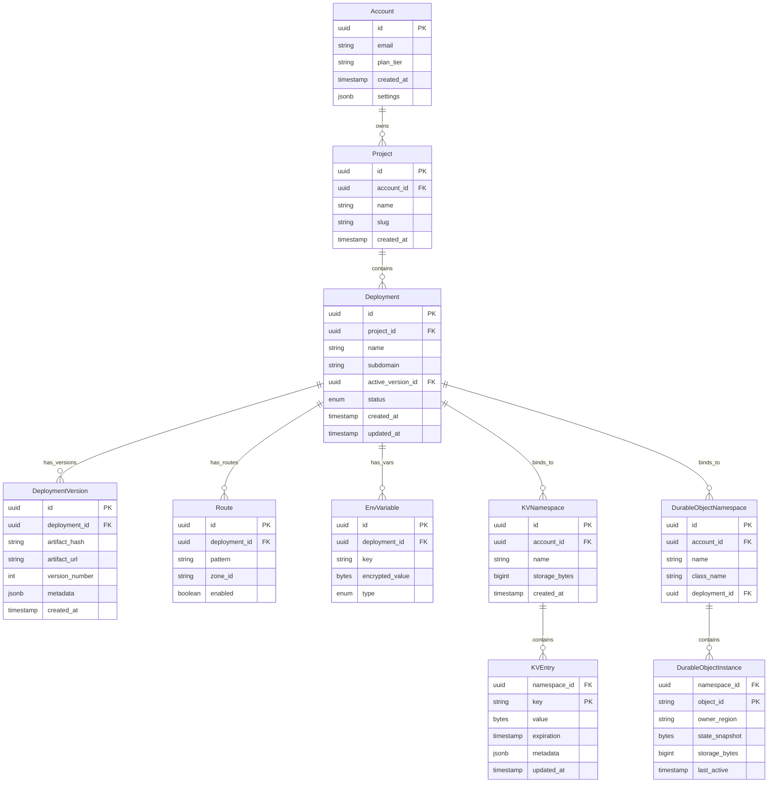
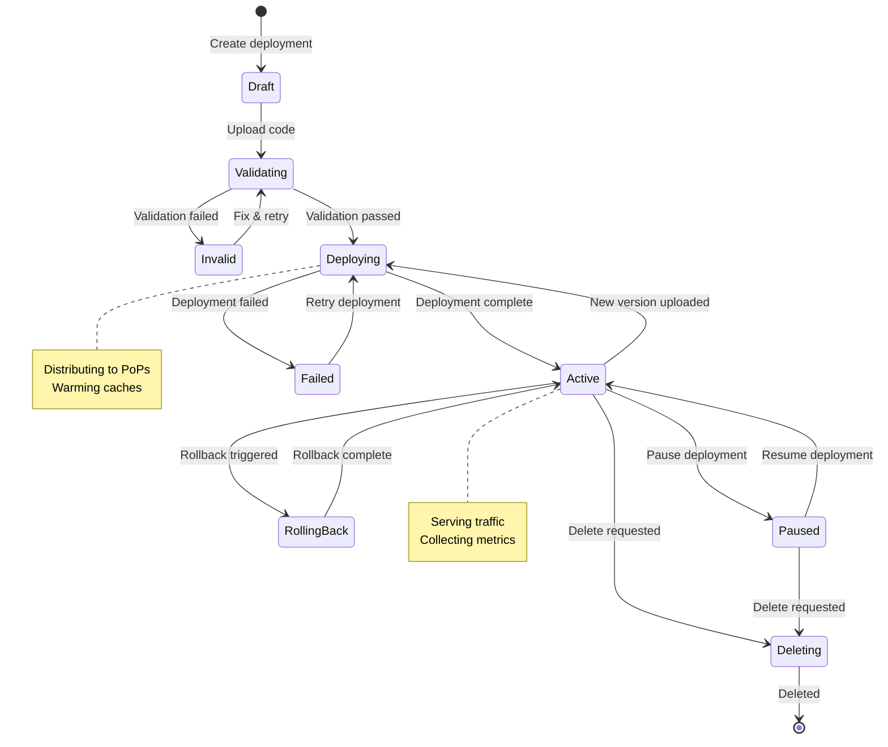
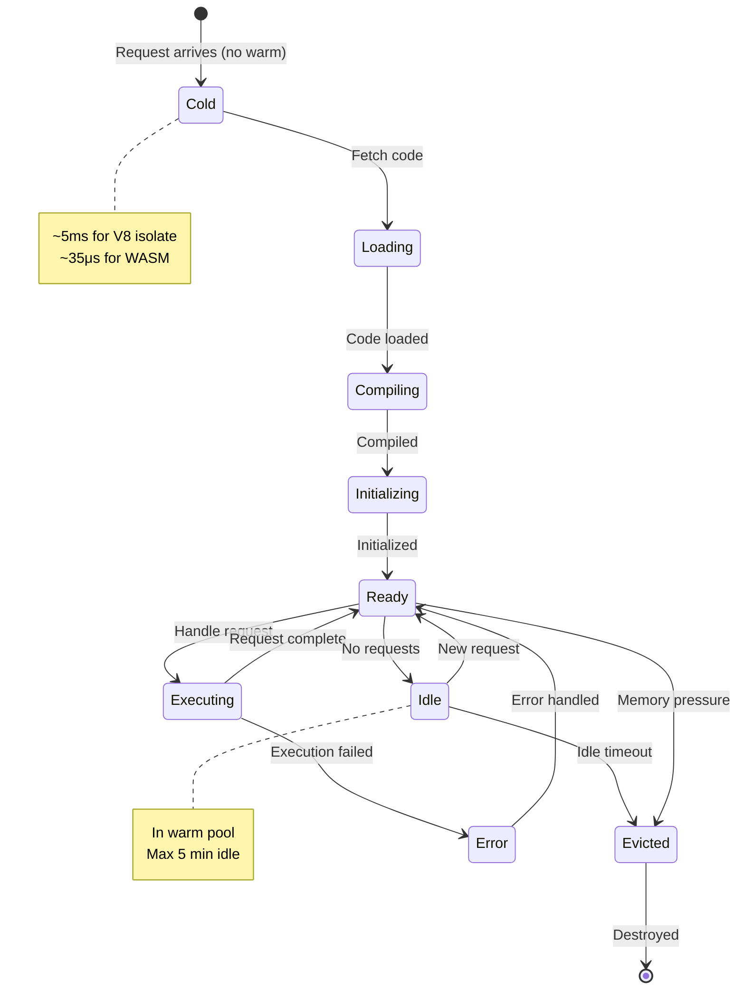
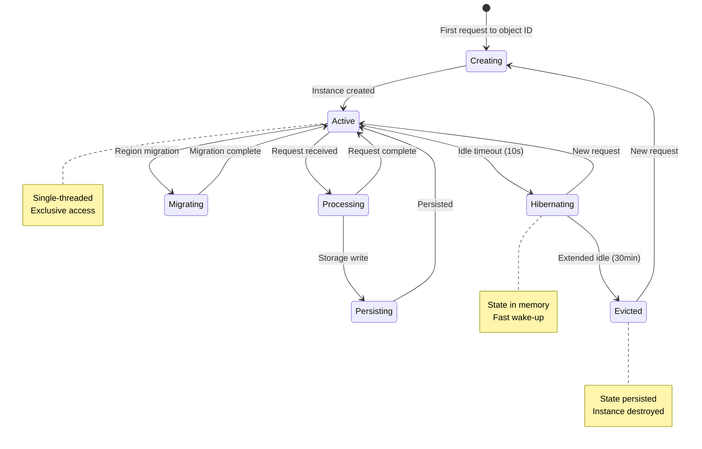

# Low-Level Design

[Back to Index](./00-index.md) | [Previous: High-Level Design](./02-high-level-design.md) | [Next: Deep Dive](./04-deep-dive-and-bottlenecks.md)

---

## Data Models

### Entity Relationship Diagram



### Core Tables Schema

```sql
-- Accounts table
CREATE TABLE accounts (
    id              UUID PRIMARY KEY DEFAULT gen_random_uuid(),
    email           VARCHAR(255) NOT NULL UNIQUE,
    plan_tier       VARCHAR(50) DEFAULT 'free',
    created_at      TIMESTAMP DEFAULT NOW(),
    settings        JSONB DEFAULT '{}'
);

-- Projects table
CREATE TABLE projects (
    id              UUID PRIMARY KEY DEFAULT gen_random_uuid(),
    account_id      UUID NOT NULL REFERENCES accounts(id),
    name            VARCHAR(255) NOT NULL,
    slug            VARCHAR(100) NOT NULL,
    created_at      TIMESTAMP DEFAULT NOW(),
    UNIQUE (account_id, slug)
);

-- Deployments table
CREATE TABLE deployments (
    id                  UUID PRIMARY KEY DEFAULT gen_random_uuid(),
    project_id          UUID NOT NULL REFERENCES projects(id),
    name                VARCHAR(255) NOT NULL,
    subdomain           VARCHAR(100) NOT NULL UNIQUE,
    active_version_id   UUID,
    status              VARCHAR(50) DEFAULT 'inactive',
    created_at          TIMESTAMP DEFAULT NOW(),
    updated_at          TIMESTAMP DEFAULT NOW()
);

-- Deployment versions table
CREATE TABLE deployment_versions (
    id              UUID PRIMARY KEY DEFAULT gen_random_uuid(),
    deployment_id   UUID NOT NULL REFERENCES deployments(id),
    artifact_hash   VARCHAR(64) NOT NULL,
    artifact_url    VARCHAR(500) NOT NULL,
    version_number  INT NOT NULL,
    metadata        JSONB DEFAULT '{}',
    created_at      TIMESTAMP DEFAULT NOW(),
    UNIQUE (deployment_id, version_number)
);

-- Routes table
CREATE TABLE routes (
    id              UUID PRIMARY KEY DEFAULT gen_random_uuid(),
    deployment_id   UUID NOT NULL REFERENCES deployments(id),
    pattern         VARCHAR(500) NOT NULL,
    zone_id         VARCHAR(100),
    enabled         BOOLEAN DEFAULT true,
    UNIQUE (pattern, zone_id)
);

-- Environment variables table
CREATE TABLE env_variables (
    id              UUID PRIMARY KEY DEFAULT gen_random_uuid(),
    deployment_id   UUID NOT NULL REFERENCES deployments(id),
    key             VARCHAR(255) NOT NULL,
    encrypted_value BYTEA NOT NULL,
    type            VARCHAR(50) DEFAULT 'plain',
    UNIQUE (deployment_id, key)
);

-- KV namespaces table
CREATE TABLE kv_namespaces (
    id              UUID PRIMARY KEY DEFAULT gen_random_uuid(),
    account_id      UUID NOT NULL REFERENCES accounts(id),
    name            VARCHAR(255) NOT NULL,
    storage_bytes   BIGINT DEFAULT 0,
    created_at      TIMESTAMP DEFAULT NOW(),
    UNIQUE (account_id, name)
);

-- Durable Object namespaces table
CREATE TABLE do_namespaces (
    id              UUID PRIMARY KEY DEFAULT gen_random_uuid(),
    account_id      UUID NOT NULL REFERENCES accounts(id),
    name            VARCHAR(255) NOT NULL,
    class_name      VARCHAR(255) NOT NULL,
    deployment_id   UUID REFERENCES deployments(id),
    created_at      TIMESTAMP DEFAULT NOW(),
    UNIQUE (account_id, name)
);
```

### Index Strategy

| Table | Index | Columns | Type | Rationale |
|-------|-------|---------|------|-----------|
| deployments | idx_deploy_subdomain | subdomain | UNIQUE B-tree | Route lookup by subdomain |
| deployments | idx_deploy_project | project_id | B-tree | List deployments per project |
| deployment_versions | idx_version_deploy | deployment_id, version_number | B-tree | Version lookup |
| routes | idx_route_pattern | pattern | B-tree | Route matching |
| kv_namespaces | idx_kv_account | account_id | B-tree | List namespaces |
| env_variables | idx_env_deploy | deployment_id | B-tree | Load all vars for deployment |

---

## API Design

### Deployment API

| Endpoint | Method | Description |
|----------|--------|-------------|
| `/v1/accounts/{account_id}/projects` | POST | Create project |
| `/v1/projects/{project_id}/deployments` | POST | Create deployment |
| `/v1/deployments/{deployment_id}/versions` | POST | Upload new version |
| `/v1/deployments/{deployment_id}/versions/{version}` | PUT | Activate version |
| `/v1/deployments/{deployment_id}` | DELETE | Delete deployment |
| `/v1/deployments/{deployment_id}/rollback` | POST | Rollback to previous |

#### Create Deployment

```
POST /v1/projects/{project_id}/deployments
Authorization: Bearer <token>
Content-Type: application/json

Request:
{
    "name": "my-worker",
    "subdomain": "my-worker",
    "routes": [
        {"pattern": "example.com/*", "zone_id": "zone123"}
    ],
    "env_vars": {
        "API_KEY": {"type": "secret", "value": "sk_live_xxx"}
    },
    "bindings": {
        "kv": [{"name": "CACHE", "namespace_id": "ns_xxx"}],
        "durable_objects": [{"name": "COUNTER", "class_name": "Counter"}]
    }
}

Response (201 Created):
{
    "id": "deploy_abc123",
    "name": "my-worker",
    "subdomain": "my-worker",
    "url": "https://my-worker.workers.dev",
    "status": "pending",
    "created_at": "2025-01-15T10:00:00Z"
}
```

#### Upload Version

```
POST /v1/deployments/{deployment_id}/versions
Authorization: Bearer <token>
Content-Type: multipart/form-data

Request:
- file: worker.js (bundled code)
- metadata: {"compatibility_date": "2025-01-01"}

Response (201 Created):
{
    "id": "ver_xyz789",
    "version_number": 5,
    "artifact_hash": "sha256:abc123...",
    "size_bytes": 102400,
    "created_at": "2025-01-15T10:05:00Z"
}
```

### Runtime API (Available in Worker Code)

| API | Method | Description |
|-----|--------|-------------|
| **KV** | `get(key)` | Read value by key |
| **KV** | `put(key, value, options)` | Write value with optional TTL |
| **KV** | `delete(key)` | Delete key |
| **KV** | `list(options)` | List keys with prefix/cursor |
| **Durable Objects** | `get(id)` | Get stub for DO instance |
| **DO Stub** | `fetch(request)` | Send request to DO |
| **DO Storage** | `get(key)` | Read from DO storage |
| **DO Storage** | `put(key, value)` | Write to DO storage |
| **DO Storage** | `sql(query)` | Execute SQL on DO SQLite |
| **Fetch** | `fetch(url, options)` | Make outbound HTTP request |
| **Cache** | `match(request)` | Check cache for response |
| **Cache** | `put(request, response)` | Store response in cache |

#### KV API Example

```javascript
// Pseudocode for KV operations
FUNCTION kv_get(namespace, key):
    // Check local PoP cache first
    cached = LOCAL_CACHE.get(namespace + ":" + key)
    IF cached AND NOT expired(cached):
        RETURN cached.value

    // Fetch from distributed KV store
    value = KV_STORE.get(namespace, key)

    // Cache locally with short TTL
    LOCAL_CACHE.set(namespace + ":" + key, value, TTL=60s)

    RETURN value

FUNCTION kv_put(namespace, key, value, options):
    // Validate size limits
    IF size(value) > 25MB:
        THROW "Value too large"

    // Write to distributed KV store
    KV_STORE.put(namespace, key, {
        value: value,
        expiration: options.expiration,
        metadata: options.metadata
    })

    // Invalidate local cache
    LOCAL_CACHE.delete(namespace + ":" + key)

    // Async replication to other PoPs (eventual consistency)
    ASYNC replicate_to_all_pops(namespace, key)
```

### Metrics & Logs Streaming API

| Endpoint | Method | Description |
|----------|--------|-------------|
| `/v1/deployments/{id}/logs/tail` | WebSocket | Real-time log streaming |
| `/v1/deployments/{id}/metrics` | GET | Query metrics with filters |
| `/v1/deployments/{id}/analytics` | GET | Aggregated analytics |

```
GET /v1/deployments/{id}/metrics?
    start=2025-01-15T00:00:00Z&
    end=2025-01-15T23:59:59Z&
    granularity=1h&
    metrics=requests,cpu_time,errors

Response:
{
    "deployment_id": "deploy_abc123",
    "granularity": "1h",
    "data": [
        {
            "timestamp": "2025-01-15T00:00:00Z",
            "requests": 150000,
            "cpu_time_ms": 45000,
            "errors": 15
        },
        ...
    ]
}
```

---

## Core Algorithms

### Request Routing Algorithm

```
ALGORITHM route_request(request):
    INPUT: HTTP request with Host header and path
    OUTPUT: Deployment ID and configuration to execute

    // Step 1: Extract routing key
    host = request.headers["Host"]
    path = request.path

    // Step 2: Check route cache (hot path)
    cache_key = hash(host + path)
    IF ROUTE_CACHE.exists(cache_key):
        RETURN ROUTE_CACHE.get(cache_key)

    // Step 3: Match against route patterns
    FOR route IN get_routes_for_zone(host):
        IF pattern_matches(route.pattern, host + path):
            deployment = get_deployment(route.deployment_id)
            config = {
                deployment_id: deployment.id,
                artifact_url: deployment.active_version.artifact_url,
                env_vars: decrypt_env_vars(deployment),
                bindings: deployment.bindings
            }

            // Cache for fast subsequent lookups
            ROUTE_CACHE.set(cache_key, config, TTL=60s)
            RETURN config

    // Step 4: Check subdomain routing (*.workers.dev)
    IF host.endswith(".workers.dev"):
        subdomain = extract_subdomain(host)
        deployment = get_deployment_by_subdomain(subdomain)
        IF deployment:
            RETURN build_config(deployment)

    // Step 5: No match - return 404
    RETURN NULL


FUNCTION pattern_matches(pattern, url):
    // Pattern examples: "example.com/*", "*.example.com/api/*"
    regex = pattern_to_regex(pattern)
    RETURN regex.match(url)

Complexity:
- Best case: O(1) - cache hit
- Average case: O(n) where n = number of routes for zone
- Worst case: O(n * m) where m = pattern complexity
```

### Isolate Scheduling Algorithm

```
ALGORITHM schedule_isolate(deployment_config):
    INPUT: Deployment configuration with code URL
    OUTPUT: Ready-to-execute isolate

    deployment_id = deployment_config.deployment_id
    artifact_hash = deployment_config.artifact_hash

    // Step 1: Check warm pool for this deployment
    IF WARM_POOL.has_available(deployment_id):
        isolate = WARM_POOL.acquire(deployment_id)
        isolate.reset_state()  // Clear request-specific state
        RETURN isolate

    // Step 2: Check if code is in local cache
    IF NOT CODE_CACHE.exists(artifact_hash):
        // Fetch from artifact store
        code = fetch_artifact(deployment_config.artifact_url)
        CODE_CACHE.set(artifact_hash, code)

    code = CODE_CACHE.get(artifact_hash)

    // Step 3: Create new isolate
    isolate = V8_RUNTIME.create_isolate({
        memory_limit: 128MB,
        cpu_limit: 50ms,
        code: code,
        env: deployment_config.env_vars,
        bindings: deployment_config.bindings
    })

    // Step 4: Compile and initialize
    isolate.compile()
    isolate.initialize()

    RETURN isolate


ALGORITHM manage_warm_pool():
    // Background process to maintain warm isolates

    LOOP forever:
        // Analyze traffic patterns
        hot_deployments = get_top_deployments_by_traffic(limit=1000)

        FOR deployment IN hot_deployments:
            target_warm = calculate_target_warm_count(deployment)
            current_warm = WARM_POOL.count(deployment.id)

            IF current_warm < target_warm:
                // Pre-warm additional isolates
                FOR i IN range(target_warm - current_warm):
                    isolate = create_isolate(deployment)
                    WARM_POOL.add(deployment.id, isolate)

            ELSE IF current_warm > target_warm * 2:
                // Evict excess isolates
                excess = current_warm - target_warm
                WARM_POOL.evict(deployment.id, count=excess)

        // Evict idle isolates older than threshold
        WARM_POOL.evict_idle(max_age=5min)

        SLEEP(10 seconds)

Complexity:
- Warm hit: O(1)
- Cold start: O(code_size) for compilation
```

### Durable Object Routing Algorithm

```
ALGORITHM route_to_durable_object(namespace_id, object_id):
    INPUT: DO namespace and unique object ID
    OUTPUT: Connection to the owning DO instance

    // Step 1: Determine owner region using consistent hashing
    hash_value = consistent_hash(namespace_id + ":" + object_id)
    owner_region = HASH_RING.get_node(hash_value)

    // Step 2: Check if local region owns this object
    local_region = get_current_region()

    IF owner_region == local_region:
        // Local - get or create DO instance
        instance = DO_MANAGER.get_or_create(namespace_id, object_id)
        RETURN LocalDOConnection(instance)

    ELSE:
        // Remote - proxy to owner region
        RETURN RemoteDOConnection(owner_region, namespace_id, object_id)


ALGORITHM durable_object_request(do_connection, request):
    // All requests to a DO are serialized (single-threaded)

    IF do_connection.is_local:
        // Execute locally with exclusive access
        instance = do_connection.instance

        ACQUIRE instance.lock  // Single-writer guarantee
        TRY:
            response = instance.fetch(request)
            RETURN response
        FINALLY:
            RELEASE instance.lock

    ELSE:
        // Forward to remote region
        remote_response = HTTP.post(
            url = do_connection.owner_url,
            body = serialize(request),
            headers = {"X-DO-Namespace": namespace_id, "X-DO-Object": object_id}
        )
        RETURN deserialize(remote_response)


ALGORITHM do_storage_sql(instance, query, params):
    // Execute SQL on DO's embedded SQLite

    // Validate query (prevent dangerous operations)
    IF NOT is_safe_query(query):
        THROW "Unsafe SQL query"

    // Execute with automatic transaction handling
    result = instance.sqlite.execute(query, params)

    // Sync to durable storage
    instance.sync_storage()

    RETURN result

Complexity:
- Local DO: O(1) for routing + O(query) for execution
- Remote DO: O(1) + network latency (10-100ms)
```

### Code Distribution Algorithm

```
ALGORITHM distribute_code(deployment_id, artifact):
    INPUT: Deployment ID and code artifact
    OUTPUT: Success/failure of global distribution

    // Step 1: Store artifact in central object storage
    artifact_hash = sha256(artifact)
    artifact_url = OBJECT_STORAGE.put(
        bucket = "artifacts",
        key = artifact_hash,
        data = artifact
    )

    // Step 2: Update deployment record
    version = create_deployment_version(deployment_id, artifact_hash, artifact_url)

    // Step 3: Determine distribution strategy
    deployment = get_deployment(deployment_id)
    traffic_rank = get_traffic_rank(deployment_id)

    IF traffic_rank <= 1000:  // Top 1000 by traffic
        strategy = "PUSH"  // Proactively distribute
    ELSE:
        strategy = "PULL"  // On-demand loading

    // Step 4: Execute distribution
    IF strategy == "PUSH":
        // Parallel push to all PoPs
        pops = get_all_pops()
        results = PARALLEL_FOR pop IN pops:
            TRY:
                notify_pop(pop, {
                    action: "CACHE_ARTIFACT",
                    deployment_id: deployment_id,
                    artifact_url: artifact_url,
                    artifact_hash: artifact_hash
                })
                RETURN {pop: pop.id, status: "success"}
            CATCH error:
                RETURN {pop: pop.id, status: "failed", error: error}

        // Verify majority success
        success_count = count(results WHERE status == "success")
        IF success_count < pops.length * 0.9:
            THROW "Distribution failed: insufficient PoPs"

    ELSE:  // PULL strategy
        // Just update routing config - PoPs will pull on demand
        update_routing_config(deployment_id, version.id)

    // Step 5: Activate new version
    activate_version(deployment_id, version.id)

    RETURN {
        version: version.version_number,
        artifact_hash: artifact_hash,
        strategy: strategy,
        activated_at: NOW()
    }

Complexity:
- Push: O(num_pops) parallel operations
- Pull: O(1) for config update, O(code_size) on first request
```

---

## State Machines

### Deployment Lifecycle



### Isolate Lifecycle



### Durable Object Instance Lifecycle



---

## Wire Formats

### Edge Configuration Wire Format

Optimized format for transmitting deployment config to edge PoPs:

```
Field Abbreviations:
- d: deployment_id
- v: version
- h: artifact_hash
- u: artifact_url
- e: env_vars (encrypted)
- b: bindings
- r: routes
- t: timestamp

Example:
{
    "d": "abc123",
    "v": 5,
    "h": "sha256:def456...",
    "u": "https://artifacts.example.com/def456",
    "e": "encrypted_blob_base64",
    "b": {
        "kv": [{"n": "CACHE", "ns": "ns_xyz"}],
        "do": [{"n": "COUNTER", "c": "Counter"}]
    },
    "r": ["example.com/*"],
    "t": 1705312800
}

Size: ~500 bytes (vs ~2KB uncompressed)
```

### Request Context Wire Format

Internal format passed to isolate runtime:

```
{
    "req": {
        "method": "GET",
        "url": "https://example.com/api/users",
        "headers": {"Authorization": "Bearer xxx"},
        "body": null
    },
    "ctx": {
        "cf": {
            "colo": "SJC",
            "country": "US",
            "city": "San Jose",
            "asn": 13335,
            "tlsVersion": "TLSv1.3"
        },
        "waitUntil": [],
        "passThroughOnException": false
    },
    "env": {
        "API_KEY": "decrypted_value",
        "CACHE": "<KVNamespace>",
        "COUNTER": "<DurableObjectNamespace>"
    }
}
```

---

## Interview Tips: Low-Level Design Phase

### Key Points to Cover

1. **Data model** - Show entity relationships, especially deployment → version → artifact
2. **API design** - RESTful deployment API + runtime API for worker code
3. **Routing algorithm** - Pattern matching with caching
4. **Isolate scheduling** - Warm pools, cold start optimization
5. **DO routing** - Consistent hashing for single-instance guarantee

### Common Deep-Dive Questions

- "How do you handle KV consistency?" → Eventual with local caching, show replication flow
- "Walk through a cold start" → Code fetch → compile → initialize → execute
- "How does DO routing work?" → Consistent hash determines owner region
- "How do you handle 10M deployments?" → Index strategy, caching, lazy loading

### Schema Design Tips

- Separate deployments from versions (enables rollback)
- Encrypt env vars at rest (security requirement)
- Use UUIDs for IDs (globally unique across PoPs)
- Index on access patterns (subdomain lookup, route matching)

---

**Next: [04 - Deep Dive & Bottlenecks](./04-deep-dive-and-bottlenecks.md)**
