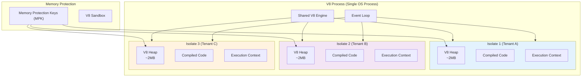
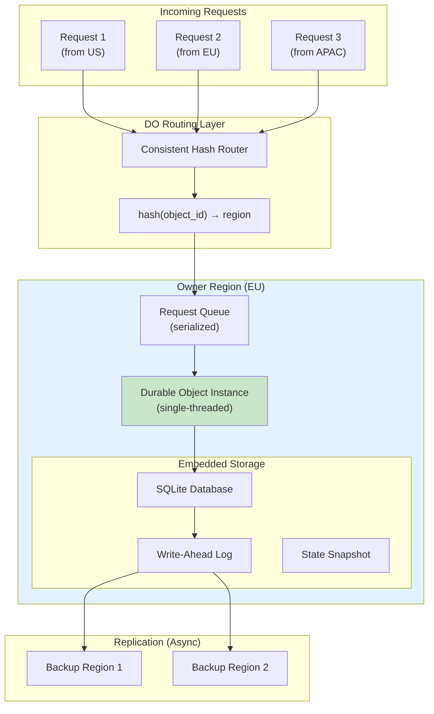
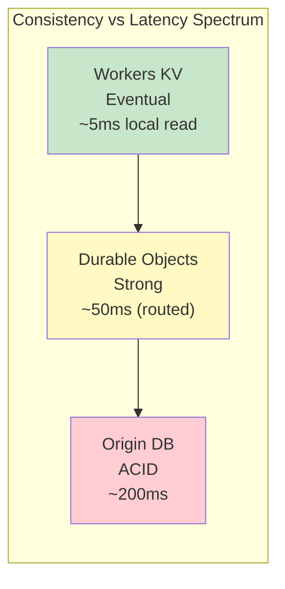
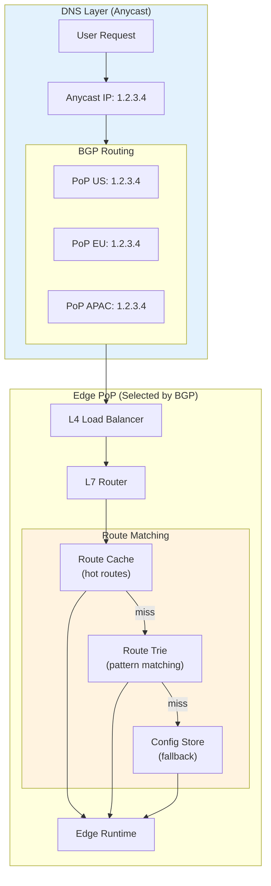
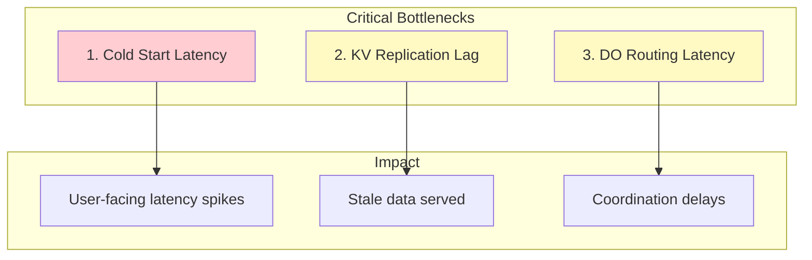
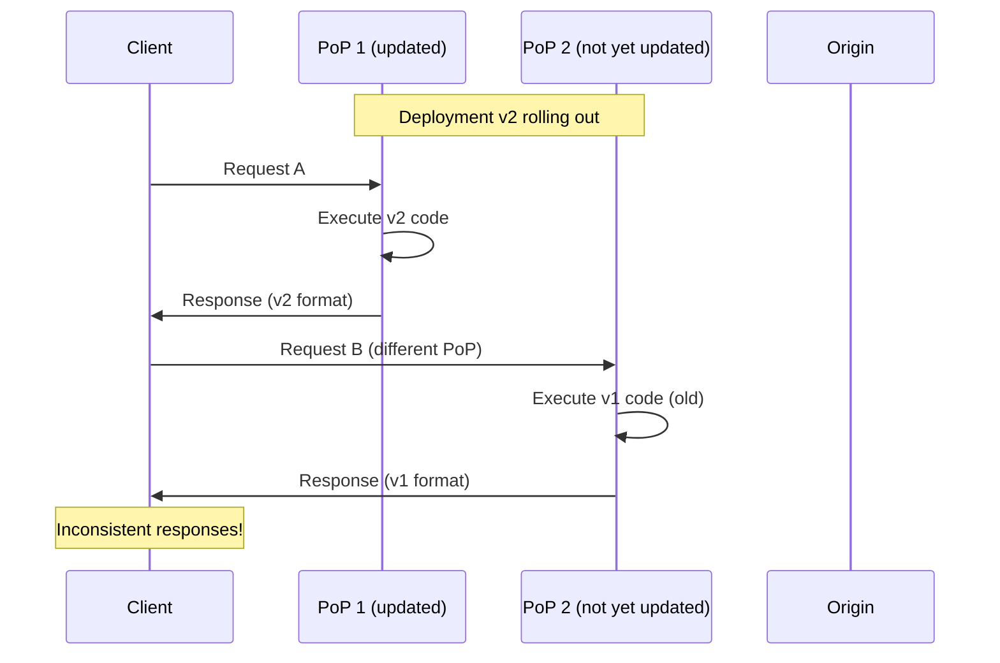
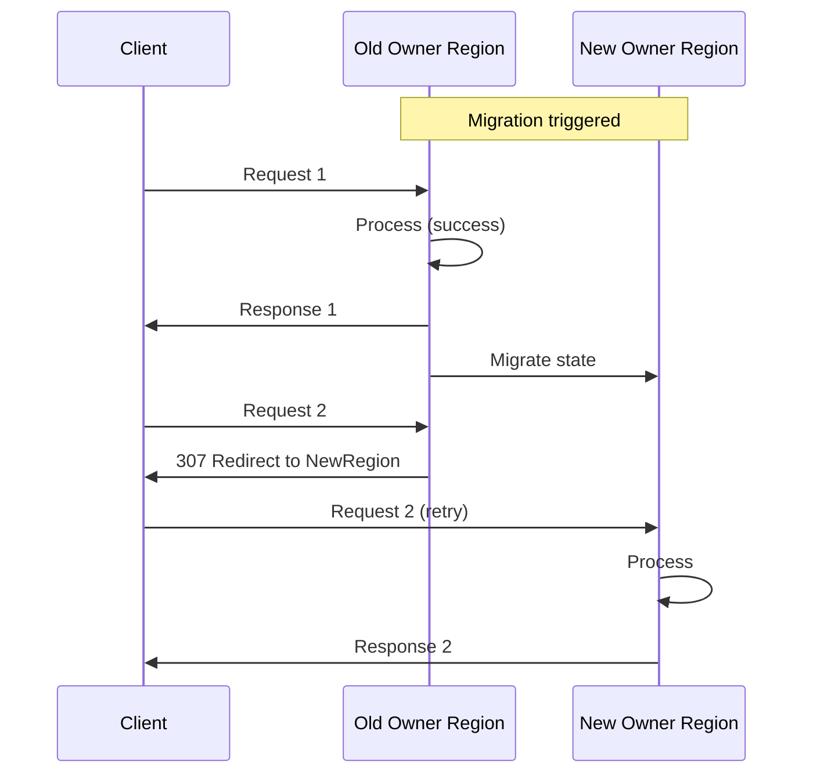

# Deep Dive & Bottlenecks

[Back to Index](./00-index.md) | [Previous: Low-Level Design](./03-low-level-design.md) | [Next: Scalability](./05-scalability-and-reliability.md)

---

## Critical Component Deep Dives

### 1. V8 Isolate Runtime

#### Why This Is Critical

The V8 isolate runtime is the foundation of edge execution. It determines cold start latency, memory efficiency, security isolation, and the languages/APIs available to developers. A poorly designed runtime would make the entire platform unusable for latency-sensitive workloads.

#### How It Works Internally



**Key Concepts:**

1. **Isolate**: A completely isolated instance of V8 with its own heap, compiled code, and execution context. Isolates within the same process share nothing—one isolate cannot access another's memory.

2. **Memory Layout**:
   ```
   Per-Isolate Memory (~2MB typical):
   ├── V8 Heap (objects, arrays, closures)     ~1.5MB
   ├── Compiled bytecode/machine code          ~300KB
   ├── Execution context (stack, registers)    ~100KB
   └── Bindings and runtime APIs               ~100KB
   ```

3. **Cold Start Sequence**:
   ```
   Cold Start Timeline (V8 Isolate):

   0ms    ─┬─ Create isolate
           │  └─ Allocate heap memory
   1ms    ─┼─ Load code from cache
           │  └─ Deserialize pre-compiled bytecode
   2ms    ─┼─ Initialize bindings
           │  └─ Attach KV, DO, fetch APIs
   3ms    ─┼─ Execute module initialization
           │  └─ Run top-level code
   4ms    ─┼─ Ready for request
   5ms    ─┴─ Handle first request
   ```

4. **Memory Protection Keys (MPK)**:
   - Hardware feature (Intel PKU) that tags memory regions
   - Each isolate gets a unique key (15 keys available)
   - Accessing memory with wrong key triggers hardware trap
   - ~92% effectiveness against isolation bypass attacks
   - ~1% performance overhead

#### Failure Modes

| Failure | Cause | Detection | Recovery |
|---------|-------|-----------|----------|
| Isolate crash | Unhandled exception, OOM | Process monitoring | Retry on new isolate |
| Memory limit exceeded | Large allocations, leaks | Memory tracking | Kill isolate, return 503 |
| CPU timeout | Infinite loop, complex computation | Wall-clock timeout | Kill isolate, return 503 |
| V8 engine bug | Rare V8 vulnerability | Crash dump analysis | Restart process, patch |

#### Performance Optimization

```
Optimization Techniques:

1. Code Pre-compilation
   - Parse and compile JavaScript to bytecode at deploy time
   - Store compiled bytecode in artifact store
   - Skip parsing phase on cold start
   - Savings: ~30% of cold start time

2. Snapshot-based Initialization
   - Take V8 heap snapshot after module initialization
   - Restore snapshot instead of re-executing init code
   - Savings: ~50% of cold start for complex modules

3. Shared Compiled Code
   - Multiple isolates for same deployment share compiled code
   - Code stored in read-only memory region
   - Savings: ~40% memory for popular deployments

4. Inline Caching
   - V8's hidden classes optimize property access
   - Warm isolates have pre-built inline caches
   - Savings: 10-100x faster property access
```

---

### 2. Durable Objects (Strongly Consistent State)

#### Why This Is Critical

Durable Objects solve the hardest problem in edge computing: maintaining strong consistency across a globally distributed system. Without them, developers must fall back to origin databases for any operation requiring coordination (counters, rate limiters, real-time collaboration).

#### How It Works Internally



**Key Concepts:**

1. **Single-Instance Guarantee**:
   - Each object ID maps to exactly one region via consistent hashing
   - Only one instance of that object exists globally
   - All requests for that object route to the owner region
   - Provides linearizable consistency

2. **Request Serialization**:
   ```
   Request Processing (Single-Threaded):

   Request 1 ──┐
   Request 2 ──┼──► Queue ──► [Process 1] [Process 2] [Process 3] ──► Responses
   Request 3 ──┘

   - Requests queue at the owner region
   - Processed one at a time (no concurrency within object)
   - Guarantees atomic read-modify-write operations
   - Typical latency: 10-50ms (network to owner)
   ```

3. **SQLite-Backed Storage**:
   ```sql
   -- Each Durable Object has its own SQLite database
   -- Storage limit: 10GB per object

   -- Automatic schema management
   CREATE TABLE IF NOT EXISTS _kv (
       key TEXT PRIMARY KEY,
       value BLOB
   );

   -- Custom tables via sql() API
   CREATE TABLE sessions (
       id TEXT PRIMARY KEY,
       user_id TEXT,
       created_at INTEGER,
       data BLOB
   );
   ```

4. **Hibernation**:
   ```
   Hibernation Timeline:

   Active ─────────────────────────────────────►
          │ Request │ Request │ Idle │ Idle │ Idle │
          └─────────┴─────────┴──────┴──────┴──────┘
                                 │      │      │
                                 ▼      │      │
                            10s: Hibernate (memory retained)
                                       │      │
                                       ▼      │
                               30min: Evict (state persisted)
                                             │
                                             ▼
                                    New request: Restore from storage
   ```

#### Failure Modes

| Failure | Cause | Detection | Recovery |
|---------|-------|-----------|----------|
| Owner region down | Network partition, DC failure | Health checks | Migrate to backup region |
| SQLite corruption | Disk failure, bug | Checksum validation | Restore from backup |
| Request timeout | Slow processing | Client timeout | Retry (idempotency keys) |
| Memory exhaustion | Large state, many objects | Memory monitoring | Evict idle objects |

#### Consistency Trade-offs



| Use Case | Recommended Storage | Rationale |
|----------|---------------------|-----------|
| User sessions | Workers KV | Read-heavy, eventual OK |
| Rate limiting | Durable Objects | Need accurate counts |
| Shopping cart | Durable Objects | Atomic updates |
| Product catalog | Workers KV | Read-heavy, cache-friendly |
| Multiplayer game state | Durable Objects | Real-time coordination |
| Analytics events | Workers KV + async | Write-heavy, eventual OK |

---

### 3. Global Request Router

#### Why This Is Critical

The request router determines which code runs for each request. A misconfigured or slow router means requests go to the wrong deployment, fail entirely, or add unacceptable latency. The router must handle millions of QPS with sub-millisecond overhead.

#### How It Works Internally



**Key Concepts:**

1. **Anycast DNS**:
   - Single IP address advertised from all PoPs via BGP
   - Internet routing automatically selects nearest PoP
   - No application-level geo-routing needed
   - Automatic failover: if PoP withdraws BGP route, traffic shifts

2. **Route Matching Algorithm**:
   ```
   ALGORITHM match_route(host, path):
       // Step 1: Check hot route cache (O(1))
       cache_key = hash(host + path)
       IF CACHE.exists(cache_key):
           RETURN CACHE.get(cache_key)

       // Step 2: Trie-based pattern matching (O(path_length))
       // Routes stored in trie: example.com/* → deploy_1
       //                        example.com/api/* → deploy_2
       node = TRIE.root
       FOR segment IN split(host + path, "/"):
           IF node.children.has(segment):
               node = node.children[segment]
           ELSE IF node.children.has("*"):
               node = node.children["*"]
               // Wildcard match
           ELSE:
               BREAK

       IF node.has_deployment:
           result = node.deployment
           CACHE.set(cache_key, result, TTL=60s)
           RETURN result

       // Step 3: Subdomain matching (*.workers.dev)
       IF host.endswith(".workers.dev"):
           subdomain = extract_subdomain(host)
           RETURN lookup_by_subdomain(subdomain)

       RETURN NULL  // 404
   ```

3. **Route Cache Design**:
   ```
   Cache Structure:

   Hot Route Cache (in-memory, per-server):
   ├── Size: 100K entries
   ├── Eviction: LRU with TTL (60s)
   ├── Hit rate: 95%+ for typical workloads
   └── Overhead: ~50MB memory

   Route Trie (shared, replicated):
   ├── Size: 10M routes
   ├── Update: Eventually consistent (30s)
   ├── Memory: ~500MB
   └── Lookup: O(path_depth)
   ```

4. **Health Checking & Failover**:
   ```mermaid
   sequenceDiagram
       participant HC as Health Checker
       participant PoP as Edge PoP
       participant BGP as BGP Router
       participant DNS as DNS Server

       loop Every 10 seconds
           HC->>PoP: Health check request
           alt PoP healthy
               PoP->>HC: 200 OK
           else PoP unhealthy
               PoP->>HC: Timeout / Error
               HC->>BGP: Withdraw route
               BGP->>DNS: Update BGP tables
               Note over DNS: Traffic shifts to<br/>nearest healthy PoP
           end
       end
   ```

#### Failure Modes

| Failure | Cause | Detection | Recovery |
|---------|-------|-----------|----------|
| Route cache miss storm | Config change, cache eviction | Cache hit rate drop | Pre-warm cache on config push |
| Route config corruption | Bad deployment, race condition | Config validation | Rollback to previous config |
| BGP route leak | Misconfiguration | Route monitoring | Withdraw bad route |
| DNS resolution failure | DNS provider outage | External monitoring | Multi-provider DNS |

---

## Bottleneck Analysis

### Top 3 Bottlenecks



### Bottleneck 1: Cold Start Latency

**Problem**: When no warm isolate is available, a cold start adds 5-50ms latency.

**Analysis**:
```
Cold Start Breakdown:
├── Isolate creation       1-2ms
├── Code loading           1-5ms (depends on size, cache)
├── Code compilation       1-10ms (depends on complexity)
├── Module initialization  1-30ms (depends on user code)
└── Total                  5-50ms

Frequency:
- With warm pools: ~1% of requests
- Without warm pools: ~10% of requests
- After deployment: 100% (briefly)
```

**Mitigation Strategies**:

| Strategy | Description | Impact | Trade-off |
|----------|-------------|--------|-----------|
| Warm pools | Keep idle isolates ready | -90% cold starts | Memory overhead |
| Code pre-compilation | Compile at deploy time | -30% cold start time | Longer deploys |
| Smaller bundles | Tree-shake unused code | -20% load time | Developer effort |
| Lazy initialization | Defer non-critical init | -50% init time | Code complexity |
| Predictive warming | Pre-warm based on patterns | -80% cold starts | Prediction accuracy |

### Bottleneck 2: KV Replication Lag

**Problem**: Eventually consistent KV means writes may not be visible globally for up to 60 seconds.

**Analysis**:
```
Replication Flow:
Write (US-West) ──► Primary Store ──► Replication Queue ──► EU ──► APAC
                         │                    │              │      │
                       Ack to                10s           30s    60s
                       client

Consistency Windows:
- Same PoP: Immediate (write-through)
- Adjacent region: ~10-20s
- Global: ~60s worst case
```

**Mitigation Strategies**:

| Strategy | Description | Use Case |
|----------|-------------|----------|
| Read-your-writes | Route reads to write region | User-specific data |
| Cache-aside | Local cache with short TTL | High-read workloads |
| Versioned keys | Include version in key | Conflict detection |
| Durable Objects | Use DO for strong consistency | Critical operations |

### Bottleneck 3: Durable Object Routing Latency

**Problem**: Requests must route to the owner region, adding 10-100ms latency.

**Analysis**:
```
Latency Components:
├── Local PoP processing     2-5ms
├── Network to owner region  10-80ms (geo-dependent)
├── DO request queue         0-10ms (if busy)
├── DO execution             1-50ms (user code)
└── Total                    15-150ms

Geographic Impact:
- US user → US DO owner: ~15ms
- US user → EU DO owner: ~80ms
- US user → APAC DO owner: ~150ms
```

**Mitigation Strategies**:

| Strategy | Description | Trade-off |
|----------|-------------|-----------|
| Geo-affinity hints | Hint preferred owner region | May cause hot spots |
| Read replicas | Serve reads from local replica | Eventual consistency |
| Sharding | Distribute objects by user geo | Application complexity |
| Caching at edge | Cache DO responses | Staleness |

---

## Concurrency & Race Conditions

### Race Condition 1: Deployment Rollout

**Scenario**: New deployment is being rolled out while requests arrive.



**Mitigation**:
- Version header in responses: `X-Deployment-Version: v2`
- Client-side version pinning for critical flows
- Fast rollout (< 30s global) to minimize window
- Backward-compatible API changes

### Race Condition 2: KV Read-Modify-Write

**Scenario**: Two concurrent requests try to increment a counter in KV.

```
Request A (US):          Request B (EU):
1. Read counter: 100     1. Read counter: 100 (stale)
2. Compute: 100 + 1      2. Compute: 100 + 1
3. Write: 101            3. Write: 101
                         Lost update!
```

**Mitigation**:
- Use Durable Objects for counters (serialized access)
- Use atomic operations if KV supports them
- Accept eventual consistency for non-critical counters
- Use versioned keys with conflict detection

### Race Condition 3: Durable Object Migration

**Scenario**: DO instance migrating while requests in flight.



**Mitigation**:
- Atomic migration: Old region holds requests during transfer
- Redirect responses: Client retries to new region
- Idempotency keys: Safe retries
- Migration during low-traffic periods

---

## Performance Optimization Summary

| Component | Optimization | Expected Impact |
|-----------|--------------|-----------------|
| Cold start | Warm pools | -90% cold start rate |
| Cold start | Pre-compilation | -30% cold start time |
| Routing | Route cache | -95% route lookup time |
| Routing | Trie structure | O(path_depth) matching |
| KV reads | Local caching | -80% KV latency |
| DO access | Geo-affinity | -50% routing latency |
| Memory | Shared compiled code | -40% memory for popular |
| Network | Connection pooling | -20% origin latency |

---

## Interview Tips: Deep Dive Phase

### How to Approach Deep Dives

1. **Pick 1-2 components** based on interviewer interest
2. **Explain the "why"** before the "how"
3. **Draw diagrams** for complex internal structures
4. **Discuss failure modes** proactively
5. **Quantify impact** where possible

### Sample Deep Dive: V8 Isolates

> "I'd like to deep dive into V8 isolates since they're critical for achieving our 5ms cold start target.
>
> V8 isolates are lightweight execution contexts that share a single OS process but have completely isolated heaps. This lets us run thousands of tenant workloads per server with 2MB memory per isolate instead of 200MB for containers.
>
> The cold start sequence involves: isolate creation (1ms), code loading from cache (2ms), bytecode deserialization (1ms), and module initialization (1ms). We pre-compile code at deploy time to skip parsing.
>
> For security, we use Memory Protection Keys—a hardware feature that tags memory regions with keys. Each isolate gets a unique key, and accessing memory with the wrong key triggers a hardware trap. This catches 92% of isolation bypass attempts with only 1% overhead.
>
> The main failure mode is memory exhaustion. We monitor isolate memory usage and kill isolates exceeding limits, returning 503 to the client. The warm pool manager maintains spare isolates to handle the next request immediately."

### Questions You Might Get

- "How do isolates compare to containers for security?" → Isolates are lighter but require careful V8 security; containers have stronger isolation but 100x slower cold starts
- "What if the V8 engine has a bug?" → Defense in depth: MPK, sandbox, process isolation, rapid patching
- "How do you handle CPU-intensive workloads?" → CPU time limits, WASM for compiled code, or redirect to origin

---

**Next: [05 - Scalability & Reliability](./05-scalability-and-reliability.md)**
