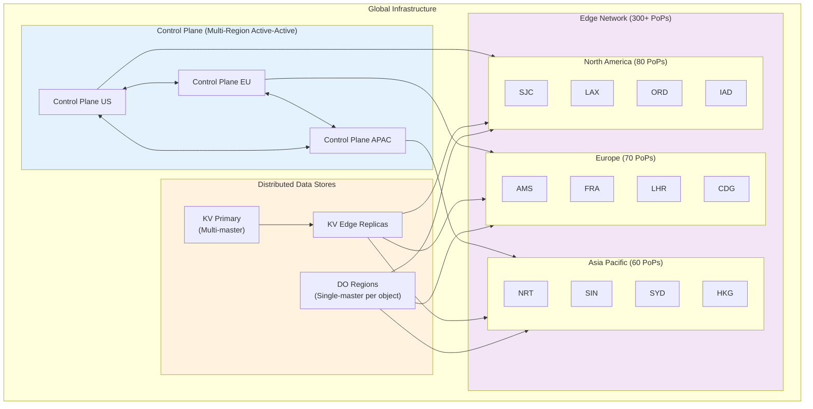
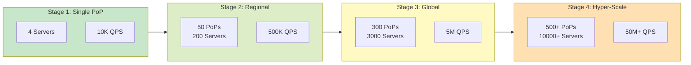
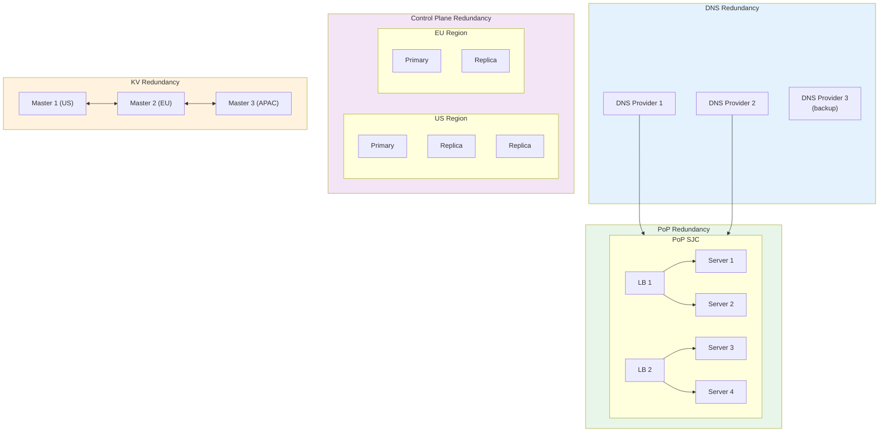
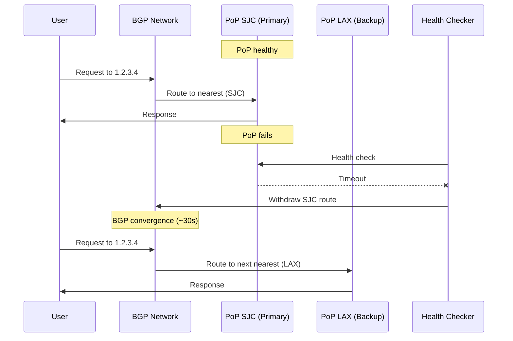
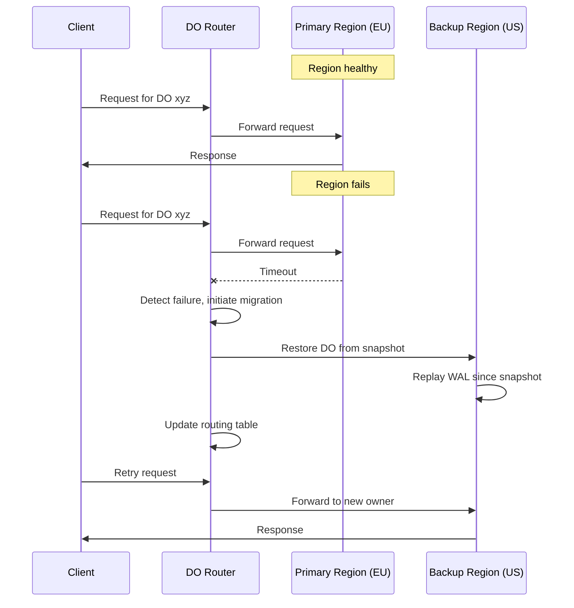
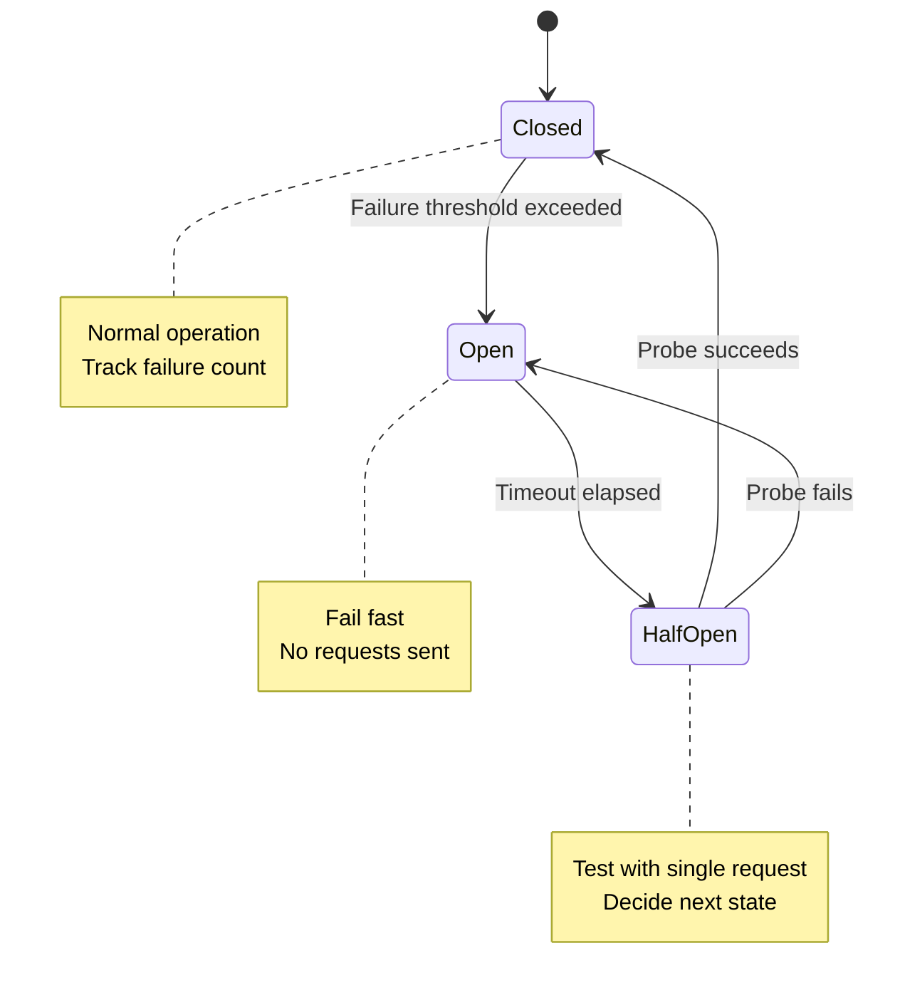
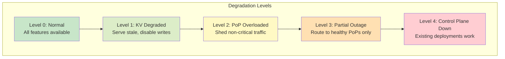
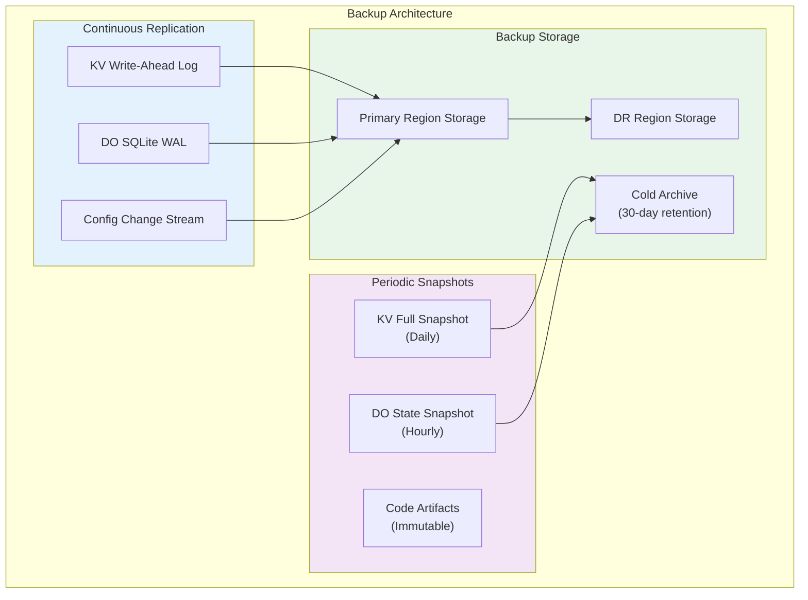
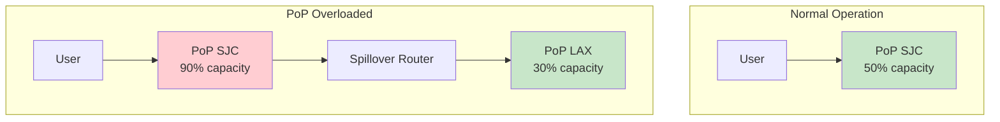

# Scalability & Reliability

[Back to Index](./00-index.md) | [Previous: Deep Dive](./04-deep-dive-and-bottlenecks.md) | [Next: Security](./06-security-and-compliance.md)

---

## Scalability Strategy

### Multi-Region Architecture



### Horizontal Scaling

| Component | Scaling Strategy | Trigger |
|-----------|-----------------|---------|
| Edge PoPs | Add new geographic locations | Latency targets in underserved regions |
| PoP Servers | Add servers within PoP | CPU > 70% or Memory > 80% |
| Isolate Workers | Scale isolate count per server | Request queue depth > 100 |
| Control Plane | Add replicas across regions | API latency p99 > 500ms |
| KV Replicas | Add replicas per PoP | Read latency > 10ms |
| DO Regions | Add regions for ownership | Hot region capacity |

### Vertical Scaling Limits

| Resource | Per-Isolate Limit | Per-Server Limit | Rationale |
|----------|-------------------|------------------|-----------|
| Memory | 128MB | 64GB | Isolate memory cap |
| CPU Time | 50ms wall-clock | - | Prevent runaway |
| Execution Time | 30s (default) | - | Long-running protection |
| Subrequests | 50 per request | - | Prevent amplification |
| Code Size | 10MB (after compression) | - | Cold start impact |

### Auto-Scaling Configuration

```yaml
# Per-PoP Auto-Scaling Rules
autoscaling:
  edge_servers:
    min_servers: 4
    max_servers: 100
    scale_up:
      - metric: cpu_utilization
        threshold: 70%
        period: 5m
        action: add_server
      - metric: memory_utilization
        threshold: 80%
        period: 5m
        action: add_server
      - metric: request_queue_depth
        threshold: 1000
        period: 1m
        action: add_server
    scale_down:
      - metric: cpu_utilization
        threshold: 30%
        period: 15m
        action: remove_server
    cooldown: 5m

  warm_pool:
    min_isolates_per_deployment: 0
    max_isolates_per_deployment: 1000
    scale_up:
      - metric: cold_start_rate
        threshold: 5%
        action: increase_warm_pool
    scale_down:
      - metric: isolate_idle_time
        threshold: 5m
        action: evict_isolate

  kv_replicas:
    min_replicas_per_pop: 2
    max_replicas_per_pop: 10
    scale_up:
      - metric: read_latency_p99
        threshold: 10ms
        action: add_replica
```

### Scaling Stages



---

## Reliability & Fault Tolerance

### Single Points of Failure (SPOF) Analysis

| Component | SPOF Risk | Mitigation |
|-----------|-----------|------------|
| DNS | High (global impact) | Multi-provider DNS, anycast |
| Control Plane | Medium (no new deploys) | Multi-region active-active |
| Individual PoP | Low (localized) | Anycast failover to nearest PoP |
| KV Primary | Medium (write failures) | Multi-master replication |
| DO Region | Low (per-object) | Migration to backup region |
| Code Artifact Store | Medium (deployment failures) | Geo-replicated object storage |

### Redundancy Architecture



### Failover Mechanisms

#### PoP Failover (Anycast)



**Failover Timeline**:
```
0s      - PoP failure occurs
5s      - Health check detects failure
10s     - BGP route withdrawal initiated
30s     - BGP convergence complete
30-60s  - All traffic shifted to backup PoPs
```

#### Durable Object Failover



**DO Failover Timeline**:
```
0s      - Region failure
10s     - Router detects failure
15s     - Migration initiated
20s     - Snapshot restored in backup
25s     - WAL replayed
30s     - Routing updated
30s+    - New requests served from backup
```

### Circuit Breaker Pattern



**Circuit Breaker Configuration**:

```yaml
circuit_breaker:
  origin_requests:
    failure_threshold: 5       # Failures before opening
    success_threshold: 3       # Successes to close
    timeout: 30s               # Time in open state
    half_open_requests: 1      # Probe requests

  kv_operations:
    failure_threshold: 10
    timeout: 10s

  do_requests:
    failure_threshold: 3
    timeout: 60s               # Longer for migration
```

### Retry Strategies

| Operation | Retry Strategy | Max Retries | Backoff |
|-----------|---------------|-------------|---------|
| Code fetch | Exponential | 3 | 100ms, 200ms, 400ms |
| KV read | Immediate | 2 | None (different replica) |
| KV write | Exponential | 3 | 50ms, 100ms, 200ms |
| DO request | Exponential | 3 | 100ms, 500ms, 2s |
| Origin fetch | Exponential | 3 | 100ms, 300ms, 1s |

### Graceful Degradation



**Degradation Behaviors**:

| Level | Trigger | Behavior |
|-------|---------|----------|
| Level 1 | KV replication lag > 5min | Serve cached/stale KV data, queue writes |
| Level 2 | PoP CPU > 90% | Reject lowest-priority traffic classes |
| Level 3 | Multiple PoP failures | Higher latency, traffic concentration |
| Level 4 | Control plane unreachable | No new deployments, existing code runs |

---

## Disaster Recovery

### Recovery Objectives

| Metric | Target | Measurement |
|--------|--------|-------------|
| **RPO** (Recovery Point Objective) | 0 for KV, < 1s for DO | Data loss tolerance |
| **RTO** (Recovery Time Objective) | < 30s for PoP, < 5min for region | Time to recovery |
| **MTTR** (Mean Time to Recovery) | < 15min | Average recovery time |
| **MTBF** (Mean Time Between Failures) | > 30 days per PoP | Reliability target |

### Backup Strategy



### Multi-Region DR

| Scenario | Impact | Recovery Procedure |
|----------|--------|-------------------|
| Single PoP failure | Minimal | Automatic anycast failover |
| Regional failure | Medium | Traffic shifts to other regions |
| Control plane failure | Medium | Existing deployments continue |
| Global KV failure | High | Restore from snapshots |
| Catastrophic (multi-region) | Severe | Failover to DR site |

### DR Runbook Summary

```
Scenario: Complete Region Failure

1. Detection (0-5min)
   - Automated alerts trigger
   - On-call acknowledges
   - Assess scope of failure

2. Containment (5-10min)
   - Withdraw region from DNS/BGP
   - Halt deployments to affected region
   - Notify status page

3. Recovery (10-30min)
   - Traffic already shifted via anycast
   - Initiate DO migrations from backups
   - Verify data integrity

4. Restoration (30min-4hr)
   - Bring up replacement infrastructure
   - Restore from backups
   - Re-add to DNS/BGP

5. Post-Incident
   - Customer communication
   - Root cause analysis
   - Remediation
```

---

## Load Shedding & Rate Limiting

### Traffic Priority Classes

| Priority | Traffic Type | Shedding Order |
|----------|--------------|----------------|
| P0 (Critical) | Health checks, auth | Never shed |
| P1 (High) | Paid customer traffic | Last to shed |
| P2 (Standard) | Free tier traffic | Shed under pressure |
| P3 (Best-effort) | Preview deployments | First to shed |

### Per-PoP Rate Limiting

```yaml
rate_limits:
  per_deployment:
    requests_per_second: 10000     # Burst limit
    requests_per_minute: 100000   # Sustained limit

  per_account:
    requests_per_second: 100000
    kv_reads_per_second: 50000
    kv_writes_per_second: 1000
    do_requests_per_second: 5000

  global:
    per_pop_capacity: 100000      # QPS per PoP
    spillover_threshold: 80%      # Trigger spillover
```

### Spillover Routing



---

## Interview Tips: Scale & Reliability Phase

### Key Points to Cover

1. **Multi-region architecture** - Show control plane and data plane separation
2. **Anycast failover** - Explain BGP-based automatic recovery
3. **Consistency trade-offs** - KV eventual vs DO strong
4. **Graceful degradation** - What happens when components fail
5. **RPO/RTO targets** - Be specific with numbers

### Common Questions

- "How do you handle a region going down?"
  > Anycast automatically routes to nearest healthy PoP. DO instances migrate to backup regions. RTO < 30s for traffic, < 5min for DO.

- "What's your RPO for user data?"
  > KV: 0 (synchronous to primary before ACK). DO: < 1s (WAL replicated async).

- "How do you prevent cascading failures?"
  > Circuit breakers, bulkheads (isolate components), and load shedding by priority class.

### Numbers to Remember

| Metric | Value |
|--------|-------|
| Anycast failover time | 30-60s (BGP convergence) |
| DO migration time | 15-30s |
| Cold start (V8) | < 5ms |
| KV propagation | < 60s |
| Target availability | 99.99% |

---

**Next: [06 - Security & Compliance](./06-security-and-compliance.md)**
