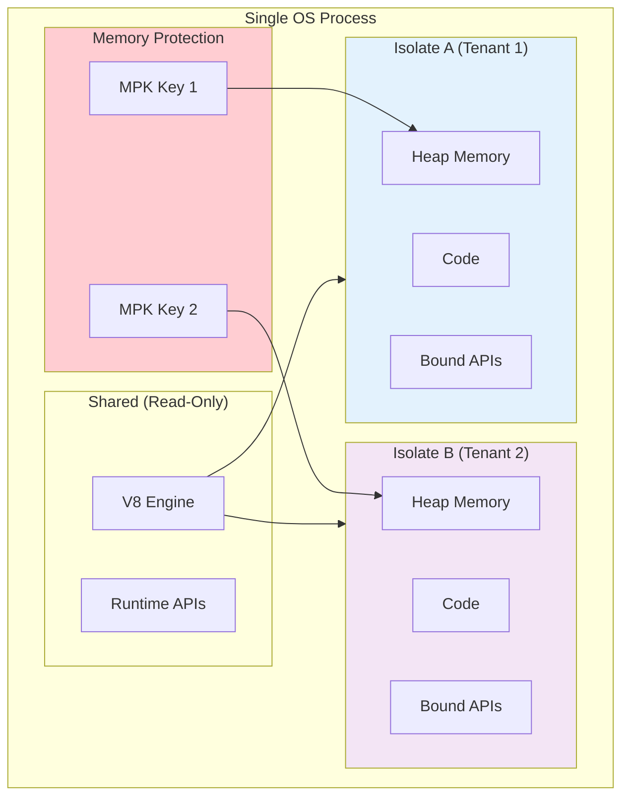
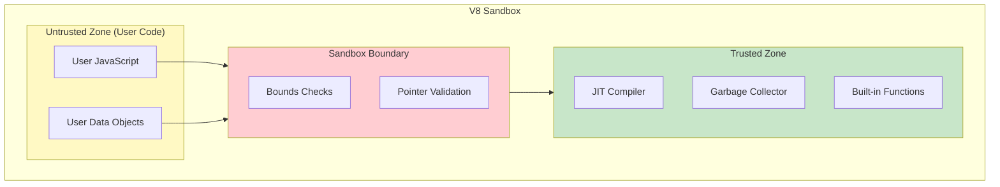
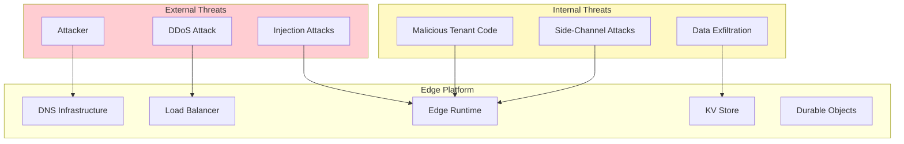
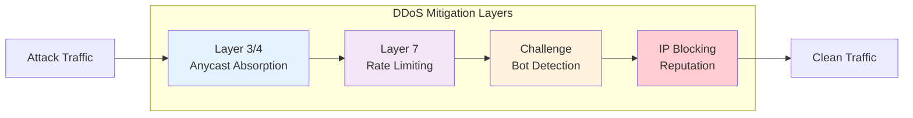
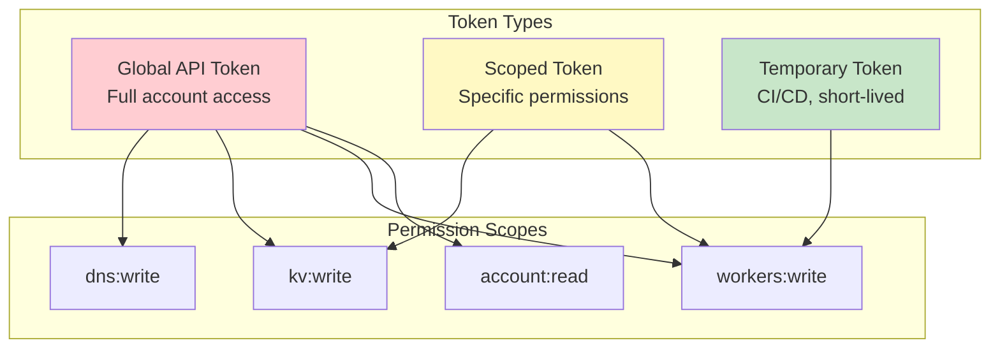
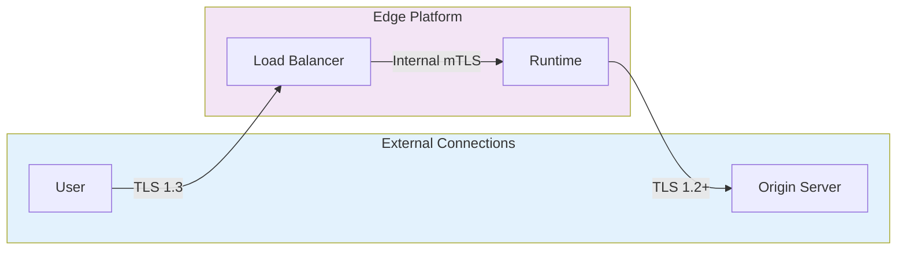
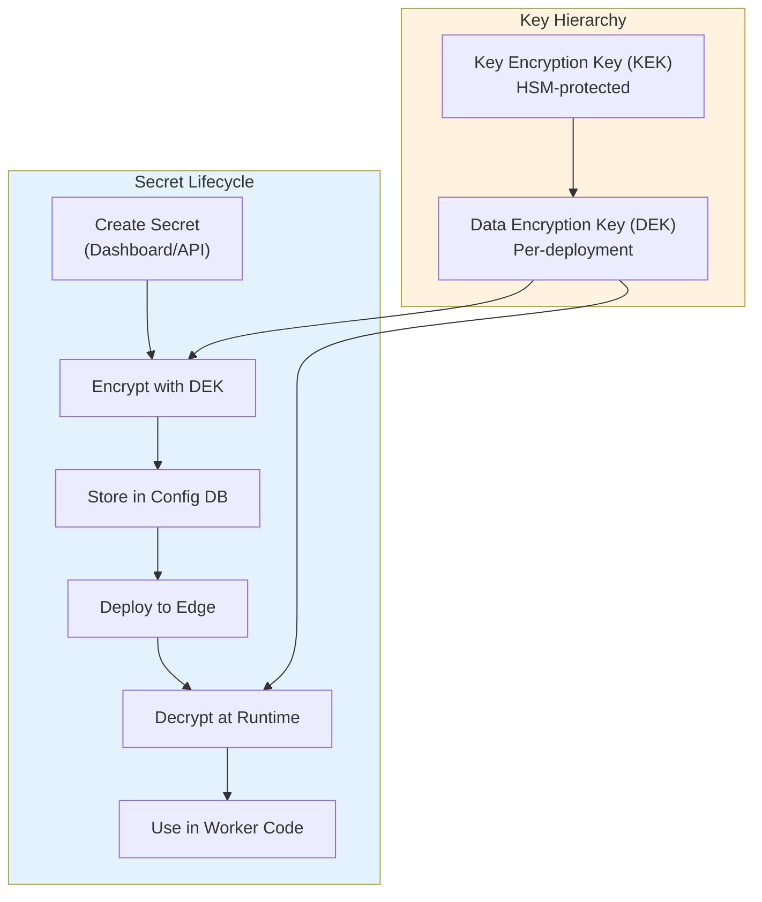
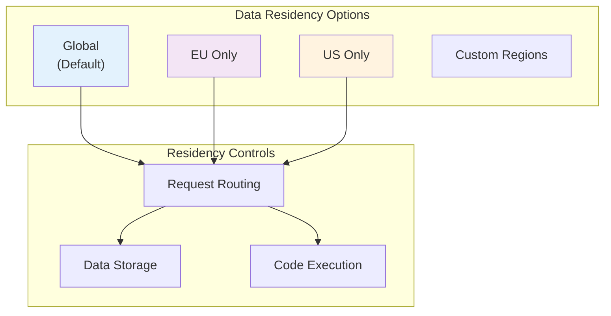
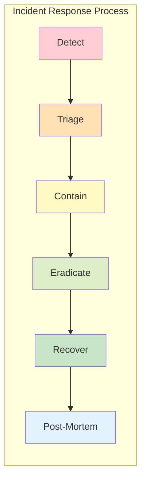

# Security & Compliance

[Back to Index](./00-index.md) | [Previous: Scalability](./05-scalability-and-reliability.md) | [Next: Observability](./07-observability.md)

---

## Security Model Overview

Edge computing platforms face unique security challenges: running untrusted customer code on shared infrastructure while maintaining isolation, protecting against network attacks at global scale, and securing data at rest and in transit across hundreds of locations.

```mermaid
flowchart TB
    subgraph SecurityLayers["Defense in Depth"]
        subgraph Network["Network Layer"]
            DDoS["DDoS Protection"]
            WAF["Web Application Firewall"]
            TLS["TLS 1.3 Termination"]
        end

        subgraph Isolation["Code Isolation Layer"]
            V8Sandbox["V8 Sandbox"]
            MPK["Memory Protection Keys"]
            ResourceLimits["Resource Limits"]
        end

        subgraph Data["Data Security Layer"]
            EncryptRest["Encryption at Rest"]
            EncryptTransit["Encryption in Transit"]
            SecretMgmt["Secret Management"]
        end

        subgraph Access["Access Control Layer"]
            AuthN["Authentication"]
            AuthZ["Authorization"]
            AuditLog["Audit Logging"]
        end
    end

    Network --> Isolation --> Data --> Access

    style Network fill:#e3f2fd
    style Isolation fill:#f3e5f5
    style Data fill:#fff3e0
    style Access fill:#e8f5e9
```



---

## Code Isolation

### V8 Isolate Security Model



**Isolation Guarantees**:

| Property | Mechanism | Strength |
|----------|-----------|----------|
| Memory isolation | V8 isolate boundaries + MPK | Strong |
| No shared state | Separate heaps per isolate | Strong |
| No filesystem access | API not exposed | Strong |
| No raw network | Only fetch() API | Strong |
| No child processes | API not exposed | Strong |
| CPU limits | Wall-clock timeout | Strong |
| Memory limits | Heap size cap | Strong |

### Memory Protection Keys (MPK)

```
MPK Security Model:

1. Each isolate assigned a random protection key (0-15)
2. V8 heap tagged with isolate's key
3. Before executing isolate code:
   - CPU's PKRU register set to allow only that key
4. Accessing memory with wrong key:
   - Hardware trap (#PF) triggered
   - Request terminated
   - Security event logged

Effectiveness:
- 92% of isolation bypass attempts detected
- ~1% performance overhead
- Hardware-level protection (not bypassable by software)
```

### V8 Sandbox Architecture



**Sandbox Protections**:

1. **Pointer compression**: Pointers stored as 32-bit offsets, limiting reachable memory
2. **Bounds checking**: All array/buffer accesses validated
3. **Type checking**: Runtime type validation for V8 internal operations
4. **Code integrity**: JIT-generated code verified before execution

### Resource Limits

| Resource | Limit | Enforcement |
|----------|-------|-------------|
| CPU time | 50ms wall-clock (default) | Hard timeout, isolate killed |
| Memory | 128MB heap | OOM exception, isolate killed |
| Subrequests | 50 per request | API returns error |
| Request size | 100MB | Connection closed |
| Response size | 100MB | Response truncated |
| Script size | 10MB compressed | Deploy rejected |

---

## Threat Model

### Attack Surface Diagram



### Threat Analysis

| Threat | Likelihood | Impact | Priority | Mitigation |
|--------|------------|--------|----------|------------|
| DDoS attack | High | High | P0 | Anycast absorption, rate limiting |
| Cross-tenant data access | Medium | Critical | P0 | Isolate boundaries, MPK |
| Supply chain attack | Medium | High | P1 | Code signing, dependency scanning |
| Credential theft | Medium | High | P1 | Encrypted secrets, rotation |
| Spectre/Meltdown | Low | Critical | P1 | V8 mitigations, isolate reset |
| DNS hijacking | Low | High | P1 | DNSSEC, multi-provider |
| API key compromise | Medium | Medium | P2 | Scoped tokens, audit logging |

### Threat Mitigations

#### 1. DDoS Protection



**Mitigation Capabilities**:
- Anycast distributes attack across 300+ PoPs
- Layer 3/4: 100+ Tbps absorption capacity
- Layer 7: Per-IP and per-path rate limiting
- Challenge pages for suspected bots
- IP reputation blocking

#### 2. Cross-Tenant Isolation

```
Defense Layers:

1. V8 Isolates
   - Complete heap separation
   - No shared mutable state

2. Memory Protection Keys
   - Hardware-enforced memory tagging
   - 92% attack detection rate

3. Spectre Mitigations
   - Isolate reset between tenants
   - Array bounds masking
   - Site isolation

4. Network Isolation
   - No raw sockets
   - Only fetch() API with restrictions
   - No access to local network
```

#### 3. Supply Chain Security

| Control | Description |
|---------|-------------|
| Code signing | Deployments signed with customer key |
| Dependency scanning | npm audit on deploy |
| Lockfile enforcement | Require package-lock.json |
| Build attestation | Verify build provenance |
| Artifact integrity | SHA-256 verification |

---

## Authentication & Authorization

### Authentication Methods

| Context | Method | Token Type |
|---------|--------|------------|
| Dashboard login | OAuth 2.0 / SSO | Session cookie |
| API access | API tokens | Bearer token |
| CI/CD deploy | Scoped API tokens | Bearer token |
| Worker → KV | Automatic (binding) | Internal token |
| Worker → DO | Automatic (binding) | Internal token |
| Worker → Origin | User-provided | Varies |

### API Token Security



**Token Best Practices**:

| Practice | Implementation |
|----------|---------------|
| Least privilege | Scope tokens to minimum required permissions |
| Short-lived | Use temporary tokens for CI/CD (< 1 hour) |
| Rotation | Rotate long-lived tokens every 90 days |
| Secure storage | Never commit tokens to source control |
| Audit | Log all token usage, alert on anomalies |

### Authorization Model

```
RBAC Roles:

Admin
├── Full account access
├── Manage members and billing
└── All worker operations

Developer
├── Create/update workers
├── Manage KV namespaces
└── View logs and metrics

Viewer
├── Read-only access
└── View deployments and logs

Service Account
├── Scoped to specific resources
└── Programmatic access only
```

---

## Data Security

### Encryption at Rest

| Data Type | Encryption | Key Management |
|-----------|------------|----------------|
| Code artifacts | AES-256-GCM | Platform-managed keys |
| KV values | AES-256-GCM | Per-account keys |
| DO SQLite | AES-256-GCM | Per-object keys |
| Environment variables | AES-256-GCM | Per-deployment keys |
| Logs | AES-256-GCM | Platform-managed keys |

### Encryption in Transit



**TLS Configuration**:

| Connection | Min TLS | Cipher Suites | Certificates |
|------------|---------|---------------|--------------|
| User → Edge | TLS 1.2 | Modern only | Auto-renewed (ACME) |
| Edge internal | TLS 1.3 | mTLS required | Internal CA |
| Edge → Origin | TLS 1.2 | Configurable | Origin's cert |

### Secret Management



**Secret Security**:

1. **Never logged**: Secrets excluded from all logging
2. **Memory protection**: Secrets cleared after use
3. **Access control**: Only bound workers can access
4. **Audit trail**: All secret access logged
5. **Rotation**: API for automated rotation

---

## Compliance

### Compliance Certifications

| Certification | Status | Scope |
|---------------|--------|-------|
| SOC 2 Type II | Certified | All services |
| ISO 27001 | Certified | All services |
| PCI DSS | Level 1 | Payment handling |
| HIPAA | BAA available | Healthcare data |
| GDPR | Compliant | EU data processing |
| FedRAMP | In progress | US government |

### Data Residency



**Data Residency Controls**:

| Control | Implementation |
|---------|---------------|
| Jurisdiction hints | Route requests to specific regions |
| DO placement | Place Durable Objects in specific regions |
| KV geo-restrictions | Limit KV replication to specific regions |
| Logs destination | Stream logs to region-specific endpoints |

### GDPR Compliance

| Requirement | Implementation |
|-------------|---------------|
| Data minimization | Configurable log retention |
| Right to erasure | API for data deletion |
| Data portability | Export APIs for user data |
| Consent management | Customer responsibility (SDK support) |
| DPA | Data Processing Agreement available |
| Sub-processors | Published list, notification of changes |

---

## Security Operations

### Incident Response



**Incident Severity Levels**:

| Severity | Definition | Response Time | Examples |
|----------|------------|---------------|----------|
| SEV1 | Customer data breach | 15 min | Cross-tenant access |
| SEV2 | Service-wide impact | 30 min | Global outage |
| SEV3 | Partial impact | 2 hours | Regional degradation |
| SEV4 | Minor issue | 24 hours | Single customer impact |

### Vulnerability Management

| Activity | Frequency | Scope |
|----------|-----------|-------|
| Dependency scanning | Continuous | All deployments |
| Penetration testing | Quarterly | Platform infrastructure |
| Bug bounty | Ongoing | Public program |
| V8 updates | Within 24h | Security patches |
| Security audits | Annual | Third-party review |

---

## Interview Tips: Security Phase

### Key Points to Cover

1. **Isolation model** - V8 isolates, MPK, resource limits
2. **Defense in depth** - Network, code, data, access layers
3. **Threat model** - Cross-tenant, DDoS, supply chain
4. **Encryption** - At rest, in transit, key management
5. **Compliance** - SOC 2, GDPR, data residency

### Common Questions

- "How do you prevent one tenant from accessing another's data?"
  > V8 isolates provide complete memory separation. MPK adds hardware-level memory tagging. Spectre mitigations include isolate resets and array bounds masking.

- "How do you handle DDoS attacks?"
  > Anycast distributes attacks across 300+ PoPs with 100+ Tbps capacity. Layer 7 rate limiting, bot detection challenges, and IP reputation blocking.

- "How are secrets protected?"
  > Encrypted at rest with per-deployment DEKs, never logged, cleared from memory after use, access audited. HSM-protected KEKs for key hierarchy.

### Security Checklist

- [ ] Isolation mechanism explained (V8, MPK)
- [ ] Resource limits defined
- [ ] Encryption at rest and in transit
- [ ] Authentication and authorization
- [ ] DDoS protection strategy
- [ ] Compliance certifications mentioned
- [ ] Incident response process

---

**Next: [07 - Observability](./07-observability.md)**
