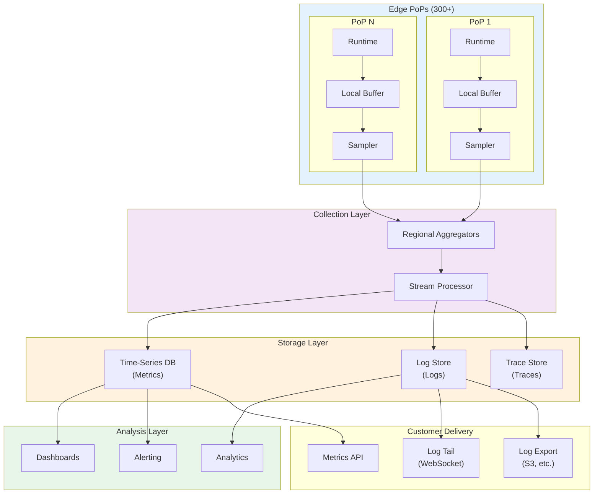
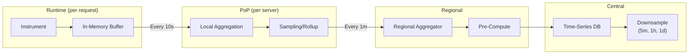
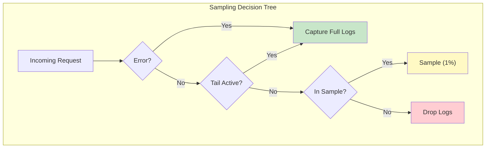
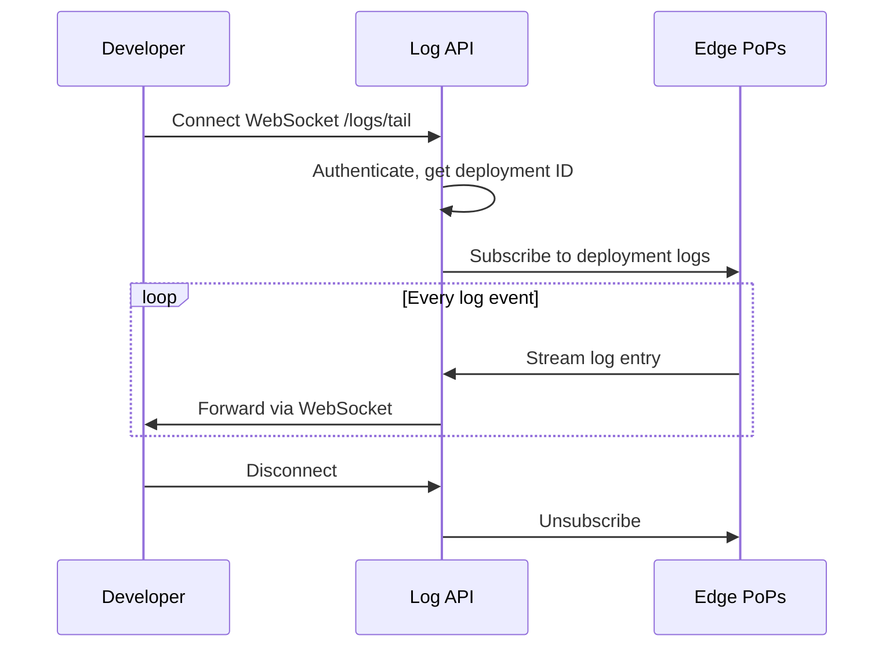
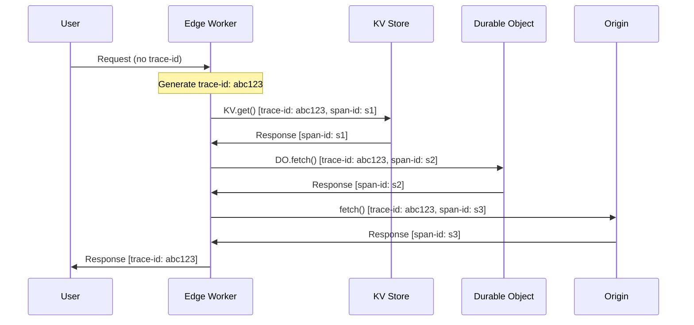
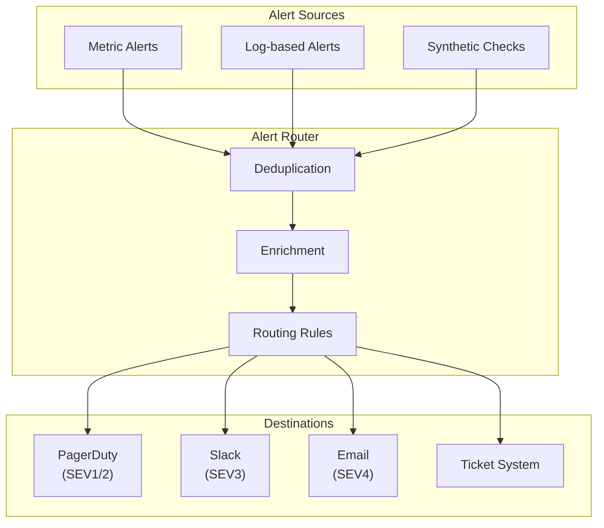

# Observability

[Back to Index](./00-index.md) | [Previous: Security](./06-security-and-compliance.md) | [Next: Interview Guide](./08-interview-guide.md)

---

## Observability Architecture

Edge computing presents unique observability challenges: data is generated at 300+ globally distributed PoPs, latency constraints prevent synchronous collection, and the volume of telemetry can be enormous. The architecture must balance completeness with cost and performance.



---

## Metrics

### Key Metrics (RED Method)

| Category | Metric | Type | Labels | Description |
|----------|--------|------|--------|-------------|
| **Rate** | `requests_total` | Counter | deployment, pop, status | Total requests |
| **Errors** | `errors_total` | Counter | deployment, pop, error_type | Error count |
| **Duration** | `request_duration_ms` | Histogram | deployment, pop | Request latency |

### Platform Metrics

| Metric | Type | Labels | Description |
|--------|------|--------|-------------|
| `cold_starts_total` | Counter | deployment, pop | Cold start count |
| `cold_start_duration_ms` | Histogram | deployment, pop | Cold start latency |
| `isolate_memory_bytes` | Gauge | deployment, pop | Memory usage |
| `isolate_cpu_time_ms` | Histogram | deployment, pop | CPU time per request |
| `warm_pool_size` | Gauge | deployment, pop | Warm isolates available |
| `kv_operations_total` | Counter | namespace, operation, pop | KV read/write count |
| `kv_latency_ms` | Histogram | namespace, operation, pop | KV operation latency |
| `do_requests_total` | Counter | namespace, pop | DO request count |
| `do_latency_ms` | Histogram | namespace, pop | DO request latency |

### Metric Collection Pipeline



### Metric Naming Convention

```
Pattern: <namespace>_<subsystem>_<name>_<unit>

Examples:
- workers_http_requests_total
- workers_http_request_duration_milliseconds
- workers_isolate_memory_bytes
- workers_kv_operations_total
- workers_coldstart_duration_milliseconds

Labels (keep cardinality manageable):
- deployment_id (high cardinality, aggregate for global views)
- pop (bounded ~300)
- status_code (bounded ~10)
- error_type (bounded ~20)
```

### Dashboard Design

```
┌─────────────────────────────────────────────────────────────────┐
│  Edge Workers Dashboard - [Deployment: my-api]                  │
├─────────────────────────────────────────────────────────────────┤
│                                                                 │
│  ┌──────────────┐  ┌──────────────┐  ┌──────────────┐          │
│  │ Requests/sec │  │ Error Rate   │  │ P99 Latency  │          │
│  │    12,450    │  │    0.02%     │  │    23ms      │          │
│  └──────────────┘  └──────────────┘  └──────────────┘          │
│                                                                 │
│  Request Rate (last 24h)                                        │
│  ████████████████████████████████████████████                  │
│  └─ 00:00 ─────────────────────────────── 23:59 ─┘             │
│                                                                 │
│  Latency Distribution           │  Requests by PoP             │
│  ┌────────────────────────┐     │  ┌────────────────────────┐  │
│  │ p50: 5ms               │     │  │ SJC: 15%               │  │
│  │ p95: 15ms    ████      │     │  │ AMS: 12%               │  │
│  │ p99: 23ms  ████████    │     │  │ NRT: 10%               │  │
│  │           ████████████ │     │  │ Other: 63%             │  │
│  └────────────────────────┘     │  └────────────────────────┘  │
│                                                                 │
│  Cold Start Rate: 0.8%          │  KV Reads: 25K/min           │
│  CPU Time (avg): 2.5ms          │  DO Requests: 500/min        │
│                                                                 │
└─────────────────────────────────────────────────────────────────┘
```

---

## Logging

### Log Schema

```json
{
  "timestamp": "2025-01-15T10:30:45.123Z",
  "level": "info",
  "deployment_id": "deploy_abc123",
  "request_id": "req_xyz789",
  "pop": "SJC",
  "message": "Request handled successfully",
  "context": {
    "method": "GET",
    "path": "/api/users",
    "status": 200,
    "duration_ms": 12,
    "cf": {
      "country": "US",
      "city": "San Jose",
      "asn": 13335
    }
  },
  "user_logs": [
    {"level": "log", "message": ["User lookup:", "user_123"]},
    {"level": "info", "message": ["Cache hit"]}
  ]
}
```

### Log Levels

| Level | Usage | Default Behavior |
|-------|-------|-----------------|
| `error` | Unhandled exceptions, critical failures | Always captured |
| `warn` | Recoverable issues, deprecations | Always captured |
| `info` | Request lifecycle, significant events | Captured (configurable) |
| `log` | User console.log() calls | Captured (configurable) |
| `debug` | Detailed debugging | Sampled or off |

### Log Sampling Strategy



**Sampling Configuration**:

```yaml
logging:
  default_sample_rate: 0.01      # 1% of requests
  error_sample_rate: 1.0         # 100% of errors
  tail_override: true            # Capture all when tail active

  retention:
    hot: 7d                      # Queryable
    warm: 30d                    # Archived
    cold: 90d                    # Compressed archive

  filters:
    exclude_paths:
      - "/health"
      - "/favicon.ico"
    exclude_user_agents:
      - "UptimeRobot/*"
```

### Log Tail (Real-Time Streaming)



**Tail Implementation**:
- WebSocket connection to central API
- API subscribes to all PoPs for that deployment
- Logs streamed with < 2s latency
- Automatic sampling bypass when tail active
- Rate limited to prevent abuse (1000 logs/sec)

---

## Distributed Tracing

### Trace Propagation



### Trace Schema

```json
{
  "trace_id": "abc123def456",
  "spans": [
    {
      "span_id": "span_001",
      "parent_id": null,
      "operation": "http.request",
      "service": "edge-worker",
      "start_time": "2025-01-15T10:30:45.100Z",
      "duration_ms": 45,
      "status": "ok",
      "tags": {
        "deployment_id": "deploy_abc",
        "pop": "SJC",
        "http.method": "GET",
        "http.status_code": 200
      }
    },
    {
      "span_id": "span_002",
      "parent_id": "span_001",
      "operation": "kv.get",
      "service": "workers-kv",
      "start_time": "2025-01-15T10:30:45.105Z",
      "duration_ms": 3,
      "status": "ok",
      "tags": {
        "kv.namespace": "CACHE",
        "kv.key": "user:123"
      }
    },
    {
      "span_id": "span_003",
      "parent_id": "span_001",
      "operation": "fetch",
      "service": "origin",
      "start_time": "2025-01-15T10:30:45.115Z",
      "duration_ms": 25,
      "status": "ok",
      "tags": {
        "http.url": "https://api.example.com/data"
      }
    }
  ]
}
```

### Key Spans to Instrument

| Span Type | Description | Key Tags |
|-----------|-------------|----------|
| `http.request` | Incoming request to worker | method, path, status |
| `isolate.init` | Cold start initialization | cold_start, duration |
| `kv.get` / `kv.put` | KV operations | namespace, key (hashed) |
| `do.request` | Durable Object request | namespace, object_id |
| `fetch` | Outbound HTTP request | url (sanitized), status |
| `cache.match` / `cache.put` | Cache operations | cache_status |

### Trace Sampling

```yaml
tracing:
  # Head-based sampling (decision at trace start)
  sample_rate: 0.01              # 1% of traces

  # Tail-based sampling (decision after trace complete)
  error_sampling: true           # Always capture error traces
  slow_sampling:
    threshold_ms: 100            # Capture traces > 100ms
    rate: 0.1                    # 10% of slow traces

  # Force sampling
  force_sample_header: "X-Trace-Sample: true"
```

---

## Alerting

### Alert Categories

| Category | Examples | Severity | Response |
|----------|----------|----------|----------|
| **Availability** | PoP down, deployment unreachable | SEV1 | Page on-call |
| **Latency** | P99 > threshold | SEV2 | Page on-call |
| **Error Rate** | Error rate > 1% | SEV2 | Page on-call |
| **Capacity** | CPU > 90%, memory > 85% | SEV3 | Ticket |
| **Security** | Unusual traffic patterns | SEV2 | Security team |

### Alert Rules

```yaml
alerts:
  # Availability
  - name: deployment_down
    condition: sum(rate(requests_total[5m])) == 0
    for: 5m
    severity: critical
    runbook: "runbooks/deployment-down.md"

  # Latency
  - name: high_latency_p99
    condition: histogram_quantile(0.99, request_duration_ms) > 100
    for: 5m
    severity: warning
    runbook: "runbooks/high-latency.md"

  # Error Rate
  - name: high_error_rate
    condition: sum(rate(errors_total[5m])) / sum(rate(requests_total[5m])) > 0.01
    for: 5m
    severity: warning
    runbook: "runbooks/high-errors.md"

  # Cold Starts
  - name: cold_start_spike
    condition: sum(rate(cold_starts_total[5m])) / sum(rate(requests_total[5m])) > 0.1
    for: 10m
    severity: warning
    runbook: "runbooks/cold-starts.md"

  # Capacity
  - name: pop_cpu_high
    condition: avg(cpu_utilization) by (pop) > 0.9
    for: 10m
    severity: warning
    runbook: "runbooks/scale-pop.md"
```

### Alert Routing



---

## Customer-Facing Observability

### Analytics Dashboard

```
Customer Analytics View:

┌─────────────────────────────────────────────────────────────────┐
│  Worker Analytics - my-api.workers.dev                          │
├─────────────────────────────────────────────────────────────────┤
│                                                                 │
│  Today's Summary:                                               │
│  ┌────────────┐ ┌────────────┐ ┌────────────┐ ┌────────────┐   │
│  │  Requests  │ │   Errors   │ │  Avg Time  │ │  Bandwidth │   │
│  │  1.2M      │ │   234      │ │   12ms     │ │   450 GB   │   │
│  │  ↑ 15%     │ │   ↓ 5%     │ │   ↓ 8%     │ │   ↑ 20%    │   │
│  └────────────┘ └────────────┘ └────────────┘ └────────────┘   │
│                                                                 │
│  Traffic by Country:           Status Codes:                    │
│  US     ████████████  45%      200 ████████████████ 95%         │
│  DE     ████████      22%      304 ████             3%          │
│  JP     ██████        15%      4xx ██               1.5%        │
│  Other  █████         18%      5xx ▌                0.5%        │
│                                                                 │
│  Subrequests:                  KV Operations:                   │
│  Cache hits:    85%            Reads:  450K                     │
│  Origin calls:  15%            Writes: 12K                      │
│                                                                 │
└─────────────────────────────────────────────────────────────────┘
```

### GraphQL Analytics API

```graphql
query WorkerAnalytics($deployment: ID!, $since: DateTime!) {
  deployment(id: $deployment) {
    analytics(since: $since) {
      requests {
        total
        cached
        uncached
        byCountry {
          country
          count
        }
        byStatus {
          status
          count
        }
      }
      performance {
        cpuTimeP50
        cpuTimeP99
        durationP50
        durationP99
      }
      bandwidth {
        requestBytes
        responseBytes
      }
      errors {
        total
        byType {
          type
          count
        }
      }
    }
  }
}
```

### Log Export

| Destination | Format | Latency |
|-------------|--------|---------|
| Object Storage (S3, R2, GCS) | JSON Lines | < 5 min |
| Datadog | Datadog format | Real-time |
| Splunk | HEC format | Real-time |
| Sumo Logic | Sumo format | Real-time |
| Custom Webhook | JSON | Real-time |

---

## Interview Tips: Observability Phase

### Key Points to Cover

1. **Three pillars** - Metrics, logs, traces and how they connect
2. **Sampling strategy** - Why and how (cost, volume)
3. **Edge challenges** - 300+ PoPs, latency constraints
4. **Alert design** - Categories, routing, runbooks
5. **Customer visibility** - Analytics, log tail, export

### Common Questions

- "How do you handle the volume of observability data?"
  > Sampling at the edge (1% default), local aggregation, regional roll-up. Full capture for errors and when tail is active.

- "How do you correlate logs across PoPs?"
  > Trace IDs propagated through all operations. Request ID in every log entry. Centralized log store with trace_id index.

- "How do you alert without alert fatigue?"
  > Severity-based routing, deduplication, alert grouping by deployment. Runbooks for every alert. Regular alert review.

### Numbers to Remember

| Metric | Value |
|--------|-------|
| Default log sample rate | 1% |
| Error capture rate | 100% |
| Log tail latency | < 2s |
| Metric aggregation interval | 1 minute |
| Trace sample rate | 1% (+ slow/error) |
| Log retention (hot) | 7 days |

---

**Next: [08 - Interview Guide](./08-interview-guide.md)**
