# Interview Guide

[Back to Index](./00-index.md) | [Previous: Observability](./07-observability.md)

---

## Interview Pacing (45-Minute Format)

```mermaid
gantt
    title System Design Interview Timeline
    dateFormat mm
    axisFormat %M min

    section Clarify
    Requirements & Scope       :a1, 00, 5m

    section High-Level
    Core Architecture         :a2, 05, 10m

    section Deep Dive
    Critical Components       :a3, 15, 15m

    section Scale
    Trade-offs & Bottlenecks  :a4, 30, 10m

    section Wrap
    Summary & Questions       :a5, 40, 5m
```



| Phase | Time | Focus | Deliverables |
|-------|------|-------|--------------|
| **Clarify** | 0-5 min | Requirements, scale, constraints | Scoped problem statement |
| **High-Level** | 5-15 min | Architecture, components, data flow | System diagram |
| **Deep Dive** | 15-30 min | 1-2 critical components | Detailed design, algorithms |
| **Scale & Trade-offs** | 30-40 min | Bottlenecks, failures, alternatives | Trade-off analysis |
| **Wrap Up** | 40-45 min | Summary, future improvements | Clear conclusion |

---

## Phase 1: Clarifying Questions (0-5 min)

### Essential Questions to Ask

| Question | Why It Matters | Expected Answer Range |
|----------|---------------|----------------------|
| "What's the expected global scale?" | Determines PoP count, capacity | 1K-1M QPS, 10-500 PoPs |
| "What's the target cold start latency?" | Drives isolation technology choice | 5ms-500ms |
| "Do we need strong consistency for state?" | Determines KV vs Durable Objects | Mostly eventual, some strong |
| "JavaScript only, or multiple languages?" | V8 isolates vs WASM vs containers | Usually JS/TS primary |
| "What's the typical workload?" | Request/response vs long-running | HTTP handlers, short-lived |

### Sample Clarification Dialogue

> **You**: "Before I start designing, I'd like to understand the scale and requirements better. What's the expected request volume globally?"
>
> **Interviewer**: "We're looking at supporting millions of deployed functions with billions of requests per day."
>
> **You**: "Got it. And what's the latency target for code execution—are we optimizing for sub-10ms or is 100ms acceptable?"
>
> **Interviewer**: "Sub-50ms p99 is the target. Cold starts need to be minimal."
>
> **You**: "That helps narrow down the isolation technology. One more question—do users need strongly consistent state at the edge, or is eventually consistent acceptable?"
>
> **Interviewer**: "Most workloads are read-heavy and eventual is fine, but we need strong consistency for some use cases like rate limiting and counters."
>
> **You**: "Perfect. So I'll design for V8 isolates with sub-5ms cold starts, an eventually consistent KV store for most data, and a strongly consistent option like Durable Objects for coordination. Let me sketch the high-level architecture."

---

## Phase 2: High-Level Design (5-15 min)

### What to Cover

1. **Global architecture** with Control Plane and Data Plane
2. **Request flow** from user to edge to response
3. **Key components**: DNS, PoPs, runtime, state stores
4. **Data flow** for deployment distribution

### Architecture Sketch

```
Draw this on the whiteboard:

                    ┌─────────────────────┐
                    │   Control Plane     │
                    │  (API, Deploy, DNS) │
                    └──────────┬──────────┘
                               │
            ┌──────────────────┼──────────────────┐
            │                  │                  │
            ▼                  ▼                  ▼
    ┌───────────────┐  ┌───────────────┐  ┌───────────────┐
    │  PoP (US)     │  │  PoP (EU)     │  │  PoP (APAC)   │
    │               │  │               │  │               │
    │ ┌───────────┐ │  │ ┌───────────┐ │  │ ┌───────────┐ │
    │ │ V8 Runtime│ │  │ │ V8 Runtime│ │  │ │ V8 Runtime│ │
    │ ├───────────┤ │  │ ├───────────┤ │  │ ├───────────┤ │
    │ │ KV Cache  │ │  │ │ KV Cache  │ │  │ │ KV Cache  │ │
    │ └───────────┘ │  │ └───────────┘ │  │ └───────────┘ │
    └───────────────┘  └───────────────┘  └───────────────┘
            ▲                  ▲                  ▲
            │                  │                  │
            └──────────────────┼──────────────────┘
                               │
                    ┌──────────┴──────────┐
                    │   Anycast DNS       │
                    │   (Single IP)       │
                    └──────────┬──────────┘
                               │
                           User Request
```

### Key Points to Mention

- "Anycast DNS routes users to the nearest PoP automatically via BGP"
- "Control plane is separate from data plane—existing deployments work even if control plane is down"
- "V8 isolates give us sub-5ms cold starts with strong isolation"
- "KV is eventually consistent with ~60s propagation; Durable Objects provide strong consistency"

---

## Phase 3: Deep Dive Options (15-30 min)

Choose 1-2 based on interviewer interest:

### Option A: V8 Isolate Runtime

**Talking Points**:
- Isolates share a process but have completely separate heaps
- Memory Protection Keys add hardware-level isolation
- Cold start: create isolate (1ms) → load code (2ms) → initialize (2ms)
- Warm pools maintain pre-created isolates for popular deployments
- Resource limits: 128MB memory, 50ms CPU time

**Deep Dive Diagram**:
```
V8 Process
├── Shared V8 Engine (read-only)
├── Event Loop
├── Isolate A (Tenant 1)
│   ├── Heap: 2MB
│   ├── Compiled Code
│   └── MPK Key: 7
├── Isolate B (Tenant 2)
│   ├── Heap: 2MB
│   ├── Compiled Code
│   └── MPK Key: 3
└── Warm Pool
    └── Pre-created isolates
```

### Option B: Durable Objects

**Talking Points**:
- Provides strong consistency by having single instance per object ID
- Object ID hashed to determine owner region
- Requests route to owner, serialized execution (single-threaded)
- SQLite-backed storage (up to 10GB per object)
- Hibernation for idle objects, migration for failures

**Deep Dive Diagram**:
```
Durable Object Routing:

Request (any PoP) → hash(object_id) → Owner Region → DO Instance
                                                    ├── Request Queue
                                                    ├── Single-threaded Execution
                                                    └── SQLite Storage
```

### Option C: Global Request Routing

**Talking Points**:
- Anycast: single IP advertised from all PoPs via BGP
- Internet routing automatically selects nearest healthy PoP
- Route cache (95% hit rate) → Trie matching → Config lookup
- BGP withdrawal for unhealthy PoPs (30-60s failover)

**Deep Dive Diagram**:
```
Request Flow:

1. DNS Query → Anycast IP (1.2.3.4)
2. BGP routes to nearest PoP
3. TLS termination at PoP
4. Route matching: cache → trie → config
5. Get/create isolate from warm pool
6. Execute code, return response
```

---

## Phase 4: Scale & Trade-offs (30-40 min)

### Trade-off Discussions

| Decision | Option A | Option B | Recommendation |
|----------|----------|----------|----------------|
| **Isolation** | V8 Isolates: 5ms cold start, 2MB memory | Firecracker: 125ms cold start, stronger isolation | V8 for most, Firecracker for full OS needs |
| **State** | KV: eventual, local reads | Durable Objects: strong, routed | KV default, DO for coordination |
| **Routing** | Anycast: automatic, simple | GeoDNS: more control | Anycast for simplicity |
| **Cold start** | On-demand: lower cost | Warm pools: faster | Warm pools for hot deployments |

### Bottleneck Analysis

> **Interviewer**: "What are the main bottlenecks in this system?"
>
> **You**: "There are three main bottlenecks:
>
> 1. **Cold start latency**: When no warm isolate is available, we add 5ms. Mitigation: warm pools sized by traffic patterns, code pre-compilation.
>
> 2. **KV replication lag**: Writes take up to 60s to propagate globally. Mitigation: local caching, accept eventual consistency, use Durable Objects when strong consistency needed.
>
> 3. **Durable Object routing**: Requests may need to cross regions (50-100ms added). Mitigation: geo-affinity hints, caching at edge where possible."

### Failure Scenario Handling

> **Interviewer**: "What happens when a PoP goes down?"
>
> **You**: "With anycast, PoP failures are handled automatically:
>
> 1. Health checker detects failure within 5-10 seconds
> 2. BGP route for that PoP is withdrawn
> 3. BGP convergence takes 30-60 seconds
> 4. Traffic automatically shifts to the next nearest PoP
>
> For Durable Objects, if the owner region fails, we migrate the object to a backup region using the last replicated snapshot plus WAL replay. RTO is about 30 seconds."

---

## Phase 5: Wrap Up (40-45 min)

### Summary Statement

> "To summarize, I've designed an edge computing platform with:
>
> - **Global architecture**: 300+ PoPs with anycast routing for automatic geo-distribution
> - **Isolation**: V8 isolates with 5ms cold starts, MPK for hardware-level security
> - **State**: Eventually consistent KV for most data, Durable Objects for strong consistency
> - **Reliability**: Automatic PoP failover via BGP, 99.99% availability target
> - **Scalability**: Horizontal scaling via PoPs and servers, warm pools for cold start mitigation
>
> The key trade-offs are V8's lighter isolation vs Firecracker's stronger isolation, and KV's local speed vs Durable Objects' consistency guarantees."

### Future Improvements to Mention

- WASM support for compiled languages
- Edge AI/ML inference capabilities
- Multi-region Durable Objects for lower latency
- Fine-grained billing and cost optimization

---

## Common Trap Questions

| Trap Question | What They're Testing | Best Answer |
|---------------|---------------------|-------------|
| "Why not just use containers?" | Understanding of cold start impact | "Containers have 500ms+ cold starts, making them unsuitable for edge where we need sub-50ms response times. V8 isolates achieve 5ms cold starts." |
| "Can't you just cache everything?" | Understanding of consistency | "Caching works for read-heavy, static data, but not for state requiring coordination. Rate limiters, counters, and collaborative features need strong consistency—that's why we have Durable Objects." |
| "How do you handle 100x traffic spike?" | Scaling strategy | "Multiple layers: anycast absorbs DDoS, auto-scaling adds servers per PoP, warm pools handle isolate creation, and circuit breakers protect downstream. We also have priority-based traffic shedding." |
| "What if V8 has a security bug?" | Defense in depth | "Multiple layers: MPK hardware protection, V8 sandbox, process isolation, rapid patching (24h SLA for security fixes). We also reset isolates between tenants to limit Spectre-style attacks." |
| "Is eventual consistency ever a problem?" | Understanding limitations | "Yes, for operations like rate limiting or inventory. A user might see their rate limit hasn't updated or oversell inventory. That's why we offer Durable Objects—it's about choosing the right tool." |

---

## Common Mistakes to Avoid

### Don't Do This

1. **Jump to containers** without explaining why they don't work (cold start)
2. **Ignore cold starts** when discussing latency targets
3. **Assume strong consistency** is free (it requires routing)
4. **Forget about PoP failures** in reliability discussion
5. **Over-engineer day 1** (design for 10x, not 1000x initially)
6. **Skip security** in a multi-tenant system
7. **Ignore observability** challenges at edge scale

### Do This Instead

1. Start with requirements and scale
2. Explain trade-offs for each decision
3. Draw clear diagrams with data flow
4. Discuss failure modes proactively
5. Quantify where possible (latency, capacity)
6. Acknowledge limitations and alternatives

---

## Quick Reference Card

### Numbers to Remember

| Metric | Value |
|--------|-------|
| V8 isolate cold start | < 5ms |
| Firecracker cold start | ~125ms |
| WASM cold start | ~35μs |
| Container cold start | 500ms-2s |
| KV propagation | < 60s |
| DO routing latency | 10-100ms (geo-dependent) |
| Anycast failover | 30-60s (BGP convergence) |
| Memory per isolate | ~2MB |
| Memory per container | 50-200MB |
| Target availability | 99.99% |

### Key Technologies

| Component | Technology |
|-----------|------------|
| Isolation | V8 Isolates, Firecracker, WASM |
| Routing | Anycast DNS, BGP |
| KV Store | Distributed KV (Cassandra-style) |
| Durable Objects | SQLite + consistent hashing |
| Security | MPK, V8 Sandbox, TLS 1.3 |

### Real-World Systems

| Platform | Key Feature |
|----------|-------------|
| Cloudflare Workers | V8 isolates, Durable Objects |
| Fly.io | Firecracker microVMs |
| Deno Deploy | V8 isolates, TypeScript |
| Vercel Edge | V8 runtime, Next.js |
| Fastly Compute | WASM, 35μs cold start |

---

## Sample Interview Transcript

> **Interviewer**: "Design an edge computing platform like Cloudflare Workers."
>
> **You**: "Great, let me start by clarifying some requirements. What's our target scale and latency requirements?"
>
> **Interviewer**: "Global scale, millions of functions, sub-50ms latency."
>
> **You**: "Perfect. I'll design a system with V8 isolates for sub-5ms cold starts, anycast routing for global distribution, and two state options: KV for eventually consistent data and Durable Objects for strong consistency.
>
> Let me draw the architecture... [draws diagram]
>
> The control plane handles deployments and configuration. The data plane is our 300+ PoPs running edge runtimes. When a request comes in, anycast DNS routes to the nearest PoP, we match the route, get an isolate from the warm pool or create one, execute the code, and return the response.
>
> Should I deep dive into the V8 isolation model or the Durable Objects consistency mechanism?"
>
> **Interviewer**: "Let's talk about isolation—how do you prevent one tenant from accessing another's data?"
>
> **You**: "Multiple layers. First, V8 isolates provide complete heap separation—each tenant gets their own isolate with isolated memory. Second, we use Memory Protection Keys, a hardware feature that tags memory regions. Each isolate gets a unique key, and accessing memory with the wrong key triggers a hardware trap. Third, we reset isolates between tenants to prevent Spectre-style timing attacks. The combination gives us strong multi-tenant isolation with minimal performance overhead—about 1%."
>
> **Interviewer**: "What if a PoP goes down?"
>
> **You**: "Anycast handles this automatically. When our health checker detects a PoP failure, we withdraw the BGP route. BGP convergence takes 30-60 seconds, after which all traffic automatically shifts to the next nearest healthy PoP. For Durable Objects, if the owner region fails, we migrate to a backup region using the last snapshot plus WAL replay—RTO is about 30 seconds."

---

## Related Resources

- [00 - Index](./00-index.md) - Overview and quick reference
- [01 - Requirements](./01-requirements-and-estimations.md) - Capacity planning
- [02 - High-Level Design](./02-high-level-design.md) - Architecture diagrams
- [03 - Low-Level Design](./03-low-level-design.md) - APIs and algorithms
- [04 - Deep Dive](./04-deep-dive-and-bottlenecks.md) - Component deep dives
- [05 - Scalability](./05-scalability-and-reliability.md) - Scaling strategies
- [06 - Security](./06-security-and-compliance.md) - Isolation and compliance
- [07 - Observability](./07-observability.md) - Monitoring and alerting

---

**[Back to Index](./00-index.md)**
