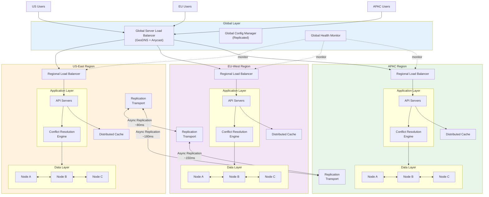
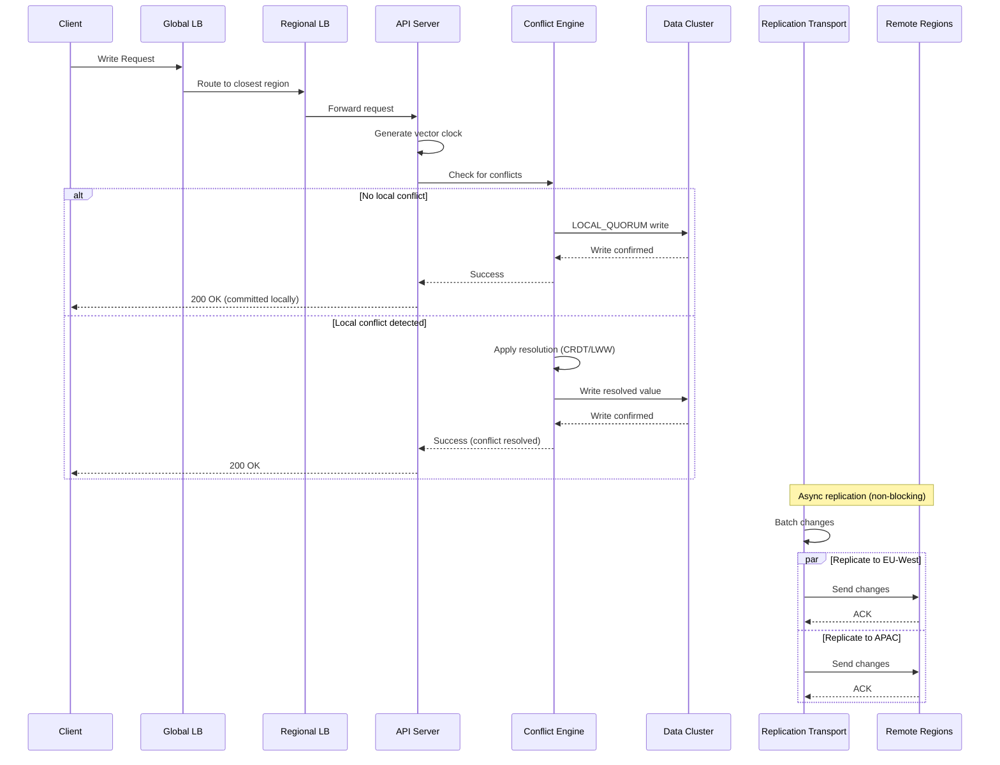
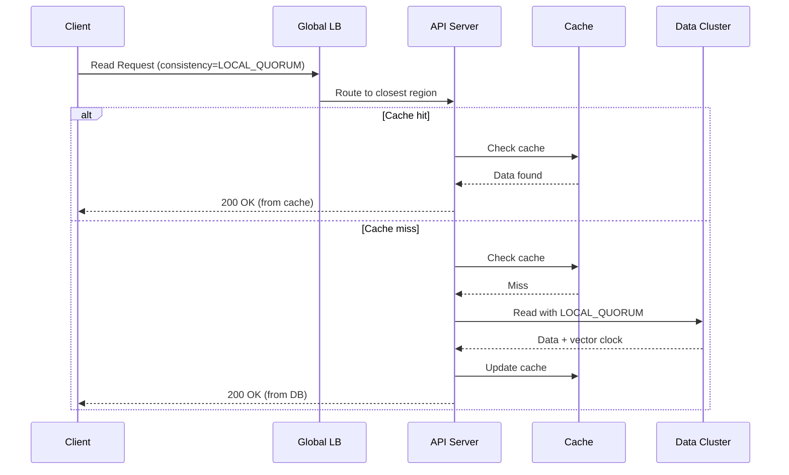
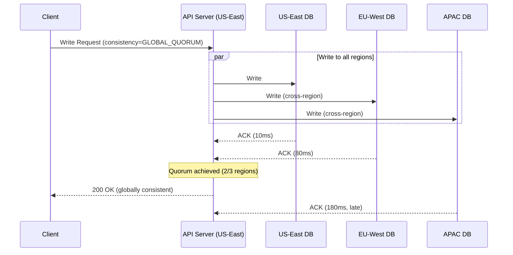
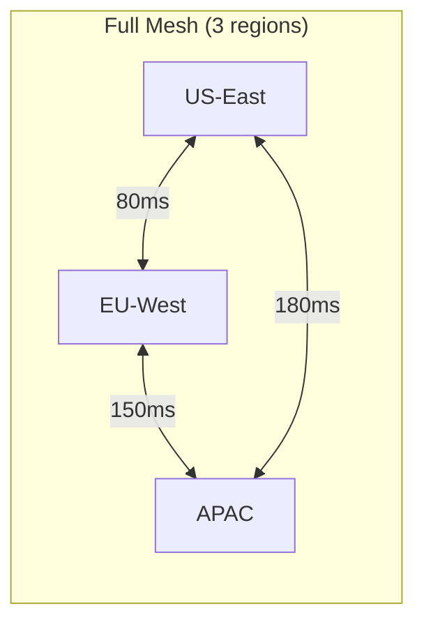
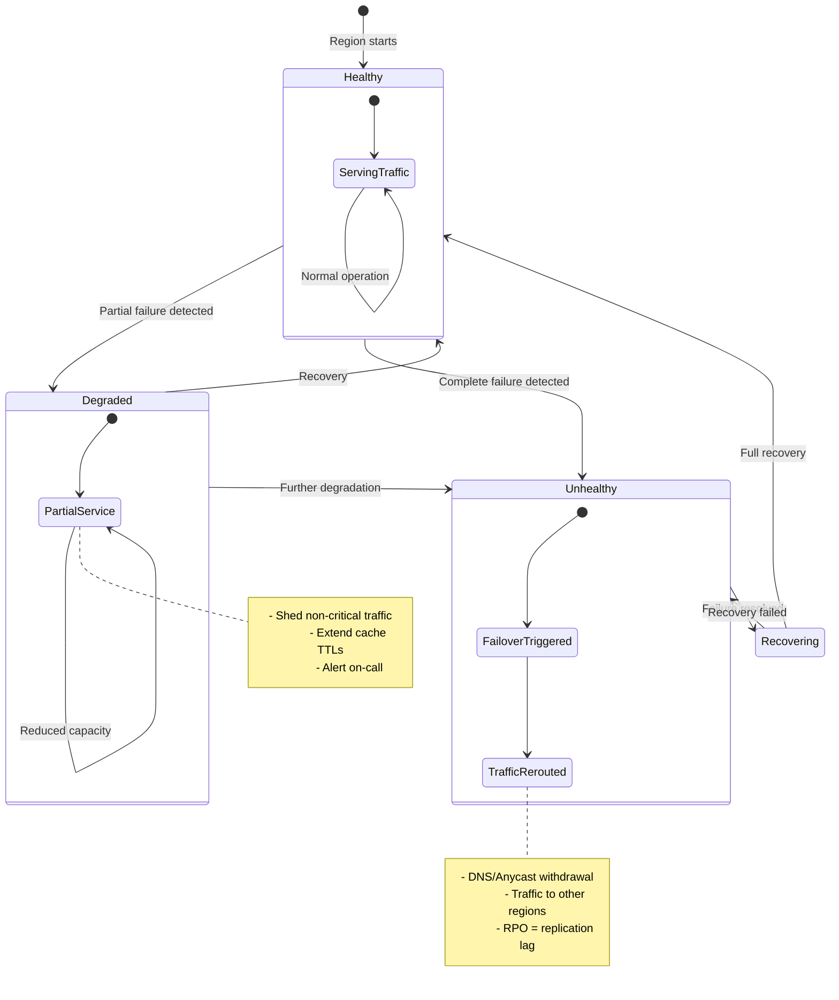
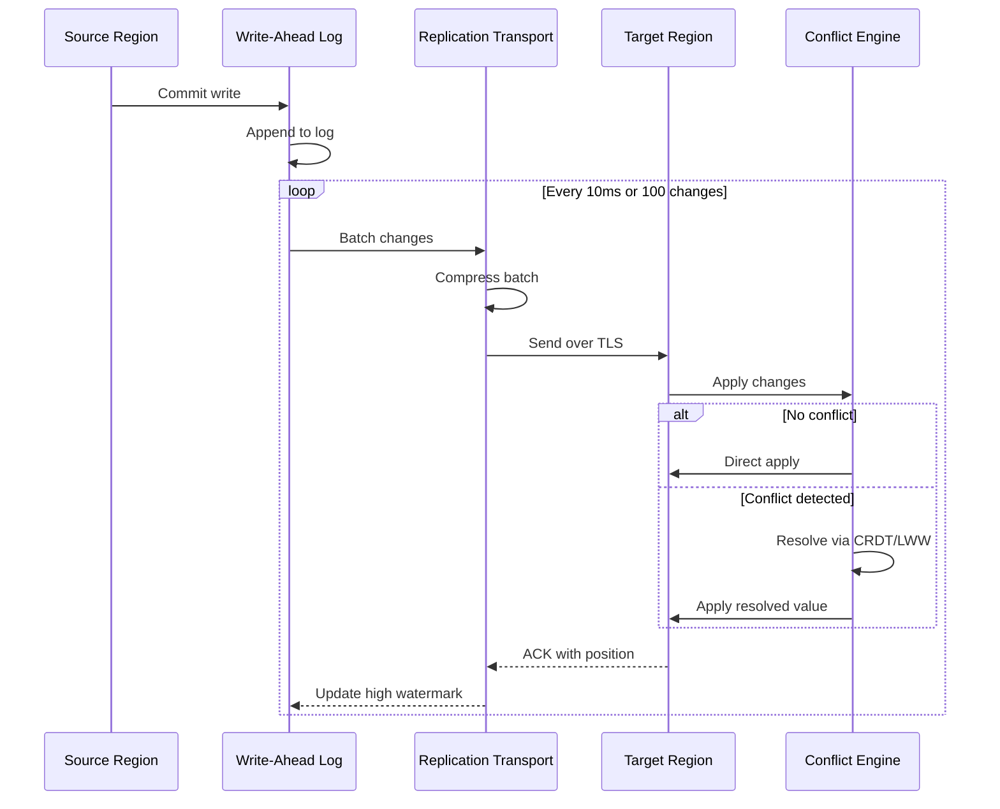
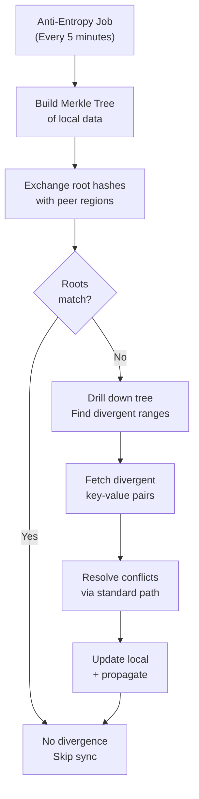

# High-Level Design

[← Back to Index](./00-index.md) | [Previous: Requirements →](./01-requirements-and-estimations.md) | [Next: Low-Level Design →](./03-low-level-design.md)

---

## System Architecture



---

## Component Responsibilities

| Component | Responsibility | Scaling Model |
|-----------|----------------|---------------|
| **Global Load Balancer** | Route users to optimal region based on latency/health | DNS-based, anycast |
| **Global Config Manager** | Distribute configuration across regions | Leader-based replication |
| **Global Health Monitor** | Track region health, trigger failover | Per-region agents |
| **Regional Load Balancer** | Distribute traffic within region | L7, horizontal scaling |
| **API Servers** | Handle business logic, coordinate writes | Stateless, auto-scale |
| **Conflict Resolution Engine** | Detect conflicts, apply resolution strategy | Co-located with data |
| **Data Cluster** | Store data with local quorum writes | Partitioned, replicated |
| **Distributed Cache** | Reduce read latency, cache hot data | Consistent hashing |
| **Replication Transport** | Ship changes to other regions | Async, batched |

---

## Data Flow Diagrams

### Write Flow (Local Commit, Async Replication)



### Read Flow (Local Read with Consistency Levels)



### Global Quorum Write (Strong Consistency)



---

## Key Architectural Decisions

### Decision 1: Write Pattern

| Option | Description | Pros | Cons |
|--------|-------------|------|------|
| **Write-Global** | Single write region, read anywhere | Strong consistency, simple | High latency for remote users, SPOF |
| **Write-Partitioned** | Each record has home region | No conflicts for home data | Routing complexity, cross-region for foreign data |
| **Write-Local** | Any region accepts writes | Lowest latency, highest availability | Requires conflict resolution |

**Recommendation: Write-Local**

Rationale: For a global application prioritizing availability and latency, Write-Local provides the best user experience. The complexity of conflict resolution is acceptable given our CRDT-based approach. For specific data types requiring stronger guarantees (e.g., user balances), we can use Write-Partitioned as an override.

### Decision 2: Consistency Model

| Option | Guarantee | Latency Impact | Implementation |
|--------|-----------|----------------|----------------|
| **Strong (Spanner-style)** | External consistency | High (cross-region sync) | TrueTime or commit-wait |
| **Causal+** | Causal ordering preserved | Medium | Vector clocks, session tokens |
| **Eventual** | All replicas converge eventually | Lowest | Async replication + CRDT |

**Recommendation: Eventual with Causal+ Option**

Rationale: Default to eventual consistency for maximum throughput and availability. Provide causal+ consistency via session tokens for read-your-writes guarantee. Allow per-request upgrade to GLOBAL_QUORUM for critical operations.

### Decision 3: Conflict Resolution Strategy

| Strategy | When to Use | Trade-off |
|----------|-------------|-----------|
| **CRDTs** | Counters, sets, registers | Automatic, but limited data types |
| **Vector Clocks + LWW** | Simple values, timestamps available | May lose concurrent writes |
| **Vector Clocks + Siblings** | Complex objects, app can merge | Requires application logic |
| **Custom Handlers** | Domain-specific rules | Most flexible, most complex |

**Recommendation: Layered Approach**

```
┌─────────────────────────────────────────────────────────────┐
│                  Conflict Resolution Strategy               │
├─────────────────────────────────────────────────────────────┤
│  Layer 1: Data Type Check                                   │
│    └── If CRDT type (counter, set) → Use CRDT merge         │
│                                                             │
│  Layer 2: Vector Clock Comparison                           │
│    └── If one dominates → Accept newer, discard older       │
│    └── If concurrent → Go to Layer 3                        │
│                                                             │
│  Layer 3: Resolution Policy                                 │
│    └── LWW-Register → Compare timestamps (+ region tiebreak)│
│    └── Siblings → Return all versions to application        │
│    └── Custom → Invoke registered handler                   │
└─────────────────────────────────────────────────────────────┘
```

### Decision 4: Replication Topology

| Topology | Regions | Latency | Bandwidth | Complexity |
|----------|---------|---------|-----------|------------|
| **Full Mesh** | 2-5 | Optimal (1 hop) | O(n²) | Medium |
| **Hub-Spoke** | 5-10 | +1 hop via hub | O(n) | Low |
| **Hierarchical** | 10+ | Variable | O(n log n) | High |

**Recommendation: Full Mesh for ≤5 Regions**



For >5 regions, transition to hierarchical with regional super-nodes.

### Decision 5: Clock Synchronization

| Approach | Skew | Cost | Use |
|----------|------|------|-----|
| **TrueTime** | ~7ms | Very High | External consistency |
| **NTP** | 100-250ms | Low | General use |
| **HLC (Hybrid Logical Clock)** | Bounded | Low | Causal ordering |

**Recommendation: Hybrid Logical Clocks**

Rationale: HLC provides causal ordering guarantees without specialized hardware. Physical timestamps are used when available, with logical counters to break ties. This supports our causal+ consistency model while remaining cloud-agnostic.

---

## Technology Stack Summary

| Layer | Technology Pattern | Examples |
|-------|-------------------|----------|
| **Global Load Balancing** | GeoDNS + Anycast | Route 53, Cloudflare, NS1 |
| **Regional Load Balancing** | L7 Load Balancer | HAProxy, Envoy, Cloud LB |
| **API Layer** | Stateless Services | gRPC, REST |
| **Conflict Resolution** | CRDT Library + Custom | Automerge, Riak DT, Custom |
| **Data Store** | Distributed Database | Cassandra, CockroachDB, Custom |
| **Cache** | Distributed Cache | Redis Cluster, Memcached |
| **Replication** | CDC + Log Shipping | Debezium, Custom WAL shipping |
| **Message Transport** | Distributed Queue | Kafka, Pulsar |

---

## Regional Failover Architecture



---

## Cross-Region Communication

### Replication Protocol



### Anti-Entropy Synchronization



---

## Architecture Pattern Checklist

| Pattern | Decision | Rationale |
|---------|----------|-----------|
| **Sync vs Async** | Async (default), Sync (optional) | Latency vs consistency trade-off |
| **Event-driven vs Request-response** | Request-response + Event replication | Immediate user feedback + eventual sync |
| **Push vs Pull** | Push replication, Pull on-demand | Minimize replication lag |
| **Stateless vs Stateful** | Stateless API, Stateful data | Horizontal scaling, data locality |
| **Read-heavy vs Write-heavy** | Read-local optimized | Global cache, local data clusters |
| **Real-time vs Batch** | Real-time (streaming replication) | Sub-second replication lag |
| **Edge vs Origin** | Edge caching, Origin data | Cache reads, consistent writes |

---

[← Back to Index](./00-index.md) | [Previous: Requirements →](./01-requirements-and-estimations.md) | [Next: Low-Level Design →](./03-low-level-design.md)
