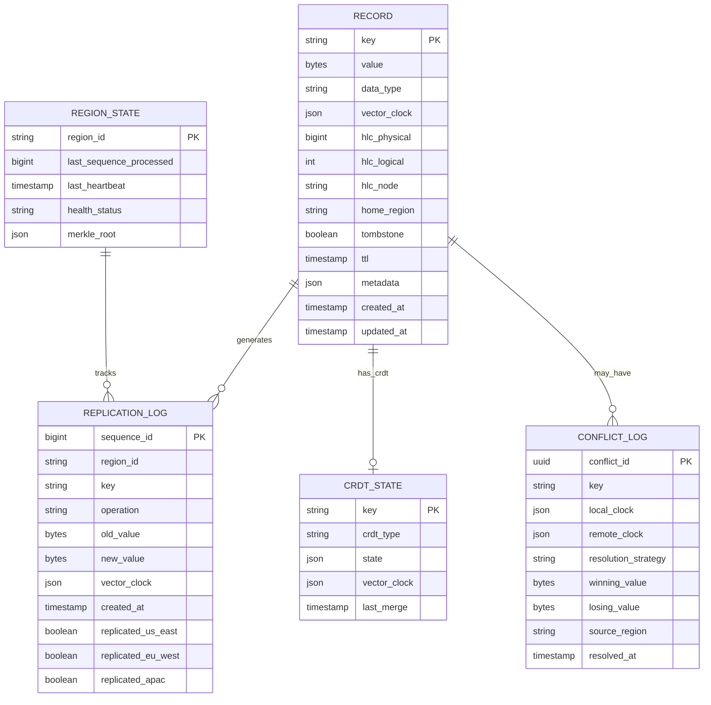
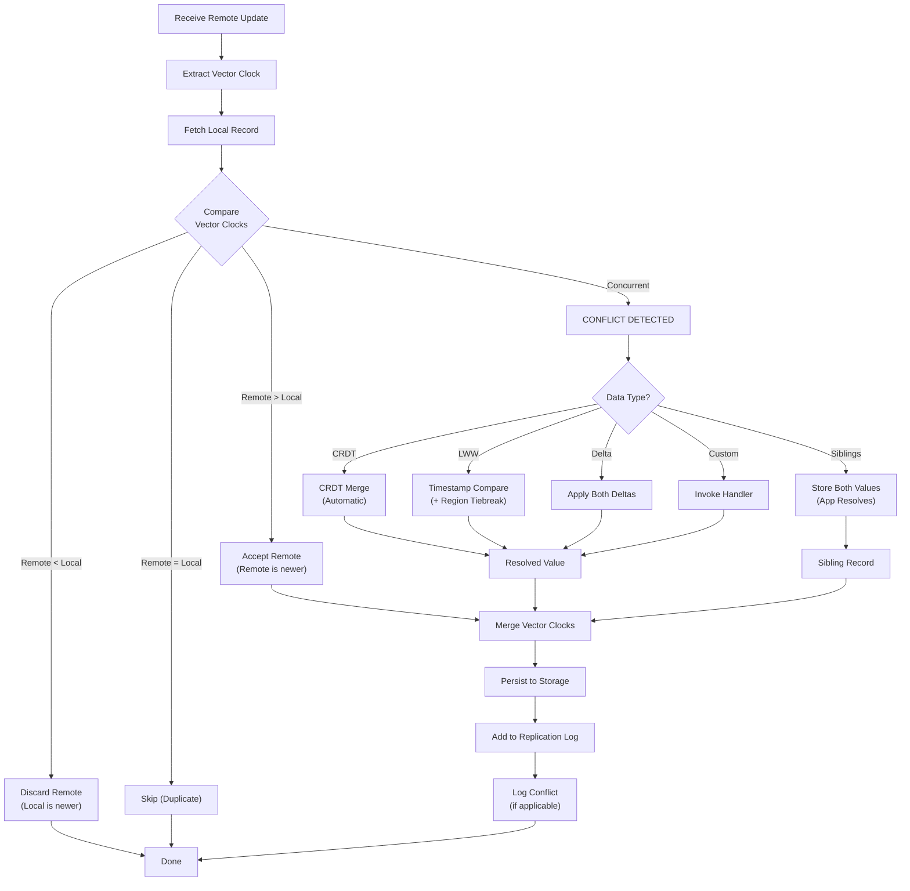
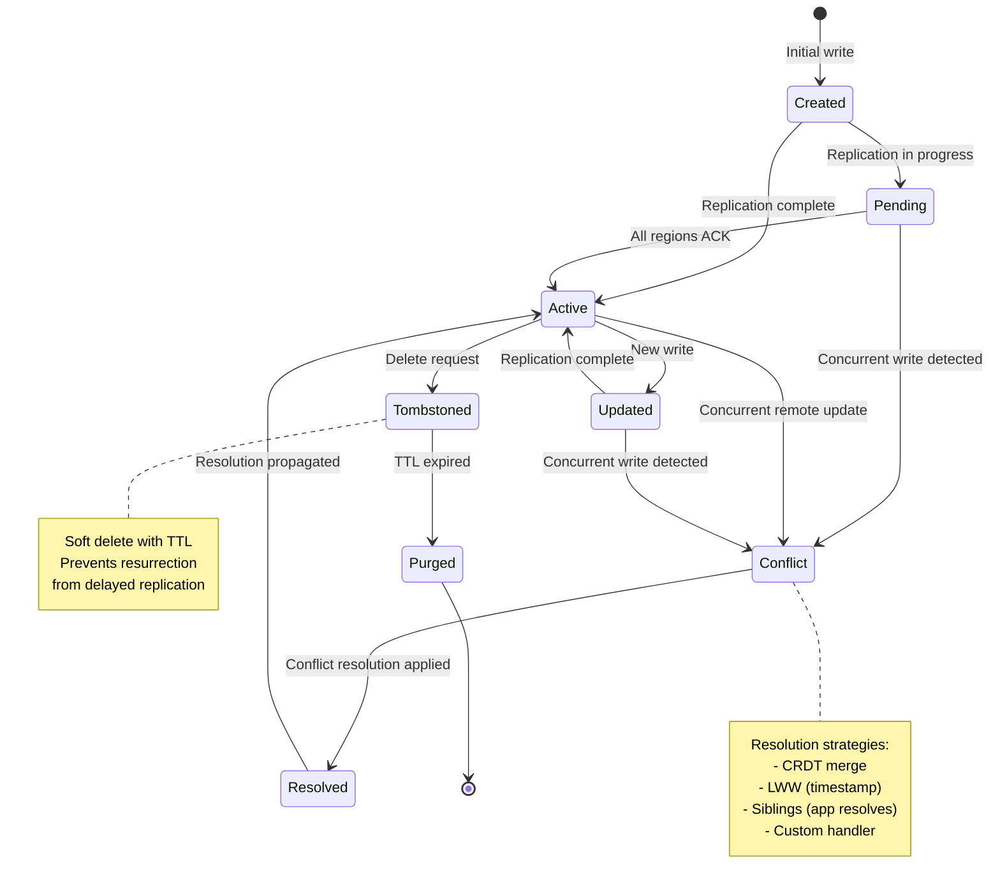

# Low-Level Design

[← Back to Index](./00-index.md) | [Previous: High-Level Design →](./02-high-level-design.md) | [Next: Deep Dive →](./04-deep-dive-and-bottlenecks.md)

---

## Data Model

### Core Record Structure

Every record in the system includes metadata for conflict detection and resolution:

```
┌─────────────────────────────────────────────────────────────┐
│                       Record Structure                       │
├─────────────────────────────────────────────────────────────┤
│  key:           string        # Unique identifier            │
│  value:         bytes         # Application data (opaque)    │
│  data_type:     enum          # CRDT type or custom          │
│  vector_clock:  Map<RegionId, LogicalTime>                   │
│  hlc_timestamp: HybridLogicalClock                           │
│  home_region:   RegionId      # Optional: for partitioned    │
│  tombstone:     boolean       # Soft delete marker           │
│  ttl:           timestamp     # Optional expiration          │
│  metadata:      Map<string, string>  # Custom attributes     │
└─────────────────────────────────────────────────────────────┘
```

### Vector Clock Structure

```
┌─────────────────────────────────────────────────────────────┐
│                      Vector Clock                            │
├─────────────────────────────────────────────────────────────┤
│  entries: Map<RegionId, Counter>                             │
│                                                              │
│  Example:                                                    │
│  {                                                           │
│    "us-east": 42,                                            │
│    "eu-west": 38,                                            │
│    "apac":    15                                             │
│  }                                                           │
│                                                              │
│  Interpretation: This version incorporates:                  │
│    - 42 updates from US-East                                 │
│    - 38 updates from EU-West                                 │
│    - 15 updates from APAC                                    │
└─────────────────────────────────────────────────────────────┘
```

### Hybrid Logical Clock (HLC)

```
┌─────────────────────────────────────────────────────────────┐
│                  Hybrid Logical Clock                        │
├─────────────────────────────────────────────────────────────┤
│  physical_time:  int64   # Wall clock (milliseconds)         │
│  logical_time:   int32   # Logical counter                   │
│  node_id:        string  # Tiebreaker                        │
│                                                              │
│  Comparison: (physical, logical, node_id) lexicographic      │
│                                                              │
│  Example:                                                    │
│  { physical: 1705432800000, logical: 5, node: "us-east-1" }  │
└─────────────────────────────────────────────────────────────┘
```

---

## Entity Relationship Diagram



---

## API Design

### Core Operations

| Operation | Method | Endpoint | Consistency Options |
|-----------|--------|----------|---------------------|
| Read | GET | `/v1/data/{key}` | LOCAL_ONE, LOCAL_QUORUM, GLOBAL_QUORUM |
| Write | PUT | `/v1/data/{key}` | LOCAL_QUORUM, GLOBAL_QUORUM |
| Delete | DELETE | `/v1/data/{key}` | LOCAL_QUORUM, GLOBAL_QUORUM |
| Batch Read | POST | `/v1/data/batch` | LOCAL_QUORUM |
| Batch Write | POST | `/v1/data/batch` | LOCAL_QUORUM |
| CRDT Operation | POST | `/v1/crdt/{key}/{operation}` | LOCAL_QUORUM |

### Request/Response Formats

**Read Request:**
```
GET /v1/data/{key}
Headers:
  X-Consistency-Level: LOCAL_QUORUM | GLOBAL_QUORUM | LOCAL_ONE
  X-Session-Token: {session_id}          # For read-your-writes
  X-Min-Vector-Clock: {base64_clock}     # Optional: causal read
```

**Read Response:**
```
HTTP 200 OK
Headers:
  X-Vector-Clock: {base64_clock}
  X-Served-From: us-east
  X-Replication-Lag-Ms: 45

Body:
{
  "key": "user:12345",
  "value": { ... },
  "vector_clock": {
    "us-east": 42,
    "eu-west": 38,
    "apac": 15
  },
  "last_modified": "2025-01-22T10:30:00Z"
}
```

**Write Request:**
```
PUT /v1/data/{key}
Headers:
  X-Consistency-Level: LOCAL_QUORUM | GLOBAL_QUORUM
  X-If-Vector-Clock: {base64_clock}      # Optimistic locking
  X-Conflict-Resolution: LWW | CRDT | FAIL
  Content-Type: application/json

Body:
{
  "value": { ... },
  "ttl": 86400,
  "metadata": {
    "source": "mobile-app"
  }
}
```

**Write Response:**
```
HTTP 200 OK
Headers:
  X-Vector-Clock: {base64_clock}         # New clock after write
  X-Replicated-To: ["eu-west", "apac"]   # Async, may be empty

Body:
{
  "status": "committed",
  "vector_clock": {
    "us-east": 43,
    "eu-west": 38,
    "apac": 15
  }
}
```

**Conflict Response (when X-Conflict-Resolution: FAIL):**
```
HTTP 409 Conflict
Body:
{
  "error": "conflict_detected",
  "local_value": { ... },
  "local_clock": { "us-east": 42, ... },
  "remote_value": { ... },
  "remote_clock": { "eu-west": 39, ... },
  "resolution_hint": "concurrent_writes"
}
```

### CRDT-Specific Operations

**Counter Increment:**
```
POST /v1/crdt/counter:{key}/increment
Body:
{
  "amount": 5
}

Response:
{
  "value": 127,
  "state": {
    "us-east": 80,
    "eu-west": 32,
    "apac": 15
  }
}
```

**Set Add:**
```
POST /v1/crdt/set:{key}/add
Body:
{
  "element": "item-xyz"
}

Response:
{
  "elements": ["item-abc", "item-xyz", ...],
  "size": 42
}
```

---

## Core Algorithms

### Algorithm 1: Vector Clock Comparison

```
FUNCTION compare_vector_clocks(VC1, VC2) -> Ordering:
    /**
     * Compare two vector clocks to determine causal ordering.
     * Returns: BEFORE, AFTER, CONCURRENT, or EQUAL
     *
     * Time Complexity: O(R) where R = number of regions
     * Space Complexity: O(1)
     */

    vc1_has_greater = false
    vc2_has_greater = false

    // Get union of all region IDs
    all_regions = UNION(VC1.keys(), VC2.keys())

    FOR region IN all_regions:
        v1 = VC1.get(region, default=0)
        v2 = VC2.get(region, default=0)

        IF v1 > v2:
            vc1_has_greater = true
        ELSE IF v2 > v1:
            vc2_has_greater = true

    // Determine ordering based on dominance
    IF vc1_has_greater AND NOT vc2_has_greater:
        RETURN AFTER       // VC1 happened after VC2
    ELSE IF vc2_has_greater AND NOT vc1_has_greater:
        RETURN BEFORE      // VC1 happened before VC2
    ELSE IF NOT vc1_has_greater AND NOT vc2_has_greater:
        RETURN EQUAL       // Identical clocks
    ELSE:
        RETURN CONCURRENT  // Both have unique updates → CONFLICT!


FUNCTION merge_vector_clocks(VC1, VC2) -> VectorClock:
    /**
     * Merge two vector clocks by taking element-wise maximum.
     * Used after conflict resolution to create unified clock.
     */

    result = new VectorClock()
    all_regions = UNION(VC1.keys(), VC2.keys())

    FOR region IN all_regions:
        result[region] = MAX(VC1.get(region, 0), VC2.get(region, 0))

    RETURN result


FUNCTION increment_clock(VC, region_id) -> VectorClock:
    /**
     * Increment the clock for the local region before a write.
     */
    new_vc = COPY(VC)
    new_vc[region_id] = new_vc.get(region_id, 0) + 1
    RETURN new_vc
```

### Algorithm 2: G-Counter CRDT (Grow-Only Counter)

```
STRUCT GCounter:
    /**
     * A counter that can only be incremented.
     * Each region maintains its own count; total = sum of all.
     *
     * Properties:
     * - Commutative: merge(A, B) = merge(B, A)
     * - Associative: merge(merge(A, B), C) = merge(A, merge(B, C))
     * - Idempotent: merge(A, A) = A
     */
    counts: Map<RegionId, int64>


FUNCTION gcounter_create() -> GCounter:
    RETURN GCounter(counts = {})


FUNCTION gcounter_increment(counter, region_id, amount=1) -> GCounter:
    /**
     * Increment the counter for the specified region.
     * Only the local region should increment its own entry.
     */
    counter.counts[region_id] = counter.counts.get(region_id, 0) + amount
    RETURN counter


FUNCTION gcounter_value(counter) -> int64:
    /**
     * Get the total count (sum across all regions).
     */
    RETURN SUM(counter.counts.values())


FUNCTION gcounter_merge(counter1, counter2) -> GCounter:
    /**
     * Merge two G-Counters by taking element-wise maximum.
     * This is the key operation that makes it conflict-free.
     *
     * Example:
     *   counter1 = {us-east: 10, eu-west: 5}
     *   counter2 = {us-east: 8, eu-west: 7, apac: 3}
     *   merged   = {us-east: 10, eu-west: 7, apac: 3}
     *   value    = 10 + 7 + 3 = 20
     */
    result = GCounter(counts = {})
    all_regions = UNION(counter1.counts.keys(), counter2.counts.keys())

    FOR region IN all_regions:
        v1 = counter1.counts.get(region, 0)
        v2 = counter2.counts.get(region, 0)
        result.counts[region] = MAX(v1, v2)

    RETURN result
```

### Algorithm 3: PN-Counter CRDT (Positive-Negative Counter)

```
STRUCT PNCounter:
    /**
     * A counter that supports both increment and decrement.
     * Implemented as two G-Counters: one for increments, one for decrements.
     */
    positive: GCounter  // Increments
    negative: GCounter  // Decrements


FUNCTION pncounter_create() -> PNCounter:
    RETURN PNCounter(
        positive = gcounter_create(),
        negative = gcounter_create()
    )


FUNCTION pncounter_increment(counter, region_id, amount=1) -> PNCounter:
    counter.positive = gcounter_increment(counter.positive, region_id, amount)
    RETURN counter


FUNCTION pncounter_decrement(counter, region_id, amount=1) -> PNCounter:
    counter.negative = gcounter_increment(counter.negative, region_id, amount)
    RETURN counter


FUNCTION pncounter_value(counter) -> int64:
    RETURN gcounter_value(counter.positive) - gcounter_value(counter.negative)


FUNCTION pncounter_merge(counter1, counter2) -> PNCounter:
    RETURN PNCounter(
        positive = gcounter_merge(counter1.positive, counter2.positive),
        negative = gcounter_merge(counter1.negative, counter2.negative)
    )
```

### Algorithm 4: OR-Set CRDT (Observed-Remove Set)

```
STRUCT ORSet:
    /**
     * A set that supports add and remove operations.
     * "Observed-Remove" means: remove only affects adds that were observed.
     * Concurrent add + remove → add wins (for unobserved adds).
     *
     * Each add creates a unique tag; remove clears all known tags.
     */
    elements: Map<Element, Set<UniqueTag>>


STRUCT UniqueTag:
    region_id: string
    counter: int64
    timestamp: int64


FUNCTION orset_create() -> ORSet:
    RETURN ORSet(elements = {})


FUNCTION orset_add(set, element, region_id) -> ORSet:
    /**
     * Add an element with a unique tag.
     * Even if element exists, we add a new tag (supports re-add after remove).
     */
    tag = UniqueTag(
        region_id = region_id,
        counter = generate_unique_counter(),
        timestamp = current_timestamp()
    )

    IF element NOT IN set.elements:
        set.elements[element] = new Set()

    set.elements[element].add(tag)
    RETURN set


FUNCTION orset_remove(set, element) -> ORSet:
    /**
     * Remove an element by clearing all its observed tags.
     * Note: This only removes tags we've seen; concurrent adds survive.
     */
    IF element IN set.elements:
        set.elements[element] = new Set()  // Clear all tags
    RETURN set


FUNCTION orset_contains(set, element) -> boolean:
    IF element IN set.elements:
        RETURN set.elements[element].size() > 0
    RETURN false


FUNCTION orset_value(set) -> Set<Element>:
    result = new Set()
    FOR (element, tags) IN set.elements:
        IF tags.size() > 0:
            result.add(element)
    RETURN result


FUNCTION orset_merge(set1, set2) -> ORSet:
    /**
     * Merge by taking union of tags for each element.
     * This ensures adds from both sides survive.
     *
     * Example of add-wins behavior:
     *   Region A: add("x") with tag A1
     *   Region B: remove("x") (clears what B has seen, which is nothing)
     *   Region B: add("x") with tag B1 (concurrent with A's add)
     *   After merge: "x" has tags {A1, B1} → element present
     */
    result = ORSet(elements = {})
    all_elements = UNION(set1.elements.keys(), set2.elements.keys())

    FOR element IN all_elements:
        tags1 = set1.elements.get(element, new Set())
        tags2 = set2.elements.get(element, new Set())
        result.elements[element] = UNION(tags1, tags2)

    RETURN result
```

### Algorithm 5: LWW-Register CRDT

```
STRUCT LWWRegister:
    /**
     * Last-Writer-Wins Register.
     * Simple conflict resolution: highest timestamp wins.
     * Tiebreaker: region_id (lexicographic).
     */
    value: any
    timestamp: HybridLogicalClock


FUNCTION lww_create(value, hlc) -> LWWRegister:
    RETURN LWWRegister(value = value, timestamp = hlc)


FUNCTION lww_set(register, new_value, hlc) -> LWWRegister:
    /**
     * Set value only if new timestamp is greater.
     */
    IF compare_hlc(hlc, register.timestamp) > 0:
        register.value = new_value
        register.timestamp = hlc
    RETURN register


FUNCTION lww_merge(reg1, reg2) -> LWWRegister:
    /**
     * Merge by keeping the value with higher timestamp.
     */
    comparison = compare_hlc(reg1.timestamp, reg2.timestamp)

    IF comparison > 0:
        RETURN reg1
    ELSE IF comparison < 0:
        RETURN reg2
    ELSE:
        // Equal timestamps: use region_id as tiebreaker
        IF reg1.timestamp.node_id > reg2.timestamp.node_id:
            RETURN reg1
        ELSE:
            RETURN reg2


FUNCTION compare_hlc(hlc1, hlc2) -> int:
    /**
     * Compare Hybrid Logical Clocks.
     * Returns: positive if hlc1 > hlc2, negative if hlc1 < hlc2, 0 if equal.
     */
    IF hlc1.physical_time != hlc2.physical_time:
        RETURN hlc1.physical_time - hlc2.physical_time

    IF hlc1.logical_time != hlc2.logical_time:
        RETURN hlc1.logical_time - hlc2.logical_time

    RETURN COMPARE(hlc1.node_id, hlc2.node_id)  // Lexicographic
```

### Algorithm 6: Conflict Resolution Dispatcher

```
FUNCTION resolve_conflict(local_record, remote_record, config) -> Record:
    /**
     * Main entry point for conflict resolution.
     * Dispatches to appropriate strategy based on data type and configuration.
     */

    // Step 1: Compare vector clocks
    ordering = compare_vector_clocks(
        local_record.vector_clock,
        remote_record.vector_clock
    )

    // If not concurrent, one clearly supersedes the other
    IF ordering == AFTER:
        RETURN local_record   // Local is newer
    ELSE IF ordering == BEFORE:
        RETURN remote_record  // Remote is newer
    ELSE IF ordering == EQUAL:
        RETURN local_record   // Identical, keep local

    // ordering == CONCURRENT: True conflict, need resolution
    RETURN resolve_concurrent_conflict(local_record, remote_record, config)


FUNCTION resolve_concurrent_conflict(local, remote, config) -> Record:
    data_type = local.data_type

    SWITCH data_type:
        CASE "gcounter":
            merged_state = gcounter_merge(local.value, remote.value)
            RETURN create_record(local.key, merged_state, merge_clocks(local, remote))

        CASE "pncounter":
            merged_state = pncounter_merge(local.value, remote.value)
            RETURN create_record(local.key, merged_state, merge_clocks(local, remote))

        CASE "orset":
            merged_state = orset_merge(local.value, remote.value)
            RETURN create_record(local.key, merged_state, merge_clocks(local, remote))

        CASE "lww_register":
            merged_reg = lww_merge(
                LWWRegister(local.value, local.hlc_timestamp),
                LWWRegister(remote.value, remote.hlc_timestamp)
            )
            RETURN create_record(local.key, merged_reg.value, merge_clocks(local, remote))

        CASE "delta_numeric":
            // For financial data: apply both deltas
            merged_value = resolve_delta_conflict(local, remote)
            RETURN create_record(local.key, merged_value, merge_clocks(local, remote))

        CASE "siblings":
            // Store both values for application resolution
            siblings = [local.value, remote.value]
            RETURN create_record(local.key, siblings, merge_clocks(local, remote))

        CASE "custom":
            handler = get_custom_handler(config.handler_name)
            resolved_value = handler.resolve(local.value, remote.value, config)
            RETURN create_record(local.key, resolved_value, merge_clocks(local, remote))

        DEFAULT:
            // Fallback to LWW
            IF compare_hlc(local.hlc_timestamp, remote.hlc_timestamp) >= 0:
                RETURN local
            ELSE:
                RETURN remote


FUNCTION resolve_delta_conflict(local, remote) -> Value:
    /**
     * Delta resolution for numeric values (e.g., account balances).
     * Instead of choosing one value, apply both deltas.
     *
     * Example:
     *   Base value: $100
     *   Local: withdraw $20 → $80
     *   Remote: withdraw $30 → $70
     *   Delta resolution: $100 - $20 - $30 = $50
     */
    local_delta = local.value - local.metadata["base_value"]
    remote_delta = remote.value - remote.metadata["base_value"]

    // Use the more recent base value
    base = MAX(local.metadata["base_value"], remote.metadata["base_value"])

    RETURN base + local_delta + remote_delta
```

---

## Conflict Detection Flowchart



---

## State Machine: Record Lifecycle



---

## Index Strategy

### Primary Indexes

| Index | Type | Purpose |
|-------|------|---------|
| `key` | Primary Key (Hash) | Direct key lookup |
| `(region_id, sequence_id)` | Composite | Replication position tracking |
| `hlc_timestamp` | B-tree | Time-range queries, conflict resolution |

### Secondary Indexes

| Index | Columns | Purpose |
|-------|---------|---------|
| `idx_home_region` | `(home_region, key)` | Partitioned data lookup |
| `idx_tombstone` | `(tombstone, ttl)` | Garbage collection |
| `idx_data_type` | `(data_type, key)` | Type-specific operations |
| `idx_pending_replication` | `(replicated_*, key)` | Replication queue |

### Partitioning Strategy

```
Partition Key Selection:
┌─────────────────────────────────────────────────────────────┐
│  Option 1: Hash(key) - Uniform distribution                 │
│  • Best for: Random access patterns                         │
│  • Drawback: Range queries require scatter-gather           │
│                                                             │
│  Option 2: Home Region + Hash(key) - Locality-aware         │
│  • Best for: Partitioned write pattern                      │
│  • Drawback: Uneven if regions have different load          │
│                                                             │
│  Option 3: Consistent Hash Ring - Balanced, elastic         │
│  • Best for: Dynamic cluster sizing                         │
│  • Drawback: More complex rebalancing                       │
│                                                             │
│  Recommendation: Consistent Hash Ring (1.9 design)          │
│  with zone-aware replica placement                          │
└─────────────────────────────────────────────────────────────┘
```

---

## Replication Log Schema

```
┌─────────────────────────────────────────────────────────────┐
│                    Replication Log Entry                     │
├─────────────────────────────────────────────────────────────┤
│  sequence_id:     bigint       # Monotonic per region        │
│  region_id:       string       # Source region               │
│  operation:       enum         # INSERT, UPDATE, DELETE      │
│  key:             string       # Affected key                │
│  old_value:       bytes        # Previous value (for delta)  │
│  new_value:       bytes        # New value                   │
│  old_clock:       json         # Previous vector clock       │
│  new_clock:       json         # New vector clock            │
│  hlc_timestamp:   bigint       # HLC for ordering            │
│  checksum:        bytes        # Integrity verification      │
│  created_at:      timestamp    # Wall clock time             │
├─────────────────────────────────────────────────────────────┤
│  Replication State (per target region):                      │
│  replicated_us_east:  boolean + timestamp                    │
│  replicated_eu_west:  boolean + timestamp                    │
│  replicated_apac:     boolean + timestamp                    │
└─────────────────────────────────────────────────────────────┘
```

---

## Schema Evolution Strategy

### Rules for Safe Evolution

| Change Type | Safety | Approach |
|-------------|--------|----------|
| Add optional field | Safe | Add with default value |
| Add required field | Unsafe | Make optional first, then required after migration |
| Remove field | Safe (careful) | Stop writing, deprecate, then remove |
| Rename field | Unsafe | Add new field, migrate, remove old |
| Change field type | Unsafe | Dual-write during transition |

### Version Compatibility

```
┌─────────────────────────────────────────────────────────────┐
│                   Schema Version Handling                    │
├─────────────────────────────────────────────────────────────┤
│  Every record includes: schema_version: int                  │
│                                                              │
│  On Read:                                                    │
│    1. Check schema_version                                   │
│    2. If older, apply migration transform                    │
│    3. Return in current schema format                        │
│                                                              │
│  On Write:                                                   │
│    1. Write with current schema_version                      │
│    2. Old-format readers must handle unknown fields          │
│                                                              │
│  Replication:                                                │
│    - Replicate raw bytes (schema-agnostic)                   │
│    - Each region interprets with its own version             │
│    - Requires forward + backward compatibility               │
└─────────────────────────────────────────────────────────────┘
```

---

[← Back to Index](./00-index.md) | [Previous: High-Level Design →](./02-high-level-design.md) | [Next: Deep Dive →](./04-deep-dive-and-bottlenecks.md)
