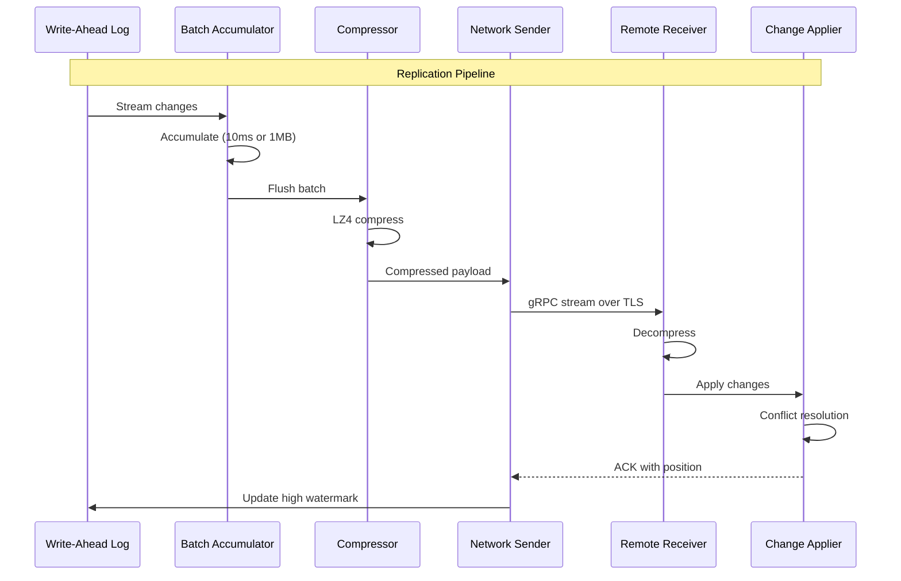

# Deep Dive & Bottlenecks

[← Back to Index](./00-index.md) | [Previous: Low-Level Design →](./03-low-level-design.md) | [Next: Scalability →](./05-scalability-and-reliability.md)

---

## Critical Component Deep Dives

### Component 1: CRDT Engine

#### Why This Is Critical

The CRDT Engine is the mathematical foundation that makes true active-active possible without coordination. It determines:

- **Correctness**: Whether concurrent writes produce deterministic, expected results
- **Data integrity**: Ensuring no valid writes are silently lost
- **Convergence**: All replicas reaching the same state eventually
- **Performance**: Overhead of merge operations and state tracking

A bug in the CRDT engine can cause silent data corruption that's extremely difficult to detect and debug across multiple regions.

#### How It Works Internally


#### State-Based vs Operation-Based CRDTs

```
┌─────────────────────────────────────────────────────────────┐
│              State-Based CRDTs (CvRDTs)                      │
├─────────────────────────────────────────────────────────────┤
│  Mechanism:                                                  │
│  • Replicate full state periodically                         │
│  • Merge function combines states                            │
│  • Idempotent: re-sending same state is safe                 │
│                                                              │
│  Pros:                                                       │
│  • Simple communication (send state, merge)                  │
│  • Works with unreliable delivery                            │
│  • No causal ordering required                               │
│                                                              │
│  Cons:                                                       │
│  • State can grow large (OR-Set tags accumulate)             │
│  • Bandwidth intensive for large states                      │
│                                                              │
│  Best for: Small state, unreliable networks                  │
└─────────────────────────────────────────────────────────────┘

┌─────────────────────────────────────────────────────────────┐
│            Operation-Based CRDTs (CmRDTs)                    │
├─────────────────────────────────────────────────────────────┤
│  Mechanism:                                                  │
│  • Replicate operations (add, remove, increment)             │
│  • Apply operations at each replica                          │
│  • Require exactly-once, causal-order delivery               │
│                                                              │
│  Pros:                                                       │
│  • Smaller messages (just the operation)                     │
│  • More efficient for frequent small updates                 │
│                                                              │
│  Cons:                                                       │
│  • Requires reliable, ordered delivery                       │
│  • Must track operation history for late arrivals            │
│  • More complex implementation                               │
│                                                              │
│  Best for: High-frequency updates, reliable networks         │
└─────────────────────────────────────────────────────────────┘

┌─────────────────────────────────────────────────────────────┐
│                 Delta-State CRDTs                            │
├─────────────────────────────────────────────────────────────┤
│  Mechanism:                                                  │
│  • Track "delta" since last sync                             │
│  • Send only the delta (changes since last exchange)         │
│  • Receiver merges delta into local state                    │
│                                                              │
│  Pros:                                                       │
│  • Best of both worlds: small messages + state-based merge   │
│  • Works with unreliable delivery (deltas are idempotent)    │
│  • Used in production systems (Riak, Automerge)              │
│                                                              │
│  Cons:                                                       │
│  • More complex bookkeeping (track what was sent where)      │
│  • Need periodic full-state anti-entropy as backup           │
│                                                              │
│  Recommendation: Use Delta-State CRDTs for production        │
└─────────────────────────────────────────────────────────────┘
```

#### OR-Set Garbage Collection Challenge


**Garbage Collection Algorithm:**

```
FUNCTION garbage_collect_orset(orset, region_positions):
    /**
     * Remove tags that are causally stable (all regions have seen them).
     *
     * region_positions: Map of region_id → last_seen_sequence
     * A tag is stable if all regions have processed past its sequence.
     */

    min_position = MIN(region_positions.values())

    FOR (element, tags) IN orset.elements:
        old_tags = []
        FOR tag IN tags:
            IF tag.sequence < min_position:
                // All regions have seen this tag
                // If element still in set, keep one representative tag
                old_tags.append(tag)

        // Keep at most one tag per element if element is present
        IF old_tags.size() > 1:
            newest_old_tag = MAX(old_tags, key=lambda t: t.sequence)
            FOR tag IN old_tags:
                IF tag != newest_old_tag:
                    tags.remove(tag)

    RETURN orset
```

#### Failure Modes

| Failure | Symptoms | Mitigation |
|---------|----------|------------|
| **Clock skew in LWW** | Wrong value wins consistently | Use HLC, add region tiebreaker |
| **Tag explosion in OR-Set** | Memory growth, slow merges | Implement GC, bound tags |
| **Merge function bug** | Non-convergent state | Extensive property-based testing |
| **Lost operation (op-based)** | State divergence | Use state-based, anti-entropy repair |
| **Overflow in counter** | Incorrect counts | Use arbitrary-precision integers |

---

### Component 2: Replication Transport Layer

#### Why This Is Critical

The replication transport determines:

- **RPO (Recovery Point Objective)**: How much data could be lost during failure
- **Replication lag**: Freshness of data in remote regions
- **Bandwidth efficiency**: Cost of cross-region data transfer
- **Ordering guarantees**: Whether causal consistency can be achieved

#### How It Works Internally



#### Batching Strategy

```
┌─────────────────────────────────────────────────────────────┐
│                    Batching Parameters                       │
├─────────────────────────────────────────────────────────────┤
│  Time-based trigger:  10ms                                   │
│  Size-based trigger:  1MB uncompressed                       │
│  Max batch size:      10MB                                   │
│  Compression:         LZ4 (fast) or ZSTD (better ratio)      │
│                                                              │
│  Trade-offs:                                                 │
│  • Smaller batches → Lower latency, higher overhead          │
│  • Larger batches → Higher latency, better throughput        │
│                                                              │
│  Adaptive batching:                                          │
│  • Low load: Time-based (latency-optimized)                  │
│  • High load: Size-based (throughput-optimized)              │
└─────────────────────────────────────────────────────────────┘
```

#### Anti-Entropy with Merkle Trees


**Anti-Entropy Repair Algorithm:**

```
FUNCTION anti_entropy_repair(local_region, remote_region):
    /**
     * Detect and repair divergence between two regions.
     * Runs periodically (e.g., every 5 minutes) as background job.
     *
     * Time Complexity: O(log N) for tree comparison + O(D) for divergent keys
     * where N = total keys, D = divergent keys
     */

    local_tree = build_merkle_tree(local_region)
    remote_tree = remote_region.get_merkle_tree()

    IF local_tree.root == remote_tree.root:
        RETURN  // No divergence

    divergent_ranges = find_divergent_ranges(local_tree, remote_tree)

    FOR range IN divergent_ranges:
        local_records = local_region.get_records_in_range(range)
        remote_records = remote_region.get_records_in_range(range)

        // Build key → (record, clock) maps
        local_map = {}
        FOR record IN local_records:
            local_map[record.key] = record

        remote_map = {}
        FOR record IN remote_records:
            remote_map[record.key] = record

        // Compare and repair
        all_keys = UNION(local_map.keys(), remote_map.keys())

        FOR key IN all_keys:
            local_record = local_map.get(key)
            remote_record = remote_map.get(key)

            IF local_record IS NULL:
                // Remote has key we don't have
                local_region.apply(remote_record)

            ELSE IF remote_record IS NULL:
                // We have key remote doesn't have
                remote_region.apply(local_record)

            ELSE:
                // Both have key, check for divergence
                ordering = compare_vector_clocks(
                    local_record.vector_clock,
                    remote_record.vector_clock
                )

                IF ordering == CONCURRENT:
                    // True conflict, resolve
                    resolved = resolve_conflict(local_record, remote_record)
                    local_region.apply(resolved)
                    remote_region.apply(resolved)
                ELSE IF ordering == BEFORE:
                    local_region.apply(remote_record)
                ELSE IF ordering == AFTER:
                    remote_region.apply(local_record)


FUNCTION find_divergent_ranges(tree1, tree2) -> List<Range>:
    divergent = []

    FUNCTION compare_nodes(node1, node2, range):
        IF node1.hash == node2.hash:
            RETURN  // Subtrees match

        IF node1.is_leaf AND node2.is_leaf:
            divergent.append(range)
            RETURN

        // Recurse into children
        left_range, right_range = split_range(range)
        compare_nodes(node1.left, node2.left, left_range)
        compare_nodes(node1.right, node2.right, right_range)

    compare_nodes(tree1.root, tree2.root, FULL_KEY_RANGE)
    RETURN divergent
```

#### Failure Modes

| Failure | Symptoms | Mitigation |
|---------|----------|------------|
| **Network partition** | Replication lag grows unbounded | Continue local ops, queue for later, alert |
| **Receiver overload** | ACKs slow, backpressure | Flow control, adaptive batching |
| **Corrupt batch** | Checksum mismatch | Retry from WAL, discard corrupt |
| **WAL full** | Cannot accept new writes | Archive to cold storage, alert |
| **Clock drift** | Out-of-order application | HLC ensures causal order regardless of wall clock |

---

### Component 3: Global Traffic Management

#### Why This Is Critical

Global traffic management determines:

- **User experience**: Latency to first byte
- **Availability during failures**: Seamless failover
- **Cost**: Data transfer charges vary by routing
- **Compliance**: Ensuring data residency constraints

#### How It Works Internally


#### GeoDNS vs Anycast Trade-offs

```
┌─────────────────────────────────────────────────────────────┐
│                         GeoDNS                               │
├─────────────────────────────────────────────────────────────┤
│  How it works:                                               │
│  • DNS returns different IP based on client location         │
│  • Location detected from resolver IP (imperfect)            │
│                                                              │
│  Failover time: 30-60 seconds (DNS TTL)                      │
│                                                              │
│  Pros:                                                       │
│  • Fine-grained control over routing                         │
│  • Can implement session stickiness                          │
│  • Works with any IP (no BGP required)                       │
│                                                              │
│  Cons:                                                       │
│  • Slow failover (TTL-dependent)                             │
│  • Client caching may ignore TTL                             │
│  • Resolver location ≠ user location sometimes               │
└─────────────────────────────────────────────────────────────┘

┌─────────────────────────────────────────────────────────────┐
│                        Anycast                               │
├─────────────────────────────────────────────────────────────┤
│  How it works:                                               │
│  • Same IP advertised from multiple locations via BGP        │
│  • Network routes to nearest location automatically          │
│                                                              │
│  Failover time: 1-90 seconds (BGP convergence)               │
│                                                              │
│  Pros:                                                       │
│  • Fast failover (network-level)                             │
│  • True latency-based routing                                │
│  • DDoS mitigation (distributed absorption)                  │
│                                                              │
│  Cons:                                                       │
│  • No session stickiness (route may change)                  │
│  • Requires BGP/network control                              │
│  • Debugging harder (which location served?)                 │
└─────────────────────────────────────────────────────────────┘

Recommendation: Combine both
• Anycast for fast failover and DDoS protection
• GeoDNS as fallback for fine-grained control
• Session tokens for cross-request consistency
```

#### Health Check Configuration

```
┌─────────────────────────────────────────────────────────────┐
│                   Health Check Levels                        │
├─────────────────────────────────────────────────────────────┤
│  Level 1: TCP Connection (L4)                                │
│  • Check: Can establish TCP connection                       │
│  • Interval: 5 seconds                                       │
│  • Threshold: 2 failures = unhealthy                         │
│                                                              │
│  Level 2: HTTP Response (L7)                                 │
│  • Check: GET /health returns 200                            │
│  • Interval: 10 seconds                                      │
│  • Threshold: 3 failures = unhealthy                         │
│                                                              │
│  Level 3: Deep Health (Application)                          │
│  • Check: GET /health/deep (checks DB, cache, deps)          │
│  • Interval: 30 seconds                                      │
│  • Threshold: 2 failures = degraded                          │
│                                                              │
│  Level 4: Synthetic Transactions                             │
│  • Check: Execute read + write test transaction              │
│  • Interval: 60 seconds                                      │
│  • Threshold: 1 failure = alert, 2 = critical                │
└─────────────────────────────────────────────────────────────┘
```

#### Failure Modes

| Failure | Symptoms | Mitigation |
|---------|----------|------------|
| **Region unreachable** | Health checks fail | Withdraw from GeoDNS/BGP, route to backup |
| **Partial outage** | Some services down | Return degraded status, shed non-critical |
| **Network partition** | Can't reach from some locations | Multi-path health checks from different vantages |
| **DNS propagation delay** | Old IPs cached | Use low TTLs (30s), anycast as backup |
| **BGP hijack** | Traffic misrouted | RPKI validation, monitoring |

---

## Bottleneck Analysis

### Bottleneck 1: Replication Lag During Write Bursts

**Problem:** Sudden spike in writes causes replication queue to back up, increasing lag.


**Mitigation Strategies:**

| Strategy | Trade-off | Implementation |
|----------|-----------|----------------|
| **Adaptive batching** | Latency vs throughput | Increase batch size during bursts |
| **Parallel replication** | Ordering complexity | Multiple streams per region pair |
| **Write throttling** | User impact | Backpressure with 429 responses |
| **Selective sync** | Consistency | Prioritize critical data |
| **Async client ACK** | Perceived latency | Return success before replication |

### Bottleneck 2: Conflict Storms on Hot Keys

**Problem:** Many regions writing to same key simultaneously creates merge overhead.

```
Example: Global counter for "total_page_views"
• 3 regions × 10K increments/sec = 30K conflicts/sec
• Each conflict requires merge, propagate, repeat
```

**Mitigation Strategies:**

| Strategy | Trade-off | Implementation |
|----------|-----------|----------------|
| **CRDT counters** | Memory overhead | G-Counter with per-region buckets |
| **Sharding hot keys** | Query complexity | `counter:shard_0`, `counter:shard_1`, ... |
| **Write coalescing** | Latency | Batch local increments before replication |
| **Home region assignment** | Routing overhead | Single region owns hot key |

### Bottleneck 3: Network Partition Handling

**Problem:** Partition isolates regions, causing divergent state.


**Mitigation Strategies:**

| Strategy | Trade-off | Implementation |
|----------|-----------|----------------|
| **CRDT everywhere** | Data model limits | Design schema around CRDTs |
| **Partition detection** | False positives | Multi-path monitoring |
| **Automatic reconciliation** | Complexity | Anti-entropy on heal |
| **Manual review queue** | Operational burden | Flag complex conflicts for human review |

### Bottleneck 4: CRDT State Size Growth

**Problem:** OR-Set tags and tombstones accumulate, bloating storage.

```
Storage growth without GC:
• 1M OR-Sets
• 100 elements each
• 10 add/remove cycles per element
• 32 bytes per tag
= 1M × 100 × 10 × 32 = 32 GB of tags alone!
```

**Mitigation Strategies:**

| Strategy | Trade-off | Implementation |
|----------|-----------|----------------|
| **Causal stability GC** | Coordination required | Track region positions |
| **Bounded tags** | Potential conflicts | LRU eviction of old tags |
| **Periodic compaction** | Coordination window | Scheduled during low traffic |
| **TTL on tombstones** | Resurrection risk | Tombstone expiry after 7 days |

---

## Concurrency & Race Conditions

### Race 1: Lost Update (Without Vector Clocks)

```
Timeline:
t1: Client A reads  {x: 10, version: 5}
t2: Client B reads  {x: 10, version: 5}
t3: Client A writes {x: 15, version: 6} (10 + 5)
t4: Client B writes {x: 13, version: 6} (10 + 3)  ← Overwrites A's update!

Result: x = 13, but should be 18 (10 + 5 + 3)
```

**Solution:** Vector clocks detect this as concurrent, triggering conflict resolution.

### Race 2: Read-Your-Writes Violation

```
Timeline:
t1: User writes "email: new@example.com" to US-East
t2: US-East returns success
t3: User reads from EU-West (routed by GeoDNS change)
t4: EU-West returns "email: old@example.com" (not yet replicated)

User sees old data after "successful" write!
```

**Solutions:**

| Solution | Trade-off | Implementation |
|----------|-----------|----------------|
| **Sticky sessions** | Failover impact | Cookie/header with region affinity |
| **Version tokens** | Added complexity | Client sends last-seen clock, server waits |
| **Synchronous replication** | Latency | GLOBAL_QUORUM for critical writes |
| **Read-from-writer** | Routing overhead | Route reads to last-write region |

### Race 3: Tombstone Resurrection

```
Timeline:
t1: Region A deletes key (creates tombstone)
t2: Region B (partitioned) writes key (doesn't see tombstone)
t3: Partition heals
t4: Region B's write arrives at A
t5: Key is "resurrected" despite deletion!
```

**Solution:** Tombstones include vector clock; resurrection detected as conflict, tombstone wins if causally later.

---

## Performance Characteristics

| Operation | Best Case | Typical | Worst Case |
|-----------|-----------|---------|------------|
| **Local read (cache hit)** | 1ms | 5ms | 20ms |
| **Local read (DB)** | 5ms | 15ms | 50ms |
| **Local write** | 10ms | 25ms | 100ms |
| **Global quorum write** | 80ms | 150ms | 300ms |
| **CRDT merge** | 0.1ms | 1ms | 10ms (large OR-Set) |
| **Conflict resolution** | 1ms | 5ms | 50ms (complex) |
| **Anti-entropy scan** | 1 min | 5 min | 30 min (large divergence) |
| **Regional failover** | 10s | 30s | 90s |

---

[← Back to Index](./00-index.md) | [Previous: Low-Level Design →](./03-low-level-design.md) | [Next: Scalability →](./05-scalability-and-reliability.md)
