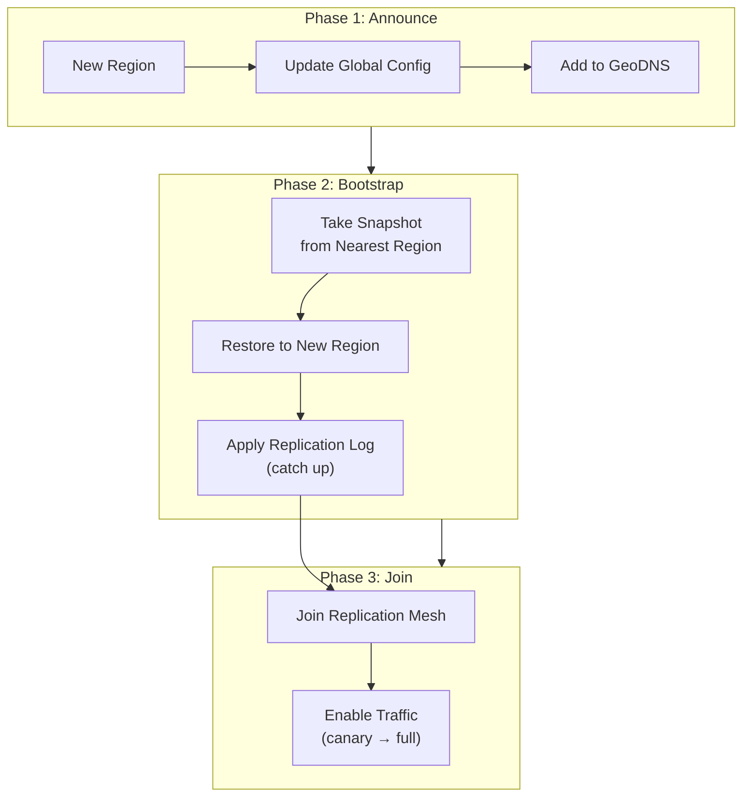
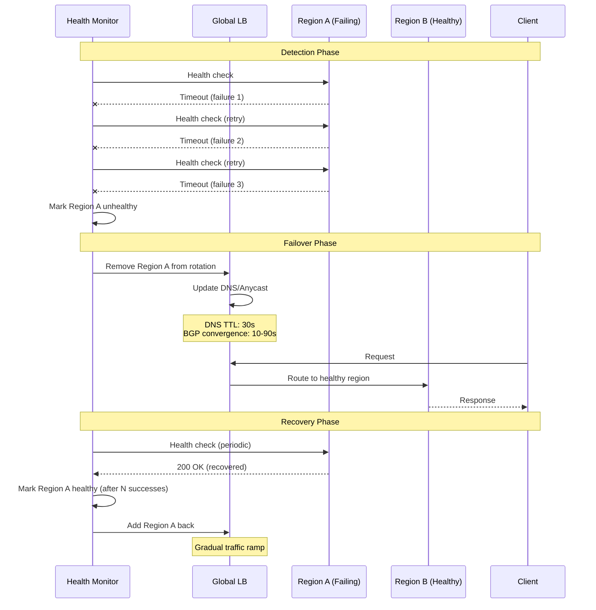
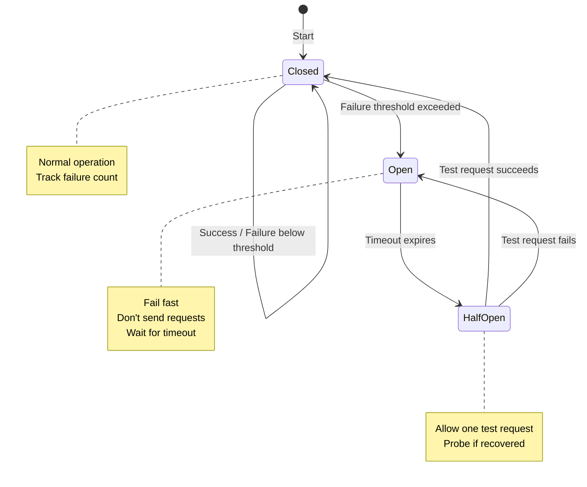
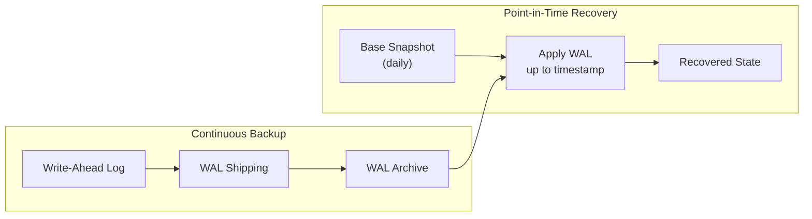

# Scalability & Reliability

[← Back to Index](./00-index.md) | [Previous: Deep Dive →](./04-deep-dive-and-bottlenecks.md) | [Next: Security →](./06-security-and-compliance.md)

---

## Scalability Strategy

### Horizontal Scaling: Adding Regions



**Region Addition Procedure:**

| Step | Action | Duration | Risk |
|------|--------|----------|------|
| 1 | Provision infrastructure | Hours | None (isolated) |
| 2 | Deploy application stack | Minutes | None |
| 3 | Bootstrap data from snapshot | Hours (depends on size) | Snapshot must be consistent |
| 4 | Catch up from replication log | Minutes-Hours | Must not fall further behind |
| 5 | Join replication mesh | Minutes | Conflict resolution active |
| 6 | Enable health checks | Minutes | None |
| 7 | Canary traffic (1%) | Hours | Monitor closely |
| 8 | Gradual ramp to full traffic | Hours-Days | Monitor latency, errors |

### Vertical Scaling Within Regions

| Component | Vertical Scaling Approach | Limit |
|-----------|---------------------------|-------|
| **API Servers** | Larger instances for burst capacity | Memory/CPU limits |
| **Data Nodes** | More storage, faster SSDs | Single-node reliability |
| **Cache** | More memory per node | Single-node memory limit |
| **Replication Transport** | More network bandwidth | Link capacity |

**Recommendation:** Prefer horizontal scaling (more nodes) over vertical (bigger nodes) for reliability.

### Database Scaling Strategy

```
┌─────────────────────────────────────────────────────────────┐
│               Per-Region Database Scaling                    │
├─────────────────────────────────────────────────────────────┤
│                                                              │
│  Strategy 1: Read Replicas                                   │
│  • Multiple read replicas per region                         │
│  • Writes go to primary, reads distributed                   │
│  • Best for: Read-heavy workloads (80%+ reads)              │
│                                                              │
│  Strategy 2: Sharding (Partitioning)                         │
│  • Data split by consistent hash of key                      │
│  • Each shard handles subset of data                         │
│  • Best for: Large datasets, high write volume               │
│                                                              │
│  Strategy 3: Hybrid                                          │
│  • Shards + read replicas per shard                          │
│  • Complex but most scalable                                 │
│  • Best for: Very high scale (>1M QPS per region)           │
│                                                              │
│  Recommendation: Start with read replicas, add sharding      │
│  when single-node write capacity is insufficient             │
└─────────────────────────────────────────────────────────────┘
```

### Scaling Triggers and Thresholds

| Metric | Warning | Critical | Action |
|--------|---------|----------|--------|
| **CPU utilization** | 60% | 80% | Add instances |
| **Memory usage** | 70% | 85% | Add instances or optimize |
| **Replication lag** | 200ms | 1000ms | Add replication threads |
| **Request queue depth** | 100 | 500 | Add API servers |
| **Disk usage** | 70% | 85% | Add storage nodes |
| **Cache hit rate** | <90% | <80% | Increase cache size |

---

## Reliability & Fault Tolerance

### 2N Redundancy Model

```
┌─────────────────────────────────────────────────────────────┐
│                    2N Redundancy                             │
├─────────────────────────────────────────────────────────────┤
│  Principle: Each region can handle 100% of global load       │
│                                                              │
│  Normal Operation (3 regions):                               │
│  ┌─────────┐  ┌─────────┐  ┌─────────┐                      │
│  │ US-East │  │ EU-West │  │  APAC   │                      │
│  │   33%   │  │   33%   │  │   33%   │                      │
│  └─────────┘  └─────────┘  └─────────┘                      │
│                                                              │
│  N+1 Failover (1 region down):                               │
│  ┌─────────┐  ┌─────────┐  ┌─────────┐                      │
│  │ US-East │  │ EU-West │  │  APAC   │                      │
│  │   50%   │  │   50%   │  │    X    │                      │
│  └─────────┘  └─────────┘  └─────────┘                      │
│                                                              │
│  N+2 Failover (2 regions down):                              │
│  ┌─────────┐  ┌─────────┐  ┌─────────┐                      │
│  │ US-East │  │ EU-West │  │  APAC   │                      │
│  │  100%   │  │    X    │  │    X    │                      │
│  └─────────┘  └─────────┘  └─────────┘                      │
│                                                              │
│  Cost: 3x the minimum required capacity                      │
│  Benefit: Survive any 2 region failures                      │
└─────────────────────────────────────────────────────────────┘
```

### Single Points of Failure (SPOF) Analysis

| Component | SPOF Risk | Mitigation |
|-----------|-----------|------------|
| **Global Load Balancer** | High | Multiple providers, anycast |
| **Global Config Manager** | Medium | Multi-region replication, local cache |
| **Regional Load Balancer** | Medium | Active-active pair |
| **API Server** | Low | Stateless, N+2 instances |
| **Data Node** | Low | Quorum replication (3+ copies) |
| **Replication Transport** | Medium | Multiple connections per peer |
| **Network Link** | High | Multiple ISPs, paths |

### Failover Mechanisms

#### Automatic Regional Failover



#### Intra-Region Failover

```
┌─────────────────────────────────────────────────────────────┐
│               Intra-Region Node Failover                     │
├─────────────────────────────────────────────────────────────┤
│  Scenario: Node 1 in US-East fails                           │
│                                                              │
│  Before:                                                     │
│  Client → LB → [Node1, Node2, Node3]                         │
│                                                              │
│  Detection (gossip protocol):                                │
│  • Node2 and Node3 detect Node1 unresponsive                 │
│  • PHI accrual failure detector: φ > 8 = suspected           │
│  • After 3 heartbeat intervals: confirmed dead               │
│                                                              │
│  Failover:                                                   │
│  • LB removes Node1 from rotation                            │
│  • Requests redistributed to Node2, Node3                    │
│  • Hinted handoff: writes for Node1's range go to hints      │
│                                                              │
│  Recovery:                                                   │
│  • Node1 restarts, announces presence                        │
│  • Receives hints, catches up                                │
│  • Rejoins cluster                                           │
│                                                              │
│  RTO: 10-30 seconds | RPO: 0 (quorum maintained)             │
└─────────────────────────────────────────────────────────────┘
```

### Circuit Breaker Pattern



**Circuit Breaker Configuration:**

| Parameter | Value | Rationale |
|-----------|-------|-----------|
| **Failure threshold** | 5 failures in 10 seconds | Avoid false positives |
| **Open timeout** | 30 seconds | Allow time for recovery |
| **Half-open test requests** | 1 | Minimize load on recovering service |
| **Success threshold to close** | 3 consecutive | Confirm stable recovery |

### Retry Strategy with Exponential Backoff

```
FUNCTION retry_with_backoff(operation, config):
    attempt = 0
    last_error = null

    WHILE attempt < config.max_retries:
        TRY:
            result = operation()
            RETURN result

        CATCH error:
            last_error = error
            attempt += 1

            IF NOT is_retryable(error):
                THROW error

            IF attempt < config.max_retries:
                // Calculate backoff with jitter
                base_delay = config.initial_delay * (2 ^ attempt)
                jitter = random(0, base_delay * 0.1)
                delay = MIN(base_delay + jitter, config.max_delay)

                SLEEP(delay)

    THROW RetryExhaustedError(last_error, attempts=attempt)


// Configuration
config = {
    max_retries: 3,
    initial_delay: 100ms,
    max_delay: 5000ms,
    retryable_errors: [TIMEOUT, UNAVAILABLE, RESOURCE_EXHAUSTED]
}
```

### Graceful Degradation Levels

| Level | Trigger | Actions | User Impact |
|-------|---------|---------|-------------|
| **Level 0** | Normal | All features enabled | None |
| **Level 1** | CPU > 70% or lag > 200ms | Extend cache TTLs 2x, disable analytics | Slightly stale data |
| **Level 2** | CPU > 85% or lag > 500ms | Disable non-critical features, serve stale | Missing features |
| **Level 3** | CPU > 95% or lag > 2s | Read-only mode, queue writes | No writes |
| **Level 4** | Region failing | Static error page, redirect to backup | Service unavailable |

---

## Disaster Recovery

### RTO / RPO Targets

| Scenario | RTO Target | RPO Target | Achieved |
|----------|------------|------------|----------|
| **Single node failure** | < 30 seconds | 0 (quorum) | Yes |
| **Zone failure** | < 1 minute | 0 (zone redundancy) | Yes |
| **Region failure** | < 5 minutes | < replication lag | Yes |
| **Multi-region failure** | < 30 minutes | < 1 minute | Depends on scenario |
| **Data corruption** | < 1 hour | Point-in-time | Yes (with PITR) |

### Backup Strategy

```
┌─────────────────────────────────────────────────────────────┐
│                     Backup Layers                            │
├─────────────────────────────────────────────────────────────┤
│                                                              │
│  Layer 1: Replication (Continuous)                           │
│  • Real-time replication to other regions                    │
│  • RPO: < replication lag (typically < 500ms)                │
│  • Protects against: Node failure, zone failure              │
│                                                              │
│  Layer 2: Snapshots (Hourly)                                 │
│  • Consistent snapshots of each region                       │
│  • Stored in object storage (different region)               │
│  • Retention: 24 hours of hourly snapshots                   │
│  • Protects against: Logical corruption, accidental delete   │
│                                                              │
│  Layer 3: Daily Backups                                      │
│  • Full daily backup                                         │
│  • Retention: 30 days                                        │
│  • Stored: Cross-region object storage                       │
│  • Protects against: Major corruption, compliance            │
│                                                              │
│  Layer 4: Archive (Monthly)                                  │
│  • Monthly archive to cold storage                           │
│  • Retention: 7 years (compliance)                           │
│  • Protects against: Legal/audit requirements                │
│                                                              │
└─────────────────────────────────────────────────────────────┘
```

### Point-in-Time Recovery (PITR)



**PITR Procedure:**

1. Identify target timestamp for recovery
2. Find most recent base snapshot before target
3. Restore base snapshot to recovery environment
4. Apply WAL entries from snapshot time to target time
5. Validate recovered data
6. Swap traffic to recovered environment (or sync back)

### Chaos Engineering

| Experiment | Frequency | Scope | Expected Outcome |
|------------|-----------|-------|------------------|
| **Kill random node** | Weekly | Per region | Automatic failover, no data loss |
| **Network partition** | Monthly | Between regions | Both sides continue, reconcile on heal |
| **Slow network** | Monthly | Single region | Graceful degradation, circuit breakers |
| **Region evacuation** | Quarterly | Full region | Traffic moves, RTO < 5 min |
| **Data corruption** | Annually | Simulated | PITR recovery successful |

---

## Capacity Planning

### Growth Projections

| Metric | Year 1 | Year 2 | Year 3 | Year 5 |
|--------|--------|--------|--------|--------|
| **Users** | 50M | 75M | 100M | 150M |
| **QPS (peak)** | 174K | 260K | 350K | 525K |
| **Storage/region** | 65 TB | 100 TB | 150 TB | 300 TB |
| **Regions** | 3 | 4 | 5 | 7 |
| **Replication bandwidth** | 3.3 Gbps | 6 Gbps | 12 Gbps | 25 Gbps |

### Capacity Runway

```
┌─────────────────────────────────────────────────────────────┐
│                   Capacity Runway Model                      │
├─────────────────────────────────────────────────────────────┤
│                                                              │
│  Current Capacity: 200K QPS per region                       │
│  Current Usage: 60K QPS per region (30% utilization)         │
│  Growth Rate: 50% YoY                                        │
│                                                              │
│  Runway Calculation:                                         │
│  • Year 1: 60K → 90K (45% utilization) ✓                    │
│  • Year 2: 90K → 135K (67% utilization) ⚠️ Plan expansion   │
│  • Year 3: 135K → 200K (100% utilization) 🚨 Must expand    │
│                                                              │
│  Action: Begin capacity expansion in Year 2                  │
│                                                              │
└─────────────────────────────────────────────────────────────┘
```

### Cost Considerations

| Cost Category | Per Region/Month | Notes |
|---------------|------------------|-------|
| **Compute** | $50,000 | API servers, data nodes |
| **Storage** | $20,000 | SSD, object storage for backups |
| **Network (egress)** | $30,000 | Cross-region replication |
| **Network (inter-zone)** | $10,000 | Intra-region communication |
| **Managed services** | $15,000 | DNS, monitoring, etc. |
| **Total per region** | $125,000 | |
| **Total (3 regions)** | $375,000 | |

**Cost Optimization Opportunities:**

1. Reserved instances for baseline capacity
2. Spot instances for burst capacity
3. Compress replication traffic
4. Tiered storage (hot/warm/cold)
5. Regional data residency (avoid unnecessary replication)

---

[← Back to Index](./00-index.md) | [Previous: Deep Dive →](./04-deep-dive-and-bottlenecks.md) | [Next: Security →](./06-security-and-compliance.md)
