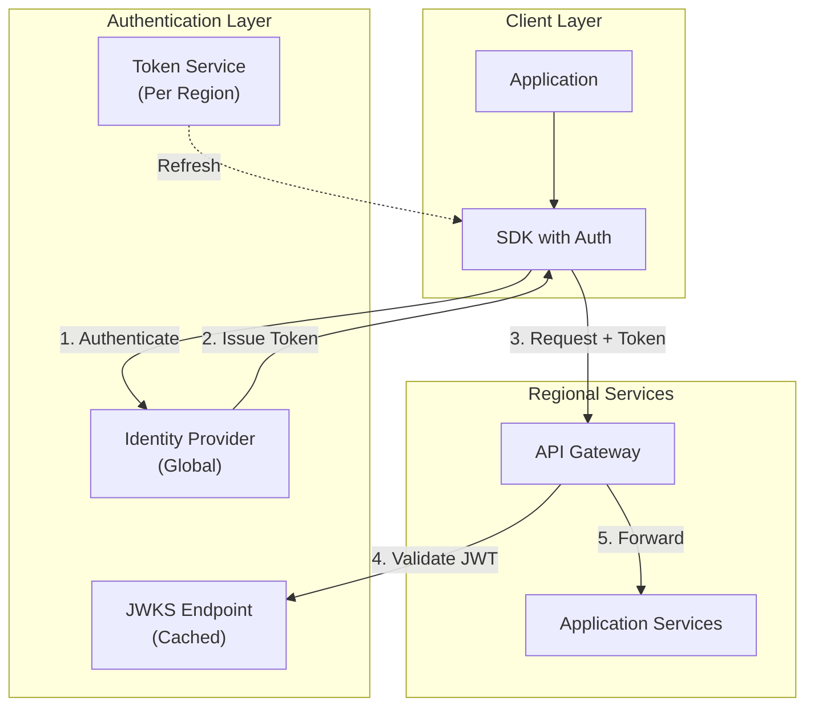
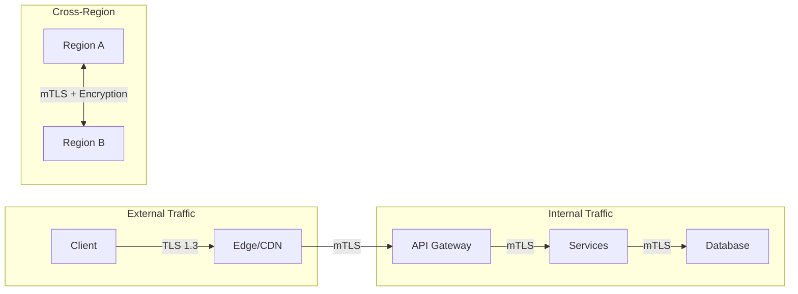
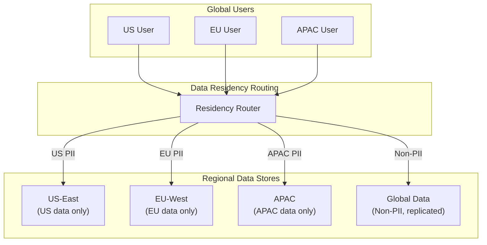

# Security & Compliance

[← Back to Index](./00-index.md) | [Previous: Scalability →](./05-scalability-and-reliability.md) | [Next: Observability →](./07-observability.md)

---

## Authentication & Authorization

### Authentication Architecture



### Token Strategy

| Token Type | Lifetime | Use Case | Storage |
|------------|----------|----------|---------|
| **Access Token (JWT)** | 15 minutes | API authentication | Memory only |
| **Refresh Token** | 7 days | Token renewal | Secure storage |
| **Session Token** | 24 hours | Read-your-writes consistency | Cookie/Header |
| **API Key** | Until revoked | Service-to-service | Secret manager |

### JWT Structure for Multi-Region

```
{
  "header": {
    "alg": "RS256",
    "kid": "key-2025-01"
  },
  "payload": {
    "sub": "user-12345",
    "iss": "auth.example.com",
    "aud": "api.example.com",
    "exp": 1705433400,
    "iat": 1705432500,
    "jti": "unique-token-id",

    // Multi-region specific claims
    "home_region": "us-east",
    "allowed_regions": ["us-east", "eu-west", "apac"],
    "data_residency": "eu",
    "session_id": "session-xyz",
    "last_write_clock": {
      "us-east": 42,
      "eu-west": 38
    }
  },
  "signature": "..."
}
```

### Authorization Model: RBAC + ABAC

```
┌─────────────────────────────────────────────────────────────┐
│                   Authorization Flow                         │
├─────────────────────────────────────────────────────────────┤
│                                                              │
│  1. Extract claims from JWT                                  │
│     - user_id, roles, home_region, data_residency            │
│                                                              │
│  2. RBAC Check (Role-Based)                                  │
│     - Does user have required role for this operation?       │
│     - Roles: admin, editor, viewer, service                  │
│                                                              │
│  3. ABAC Check (Attribute-Based)                             │
│     - Is resource in user's allowed regions?                 │
│     - Does data_residency constraint allow access?           │
│     - Is user accessing their own data?                      │
│                                                              │
│  4. Rate Limit Check                                         │
│     - Per-user, per-API-key limits                           │
│                                                              │
│  5. Grant or Deny                                            │
│                                                              │
└─────────────────────────────────────────────────────────────┘
```

---

## Data Security

### Encryption at Rest

| Layer | Encryption | Key Management |
|-------|------------|----------------|
| **Database** | AES-256 | Per-region KMS keys |
| **Backups** | AES-256 | Separate backup keys |
| **Object Storage** | AES-256 (SSE) | Provider-managed + customer keys |
| **Logs** | AES-256 | Dedicated log encryption keys |

**Key Rotation:**
- Automatic rotation every 90 days
- Old keys retained for decryption of historical data
- Key revocation propagates to all regions within 1 hour

### Encryption in Transit



**TLS Configuration:**

| Setting | Value | Rationale |
|---------|-------|-----------|
| **Minimum version** | TLS 1.3 | Modern, secure |
| **Cipher suites** | AEAD only | ChaCha20-Poly1305, AES-GCM |
| **Certificate validity** | 90 days | Limit exposure |
| **HSTS** | Enabled, 1 year | Prevent downgrade |
| **Certificate pinning** | Mobile apps only | Prevent MITM |

### Cross-Region Replication Security

```
┌─────────────────────────────────────────────────────────────┐
│             Replication Security Layers                      │
├─────────────────────────────────────────────────────────────┤
│                                                              │
│  Layer 1: Network Isolation                                  │
│  • Dedicated private network links between regions           │
│  • No public internet traversal                              │
│  • VPC peering or dedicated interconnects                    │
│                                                              │
│  Layer 2: Transport Security (mTLS)                          │
│  • Mutual TLS authentication between regions                 │
│  • Certificates issued by internal CA                        │
│  • Certificate validation on every connection                │
│                                                              │
│  Layer 3: Payload Encryption                                 │
│  • Application-level encryption of sensitive fields          │
│  • Different keys per data classification                    │
│  • Replication transports encrypted payloads                 │
│                                                              │
│  Layer 4: Integrity Verification                             │
│  • HMAC on every replication batch                           │
│  • Sequence numbers prevent replay                           │
│  • Merkle tree verification for anti-entropy                 │
│                                                              │
└─────────────────────────────────────────────────────────────┘
```

### PII Handling

| Data Type | Classification | Handling |
|-----------|----------------|----------|
| **Email** | PII | Encrypted at rest, masked in logs |
| **Name** | PII | Encrypted at rest |
| **Password** | Secret | Hashed (Argon2id), never logged |
| **API Keys** | Secret | Hashed for lookup, encrypted for storage |
| **IP Address** | PII | Truncated in logs, TTL for storage |
| **Payment Info** | PCI | Tokenized, stored in PCI-compliant vault |

---

## Threat Model

### Top Threats for Multi-Region Active-Active

| Threat | Impact | Likelihood | Risk | Mitigation |
|--------|--------|------------|------|------------|
| **Region Compromise** | Critical | Low | High | mTLS, encryption at rest, audit logs |
| **MITM on Replication** | Critical | Medium | High | mTLS, payload encryption |
| **Unauthorized Data Access** | High | Medium | High | RBAC/ABAC, encryption |
| **DDoS** | High | High | Medium | Anycast, rate limiting, scrubbing |
| **Data Exfiltration** | Critical | Low | Medium | DLP, audit logging, anomaly detection |
| **Insider Threat** | Critical | Low | Medium | Least privilege, audit, separation of duties |
| **Clock Manipulation** | Medium | Low | Low | HLC, bounded clock skew checks |

### Attack Vectors and Mitigations

#### 1. Replication Channel Attack

```
┌─────────────────────────────────────────────────────────────┐
│  Attack: Attacker intercepts replication traffic             │
│                                                              │
│  Vectors:                                                    │
│  • Network tap on cross-region link                          │
│  • Compromised router                                        │
│  • DNS hijacking to redirect replication                     │
│                                                              │
│  Mitigations:                                                │
│  ✓ mTLS with certificate pinning                            │
│  ✓ Payload encryption (application-level)                   │
│  ✓ HMAC integrity checks                                    │
│  ✓ Private network links (no public internet)               │
│  ✓ Certificate transparency monitoring                       │
│  ✓ Anomaly detection on replication patterns                │
└─────────────────────────────────────────────────────────────┘
```

#### 2. Conflict Resolution Manipulation

```
┌─────────────────────────────────────────────────────────────┐
│  Attack: Attacker manipulates timestamps or clocks           │
│                                                              │
│  Vectors:                                                    │
│  • NTP spoofing to advance local clock                       │
│  • Direct timestamp manipulation in requests                 │
│  • Vector clock forgery                                      │
│                                                              │
│  Mitigations:                                                │
│  ✓ HLC bounds physical clock drift                          │
│  ✓ Server generates timestamps (not client)                 │
│  ✓ Vector clocks verified against known positions            │
│  ✓ Clock skew monitoring and alerting                       │
│  ✓ Multiple NTP sources with consensus                      │
└─────────────────────────────────────────────────────────────┘
```

#### 3. Region Split-Brain Attack

```
┌─────────────────────────────────────────────────────────────┐
│  Attack: Attacker causes partition to create divergent data  │
│                                                              │
│  Vectors:                                                    │
│  • Network attack to isolate regions                         │
│  • DNS manipulation to misroute traffic                      │
│  • BGP hijacking                                             │
│                                                              │
│  Mitigations:                                                │
│  ✓ Multiple network paths between regions                   │
│  ✓ RPKI for BGP route validation                            │
│  ✓ DNSSEC for DNS integrity                                 │
│  ✓ Partition detection and alerting                         │
│  ✓ Automatic reconciliation on heal                         │
│  ✓ Manual review for extended partitions                    │
└─────────────────────────────────────────────────────────────┘
```

### Rate Limiting and DDoS Protection

| Layer | Protection | Configuration |
|-------|------------|---------------|
| **Edge** | DDoS scrubbing | Anycast absorption, traffic analysis |
| **DNS** | DNS amplification protection | Rate limiting, DNSSEC |
| **Load Balancer** | Connection limiting | Max 10K conn/IP |
| **API Gateway** | Request rate limiting | 1000 req/min/user |
| **Application** | Business logic rate limiting | Custom per-endpoint |

---

## Compliance Considerations

### Data Residency (GDPR, etc.)



**Data Residency Rules:**

| Data Type | Residency Requirement | Implementation |
|-----------|----------------------|----------------|
| **EU Personal Data** | Must stay in EU | EU-only replication, no cross-region |
| **US Financial Data** | US only | US-only storage |
| **General User Preferences** | No restriction | Globally replicated |
| **Aggregated Analytics** | No restriction | Globally replicated |
| **Audit Logs** | Regional + Central | Replicated to compliance region |

### Cross-Border Data Transfer

```
┌─────────────────────────────────────────────────────────────┐
│            Cross-Border Data Transfer Strategy               │
├─────────────────────────────────────────────────────────────┤
│                                                              │
│  Mechanism 1: Data Localization                              │
│  • PII stays in origin region                                │
│  • Only anonymized/aggregated data crosses borders           │
│                                                              │
│  Mechanism 2: Standard Contractual Clauses (SCCs)            │
│  • Legal framework for EU-US, EU-other transfers             │
│  • Documented data processing agreements                     │
│                                                              │
│  Mechanism 3: Binding Corporate Rules (BCRs)                 │
│  • Internal policies for intra-company transfers             │
│  • Approved by data protection authorities                   │
│                                                              │
│  Mechanism 4: Consent-Based                                  │
│  • Explicit user consent for cross-border processing         │
│  • Granular control in user settings                         │
│                                                              │
└─────────────────────────────────────────────────────────────┘
```

### Audit Logging

| Event | Logged Data | Retention |
|-------|-------------|-----------|
| **Authentication** | User ID, timestamp, IP, success/fail | 2 years |
| **Authorization** | User, resource, action, decision | 2 years |
| **Data Access** | User, keys accessed, timestamp | 1 year |
| **Data Modification** | User, key, old hash, new hash | 5 years |
| **Replication** | Source, target, batch ID, count | 90 days |
| **Conflict Resolution** | Key, strategy, winning value hash | 1 year |
| **Admin Actions** | Admin, action, target, timestamp | 7 years |

### Compliance Frameworks

| Framework | Relevance | Key Requirements |
|-----------|-----------|------------------|
| **GDPR** | EU user data | Data residency, consent, right to erasure |
| **CCPA** | California users | Data access, deletion, opt-out |
| **SOC 2** | Enterprise customers | Security controls, availability |
| **HIPAA** | Healthcare data | Encryption, access controls, BAA |
| **PCI-DSS** | Payment data | Tokenization, network segmentation |

---

## Security Operations

### Secret Management

```
┌─────────────────────────────────────────────────────────────┐
│                   Secret Management Flow                     │
├─────────────────────────────────────────────────────────────┤
│                                                              │
│  Secret Types:                                               │
│  • Database credentials                                      │
│  • API keys (internal and external)                          │
│  • Encryption keys                                           │
│  • TLS certificates and private keys                         │
│  • Service account tokens                                    │
│                                                              │
│  Management:                                                 │
│  1. Store in Secret Manager (per-region)                     │
│  2. Replicate across regions (encrypted)                     │
│  3. Access via IAM roles (no hardcoded secrets)             │
│  4. Automatic rotation (90-day cycle)                        │
│  5. Audit all access                                         │
│                                                              │
│  Emergency:                                                  │
│  • Break-glass procedure for emergency access                │
│  • Requires 2 approvals from security team                   │
│  • All break-glass access audited and reviewed               │
│                                                              │
└─────────────────────────────────────────────────────────────┘
```

### Incident Response

| Severity | Response Time | Examples |
|----------|---------------|----------|
| **P1 (Critical)** | 15 minutes | Data breach, region compromise |
| **P2 (High)** | 1 hour | Authentication system failure |
| **P3 (Medium)** | 4 hours | Suspicious activity detected |
| **P4 (Low)** | 24 hours | Policy violation |

### Security Monitoring

| Monitor | Threshold | Alert |
|---------|-----------|-------|
| **Failed logins** | >100/min per user | Block + alert |
| **Unusual data access** | >10x baseline | Alert + investigate |
| **Cross-region anomaly** | Unexpected replication | Alert |
| **Certificate expiry** | <30 days | Warning |
| **Privilege escalation** | Any | Immediate alert |

---

[← Back to Index](./00-index.md) | [Previous: Scalability →](./05-scalability-and-reliability.md) | [Next: Observability →](./07-observability.md)
