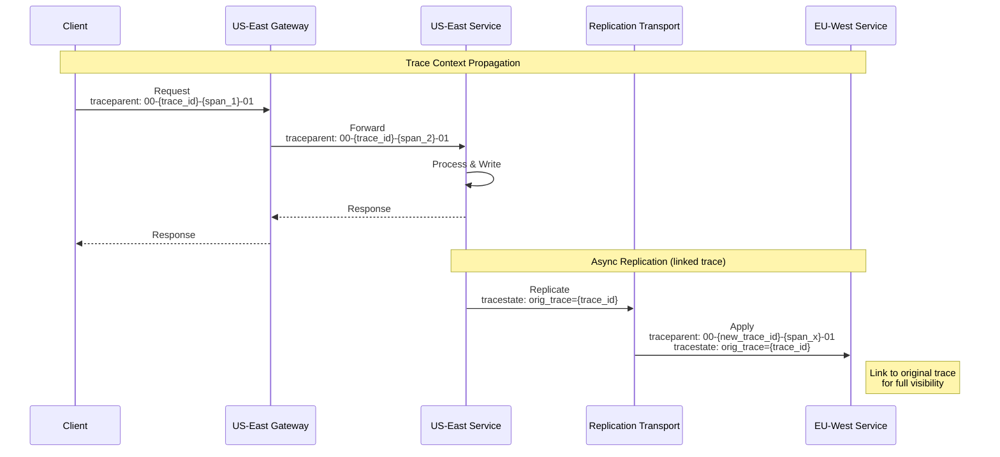

# Observability

[← Back to Index](./00-index.md) | [Previous: Security →](./06-security-and-compliance.md) | [Next: Interview Guide →](./08-interview-guide.md)

---

## Metrics (USE/RED Method)

### Infrastructure Metrics (USE)

| Component | Utilization | Saturation | Errors |
|-----------|-------------|------------|--------|
| **API Servers** | CPU %, Memory % | Request queue depth | 5xx count |
| **Data Nodes** | Disk %, CPU %, Memory % | Write queue depth | Read/Write errors |
| **Cache** | Memory %, Hit rate | Eviction rate | Connection errors |
| **Replication Transport** | Bandwidth %, CPU % | Backlog size | Failed batches |
| **Network** | Bandwidth %, Packet rate | Dropped packets | Connection failures |

### Application Metrics (RED)

| Service | Rate | Errors | Duration |
|---------|------|--------|----------|
| **Read Operations** | Reads/sec per region | Read errors/sec | p50, p95, p99 latency |
| **Write Operations** | Writes/sec per region | Write errors/sec | p50, p95, p99 latency |
| **Conflict Resolution** | Conflicts/sec | Resolution failures/sec | Resolution latency |
| **Replication** | Records/sec per peer | Failed replications | Replication lag (ms) |
| **Cache** | Gets/sec, Sets/sec | Misses, Errors | Cache latency |

### Multi-Region Specific Metrics

```
┌─────────────────────────────────────────────────────────────┐
│              Critical Multi-Region Metrics                   │
├─────────────────────────────────────────────────────────────┤
│                                                              │
│  Replication Health:                                         │
│  • replication_lag_ms{source, target}                        │
│  • replication_throughput_records_sec{source, target}        │
│  • replication_batch_size_bytes{source, target}              │
│  • replication_queue_depth{source}                           │
│                                                              │
│  Conflict Resolution:                                        │
│  • conflicts_total{type, resolution_strategy}                │
│  • conflicts_per_key_sec{key_prefix}                         │
│  • conflict_resolution_latency_ms{strategy}                  │
│  • siblings_created_total (for app-resolved conflicts)       │
│                                                              │
│  Vector Clock:                                               │
│  • vector_clock_drift{region_pair} (clock position diff)     │
│  • vector_clock_entries_avg (size of clock)                  │
│                                                              │
│  CRDT State:                                                 │
│  • crdt_state_size_bytes{type}                               │
│  • crdt_merge_operations_sec{type}                           │
│  • crdt_gc_collections_total                                 │
│                                                              │
│  Regional Health:                                            │
│  • region_health_status{region} (0=down, 1=up)               │
│  • cross_region_latency_ms{source, target}                   │
│  • traffic_distribution_percent{region}                      │
│                                                              │
└─────────────────────────────────────────────────────────────┘
```

### Key Metric Definitions

| Metric | Formula | Target | Alert Threshold |
|--------|---------|--------|-----------------|
| **Replication Lag** | `max(target_position) - source_position` | < 100ms | > 500ms |
| **Conflict Rate** | `conflicts / total_writes` | < 0.1% | > 1% |
| **Availability** | `1 - (error_time / total_time)` | 99.999% | < 99.99% |
| **Convergence Time** | `time_to_consistent_state` | < 5s | > 30s |
| **Read Latency (p99)** | 99th percentile | < 50ms | > 100ms |
| **Write Latency (p99)** | 99th percentile | < 100ms | > 200ms |

---

## Logging Strategy

### Log Levels

| Level | When to Use | Examples |
|-------|-------------|----------|
| **ERROR** | Operation failed, requires attention | Write failure, replication error |
| **WARN** | Degraded but functional | High latency, conflict detected |
| **INFO** | Normal operations | Request processed, replication batch sent |
| **DEBUG** | Detailed diagnostics | Vector clock values, merge details |
| **TRACE** | Very verbose (dev only) | Every key access, wire protocol |

### Structured Log Format

```json
{
  "timestamp": "2025-01-22T10:30:45.123Z",
  "level": "INFO",
  "service": "conflict-resolver",
  "region": "us-east",
  "node": "node-3",
  "trace_id": "abc123def456",
  "span_id": "span789",
  "event": "conflict_resolved",
  "attributes": {
    "key": "user:12345:preferences",
    "strategy": "crdt_merge",
    "local_clock": {"us-east": 42, "eu-west": 38},
    "remote_clock": {"us-east": 40, "eu-west": 39},
    "merged_clock": {"us-east": 42, "eu-west": 39},
    "duration_ms": 2.5
  }
}
```

### Log Retention

| Log Type | Hot Storage | Warm Storage | Archive |
|----------|-------------|--------------|---------|
| **Application Logs** | 7 days | 30 days | 1 year |
| **Access Logs** | 7 days | 90 days | 2 years |
| **Security Logs** | 30 days | 1 year | 7 years |
| **Replication Logs** | 3 days | 14 days | 90 days |
| **Debug Logs** | 1 day | 7 days | None |

### Critical Events to Log

| Event | Level | Required Fields |
|-------|-------|-----------------|
| **Write committed** | INFO | key, region, vector_clock, latency_ms |
| **Conflict detected** | WARN | key, local_clock, remote_clock, type |
| **Conflict resolved** | INFO | key, strategy, winner, loser_hash |
| **Replication batch sent** | INFO | source, target, count, size_bytes |
| **Replication batch failed** | ERROR | source, target, error, retry_count |
| **Region failover triggered** | WARN | region, reason, traffic_redirected_to |
| **Anti-entropy divergence** | WARN | region_pair, divergent_keys_count |
| **Clock skew detected** | WARN | region, skew_ms, threshold |

---

## Distributed Tracing

### Trace Propagation Across Regions



### Key Spans to Instrument

| Span Name | Parent | Attributes |
|-----------|--------|------------|
| `http.request` | Root | method, path, status_code |
| `db.read` | http.request | key, consistency_level, cache_hit |
| `db.write` | http.request | key, consistency_level |
| `conflict.detect` | db.write | key, clock_comparison_result |
| `conflict.resolve` | conflict.detect | strategy, duration_ms |
| `replication.batch` | db.write | target_region, record_count |
| `replication.apply` | (linked) | source_region, conflict_count |
| `cache.get` | db.read | key, hit |
| `cache.set` | db.write | key, ttl |

### Cross-Region Trace Linking

```
┌─────────────────────────────────────────────────────────────┐
│              Cross-Region Trace Strategy                     │
├─────────────────────────────────────────────────────────────┤
│                                                              │
│  Challenge: Replication is async, may happen much later      │
│                                                              │
│  Solution: Trace Links                                       │
│                                                              │
│  1. Original request gets trace_id: T1                       │
│  2. Write includes T1 in replication metadata                │
│  3. Replication batch creates new trace: T2                  │
│  4. T2 includes "link" to T1                                │
│  5. Trace UI can show related traces                         │
│                                                              │
│  Benefits:                                                   │
│  • End-to-end visibility across regions                      │
│  • Debug replication issues                                  │
│  • Understand latency contributions                          │
│                                                              │
└─────────────────────────────────────────────────────────────┘
```

---

## Alerting

### Alert Severity Levels

| Severity | Response Time | Notification | Examples |
|----------|---------------|--------------|----------|
| **P1 - Critical** | Immediate | Page on-call | Region down, data loss risk |
| **P2 - High** | 15 minutes | Page on-call | Replication stopped, high error rate |
| **P3 - Medium** | 1 hour | Slack channel | Elevated latency, conflict spike |
| **P4 - Low** | Next business day | Email | Capacity warning, minor anomaly |

### Critical Alerts (Page-Worthy)

| Alert | Condition | Action |
|-------|-----------|--------|
| **Region Unreachable** | Health checks fail for > 1 min | Verify failover, investigate |
| **Replication Stopped** | No batches for > 5 min | Check network, restart transport |
| **Data Divergence** | Anti-entropy finds > 1000 keys diverged | Investigate root cause |
| **Conflict Storm** | > 100 conflicts/sec for > 1 min | Identify hot key, mitigate |
| **Error Rate Spike** | > 1% errors for > 2 min | Check logs, rollback if recent deploy |
| **Latency Spike** | p99 > 500ms for > 5 min | Check capacity, investigate |

### Warning Alerts

| Alert | Condition | Action |
|-------|-----------|--------|
| **Replication Lag High** | Lag > 500ms for > 5 min | Monitor, add capacity if persists |
| **Conflict Rate Elevated** | > 0.5% conflicts for > 10 min | Review patterns, optimize |
| **Capacity Warning** | > 70% utilization | Plan scaling |
| **Clock Skew Detected** | Skew > 100ms | Check NTP, investigate |
| **Certificate Expiring** | < 14 days to expiry | Renew certificate |

### Alert Routing

```
┌─────────────────────────────────────────────────────────────┐
│                    Alert Routing Rules                       │
├─────────────────────────────────────────────────────────────┤
│                                                              │
│  P1 (Critical):                                              │
│  └─→ PagerDuty → On-call engineer → Escalate after 10 min   │
│                                                              │
│  P2 (High):                                                  │
│  └─→ PagerDuty → On-call engineer                           │
│  └─→ Slack #incidents                                        │
│                                                              │
│  P3 (Medium):                                                │
│  └─→ Slack #alerts                                           │
│  └─→ Daily digest email                                      │
│                                                              │
│  P4 (Low):                                                   │
│  └─→ Weekly digest email                                     │
│  └─→ Dashboard only                                          │
│                                                              │
│  Escalation:                                                 │
│  • No ACK in 10 min → Escalate to secondary                  │
│  • No resolution in 30 min → Escalate to manager             │
│  • P1 open > 1 hour → Executive notification                 │
│                                                              │
└─────────────────────────────────────────────────────────────┘
```

---

## Dashboards

### Global Overview Dashboard

```
┌─────────────────────────────────────────────────────────────┐
│                  GLOBAL HEALTH OVERVIEW                      │
├─────────────────────────────────────────────────────────────┤
│                                                              │
│  Region Status:    [US-East: ✓]  [EU-West: ✓]  [APAC: ✓]    │
│                                                              │
│  ┌─────────────┐  ┌─────────────┐  ┌─────────────┐          │
│  │ Global QPS  │  │ Error Rate  │  │ Avg Latency │          │
│  │   145,234   │  │   0.02%     │  │    23ms     │          │
│  └─────────────┘  └─────────────┘  └─────────────┘          │
│                                                              │
│  Replication Status:                                         │
│  US-East → EU-West:  [====----]  Lag: 85ms                  │
│  US-East → APAC:     [=====---]  Lag: 145ms                 │
│  EU-West → APAC:     [======--]  Lag: 120ms                 │
│                                                              │
│  [Traffic Distribution Over Time - Line Graph]               │
│                                                              │
│  [Error Rate by Region - Stacked Area]                       │
│                                                              │
└─────────────────────────────────────────────────────────────┘
```

### Replication Health Dashboard

| Panel | Visualization | Purpose |
|-------|---------------|---------|
| **Replication Lag** | Time series, per region pair | Monitor freshness |
| **Throughput** | Time series, records/sec | Capacity utilization |
| **Batch Sizes** | Histogram | Batching efficiency |
| **Queue Depth** | Gauge per region | Backpressure indicator |
| **Error Rate** | Time series | Replication health |
| **Merkle Tree Divergence** | Table, per region pair | Anti-entropy status |

### Conflict Resolution Dashboard

| Panel | Visualization | Purpose |
|-------|---------------|---------|
| **Conflict Rate** | Time series | Trend monitoring |
| **Conflicts by Type** | Pie chart | Distribution analysis |
| **Resolution Strategy** | Bar chart | Strategy effectiveness |
| **Hot Keys** | Table, top 10 | Identify problematic keys |
| **Resolution Latency** | Histogram | Performance tracking |
| **Sibling Count** | Time series | App-resolution backlog |

### Regional Deep-Dive Dashboard

| Panel | Visualization | Purpose |
|-------|---------------|---------|
| **Request Rate** | Time series | Traffic patterns |
| **Latency Percentiles** | Time series (p50, p95, p99) | Performance |
| **Error Breakdown** | Bar chart by error type | Debugging |
| **Resource Utilization** | Gauges (CPU, Memory, Disk) | Capacity |
| **Cache Hit Rate** | Time series | Cache effectiveness |
| **Active Connections** | Gauge | Load indicator |

---

## Runbooks

### Runbook: High Replication Lag

```
┌─────────────────────────────────────────────────────────────┐
│  RUNBOOK: Replication Lag > 500ms                            │
├─────────────────────────────────────────────────────────────┤
│                                                              │
│  1. ASSESS                                                   │
│     □ Check which region pairs are affected                  │
│     □ Check if lag is increasing or stable                   │
│     □ Check recent deployments or config changes             │
│                                                              │
│  2. DIAGNOSE                                                 │
│     □ Check replication queue depth                          │
│     □ Check network latency between regions                  │
│     □ Check source region write rate                         │
│     □ Check target region apply rate                         │
│     □ Check for errors in replication logs                   │
│                                                              │
│  3. MITIGATE                                                 │
│     □ If network issue: escalate to network team             │
│     □ If high write rate: enable write throttling            │
│     □ If apply bottleneck: add replication threads           │
│     □ If queue full: increase queue size temporarily         │
│                                                              │
│  4. VERIFY                                                   │
│     □ Confirm lag is decreasing                              │
│     □ Monitor for 15 minutes                                 │
│     □ Check conflict rate (may spike during catch-up)        │
│                                                              │
│  5. POST-INCIDENT                                            │
│     □ Document root cause                                    │
│     □ Create ticket for permanent fix if needed              │
│     □ Update capacity planning                               │
│                                                              │
└─────────────────────────────────────────────────────────────┘
```

### Runbook: Conflict Storm

```
┌─────────────────────────────────────────────────────────────┐
│  RUNBOOK: Conflict Rate > 1%                                 │
├─────────────────────────────────────────────────────────────┤
│                                                              │
│  1. IDENTIFY HOT KEYS                                        │
│     □ Query: top 10 keys by conflict count in last 5 min     │
│     □ Identify pattern (user_id, feature, etc.)              │
│                                                              │
│  2. DETERMINE CAUSE                                          │
│     □ Is it a single hot key? (e.g., global counter)         │
│     □ Is it a traffic spike? (more users = more conflicts)   │
│     □ Is it a bug? (retries causing duplicate writes)        │
│     □ Is it a partition healing? (expected temporary)        │
│                                                              │
│  3. MITIGATE                                                 │
│     □ Hot counter: convert to CRDT G-Counter                 │
│     □ Hot key: add sharding (key:shard_0, key:shard_1)       │
│     □ Bug: identify and fix, consider rollback               │
│     □ Partition heal: monitor, should resolve automatically  │
│                                                              │
│  4. LONG-TERM                                                │
│     □ Review data model for CRDT applicability               │
│     □ Add conflict rate alerting per key prefix              │
│     □ Consider write-partitioned pattern for hot data        │
│                                                              │
└─────────────────────────────────────────────────────────────┘
```

### Runbook: Region Failover

```
┌─────────────────────────────────────────────────────────────┐
│  RUNBOOK: Region Failover                                    │
├─────────────────────────────────────────────────────────────┤
│                                                              │
│  AUTOMATIC FAILOVER (Expected):                              │
│  1. Health monitor detects failure                           │
│  2. GeoDNS/Anycast removes region (< 90 seconds)             │
│  3. Traffic routes to healthy regions                        │
│  4. Alert sent to on-call                                    │
│                                                              │
│  ON-CALL ACTIONS:                                            │
│  □ Verify failover completed (check traffic distribution)    │
│  □ Check healthy regions can handle load                     │
│  □ Investigate failed region (check provider status page)    │
│  □ Communicate status to stakeholders                        │
│                                                              │
│  MANUAL FAILOVER (If needed):                                │
│  □ Remove region from GeoDNS:                                │
│    `dns-ctl remove-region --region us-east`                  │
│  □ Withdraw BGP announcement:                                │
│    `bgp-ctl withdraw --region us-east`                       │
│  □ Verify traffic shift in dashboard                         │
│                                                              │
│  RECOVERY:                                                   │
│  □ Verify region health restored                             │
│  □ Check replication is caught up                            │
│  □ Gradually restore traffic (canary → 10% → 50% → 100%)    │
│  □ Monitor for anomalies                                     │
│                                                              │
└─────────────────────────────────────────────────────────────┘
```

---

## Health Check Endpoints

### Endpoint Definitions

| Endpoint | Purpose | Response Time | Cached |
|----------|---------|---------------|--------|
| `/health/live` | Is process running | < 10ms | No |
| `/health/ready` | Can serve traffic | < 100ms | No |
| `/health/deep` | All dependencies healthy | < 1s | 30s |
| `/health/region` | Cross-region connectivity | < 5s | 60s |

### Response Format

```json
{
  "status": "healthy",
  "region": "us-east",
  "timestamp": "2025-01-22T10:30:45Z",
  "checks": {
    "database": {
      "status": "healthy",
      "latency_ms": 5
    },
    "cache": {
      "status": "healthy",
      "latency_ms": 1
    },
    "replication": {
      "eu-west": {
        "status": "healthy",
        "lag_ms": 85
      },
      "apac": {
        "status": "degraded",
        "lag_ms": 520,
        "message": "High replication lag"
      }
    }
  }
}
```

---

[← Back to Index](./00-index.md) | [Previous: Security →](./06-security-and-compliance.md) | [Next: Interview Guide →](./08-interview-guide.md)
