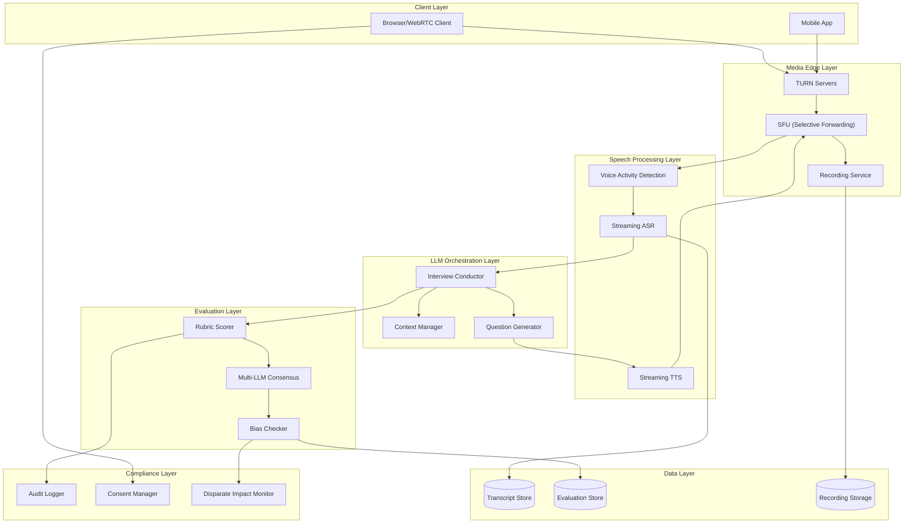

# AI Interviewer System

## Overview

The **AI Interviewer System** is a real-time conversational platform that conducts job interviews using speech processing, large language models, and automated candidate evaluation. Unlike traditional video interview platforms that simply record responses for human review, this system engages candidates in natural, adaptive conversations while providing objective, rubric-based assessments.

**Key Differentiator:** Sub-300ms mouth-to-ear latency enabling natural conversational flow, combined with compliance-first evaluation that meets EEOC, EU AI Act, and NYC AEDT requirements.

---

## System Characteristics

| Characteristic | Value | Implication |
|----------------|-------|-------------|
| Traffic Pattern | Bursty (scheduled interviews) | Capacity reservation, warm instance pools |
| Latency Target | <300ms mouth-to-ear | Edge processing, streaming pipelines |
| Consistency Model | Strong (evaluation), Eventual (analytics) | Hybrid database approach |
| Availability Target | 99.9% | Mid-interview failure = total failure |
| Compliance Scope | EEOC, EU AI Act, NYC AEDT | Modular evaluation, complete audit trails |

---

## Complexity Rating

| Component | Rating | Justification |
|-----------|--------|---------------|
| **Overall** | Very High | Real-time + AI + compliance intersection |
| Speech Pipeline | Very High | VAD + streaming ASR + streaming TTS orchestration |
| LLM Integration | High | Context management, adaptive questioning |
| Evaluation Engine | High | LLM-as-judge, multi-dimensional rubrics |
| Bias Detection | High | Real-time fairness monitoring, DI calculation |
| WebRTC Infrastructure | High | SFU architecture, recording, fallbacks |
| Compliance | High | Multi-jurisdiction, evolving regulations |

---

## Quick Navigation

| Document | Description |
|----------|-------------|
| [01 - Requirements & Estimations](./01-requirements-and-estimations.md) | Functional/non-functional requirements, capacity planning, SLOs |
| [02 - High-Level Design](./02-high-level-design.md) | Architecture, data flow, key decisions |
| [03 - Low-Level Design](./03-low-level-design.md) | Data model, APIs, core algorithms |
| [04 - Deep Dive & Bottlenecks](./04-deep-dive-and-bottlenecks.md) | Critical components, failure modes |
| [05 - Scalability & Reliability](./05-scalability-and-reliability.md) | Scaling strategy, fault tolerance |
| [06 - Security & Compliance](./06-security-and-compliance.md) | EEOC, EU AI Act, bias mitigation |
| [07 - Observability](./07-observability.md) | Metrics, logging, tracing, alerting |
| [08 - Interview Guide](./08-interview-guide.md) | 45-minute pacing, trap questions, trade-offs |

---

## Core Modules

| Module | Responsibility | AI Enhancement |
|--------|----------------|----------------|
| **Interview Orchestrator** | Session lifecycle, turn-taking, state management | Adaptive question sequencing |
| **Speech Pipeline** | Real-time ASR/TTS processing | Streaming inference (<300ms) |
| **LLM Conductor** | Question generation, follow-up detection | Context-aware conversation |
| **Evaluation Engine** | Candidate scoring, rubric application | LLM-as-judge with CoT |
| **Bias Detector** | Fairness monitoring, compliance checking | Real-time DI calculation |
| **Recording Service** | Audio/video capture, storage | Compliance archival |

---

## AI Capabilities Matrix

| Capability | Technology | Latency Target | Purpose |
|------------|------------|----------------|---------|
| Speech Recognition (ASR) | Deepgram Nova-3 / Whisper | 150-350ms | Real-time transcription |
| Speech Synthesis (TTS) | ElevenLabs Flash v2.5 | 75-100ms | Natural AI voice |
| Voice Activity Detection | Silero VAD | 85-100ms | Turn-taking, silence detection |
| Question Generation | GPT-4 / Claude | 300-500ms first token | Adaptive interview flow |
| Response Evaluation | LLM-as-judge | Post-interview | Rubric-based scoring |
| Technical Assessment | Code sandbox + LLM | Real-time | Coding interview support |

---

## Architecture Overview

---

## Interview Types Supported

| Type | Description | Key Evaluation Criteria |
|------|-------------|------------------------|
| **Technical Coding** | Live coding with execution sandbox | Correctness, efficiency, problem-solving approach |
| **Behavioral** | STAR method questions | Situation clarity, action specificity, results quantification |
| **System Design** | Architecture discussions | Trade-off analysis, scalability thinking, communication |
| **Case Study** | Business problem analysis | Structured reasoning, assumptions, conclusions |

---

## AI Interviewer vs Traditional Video Interview

| Aspect | Traditional Video Interview | AI Interviewer System |
|--------|----------------------------|----------------------|
| Interaction | Record-and-review | Real-time conversation |
| Questions | Fixed, pre-recorded | Adaptive, context-aware |
| Follow-ups | None (until human review) | Immediate, relevant |
| Evaluation | Human scoring (days later) | Real-time + post-interview AI scoring |
| Bias Control | Training-dependent | Algorithmic monitoring |
| Scalability | Limited by human reviewers | Unlimited concurrent sessions |
| Latency Requirement | Async | <300ms for natural conversation |

---

## When to Use This Design

**Use when:**
- High-volume hiring requiring consistent, scalable interviews
- Need for objective, rubric-based evaluation
- 24/7 interview availability across time zones
- Compliance requirements demand complete audit trails
- Technical interviews requiring real-time code execution

**Do NOT use when:**
- Candidate pool expects only human interaction (executive hiring)
- Regulatory environment prohibits AI-assisted hiring decisions
- Interview complexity requires nuanced human judgment only
- Infrastructure cannot support sub-300ms latency requirements

---

## Technology Stack Reference

| Layer | Technology Options |
|-------|-------------------|
| Media Transport | WebRTC, Mediasoup, LiveKit |
| Speech Recognition | Deepgram Nova-3, AssemblyAI, Whisper |
| Speech Synthesis | ElevenLabs Flash v2.5, PlayHT |
| Voice Activity | Silero VAD |
| LLM Inference | OpenAI GPT-4, Claude, self-hosted |
| Orchestration | Pipecat, LiveKit Agents, Vapi |
| Database | PostgreSQL (structured), Redis (cache) |
| Object Storage | S3-compatible (recordings) |
| Message Queue | Kafka, RabbitMQ |

---

## Key Numbers

| Metric | Value | Context |
|--------|-------|---------|
| Target latency | <300ms | Mouth-to-ear for natural conversation |
| VAD detection | 85-100ms | Silero VAD threshold |
| ASR latency | 150ms | Deepgram Nova-3 |
| TTS latency | 75ms | ElevenLabs Flash v2.5 |
| EEOC threshold | DI ≥ 0.8 | Four-fifths rule |
| EU AI Act deadline | Aug 2, 2026 | Emotion recognition prohibited in hiring |
| AI bias prevalence | 44% | Video interview systems showing gender bias |

---

## Interview Readiness Checklist

- [ ] Can explain why sub-300ms latency is non-negotiable
- [ ] Understand cascaded vs native speech-to-speech trade-offs
- [ ] Know the latency budget breakdown (VAD + ASR + LLM + TTS)
- [ ] Can discuss EEOC four-fifths rule and DI calculation
- [ ] Understand EU AI Act implications for emotion recognition
- [ ] Can design graceful degradation for component failures
- [ ] Know WebRTC architecture (SFU vs MCU vs P2P)
- [ ] Can explain LLM-as-judge evaluation with CoT

---

## Real-World References

- **HireVue**: 25,000 data points per interview, AWS/FedRAMP certified
- **Paradox (Olivia)**: 100+ languages, 75% faster hiring for Chipotle
- **Mercor**: $100M Series B (Feb 2025), 20-minute AI interviews
- **OpenAI Realtime API**: Native speech-to-speech LLM
- **Deepgram Nova-3**: 150ms streaming ASR
- **ElevenLabs Flash v2.5**: 75ms TTS latency
