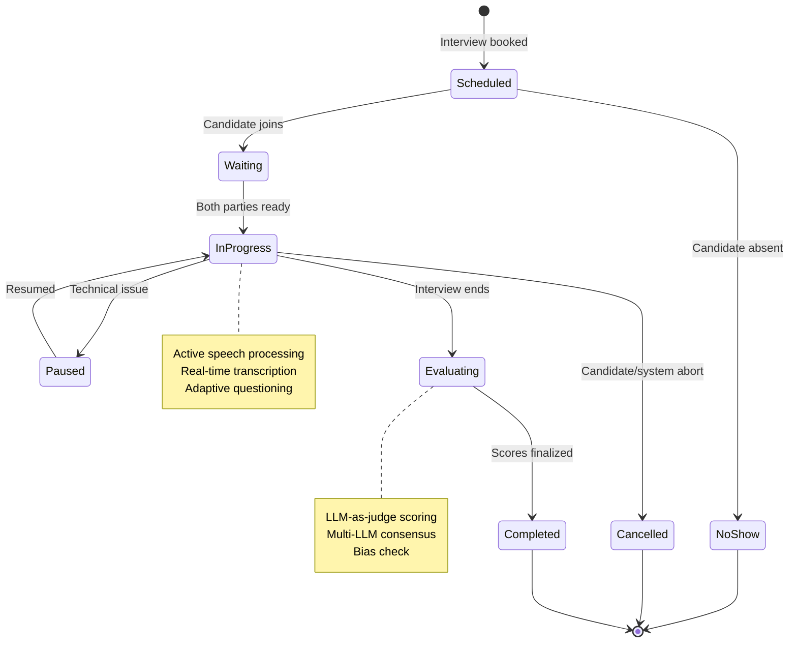

# Requirements & Capacity Estimations

## Functional Requirements

### Core Features (Must Have)

| Feature | Description | AI Enhancement |
|---------|-------------|----------------|
| **Interview Scheduling** | Book slots, send invites, manage calendar | Availability optimization |
| **Real-time Speech Processing** | Capture, transcribe, synthesize speech | <300ms end-to-end latency |
| **Conversational AI** | Dynamic question flow with follow-ups | Context-aware adaptation |
| **Candidate Evaluation** | Multi-dimensional scoring | LLM-as-judge with rubrics |
| **Interview Recording** | Audio/video capture and storage | Compliance archival |
| **Bias Monitoring** | Fairness tracking across demographics | Real-time DI alerts |
| **Explainability** | Decision audit trails | SHAP/LIME attribution |
| **Technical Assessment** | Code execution, problem evaluation | Sandbox + AI analysis |

### Interview Type Support

| Type | Features Required |
|------|-------------------|
| **Technical Coding** | Code editor, execution sandbox, test runner, AI code review |
| **Behavioral** | STAR method detection, competency mapping, follow-up generation |
| **System Design** | Whiteboard/diagram support, trade-off analysis evaluation |
| **Case Study** | Structured reasoning evaluation, assumption tracking |

### Out of Scope

- Human interviewer panel management (separate system)
- Offer letter generation
- Background check integration
- Onboarding workflow

---

## Non-Functional Requirements

### CAP Theorem Analysis

| Requirement | Choice | Justification |
|-------------|--------|---------------|
| Real-time speech streaming | AP | Availability over consistency; temporary lag acceptable |
| Evaluation storage | CP | Strong consistency required for scoring |
| Session state | CP | Interview state must be consistent |
| Analytics | AP | Eventual consistency acceptable |

### Latency Budget Breakdown

**Target: <300ms mouth-to-ear latency**

```mermaid
gantt
    title Latency Budget Allocation (Target: 300ms)
    dateFormat X
    axisFormat %L ms

    section Audio Capture
    Capture + Encode     :0, 40

    section VAD
    Voice Activity Detection :40, 100

    section ASR
    Speech-to-Text (Streaming) :100, 150

    section LLM
    Context + Generation (First Token) :150, 200

    section TTS
    Text-to-Speech (First Chunk) :200, 75

    section Playback
    Decode + Play :275, 25
```

| Stage | Target | Technology | Notes |
|-------|--------|------------|-------|
| Audio Capture | 40ms | WebRTC | Opus codec, 20ms frames |
| Voice Activity Detection | 85-100ms | Silero VAD | Determines speech boundaries |
| Speech-to-Text | 150ms | Deepgram Nova-3 | Streaming partial results |
| LLM Processing | 200ms | GPT-4 / Claude | First token (streaming) |
| Text-to-Speech | 75ms | ElevenLabs Flash v2.5 | First audio chunk |
| Playback | 25ms | WebRTC | Decode + buffer |
| **Total** | **~300ms** | | End-to-end with streaming |

**Without Streaming Optimization:** ~1,100ms (unacceptable for conversation)

### Availability Targets

| Tier | Target | Components | Recovery |
|------|--------|------------|----------|
| **Critical** | 99.9% | Interview session, speech pipeline | Instant failover |
| **Standard** | 99.5% | Evaluation processing, recording | Retry with delay |
| **Best Effort** | 99.0% | Analytics, reporting | Async retry |

**99.9% = 8.76 hours downtime/year = 43.8 minutes/month**

### Consistency Model

| Data Type | Consistency | Reason |
|-----------|-------------|--------|
| Interview state | Strong | Session integrity |
| Transcript segments | Strong | Evaluation accuracy |
| Evaluation scores | Strong | Compliance, audit |
| Analytics aggregates | Eventual | Performance trade-off |
| Recording metadata | Eventual | Write-heavy, async |

---

## Capacity Estimations

### Assumptions

| Parameter | Value | Basis |
|-----------|-------|-------|
| Enterprise customers | 200 | Mid-to-large companies |
| Interviews per customer/month | 500 | Active hiring periods |
| Interview duration (average) | 20 minutes | Industry standard |
| Peak concurrency factor | 5x average | Morning scheduling patterns |
| Audio bitrate | 128 kbps | Opus codec, high quality |
| Video bitrate (if enabled) | 1.5 Mbps | 720p |

### Traffic Estimations

| Metric | Calculation | Result |
|--------|-------------|--------|
| Monthly interviews | 200 customers × 500 | **100,000** |
| Daily interviews (average) | 100,000 / 30 | **3,333** |
| Interviews per hour (average) | 3,333 / 10 (business hours) | **333** |
| Peak concurrent sessions | 333 × 3 (overlap factor) | **~1,000** |

### Storage Estimations

| Data Type | Calculation | Monthly | Yearly |
|-----------|-------------|---------|--------|
| Audio recordings | 100K × 20min × 128kbps ÷ 8 | **19 TB** | 228 TB |
| Video recordings (optional) | 100K × 20min × 1.5Mbps ÷ 8 | **225 TB** | 2.7 PB |
| Transcripts | 100K × 5KB (avg) | **500 GB** | 6 TB |
| Evaluation data | 100K × 10KB | **1 TB** | 12 TB |

### Compute Estimations

| Component | Requirement | Scaling Factor |
|-----------|-------------|----------------|
| ASR Workers | 1 per concurrent interview | 1,000 instances at peak |
| TTS Workers | 1 per concurrent interview | 1,000 instances at peak |
| LLM Inference | GPU cluster | ~50 A100 GPUs at peak |
| Media Servers (SFU) | 100 interviews per server | 10-20 servers at peak |
| Evaluation Workers | Async, batch-friendly | 20-50 workers |

### Bandwidth Estimations

| Direction | Calculation | Result |
|-----------|-------------|--------|
| Inbound (candidate audio) | 1,000 × 128 kbps | **128 Mbps** |
| Outbound (AI audio) | 1,000 × 128 kbps | **128 Mbps** |
| Internal (ASR/TTS) | 2 × 128 Mbps | **256 Mbps** |
| Recording writes | 1,000 × 128 kbps | **128 Mbps** |

---

## SLOs / SLAs

### Service Level Objectives

| Metric | SLO Target | Alert Threshold | Measurement |
|--------|------------|-----------------|-------------|
| Mouth-to-ear latency (p99) | <300ms | >250ms p95 | End-to-end trace |
| Interview completion rate | >98% | <99% | Successful completions |
| ASR accuracy (WER) | <10% | >8% | Word Error Rate |
| Session availability | 99.9% | <99.95% | Uptime monitoring |
| Evaluation consistency | Kappa >0.6 | <0.65 | Multi-LLM agreement |
| Bias ratio (DI) | ≥0.8 | <0.85 | Disparate Impact |

### SLA Tiers

| Tier | Availability | Latency (p99) | Support | Price Factor |
|------|--------------|---------------|---------|--------------|
| Enterprise | 99.9% | <300ms | 24/7, 1hr response | 1.0x |
| Business | 99.5% | <500ms | Business hours | 0.7x |
| Starter | 99.0% | <1000ms | Email only | 0.4x |

---

## Compliance Requirements

### Regulatory Landscape

| Regulation | Jurisdiction | Key Requirements | Deadline |
|------------|--------------|------------------|----------|
| **EEOC Title VII** | USA | Four-fifths rule (DI ≥ 0.8), job-relatedness | Active |
| **EU AI Act** | EU | Emotion recognition prohibited in hiring | Aug 2, 2026 |
| **NYC AEDT (LL144)** | NYC | Annual third-party bias audits | Active |
| **GDPR** | EU | Data minimization, consent, deletion rights | Active |
| **CCPA** | California | Disclosure, opt-out rights | Active |

### Data Retention Requirements

| Data Type | Retention | Jurisdiction | Reason |
|-----------|-----------|--------------|--------|
| Interview recordings | 2-4 years | Varies | EEOC complaint window |
| Transcripts | 2-4 years | Varies | Evaluation evidence |
| Evaluation scores | 4 years | USA | Title VII statute |
| Audit logs | 7 years | Enterprise | Compliance |
| Consent records | Duration + 3 years | GDPR | Proof of consent |

---

## Interview Session Lifecycle

---

## Cost Estimations

### Per-Interview Cost Breakdown

| Component | Unit Cost | Usage | Cost per Interview |
|-----------|-----------|-------|-------------------|
| ASR (Deepgram) | $0.0043/min | 20 min | $0.086 |
| TTS (ElevenLabs) | $0.18/1K chars | ~3K chars | $0.54 |
| LLM (GPT-4) | $0.03/1K tokens | ~5K tokens | $0.15 |
| Compute (GPU) | $2/hr | 0.33 hr | $0.66 |
| Storage | $0.023/GB | 0.3 GB | $0.007 |
| **Total** | | | **~$1.45** |

### Monthly Infrastructure Cost (at scale)

| Component | Estimation |
|-----------|------------|
| Speech Services | $60,000 |
| LLM Inference | $15,000 |
| Compute (GPU cluster) | $40,000 |
| Storage | $5,000 |
| Networking | $3,000 |
| **Total** | **~$123,000/month** |

---

## Capacity Planning Milestones

| Scale | Concurrent | Monthly | Infrastructure |
|-------|------------|---------|----------------|
| MVP | 10 | 1,000 | Single region, cloud ASR/TTS |
| Growth | 100 | 10,000 | Multi-AZ, dedicated GPU |
| Scale | 1,000 | 100,000 | Multi-region, self-hosted options |
| Enterprise | 5,000 | 500,000 | Global edge, hybrid cloud |
