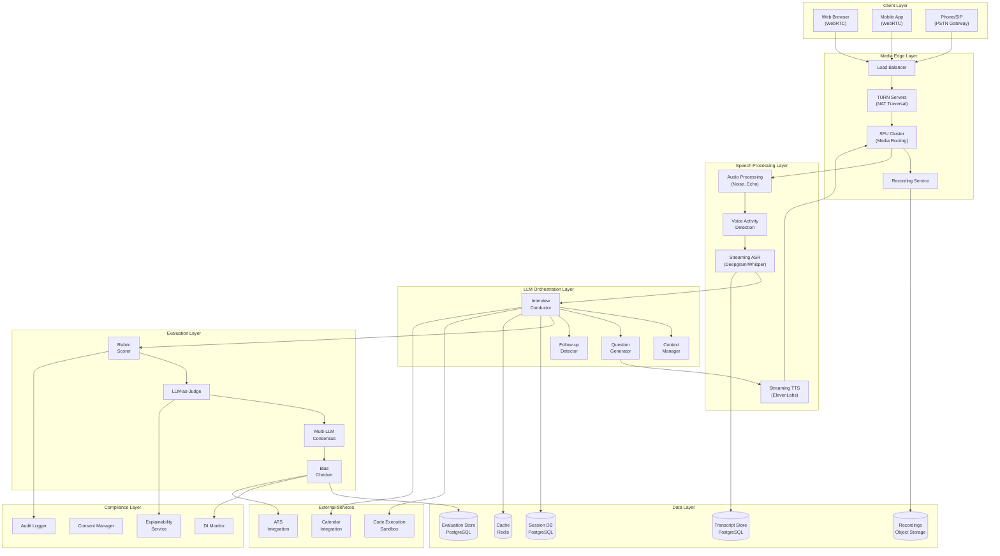
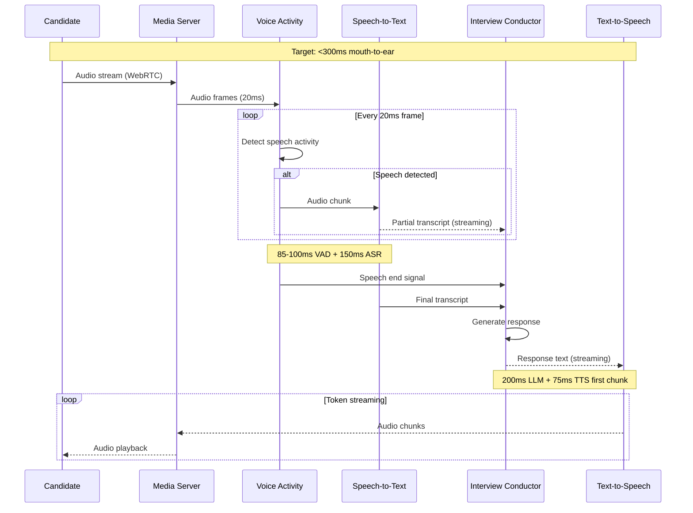
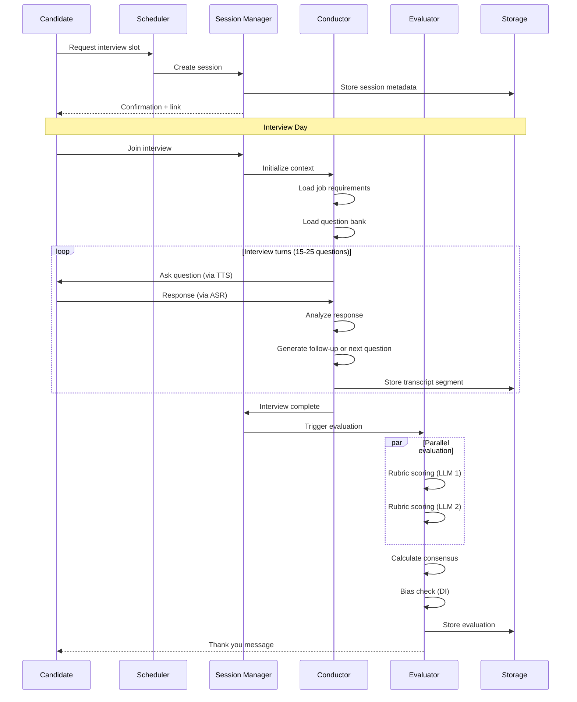
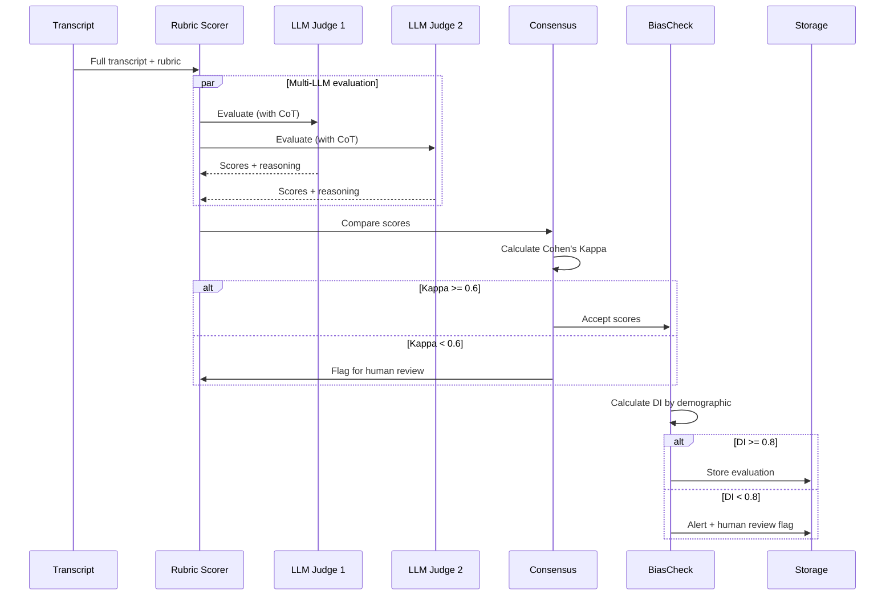
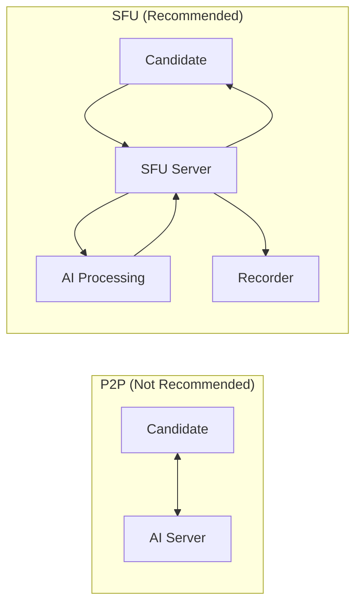
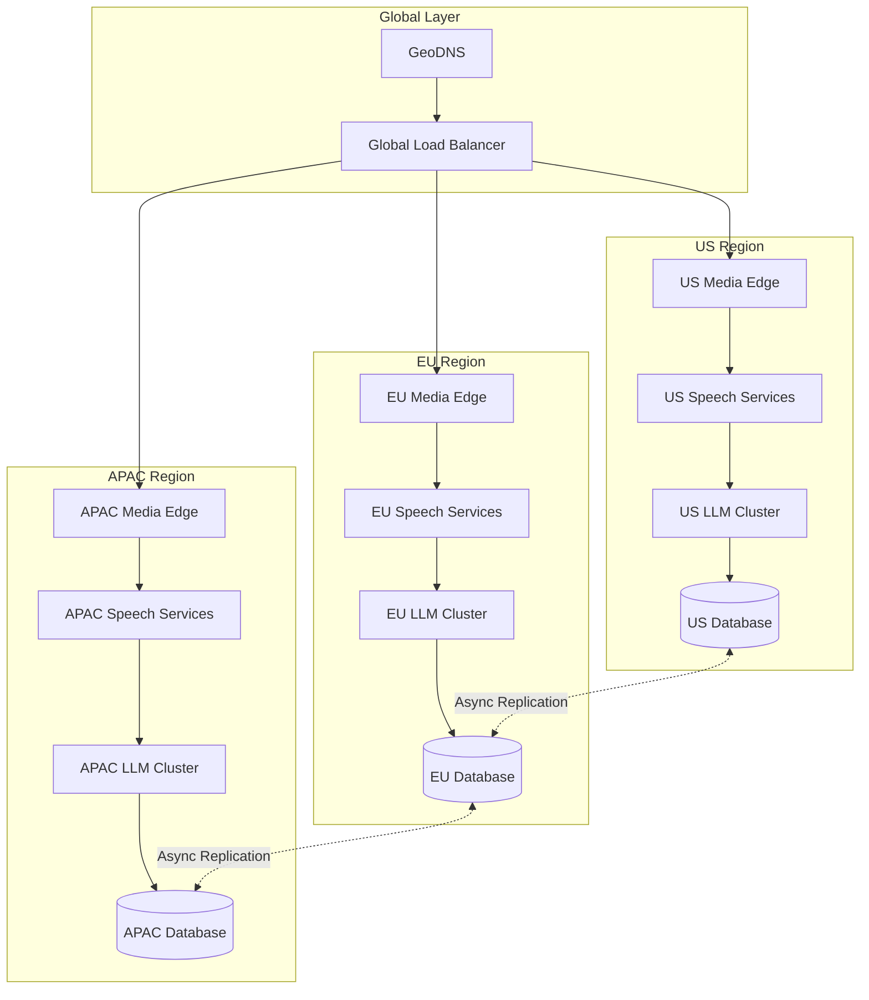
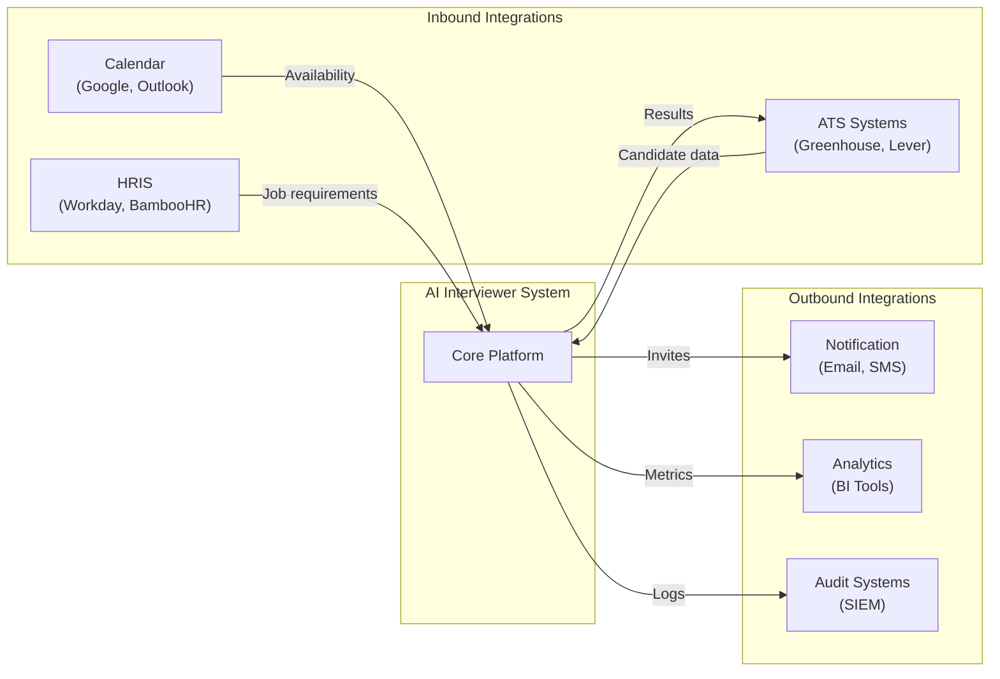

# High-Level Design

## System Architecture

---

## Data Flow Diagrams

### Real-Time Speech Flow

### Interview Session Lifecycle

### Evaluation Flow

---

## Key Architectural Decisions

### Decision 1: Cascaded Pipeline vs Native Speech-to-Speech

| Option | Cascaded (ASR → LLM → TTS) | Native (OpenAI Realtime API) |
|--------|---------------------------|------------------------------|
| **Latency** | ~800-1100ms (unoptimized), ~300ms (streaming) | ~300ms native |
| **Control** | Full control over each component | Black box |
| **Explainability** | Complete transcript + decision audit | Limited |
| **Vendor Lock-in** | Mix providers | Single vendor |
| **Cost** | Pay per component | Single pricing |
| **Customization** | Swap ASR/TTS providers | Limited |

**Recommendation:** **Cascaded for enterprise** - compliance requirements demand full audit trails and explainability. Native S2S for consumer-facing applications where latency is paramount.

### Decision 2: WebRTC Topology

| Option | P2P | SFU | MCU |
|--------|-----|-----|-----|
| **Latency** | Lowest | +20-50ms | +50-100ms |
| **Recording** | Complex (client-side) | Easy (server-side) | Easy |
| **Scalability** | 2 participants max | 20-30 participants | 50+ participants |
| **Server Load** | None | Forward only | Mix/transcode |
| **Use Case** | 1:1 interviews | Panel interviews | Large broadcasts |

**Recommendation:** **SFU for most cases** - server-side recording is essential for compliance, and latency overhead is acceptable. P2P only for simple 1:1 with client-side recording.

### Decision 3: ASR Provider Strategy

| Option | Self-Hosted (Whisper) | Cloud (Deepgram) | Hybrid |
|--------|----------------------|------------------|--------|
| **Latency** | 400-500ms | 150ms | Best of both |
| **Privacy** | Full control | Data transmitted | Selective |
| **Cost** | GPU infrastructure | Per-minute pricing | Variable |
| **Accuracy** | Good | Excellent | Excellent |
| **Scaling** | Manual | Auto | Mixed |

**Recommendation:** **Hybrid approach**
- Cloud (Deepgram) for standard interviews - better latency
- Self-hosted (Whisper) for sensitive industries (healthcare, finance)

### Decision 4: LLM Deployment

| Option | Cloud API | Self-Hosted | Hybrid |
|--------|-----------|-------------|--------|
| **Latency** | Variable (network) | Consistent | Optimized |
| **Privacy** | Data leaves infra | Full control | Selective |
| **Cost** | Pay per token | Infrastructure | Variable |
| **Scaling** | Unlimited | Capacity-bound | Mixed |

**Recommendation:** **Hybrid**
- Cloud API for question generation (less sensitive)
- Self-hosted for evaluation (candidate data stays internal)

---

## Architecture Pattern Checklist

| Pattern | Decision | Justification |
|---------|----------|---------------|
| Sync vs Async | Streaming (async chunks) | Real-time conversation requirement |
| Event-driven vs Request-response | Event-driven for speech | Non-blocking pipeline |
| Push vs Pull | Push (server → client) | AI initiates questions |
| Stateful vs Stateless | Stateful sessions | Interview context must persist |
| Read vs Write heavy | Write-heavy (transcripts) | Continuous recording |
| Real-time vs Batch | Real-time speech, batch evaluation | Hybrid based on use case |
| Edge vs Origin | Edge for media, origin for data | Latency optimization |

---

## Component Responsibilities

### Client Layer

| Component | Responsibility |
|-----------|----------------|
| Web Client | WebRTC media, UI rendering, local audio processing |
| Mobile Client | Native WebRTC, push notifications |
| PSTN Gateway | SIP/PSTN bridging for phone interviews |

### Media Edge Layer

| Component | Responsibility |
|-----------|----------------|
| Load Balancer | Route to nearest region, health checks |
| TURN Servers | NAT traversal, relay when P2P fails |
| SFU Cluster | Media routing, recording triggers |
| Recording Service | Capture, encode, store media streams |

### Speech Processing Layer

| Component | Responsibility |
|-----------|----------------|
| Voice Activity Detection | Detect speech boundaries, reduce false triggers |
| Streaming ASR | Convert speech to text in real-time |
| Streaming TTS | Convert text to speech with minimal latency |
| Audio Processing | Noise suppression, echo cancellation, AGC |

### LLM Orchestration Layer

| Component | Responsibility |
|-----------|----------------|
| Interview Conductor | Manage conversation flow, turn-taking |
| Context Manager | Maintain conversation history, job context |
| Question Generator | Generate relevant questions based on context |
| Follow-up Detector | Identify when follow-up questions are needed |

### Evaluation Layer

| Component | Responsibility |
|-----------|----------------|
| Rubric Scorer | Apply evaluation rubric to responses |
| LLM-as-Judge | Generate scores with chain-of-thought reasoning |
| Multi-LLM Consensus | Ensure inter-rater reliability |
| Bias Checker | Monitor disparate impact across demographics |

---

## Multi-Region Deployment

**Data Residency Considerations:**
- EU candidate data stays in EU region (GDPR)
- Recordings stored in candidate's region
- Evaluation results replicated globally for analytics

---

## Technology Stack Summary

| Layer | Primary Technology | Alternatives |
|-------|-------------------|--------------|
| Media Transport | WebRTC + LiveKit | Mediasoup, Janus |
| SFU | LiveKit | Mediasoup, Jitsi |
| TURN | Coturn | Twilio TURN |
| Speech Recognition | Deepgram Nova-3 | AssemblyAI, Whisper |
| Speech Synthesis | ElevenLabs Flash v2.5 | PlayHT, Azure TTS |
| Voice Activity | Silero VAD | WebRTC VAD |
| LLM Inference | OpenAI GPT-4 / Claude | Self-hosted Llama |
| Orchestration | Pipecat | LiveKit Agents, Vapi |
| Database | PostgreSQL | CockroachDB |
| Cache | Redis | Memcached |
| Message Queue | Kafka | RabbitMQ |
| Object Storage | S3-compatible | MinIO |
| Observability | Datadog / Grafana | New Relic |

---

## Integration Points

### External System Integrations

### API Gateway Design

| Endpoint Category | Auth Method | Rate Limit |
|------------------|-------------|------------|
| Public (scheduling) | API Key | 100/min |
| Candidate (interview) | JWT (short-lived) | 10/min |
| Admin (management) | OAuth 2.0 + MFA | 1000/min |
| Webhook (integrations) | HMAC signature | 500/min |
| Internal (services) | mTLS | Unlimited |
