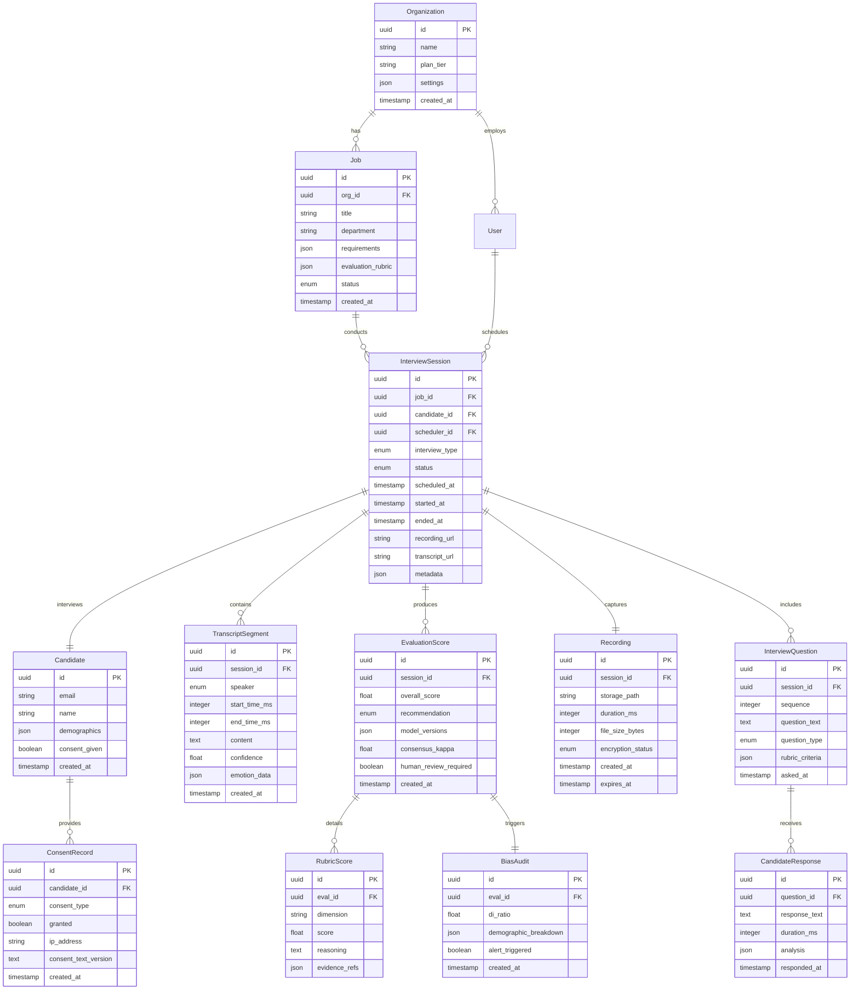

# Low-Level Design

## Data Model

### Entity Relationship Diagram



### Key Entity Specifications

#### InterviewSession

```
InterviewSession:
  id: UUID (primary key)
  job_id: UUID (foreign key -> Job)
  candidate_id: UUID (foreign key -> Candidate)
  scheduler_id: UUID (foreign key -> User)
  interview_type: ENUM(technical, behavioral, system_design, case_study)
  status: ENUM(scheduled, waiting, in_progress, paused, evaluating, completed, cancelled, no_show)
  scheduled_at: TIMESTAMP
  started_at: TIMESTAMP (nullable)
  ended_at: TIMESTAMP (nullable)
  recording_url: VARCHAR(500) (nullable, encrypted path)
  transcript_url: VARCHAR(500) (nullable)
  metadata: JSONB {
    browser_info: string,
    network_quality: string,
    interruption_count: integer,
    total_questions: integer,
    avg_response_time_ms: integer
  }
  created_at: TIMESTAMP
  updated_at: TIMESTAMP

Indexes:
  - (job_id, status) - Filter sessions by job
  - (candidate_id) - Candidate history
  - (scheduled_at) - Scheduling queries
  - (status, scheduled_at) - Active session monitoring
```

#### TranscriptSegment

```
TranscriptSegment:
  id: UUID (primary key)
  session_id: UUID (foreign key -> InterviewSession)
  speaker: ENUM(interviewer, candidate)
  start_time_ms: INTEGER (milliseconds from session start)
  end_time_ms: INTEGER
  content: TEXT (transcribed text)
  confidence: FLOAT (0.0 - 1.0, ASR confidence)
  emotion_data: JSONB (nullable, pre-Aug-2026 only) {
    detected_emotion: string,
    confidence: float,
    valence: float,
    arousal: float
  }
  created_at: TIMESTAMP

Indexes:
  - (session_id, start_time_ms) - Timeline reconstruction
  - (session_id, speaker) - Filter by speaker

Partitioning:
  - By session_id hash for write distribution
```

#### EvaluationScore

```
EvaluationScore:
  id: UUID (primary key)
  session_id: UUID (foreign key -> InterviewSession, unique)
  overall_score: FLOAT (0.0 - 100.0)
  recommendation: ENUM(strong_yes, yes, neutral, no, strong_no)
  model_versions: JSONB {
    primary_llm: string,
    secondary_llm: string,
    rubric_version: string
  }
  consensus_kappa: FLOAT (Cohen's Kappa, -1.0 to 1.0)
  human_review_required: BOOLEAN
  human_reviewer_id: UUID (nullable)
  human_review_completed_at: TIMESTAMP (nullable)
  created_at: TIMESTAMP
  updated_at: TIMESTAMP

Indexes:
  - (session_id) UNIQUE - One evaluation per session
  - (human_review_required, created_at) - Review queue
  - (recommendation) - Aggregate statistics
```

---

## API Design

### REST APIs (Interview Management)

#### Schedule Interview

```
POST /api/v1/interviews

Request:
{
  "job_id": "uuid",
  "candidate_email": "candidate@example.com",
  "candidate_name": "Jane Doe",
  "interview_type": "technical",
  "scheduled_at": "2025-01-24T14:00:00Z",
  "duration_minutes": 30,
  "timezone": "America/New_York"
}

Response (201 Created):
{
  "id": "uuid",
  "status": "scheduled",
  "join_url": "https://interview.example.com/join/abc123",
  "candidate_email": "candidate@example.com",
  "scheduled_at": "2025-01-24T14:00:00Z",
  "expires_at": "2025-01-24T14:30:00Z"
}

Idempotency: X-Idempotency-Key header required
Rate Limit: 100 requests/minute per organization
```

#### Get Interview Details

```
GET /api/v1/interviews/{interview_id}

Response (200 OK):
{
  "id": "uuid",
  "job": {
    "id": "uuid",
    "title": "Senior Software Engineer"
  },
  "candidate": {
    "name": "Jane Doe",
    "email": "candidate@example.com"
  },
  "interview_type": "technical",
  "status": "completed",
  "scheduled_at": "2025-01-24T14:00:00Z",
  "started_at": "2025-01-24T14:02:15Z",
  "ended_at": "2025-01-24T14:28:42Z",
  "duration_ms": 1587000,
  "recording_available": true,
  "transcript_available": true,
  "evaluation": {
    "overall_score": 78.5,
    "recommendation": "yes",
    "consensus_kappa": 0.72
  }
}
```

#### Get Transcript

```
GET /api/v1/interviews/{interview_id}/transcript

Query Parameters:
  - format: json | vtt | srt (default: json)
  - speaker: all | interviewer | candidate

Response (200 OK):
{
  "interview_id": "uuid",
  "duration_ms": 1587000,
  "segments": [
    {
      "id": "uuid",
      "speaker": "interviewer",
      "start_time_ms": 0,
      "end_time_ms": 5200,
      "content": "Hello Jane, thank you for joining us today.",
      "confidence": 0.98
    },
    {
      "id": "uuid",
      "speaker": "candidate",
      "start_time_ms": 5500,
      "end_time_ms": 12300,
      "content": "Thank you for having me. I'm excited to be here.",
      "confidence": 0.95
    }
  ]
}
```

#### Get Evaluation

```
GET /api/v1/interviews/{interview_id}/evaluation

Response (200 OK):
{
  "interview_id": "uuid",
  "overall_score": 78.5,
  "recommendation": "yes",
  "dimensions": [
    {
      "name": "technical_skills",
      "score": 82.0,
      "weight": 0.4,
      "reasoning": "Demonstrated strong understanding of data structures...",
      "evidence": ["segment-uuid-1", "segment-uuid-3"]
    },
    {
      "name": "problem_solving",
      "score": 75.0,
      "weight": 0.3,
      "reasoning": "Methodical approach to breaking down problems...",
      "evidence": ["segment-uuid-5", "segment-uuid-8"]
    },
    {
      "name": "communication",
      "score": 80.0,
      "weight": 0.2,
      "reasoning": "Clear and concise explanations...",
      "evidence": ["segment-uuid-2", "segment-uuid-6"]
    },
    {
      "name": "culture_fit",
      "score": 72.0,
      "weight": 0.1,
      "reasoning": "Values align with company culture...",
      "evidence": ["segment-uuid-9"]
    }
  ],
  "consensus": {
    "kappa": 0.72,
    "models_agreed": true
  },
  "bias_check": {
    "di_ratio": 0.87,
    "passed": true
  },
  "human_review_required": false
}
```

### WebSocket APIs (Real-Time Session)

#### Interview Session Connection

```
WS /api/v1/interviews/{interview_id}/session

Authentication: JWT token in query parameter or first message

Client -> Server Messages:
{
  "type": "audio_chunk",
  "data": "<base64 encoded audio>",
  "timestamp_ms": 12345,
  "sequence": 100
}

{
  "type": "control",
  "action": "pause" | "resume" | "end",
  "reason": "technical_issue"
}

Server -> Client Messages:
{
  "type": "transcript_partial",
  "speaker": "candidate",
  "text": "I think the best approach would be...",
  "is_final": false,
  "timestamp_ms": 12345
}

{
  "type": "ai_response",
  "text": "That's interesting. Can you elaborate on...",
  "audio_url": "wss://audio.example.com/stream/abc123",
  "timestamp_ms": 15000
}

{
  "type": "session_state",
  "status": "in_progress",
  "current_question": 5,
  "total_questions": 15,
  "elapsed_ms": 600000
}

{
  "type": "error",
  "code": "ASR_TIMEOUT",
  "message": "Speech recognition temporarily unavailable",
  "recoverable": true
}
```

### gRPC APIs (Internal Services)

#### ASR Service

```protobuf
service ASRService {
  // Streaming transcription
  rpc Transcribe(stream AudioChunk) returns (stream TranscriptChunk);

  // Get final transcript for segment
  rpc GetFinalTranscript(SegmentRequest) returns (Transcript);
}

message AudioChunk {
  bytes audio_data = 1;  // Opus encoded
  int64 timestamp_ms = 2;
  string session_id = 3;
  int32 sequence = 4;
}

message TranscriptChunk {
  string text = 1;
  bool is_final = 2;
  float confidence = 3;
  int64 start_time_ms = 4;
  int64 end_time_ms = 5;
}
```

#### TTS Service

```protobuf
service TTSService {
  // Streaming synthesis
  rpc Synthesize(stream TextChunk) returns (stream AudioChunk);

  // Pre-generate common phrases
  rpc Pregenerate(PregenerateRequest) returns (PregenerateResponse);
}

message TextChunk {
  string text = 1;
  string voice_id = 2;
  string session_id = 3;
  bool is_final = 4;
}

message AudioChunk {
  bytes audio_data = 1;  // Opus encoded
  int64 timestamp_ms = 2;
  int32 sequence = 3;
}
```

#### Evaluation Service

```protobuf
service EvaluationService {
  // Async evaluation request
  rpc Evaluate(EvaluationRequest) returns (EvaluationResponse);

  // Stream evaluation progress
  rpc EvaluateStream(EvaluationRequest) returns (stream EvaluationProgress);
}

message EvaluationRequest {
  string session_id = 1;
  repeated TranscriptSegment segments = 2;
  EvaluationRubric rubric = 3;
  EvaluationConfig config = 4;
}

message EvaluationResponse {
  string evaluation_id = 1;
  float overall_score = 2;
  Recommendation recommendation = 3;
  repeated DimensionScore dimensions = 4;
  ConsensusResult consensus = 5;
  BiasCheckResult bias_check = 6;
}
```

---

## Core Algorithms

### Voice Activity Detection (VAD)

```
ALGORITHM SileroVAD(audio_stream, config):
    INPUT:
        audio_stream: Continuous audio frames (20ms each)
        config: {
            threshold: 0.5,           // Speech probability threshold
            min_speech_duration: 250,  // ms before confirming speech
            min_silence_duration: 500, // ms before ending speech
            padding_duration: 100      // ms padding around speech
        }
    OUTPUT:
        Events: speech_start, speech_end

    INITIALIZE:
        speech_active = FALSE
        speech_start_time = NULL
        silence_start_time = NULL
        buffer = []

    FOR EACH audio_frame IN audio_stream:
        // Run neural network inference
        speech_probability = model.forward(audio_frame)

        IF speech_probability > config.threshold:
            IF NOT speech_active:
                IF speech_start_time IS NULL:
                    speech_start_time = current_time
                ELSE IF (current_time - speech_start_time) >= config.min_speech_duration:
                    speech_active = TRUE
                    EMIT speech_start(time: speech_start_time - config.padding_duration)
            silence_start_time = NULL

        ELSE:  // Silence detected
            IF speech_active:
                IF silence_start_time IS NULL:
                    silence_start_time = current_time
                ELSE IF (current_time - silence_start_time) >= config.min_silence_duration:
                    speech_active = FALSE
                    EMIT speech_end(time: silence_start_time + config.padding_duration)
                    speech_start_time = NULL
                    silence_start_time = NULL
            ELSE:
                speech_start_time = NULL

    // Handle stream end
    IF speech_active:
        EMIT speech_end(time: current_time)

COMPLEXITY:
    Time: O(n) where n = number of audio frames
    Space: O(1) for state, O(model_size) for neural network
    Latency: 85-100ms for detection confirmation
```

### Turn-Taking with Barge-In

```
ALGORITHM TurnManager(vad_events, asr_events, tts_state):
    INPUT:
        vad_events: Speech start/end events
        asr_events: Transcript updates
        tts_state: Current AI speech state
    OUTPUT:
        Turn control signals

    INITIALIZE:
        current_turn = NULL  // "candidate" | "interviewer" | NULL
        pending_response = NULL
        barge_in_enabled = FALSE
        context_buffer = []

    ON vad_event(speech_start):
        IF current_turn == "interviewer" AND barge_in_enabled:
            // Candidate interrupted AI
            EMIT tts_stop()
            LOG barge_in_event(timestamp: now)
            current_turn = "candidate"
            context_buffer.append({type: "interruption", time: now})

        ELSE IF current_turn IS NULL:
            current_turn = "candidate"
            EMIT start_listening()

    ON vad_event(speech_end):
        IF current_turn == "candidate":
            // Wait for brief pause to confirm turn end
            SCHEDULE check_turn_end(delay: 200ms)

    FUNCTION check_turn_end():
        IF no_new_speech_in(200ms):
            // Get final transcript
            final_transcript = ASR.get_final()
            context_buffer.append({
                speaker: "candidate",
                text: final_transcript,
                time: now
            })

            // Generate AI response
            current_turn = "interviewer"
            response = LLM.generate(context_buffer)
            EMIT start_speaking(response)
            barge_in_enabled = TRUE

    ON tts_complete():
        current_turn = NULL
        barge_in_enabled = FALSE
        context_buffer.append({
            speaker: "interviewer",
            text: response.text,
            time: now
        })

    ON asr_event(partial_transcript):
        // Update UI with real-time transcript
        EMIT transcript_update(partial_transcript)

        // Check for keywords that might indicate turn-taking intent
        IF contains_turn_signal(partial_transcript):
            // Candidate might be trying to speak
            PREPARE for_possible_barge_in()

COMPLEXITY:
    Time: O(1) per event
    Space: O(context_size) for conversation buffer
```

### LLM-as-Judge Rubric Scoring

```
ALGORITHM RubricScore(transcript, rubric, config):
    INPUT:
        transcript: Array of conversation segments
        rubric: {
            dimensions: [
                {name: "technical_skills", weight: 0.4, criteria: [...]},
                {name: "problem_solving", weight: 0.3, criteria: [...]},
                {name: "communication", weight: 0.2, criteria: [...]},
                {name: "culture_fit", weight: 0.1, criteria: [...]}
            ]
        }
        config: {
            primary_model: "gpt-4",
            secondary_model: "claude-3",
            consensus_threshold: 0.6,
            temperature: 0.1
        }
    OUTPUT:
        EvaluationResult with scores and reasoning

    FUNCTION evaluate_with_model(model, dimension):
        prompt = FORMAT_EVALUATION_PROMPT(
            transcript,
            dimension.name,
            dimension.criteria,
            scoring_instructions
        )

        response = model.generate(
            prompt,
            temperature: config.temperature,
            response_format: {
                score: integer(0-100),
                reasoning: string,
                evidence: array[segment_ids],
                confidence: float(0-1)
            }
        )

        RETURN {
            dimension: dimension.name,
            score: response.score,
            reasoning: response.reasoning,
            evidence: response.evidence,
            confidence: response.confidence,
            model: model.name
        }

    // Primary evaluation with all dimensions
    primary_scores = []
    FOR dimension IN rubric.dimensions:
        score = evaluate_with_model(config.primary_model, dimension)
        primary_scores.append(score)

    // Secondary evaluation for consensus
    secondary_scores = []
    FOR dimension IN rubric.dimensions:
        score = evaluate_with_model(config.secondary_model, dimension)
        secondary_scores.append(score)

    // Calculate inter-rater reliability
    kappa = calculate_cohens_kappa(primary_scores, secondary_scores)

    // Determine if consensus is reached
    IF kappa >= config.consensus_threshold:
        // Use average of both models
        final_scores = average_scores(primary_scores, secondary_scores)
        human_review = FALSE
    ELSE:
        // Flag for human review, use primary as provisional
        final_scores = primary_scores
        human_review = TRUE
        LOG consensus_failure(kappa, primary_scores, secondary_scores)

    // Calculate overall score
    overall = 0
    FOR i, dimension IN enumerate(rubric.dimensions):
        overall += final_scores[i].score * dimension.weight

    RETURN {
        overall_score: overall,
        dimension_scores: final_scores,
        consensus_kappa: kappa,
        human_review_required: human_review,
        recommendation: map_score_to_recommendation(overall)
    }

FUNCTION calculate_cohens_kappa(scores_a, scores_b):
    // Convert scores to ordinal categories for kappa
    categories = ["poor", "below_avg", "avg", "above_avg", "excellent"]

    observed_agreement = 0
    total = len(scores_a)

    FOR i IN range(total):
        cat_a = categorize(scores_a[i].score)
        cat_b = categorize(scores_b[i].score)
        IF cat_a == cat_b:
            observed_agreement += 1

    po = observed_agreement / total
    pe = calculate_expected_agreement(scores_a, scores_b, categories)

    kappa = (po - pe) / (1 - pe)
    RETURN kappa

FUNCTION map_score_to_recommendation(score):
    IF score >= 85: RETURN "strong_yes"
    IF score >= 70: RETURN "yes"
    IF score >= 55: RETURN "neutral"
    IF score >= 40: RETURN "no"
    RETURN "strong_no"

COMPLEXITY:
    Time: O(d * t) where d = dimensions, t = transcript tokens (LLM inference)
    Space: O(t) for prompt construction
    Latency: 10-30 seconds for full evaluation (async, post-interview)
```

### Real-Time Bias Monitoring

```
ALGORITHM BiasMonitor(evaluation, demographics, config):
    INPUT:
        evaluation: Latest evaluation result
        demographics: {gender, ethnicity, age_group, ...} (anonymized)
        config: {
            window_days: 30,
            di_threshold: 0.8,
            alert_threshold: 0.85,
            min_sample_size: 30
        }
    OUTPUT:
        BiasCheckResult

    // Fetch recent evaluations within window
    recent_evals = query_evaluations(
        job_id: evaluation.job_id,
        since: now - config.window_days
    )

    // Add current evaluation
    recent_evals.append(evaluation)

    // Check sample size
    IF len(recent_evals) < config.min_sample_size:
        RETURN {
            status: "insufficient_data",
            sample_size: len(recent_evals),
            di_ratio: NULL
        }

    // Calculate pass rates by demographic group
    results = {}
    FOR protected_class IN ["gender", "ethnicity", "age_group"]:
        groups = group_by(recent_evals, demographics, protected_class)

        pass_rates = {}
        FOR group_name, group_evals IN groups:
            IF len(group_evals) >= 5:  // Minimum for statistical validity
                passes = count(e.recommendation IN ["yes", "strong_yes"] FOR e IN group_evals)
                pass_rates[group_name] = passes / len(group_evals)

        IF len(pass_rates) >= 2:
            // Calculate Disparate Impact ratio
            min_rate = min(pass_rates.values())
            max_rate = max(pass_rates.values())

            IF max_rate > 0:
                di_ratio = min_rate / max_rate
            ELSE:
                di_ratio = 1.0  // No passes in any group

            results[protected_class] = {
                di_ratio: di_ratio,
                pass_rates: pass_rates,
                compliant: di_ratio >= config.di_threshold
            }

            // Alert logic
            IF di_ratio < config.alert_threshold:
                EMIT alert(
                    severity: "warning" IF di_ratio >= config.di_threshold ELSE "critical",
                    protected_class: protected_class,
                    di_ratio: di_ratio,
                    recommendation: "Review evaluation rubric and model behavior"
                )

    // Overall compliance check
    all_compliant = all(r.compliant FOR r IN results.values())

    RETURN {
        status: "compliant" IF all_compliant ELSE "non_compliant",
        di_results: results,
        sample_size: len(recent_evals),
        window_days: config.window_days,
        alert_triggered: NOT all_compliant
    }

COMPLEXITY:
    Time: O(n * c) where n = evaluations, c = protected classes
    Space: O(n) for storing grouped evaluations
```

---

## State Machines

### Interview Session State Machine


### Speech Turn State Machine


---

## Caching Strategy

| Data Type | Cache Layer | TTL | Strategy |
|-----------|-------------|-----|----------|
| Question bank | Redis | 1 hour | Warm on session start |
| Job requirements | Redis | 15 min | Invalidate on update |
| Candidate profile | Redis | 5 min | Session-scoped |
| Conversation context | Memory | Session duration | Local to conductor |
| TTS phrases (common) | CDN | 24 hours | Pre-generated |
| Rubric templates | Redis | 1 hour | Per-job caching |

**No Caching:**
- Real-time audio streams
- Transcripts (written directly to DB)
- Evaluation scores (must be durable)

---

## Indexing Strategy

### PostgreSQL Indexes

```sql
-- InterviewSession: Scheduling and filtering
CREATE INDEX idx_session_job_status ON interview_session(job_id, status);
CREATE INDEX idx_session_scheduled ON interview_session(scheduled_at) WHERE status = 'scheduled';
CREATE INDEX idx_session_candidate ON interview_session(candidate_id);

-- TranscriptSegment: Timeline reconstruction
CREATE INDEX idx_transcript_session_time ON transcript_segment(session_id, start_time_ms);

-- EvaluationScore: Review queue and analytics
CREATE INDEX idx_eval_review_queue ON evaluation_score(human_review_required, created_at)
    WHERE human_review_required = TRUE;
CREATE INDEX idx_eval_recommendation ON evaluation_score(recommendation);

-- BiasAudit: Compliance queries
CREATE INDEX idx_bias_alert ON bias_audit(alert_triggered, created_at)
    WHERE alert_triggered = TRUE;
```

### Partitioning Strategy

```sql
-- Transcript segments: Partition by session for write distribution
CREATE TABLE transcript_segment (
    id UUID PRIMARY KEY,
    session_id UUID NOT NULL,
    ...
) PARTITION BY HASH(session_id);

CREATE TABLE transcript_segment_p0 PARTITION OF transcript_segment FOR VALUES WITH (MODULUS 8, REMAINDER 0);
CREATE TABLE transcript_segment_p1 PARTITION OF transcript_segment FOR VALUES WITH (MODULUS 8, REMAINDER 1);
-- ... p2 through p7

-- Recordings: Partition by time for retention management
CREATE TABLE recording (
    id UUID,
    session_id UUID,
    created_at TIMESTAMP,
    ...
) PARTITION BY RANGE(created_at);

CREATE TABLE recording_2025_q1 PARTITION OF recording
    FOR VALUES FROM ('2025-01-01') TO ('2025-04-01');
```
