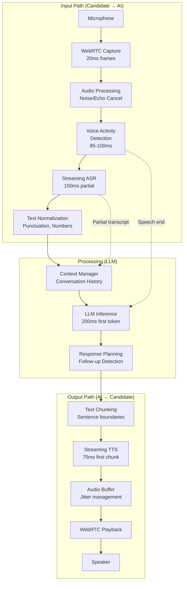
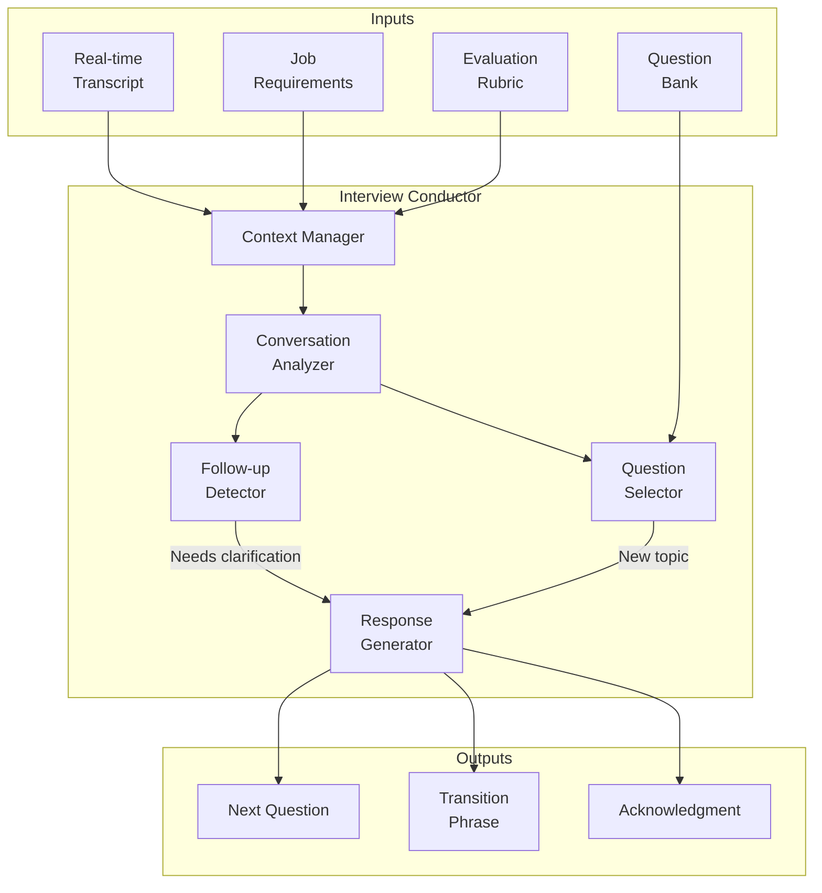
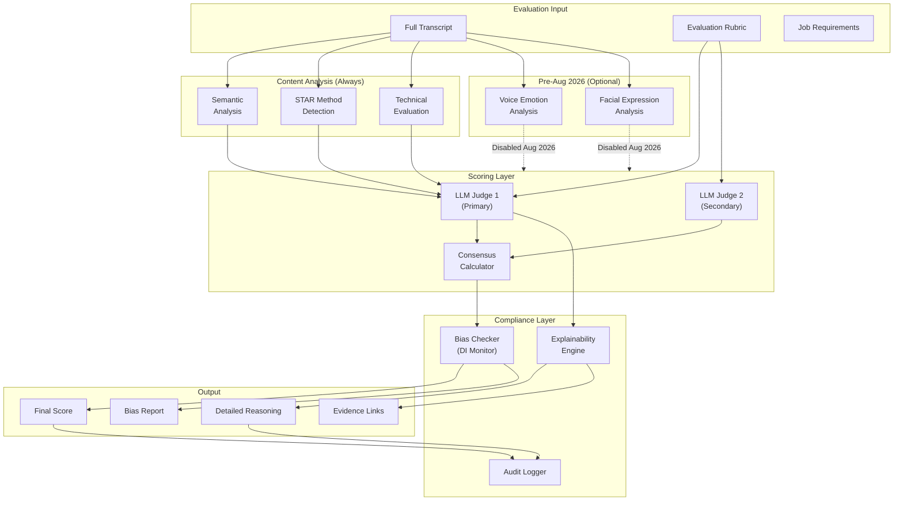

# Deep Dive & Bottlenecks

## Deep Dive 1: Real-Time Speech Pipeline

### Why This Is Critical

The speech pipeline is the **defining technical challenge** of an AI interviewer system. Unlike traditional web applications where latency is a quality-of-life issue, here it determines whether the system works at all:

- **Sub-300ms mouth-to-ear latency** is required for natural conversation
- Above 500ms, conversations feel robotic and unnatural
- Above 1.5 seconds, conversation flow breaks down completely
- Pipeline failure during an interview = complete interview failure (cannot restart)

### Architecture



### Internal Workings

#### Voice Activity Detection (VAD)

**Purpose:** Detect when the candidate starts/stops speaking to trigger ASR and manage turn-taking.

| Aspect | Silero VAD | WebRTC VAD | Comparison |
|--------|-----------|------------|------------|
| Detection latency | 85-100ms | 50-70ms | WebRTC faster but less accurate |
| False positive rate | <5% | 10-15% | Silero more reliable |
| Noise robustness | High | Medium | Silero handles background noise better |
| Resource usage | ~10ms CPU/frame | ~2ms CPU/frame | WebRTC lighter |

**Recommendation:** Silero VAD for accuracy, with WebRTC VAD as fast pre-filter.

**Key Parameters:**
```
speech_threshold: 0.5     // Probability above which speech is detected
min_speech_duration: 250ms // Prevents short noise bursts triggering
min_silence_duration: 500ms // Determines turn end
padding: 100ms             // Captures speech edges
```

#### Streaming ASR

**Why Streaming Matters:**
- Batch ASR waits for complete audio → 3-5 second delay
- Streaming ASR emits partial results every 100-200ms
- LLM can begin processing before speech ends

**Partial vs Final Results:**
```
Time (ms)   Partial Result                    Final Result
0-200       "I think"                         -
200-400     "I think the best"                -
400-600     "I think the best approach"       -
600-800     "I think the best approach would" -
800-1000    [speech end detected]             "I think the best approach would be to use a hash table."
```

**Provider Comparison:**

| Provider | Latency (p50) | WER | Streaming | Cost/min |
|----------|---------------|-----|-----------|----------|
| Deepgram Nova-3 | 150ms | 8.4% | Native | $0.0043 |
| AssemblyAI | 300ms | 8.7% | Native | $0.0050 |
| Whisper (self-hosted) | 400-500ms | 9.1% | Requires work | GPU cost |
| Google Cloud | 200ms | 9.5% | Native | $0.0060 |

#### Streaming TTS

**Why First-Chunk Latency Matters:**
- Users perceive responsiveness from first audio, not complete synthesis
- ElevenLabs Flash: 75ms to first chunk
- Full sentence synthesis: 300-500ms

**Streaming Strategy:**
```
LLM Output: "That's a great question. The answer involves..."

Chunk 1: "That's a great question." → TTS → Play (75ms)
[While chunk 1 plays, chunk 2 synthesizes]
Chunk 2: "The answer involves..." → TTS → Seamless playback
```

### Latency Optimization Techniques

| Technique | Latency Reduction | Implementation |
|-----------|-------------------|----------------|
| Streaming ASR (partial results) | -200-300ms | Enable partial_results flag |
| Pre-warmed TTS voices | -50ms | Load voice model on session start |
| Edge deployment | -50-100ms | Deploy ASR/TTS near users |
| Speculative LLM generation | -100-200ms | Start generation on partial transcript |
| Token streaming to TTS | -150ms | Pipe LLM tokens directly to TTS |
| Connection pre-warming | -100ms | Establish WebSocket on page load |
| Audio frame batching | +20ms (tradeoff) | Larger frames = fewer network calls |

### Latency Waterfall (Optimized vs Unoptimized)

```mermaid
gantt
    title Speech Pipeline Latency Comparison
    dateFormat X
    axisFormat %L ms

    section Unoptimized
    Audio Capture    :0, 40
    VAD Detection    :40, 100
    Batch ASR        :140, 500
    LLM (full)       :640, 800
    TTS (full)       :1440, 400
    Playback         :1840, 50

    section Optimized (Streaming)
    Audio Capture    :0, 40
    VAD Detection    :40, 85
    Streaming ASR    :125, 150
    LLM (first token):275, 200
    TTS (first chunk):475, 75
    Playback         :550, 25
```



**Result:** 1890ms → 575ms (67% reduction)

### Failure Modes & Recovery

| Failure | Detection | Impact | Recovery Strategy |
|---------|-----------|--------|-------------------|
| ASR timeout | No transcript in 3s | Interview stalls | Retry with fallback provider |
| ASR accuracy drop | WER spike >15% | Misunderstood responses | Alert, consider human review |
| TTS failure | Synthesis error | AI cannot speak | Display text on screen |
| Network jitter | Packet loss >5% | Audio choppy | Adaptive bitrate, FEC |
| VAD false positive | Detects noise as speech | Interrupts AI incorrectly | Tune threshold, add context filter |
| LLM timeout | No tokens in 5s | Long pause | Use cached question, apologize |

**Graceful Degradation:**
```
Level 1: Full streaming pipeline (optimal)
Level 2: Batch ASR + streaming TTS (slower but functional)
Level 3: Text-only interview (no speech synthesis)
Level 4: Predefined questions only (no LLM)
Level 5: Reschedule interview
```

---

## Deep Dive 2: LLM Interview Conductor

### Why This Is Critical

The Interview Conductor is the "brain" of the system:
- Generates contextually appropriate questions
- Maintains conversation coherence across 20+ turns
- Adapts based on candidate responses
- Decides when to probe deeper vs move on

Poor conductor design results in:
- Repetitive questions
- Lack of follow-up on interesting answers
- Off-topic tangents
- Missed opportunities to assess key competencies

### Architecture



### Context Management

**Challenge:** LLM context windows are limited (4K-128K tokens), but interviews generate 5-10K words.

**Strategy: Rolling Context with Summarization**

```
Context Window Structure (8K tokens):

[System Prompt - 500 tokens]
- Role: AI Technical Interviewer
- Interview type: {technical}
- Company: {company_name}
- Position: {job_title}
- Instructions: Be professional, ask follow-ups, stay on topic

[Job Requirements - 500 tokens]
- Required skills: [list]
- Nice-to-have skills: [list]
- Key competencies to assess: [list]

[Evaluation Rubric Summary - 300 tokens]
- Technical: Data structures, algorithms, system design
- Problem-solving: Approach, trade-offs, edge cases
- Communication: Clarity, structure, listening

[Conversation Summary - 1000 tokens]
- Questions asked so far: [list with brief answers]
- Competencies covered: [list with preliminary assessment]
- Topics to explore further: [list]

[Recent Conversation - 3000 tokens]
- Last 5-8 turns verbatim
- Includes partial current response

[Questions Remaining - 200 tokens]
- Must-ask questions not yet covered
- Time remaining

[Generation Instructions - 500 tokens]
- Generate next question or follow-up
- Format requirements
```

**Summarization Triggers:**
- Context reaches 80% capacity
- Every 5 questions
- On topic change

### Question Generation

**Question Types:**

| Type | When to Use | Example |
|------|-------------|---------|
| Opener | Start of interview | "Tell me about yourself and why you're interested in this role." |
| Technical probe | Assess specific skill | "How would you design a rate limiter?" |
| Follow-up | Shallow answer detected | "Can you elaborate on the trade-offs you mentioned?" |
| Behavioral (STAR) | Assess soft skills | "Tell me about a time you had to disagree with a colleague." |
| Clarification | Ambiguous response | "When you say 'scalable,' what scale are you targeting?" |
| Transition | Topic change | "Great, let's move on to discuss your experience with distributed systems." |

**Follow-up Detection Logic:**

```
FUNCTION should_follow_up(response, rubric_criteria):
    signals = []

    // Check for vague language
    vague_phrases = ["kind of", "sort of", "maybe", "I think", "probably"]
    IF count_phrases(response, vague_phrases) > 2:
        signals.append("vague_language")

    // Check for missing STAR components (behavioral)
    IF question.type == "behavioral":
        IF NOT contains_situation(response):
            signals.append("missing_situation")
        IF NOT contains_action(response):
            signals.append("missing_action")
        IF NOT contains_result(response):
            signals.append("missing_result")

    // Check for technical depth (technical)
    IF question.type == "technical":
        IF NOT mentions_complexity(response):
            signals.append("missing_complexity")
        IF NOT mentions_tradeoffs(response):
            signals.append("missing_tradeoffs")

    // Check response length
    IF word_count(response) < 50 AND expected_depth(question) == "deep":
        signals.append("too_brief")

    IF len(signals) > 0:
        RETURN {
            follow_up: TRUE,
            reasons: signals,
            suggested_probe: generate_probe(signals)
        }

    RETURN {follow_up: FALSE}
```

### Prompt Engineering Structure

```
SYSTEM:
You are an AI interviewer for {company_name}, conducting a {interview_type} interview
for the {job_title} position.

GUIDELINES:
- Be professional but warm
- Ask one question at a time
- Follow up on interesting or unclear answers
- Don't repeat questions already asked
- Acknowledge good answers briefly before moving on
- Stay on topic; gently redirect if candidate goes off-track
- Never reveal evaluation criteria or rubric

CONSTRAINTS:
- Maximum 2 follow-ups per topic before moving on
- Cover all required competencies within time limit
- Don't ask leading questions
- Don't provide hints or answers

CURRENT STATE:
- Time elapsed: {elapsed_minutes} / {total_minutes} minutes
- Questions asked: {questions_count}
- Competencies covered: {covered_list}
- Competencies remaining: {remaining_list}

RECENT CONVERSATION:
{last_5_turns}

CANDIDATE'S LAST RESPONSE:
{current_response}

TASK:
Generate the next interviewer action. Choose one:
1. FOLLOW_UP: If response needs clarification or depth
2. NEW_QUESTION: If response was complete, move to next topic
3. TRANSITION: If changing major topics
4. CLOSING: If interview time is ending

OUTPUT FORMAT:
{
  "action": "FOLLOW_UP" | "NEW_QUESTION" | "TRANSITION" | "CLOSING",
  "text": "Your question or statement",
  "reasoning": "Brief explanation of why this action"
}
```

### Failure Modes

| Failure | Detection | Recovery |
|---------|-----------|----------|
| Repetitive questions | Question tracking | Skip to unused questions |
| Off-topic tangent | Topic drift detection | Gentle redirect prompt |
| LLM hallucination | Factual inconsistency | Use only question bank |
| Context overflow | Token count monitoring | Aggressive summarization |
| Inappropriate question | Content filter | Block + log + use backup |
| Candidate confusion | Repeated clarification requests | Rephrase or skip |

---

## Deep Dive 3: Multi-Modal Evaluation Engine

### Why This Is Critical

The evaluation engine must:
- Provide **fair**, **consistent** scores across all candidates
- Generate **explainable** decisions (required by law in many jurisdictions)
- Detect and flag **potential bias** before it affects hiring decisions
- Navigate **evolving regulations** (EU AI Act Aug 2026)

### Architecture



### Evaluation Dimensions

| Dimension | Method | Pre-Aug 2026 | Post-Aug 2026 |
|-----------|--------|--------------|---------------|
| Technical Skills | Code analysis, LLM evaluation | Yes | Yes |
| Problem Solving | Reasoning chain analysis | Yes | Yes |
| Communication | Transcript clarity analysis | Yes | Yes |
| STAR Completeness | Behavioral pattern detection | Yes | Yes |
| Voice Confidence | Prosody analysis | Yes | **PROHIBITED** |
| Facial Engagement | Expression analysis | Yes | **PROHIBITED** |
| Cultural Fit | Value alignment (from content) | Yes | Yes (content only) |

**EU AI Act Compliance Architecture:**

```
CONFIGURATION:
  evaluation_modes:
    - name: "full"
      description: "All modalities including emotion"
      jurisdictions: ["US", "APAC"]
      enabled: true

    - name: "content_only"
      description: "Content analysis only, no emotion"
      jurisdictions: ["EU", "UK"]
      enabled: true
      disabled_modules:
        - voice_emotion
        - facial_expression
        - engagement_scoring

FUNCTION get_evaluation_config(candidate_jurisdiction):
    IF candidate_jurisdiction IN ["EU", "UK"]:
        RETURN "content_only"
    IF current_date >= "2026-08-02":
        RETURN "content_only"  // Global disable after deadline
    RETURN "full"
```

### LLM-as-Judge with Chain-of-Thought

**Evaluation Prompt Structure:**

```
SYSTEM:
You are an expert interviewer evaluating a candidate's response.
Provide a detailed, fair, and evidence-based evaluation.

RUBRIC DIMENSION: {dimension_name}
CRITERIA:
{criteria_list}

SCORING SCALE:
- 0-20: Does not meet requirements
- 21-40: Below expectations
- 41-60: Meets basic expectations
- 61-80: Exceeds expectations
- 81-100: Exceptional

CANDIDATE RESPONSE:
{response_text}

TASK:
Evaluate the response using chain-of-thought reasoning.

OUTPUT FORMAT:
{
  "reasoning": {
    "step_1": "First, I will assess...",
    "step_2": "The candidate mentioned...",
    "step_3": "Comparing to the criteria...",
    "conclusion": "Based on the above analysis..."
  },
  "score": <0-100>,
  "evidence": [
    {
      "quote": "Exact quote from response",
      "relevance": "Why this supports the score"
    }
  ],
  "strengths": ["list of strengths"],
  "areas_for_improvement": ["list of areas"],
  "confidence": <0.0-1.0>
}
```

### Multi-LLM Consensus

**Why Multiple LLMs:**
- Single LLM evaluation has high variance (~15-20% score difference on rerun)
- Multi-LLM consensus reduces variance to ~5%
- Different models catch different aspects

**Cohen's Kappa Calculation:**

```
Kappa Interpretation:
  < 0.0  : No agreement (worse than chance)
  0.0-0.2: Slight agreement
  0.2-0.4: Fair agreement
  0.4-0.6: Moderate agreement
  0.6-0.8: Substantial agreement
  0.8-1.0: Almost perfect agreement

Decision Rules:
  Kappa >= 0.6: Accept average score
  Kappa 0.4-0.6: Flag for review, use primary score
  Kappa < 0.4: Require human review
```

---

## Bottleneck Analysis

### Bottleneck 1: LLM Response Latency

**Problem:** LLM inference averages 375ms but can spike to 500-800ms under load, breaking the 300ms target.

**Root Causes:**
- Token generation is sequential
- Context window size affects inference time
- GPU contention with concurrent requests
- Network latency to API providers

**Mitigation Strategies:**

| Strategy | Impact | Trade-off |
|----------|--------|-----------|
| Speculative decoding | -30-50% latency | Higher GPU memory |
| Smaller model for simple responses | -40% latency | Lower quality for complex questions |
| Response caching (common phrases) | -100% for cached | Limited applicability |
| GPU over-provisioning | Consistent latency | Higher cost |
| Token streaming | Perceived -50% | Same total time |
| Context pruning | -20% latency | Potential context loss |

**Hybrid Model Strategy:**

```
IF question_type == "acknowledgment":
    USE small_model (7B)  // "That's a great point."
ELSE IF question_type == "transition":
    USE small_model (7B)  // "Let's move on to discuss..."
ELSE IF question_type == "technical_probe":
    USE large_model (70B+) // Complex question generation
```

### Bottleneck 2: Concurrent Session Scaling

**Problem:** 1,000 concurrent interviews require significant GPU resources, and cost scales linearly.

**Resource Requirements:**

| Concurrent | ASR Workers | TTS Workers | LLM GPUs (A100) | Est. Cost/hr |
|------------|-------------|-------------|-----------------|--------------|
| 100 | 100 | 100 | 5 | $50 |
| 500 | 500 | 500 | 25 | $250 |
| 1,000 | 1,000 | 1,000 | 50 | $500 |
| 5,000 | 5,000 | 5,000 | 250 | $2,500 |

**Mitigation Strategies:**

| Strategy | Implementation | Savings |
|----------|----------------|---------|
| Interview scheduling | Spread load across hours | 30-40% |
| GPU pooling | Share GPUs across requests | 20-30% |
| Spot instances | Use for non-critical processing | 50-70% |
| Hybrid cloud | Burst to cloud during peaks | Variable |
| Self-hosted ASR/TTS | Avoid per-minute API costs | 40-60% at scale |

### Bottleneck 3: Recording Storage

**Problem:** 19TB/month of audio recordings grows to 228TB/year, with compliance requiring multi-year retention.

**Storage Breakdown:**

| Retention Period | Storage (Year 3) | Cost @ $0.023/GB/mo |
|------------------|------------------|---------------------|
| 2 years | 456 TB | $10,500/month |
| 4 years | 912 TB | $21,000/month |
| 7 years | 1.6 PB | $36,800/month |

**Mitigation Strategies:**

| Strategy | Savings | Trade-off |
|----------|---------|-----------|
| Tiered storage (hot/cold/archive) | 60-70% | Retrieval latency |
| Audio compression (Opus → low bitrate) | 30-40% | Quality reduction |
| Retention policy automation | N/A (compliance) | None |
| Deduplication (intro/outro) | 5-10% | Complexity |
| On-demand transcoding | 20-30% storage | Compute on retrieval |

**Tiered Storage Strategy:**

```
Tier 1 (Hot) - 30 days:
  Storage: SSD
  Access: Immediate
  Use: Active reviews, appeals

Tier 2 (Warm) - 30-180 days:
  Storage: HDD
  Access: <1 minute
  Use: Occasional review

Tier 3 (Cold) - 180 days - 2 years:
  Storage: Object storage (S3 IA)
  Access: <1 hour
  Use: Compliance requests

Tier 4 (Archive) - 2+ years:
  Storage: Glacier/Archive
  Access: <24 hours
  Use: Legal discovery only
```

---

## Concurrency & Race Conditions

### Race Condition 1: Turn Overlap

**Scenario:** Candidate starts speaking while AI is generating a response.

```
Timeline:
  T0: AI starts generating response
  T1: AI response reaches TTS
  T2: Candidate starts speaking (overlap)
  T3: VAD detects speech
  T4: Should we stop AI? Continue? Merge?
```

**Solution: Barge-In Protocol**

```
ON candidate_speech_detected:
    IF ai_speaking AND barge_in_enabled:
        STOP tts_immediately()
        DISCARD remaining_tokens()
        SAVE context("interrupted_at", current_position)
        LOG barge_in_event()
        SWITCH_TO candidate_turn

    ELIF ai_generating AND NOT ai_speaking:
        // AI hasn't started speaking yet
        CANCEL generation()
        SWITCH_TO candidate_turn
```

### Race Condition 2: Concurrent Evaluation Requests

**Scenario:** Interview ends while previous evaluation is still running.

**Solution: Idempotent Evaluation with Locking**

```
FUNCTION evaluate_interview(session_id):
    lock_key = "eval_lock:" + session_id

    IF NOT acquire_lock(lock_key, ttl=300):
        // Another evaluation in progress
        RETURN poll_for_result(session_id)

    TRY:
        existing = get_evaluation(session_id)
        IF existing AND existing.status == "completed":
            RETURN existing  // Idempotent

        result = run_evaluation(session_id)
        save_evaluation(session_id, result)
        RETURN result

    FINALLY:
        release_lock(lock_key)
```

### Race Condition 3: Session State Synchronization

**Scenario:** Network partition causes client and server to have different session states.

**Solution: State Reconciliation Protocol**

```
CLIENT STATE:
  session_status: "in_progress"
  current_question: 5
  last_sync: T-30s

SERVER STATE:
  session_status: "paused"
  current_question: 5
  last_sync: T-5s

RECONCILIATION:
  ON reconnect:
    client_sends: {state_hash, last_sync_time}
    server_compares: {server_hash, server_sync_time}

    IF hashes_match:
        CONTINUE normally

    IF server_newer:
        PUSH server_state to client
        client_applies_state()

    IF client_newer (rare):
        LOG state_conflict()
        PREFER server_state (source of truth)
```

---

## Performance Monitoring Points

| Component | Metric | Target | Alert Threshold |
|-----------|--------|--------|-----------------|
| VAD | Detection latency | <100ms | >120ms |
| ASR | Time to first word | <200ms | >300ms |
| ASR | Word Error Rate | <10% | >12% |
| LLM | Time to first token | <400ms | >500ms |
| TTS | Time to first chunk | <100ms | >150ms |
| Pipeline | Mouth-to-ear | <300ms | >350ms p95 |
| Consensus | Kappa score | >0.6 | <0.5 |
| Bias | DI ratio | >0.8 | <0.85 |
