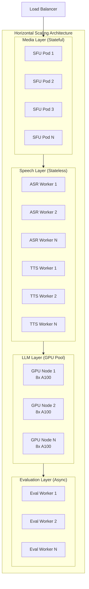
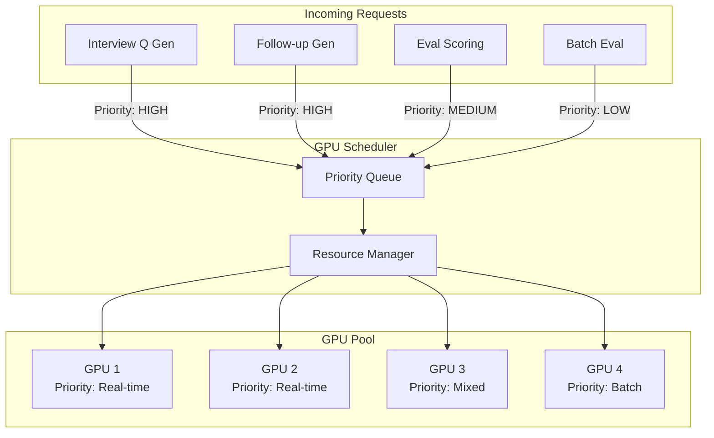
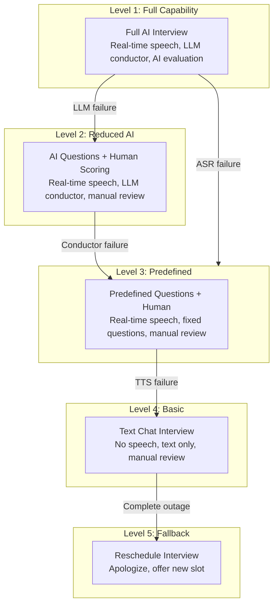
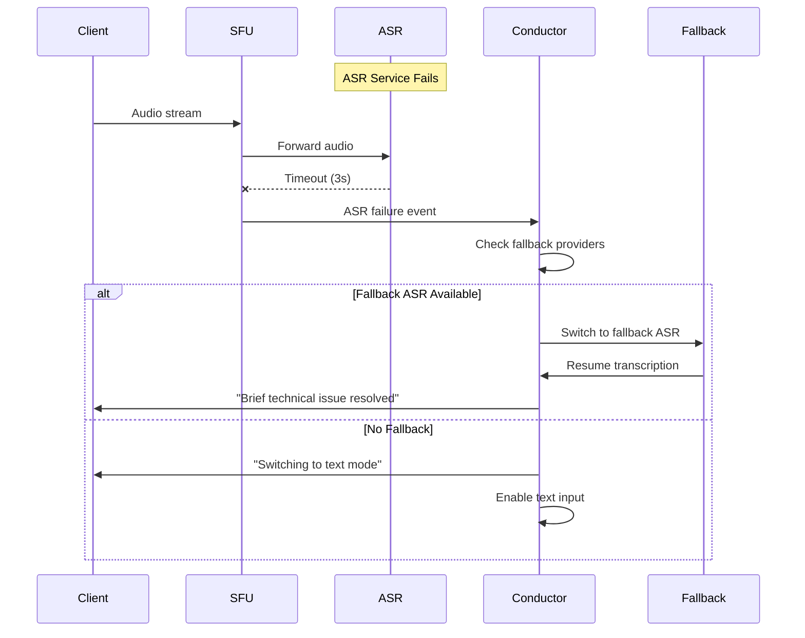
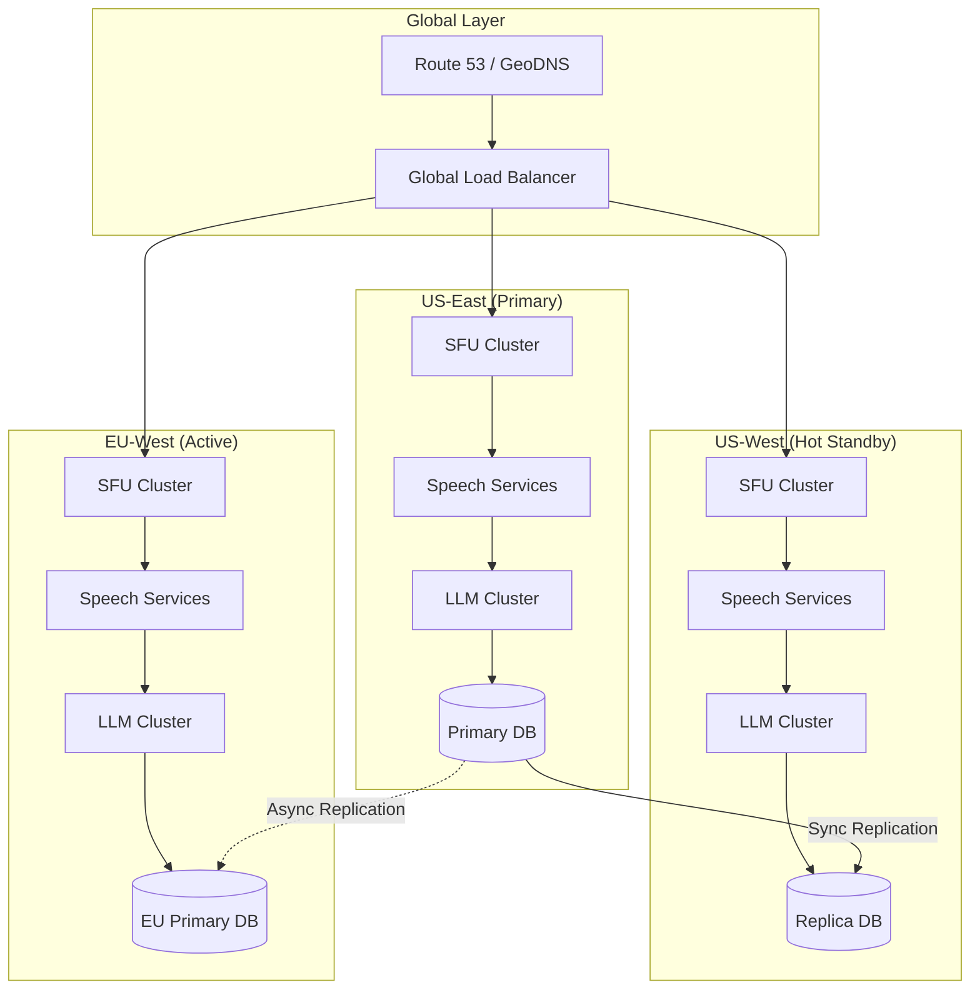
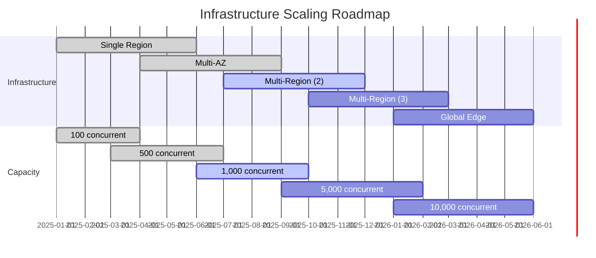

# Scalability & Reliability

## Scaling Strategy

### Horizontal Scaling by Component



### Scaling Triggers and Thresholds

| Component | Metric | Scale-Out Trigger | Scale-In Trigger | Min Instances |
|-----------|--------|-------------------|------------------|---------------|
| SFU Servers | Sessions/server | >80 sessions | <40 sessions | 3 |
| ASR Workers | Queue depth | >10 pending | <3 pending | 5 |
| TTS Workers | Queue depth | >10 pending | <3 pending | 5 |
| LLM Inference | GPU utilization | >75% | <40% | 2 nodes |
| Eval Workers | Queue depth | >50 pending | <10 pending | 3 |
| API Servers | CPU utilization | >70% | <30% | 3 |

### Session Affinity Requirements

**Why Session Affinity Matters:**

Unlike stateless web requests, interview sessions require:
- Continuous WebRTC connection to same SFU
- Conversation context maintained in conductor
- Recording state tied to specific server

**Affinity Implementation:**

```mermaid
flowchart LR
    subgraph Client
        C1["Candidate Browser"]
    end

    subgraph Routing
        GLB["Global LB<br/>(GeoDNS)"]
        SLB["Session LB<br/>(Consistent Hash)"]
    end

    subgraph SFUs["SFU Cluster"]
        SFU1["SFU 1<br/>Sessions: A, D, G"]
        SFU2["SFU 2<br/>Sessions: B, E, H"]
        SFU3["SFU 3<br/>Sessions: C, F, I"]
    end

    C1 -->|1. Initial request| GLB
    GLB -->|2. Route to region| SLB
    SLB -->|3. Hash(session_id)| SFU2
    SFU2 -->|4. All subsequent traffic| C1
```

**Sticky Session Configuration:**

```
ROUTING_CONFIG:
  method: "consistent_hashing"
  key: "session_id"
  ring_size: 1024
  virtual_nodes: 150  # Per server for better distribution

  failover:
    enabled: true
    health_check_interval: 5s
    unhealthy_threshold: 3
    healthy_threshold: 2
    drain_timeout: 30s  # Allow active sessions to complete
```

### GPU Pool Management

**Challenge:** GPU resources are expensive and must be efficiently shared.



**Priority Levels:**

| Priority | Use Case | Max Wait | Preemption |
|----------|----------|----------|------------|
| CRITICAL | Active interview response | 100ms | Yes |
| HIGH | Interview question generation | 500ms | No |
| MEDIUM | Post-interview evaluation | 5s | No |
| LOW | Batch analytics, training | 30s | No |

---

## Reliability Patterns

### Graceful Degradation Ladder



**Degradation Triggers:**

| Component Failure | Degradation Action |
|-------------------|-------------------|
| LLM timeout >5s | Switch to predefined questions |
| ASR accuracy <70% | Enable manual transcript correction |
| TTS failure | Display text on screen |
| SFU overload | Reduce video quality, audio-only |
| Network degradation | Adaptive bitrate, reduce features |
| Complete LLM outage | Use cached question bank |

### Component Failure Handling



### Circuit Breaker Implementation

```
CIRCUIT_BREAKER_CONFIG:
  services:
    asr_primary:
      failure_threshold: 5        # Failures before opening
      success_threshold: 3        # Successes to close
      timeout: 30s                # Time in open state
      half_open_requests: 3       # Test requests in half-open

    llm_api:
      failure_threshold: 3
      success_threshold: 2
      timeout: 60s
      half_open_requests: 2

    tts_primary:
      failure_threshold: 5
      success_threshold: 3
      timeout: 30s
      half_open_requests: 3

ALGORITHM CircuitBreaker(service, request):
    state = get_state(service)

    IF state == OPEN:
        IF time_since_open > config.timeout:
            state = HALF_OPEN
        ELSE:
            RETURN call_fallback(service, request)

    IF state == HALF_OPEN:
        result = TRY call_primary(service, request)
        IF success:
            increment_success_count(service)
            IF success_count >= config.success_threshold:
                state = CLOSED
        ELSE:
            state = OPEN
            reset_timer(service)
        RETURN result

    IF state == CLOSED:
        result = TRY call_primary(service, request)
        IF failure:
            increment_failure_count(service)
            IF failure_count >= config.failure_threshold:
                state = OPEN
                start_timer(service)
        ELSE:
            reset_failure_count(service)
        RETURN result
```

### Retry Strategy with Exponential Backoff

```
RETRY_CONFIG:
  default:
    max_retries: 3
    initial_delay_ms: 100
    max_delay_ms: 5000
    multiplier: 2
    jitter: 0.1  # ±10% randomization

  real_time_critical:  # For active interviews
    max_retries: 2
    initial_delay_ms: 50
    max_delay_ms: 200
    multiplier: 2

  batch_processing:  # For evaluation
    max_retries: 5
    initial_delay_ms: 1000
    max_delay_ms: 30000
    multiplier: 2

ALGORITHM retry_with_backoff(operation, config):
    FOR attempt IN range(config.max_retries + 1):
        TRY:
            result = operation()
            RETURN result
        EXCEPT RetryableError as e:
            IF attempt == config.max_retries:
                RAISE e

            delay = min(
                config.initial_delay_ms * (config.multiplier ** attempt),
                config.max_delay_ms
            )
            jitter = delay * config.jitter * random(-1, 1)
            sleep(delay + jitter)

        EXCEPT NonRetryableError as e:
            RAISE e  # Don't retry
```

---

## Disaster Recovery

### Recovery Objectives

| Scenario | RTO | RPO | Strategy |
|----------|-----|-----|----------|
| Single component failure | 30s | 0 | Automatic failover |
| AZ failure | 2 min | 0 | Cross-AZ replication |
| Region failure | 15 min | 1 min | Cross-region failover |
| Complete outage | 1 hour | 5 min | DR site activation |

### Multi-Region Architecture



### Session Recovery Protocol

**Challenge:** Mid-interview failures require special handling.

```
SCENARIO: SFU server crashes during active interview

DETECTION:
  - Client WebRTC connection drops
  - Health check fails (3 consecutive)
  - Session marked as "interrupted"

RECOVERY:
  1. Client detects disconnection (WebRTC ICE failure)
  2. Client triggers reconnection flow
  3. Session router assigns new SFU (different server)
  4. New SFU retrieves session state from Redis:
     - Conversation history
     - Current question index
     - Partial transcript
  5. Recording service handles gap:
     - Marks discontinuity in timeline
     - Resumes recording from new server
  6. Client reconnects, sees "Connection restored" message
  7. AI acknowledges: "I apologize for the interruption. Where were we?"
  8. Resume from last complete exchange

TIMELINE:
  T+0s:     Failure detected
  T+5s:     Client reconnection initiated
  T+10s:    New SFU assigned
  T+15s:    State restored
  T+20s:    Recording resumed
  T+25s:    Interview continues

MAX_RECOVERY_TIME: 60 seconds before offering reschedule
```

### Backup Strategy

| Data Type | Backup Frequency | Retention | Location |
|-----------|------------------|-----------|----------|
| Session state | Real-time (Redis) | 7 days | Multi-AZ |
| Transcripts | Continuous | 4 years | Multi-region |
| Recordings | On completion | 4 years | Cross-region |
| Evaluations | Continuous | 7 years | Multi-region |
| Configuration | Hourly | 30 days | Multi-region |
| Audit logs | Continuous | 7 years | Immutable storage |

---

## Load Testing Scenarios

### Scenario 1: Peak Load (1,000 Concurrent)

```
TEST: peak_load_1000

SETUP:
  - 1,000 simulated candidates
  - Realistic audio streams (pre-recorded)
  - Full speech pipeline enabled
  - LLM responses (not mocked)

RAMP:
  - 0-5 min: 0 → 200 concurrent
  - 5-10 min: 200 → 500 concurrent
  - 10-15 min: 500 → 1,000 concurrent
  - 15-30 min: Hold at 1,000
  - 30-35 min: 1,000 → 0 (graceful drain)

SUCCESS CRITERIA:
  - Mouth-to-ear p99 < 400ms
  - Interview completion rate > 98%
  - No session failures
  - ASR accuracy maintained
```

### Scenario 2: Component Failure

```
TEST: asr_failure_recovery

SETUP:
  - 100 active interviews
  - Primary ASR service

INJECTION:
  - T+5 min: Kill 50% of ASR workers
  - T+10 min: Kill remaining ASR workers
  - T+12 min: Restore all ASR workers

SUCCESS CRITERIA:
  - Fallback ASR activates within 5s
  - No interview terminations
  - Recovery within 30s of restore
  - All transcripts preserved
```

### Scenario 3: Region Failover

```
TEST: region_failover

SETUP:
  - 200 active interviews in US-East
  - US-West hot standby

INJECTION:
  - T+5 min: Simulate US-East region failure
  - All services unreachable

SUCCESS CRITERIA:
  - DNS failover within 60s
  - Sessions resume in US-West within 2 min
  - No data loss (RPO = 0)
  - User notification delivered
```

---

## Capacity Planning

### Growth Projections

| Metric | Current | Year 1 | Year 2 | Year 3 |
|--------|---------|--------|--------|--------|
| Monthly interviews | 10,000 | 100,000 | 500,000 | 1,000,000 |
| Peak concurrent | 100 | 1,000 | 5,000 | 10,000 |
| Storage (cumulative) | 20 TB | 240 TB | 1.2 PB | 3.5 PB |
| GPU nodes | 5 | 50 | 200 | 400 |

### Cost Optimization Strategies

| Strategy | Savings | Implementation |
|----------|---------|----------------|
| Reserved instances | 30-50% | 1-3 year commitments |
| Spot instances for eval | 60-70% | Non-critical batch work |
| Right-sizing | 20-30% | Regular utilization review |
| Self-hosted ASR/TTS | 40-60% | At scale >100K interviews/month |
| Storage tiering | 60-70% | Hot/warm/cold/archive |
| GPU sharing | 20-30% | Multi-tenant inference |

### Scaling Milestones


