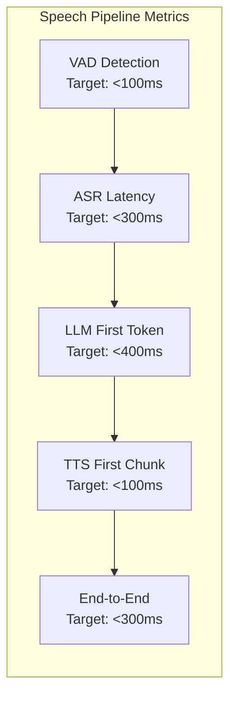
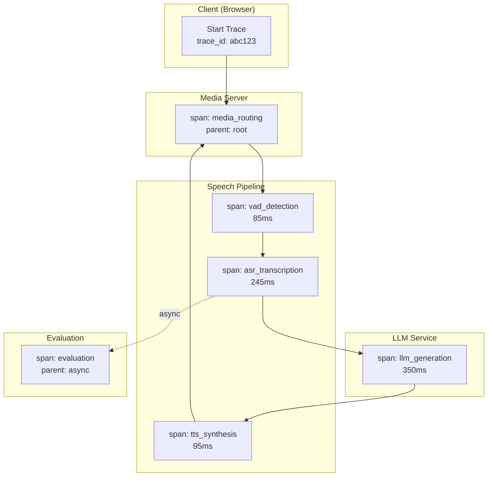
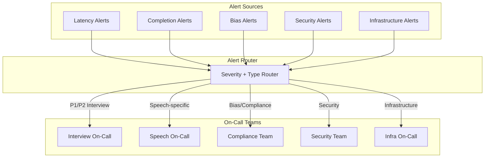
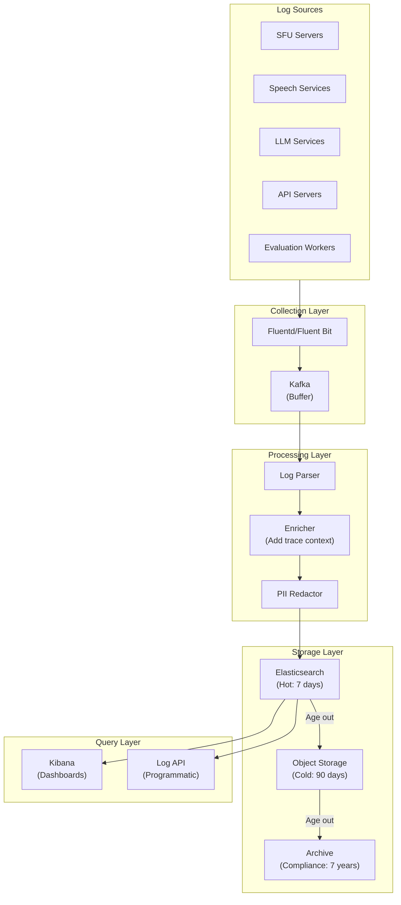

# Observability

## Metrics Strategy

### USE Method for Infrastructure

**Utilization, Saturation, Errors for each component:**

| Component | Utilization | Saturation | Errors |
|-----------|-------------|------------|--------|
| **SFU Servers** | Sessions / capacity | Connection queue depth | WebRTC failures |
| **ASR Workers** | Active transcriptions / capacity | Request queue depth | Transcription errors |
| **TTS Workers** | Active syntheses / capacity | Request queue depth | Synthesis errors |
| **LLM Inference** | GPU memory, compute % | Request queue depth | Timeout rate |
| **Eval Workers** | Active evaluations / capacity | Job queue depth | Scoring errors |
| **Database** | Connection pool usage | Query queue depth | Query errors |

### RED Method for Services

**Rate, Errors, Duration for each service:**

| Service | Rate | Errors | Duration |
|---------|------|--------|----------|
| **Interview API** | Requests/sec | 4xx, 5xx rate | p50, p95, p99 latency |
| **Speech Pipeline** | Frames/sec | ASR/TTS failures | Mouth-to-ear latency |
| **Evaluation Service** | Evaluations/min | Scoring failures | Time to complete |
| **Bias Monitor** | Checks/min | Calculation errors | Check duration |

### Critical Latency Metrics



| Metric | Target | Warning | Critical | Measurement |
|--------|--------|---------|----------|-------------|
| VAD detection time | <100ms | >120ms | >150ms | p95 |
| ASR time-to-first-word | <200ms | >250ms | >350ms | p95 |
| ASR total transcription | <300ms | >400ms | >500ms | p95 |
| LLM first token | <400ms | >500ms | >700ms | p95 |
| TTS first chunk | <100ms | >150ms | >200ms | p95 |
| **Mouth-to-ear total** | **<300ms** | **>350ms** | **>500ms** | **p95** |
| Turn-taking gap | <500ms | >700ms | >1000ms | p95 |

### Business Metrics

| Metric | Description | Target | Alert |
|--------|-------------|--------|-------|
| Interview completion rate | Successful / scheduled | >98% | <97% |
| Candidate satisfaction | Post-interview survey | >4.0/5.0 | <3.5 |
| Evaluator agreement | Cohen's Kappa | >0.6 | <0.5 |
| Time-to-decision | Interview end → score ready | <5 min | >10 min |
| AI question relevance | Human-rated relevance | >4.0/5.0 | <3.5 |
| Follow-up appropriateness | % appropriate follow-ups | >90% | <85% |

### Fairness Metrics (SLOs)

| Metric | Target | Warning | Critical | Calculation |
|--------|--------|---------|----------|-------------|
| DI ratio (gender) | ≥0.80 | <0.85 | <0.80 | min(rates)/max(rates) |
| DI ratio (ethnicity) | ≥0.80 | <0.85 | <0.80 | min(rates)/max(rates) |
| DI ratio (age group) | ≥0.80 | <0.85 | <0.80 | min(rates)/max(rates) |
| Score variance by group | <10% | >12% | >15% | std(group_scores) |

---

## Logging Strategy

### Log Levels

| Level | Use Case | Examples | Retention |
|-------|----------|----------|-----------|
| **ERROR** | Failures requiring attention | ASR timeout, TTS failure, session crash | 90 days |
| **WARN** | Degraded performance | High latency, fallback activated | 30 days |
| **INFO** | Key business events | Interview start/end, evaluation complete | 30 days |
| **DEBUG** | Detailed troubleshooting | Request/response details, state changes | 7 days |
| **TRACE** | Granular debugging | Frame-by-frame audio, token streaming | 24 hours |

### Structured Log Format

```json
{
  "timestamp": "2025-01-24T14:30:00.123Z",
  "level": "INFO",
  "service": "speech-pipeline",
  "component": "asr-worker",
  "trace_id": "abc123",
  "span_id": "def456",
  "session_id": "interview-789",

  "event": "transcription_complete",
  "duration_ms": 245,
  "word_count": 42,
  "confidence": 0.94,

  "metadata": {
    "asr_provider": "deepgram",
    "model_version": "nova-3",
    "audio_duration_ms": 5200
  }
}
```

### PII Redaction in Logs

```
REDACTION_RULES:
  always_redact:
    - email: "***@***.***"
    - phone: "***-***-****"
    - ssn: "***-**-****"
    - credit_card: "****-****-****-****"

  mask_partial:
    - name: "J*** D***"
    - ip_address: "192.168.***.**"

  never_log:
    - passwords
    - api_keys
    - session_tokens (except hashed)
    - raw_audio_content
    - full_transcript (use segment IDs)

EXAMPLE:
  // Before redaction
  {"candidate_email": "john.doe@company.com", "name": "John Doe"}

  // After redaction
  {"candidate_email": "***@***.***.***", "name": "J*** D***"}
```

### Interview-Specific Logging

```
INTERVIEW_LOG_EVENTS:
  session_lifecycle:
    - interview.scheduled
    - interview.candidate_joined
    - interview.started
    - interview.paused
    - interview.resumed
    - interview.ended
    - interview.evaluation_started
    - interview.evaluation_completed

  speech_events:
    - speech.candidate_started
    - speech.candidate_ended
    - speech.ai_started
    - speech.ai_ended
    - speech.barge_in_detected

  quality_events:
    - quality.latency_warning (>250ms)
    - quality.asr_accuracy_drop (WER >12%)
    - quality.connection_degraded
    - quality.fallback_activated

  compliance_events:
    - compliance.consent_recorded
    - compliance.bias_check_completed
    - compliance.di_alert_triggered
```

---

## Distributed Tracing

### Trace Propagation



### Key Spans to Instrument

| Span Name | Parent | Attributes | Duration Target |
|-----------|--------|------------|-----------------|
| `interview.turn` | root | turn_number, speaker | Variable |
| `media.capture` | turn | codec, bitrate | 20-40ms |
| `vad.detection` | turn | speech_probability | 85-100ms |
| `asr.transcribe` | turn | provider, model, word_count | 150-300ms |
| `llm.generate` | turn | model, tokens_in, tokens_out | 200-500ms |
| `tts.synthesize` | turn | provider, voice, char_count | 75-150ms |
| `media.playback` | turn | buffer_size, jitter | 20-50ms |
| `eval.score` | session (async) | model, dimensions | 10-30s |

### Trace Context Headers

```
# W3C Trace Context (standard)
traceparent: 00-abc123def456789-span123-01
tracestate: vendor=value

# Custom headers for interview context
x-interview-session-id: session-uuid
x-interview-turn: 5
x-interview-speaker: candidate
```

---

## Alerting

### Alert Severity Levels

| Severity | Response Time | Notification | Examples |
|----------|--------------|--------------|----------|
| **P1 Critical** | 5 min | Page on-call | Interview system down, data breach |
| **P2 High** | 30 min | Page + Slack | Latency >500ms, completion <95% |
| **P3 Medium** | 4 hours | Slack only | Latency >350ms, DI <0.85 |
| **P4 Low** | Next business day | Email | Capacity warning, cost anomaly |

### Critical Alerts (Page-Worthy)

```yaml
alerts:
  - name: MouthToEarLatencyCritical
    condition: p95(mouth_to_ear_latency) > 500ms for 2min
    severity: P1
    runbook: /runbooks/latency-critical.md
    notification:
      - pagerduty: interview-oncall
      - slack: #interview-alerts

  - name: InterviewCompletionCritical
    condition: completion_rate < 95% over 15min window
    severity: P1
    runbook: /runbooks/completion-critical.md
    notification:
      - pagerduty: interview-oncall
      - slack: #interview-alerts

  - name: ASRServiceDown
    condition: asr_error_rate > 50% for 1min
    severity: P1
    runbook: /runbooks/asr-failure.md
    notification:
      - pagerduty: speech-oncall
      - slack: #interview-alerts

  - name: BiasThresholdCritical
    condition: di_ratio < 0.80 for any protected_class
    severity: P1
    runbook: /runbooks/bias-critical.md
    notification:
      - pagerduty: compliance-oncall
      - slack: #compliance-alerts
      - email: legal@company.com
```

### Warning Alerts

```yaml
alerts:
  - name: LatencyDegrading
    condition: p95(mouth_to_ear_latency) > 350ms for 5min
    severity: P3
    notification:
      - slack: #interview-alerts

  - name: GPUUtilizationHigh
    condition: gpu_utilization > 85% for 10min
    severity: P3
    notification:
      - slack: #infra-alerts

  - name: EvaluationQueueBacklog
    condition: eval_queue_depth > 100 for 15min
    severity: P3
    notification:
      - slack: #interview-alerts

  - name: BiasWarning
    condition: di_ratio < 0.85 for any protected_class
    severity: P3
    notification:
      - slack: #compliance-alerts
      - email: hr-analytics@company.com

  - name: ASRAccuracyDegraded
    condition: wer > 12% over 1hr window
    severity: P3
    notification:
      - slack: #speech-alerts
```

### Alert Routing



---

## Dashboards

### Real-Time Interview Dashboard

```
┌─────────────────────────────────────────────────────────────────┐
│                    INTERVIEW SYSTEM HEALTH                       │
├─────────────────┬─────────────────┬─────────────────────────────┤
│ Active Sessions │ Mouth-to-Ear    │ Completion Rate (1hr)       │
│      147        │   287ms (p95)   │       98.7%                 │
│   ▲ +12 vs avg  │   ✓ Within SLO  │   ✓ Above 98%               │
├─────────────────┴─────────────────┴─────────────────────────────┤
│                    LATENCY BREAKDOWN (p95)                       │
│ ┌─────────────────────────────────────────────────────────────┐ │
│ │ VAD    │████░░░░░░░░░░░░░░░░░░░│  92ms   (target: 100ms)   │ │
│ │ ASR    │████████░░░░░░░░░░░░░░░│ 178ms   (target: 300ms)   │ │
│ │ LLM    │██████████████░░░░░░░░░│ 312ms   (target: 400ms)   │ │
│ │ TTS    │███░░░░░░░░░░░░░░░░░░░░│  87ms   (target: 100ms)   │ │
│ └─────────────────────────────────────────────────────────────┘ │
├─────────────────────────────────────────────────────────────────┤
│                    SESSIONS BY STATUS                            │
│  In Progress: 147  │  Evaluating: 23  │  Completed (today): 312 │
├─────────────────────────────────────────────────────────────────┤
│                    ERROR RATE (last 1hr)                         │
│  ASR Errors: 0.3%  │  TTS Errors: 0.1%  │  LLM Timeouts: 0.5%   │
└─────────────────────────────────────────────────────────────────┘
```

### Fairness Monitoring Dashboard

```
┌─────────────────────────────────────────────────────────────────┐
│                    FAIRNESS MONITORING                           │
├─────────────────────────────────────────────────────────────────┤
│                    DISPARATE IMPACT RATIOS                       │
│ ┌─────────────────────────────────────────────────────────────┐ │
│ │ Gender     │████████████████████░░░░│ 0.87 ✓  (min: 0.80)  │ │
│ │ Ethnicity  │███████████████████░░░░░│ 0.85 ✓  (min: 0.80)  │ │
│ │ Age Group  │█████████████████████░░░│ 0.91 ✓  (min: 0.80)  │ │
│ └─────────────────────────────────────────────────────────────┘ │
├─────────────────────────────────────────────────────────────────┤
│                    PASS RATES BY GROUP (30 days)                 │
│                                                                  │
│  Gender:        Male: 62%    Female: 54%    Other: 58%          │
│  Ethnicity:     Group A: 60% Group B: 51%   Group C: 55%        │
│  Age:           18-30: 58%   31-45: 62%     46+: 56%            │
├─────────────────────────────────────────────────────────────────┤
│                    TREND (90 days)                               │
│  ┌───────────────────────────────────────────────────────────┐  │
│  │ DI Ratio                                                   │  │
│  │ 1.0 ─────────────────────────────────────────────────────  │  │
│  │ 0.9 ─────╱─────╲───────────────────────────────────────── │  │
│  │ 0.8 ───╱─────────╲─────────────────────────────────────── │  │
│  │ 0.7 ──────────────────────────────────────────────────    │  │
│  │     Jan         Feb         Mar         Apr               │  │
│  └───────────────────────────────────────────────────────────┘  │
├─────────────────────────────────────────────────────────────────┤
│  Last Audit: 2025-01-15  │  Next Audit: 2025-04-15             │
│  Status: COMPLIANT       │  Auditor: Third Party Inc.          │
└─────────────────────────────────────────────────────────────────┘
```

### SLO Status Dashboard

```
┌─────────────────────────────────────────────────────────────────┐
│                    SLO STATUS (30-day window)                    │
├─────────────────────────────────────────────────────────────────┤
│ SLO                    │ Target  │ Current │ Budget  │ Status   │
├────────────────────────┼─────────┼─────────┼─────────┼──────────┤
│ Latency p99 < 300ms    │  99.0%  │  99.4%  │  +0.4%  │ ✓ OK     │
│ Completion > 98%       │  98.0%  │  98.7%  │  +0.7%  │ ✓ OK     │
│ ASR Accuracy > 90%     │  90.0%  │  91.2%  │  +1.2%  │ ✓ OK     │
│ Availability > 99.9%   │  99.9%  │  99.95% │  +0.05% │ ✓ OK     │
│ DI Ratio ≥ 0.80        │  100%   │  100%   │  OK     │ ✓ OK     │
│ Eval Consensus κ > 0.6 │  95.0%  │  94.2%  │  -0.8%  │ ⚠ WARN   │
├─────────────────────────────────────────────────────────────────┤
│ Error Budget Remaining:  Latency: 4.3hrs  Availability: 43min   │
└─────────────────────────────────────────────────────────────────┘
```

---

## Runbooks

### Runbook: Latency Spike Response

```markdown
# Runbook: Latency Spike (p95 > 350ms)

## Severity: P2 (P1 if > 500ms)

## Symptoms
- Dashboard shows p95 latency > 350ms
- Alert: MouthToEarLatencyHigh
- User reports: "AI responses feel slow"

## Diagnosis Steps

1. **Check component latencies**
   ```
   Query: latency_by_component{quantile="0.95"}
   Look for: Which component is slow?
   ```

2. **Check load**
   ```
   Query: active_sessions
   Look for: Unusual spike in concurrent sessions?
   ```

3. **Check GPU utilization**
   ```
   Query: gpu_utilization{cluster="llm"}
   Look for: > 90% utilization
   ```

4. **Check external dependencies**
   ```
   Query: external_api_latency{provider="deepgram|elevenlabs|openai"}
   Look for: Provider degradation
   ```

## Resolution Actions

| Root Cause | Action |
|------------|--------|
| High load | Scale up ASR/TTS workers |
| GPU saturation | Scale up LLM nodes or enable smaller model |
| ASR provider slow | Switch to fallback ASR |
| TTS provider slow | Switch to fallback TTS |
| LLM provider slow | Enable response caching, reduce context |
| Network issue | Check inter-region latency, consider routing |

## Escalation
- If not resolved in 15 min: Page senior on-call
- If affecting >10% of sessions: Page engineering lead
```

### Runbook: Bias Alert Response

```markdown
# Runbook: Bias Alert (DI < 0.85)

## Severity: P3 (P1 if DI < 0.80)

## Symptoms
- Alert: BiasWarning or BiasThresholdCritical
- Dashboard shows DI ratio declining
- Compliance team notified

## IMMEDIATE ACTIONS (DI < 0.80)

1. **Pause AI-only scoring for affected job**
   ```
   Action: Enable human review for all evaluations
   Command: set_human_review_required(job_id, true)
   ```

2. **Notify stakeholders**
   - Legal team
   - HR leadership
   - Compliance officer

3. **Preserve evidence**
   - Export evaluation data for affected period
   - Document current DI calculations

## Diagnosis Steps

1. **Identify affected demographic**
   ```
   Query: di_ratio_by_group{job_id="X"}
   Look for: Which group has lower pass rate?
   ```

2. **Analyze score distributions**
   ```
   Query: score_distribution_by_group{job_id="X", dimension="all"}
   Look for: Systematic score differences
   ```

3. **Review recent changes**
   - Rubric changes?
   - Model version changes?
   - Question bank changes?

4. **Sample evaluation review**
   - Pull 10 random evaluations per group
   - Human review for fairness
   - Document findings

## Resolution Actions

| Root Cause | Action |
|------------|--------|
| Rubric bias | Review and revise rubric criteria |
| Model bias | Retrain or fine-tune model |
| Question bias | Replace biased questions |
| Small sample | Wait for more data, monitor closely |
| Data quality | Investigate demographic data accuracy |

## Documentation Required
- Incident report within 24 hours
- Root cause analysis within 7 days
- Corrective action plan within 14 days
```

---

## Log Aggregation Architecture


