# Interview Guide

## Interview Pacing (45-minute format)

```mermaid
gantt
    title 45-Minute Interview Pacing
    dateFormat mm
    axisFormat %M min

    section Clarify
    Scope & Requirements    :00, 5

    section High-Level
    Core Architecture       :05, 10

    section Deep Dive
    Speech Pipeline OR Evaluation :15, 15

    section Scale & Trade-offs
    Scaling & Reliability   :30, 10

    section Wrap Up
    Questions & Summary     :40, 5
```



| Phase | Time | Focus | Key Outputs |
|-------|------|-------|-------------|
| **Clarify** | 0-5 min | Scope, requirements, constraints | Interview types, scale, compliance needs |
| **High-Level** | 5-15 min | Architecture, data flow | System diagram, component breakdown |
| **Deep Dive** | 15-30 min | 1-2 critical components | Algorithms, trade-offs, failure handling |
| **Scale** | 30-40 min | Scaling, reliability, bottlenecks | Scaling strategy, failure modes |
| **Wrap Up** | 40-45 min | Summary, Q&A | Final thoughts, handle follow-ups |

---

## Clarifying Questions to Ask

### Must Ask

1. **Scale**: "What's the expected number of concurrent interviews?"
   - 10 → Simple architecture, single region
   - 100 → Multi-AZ, dedicated resources
   - 1,000+ → Multi-region, GPU clusters

2. **Interview Types**: "What types of interviews should we support?"
   - Technical coding → Need code sandbox
   - Behavioral → STAR method detection
   - System design → Whiteboard/diagram support

3. **Latency Requirements**: "How fast should the AI respond?"
   - Real-time conversation → Sub-300ms (critical)
   - Acceptable delay → Sub-1s (simpler)

4. **Compliance**: "Are there specific compliance requirements?"
   - EU candidates → EU AI Act (emotion prohibited)
   - NYC candidates → AEDT Law (annual audits)
   - EEOC compliance → Four-fifths rule

### Good to Ask

5. **Recording**: "Do we need to record interviews?"
   - If yes → Consent handling, storage, retention

6. **Evaluation**: "Should scoring be real-time or post-interview?"
   - Real-time → Much harder, affects latency
   - Post-interview → Simpler, async processing

7. **Integration**: "Does this integrate with existing ATS?"
   - If yes → API design considerations

8. **Human Fallback**: "Should candidates be able to request human interviews?"
   - If yes → Hybrid workflow design

---

## Meta-Commentary

### What Makes This System Unique

| Aspect | Why It's Different | Interview Implication |
|--------|-------------------|----------------------|
| **Real-time latency** | Sub-300ms is existential, not nice-to-have | Discuss latency budget breakdown early |
| **Multi-modal under legal constraints** | EU AI Act prohibits emotion recognition | Design must be modular |
| **Stateful sessions** | Cannot retry like web requests | Session recovery is critical |
| **Compliance as architecture driver** | EEOC/EU AI Act shape design | Compliance isn't an afterthought |
| **Speech pipeline complexity** | VAD + ASR + LLM + TTS orchestration | This IS the core challenge |

### Where to Spend Most Time

| Area | Recommended Time | Why |
|------|-----------------|-----|
| Speech pipeline | 10-15 min | Core differentiator, highest complexity |
| Latency budget | 5 min | Shows understanding of real-time systems |
| Compliance/bias | 5-10 min | Unique constraint, often overlooked |
| WebRTC architecture | 5 min | Real-time transport fundamentals |
| Evaluation system | 5 min | LLM-as-judge patterns |

### What NOT to Spend Time On

- Detailed database schema (unless asked)
- CI/CD pipeline
- Detailed API endpoint specifications
- Cost optimization (save for follow-up)
- UI/UX design

---

## Trade-offs Discussion

### Trade-off 1: Cascaded Pipeline vs Native Speech-to-Speech

| Option | Cascaded (ASR → LLM → TTS) | Native (OpenAI Realtime API) |
|--------|---------------------------|------------------------------|
| **Latency** | ~300ms (streaming optimized) | ~300ms (native) |
| **Control** | Full control over each component | Black box |
| **Explainability** | Complete transcript, full audit trail | Limited visibility |
| **Vendor lock-in** | Mix and match providers | Single vendor |
| **Compliance** | Full audit capability | May not meet requirements |
| **Cost** | Pay per component, optimize individually | Single price, less flexibility |

**Recommendation:** **Cascaded for enterprise/compliance-critical**, Native for consumer-facing where latency and simplicity are paramount.

**What to Say:**
> "For an enterprise hiring platform, I'd recommend cascaded architecture because compliance requirements demand full audit trails. We need to know exactly what the candidate said, how it was interpreted, and why we scored it that way. Native speech-to-speech is simpler but doesn't give us that visibility."

### Trade-off 2: SFU vs P2P vs MCU

| Option | P2P | SFU | MCU |
|--------|-----|-----|-----|
| **Latency** | Lowest | +20-50ms | +50-100ms |
| **Server recording** | Complex (client-side) | Easy | Easy |
| **Scalability** | 2 participants | 20-30 | 50+ |
| **Server load** | None | Forward only | Transcode |

**Recommendation:** **SFU for most interview scenarios** - server-side recording is essential for compliance, and latency overhead is acceptable.

**What to Say:**
> "I'd go with SFU architecture. While P2P has the lowest latency, we need server-side recording for compliance, and SFU gives us that with minimal latency overhead. MCU is overkill since interviews typically have 2-4 participants."

### Trade-off 3: Self-Hosted vs Cloud ASR/TTS

| Option | Self-Hosted | Cloud |
|--------|-------------|-------|
| **Latency** | 400-500ms (Whisper) | 150ms (Deepgram) |
| **Privacy** | Data stays internal | Data transmitted to provider |
| **Cost** | GPU infrastructure | Per-minute pricing |
| **Scaling** | Manual | Auto-scaling |

**Recommendation:** **Hybrid approach** - Cloud for standard interviews (better latency), self-hosted for sensitive industries.

**What to Say:**
> "This depends on the customer segment. For most customers, cloud ASR gives us better latency. But for healthcare or finance customers with strict data residency requirements, we'd offer self-hosted Whisper, accepting the latency trade-off for privacy."

### Trade-off 4: Real-time vs Post-Interview Evaluation

| Option | Real-time Scoring | Post-Interview Scoring |
|--------|-------------------|------------------------|
| **Latency impact** | Adds to conversation delay | None |
| **Accuracy** | May miss context | Full context available |
| **Feedback** | Immediate indicators | After interview |
| **Complexity** | High | Lower |

**Recommendation:** **Post-interview for final scores**, with real-time signals for adaptive questioning.

**What to Say:**
> "Final scoring should be post-interview when we have the complete transcript. But we want real-time signals to adapt questions - like detecting if an answer was too brief and needs follow-up. We just don't show numeric scores in real-time."

---

## Trap Questions & How to Handle

### Trap 1: "Why not just use Zoom/Teams + ChatGPT?"

**What Interviewer Wants:** Test if you understand the technical complexity.

**Bad Answer:** "They don't have AI built in."

**Good Answer:**
> "Zoom provides video conferencing but doesn't give us:
> 1. Sub-300ms speech-to-speech AI integration (Zoom's API adds latency)
> 2. Real-time transcription with streaming to LLM
> 3. Server-side recording with compliance metadata
> 4. Adaptive question generation with context management
> 5. Rubric-based evaluation with audit trails
>
> We could build on Zoom's API, but we'd lose control over the speech pipeline, which is critical for latency. The real-time conversation experience requires tight integration between ASR, LLM, and TTS that Zoom doesn't provide."

### Trap 2: "How do you handle bias in AI hiring?"

**What Interviewer Wants:** Test compliance awareness and technical depth.

**Bad Answer:** "We'll train on diverse data."

**Good Answer:**
> "Bias in AI hiring is a serious issue - 44% of AI video interview systems show gender bias. We address this at multiple levels:
>
> 1. **Architecture**: We disable facial/emotion analysis by default since research shows it's biased. We focus on content-only evaluation.
>
> 2. **Real-time monitoring**: We calculate Disparate Impact ratios continuously using the EEOC four-fifths rule. If any protected group's pass rate falls below 80% of the highest group, we alert and can pause AI scoring.
>
> 3. **Multi-LLM consensus**: We use two different models and require Cohen's Kappa > 0.6 for agreement. Low agreement triggers human review.
>
> 4. **EU AI Act compliance**: By August 2026, emotion recognition in hiring is prohibited in EU. Our modular design lets us disable it per jurisdiction.
>
> 5. **Candidate rights**: Always offer human interview option, and provide score explanations on request."

### Trap 3: "What if the AI asks inappropriate questions?"

**What Interviewer Wants:** Test safety thinking.

**Good Answer:**
> "We prevent this through multiple layers:
>
> 1. **Question bank validation**: All questions are pre-reviewed by HR and legal before entering the system.
>
> 2. **Prompt engineering**: System prompt explicitly forbids questions about protected characteristics, with examples of what not to ask.
>
> 3. **Output filtering**: We scan generated questions for prohibited topics before TTS synthesis.
>
> 4. **Human oversight**: Recruiters can monitor live interviews and intervene.
>
> 5. **Kill switch**: If something slips through, we can immediately terminate the interview and flag for review.
>
> 6. **Audit logging**: Every question is logged for post-hoc review.
>
> The key is defense in depth - no single layer is perfect, but together they minimize risk."

### Trap 4: "Why is 300ms latency so important?"

**What Interviewer Wants:** Test understanding of conversational dynamics.

**Good Answer:**
> "Conversational turn-taking has been studied extensively. The natural gap between speakers is about 200-500ms. Here's why 300ms matters:
>
> - **<300ms**: Feels natural, like talking to a human
> - **300-500ms**: Noticeable but acceptable
> - **500ms-1s**: Feels like talking to someone distracted
> - **>1s**: Conversation flow breaks down, feels robotic
>
> That's why we budget carefully:
> - 40ms for audio capture
> - 85-100ms for VAD
> - 150ms for streaming ASR
> - 200ms for LLM first token (streaming)
> - 75ms for TTS first chunk
>
> Each component is optimized for streaming - we don't wait for complete ASR before starting LLM, or complete LLM before starting TTS. That's how we hit 300ms despite each component being slower individually."

### Trap 5: "What about the EU AI Act?"

**What Interviewer Wants:** Test regulatory awareness.

**Good Answer:**
> "The EU AI Act takes effect August 2, 2026 and has major implications for AI in hiring:
>
> **Prohibited uses:**
> - Emotion recognition from voice or video in hiring contexts
> - Biometric categorization by sensitive attributes
>
> **High-risk requirements:**
> - Human oversight mandatory
> - Technical documentation required
> - Transparency to candidates
> - Risk management system
>
> **Our architecture response:**
> - Evaluation engine is modular - emotion analysis can be disabled per jurisdiction
> - All AI decisions are logged with explanations
> - Human review option always available
> - Candidates notified before AI is used
>
> The key insight is that this isn't just a feature flag - it shapes the fundamental architecture. We can't bolt on compliance later."

### Trap 6: "How do you handle a candidate who speaks very slowly or very fast?"

**What Interviewer Wants:** Test edge case thinking.

**Good Answer:**
> "This affects multiple components:
>
> **VAD tuning**: Our Voice Activity Detection has configurable silence thresholds. For slow speakers, we increase min_silence_duration from 500ms to 800ms to avoid cutting them off mid-thought.
>
> **ASR adaptation**: Modern ASR models handle varied speech rates, but we monitor Word Error Rate per session. If accuracy drops significantly, we flag for human transcript review.
>
> **Turn-taking logic**: For fast speakers who might interrupt before AI finishes, we implement barge-in detection that immediately stops TTS when speech is detected.
>
> **Evaluation fairness**: We normalize for speaking pace in evaluation - we score content quality, not speed. A thoughtful slow response shouldn't score lower than a rapid one.
>
> **Real-time adaptation**: The conductor can adjust question complexity if a candidate seems to struggle with pacing."

---

## Common Mistakes to Avoid

| Mistake | Why It's Bad | Better Approach |
|---------|--------------|-----------------|
| Ignoring latency budget | Core requirement | Start with 300ms budget and work backward |
| Treating as batch system | Real-time is fundamentally different | Design for streaming from the start |
| Ignoring compliance | Legal liability | Make compliance a first-class concern |
| Over-engineering day 1 | Focus on core | Design for 100 concurrent, plan for 1,000 |
| Single LLM evaluation | Reliability issue | Use multi-LLM consensus |
| Facial/emotion analysis | Bias risk, soon illegal in EU | Default to content-only evaluation |
| No graceful degradation | System is all-or-nothing | Design degradation ladder |
| Ignoring session state | Stateful systems are different | Plan for session recovery |

---

## Quick Reference Card

### Key Numbers

| Metric | Value | Context |
|--------|-------|---------|
| **300ms** | Target mouth-to-ear latency | Natural conversation threshold |
| **85-100ms** | VAD detection time | Silero VAD |
| **150ms** | ASR streaming latency | Deepgram Nova-3 |
| **200ms** | LLM first token | With streaming |
| **75ms** | TTS first chunk | ElevenLabs Flash v2.5 |
| **0.8** | EEOC DI threshold | Four-fifths rule |
| **Aug 2, 2026** | EU AI Act deadline | Emotion recognition prohibited |
| **44%** | AI video systems | Show gender bias |
| **0.6** | Cohen's Kappa threshold | Multi-LLM agreement |

### Core Components

```
Client (WebRTC) → SFU → VAD → ASR → LLM Conductor → TTS → SFU → Client
                              ↓
                    Transcript → Evaluation (async)
                                        ↓
                               Bias Check → Score
```

### Technology Stack

| Component | Technology |
|-----------|------------|
| Media Transport | WebRTC + LiveKit/Mediasoup |
| ASR | Deepgram Nova-3 (cloud) / Whisper (self-hosted) |
| TTS | ElevenLabs Flash v2.5 |
| VAD | Silero VAD |
| LLM | GPT-4 / Claude / self-hosted |
| Orchestration | Pipecat / LiveKit Agents |
| Database | PostgreSQL + Redis |

### Compliance Quick Reference

| Regulation | Key Requirement | Our Solution |
|------------|-----------------|--------------|
| EEOC | DI ≥ 0.8 | Real-time bias monitoring |
| EU AI Act | No emotion recognition | Modular, disable by config |
| NYC AEDT | Annual third-party audit | Automated audit data collection |
| GDPR | Right to explanation | Explainability service |

---

## Sample Whiteboard Sketch

```
                    ┌─────────────────────────────┐
                    │       CANDIDATE             │
                    │       (Browser)             │
                    └─────────────┬───────────────┘
                                  │ WebRTC
                    ┌─────────────▼───────────────┐
                    │       MEDIA EDGE            │
                    │  ┌─────────┐ ┌──────────┐   │
                    │  │  TURN   │ │   SFU    │   │
                    │  └─────────┘ └────┬─────┘   │
                    │              ┌────┴────┐    │
                    │              │Recording│    │
                    │              └─────────┘    │
                    └─────────────┬───────────────┘
                                  │
        ┌─────────────────────────┼─────────────────────────┐
        │                         │                         │
        ▼                         ▼                         ▼
┌───────────────┐       ┌─────────────────┐       ┌─────────────────┐
│ SPEECH PIPE   │       │  LLM CONDUCTOR  │       │   EVALUATION    │
│ ─────────────│       │ ───────────────│       │ ───────────────│
│ VAD (100ms)  │       │ Context Mgmt   │       │ LLM-as-Judge   │
│ ASR (150ms)  │──────▶│ Question Gen   │       │ Multi-LLM      │
│ TTS (75ms)   │◀──────│ Follow-up Det  │       │ Consensus      │
└───────────────┘       └─────────────────┘       └───────┬─────────┘
                                                          │
                                                          ▼
                                                ┌─────────────────┐
                                                │  COMPLIANCE     │
                                                │ ───────────────│
                                                │ Bias Check     │
                                                │ DI Monitoring  │
                                                │ Audit Logging  │
                                                └─────────────────┘

LATENCY BUDGET: 300ms
├── Audio capture:     40ms
├── VAD detection:    100ms
├── Streaming ASR:    150ms (overlaps with VAD)
├── LLM first token:  200ms
├── TTS first chunk:   75ms
└── Playback:          25ms
```

---

## Follow-Up Questions to Expect

1. **"How would you handle 10x the scale?"**
   - Multi-region deployment
   - GPU cluster auto-scaling
   - Interview scheduling to spread load

2. **"What if ASR provider goes down?"**
   - Circuit breaker pattern
   - Automatic fallback to secondary provider
   - Self-hosted Whisper as last resort

3. **"How do you test the AI interviewer?"**
   - Simulated interviews with pre-recorded audio
   - A/B testing question quality
   - Human evaluation of AI conversations
   - Bias testing with synthetic demographics

4. **"How do you handle multiple languages?"**
   - Multi-language ASR (Deepgram supports 30+)
   - Language detection and routing
   - Localized TTS voices
   - Translated rubrics

5. **"What's the cold start experience?"**
   - Pre-warm TTS voices on session create
   - Establish WebRTC connection on page load
   - Cache job requirements and question bank
   - Target: First question within 3 seconds of start
