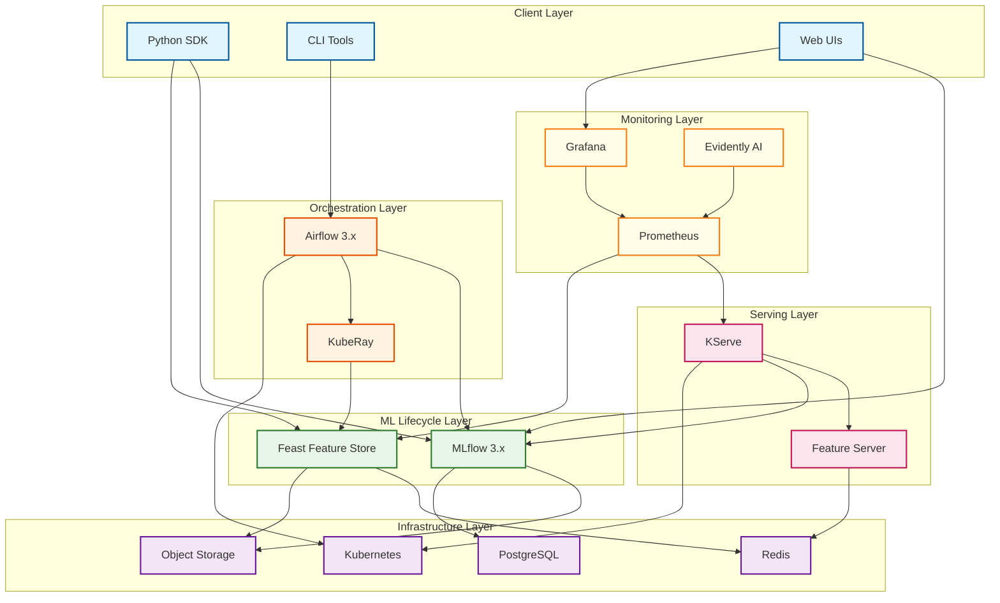

# Open-Source End-to-End ML Platform

## System Overview

An **Open-Source End-to-End ML Platform** is a production-grade machine learning infrastructure built by composing best-of-breed open-source tools rather than adopting a monolithic platform. This architecture enables organizations to build, train, deploy, and monitor ML models at scale while maintaining vendor independence, flexibility, and cost efficiency.

The platform integrates **MLflow** for experiment tracking and model registry, **Feast** for feature management, **KServe** for model serving, **Airflow/Prefect** for pipeline orchestration, and **Prometheus/Grafana** with **Evidently AI** for monitoring—all running natively on Kubernetes.

---

## Key Characteristics

| Characteristic | Description |
|----------------|-------------|
| **Architecture Style** | Modular, best-of-breed OSS composition |
| **Deployment Model** | Kubernetes-native, cloud-agnostic |
| **Primary Pattern** | Feature store-centric with train-serve consistency |
| **Workload Type** | Mixed (training pipelines + real-time inference + batch scoring) |
| **Scale Target** | 10K+ models, 100K+ features, 1M+ predictions/day |
| **Complexity Rating** | **Very High** |

---

## Core Component Stack

| Layer | Component | Purpose | Alternatives |
|-------|-----------|---------|--------------|
| **Experiment Tracking** | MLflow 3.x | Experiments, metrics, artifacts, GenAI tracing | Weights & Biases, Neptune |
| **Model Registry** | MLflow Registry | Model versioning, staging, governance | Seldon, custom registry |
| **Feature Store** | Feast | Feature management, online/offline serving | Tecton, Hopsworks |
| **Model Serving** | KServe | Serverless inference, auto-scaling, LLM support | Seldon Core, BentoML |
| **Pipeline Orchestration** | Airflow 3.x | DAG-based workflows, event-driven scheduling | Prefect 3.x, Dagster |
| **Distributed Training** | KubeRay | Ray clusters on Kubernetes | Kubeflow Training Operator |
| **Monitoring** | Prometheus + Grafana | Metrics collection, visualization, alerting | Datadog, New Relic |
| **Drift Detection** | Evidently AI | Data drift, model performance monitoring | WhyLabs, Fiddler |

---

## Quick Navigation

| Document | Description |
|----------|-------------|
| [01 - Requirements & Estimations](./01-requirements-and-estimations.md) | Functional/non-functional requirements, capacity planning, SLOs |
| [02 - High-Level Design](./02-high-level-design.md) | Architecture diagrams, data flows, key decisions |
| [03 - Low-Level Design](./03-low-level-design.md) | Data models, API design, algorithms |
| [04 - Deep Dive & Bottlenecks](./04-deep-dive-and-bottlenecks.md) | Feast, KServe, MLflow internals, bottleneck analysis |
| [05 - Scalability & Reliability](./05-scalability-and-reliability.md) | Scaling strategies, fault tolerance, disaster recovery |
| [06 - Security & Compliance](./06-security-and-compliance.md) | AuthN/AuthZ, encryption, ML governance, EU AI Act |
| [07 - Observability](./07-observability.md) | Metrics, logging, tracing, drift detection, alerting |
| [08 - Interview Guide](./08-interview-guide.md) | 45-min strategy, trap questions, trade-offs, quick reference |

---

## Why Open-Source Composition?

### The Monolithic vs Modular Decision

| Approach | Pros | Cons |
|----------|------|------|
| **Monolithic (Kubeflow/SageMaker)** | Integrated experience, single vendor support | Vendor lock-in, all-or-nothing adoption, slower updates |
| **Modular OSS Composition** | Best-of-breed tools, no lock-in, community-driven innovation | Integration complexity, more ops overhead |

### When to Choose OSS Composition

- **Strong platform engineering team** with Kubernetes expertise
- **Diverse ML workloads** (traditional ML, deep learning, LLMs)
- **Regulatory requirements** demanding data sovereignty
- **Cost optimization** priority over managed services
- **Multi-cloud or hybrid** deployment requirements

---

## Architecture at a Glance

---

## Component Version Matrix (2025-2026)

| Component | Recommended Version | Key Features Used |
|-----------|---------------------|-------------------|
| **MLflow** | 3.x | LoggedModel, GenAI tracing, LLM evaluation |
| **Feast** | 0.40+ | Stream feature views, on-demand transforms |
| **KServe** | 0.15+ | ModelMesh, InferenceGraph, LLM serving |
| **Airflow** | 3.x | Assets, event-driven scheduling |
| **Ray** | 2.x | Distributed training, KubeRay operator |
| **Kubernetes** | 1.28+ | Gateway API, GPU scheduling |
| **Prometheus** | 2.x | Remote write, exemplars |
| **Evidently** | 0.5+ | Test suites, monitoring dashboards |

---

## Platform Capabilities Matrix

| Capability | Component | Maturity |
|------------|-----------|----------|
| **Experiment Tracking** | MLflow Tracking | Production |
| **Model Registry** | MLflow Model Registry | Production |
| **Feature Management** | Feast | Production |
| **Online Feature Serving** | Feast Feature Server | Production |
| **Batch Scoring** | KServe + Airflow | Production |
| **Real-time Inference** | KServe | Production |
| **LLM Serving** | KServe + vLLM | GA (2025) |
| **Distributed Training** | KubeRay | Production |
| **Pipeline Orchestration** | Airflow | Production |
| **Data Drift Detection** | Evidently AI | Production |
| **GenAI Tracing** | MLflow Tracing | GA (2025) |

---

## Comparison with Proprietary Platforms

| Feature | OSS Composition | Kubeflow | SageMaker | Vertex AI |
|---------|-----------------|----------|-----------|-----------|
| **Vendor Lock-in** | None | Low | High | High |
| **Setup Complexity** | High | Medium | Low | Low |
| **Flexibility** | Maximum | High | Medium | Medium |
| **Cost Control** | Full | Full | Limited | Limited |
| **Community Support** | Excellent | Good | N/A | N/A |
| **GenAI Support** | Excellent | Good | Good | Excellent |
| **Multi-cloud** | Native | Yes | No | No |

---

## Real-World Adoption

| Company | Stack | Scale |
|---------|-------|-------|
| **Uber** | Ray + Kubernetes (migrated 2024) | 1.5-4x training speedup |
| **Lyft** | Hybrid (K8s serving + SageMaker training) | Millions predictions/sec |
| **Spotify** | Ray + custom orchestration | 42K+ pipelines |
| **Instacart** | Feast + custom serving | Production feature store |
| **Twilio** | Feast + MLflow | Feature management |

---

## Key Design Principles

1. **Feature Store-Centric**: Feast as the foundation for train-serve consistency
2. **Kubernetes-Native**: All components deploy as K8s resources
3. **GitOps-Ready**: Infrastructure and ML artifacts version-controlled
4. **Composable**: Swap components without platform rewrite
5. **Observable**: Metrics, logs, traces from every component
6. **Secure by Default**: RBAC, encryption, audit logging built-in

---

## Document Sections Summary

| Section | Key Topics | Pages |
|---------|------------|-------|
| **Requirements** | FR/NFR, capacity planning, SLOs | ~15 |
| **High-Level Design** | 5-layer architecture, data flows | ~20 |
| **Low-Level Design** | Schemas, APIs, algorithms | ~25 |
| **Deep Dives** | Feast, KServe, MLflow internals | ~25 |
| **Scalability** | Auto-scaling, DR, multi-region | ~18 |
| **Security** | AuthN/AuthZ, governance, compliance | ~15 |
| **Observability** | Metrics, drift, alerting | ~20 |
| **Interview Guide** | Pacing, traps, quick reference | ~18 |

---

## References

- [MLflow 3.0 Documentation](https://mlflow.org/docs/latest/)
- [Feast Feature Store](https://feast.dev/)
- [KServe Documentation](https://kserve.github.io/website/)
- [Apache Airflow 3.0](https://airflow.apache.org/)
- [Ray on Kubernetes](https://docs.ray.io/en/latest/cluster/kubernetes/)
- [Evidently AI](https://www.evidentlyai.com/)
- [Kubeflow Architecture](https://www.kubeflow.org/docs/started/architecture/)
