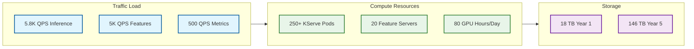

# Requirements and Capacity Estimations

## Functional Requirements

### Core Platform Capabilities

| ID | Requirement | Priority | Component |
|----|-------------|----------|-----------|
| **FR-01** | Track experiments with parameters, metrics, and artifacts | P0 | MLflow |
| **FR-02** | Version and register models with stage management | P0 | MLflow Registry |
| **FR-03** | Define, compute, and serve features with online/offline stores | P0 | Feast |
| **FR-04** | Deploy models for real-time inference with auto-scaling | P0 | KServe |
| **FR-05** | Orchestrate training pipelines with DAG-based workflows | P0 | Airflow |
| **FR-06** | Monitor model performance and detect data drift | P0 | Evidently |
| **FR-07** | Support distributed training across multiple GPUs/nodes | P1 | KubeRay |
| **FR-08** | Batch scoring for offline predictions | P1 | KServe + Airflow |
| **FR-09** | Track GenAI/LLM experiments with tracing | P1 | MLflow Tracing |
| **FR-10** | Serve LLM models with optimized inference | P1 | KServe + vLLM |

### Experiment Tracking Requirements

| Capability | Description |
|------------|-------------|
| **Parameter Logging** | Store hyperparameters, configs, and metadata per run |
| **Metric Tracking** | Log scalar metrics with step-based history |
| **Artifact Storage** | Persist models, datasets, plots, and custom files |
| **Run Comparison** | Compare metrics across multiple runs |
| **Experiment Organization** | Group runs into logical experiments |
| **GenAI Tracing** | Capture LLM input/output/latency at span level |
| **Search & Filter** | Query runs by metrics, parameters, tags |

### Feature Store Requirements

| Capability | Description |
|------------|-------------|
| **Feature Definition** | Declarative Python DSL for feature specification |
| **Offline Store** | Historical feature retrieval for training |
| **Online Store** | Low-latency feature serving for inference |
| **Point-in-Time Joins** | Correct temporal feature retrieval |
| **Streaming Ingestion** | Real-time feature updates from event streams |
| **On-Demand Transforms** | Request-time feature computation |
| **Feature Discovery** | Search and browse available features |
| **Lineage Tracking** | Feature-to-model dependency mapping |

### Model Serving Requirements

| Capability | Description |
|------------|-------------|
| **Multi-Framework** | Support TensorFlow, PyTorch, XGBoost, sklearn, ONNX |
| **Auto-Scaling** | Scale replicas based on traffic/GPU utilization |
| **Scale-to-Zero** | Reduce costs for infrequent models |
| **Canary Deployments** | Gradual traffic shifting for new versions |
| **A/B Testing** | Route traffic to multiple model variants |
| **Inference Pipeline** | Chain pre-processing, model, post-processing |
| **Batch Predictions** | Process large datasets asynchronously |
| **LLM Serving** | Optimized inference for large language models |

### Pipeline Orchestration Requirements

| Capability | Description |
|------------|-------------|
| **DAG Definition** | Define workflows as directed acyclic graphs |
| **Scheduling** | Cron-based and event-driven triggering |
| **Retry Logic** | Configurable retries with backoff |
| **Parallelization** | Execute independent tasks concurrently |
| **Dynamic DAGs** | Generate workflows programmatically |
| **Asset Tracking** | Data-driven pipeline triggering |
| **Human-in-Loop** | Pause workflows for approval |

---

## Out of Scope

| Area | Exclusion | Rationale |
|------|-----------|-----------|
| **Data Labeling** | Label management and annotation tools | Use dedicated tools (Label Studio, Scale AI) |
| **Notebook Environment** | Hosted Jupyter/JupyterHub | Separate infrastructure concern |
| **Data Catalog** | Full metadata management | Integrate with OpenMetadata/DataHub |
| **AutoML** | Automated model selection | Can add Optuna/Ray Tune as extension |
| **Data Version Control** | Dataset versioning | Integrate with DVC/lakeFS |

---

## Non-Functional Requirements

### Performance Requirements

| Metric | Target | Justification |
|--------|--------|---------------|
| **Feature Lookup Latency (P50)** | <10ms | Real-time inference requirement |
| **Feature Lookup Latency (P99)** | <50ms | Tail latency for SLA compliance |
| **Model Inference Latency (P50)** | <50ms | Interactive application requirement |
| **Model Inference Latency (P99)** | <200ms | Worst-case user experience |
| **LLM Inference TTFT** | <500ms | Time to first token for streaming |
| **Experiment Log Latency** | <100ms | Non-blocking training workflow |
| **Pipeline Scheduling Latency** | <5s | Near-real-time event response |

### Availability Requirements

| Component | Target | Justification |
|-----------|--------|---------------|
| **Model Serving (KServe)** | 99.9% | Critical path for production applications |
| **Feature Server** | 99.9% | Required for real-time inference |
| **MLflow Tracking** | 99.5% | Training can tolerate brief outages |
| **MLflow Registry** | 99.9% | Deployment pipeline dependency |
| **Airflow Scheduler** | 99.5% | Pipelines can catch up after recovery |
| **Online Feature Store** | 99.9% | Critical path component |
| **Offline Feature Store** | 99% | Batch processing tolerates delays |

### Consistency Model

| Component | Consistency | Rationale |
|-----------|-------------|-----------|
| **Model Registry** | Strong (CP) | Deployment correctness requires latest version |
| **Online Feature Store** | Eventual (AP) | Slight staleness acceptable for availability |
| **Offline Feature Store** | Strong | Training correctness requires exact point-in-time |
| **Experiment Tracking** | Eventual | Metrics aggregation tolerates delays |
| **Pipeline State** | Strong | Task execution order must be deterministic |

### Durability Requirements

| Data Type | Durability | Storage Strategy |
|-----------|------------|------------------|
| **Model Artifacts** | 99.999999999% (11 nines) | Object storage with cross-region replication |
| **Experiment Metadata** | 99.99% | PostgreSQL with daily backups |
| **Feature Definitions** | 99.99% | Git-versioned, stored in database |
| **Feature Values (Online)** | 99.9% | Redis with persistence (can rebuild from offline) |
| **Feature Values (Offline)** | 99.999999999% | Object storage / data lake |
| **Pipeline Logs** | 99.99% | Centralized logging with retention |

---

## Capacity Estimations

### Assumptions

| Parameter | Value | Notes |
|-----------|-------|-------|
| **ML Teams** | 50 | Data science and ML engineering teams |
| **Data Scientists per Team** | 5 | Active model developers |
| **Models in Production** | 500 | Actively serving predictions |
| **Models in Registry (Total)** | 10,000 | Including archived versions |
| **Features Defined** | 100,000 | Across all feature groups |
| **Average Model Size** | 500 MB | Compressed artifact |
| **Predictions per Model per Day** | 100,000 | Average across all models |
| **Training Runs per Day** | 1,000 | Experimentation volume |

### Traffic Estimations

#### Read vs Write Patterns

| Operation | Type | Ratio |
|-----------|------|-------|
| **Feature Lookup** | Read | 95% |
| **Feature Ingestion** | Write | 5% |
| **Model Inference** | Read | 99% |
| **Model Deployment** | Write | 1% |
| **Experiment Query** | Read | 80% |
| **Experiment Log** | Write | 20% |

#### Queries Per Second (QPS)

| Operation | Average QPS | Peak QPS | Calculation |
|-----------|-------------|----------|-------------|
| **Online Feature Lookup** | 5,000 | 15,000 | 500 models × 100K/day ÷ 86400 × 0.9 (90% need features) |
| **Model Inference** | 5,800 | 17,400 | 500 models × 100K/day ÷ 86400 |
| **Offline Feature Retrieval** | 50 | 200 | Training jobs with batch lookups |
| **Experiment Metric Writes** | 500 | 2,000 | 1000 runs × 500 metrics/run ÷ 86400 |
| **Model Registry Reads** | 100 | 500 | Deployment and inference checks |
| **Pipeline Task Executions** | 10 | 50 | Airflow DAG tasks |

### Storage Estimations

#### Year 1 Storage

| Data Type | Size | Calculation |
|-----------|------|-------------|
| **Model Artifacts** | 5 TB | 10,000 models × 500 MB average |
| **Experiment Artifacts** | 2 TB | Plots, datasets, checkpoints |
| **Experiment Metadata** | 50 GB | Run records, metrics, parameters |
| **Offline Feature Data** | 10 TB | Historical features for training |
| **Online Feature Data** | 100 GB | Hot features in Redis |
| **Logs and Traces** | 500 GB | Compressed, 30-day retention |
| **Total Year 1** | **~18 TB** | |

#### Year 5 Storage (Projected)

| Data Type | Size | Growth Factor |
|-----------|------|---------------|
| **Model Artifacts** | 25 TB | 5x (model proliferation) |
| **Experiment Artifacts** | 15 TB | 7.5x (GenAI experiments) |
| **Experiment Metadata** | 500 GB | 10x (more runs) |
| **Offline Feature Data** | 100 TB | 10x (more features, history) |
| **Online Feature Data** | 500 GB | 5x (more hot features) |
| **Logs and Traces** | 5 TB | 10x (more observability) |
| **Total Year 5** | **~146 TB** | |

### Compute Estimations

#### Training Infrastructure

| Resource | Specification | Quantity |
|----------|---------------|----------|
| **GPU Nodes** | 4x A100 (80GB) per node | 20 nodes |
| **CPU Training Nodes** | 32 vCPU, 128 GB RAM | 50 nodes |
| **Ray Head Nodes** | 16 vCPU, 64 GB RAM | 5 nodes |
| **Total GPU Hours/Day** | ~2,000 | Peak training load |

#### Serving Infrastructure

| Resource | Specification | Quantity |
|----------|---------------|----------|
| **KServe Pods (CPU models)** | 4 vCPU, 16 GB RAM | 200 pods |
| **KServe Pods (GPU models)** | 8 vCPU, 32 GB RAM, 1x T4 | 50 pods |
| **Feature Server Pods** | 4 vCPU, 16 GB RAM | 20 pods |
| **LLM Serving Pods** | 16 vCPU, 64 GB RAM, 2x A10G | 10 pods |

#### Platform Infrastructure

| Component | Specification | Replicas |
|-----------|---------------|----------|
| **MLflow Tracking Server** | 8 vCPU, 32 GB RAM | 3 |
| **Airflow Scheduler** | 4 vCPU, 16 GB RAM | 2 |
| **Airflow Workers** | 8 vCPU, 32 GB RAM | 10 |
| **PostgreSQL** | 16 vCPU, 64 GB RAM, 1 TB SSD | 3 (HA) |
| **Redis Cluster** | 8 vCPU, 64 GB RAM | 6 nodes |
| **Prometheus** | 8 vCPU, 32 GB RAM | 2 |

### Bandwidth Estimations

| Flow | Bandwidth | Calculation |
|------|-----------|-------------|
| **Feature Serving** | 500 Mbps | 15K QPS × 4 KB avg response |
| **Model Artifact Download** | 200 Mbps | Cold starts, deployments |
| **Metric Ingestion** | 50 Mbps | Experiment tracking writes |
| **Inter-Zone Replication** | 1 Gbps | HA and DR traffic |
| **Total Egress** | **~2 Gbps** | Peak load |

---

## SLOs and SLAs

### Service Level Objectives

| Service | Metric | SLO Target | Measurement Window |
|---------|--------|------------|-------------------|
| **Model Inference** | Availability | 99.9% | Monthly |
| **Model Inference** | Latency (P99) | <200ms | Hourly |
| **Model Inference** | Error Rate | <0.1% | Hourly |
| **Feature Serving** | Availability | 99.9% | Monthly |
| **Feature Serving** | Latency (P99) | <50ms | Hourly |
| **Feature Serving** | Cache Hit Rate | >90% | Daily |
| **MLflow Tracking** | Availability | 99.5% | Monthly |
| **MLflow Tracking** | Write Latency (P99) | <500ms | Hourly |
| **Pipeline Execution** | Success Rate | >95% | Weekly |
| **Pipeline Execution** | Start Delay | <30s | Per execution |

### Error Budget

| Service | SLO | Error Budget (Monthly) | Budget (Minutes) |
|---------|-----|------------------------|------------------|
| **Model Inference** | 99.9% | 0.1% | 43.8 min |
| **Feature Serving** | 99.9% | 0.1% | 43.8 min |
| **MLflow Tracking** | 99.5% | 0.5% | 219 min |
| **Airflow** | 99.5% | 0.5% | 219 min |

### SLA Commitments

| Tier | Availability | Latency (P99) | Support Response |
|------|--------------|---------------|------------------|
| **Tier 1 (Critical)** | 99.9% | <100ms | 15 min |
| **Tier 2 (Standard)** | 99.5% | <500ms | 1 hour |
| **Tier 3 (Best Effort)** | 99% | <2s | 4 hours |

---

## Capacity Planning Summary

---

## Growth Projections

| Metric | Year 1 | Year 2 | Year 3 | Year 5 |
|--------|--------|--------|--------|--------|
| **Models in Production** | 500 | 1,000 | 2,000 | 5,000 |
| **Features Defined** | 100K | 200K | 400K | 1M |
| **Daily Predictions** | 50M | 150M | 500M | 2B |
| **Training Runs/Day** | 1,000 | 2,500 | 5,000 | 10,000 |
| **Storage (TB)** | 18 | 40 | 80 | 146 |
| **GPU Hours/Day** | 2,000 | 5,000 | 10,000 | 25,000 |

---

## Cost Estimation Framework

### Compute Costs (Cloud Agnostic)

| Resource Type | Monthly Cost (Est.) | Notes |
|---------------|---------------------|-------|
| **GPU Training** | $50,000 - $100,000 | Spot instances recommended |
| **Serving Infrastructure** | $30,000 - $50,000 | Auto-scaling optimizes |
| **Platform Services** | $10,000 - $20,000 | Databases, queues, networking |
| **Storage** | $5,000 - $10,000 | Object storage + databases |
| **Total Monthly** | **$95,000 - $180,000** | Varies by scale |

### Cost Optimization Strategies

| Strategy | Savings | Implementation |
|----------|---------|----------------|
| **GPU Spot Instances** | 60-70% | For training workloads |
| **Scale-to-Zero** | 40-50% | For infrequent models |
| **ModelMesh** | 30-40% | Multi-model GPU sharing |
| **Reserved Capacity** | 30-40% | For baseline serving load |
| **Data Tiering** | 20-30% | Archive old features/artifacts |
