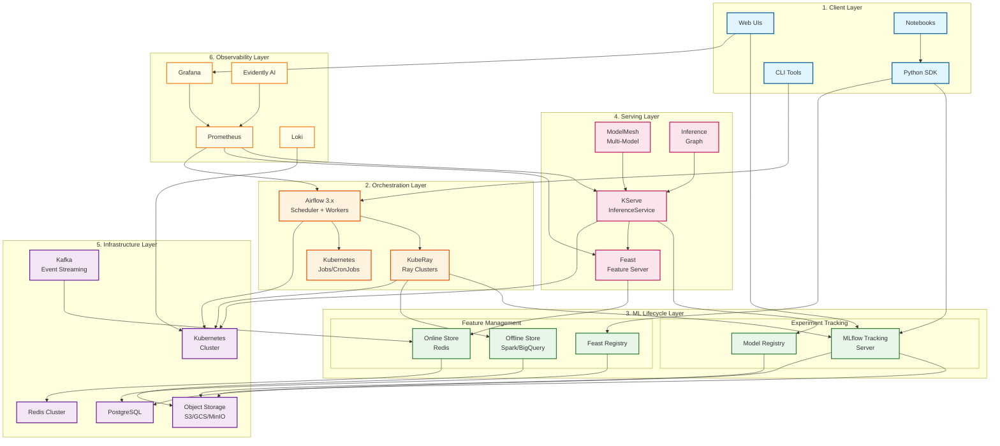
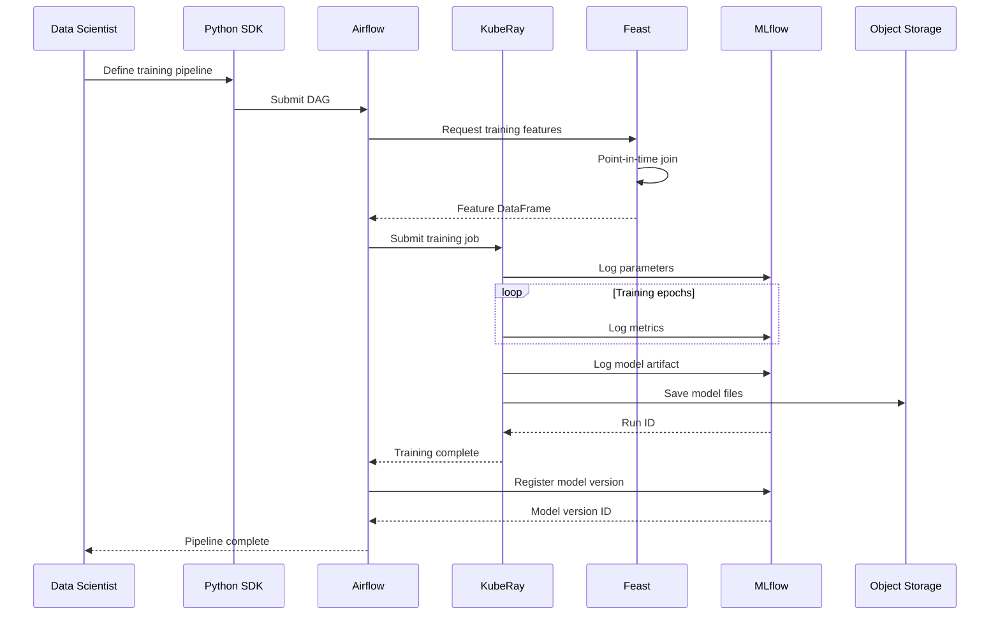
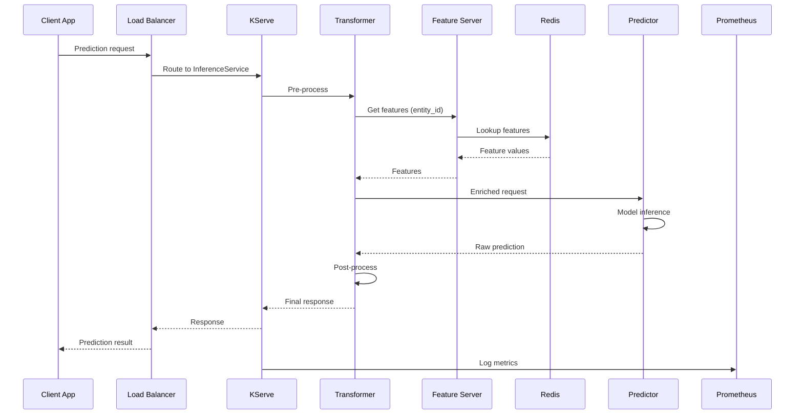
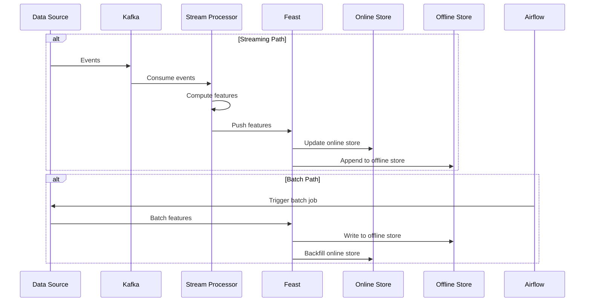
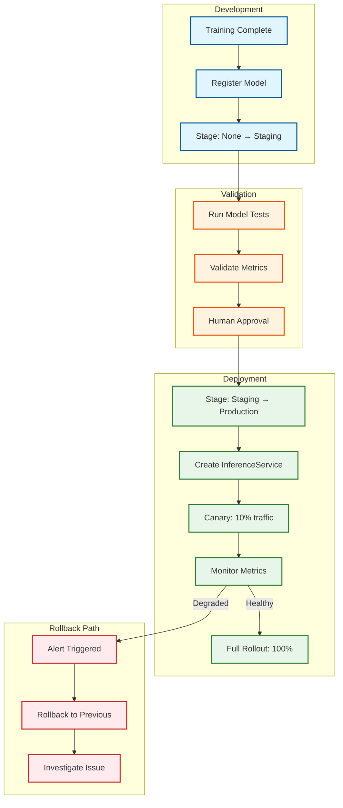
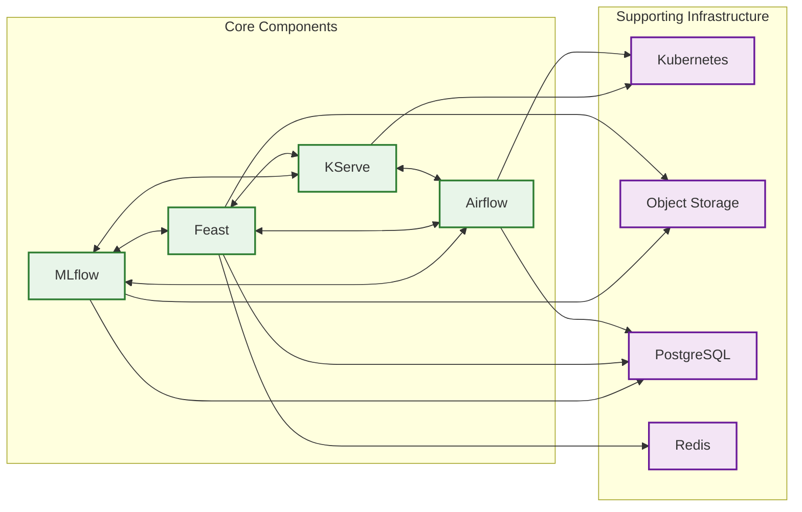
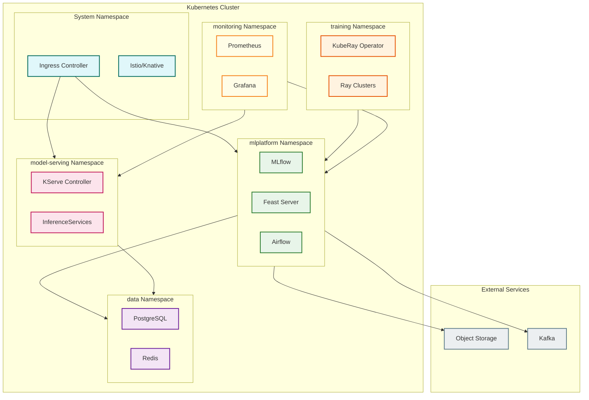

# High-Level Design

## Architecture Overview

The Open-Source End-to-End ML Platform follows a **5-layer architecture** that separates concerns while enabling seamless integration between components. This design prioritizes composability, allowing organizations to swap individual components without rewriting the entire platform.

---

## System Architecture Diagram



---

## Layer Responsibilities

### Layer 1: Client Layer

| Component | Purpose | Key Features |
|-----------|---------|--------------|
| **Python SDK** | Programmatic access to all platform services | MLflow client, Feast SDK, KServe client |
| **CLI Tools** | Command-line operations | MLflow CLI, Feast CLI, kubectl |
| **Web UIs** | Visual interfaces | MLflow UI, Airflow UI, Grafana |
| **Notebooks** | Interactive development | Jupyter integration with SDKs |

### Layer 2: Orchestration Layer

| Component | Purpose | Key Features |
|-----------|---------|--------------|
| **Airflow 3.x** | Pipeline orchestration | DAG scheduling, event-driven, Assets |
| **KubeRay** | Distributed compute | Ray clusters, auto-scaling, fault tolerance |
| **K8s Jobs** | Simple task execution | One-off jobs, CronJobs for scheduling |

### Layer 3: ML Lifecycle Layer

| Component | Purpose | Key Features |
|-----------|---------|--------------|
| **MLflow Tracking** | Experiment management | Runs, metrics, parameters, artifacts |
| **Model Registry** | Model versioning | Stages, aliases, lineage |
| **Feast Registry** | Feature metadata | Feature definitions, entities, sources |
| **Offline Store** | Historical features | Training data, point-in-time joins |
| **Online Store** | Real-time features | Low-latency serving, Redis backend |

### Layer 4: Serving Layer

| Component | Purpose | Key Features |
|-----------|---------|--------------|
| **KServe** | Model inference | Auto-scaling, canary, multi-framework |
| **Feature Server** | Feature serving API | HTTP/gRPC, batch retrieval |
| **ModelMesh** | Multi-model serving | GPU sharing, dynamic loading |
| **InferenceGraph** | Pipeline serving | Pre/post processing, ensembles |

### Layer 5: Infrastructure Layer

| Component | Purpose | Key Features |
|-----------|---------|--------------|
| **Kubernetes** | Container orchestration | Scheduling, networking, storage |
| **Object Storage** | Artifact persistence | Models, datasets, logs |
| **PostgreSQL** | Metadata storage | MLflow, Feast, Airflow metadata |
| **Redis Cluster** | Feature caching | Online store, session state |
| **Kafka** | Event streaming | Feature ingestion, triggers |

---

## Data Flow Diagrams

### Training Data Flow



### Inference Data Flow



### Feature Ingestion Flow



---

## Model Deployment Flow



---

## Key Architectural Decisions

### Decision 1: Modular Composition vs Monolithic Platform

| Option | Pros | Cons |
|--------|------|------|
| **Modular OSS Composition** | Best-of-breed tools, no lock-in, independent updates | Integration complexity, more operational overhead |
| **Kubeflow (Monolithic)** | Integrated experience, single deployment | All-or-nothing, slower component updates |
| **Managed Platform (SageMaker)** | Fully managed, low ops | Vendor lock-in, less flexibility |

**Decision:** Modular OSS Composition

**Rationale:**
- Maximum flexibility to adopt emerging tools (e.g., vLLM for LLMs)
- No vendor lock-in enables multi-cloud deployment
- Each component can be upgraded independently
- Strong platform engineering team can handle integration

### Decision 2: Feature Store as Foundation

| Option | Pros | Cons |
|--------|------|------|
| **Feature Store-Centric** | Train-serve consistency, feature reuse | Additional complexity, learning curve |
| **Ad-hoc Feature Engineering** | Simpler initial setup | Feature skew, duplicate work, inconsistency |
| **Embedded Features** | Minimal infrastructure | Tightly coupled, hard to maintain |

**Decision:** Feature Store-Centric (Feast)

**Rationale:**
- Train-serve skew is the #1 cause of ML production bugs
- Feast provides point-in-time correctness for training
- Features become reusable assets across models
- Online/offline serving from single definition

### Decision 3: Orchestration Engine

| Option | Pros | Cons |
|--------|------|------|
| **Airflow 3.x** | Mature, large community, event-driven (3.x) | DAG-centric can be rigid |
| **Prefect 3.x** | Pythonic, transactional, fast | Smaller community |
| **Dagster** | Asset-centric, great lineage | Learning curve |
| **Kubeflow Pipelines** | K8s-native, integrated | Coupled to Kubeflow |

**Decision:** Airflow 3.x (primary), Prefect 3.x (alternative)

**Rationale:**
- Airflow 3.x adds event-driven scheduling critical for ML
- Largest community and ecosystem (320M+ downloads)
- Assets feature enables data-driven pipelines
- Well-understood by data engineering teams

### Decision 4: Model Serving Infrastructure

| Option | Pros | Cons |
|--------|------|------|
| **KServe** | CNCF project, serverless, LLM support | Requires Knative/Istio |
| **Seldon Core 2** | Drift detection built-in | Less serverless-native |
| **BentoML** | Simple developer experience | Less K8s-native |
| **Ray Serve** | Unified with training | Separate from K8s ecosystem |

**Decision:** KServe

**Rationale:**
- CNCF incubating project with strong governance
- Native serverless inference with scale-to-zero
- ModelMesh for efficient multi-model GPU sharing
- First-class LLM support in v0.15+
- InferenceGraph for complex pipelines

### Decision 5: Distributed Training

| Option | Pros | Cons |
|--------|------|------|
| **KubeRay** | Unified Ray ecosystem, auto-scaling | Learning Ray concepts |
| **Kubeflow Training Operator** | Native K8s CRDs | Limited to training |
| **Horovod** | Framework-agnostic | Manual setup |

**Decision:** KubeRay

**Rationale:**
- Uber, Spotify, OpenAI use Ray at scale
- Unified API for training and tuning
- KubeRay operator handles cluster lifecycle
- RayJob provides simple submission interface

---

## Architecture Pattern Checklist

| Pattern | Decision | Rationale |
|---------|----------|-----------|
| **Sync vs Async Communication** | Async for training, Sync for inference | Training tolerates delays; inference needs low latency |
| **Event-driven vs Request-response** | Event-driven pipelines, request-response serving | Pipelines triggered by data; serving is synchronous |
| **Push vs Pull Model** | Push for streaming features, Pull for batch | Real-time updates pushed; batch pulls on schedule |
| **Stateless vs Stateful Services** | Stateless serving, Stateful orchestration | Serving scales horizontally; orchestration needs state |
| **Read-heavy vs Write-heavy** | Read-heavy (95% reads) | Inference dominates traffic |
| **Real-time vs Batch Processing** | Both | Online inference + batch scoring |
| **Edge vs Origin Processing** | Origin (data center) | ML workloads need GPU resources |

---

## Component Integration Matrix



---

## Integration Points

### MLflow ↔ Feast Integration

```
Training Pipeline:
1. Feast provides point-in-time features for training dataset
2. MLflow logs feature schema as run artifact
3. Model registration includes feature dependencies

Inference Pipeline:
1. KServe loads model from MLflow Registry
2. Transformer calls Feast Feature Server
3. Features enriched request sent to predictor
```

### MLflow ↔ KServe Integration

```
Deployment Flow:
1. Model promoted to "Production" stage in MLflow
2. Airflow detects promotion event
3. Pipeline creates/updates KServe InferenceService
4. InferenceService pulls model from MLflow artifact store

Artifact Format:
- MLflow saves models in MLmodel format
- KServe supports mlflow:// URI scheme
- Model loaded via MLServer or custom runtime
```

### Feast ↔ KServe Integration

```
Real-time Enrichment:
1. KServe Transformer receives raw request
2. Transformer extracts entity keys
3. HTTP call to Feast Feature Server
4. Features merged with request
5. Enriched payload sent to Predictor
```

### Airflow ↔ All Components

```
Orchestration Patterns:
- Training: Airflow → KubeRay → MLflow
- Feature Backfill: Airflow → Feast (batch materialize)
- Model Deployment: Airflow → MLflow → KServe
- Monitoring: Airflow → Evidently → Alerting
```

---

## Deployment Topology

### Single-Cluster Deployment



### Multi-Zone High Availability

| Component | Zone A | Zone B | Zone C |
|-----------|--------|--------|--------|
| **KServe Pods** | 3 replicas | 3 replicas | 3 replicas |
| **Feature Server** | 2 replicas | 2 replicas | 2 replicas |
| **MLflow Server** | 1 replica | 1 replica (standby) | - |
| **Airflow Scheduler** | Active | Standby | - |
| **PostgreSQL** | Primary | Replica | Replica |
| **Redis** | 2 nodes | 2 nodes | 2 nodes |

---

## Technology Stack Summary

| Layer | Technology | Version | Purpose |
|-------|------------|---------|---------|
| **Container Runtime** | containerd | 1.7+ | Container execution |
| **Orchestration** | Kubernetes | 1.28+ | Cluster management |
| **Service Mesh** | Istio | 1.20+ | Traffic management, mTLS |
| **Serverless** | Knative | 1.12+ | Scale-to-zero, revisions |
| **Experiment Tracking** | MLflow | 3.x | Experiments, model registry |
| **Feature Store** | Feast | 0.40+ | Feature management |
| **Model Serving** | KServe | 0.15+ | Inference, auto-scaling |
| **Orchestration** | Airflow | 3.x | Pipeline workflows |
| **Distributed Compute** | Ray | 2.x | Training, tuning |
| **Database** | PostgreSQL | 15+ | Metadata storage |
| **Cache** | Redis | 7+ | Online features, sessions |
| **Object Storage** | MinIO/S3 | - | Artifacts, datasets |
| **Streaming** | Kafka | 3.x | Event ingestion |
| **Monitoring** | Prometheus | 2.x | Metrics collection |
| **Visualization** | Grafana | 10+ | Dashboards |
| **Drift Detection** | Evidently | 0.5+ | Model monitoring |
| **Logging** | Loki | 2.x | Log aggregation |
