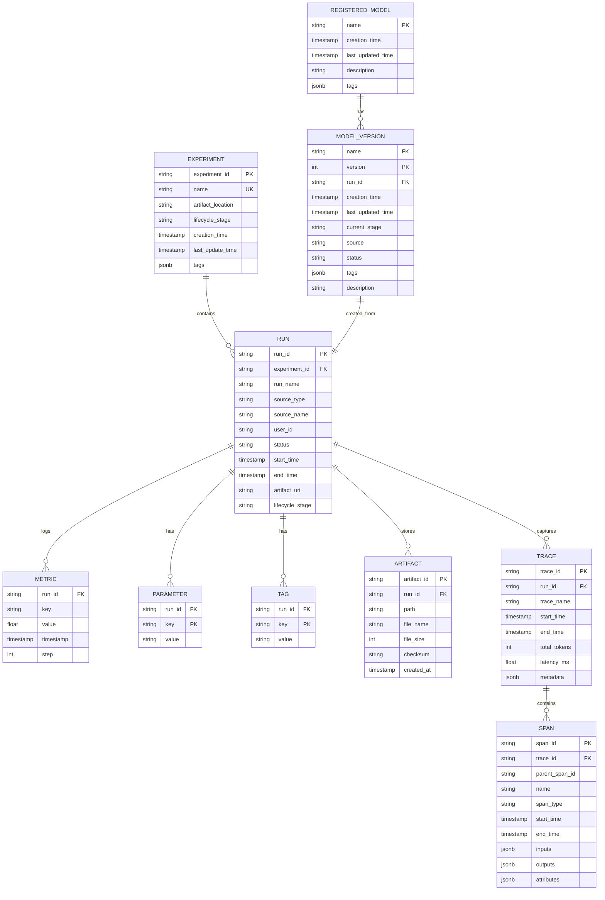
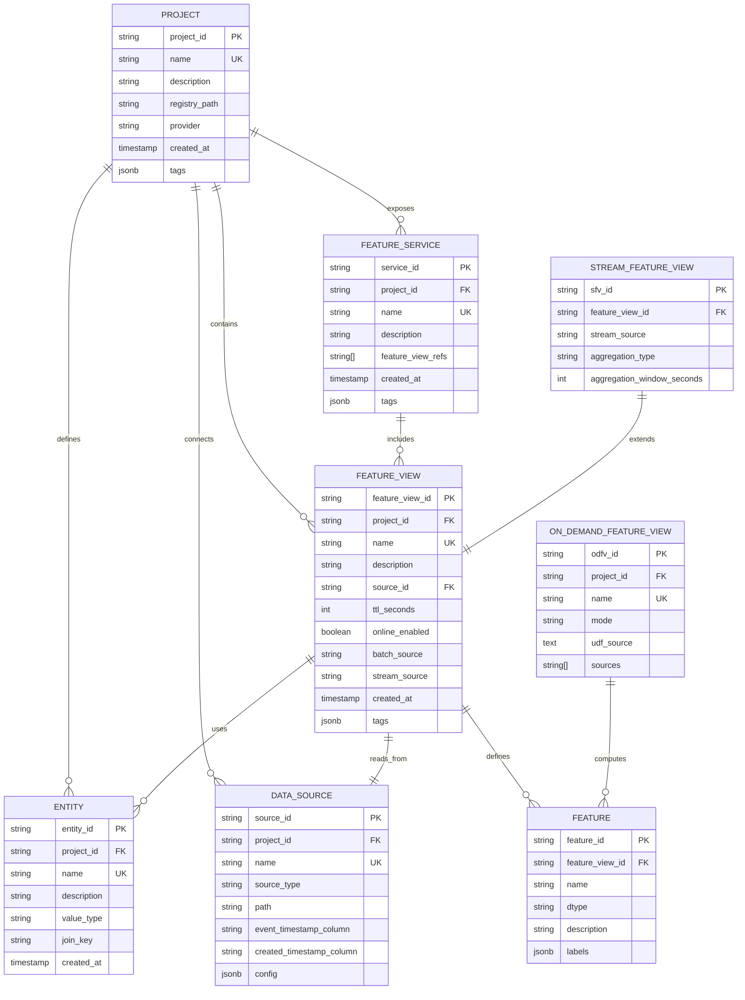

# Low-Level Design

## Data Models

### MLflow Experiment Tracking Schema



### Feast Feature Store Schema



### KServe Serving Configuration Schema

```yaml
# InferenceService Custom Resource Definition
InferenceService:
  apiVersion: serving.kserve.io/v1beta1
  kind: InferenceService
  metadata:
    name: string                    # Unique service name
    namespace: string               # K8s namespace
    labels: map[string]string       # Service labels
    annotations: map[string]string  # Annotations (autoscaling, etc.)
  spec:
    predictor:
      model:
        modelFormat:
          name: string              # sklearn, xgboost, tensorflow, pytorch, mlflow
          version: string           # Framework version
        protocolVersion: string     # v1, v2, grpc-v2
        storageUri: string          # Model artifact location
        runtime: string             # Inference runtime
        runtimeVersion: string      # Runtime version
      resources:
        requests:
          cpu: string
          memory: string
          nvidia.com/gpu: string
        limits:
          cpu: string
          memory: string
          nvidia.com/gpu: string
      minReplicas: int             # Minimum pods (0 for scale-to-zero)
      maxReplicas: int             # Maximum pods
      scaleTarget: int             # Target concurrency
      scaleMetric: string          # concurrency, rps, cpu, memory
    transformer:                   # Optional pre/post processing
      containers:
        - name: string
          image: string
          resources: ResourceRequirements
          env: []EnvVar
    explainer:                     # Optional model explanations
      containers:
        - name: string
          image: string
```

### Airflow Pipeline Schema

```yaml
# DAG Configuration Model
DAG:
  dag_id: string                   # Unique identifier
  description: string              # Human-readable description
  schedule: string | Asset[]       # Cron expression or asset triggers
  start_date: datetime             # First run date
  end_date: datetime               # Last run date (optional)
  catchup: boolean                 # Backfill missed runs
  max_active_runs: int             # Concurrent DAG runs
  default_args:
    owner: string
    retries: int
    retry_delay: timedelta
    execution_timeout: timedelta
    on_failure_callback: callable
  tags: string[]                   # Categorization tags

# Task Configuration
Task:
  task_id: string                  # Unique within DAG
  operator: string                 # Operator type
  params: map                      # Operator-specific parameters
  pool: string                     # Resource pool
  priority_weight: int             # Scheduling priority
  queue: string                    # Executor queue
  trigger_rule: string             # all_success, all_failed, one_success, etc.
  depends_on_past: boolean         # Wait for previous run
  retries: int                     # Task-level retries
```

---

## API Design

### MLflow Tracking API

#### Log Experiment Run

```
POST /api/2.0/mlflow/runs/create

Request:
{
  "experiment_id": "1",
  "run_name": "model-training-v3",
  "start_time": 1706140800000,
  "tags": [
    {"key": "mlflow.source.name", "value": "training.py"},
    {"key": "model_type", "value": "xgboost"}
  ]
}

Response:
{
  "run": {
    "info": {
      "run_id": "abc123def456",
      "experiment_id": "1",
      "run_name": "model-training-v3",
      "status": "RUNNING",
      "start_time": 1706140800000,
      "artifact_uri": "s3://mlflow-artifacts/1/abc123def456/artifacts"
    }
  }
}
```

#### Log Metrics (Batch)

```
POST /api/2.0/mlflow/runs/log-batch

Request:
{
  "run_id": "abc123def456",
  "metrics": [
    {"key": "accuracy", "value": 0.95, "timestamp": 1706140900000, "step": 100},
    {"key": "loss", "value": 0.05, "timestamp": 1706140900000, "step": 100}
  ],
  "params": [
    {"key": "learning_rate", "value": "0.01"},
    {"key": "max_depth", "value": "6"}
  ]
}

Response:
{}  // 200 OK
```

#### Register Model Version

```
POST /api/2.0/mlflow/model-versions/create

Request:
{
  "name": "fraud-detection-model",
  "source": "s3://mlflow-artifacts/1/abc123def456/artifacts/model",
  "run_id": "abc123def456",
  "description": "XGBoost model with 95% accuracy",
  "tags": [
    {"key": "framework", "value": "xgboost"},
    {"key": "feature_schema_version", "value": "v2"}
  ]
}

Response:
{
  "model_version": {
    "name": "fraud-detection-model",
    "version": "3",
    "creation_timestamp": 1706141000000,
    "current_stage": "None",
    "source": "s3://mlflow-artifacts/1/abc123def456/artifacts/model",
    "run_id": "abc123def456",
    "status": "READY"
  }
}
```

#### Transition Model Stage

```
POST /api/2.0/mlflow/model-versions/transition-stage

Request:
{
  "name": "fraud-detection-model",
  "version": "3",
  "stage": "Production",
  "archive_existing_versions": true
}

Response:
{
  "model_version": {
    "name": "fraud-detection-model",
    "version": "3",
    "current_stage": "Production"
  }
}
```

### Feast Feature Server API

#### Get Online Features

```
POST /get-online-features

Request:
{
  "feature_service": "fraud_detection_features",
  "entities": {
    "user_id": ["user_001", "user_002", "user_003"]
  },
  "full_feature_names": true
}

Response:
{
  "metadata": {
    "feature_names": [
      "user_id",
      "fraud_detection_features__user_transaction_count_7d",
      "fraud_detection_features__user_avg_transaction_amount_30d",
      "fraud_detection_features__user_distinct_merchants_7d"
    ]
  },
  "results": [
    {
      "values": ["user_001", 15, 250.50, 8],
      "statuses": ["PRESENT", "PRESENT", "PRESENT", "PRESENT"],
      "event_timestamps": ["2024-01-25T10:00:00Z", "2024-01-25T09:55:00Z", "2024-01-25T09:55:00Z", "2024-01-25T09:55:00Z"]
    },
    {
      "values": ["user_002", 3, 1500.00, 2],
      "statuses": ["PRESENT", "PRESENT", "PRESENT", "PRESENT"],
      "event_timestamps": ["2024-01-25T10:00:00Z", "2024-01-25T09:58:00Z", "2024-01-25T09:58:00Z", "2024-01-25T09:58:00Z"]
    }
  ]
}
```

#### Push Features (Streaming)

```
POST /push

Request:
{
  "push_source_name": "user_transaction_events",
  "df": {
    "user_id": ["user_001"],
    "transaction_amount": [150.00],
    "merchant_id": ["merchant_xyz"],
    "event_timestamp": ["2024-01-25T10:05:00Z"]
  },
  "to": "online_and_offline"  // online, offline, or online_and_offline
}

Response:
{
  "status": "ok",
  "written_to": ["online", "offline"]
}
```

#### Materialize Features (Batch)

```
POST /materialize

Request:
{
  "feature_views": ["user_transaction_features"],
  "start_date": "2024-01-01T00:00:00Z",
  "end_date": "2024-01-25T00:00:00Z"
}

Response:
{
  "status": "completed",
  "feature_views_materialized": ["user_transaction_features"],
  "rows_written": 1500000,
  "duration_seconds": 120
}
```

### KServe Inference API (V2 Protocol)

#### Model Inference

```
POST /v2/models/{model_name}/infer

Request:
{
  "id": "request-001",
  "inputs": [
    {
      "name": "input",
      "shape": [1, 10],
      "datatype": "FP32",
      "data": [0.1, 0.2, 0.3, 0.4, 0.5, 0.6, 0.7, 0.8, 0.9, 1.0]
    }
  ],
  "parameters": {
    "content_type": "np"
  }
}

Response:
{
  "id": "request-001",
  "model_name": "fraud-detector",
  "model_version": "3",
  "outputs": [
    {
      "name": "output",
      "shape": [1, 2],
      "datatype": "FP32",
      "data": [0.15, 0.85]
    }
  ]
}
```

#### Model Metadata

```
GET /v2/models/{model_name}

Response:
{
  "name": "fraud-detector",
  "versions": ["1", "2", "3"],
  "platform": "xgboost",
  "inputs": [
    {
      "name": "input",
      "datatype": "FP32",
      "shape": [-1, 10]
    }
  ],
  "outputs": [
    {
      "name": "output",
      "datatype": "FP32",
      "shape": [-1, 2]
    }
  ]
}
```

#### Health Check

```
GET /v2/health/ready

Response:
{
  "status": "ready"
}
```

### Airflow REST API

#### Trigger DAG Run

```
POST /api/v1/dags/{dag_id}/dagRuns

Request:
{
  "dag_run_id": "manual__2024-01-25T10:00:00",
  "logical_date": "2024-01-25T10:00:00Z",
  "conf": {
    "model_version": "3",
    "feature_service": "fraud_detection_features",
    "training_data_start": "2024-01-01",
    "training_data_end": "2024-01-24"
  },
  "note": "Triggered by model promotion"
}

Response:
{
  "dag_id": "model_training_pipeline",
  "dag_run_id": "manual__2024-01-25T10:00:00",
  "logical_date": "2024-01-25T10:00:00Z",
  "execution_date": "2024-01-25T10:00:00Z",
  "start_date": "2024-01-25T10:00:05Z",
  "state": "running"
}
```

#### Get DAG Run Status

```
GET /api/v1/dags/{dag_id}/dagRuns/{dag_run_id}

Response:
{
  "dag_id": "model_training_pipeline",
  "dag_run_id": "manual__2024-01-25T10:00:00",
  "state": "success",
  "start_date": "2024-01-25T10:00:05Z",
  "end_date": "2024-01-25T10:45:30Z",
  "external_trigger": true,
  "conf": {
    "model_version": "3"
  }
}
```

---

## API Rate Limiting

| Endpoint | Rate Limit | Burst | Notes |
|----------|------------|-------|-------|
| **MLflow Log Metrics** | 1000/min | 100 | Per run |
| **MLflow Log Artifacts** | 100/min | 10 | Per run |
| **Feast Get Features** | 10000/min | 1000 | Per service |
| **Feast Push Features** | 5000/min | 500 | Per source |
| **KServe Inference** | 50000/min | 5000 | Per model |
| **Airflow Trigger DAG** | 100/min | 10 | Per DAG |

---

## Core Algorithms

### Point-in-Time Feature Retrieval

The point-in-time join algorithm prevents data leakage by ensuring features are retrieved as they existed at the time of each training example.

```
ALGORITHM PointInTimeJoin
INPUT:
  entity_df: DataFrame with entity_id and event_timestamp
  feature_views: List of feature view names
  ttl: Time-to-live for feature staleness

OUTPUT:
  enriched_df: DataFrame with entity data and point-in-time features

PROCEDURE:
  1. FOR each feature_view IN feature_views:
       a. Load feature data from offline store
       b. Filter features where feature_timestamp <= entity_event_timestamp
       c. Filter features where feature_timestamp >= entity_event_timestamp - ttl
       d. Rank features by freshness (most recent first)
       e. Keep only the most recent feature per entity

  2. Join all feature DataFrames with entity_df on entity_id

  3. Handle missing values:
     - Apply default values from feature definition
     - OR mark as NULL for downstream imputation

  4. RETURN enriched_df

PSEUDOCODE:
  function point_in_time_join(entity_df, feature_views, ttl):
      result = entity_df.copy()

      for fv in feature_views:
          features = load_offline_features(fv)

          # Time filter: features must be before entity timestamp
          valid_features = features.filter(
              features.event_timestamp <= entity_df.event_timestamp
          ).filter(
              features.event_timestamp >= entity_df.event_timestamp - ttl
          )

          # Rank by freshness and take most recent per entity
          ranked = valid_features.rank_by(
              partition_by=["entity_id"],
              order_by=["event_timestamp DESC"]
          )
          latest_features = ranked.filter(rank == 1)

          # Join to entity dataframe
          result = result.left_join(
              latest_features,
              on=["entity_id"]
          )

      return result

TIME COMPLEXITY: O(n * m * log(m))
  where n = number of entities, m = number of feature records

SPACE COMPLEXITY: O(n * f)
  where f = number of features
```

### Model Version Promotion

Automated model promotion with validation gates.

```
ALGORITHM ModelVersionPromotion
INPUT:
  model_name: Registered model name
  source_version: Version to promote
  target_stage: "Staging" or "Production"
  validation_config: Promotion criteria

OUTPUT:
  success: Boolean
  promotion_record: Audit trail

PROCEDURE:
  1. VALIDATE prerequisites:
     a. Model version exists and is READY
     b. Source stage < target stage
     c. User has permission to promote

  2. IF target_stage == "Staging":
       a. Run automated tests:
          - Schema validation
          - Inference latency test
          - Feature dependency check
       b. IF all tests pass, transition to Staging

  3. IF target_stage == "Production":
       a. Require source_stage == "Staging"
       b. Validate metrics against baseline:
          - Accuracy >= baseline - threshold
          - Latency P99 <= target
       c. IF human_approval_required:
          - Create approval request
          - WAIT for approval
       d. IF approved:
          - Archive current Production version
          - Transition to Production
          - Trigger deployment pipeline

  4. LOG promotion event to audit trail

  5. RETURN success, promotion_record

PSEUDOCODE:
  function promote_model_version(model_name, version, target_stage, config):
      model_version = get_model_version(model_name, version)

      if model_version.status != "READY":
          raise Error("Model version not ready")

      if target_stage == "Staging":
          # Automated validation
          tests = [
              validate_schema(model_version),
              test_inference_latency(model_version, config.latency_threshold),
              check_feature_dependencies(model_version)
          ]

          if not all(tests):
              return False, {"reason": "validation_failed"}

          transition_stage(model_name, version, "Staging")

      elif target_stage == "Production":
          if model_version.current_stage != "Staging":
              raise Error("Must be in Staging before Production")

          # Metric validation
          baseline = get_production_model(model_name)
          if baseline:
              if model_version.metrics.accuracy < baseline.metrics.accuracy - config.threshold:
                  return False, {"reason": "accuracy_regression"}

          # Human approval (if required)
          if config.require_approval:
              approval = request_human_approval(model_name, version)
              if not approval.granted:
                  return False, {"reason": "approval_denied"}

          # Archive existing and promote
          archive_production_version(model_name)
          transition_stage(model_name, version, "Production")
          trigger_deployment(model_name, version)

      log_promotion_event(model_name, version, target_stage)
      return True, get_promotion_record(model_name, version)
```

### Auto-Scaling Decision Logic

KServe auto-scaling based on multiple metrics.

```
ALGORITHM AutoScalingDecision
INPUT:
  current_replicas: Current pod count
  metrics: Current metric values (concurrency, latency, cpu, gpu)
  config: Scaling configuration

OUTPUT:
  target_replicas: Desired pod count

PROCEDURE:
  1. CALCULATE desired replicas for each metric:

     a. Concurrency-based:
        concurrency_replicas = ceil(current_concurrency / target_concurrency)

     b. Latency-based:
        IF p99_latency > latency_threshold:
            latency_replicas = current_replicas * (p99_latency / latency_threshold)
        ELSE:
            latency_replicas = current_replicas

     c. CPU-based:
        cpu_replicas = ceil(current_cpu_usage / target_cpu_utilization) * current_replicas

     d. GPU-based:
        gpu_replicas = ceil(gpu_memory_used / target_gpu_memory) * current_replicas

  2. SELECT maximum (most conservative):
     desired_replicas = max(concurrency_replicas, latency_replicas,
                            cpu_replicas, gpu_replicas)

  3. APPLY bounds:
     target_replicas = clamp(desired_replicas, min_replicas, max_replicas)

  4. APPLY smoothing (prevent thrashing):
     IF abs(target_replicas - current_replicas) < scale_threshold:
         target_replicas = current_replicas

  5. APPLY cooldown:
     IF last_scale_time + cooldown_period > now:
         target_replicas = current_replicas

  6. RETURN target_replicas

PSEUDOCODE:
  function calculate_target_replicas(current_replicas, metrics, config):
      candidates = []

      # Concurrency-based scaling
      if config.scale_metric in ["concurrency", "auto"]:
          conc_replicas = ceil(metrics.avg_concurrency / config.target_concurrency)
          candidates.append(conc_replicas)

      # Latency-based scaling
      if metrics.p99_latency > config.latency_threshold:
          scale_factor = metrics.p99_latency / config.latency_threshold
          lat_replicas = ceil(current_replicas * scale_factor)
          candidates.append(lat_replicas)

      # Resource-based scaling
      if metrics.cpu_utilization > config.target_cpu:
          cpu_replicas = ceil(current_replicas * metrics.cpu_utilization / config.target_cpu)
          candidates.append(cpu_replicas)

      if metrics.gpu_memory > config.target_gpu_memory:
          gpu_replicas = ceil(current_replicas * metrics.gpu_memory / config.target_gpu_memory)
          candidates.append(gpu_replicas)

      # Take maximum for safety
      desired = max(candidates) if candidates else current_replicas

      # Apply bounds
      target = max(config.min_replicas, min(desired, config.max_replicas))

      # Prevent thrashing
      if abs(target - current_replicas) < config.scale_threshold:
          return current_replicas

      # Check cooldown
      if time_since_last_scale() < config.cooldown_seconds:
          return current_replicas

      return target

SCALE DOWN LOGIC:
  - Scale down only after stabilization_window (default: 5 min)
  - Scale down by max scale_down_rate per minute (default: 10%)
  - Never scale below min_replicas
```

### Feature Freshness Computation

Algorithm for determining feature staleness and triggering refresh.

```
ALGORITHM FeatureFreshnessCheck
INPUT:
  feature_view: Feature view to check
  sla_config: Freshness SLA configuration

OUTPUT:
  is_fresh: Boolean
  staleness_seconds: Time since last update
  action: "none" | "warn" | "alert" | "backfill"

PROCEDURE:
  1. GET last update timestamp for feature view:
     last_update = query_metadata(feature_view.last_materialized_at)

  2. CALCULATE staleness:
     staleness_seconds = current_time - last_update

  3. DETERMINE freshness status:
     IF staleness_seconds <= sla_config.fresh_threshold:
         is_fresh = true
         action = "none"
     ELSE IF staleness_seconds <= sla_config.warn_threshold:
         is_fresh = true
         action = "warn"
     ELSE IF staleness_seconds <= sla_config.critical_threshold:
         is_fresh = false
         action = "alert"
     ELSE:
         is_fresh = false
         action = "backfill"

  4. IF action == "backfill":
     trigger_materialization(feature_view, start=last_update, end=now)

  5. EMIT metrics:
     feature_staleness_seconds.set(feature_view, staleness_seconds)
     feature_freshness_status.set(feature_view, is_fresh)

  6. RETURN is_fresh, staleness_seconds, action

PSEUDOCODE:
  function check_feature_freshness(feature_view, sla_config):
      # Get last materialization time
      metadata = get_feature_view_metadata(feature_view)
      last_update = metadata.last_materialized_at

      staleness = now() - last_update
      staleness_seconds = staleness.total_seconds()

      # Determine action based on SLA
      if staleness_seconds <= sla_config.fresh_threshold_seconds:
          return True, staleness_seconds, "none"

      if staleness_seconds <= sla_config.warn_threshold_seconds:
          emit_warning(f"{feature_view} is becoming stale: {staleness_seconds}s")
          return True, staleness_seconds, "warn"

      if staleness_seconds <= sla_config.critical_threshold_seconds:
          emit_alert(f"{feature_view} is stale: {staleness_seconds}s")
          return False, staleness_seconds, "alert"

      # Trigger automatic backfill
      emit_alert(f"{feature_view} critically stale, triggering backfill")
      trigger_backfill_job(feature_view, last_update, now())
      return False, staleness_seconds, "backfill"
```

---

## Data Indexing Strategy

### MLflow Experiment Database

| Table | Index | Columns | Purpose |
|-------|-------|---------|---------|
| **runs** | Primary | run_id | Unique identifier |
| **runs** | Index | experiment_id, start_time DESC | Experiment run listing |
| **runs** | Index | status, start_time DESC | Active run monitoring |
| **metrics** | Primary | run_id, key, step, timestamp | Composite uniqueness |
| **metrics** | Index | run_id, key | Metric lookup by key |
| **metrics** | Index | key, value | Search by metric value |
| **model_versions** | Primary | name, version | Composite uniqueness |
| **model_versions** | Index | current_stage | Stage-based queries |
| **traces** | Primary | trace_id | Unique identifier |
| **traces** | Index | run_id, start_time DESC | Trace listing |

### Feast Feature Store

| Store | Index/Key | Purpose |
|-------|-----------|---------|
| **Online (Redis)** | `project:fv:entity_key` | Entity-based lookup |
| **Online (Redis)** | `project:fv:entity_key:feature` | Feature-level TTL |
| **Offline (Parquet)** | entity_key partitioning | Efficient joins |
| **Offline (Parquet)** | event_timestamp sorting | Point-in-time queries |
| **Registry (SQL)** | feature_view_name | Metadata lookup |

### KServe Service Discovery

| Resource | Label/Selector | Purpose |
|----------|----------------|---------|
| **InferenceService** | serving.kserve.io/inferenceservice | Service identification |
| **Pods** | serving.kserve.io/inferenceservice | Pod-to-service mapping |
| **Services** | component: predictor/transformer | Component routing |

---

## Partitioning and Sharding Strategy

### Feature Store Offline Data

```
Partitioning Scheme:
  └── project_name/
      └── feature_view_name/
          └── event_date=YYYY-MM-DD/
              └── part-00000.parquet
              └── part-00001.parquet
              ...

Benefits:
- Date-based pruning for training queries
- Parallel processing of date ranges
- Easy data lifecycle management (delete old partitions)

Partition Key Selection:
- Primary: event_date (daily granularity)
- Secondary: entity_key_hash (for large entities)
```

### MLflow Artifact Storage

```
Storage Layout:
  └── mlflow-artifacts/
      └── experiment_id/
          └── run_id/
              └── artifacts/
                  └── model/
                  └── plots/
                  └── data/

Sharding Strategy:
- Experiment-level directories for organization
- Run-level isolation for cleanup
- Object storage handles internal sharding
```

### Redis Online Store

```
Key Pattern:
  {project}:{feature_view}:{entity_key_hash}

Cluster Sharding:
- Hash-based slot assignment (16384 slots)
- Entity keys distributed across slots
- Read replicas for high-read feature views

Memory Management:
- TTL per feature view (configurable)
- LRU eviction for memory pressure
- Separate cluster per project (isolation)
```

---

## API Versioning Strategy

| API | Version Strategy | Current | Deprecation Policy |
|-----|------------------|---------|-------------------|
| **MLflow** | URL path (/api/2.0/) | 2.0 | 12 months notice |
| **Feast** | URL path (/v1/) | v1 | 6 months notice |
| **KServe** | Protocol version header | v2 | Backward compatible |
| **Airflow** | URL path (/api/v1/) | v1 | Per Apache policy |

### Backward Compatibility

```
Principles:
1. Additive changes only (new fields, endpoints)
2. Optional parameters for new features
3. Default values preserve existing behavior
4. Deprecation warnings in responses

Migration Path:
1. Announce deprecation with timeline
2. Add warnings to deprecated endpoints
3. Maintain dual support during transition
4. Remove after deprecation period
```

---

## Idempotency Handling

### MLflow Operations

| Operation | Idempotency Key | Behavior |
|-----------|-----------------|----------|
| Create Run | run_id (client-generated) | Return existing if exists |
| Log Metrics | run_id + key + step | Overwrite if exists |
| Log Parameters | run_id + key | Reject if different value |
| Register Model | name + source_hash | Return existing version |

### Feast Operations

| Operation | Idempotency Key | Behavior |
|-----------|-----------------|----------|
| Push Features | source + entity_key + timestamp | Last-write-wins |
| Materialize | feature_view + time_range | Skip if already materialized |
| Apply | feature_view_hash | No-op if unchanged |

### KServe Operations

| Operation | Idempotency Key | Behavior |
|-----------|-----------------|----------|
| Create InferenceService | name + namespace | Update if exists (PUT) |
| Inference | request_id (optional) | Return cached if exists |
| Rollout | revision | Atomic update |
