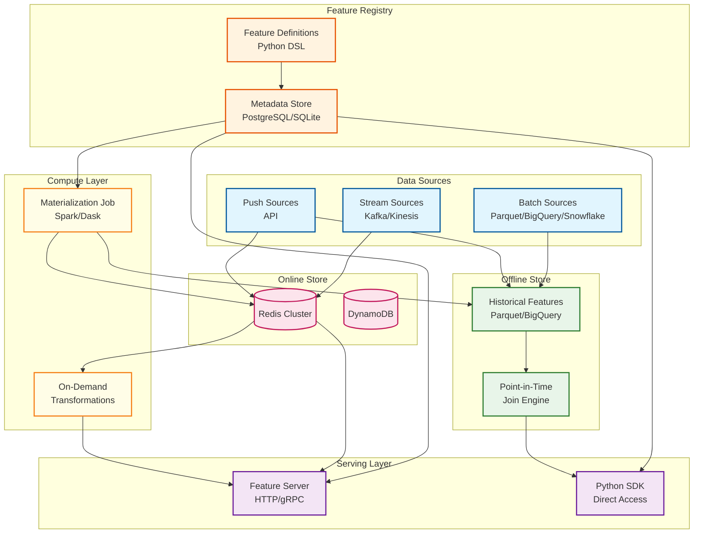
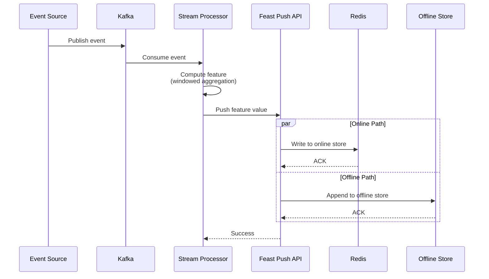
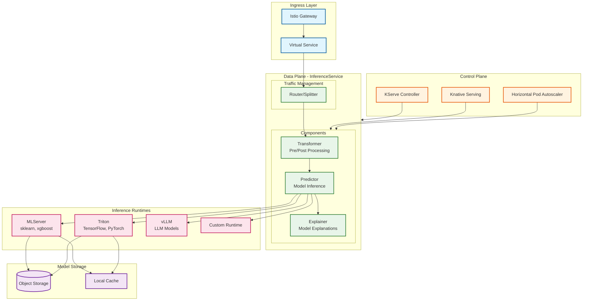
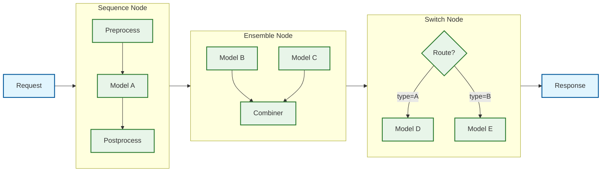
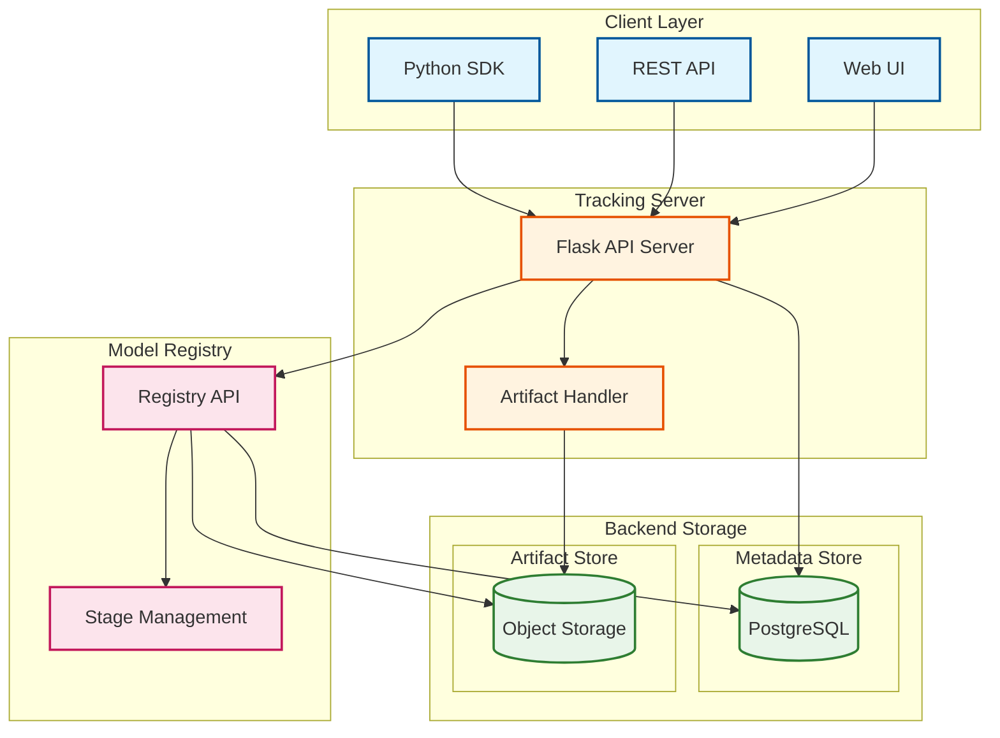
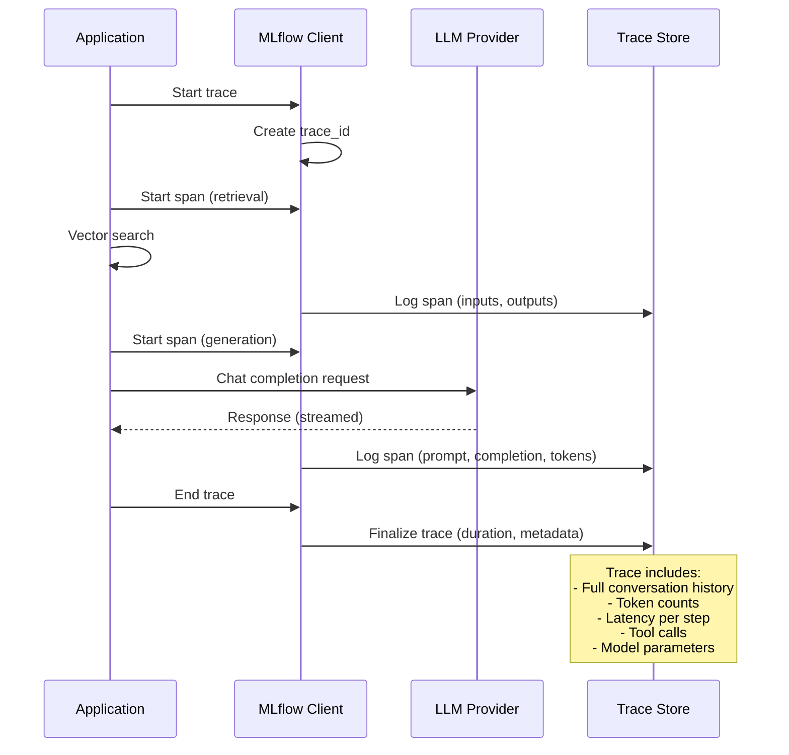

# Deep Dive and Bottlenecks

## Deep Dive 1: Feast Feature Store

### Why Feature Store is Critical

The feature store is the **foundation** of the platform, solving the #1 cause of ML production failures: **train-serve skew**.

```
Train-Serve Skew Problem:
┌─────────────────────────────────────────────────────────────────┐
│                                                                 │
│  Training Pipeline          vs.     Inference Pipeline          │
│  ─────────────────                  ──────────────────          │
│  - SQL query in notebook            - Python code in service    │
│  - Different aggregation logic      - Different time windows    │
│  - Batch computed yesterday         - Real-time computation     │
│                                                                 │
│  Result: Model trained on features that don't match production  │
│                                                                 │
└─────────────────────────────────────────────────────────────────┘

Feast Solution:
┌─────────────────────────────────────────────────────────────────┐
│                                                                 │
│  Single Feature Definition (Python DSL)                         │
│           ↓                   ↓                                 │
│  Offline Store (Training) ←→ Online Store (Inference)           │
│                                                                 │
│  Same definition, same computation, guaranteed consistency      │
│                                                                 │
└─────────────────────────────────────────────────────────────────┘
```

### Feast Architecture Deep Dive



### Dual-Store Architecture

| Aspect | Offline Store | Online Store |
|--------|---------------|--------------|
| **Purpose** | Training data retrieval | Real-time inference |
| **Latency** | Seconds to minutes | <10ms P99 |
| **Query Pattern** | Bulk historical joins | Point lookups |
| **Storage** | Parquet, BigQuery, Snowflake | Redis, DynamoDB |
| **Data Volume** | TBs (full history) | GBs (latest values) |
| **Consistency** | Strong (immutable snapshots) | Eventual (acceptable for features) |

### Point-in-Time Join Mechanism

```
Training Example Request:
┌────────────────────────────────────────────────────────┐
│ entity_id │ event_timestamp          │ label          │
├───────────┼──────────────────────────┼────────────────┤
│ user_001  │ 2024-01-15 10:30:00 UTC  │ fraud (1)      │
│ user_001  │ 2024-01-20 14:45:00 UTC  │ not_fraud (0)  │
└────────────────────────────────────────────────────────┘

Feature Data in Offline Store:
┌────────────────────────────────────────────────────────┐
│ user_id  │ feature_timestamp        │ txn_count_7d   │
├──────────┼──────────────────────────┼────────────────┤
│ user_001 │ 2024-01-10 00:00:00 UTC  │ 5              │
│ user_001 │ 2024-01-14 00:00:00 UTC  │ 8              │
│ user_001 │ 2024-01-17 00:00:00 UTC  │ 12             │
│ user_001 │ 2024-01-21 00:00:00 UTC  │ 15             │
└────────────────────────────────────────────────────────┘

Point-in-Time Join Result:
┌──────────────────────────────────────────────────────────────────┐
│ entity_id │ event_timestamp          │ txn_count_7d │ label      │
├───────────┼──────────────────────────┼──────────────┼────────────┤
│ user_001  │ 2024-01-15 10:30:00 UTC  │ 8            │ fraud      │
│           │ (uses 2024-01-14 feature, NOT 2024-01-17)             │
│ user_001  │ 2024-01-20 14:45:00 UTC  │ 12           │ not_fraud  │
│           │ (uses 2024-01-17 feature, NOT 2024-01-21)             │
└──────────────────────────────────────────────────────────────────┘

Why This Matters:
- Using 2024-01-17 feature for 2024-01-15 event = DATA LEAKAGE
- Model would "see the future" during training
- Performance in production would be worse than training metrics
```

### Streaming Feature Ingestion



### Feature Serving Performance

| Metric | Target | Typical Actual |
|--------|--------|----------------|
| **P50 Latency** | <5ms | 2-3ms |
| **P99 Latency** | <50ms | 15-25ms |
| **Throughput** | 10K QPS per server | 8-12K QPS |
| **Cache Hit Rate** | >95% | 97-99% |

### Failure Modes and Handling

| Failure | Impact | Mitigation |
|---------|--------|------------|
| **Redis unavailable** | Feature lookup fails | Circuit breaker, fallback to defaults |
| **Feature staleness** | Outdated predictions | Freshness monitoring, auto-backfill |
| **Schema mismatch** | Runtime errors | Schema validation at apply time |
| **Missing entity** | Null features | Default values, feature imputation |

---

## Deep Dive 2: KServe Model Serving

### Why KServe is Critical

KServe provides the **critical path** for predictions—any latency or availability issues directly impact user experience and business metrics.

### KServe Architecture



### Serverless Inference with Knative

```
Scale-to-Zero Behavior:
┌─────────────────────────────────────────────────────────────────┐
│                                                                 │
│  Time    0     5     10    15    20    25    30    35    40    │
│          │     │     │     │     │     │     │     │     │     │
│  Traffic ████████████░░░░░░░░░░░░░░░░░░░░░░░░████████████      │
│          │     │     │     │     │     │     │     │     │     │
│  Pods    3     3     2     1     0     0     0     2     3     │
│                      ↓           ↓               ↑              │
│                 Scale Down   Scale to Zero   Cold Start        │
│                                                                 │
│  Cold Start Time: 5-30 seconds (model loading)                 │
│                                                                 │
└─────────────────────────────────────────────────────────────────┘

Configuration:
  annotations:
    autoscaling.knative.dev/min-scale: "0"      # Enable scale-to-zero
    autoscaling.knative.dev/max-scale: "10"     # Max replicas
    autoscaling.knative.dev/target: "100"       # Target concurrency
    autoscaling.knative.dev/scale-down-delay: "30s"  # Stabilization
```

### ModelMesh for Multi-Model Serving

```
Traditional vs ModelMesh Deployment:
┌─────────────────────────────────────────────────────────────────┐
│ Traditional: 1 Pod per Model                                    │
│                                                                 │
│ Model A → [Pod A] (1 GPU)                                       │
│ Model B → [Pod B] (1 GPU)                                       │
│ Model C → [Pod C] (1 GPU)                                       │
│ Model D → [Pod D] (1 GPU)                                       │
│                                                                 │
│ Total: 4 GPUs, each potentially underutilized                   │
│                                                                 │
├─────────────────────────────────────────────────────────────────┤
│ ModelMesh: Many Models per Pod                                  │
│                                                                 │
│ ┌─────────────────────────────────────────────────────┐         │
│ │ ModelMesh Pod (1 GPU)                               │         │
│ │                                                     │         │
│ │ ┌─────────┐ ┌─────────┐ ┌─────────┐ ┌─────────┐    │         │
│ │ │ Model A │ │ Model B │ │ Model C │ │ Model D │    │         │
│ │ └─────────┘ └─────────┘ └─────────┘ └─────────┘    │         │
│ │                                                     │         │
│ │ LRU Cache: Hot models in memory, cold models evict │         │
│ └─────────────────────────────────────────────────────┘         │
│                                                                 │
│ Total: 1 GPU, dynamically shared across models                  │
│                                                                 │
└─────────────────────────────────────────────────────────────────┘
```

### InferenceGraph for Complex Pipelines



### Latency Breakdown

| Phase | Typical Latency | Notes |
|-------|-----------------|-------|
| **Network (client → LB)** | 5-20ms | Depends on geography |
| **Istio routing** | 1-3ms | Service mesh overhead |
| **Transformer (pre)** | 5-15ms | Feature enrichment |
| **Feature lookup** | 5-25ms | Feast call (P99) |
| **Model inference** | 10-100ms | Model complexity dependent |
| **Transformer (post)** | 2-5ms | Response formatting |
| **Total P99** | 50-200ms | End-to-end |

### GPU Scheduling and Sharing

```
GPU Resource Configuration:
┌─────────────────────────────────────────────────────────────────┐
│                                                                 │
│ Option 1: Exclusive GPU (nvidia.com/gpu: 1)                     │
│ - Full GPU dedicated to model                                   │
│ - Best for large models, high throughput                        │
│ - Most expensive                                                │
│                                                                 │
│ Option 2: MIG (Multi-Instance GPU)                              │
│ - A100/H100 partitioned into 7 instances                        │
│ - Resource: nvidia.com/mig-1g.5gb: 1                            │
│ - Good isolation, predictable performance                       │
│                                                                 │
│ Option 3: Time-Slicing                                          │
│ - Multiple pods share GPU via time-slicing                      │
│ - nvidia.com/gpu: 1 with replicas.nvidia.com/gpu: 4             │
│ - No isolation, potential interference                          │
│                                                                 │
│ Option 4: MPS (Multi-Process Service)                           │
│ - Software-based sharing via CUDA MPS                           │
│ - Best for many small inference requests                        │
│ - Memory shared, compute partitioned                            │
│                                                                 │
└─────────────────────────────────────────────────────────────────┘
```

### Failure Modes and Handling

| Failure | Impact | Mitigation |
|---------|--------|------------|
| **Model load failure** | Pod crashes | Init container retry, health checks |
| **OOM (memory)** | Pod killed | Resource limits, ModelMesh eviction |
| **GPU failure** | Inference fails | Node taints, pod rescheduling |
| **Cold start timeout** | Request fails | Warm pods (min-scale > 0), caching |
| **Model version mismatch** | Wrong predictions | Canary deployments, version pinning |

---

## Deep Dive 3: MLflow Experiment Tracking

### Why MLflow Tracking is Critical

MLflow Tracking is the **source of truth** for experiment history, enabling reproducibility, comparison, and governance.

### MLflow Architecture



### High-Cardinality Metric Storage

```
Challenge: Training runs can generate millions of metrics
┌─────────────────────────────────────────────────────────────────┐
│                                                                 │
│ Typical Training Run:                                           │
│ - 100 epochs × 1000 steps × 10 metrics = 1,000,000 data points │
│ - 1000 parallel runs/day = 1 billion metrics/day                │
│                                                                 │
│ Storage Options:                                                │
│                                                                 │
│ 1. PostgreSQL (default):                                        │
│    - Simple, ACID compliant                                     │
│    - Struggles at >10M rows per run                             │
│    - Use for <100 runs/day                                      │
│                                                                 │
│ 2. Time-Series Database (ClickHouse/TimescaleDB):               │
│    - Optimized for append-heavy workloads                       │
│    - Columnar compression (10-20x)                              │
│    - Use for >100 runs/day                                      │
│                                                                 │
│ 3. Object Storage (Parquet):                                    │
│    - Batch writes, bulk reads                                   │
│    - Best for very high volume                                  │
│    - Use for analytics-heavy workloads                          │
│                                                                 │
└─────────────────────────────────────────────────────────────────┘
```

### GenAI Tracing (MLflow 3.x)



### Artifact Management

```
Artifact Storage Layout:
s3://mlflow-artifacts/
├── experiment_123/
│   ├── run_abc/
│   │   ├── artifacts/
│   │   │   ├── model/
│   │   │   │   ├── MLmodel           # Model metadata
│   │   │   │   ├── model.pkl         # Serialized model
│   │   │   │   ├── requirements.txt  # Dependencies
│   │   │   │   └── conda.yaml        # Environment
│   │   │   ├── plots/
│   │   │   │   ├── confusion_matrix.png
│   │   │   │   └── feature_importance.png
│   │   │   └── data/
│   │   │       └── validation_set.parquet
│   │   └── metrics/
│   │       └── step_metrics.json     # For high-volume metrics

Deduplication Strategy:
- Content-addressable storage (hash-based)
- Same artifact across runs stored once
- Symlinks/references for duplicates
- ~30-50% storage savings typical
```

### Failure Modes and Handling

| Failure | Impact | Mitigation |
|---------|--------|------------|
| **Server unavailable** | Can't log metrics | Client-side buffering, retry |
| **Database full** | Writes fail | Monitoring, auto-cleanup of old runs |
| **Artifact upload timeout** | Large files fail | Multipart upload, chunking |
| **Concurrent model registration** | Version conflicts | Optimistic locking, retry |

---

## Bottleneck Analysis

### Top 3 Bottlenecks

#### Bottleneck 1: Feature Serving Latency

```
Impact: Directly adds to inference latency
Root Causes:
┌─────────────────────────────────────────────────────────────────┐
│                                                                 │
│ 1. Redis network round-trip (1-5ms per call)                    │
│ 2. Multiple feature lookups serialized (N × latency)            │
│ 3. Feature Server CPU saturation                                │
│ 4. Large feature vectors (MB-sized embeddings)                  │
│                                                                 │
└─────────────────────────────────────────────────────────────────┘

Mitigation Strategies:
┌─────────────────────────────────────────────────────────────────┐
│                                                                 │
│ 1. Batch feature lookups (single round-trip)                    │
│    Before: GET user_features, GET item_features, GET ctx_feats  │
│    After:  MGET user_features, item_features, ctx_features      │
│    Savings: 3 calls → 1 call                                    │
│                                                                 │
│ 2. Feature caching in Transformer                               │
│    - Cache hot entities (top 1% = 50% traffic)                  │
│    - TTL based on feature freshness requirements                │
│    - Local cache hit: <1ms vs Redis: 5-10ms                     │
│                                                                 │
│ 3. Async feature prefetch                                       │
│    - Start feature lookup while preprocessing input             │
│    - Overlap computation with I/O                               │
│                                                                 │
│ 4. Feature Server horizontal scaling                            │
│    - Add replicas based on CPU utilization                      │
│    - Target: <70% CPU at peak load                              │
│                                                                 │
└─────────────────────────────────────────────────────────────────┘
```

#### Bottleneck 2: Cold Start Times

```
Impact: First request after scale-to-zero can take 10-60 seconds
Breakdown:
┌─────────────────────────────────────────────────────────────────┐
│                                                                 │
│ Phase              │ Duration  │ Optimization                   │
│ ───────────────────┼───────────┼──────────────────────────────  │
│ Pod scheduling     │ 1-5s      │ Priority classes, preemption   │
│ Image pull         │ 5-30s     │ Pre-pull images, smaller base  │
│ Container startup  │ 1-3s      │ Faster runtimes                │
│ Model download     │ 5-60s     │ Model caching, smaller models  │
│ Model loading      │ 2-10s     │ Lazy loading, warm pools       │
│ Health check pass  │ 1-5s      │ Faster probes                  │
│                                                                 │
│ Total: 15-113 seconds worst case                                │
│                                                                 │
└─────────────────────────────────────────────────────────────────┘

Mitigation Strategies:
┌─────────────────────────────────────────────────────────────────┐
│                                                                 │
│ 1. LocalModelCache (KServe 0.15+)                               │
│    - Models cached on node-local storage                        │
│    - Skip S3 download on subsequent starts                      │
│    - Reduction: 15-20 min → <1 min                              │
│                                                                 │
│ 2. Minimum replicas (min-scale > 0)                             │
│    - Keep at least 1 warm pod                                   │
│    - Trade-off: cost vs latency                                 │
│                                                                 │
│ 3. Predictive scaling                                           │
│    - Scale up before expected traffic                           │
│    - Based on historical patterns                               │
│                                                                 │
│ 4. Model quantization                                           │
│    - Smaller model = faster load                                │
│    - FP16/INT8 reduces size 2-4x                                │
│                                                                 │
└─────────────────────────────────────────────────────────────────┘
```

#### Bottleneck 3: GPU Resource Contention

```
Impact: Training jobs wait, inference latency spikes
Root Causes:
┌─────────────────────────────────────────────────────────────────┐
│                                                                 │
│ 1. Limited GPU supply vs demand                                 │
│ 2. GPU scheduling is all-or-nothing (no fractional GPUs)        │
│ 3. Training jobs hold GPUs for hours                            │
│ 4. Inference spikes during business hours                       │
│                                                                 │
└─────────────────────────────────────────────────────────────────┘

Mitigation Strategies:
┌─────────────────────────────────────────────────────────────────┐
│                                                                 │
│ 1. GPU time-slicing / MIG partitioning                          │
│    - Share GPUs across multiple small models                    │
│    - 4-7x better utilization                                    │
│                                                                 │
│ 2. Priority-based scheduling                                    │
│    - Inference: High priority, preempts training                │
│    - Training: Lower priority, can be preempted                 │
│                                                                 │
│ 3. Separate clusters                                            │
│    - Dedicated inference GPU pool                               │
│    - Training uses spot/preemptible instances                   │
│                                                                 │
│ 4. Queue management (Kueue/Volcano)                             │
│    - Fair scheduling across teams                               │
│    - Gang scheduling for distributed training                   │
│    - Quota enforcement                                          │
│                                                                 │
└─────────────────────────────────────────────────────────────────┘
```

---

## Concurrency and Race Conditions

### Race Condition 1: Model Version Promotion

```
Scenario: Two users promote different versions to Production simultaneously

Timeline:
┌─────────────────────────────────────────────────────────────────┐
│                                                                 │
│ Time   User A                    User B                         │
│ ────   ─────────────────────     ─────────────────────          │
│ T0     Read: v2 is Staging       Read: v3 is Staging            │
│ T1     Check: No v in Prod       Check: No v in Prod            │
│ T2     Promote v2 → Prod         Promote v3 → Prod              │
│ T3     Success!                  Success!                        │
│                                                                 │
│ Result: Both v2 and v3 marked as Production (inconsistent!)     │
│                                                                 │
└─────────────────────────────────────────────────────────────────┘

Solution: Optimistic Locking
┌─────────────────────────────────────────────────────────────────┐
│                                                                 │
│ 1. Read model with version counter                              │
│ 2. Update with WHERE version = read_version                     │
│ 3. If 0 rows affected, retry from step 1                        │
│                                                                 │
│ UPDATE model_versions                                           │
│ SET current_stage = 'Production', version = version + 1         │
│ WHERE name = 'model' AND version = :read_version                │
│ AND current_stage = 'Staging';                                  │
│                                                                 │
└─────────────────────────────────────────────────────────────────┘
```

### Race Condition 2: Feature Materialization Overlap

```
Scenario: Two materialization jobs run for overlapping time ranges

Timeline:
┌─────────────────────────────────────────────────────────────────┐
│                                                                 │
│ Time   Job A                     Job B                          │
│ ────   ─────────────────────     ─────────────────────          │
│ T0     Materialize 00:00-06:00   (not started)                  │
│ T1     Processing...             Materialize 04:00-10:00        │
│ T2     Write 00:00-06:00 data    Processing...                  │
│ T3     Complete                  Write 04:00-10:00 data         │
│                                                                 │
│ Result: Data 04:00-06:00 may have duplicate or inconsistent     │
│         values depending on write order                         │
│                                                                 │
└─────────────────────────────────────────────────────────────────┘

Solution: Distributed Locking + Idempotent Writes
┌─────────────────────────────────────────────────────────────────┐
│                                                                 │
│ 1. Acquire lock on (feature_view, time_range)                   │
│ 2. Check if range already materialized                          │
│ 3. If yes, skip or merge                                        │
│ 4. Materialize with idempotent writes (upsert)                  │
│ 5. Update materialization watermark                             │
│ 6. Release lock                                                 │
│                                                                 │
└─────────────────────────────────────────────────────────────────┘
```

### Race Condition 3: Canary Traffic Split

```
Scenario: Multiple controllers updating traffic weights

Solution: Single source of truth in InferenceService spec
┌─────────────────────────────────────────────────────────────────┐
│                                                                 │
│ apiVersion: serving.kserve.io/v1beta1                           │
│ kind: InferenceService                                          │
│ spec:                                                           │
│   predictor:                                                    │
│     canaryTrafficPercent: 10   # Declarative, single truth      │
│                                                                 │
│ KServe Controller reconciles actual state to match spec         │
│ Kubernetes handles concurrent update conflicts                  │
│                                                                 │
└─────────────────────────────────────────────────────────────────┘
```

---

## Locking Strategies

| Component | Lock Type | Implementation | Timeout |
|-----------|-----------|----------------|---------|
| **Model Registry** | Optimistic | Version column | N/A (retry) |
| **Feature Materialization** | Distributed | Redis/Postgres advisory | 30 min |
| **Airflow Tasks** | Database lock | PostgreSQL FOR UPDATE | Task timeout |
| **KServe Deployments** | K8s optimistic | Resource version | N/A (retry) |

---

## Performance Optimization Summary

| Optimization | Component | Impact | Complexity |
|--------------|-----------|--------|------------|
| Batch feature lookups | Feast | 50-70% latency reduction | Low |
| LocalModelCache | KServe | 90% cold start reduction | Medium |
| MIG/Time-slicing | GPUs | 4-7x utilization | Medium |
| Metric batching | MLflow | 90% write reduction | Low |
| Canary deployments | KServe | Risk reduction | Low |
| Priority scheduling | Kubernetes | Inference reliability | High |
