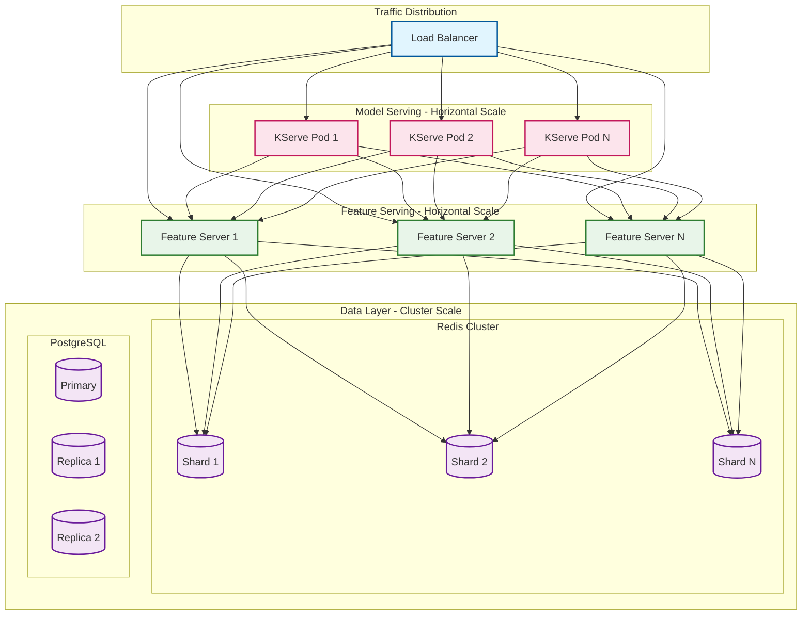
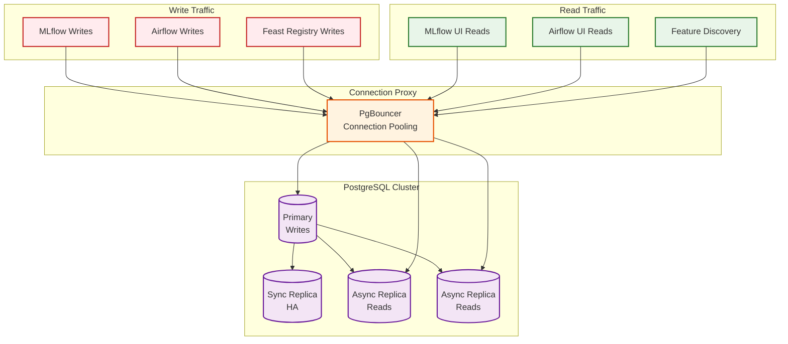
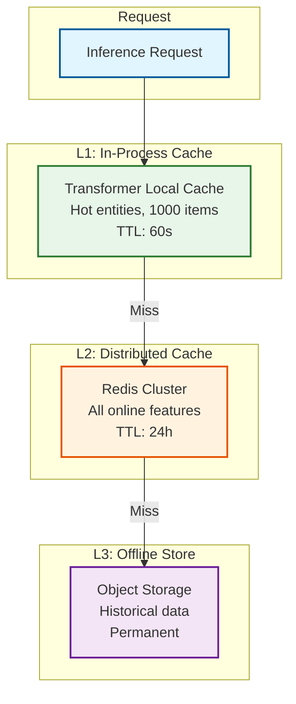
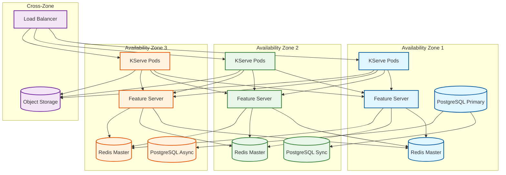
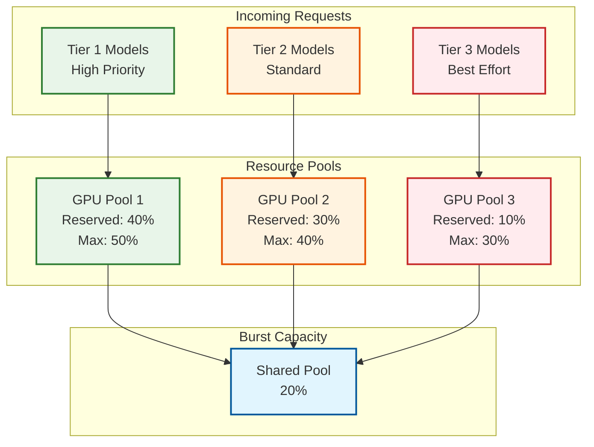

# Scalability and Reliability

## Scalability Strategies

### Horizontal Scaling Overview



### Component Scaling Strategies

| Component | Scaling Type | Trigger | Max Scale |
|-----------|--------------|---------|-----------|
| **KServe Pods** | Horizontal (HPA/KEDA) | Concurrency, CPU, GPU utilization | 100 per model |
| **Feature Server** | Horizontal (HPA) | CPU, request rate | 50 replicas |
| **MLflow Server** | Horizontal (LB) | Request rate | 10 replicas |
| **Airflow Workers** | Horizontal (KEDA) | Queue depth | 100 workers |
| **Redis** | Cluster (sharding) | Memory, throughput | 100 nodes |
| **PostgreSQL** | Vertical + Read replicas | Connections, CPU | 10 replicas |

---

## Auto-Scaling Configuration

### KServe Auto-Scaling (Knative)

```yaml
# InferenceService with auto-scaling configuration
apiVersion: serving.kserve.io/v1beta1
kind: InferenceService
metadata:
  name: fraud-detector
  annotations:
    # Knative auto-scaling annotations
    autoscaling.knative.dev/class: "kpa.autoscaling.knative.dev"
    autoscaling.knative.dev/metric: "concurrency"
    autoscaling.knative.dev/target: "100"
    autoscaling.knative.dev/min-scale: "2"
    autoscaling.knative.dev/max-scale: "20"
    autoscaling.knative.dev/scale-down-delay: "30s"
    autoscaling.knative.dev/scale-to-zero-grace-period: "30s"
    autoscaling.knative.dev/window: "60s"
spec:
  predictor:
    model:
      modelFormat:
        name: sklearn
      storageUri: "s3://models/fraud-detector"
    resources:
      requests:
        cpu: "2"
        memory: "4Gi"
      limits:
        cpu: "4"
        memory: "8Gi"
```

### KEDA-Based Scaling for LLMs

```yaml
# ScaledObject for LLM workloads
apiVersion: keda.sh/v1alpha1
kind: ScaledObject
metadata:
  name: llm-service-scaler
spec:
  scaleTargetRef:
    name: llm-inference-deployment
  minReplicaCount: 1
  maxReplicaCount: 10
  pollingInterval: 15
  cooldownPeriod: 300
  triggers:
    # GPU memory utilization
    - type: prometheus
      metadata:
        serverAddress: http://prometheus:9090
        metricName: gpu_memory_utilization
        threshold: "80"
        query: |
          avg(DCGM_FI_DEV_MEM_USED / DCGM_FI_DEV_MEM_TOTAL * 100)
            by (pod) > 80
    # Token throughput
    - type: prometheus
      metadata:
        serverAddress: http://prometheus:9090
        metricName: token_throughput
        threshold: "1000"
        query: |
          sum(rate(vllm_tokens_generated_total[1m]))
    # Request queue depth
    - type: prometheus
      metadata:
        serverAddress: http://prometheus:9090
        metricName: queue_depth
        threshold: "50"
        query: |
          sum(kserve_inference_queue_depth)
```

### Feature Server HPA

```yaml
apiVersion: autoscaling/v2
kind: HorizontalPodAutoscaler
metadata:
  name: feast-feature-server-hpa
spec:
  scaleTargetRef:
    apiVersion: apps/v1
    kind: Deployment
    name: feast-feature-server
  minReplicas: 3
  maxReplicas: 20
  metrics:
    - type: Resource
      resource:
        name: cpu
        target:
          type: Utilization
          averageUtilization: 70
    - type: Pods
      pods:
        metric:
          name: feast_requests_per_second
        target:
          type: AverageValue
          averageValue: "500"
  behavior:
    scaleDown:
      stabilizationWindowSeconds: 300
      policies:
        - type: Percent
          value: 10
          periodSeconds: 60
    scaleUp:
      stabilizationWindowSeconds: 0
      policies:
        - type: Percent
          value: 100
          periodSeconds: 15
        - type: Pods
          value: 4
          periodSeconds: 15
      selectPolicy: Max
```

---

## Database Scaling Strategy

### PostgreSQL Scaling



### Redis Cluster Scaling

```
Redis Cluster Configuration:
┌─────────────────────────────────────────────────────────────────┐
│                                                                 │
│ Cluster Mode: Enabled                                           │
│ Slots: 16384 (distributed across masters)                       │
│ Replication: 1 replica per master                               │
│                                                                 │
│ ┌─────────────┐  ┌─────────────┐  ┌─────────────┐              │
│ │ Master 1    │  │ Master 2    │  │ Master 3    │              │
│ │ Slots: 0-5460│  │ Slots: 5461-10922│ │ Slots: 10923-16383│   │
│ │             │  │             │  │             │              │
│ │ ┌─────────┐ │  │ ┌─────────┐ │  │ ┌─────────┐ │              │
│ │ │Replica 1│ │  │ │Replica 2│ │  │ │Replica 3│ │              │
│ │ └─────────┘ │  │ └─────────┘ │  │ └─────────┘ │              │
│ └─────────────┘  └─────────────┘  └─────────────┘              │
│                                                                 │
│ Scaling:                                                        │
│ - Add nodes: Reshard slots to new masters                       │
│ - Memory: Scale vertically per node                             │
│ - Throughput: Add more masters                                  │
│                                                                 │
└─────────────────────────────────────────────────────────────────┘
```

---

## Caching Layers

### Multi-Layer Cache Architecture



### Cache Configuration

| Layer | Size | TTL | Hit Rate Target |
|-------|------|-----|-----------------|
| **L1 (Local)** | 100 MB | 60s | 30-40% |
| **L2 (Redis)** | 100 GB | 24h | 95-99% |
| **L3 (S3)** | Unlimited | Permanent | 100% |

### Cache Invalidation Strategy

```
Invalidation Approaches:
┌─────────────────────────────────────────────────────────────────┐
│                                                                 │
│ 1. TTL-Based Expiration (Primary)                               │
│    - Features: TTL = feature_freshness_SLA                      │
│    - Models: TTL = 0 (immutable)                                │
│    - Simple, eventually consistent                              │
│                                                                 │
│ 2. Event-Driven Invalidation                                    │
│    - Feature update → Kafka → Invalidate cache                  │
│    - Model promotion → Invalidate model cache                   │
│    - Lower latency, more complex                                │
│                                                                 │
│ 3. Write-Through                                                │
│    - Push API updates cache synchronously                       │
│    - Strongest consistency                                      │
│    - Higher write latency                                       │
│                                                                 │
└─────────────────────────────────────────────────────────────────┘

Decision Matrix:
┌─────────────────┬──────────────┬──────────────┬──────────────┐
│ Data Type       │ Strategy     │ TTL          │ Consistency  │
├─────────────────┼──────────────┼──────────────┼──────────────┤
│ User features   │ TTL          │ 5 min        │ Eventual     │
│ Item features   │ TTL          │ 1 hour       │ Eventual     │
│ Real-time feats │ Write-through│ N/A          │ Strong       │
│ Model artifacts │ Immutable    │ Infinite     │ N/A          │
└─────────────────┴──────────────┴──────────────┴──────────────┘
```

---

## Hot Spot Mitigation

### Feature Store Hot Spots

```
Problem: Popular entities (e.g., trending products) overload single Redis shard

┌─────────────────────────────────────────────────────────────────┐
│                                                                 │
│ Traffic Distribution Before:                                    │
│                                                                 │
│ Entity     Requests     Redis Shard                             │
│ ────────   ──────────   ───────────                             │
│ prod_001   50%          Shard 1 (overloaded)                    │
│ prod_002   20%          Shard 1                                 │
│ prod_003   10%          Shard 2                                 │
│ Others     20%          Distributed                             │
│                                                                 │
└─────────────────────────────────────────────────────────────────┘

Solutions:
┌─────────────────────────────────────────────────────────────────┐
│                                                                 │
│ 1. Local Caching (L1)                                           │
│    - Cache hot entities in Transformer process                  │
│    - 50% of requests never reach Redis                          │
│                                                                 │
│ 2. Key Replication                                              │
│    - Replicate hot keys across multiple shards                  │
│    - Key: prod_001 → prod_001:shard_1, prod_001:shard_2         │
│    - Random selection on read                                   │
│                                                                 │
│ 3. Read Replicas per Shard                                      │
│    - Add read replicas to hot shards                            │
│    - Reads distributed across replicas                          │
│                                                                 │
└─────────────────────────────────────────────────────────────────┘
```

### Model Serving Hot Spots

```
Problem: Single model receives majority of traffic

Solution: Per-Model Scaling with Traffic-Aware HPA
┌─────────────────────────────────────────────────────────────────┐
│                                                                 │
│ Model A (50% traffic): min=5, max=50                            │
│ Model B (30% traffic): min=3, max=30                            │
│ Model C (20% traffic): min=2, max=20                            │
│                                                                 │
│ Each model scales independently based on its traffic            │
│                                                                 │
└─────────────────────────────────────────────────────────────────┘
```

---

## Reliability and Fault Tolerance

### Single Points of Failure (SPOF) Analysis

| Component | SPOF Risk | Mitigation |
|-----------|-----------|------------|
| **KServe Controller** | Medium | Multi-replica, leader election |
| **Airflow Scheduler** | High | Active-standby, PostgreSQL HA |
| **MLflow Server** | Medium | Multi-replica behind LB |
| **Feast Feature Server** | Low | Stateless, multi-replica |
| **PostgreSQL** | High | Sync replica, automated failover |
| **Redis** | Medium | Cluster mode, automatic failover |
| **Object Storage** | Low | Managed service, 11 nines durability |

### Redundancy Architecture



### Failover Mechanisms

| Component | Failover Type | Detection Time | Recovery Time |
|-----------|---------------|----------------|---------------|
| **KServe Pods** | Kubernetes auto-restart | 10-30s | 30-60s |
| **Feature Server** | Load balancer health check | 5-10s | Immediate |
| **PostgreSQL** | Patroni automated failover | 10-30s | 30-60s |
| **Redis Cluster** | Built-in failover | 5-15s | 15-30s |
| **Airflow Scheduler** | HA scheduler failover | 30-60s | 60-120s |

---

## Circuit Breaker Patterns

### Feature Server Circuit Breaker

```
Circuit Breaker States:
┌─────────────────────────────────────────────────────────────────┐
│                                                                 │
│        ┌─────────┐                                              │
│        │ CLOSED  │ ← Normal operation                           │
│        └────┬────┘                                              │
│             │ Failures > threshold (5 in 10s)                   │
│             ▼                                                   │
│        ┌─────────┐                                              │
│        │  OPEN   │ ← Fail fast, return defaults                 │
│        └────┬────┘                                              │
│             │ After timeout (30s)                               │
│             ▼                                                   │
│        ┌─────────┐                                              │
│        │HALF-OPEN│ ← Test with single request                   │
│        └────┬────┘                                              │
│             │ Success → CLOSED                                  │
│             │ Failure → OPEN                                    │
│                                                                 │
└─────────────────────────────────────────────────────────────────┘

Configuration:
  failure_threshold: 5          # Failures to trip
  success_threshold: 3          # Successes to close
  timeout: 30s                  # Time in OPEN state
  half_open_requests: 3         # Requests to test
```

### Implementation Pattern

```
PSEUDOCODE: Circuit Breaker for Feature Lookup

class FeatureCircuitBreaker:
    state = CLOSED
    failure_count = 0
    success_count = 0
    last_failure_time = null

    function get_features(entity_ids):
        if state == OPEN:
            if now - last_failure_time > timeout:
                state = HALF_OPEN
            else:
                return get_default_features(entity_ids)

        try:
            features = feature_server.get(entity_ids)
            on_success()
            return features
        except Exception:
            on_failure()
            return get_default_features(entity_ids)

    function on_success():
        if state == HALF_OPEN:
            success_count += 1
            if success_count >= success_threshold:
                state = CLOSED
                reset_counts()
        else:
            reset_counts()

    function on_failure():
        failure_count += 1
        last_failure_time = now
        if failure_count >= failure_threshold:
            state = OPEN
            log_alert("Circuit breaker opened")
```

---

## Graceful Degradation

### Degradation Hierarchy

```
Level 0: Full Service
├── All features available
├── Real-time inference
└── Full model ensemble

Level 1: Reduced Features
├── Use cached/stale features (TTL extended)
├── Skip optional features
└── Log feature staleness

Level 2: Simplified Model
├── Fall back to simpler model (rule-based)
├── Reduce ensemble to single model
└── Disable explainer

Level 3: Default Response
├── Return cached predictions
├── Return safe defaults
└── Log for later processing

Level 4: Reject
├── Return 503 Service Unavailable
├── Trigger incident alert
└── Queue requests for retry
```

### Degradation Triggers

| Trigger | Level | Action |
|---------|-------|--------|
| Feature server P99 > 100ms | 1 | Use cached features |
| Feature server unavailable | 2 | Use default features |
| GPU memory > 90% | 2 | Disable low-priority models |
| Model inference timeout | 2 | Fall back to simpler model |
| All replicas failing | 3 | Return cached predictions |
| Complete outage | 4 | Reject with retry header |

---

## Retry Strategies

### Exponential Backoff Configuration

```
Retry Configuration by Component:
┌─────────────────────────────────────────────────────────────────┐
│                                                                 │
│ Feature Lookup:                                                 │
│   max_retries: 3                                                │
│   initial_delay: 50ms                                           │
│   max_delay: 500ms                                              │
│   multiplier: 2                                                 │
│   jitter: 0.1 (±10%)                                            │
│                                                                 │
│ Model Inference:                                                │
│   max_retries: 2                                                │
│   initial_delay: 100ms                                          │
│   max_delay: 1s                                                 │
│   multiplier: 2                                                 │
│   jitter: 0.2                                                   │
│                                                                 │
│ Airflow Task:                                                   │
│   max_retries: 5                                                │
│   initial_delay: 60s                                            │
│   max_delay: 3600s (1 hour)                                     │
│   multiplier: 2                                                 │
│   jitter: 0.3                                                   │
│                                                                 │
└─────────────────────────────────────────────────────────────────┘

Retry Calculation:
delay = min(max_delay, initial_delay * (multiplier ^ attempt))
delay = delay * (1 + random(-jitter, jitter))

Example (Feature Lookup):
Attempt 1: 50ms * 1 * (1 ± 0.1) = 45-55ms
Attempt 2: 50ms * 2 * (1 ± 0.1) = 90-110ms
Attempt 3: 50ms * 4 * (1 ± 0.1) = 180-220ms
```

---

## Bulkhead Pattern

### Resource Isolation



---

## Disaster Recovery

### Recovery Objectives

| Component | RTO | RPO | Strategy |
|-----------|-----|-----|----------|
| **Model Serving** | 5 min | 0 | Multi-zone active-active |
| **Feature Store (Online)** | 15 min | 1 min | Redis cluster + backup |
| **Feature Store (Offline)** | 4 hours | 1 hour | Cross-region replication |
| **MLflow Registry** | 30 min | 5 min | PostgreSQL + S3 backup |
| **Airflow** | 1 hour | 15 min | PostgreSQL backup |

### Backup Strategy

```
Backup Schedule:
┌─────────────────────────────────────────────────────────────────┐
│                                                                 │
│ PostgreSQL:                                                     │
│   - Continuous WAL archiving to S3                              │
│   - Point-in-time recovery capability                           │
│   - Daily full backups (retained 30 days)                       │
│   - Cross-region replication for DR                             │
│                                                                 │
│ Redis:                                                          │
│   - RDB snapshots every 15 minutes                              │
│   - AOF persistence (fsync every second)                        │
│   - Snapshots replicated to S3                                  │
│                                                                 │
│ Model Artifacts (S3):                                           │
│   - Cross-region replication enabled                            │
│   - Versioning enabled (no data loss)                           │
│   - 11 nines durability                                         │
│                                                                 │
│ Feature Definitions (Git):                                      │
│   - Git repository with remote backup                           │
│   - Feast registry synced to database                           │
│                                                                 │
└─────────────────────────────────────────────────────────────────┘
```

### Multi-Region Considerations

```
Active-Passive Multi-Region:
┌─────────────────────────────────────────────────────────────────┐
│                                                                 │
│ Primary Region (us-east-1)        DR Region (us-west-2)         │
│ ─────────────────────────         ────────────────────          │
│ KServe: Active                    KServe: Standby (min replicas)│
│ Feature Server: Active            Feature Server: Standby       │
│ PostgreSQL: Primary               PostgreSQL: Async Replica     │
│ Redis: Active                     Redis: Replica (read-only)    │
│ S3: Primary                       S3: Cross-region replication  │
│                                                                 │
│ Failover Process:                                               │
│ 1. Detect primary region failure (health checks)                │
│ 2. Promote PostgreSQL replica to primary                        │
│ 3. Switch Redis to read-write mode                              │
│ 4. Scale up KServe and Feature Server                           │
│ 5. Update DNS to point to DR region                             │
│ 6. Total RTO: ~15 minutes                                       │
│                                                                 │
└─────────────────────────────────────────────────────────────────┘
```

---

## Capacity Planning Guidelines

### Scaling Thresholds

| Metric | Scale Up | Scale Down | Cooldown |
|--------|----------|------------|----------|
| **CPU Utilization** | >70% | <30% | 5 min |
| **Memory Utilization** | >80% | <40% | 10 min |
| **GPU Utilization** | >80% | <20% | 15 min |
| **Request Latency (P99)** | >SLO | <50% SLO | 5 min |
| **Queue Depth** | >100 | <10 | 2 min |

### Growth Planning

```
Capacity Planning Formula:
┌─────────────────────────────────────────────────────────────────┐
│                                                                 │
│ Required Capacity = Peak Load × Safety Factor × Growth Factor   │
│                                                                 │
│ Where:                                                          │
│   Peak Load = 3 × Average Load (typical)                        │
│   Safety Factor = 1.5 (50% headroom)                            │
│   Growth Factor = 1.5 per year (50% YoY growth)                 │
│                                                                 │
│ Example:                                                        │
│   Average: 5,000 QPS                                            │
│   Peak: 15,000 QPS                                              │
│   Required: 15,000 × 1.5 × 1.5 = 33,750 QPS capacity            │
│                                                                 │
└─────────────────────────────────────────────────────────────────┘
```
