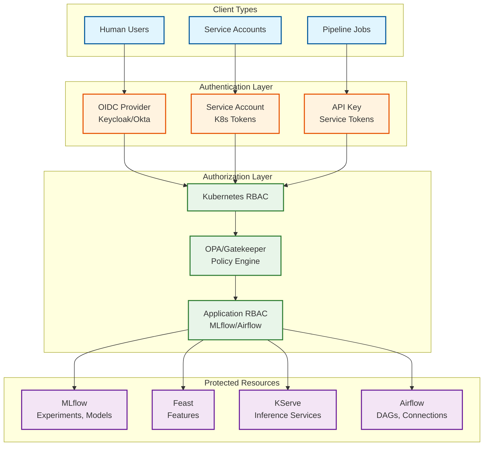
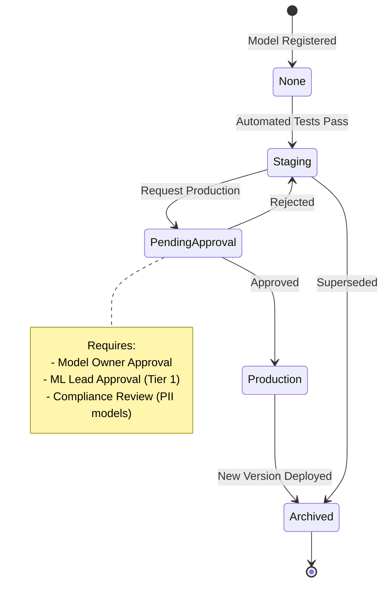
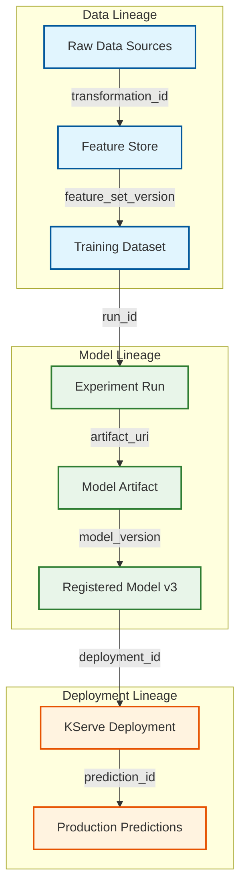

# Security and Compliance

## Authentication and Authorization

### Authentication Architecture



### Kubernetes RBAC Configuration

```yaml
# Role for ML Engineers
apiVersion: rbac.authorization.k8s.io/v1
kind: Role
metadata:
  name: ml-engineer
  namespace: ml-platform
rules:
  # MLflow access
  - apiGroups: [""]
    resources: ["pods", "services"]
    verbs: ["get", "list", "watch"]
  - apiGroups: [""]
    resources: ["pods/log"]
    verbs: ["get"]

  # KServe InferenceService management
  - apiGroups: ["serving.kserve.io"]
    resources: ["inferenceservices"]
    verbs: ["get", "list", "watch", "create", "update", "patch"]

  # Ray job submission
  - apiGroups: ["ray.io"]
    resources: ["rayjobs"]
    verbs: ["get", "list", "watch", "create", "delete"]

  # Secrets (read-only for model configs)
  - apiGroups: [""]
    resources: ["secrets"]
    verbs: ["get", "list"]
    resourceNames: ["model-*", "feast-*"]

---
# Role for Data Scientists (more restricted)
apiVersion: rbac.authorization.k8s.io/v1
kind: Role
metadata:
  name: data-scientist
  namespace: ml-platform
rules:
  # Read-only access to services
  - apiGroups: [""]
    resources: ["pods", "services"]
    verbs: ["get", "list", "watch"]

  # Read-only KServe access
  - apiGroups: ["serving.kserve.io"]
    resources: ["inferenceservices"]
    verbs: ["get", "list", "watch"]

  # Ray job submission only
  - apiGroups: ["ray.io"]
    resources: ["rayjobs"]
    verbs: ["get", "list", "watch", "create"]

---
# ClusterRole for Platform Admins
apiVersion: rbac.authorization.k8s.io/v1
kind: ClusterRole
metadata:
  name: ml-platform-admin
rules:
  # Full access to ML resources
  - apiGroups: ["serving.kserve.io"]
    resources: ["*"]
    verbs: ["*"]
  - apiGroups: ["ray.io"]
    resources: ["*"]
    verbs: ["*"]

  # Manage namespaces
  - apiGroups: [""]
    resources: ["namespaces"]
    verbs: ["get", "list", "create", "delete"]

  # Manage RBAC
  - apiGroups: ["rbac.authorization.k8s.io"]
    resources: ["roles", "rolebindings"]
    verbs: ["*"]
```

### MLflow Authentication

```
MLflow Authentication Configuration:
┌─────────────────────────────────────────────────────────────────┐
│                                                                 │
│ Option 1: Basic Authentication (Simple)                         │
│   MLFLOW_TRACKING_USERNAME=user                                 │
│   MLFLOW_TRACKING_PASSWORD=password                             │
│   - Suitable for development                                    │
│   - Not recommended for production                              │
│                                                                 │
│ Option 2: OIDC Integration (Production)                         │
│   - MLflow behind auth proxy (OAuth2 Proxy)                     │
│   - Tokens validated against OIDC provider                      │
│   - User identity passed to MLflow                              │
│                                                                 │
│ Option 3: MLflow Authentication Plugin (Databricks)             │
│   - Built-in authentication with user management                │
│   - Permissions: READ, EDIT, MANAGE, NO_PERMISSIONS             │
│   - Scopes: Experiment, Model, Model Version                    │
│                                                                 │
└─────────────────────────────────────────────────────────────────┘

MLflow Permissions Matrix:
┌─────────────────┬───────────┬───────────┬───────────┬──────────┐
│ Permission      │ READ      │ EDIT      │ MANAGE    │ Admin    │
├─────────────────┼───────────┼───────────┼───────────┼──────────┤
│ View experiments│ ✓         │ ✓         │ ✓         │ ✓        │
│ Log metrics     │           │ ✓         │ ✓         │ ✓        │
│ Delete runs     │           │           │ ✓         │ ✓        │
│ Manage perms    │           │           │ ✓         │ ✓        │
│ Delete exprmnt  │           │           │           │ ✓        │
└─────────────────┴───────────┴───────────┴───────────┴──────────┘
```

### Feature Access Control

```yaml
# Feast Feature Service with Owner/Team Metadata
apiVersion: feast.dev/v1alpha1
kind: FeatureService
metadata:
  name: fraud_detection_features
  labels:
    team: fraud-team
    data-classification: pii
spec:
  features:
    - feature_view: user_transaction_features
      features:
        - transaction_count_7d
        - avg_transaction_amount_30d
  owner: fraud-team@company.com
  tags:
    access_level: restricted

---
# OPA Policy for Feature Access
package feast.authz

default allow = false

# Allow if user is in the owning team
allow {
    input.user.teams[_] == input.feature_service.labels.team
}

# Allow if user has admin role
allow {
    input.user.roles[_] == "ml-platform-admin"
}

# Deny if data is PII and user lacks PII access
deny {
    input.feature_service.labels["data-classification"] == "pii"
    not has_pii_access(input.user)
}

has_pii_access(user) {
    user.attributes.pii_certified == true
}
```

---

## Model Governance

### Approval Workflow



### Governance Checklist

```
Model Production Checklist:
┌─────────────────────────────────────────────────────────────────┐
│                                                                 │
│ □ Technical Validation                                          │
│   □ Model performance meets baseline thresholds                 │
│   □ Inference latency within SLA (P99 < target)                 │
│   □ Memory/GPU usage within limits                              │
│   □ Feature schema matches serving environment                  │
│   □ No data leakage in feature pipeline                         │
│                                                                 │
│ □ Documentation                                                 │
│   □ Model card completed (purpose, limitations, bias)           │
│   □ Training data documented                                    │
│   □ Feature definitions documented                              │
│   □ Expected input/output schemas documented                    │
│                                                                 │
│ □ Testing                                                       │
│   □ Unit tests for preprocessing                                │
│   □ Integration tests with feature store                        │
│   □ Regression tests against baseline model                     │
│   □ Adversarial/edge case testing                               │
│                                                                 │
│ □ Compliance                                                    │
│   □ Data usage approved for this model type                     │
│   □ Bias assessment completed (if applicable)                   │
│   □ Privacy review passed (for PII data)                        │
│   □ Explainability requirements met (for high-risk decisions)   │
│                                                                 │
│ □ Operational Readiness                                         │
│   □ Monitoring dashboards configured                            │
│   □ Alerting rules defined                                      │
│   □ Rollback procedure documented                               │
│   □ On-call team identified                                     │
│                                                                 │
└─────────────────────────────────────────────────────────────────┘
```

### Model Lineage Tracking



---

## Data Security

### Encryption at Rest

| Data Type | Encryption | Key Management |
|-----------|------------|----------------|
| **Model Artifacts (S3)** | AES-256 (SSE-S3 or SSE-KMS) | AWS KMS / HashiCorp Vault |
| **Experiment Metadata (PostgreSQL)** | TDE (Transparent Data Encryption) | Database-managed |
| **Feature Values (Redis)** | Redis Enterprise TLS | Application-managed |
| **Offline Features (Parquet)** | Column-level encryption | Vault-managed keys |
| **Secrets (K8s)** | etcd encryption at rest | KMS provider |

### Encryption in Transit

```yaml
# Istio mTLS Configuration for ML Platform
apiVersion: security.istio.io/v1beta1
kind: PeerAuthentication
metadata:
  name: ml-platform-mtls
  namespace: ml-platform
spec:
  mtls:
    mode: STRICT

---
# Destination Rule for mTLS
apiVersion: networking.istio.io/v1beta1
kind: DestinationRule
metadata:
  name: ml-services-mtls
  namespace: ml-platform
spec:
  host: "*.ml-platform.svc.cluster.local"
  trafficPolicy:
    tls:
      mode: ISTIO_MUTUAL

---
# TLS for external traffic
apiVersion: networking.istio.io/v1beta1
kind: Gateway
metadata:
  name: ml-platform-gateway
spec:
  selector:
    istio: ingressgateway
  servers:
    - port:
        number: 443
        name: https
        protocol: HTTPS
      tls:
        mode: SIMPLE
        credentialName: ml-platform-cert
      hosts:
        - "ml.company.com"
```

### PII Handling

```
PII Protection Strategy:
┌─────────────────────────────────────────────────────────────────┐
│                                                                 │
│ 1. Classification                                               │
│    - Tag features with data classification labels               │
│    - PII, CONFIDENTIAL, INTERNAL, PUBLIC                        │
│                                                                 │
│ 2. Access Control                                               │
│    - PII features require explicit permission                   │
│    - Audit all PII feature access                               │
│                                                                 │
│ 3. Minimization                                                 │
│    - Use derived features instead of raw PII                    │
│    - Hash/tokenize where possible                               │
│                                                                 │
│ 4. Retention                                                    │
│    - Apply TTL to PII features                                  │
│    - Automatic deletion after retention period                  │
│                                                                 │
│ 5. Anonymization for Training                                   │
│    - K-anonymity for training datasets                          │
│    - Differential privacy for model training                    │
│                                                                 │
└─────────────────────────────────────────────────────────────────┘

Feature Classification Example:
┌─────────────────┬───────────────────┬──────────────────────────┐
│ Feature         │ Classification    │ Handling                 │
├─────────────────┼───────────────────┼──────────────────────────┤
│ user_email      │ PII               │ Never use, hash instead  │
│ email_domain    │ INTERNAL          │ Derived, OK to use       │
│ transaction_amt │ CONFIDENTIAL      │ Aggregated OK, raw needs │
│                 │                   │ approval                 │
│ product_views   │ INTERNAL          │ Standard access          │
│ avg_order_value │ INTERNAL          │ Standard access          │
└─────────────────┴───────────────────┴──────────────────────────┘
```

### Data Masking

```
Masking Strategies:
┌─────────────────────────────────────────────────────────────────┐
│                                                                 │
│ Strategy        │ Example               │ Use Case              │
│ ────────────────┼───────────────────────┼─────────────────────  │
│ Hashing         │ SHA256(email)         │ Joins without PII     │
│ Tokenization    │ user_001 → TKN_X9F2   │ Referential integrity │
│ Bucketing       │ age 34 → "30-40"      │ Preserve patterns     │
│ Noise addition  │ salary + ε            │ Differential privacy  │
│ Nulling         │ name → NULL           │ Complete removal      │
│ Generalization  │ ZIP 94103 → 941**     │ Reduce precision      │
│                                                                 │
└─────────────────────────────────────────────────────────────────┘
```

---

## Threat Model

### Top Attack Vectors

| Threat | Likelihood | Impact | Mitigation |
|--------|------------|--------|------------|
| **Model Poisoning** | Medium | High | Training data validation, provenance tracking |
| **Feature Store Tampering** | Low | Critical | Write access control, audit logging |
| **Model Theft** | Medium | High | Access control, artifact encryption |
| **Inference API Abuse** | High | Medium | Rate limiting, authentication |
| **Prompt Injection (LLM)** | High | High | Input sanitization, guardrails |
| **Data Exfiltration** | Medium | Critical | Network policies, DLP |
| **Credential Theft** | Medium | Critical | Secret rotation, short-lived tokens |

### Attack Mitigation Details

```
1. Model Poisoning Attack:
┌─────────────────────────────────────────────────────────────────┐
│ Attack: Adversary manipulates training data to bias model       │
│                                                                 │
│ Mitigations:                                                    │
│ - Data provenance tracking (who uploaded, when, hash)           │
│ - Anomaly detection on training data distributions              │
│ - Multi-party approval for training data sources                │
│ - Model behavior monitoring post-deployment                     │
│ - Canary predictions against known-good model                   │
└─────────────────────────────────────────────────────────────────┘

2. Prompt Injection (LLM):
┌─────────────────────────────────────────────────────────────────┐
│ Attack: Malicious input causes LLM to execute unintended actions│
│                                                                 │
│ Mitigations:                                                    │
│ - Input sanitization (remove special characters, length limits) │
│ - System prompt hardening (clear boundaries)                    │
│ - Output filtering (detect jailbreak patterns)                  │
│ - Guardrails (NeMo Guardrails, Guardrails AI)                   │
│ - Rate limiting per user                                        │
│ - Human-in-the-loop for sensitive operations                    │
└─────────────────────────────────────────────────────────────────┘

3. Inference API Abuse:
┌─────────────────────────────────────────────────────────────────┐
│ Attack: Attacker extracts model by querying API extensively     │
│                                                                 │
│ Mitigations:                                                    │
│ - Rate limiting (per user, per IP)                              │
│ - Query pattern detection (anomaly detection)                   │
│ - Differential privacy in responses                             │
│ - Watermarking model outputs                                    │
│ - Minimum prediction confidence threshold                       │
└─────────────────────────────────────────────────────────────────┘
```

### DDoS Protection

```yaml
# Istio Rate Limiting
apiVersion: networking.istio.io/v1alpha3
kind: EnvoyFilter
metadata:
  name: inference-rate-limit
  namespace: ml-platform
spec:
  workloadSelector:
    labels:
      serving.kserve.io/inferenceservice: fraud-detector
  configPatches:
    - applyTo: HTTP_FILTER
      match:
        context: SIDECAR_INBOUND
        listener:
          filterChain:
            filter:
              name: envoy.filters.network.http_connection_manager
      patch:
        operation: INSERT_BEFORE
        value:
          name: envoy.filters.http.local_ratelimit
          typed_config:
            "@type": type.googleapis.com/envoy.extensions.filters.http.local_ratelimit.v3.LocalRateLimit
            stat_prefix: http_local_rate_limiter
            token_bucket:
              max_tokens: 1000
              tokens_per_fill: 100
              fill_interval: 1s
            filter_enabled:
              runtime_key: local_rate_limit_enabled
              default_value:
                numerator: 100
                denominator: HUNDRED
```

---

## Audit Logging

### Audit Events

| Event Type | Source | Retention | Storage |
|------------|--------|-----------|---------|
| **Authentication** | OIDC, K8s API | 1 year | SIEM |
| **Model Registry Changes** | MLflow | 7 years | PostgreSQL + S3 |
| **Feature Access** | Feast | 90 days | Loki |
| **Inference Requests** | KServe | 30 days | Loki |
| **Pipeline Executions** | Airflow | 1 year | PostgreSQL |
| **RBAC Changes** | Kubernetes | 1 year | SIEM |

### Audit Log Schema

```json
{
  "timestamp": "2024-01-25T10:30:00Z",
  "event_type": "MODEL_STAGE_TRANSITION",
  "actor": {
    "user_id": "user@company.com",
    "service_account": null,
    "ip_address": "10.0.1.50",
    "user_agent": "mlflow-client/2.10.0"
  },
  "resource": {
    "type": "MODEL_VERSION",
    "name": "fraud-detector",
    "version": "3",
    "namespace": "ml-platform"
  },
  "action": {
    "type": "UPDATE",
    "details": {
      "previous_stage": "Staging",
      "new_stage": "Production",
      "approval_id": "APR-2024-001"
    }
  },
  "result": {
    "status": "SUCCESS",
    "duration_ms": 150
  },
  "context": {
    "request_id": "req-abc123",
    "correlation_id": "corr-xyz789",
    "experiment_id": "exp-456"
  }
}
```

---

## Compliance Considerations

### Regulatory Framework Mapping

| Regulation | Applicability | Key Requirements |
|------------|---------------|------------------|
| **GDPR** | EU data subjects | Right to explanation, data minimization, consent |
| **CCPA** | California residents | Data access/deletion rights, opt-out |
| **HIPAA** | Healthcare data | PHI protection, audit trails, access controls |
| **SOC 2** | Enterprise SaaS | Security controls, monitoring, availability |
| **EU AI Act** | High-risk AI systems | Transparency, human oversight, documentation |

### EU AI Act Compliance (2024)

```
High-Risk AI System Requirements:
┌─────────────────────────────────────────────────────────────────┐
│                                                                 │
│ 1. Risk Management System                                       │
│    - Continuous risk assessment throughout lifecycle            │
│    - Documented risk mitigation measures                        │
│    - Regular review and updates                                 │
│                                                                 │
│ 2. Data Governance                                              │
│    - Training data quality requirements                         │
│    - Bias detection and mitigation                              │
│    - Data provenance documentation                              │
│                                                                 │
│ 3. Technical Documentation                                      │
│    - Model cards with purpose, limitations, bias                │
│    - Training data description                                  │
│    - Performance metrics and testing results                    │
│                                                                 │
│ 4. Transparency                                                 │
│    - Users informed they're interacting with AI                 │
│    - Explainability of decisions (where applicable)             │
│    - Clear documentation of capabilities/limitations            │
│                                                                 │
│ 5. Human Oversight                                              │
│    - Human-in-the-loop for high-stakes decisions                │
│    - Override capabilities                                      │
│    - Monitoring and intervention mechanisms                     │
│                                                                 │
│ 6. Accuracy, Robustness, Cybersecurity                          │
│    - Performance benchmarks documented                          │
│    - Adversarial robustness testing                             │
│    - Security by design                                         │
│                                                                 │
└─────────────────────────────────────────────────────────────────┘
```

### Compliance Implementation

```
Compliance Automation:
┌─────────────────────────────────────────────────────────────────┐
│                                                                 │
│ Tool                  │ Compliance Use                          │
│ ──────────────────────┼───────────────────────────────────────  │
│ MLflow Model Cards    │ Document model purpose, bias, limits    │
│ Evidently AI          │ Bias detection, fairness metrics        │
│ OpenMetadata          │ Data lineage, governance                │
│ Audit Logs            │ Access tracking, SOC 2                  │
│ OPA/Gatekeeper        │ Policy enforcement, RBAC                │
│ Vault                 │ Secret management, key rotation         │
│                                                                 │
└─────────────────────────────────────────────────────────────────┘
```

---

## Security Checklist

```
Pre-Production Security Review:
┌─────────────────────────────────────────────────────────────────┐
│                                                                 │
│ □ Authentication                                                │
│   □ OIDC integration configured                                 │
│   □ Service accounts use short-lived tokens                     │
│   □ API keys have expiration dates                              │
│   □ MFA enabled for human users                                 │
│                                                                 │
│ □ Authorization                                                 │
│   □ RBAC roles follow least privilege                           │
│   □ Namespace isolation configured                              │
│   □ Network policies restrict pod communication                 │
│   □ PII access requires explicit permission                     │
│                                                                 │
│ □ Encryption                                                    │
│   □ TLS/mTLS for all service communication                      │
│   □ Encryption at rest for all data stores                      │
│   □ Secret management via Vault/KMS                             │
│   □ Key rotation policy defined                                 │
│                                                                 │
│ □ Audit & Monitoring                                            │
│   □ Audit logging enabled for all components                    │
│   □ Logs forwarded to SIEM                                      │
│   □ Alerting on security events                                 │
│   □ Regular access reviews scheduled                            │
│                                                                 │
│ □ Vulnerability Management                                      │
│   □ Container images scanned                                    │
│   □ Dependencies scanned for CVEs                               │
│   □ Model artifacts scanned for malware                         │
│   □ Regular penetration testing                                 │
│                                                                 │
│ □ Incident Response                                             │
│   □ Incident response plan documented                           │
│   □ Contact list maintained                                     │
│   □ Runbooks for common security events                         │
│   □ Regular incident response drills                            │
│                                                                 │
└─────────────────────────────────────────────────────────────────┘
```
