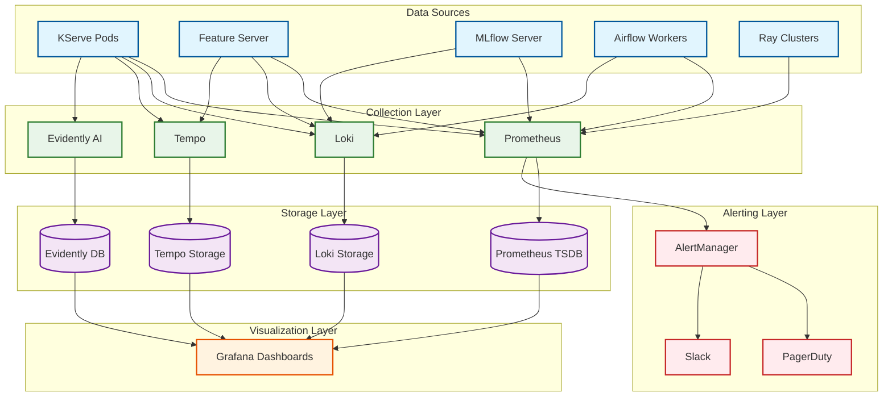
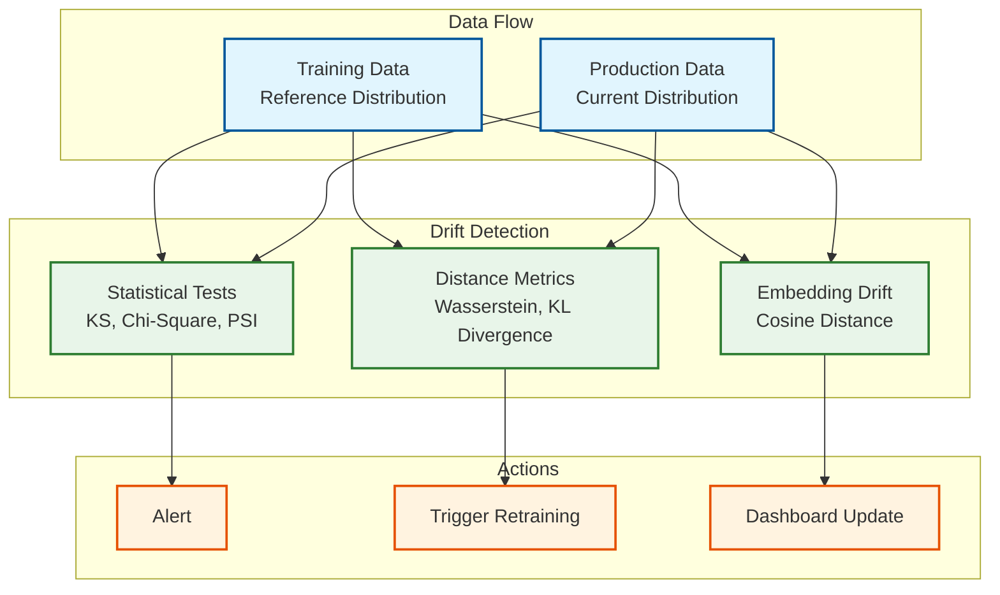
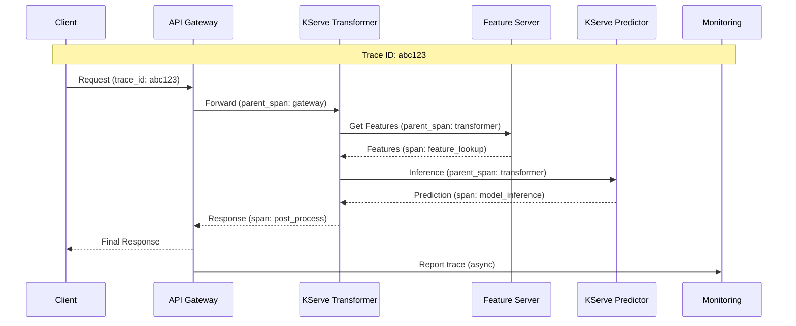

# Observability

## Observability Architecture



---

## Metrics (USE/RED Method)

### Platform Metrics Summary

| Component | USE Metrics | RED Metrics |
|-----------|-------------|-------------|
| **KServe** | CPU/GPU utilization, Memory, Queue depth | Request rate, Error rate, Duration |
| **Feature Server** | CPU, Memory, Connections | Feature request rate, Errors, Latency |
| **MLflow** | CPU, Memory, DB connections | Log rate, Query rate, Duration |
| **Airflow** | Worker utilization, Queue depth | Task rate, Failure rate, Duration |
| **Redis** | Memory, CPU, Connections | Operations/sec, Errors, Latency |

### KServe Inference Metrics

```yaml
# Key Prometheus metrics from KServe
kserve_inference_duration_seconds:
  type: histogram
  labels: [model_name, model_version, namespace]
  buckets: [0.005, 0.01, 0.025, 0.05, 0.1, 0.25, 0.5, 1, 2.5, 5, 10]
  description: "Inference request duration in seconds"

kserve_inference_requests_total:
  type: counter
  labels: [model_name, model_version, namespace, status_code]
  description: "Total number of inference requests"

kserve_inference_errors_total:
  type: counter
  labels: [model_name, model_version, namespace, error_type]
  description: "Total number of inference errors"

kserve_model_load_latency_seconds:
  type: histogram
  labels: [model_name, model_version]
  description: "Time to load model from storage"

kserve_inference_queue_depth:
  type: gauge
  labels: [model_name, namespace]
  description: "Current inference request queue depth"

# GPU metrics (NVIDIA DCGM)
DCGM_FI_DEV_GPU_UTIL:
  type: gauge
  labels: [gpu, UUID, pod, namespace]
  description: "GPU utilization percentage"

DCGM_FI_DEV_MEM_USED:
  type: gauge
  labels: [gpu, UUID, pod, namespace]
  description: "GPU memory used in bytes"

DCGM_FI_DEV_POWER_USAGE:
  type: gauge
  labels: [gpu, UUID, pod, namespace]
  description: "GPU power usage in watts"
```

### Feature Server Metrics

```yaml
# Feast Feature Server metrics
feast_feature_server_request_latency_seconds:
  type: histogram
  labels: [feature_service, method]
  buckets: [0.001, 0.005, 0.01, 0.025, 0.05, 0.1, 0.25, 0.5, 1]
  description: "Feature retrieval latency"

feast_feature_server_request_count:
  type: counter
  labels: [feature_service, method, status]
  description: "Total feature requests"

feast_online_store_latency_seconds:
  type: histogram
  labels: [operation]
  description: "Online store operation latency"

feast_feature_freshness_seconds:
  type: gauge
  labels: [feature_view]
  description: "Time since last feature materialization"

feast_feature_row_count:
  type: gauge
  labels: [feature_view, store]
  description: "Number of feature rows in store"

feast_online_store_connection_pool_size:
  type: gauge
  description: "Current connection pool size"
```

### MLflow Metrics

```yaml
# MLflow Tracking Server metrics
mlflow_experiment_count:
  type: gauge
  description: "Total number of experiments"

mlflow_run_count:
  type: gauge
  labels: [experiment_id, status]
  description: "Number of runs by status"

mlflow_metric_log_latency_seconds:
  type: histogram
  labels: [endpoint]
  description: "Metric logging latency"

mlflow_artifact_upload_bytes:
  type: counter
  labels: [experiment_id]
  description: "Total bytes uploaded as artifacts"

mlflow_model_registry_versions:
  type: gauge
  labels: [model_name, stage]
  description: "Model versions by stage"

mlflow_api_request_duration_seconds:
  type: histogram
  labels: [endpoint, method, status]
  description: "API request duration"
```

### Airflow Metrics

```yaml
# Airflow orchestration metrics
airflow_dag_run_duration_seconds:
  type: histogram
  labels: [dag_id]
  description: "DAG run duration"

airflow_task_instance_duration_seconds:
  type: histogram
  labels: [dag_id, task_id, operator]
  description: "Task execution duration"

airflow_task_instance_failures:
  type: counter
  labels: [dag_id, task_id]
  description: "Task failure count"

airflow_scheduler_heartbeat:
  type: gauge
  description: "Last scheduler heartbeat timestamp"

airflow_executor_running_tasks:
  type: gauge
  labels: [executor]
  description: "Currently running tasks"

airflow_pool_open_slots:
  type: gauge
  labels: [pool]
  description: "Available slots in pool"
```

---

## ML-Specific Monitoring

### Data Drift Detection



### Drift Metrics Configuration

```yaml
# Evidently AI drift detection configuration
drift_detection_config:
  # Feature drift
  data_drift:
    method: "psi"  # Population Stability Index
    threshold: 0.2  # PSI > 0.2 indicates significant drift
    features:
      - transaction_amount
      - user_age
      - merchant_category

  # Prediction drift
  prediction_drift:
    method: "wasserstein"
    threshold: 0.1
    target_column: "fraud_probability"

  # Concept drift (if labels available)
  target_drift:
    method: "chi_square"
    threshold: 0.05
    target_column: "is_fraud"

  # Embedding drift (for text/image models)
  embedding_drift:
    method: "cosine_distance"
    threshold: 0.15
    embedding_column: "text_embedding"

# Alerting thresholds
alerting:
  data_drift_psi:
    warning: 0.1
    critical: 0.2
  prediction_drift:
    warning: 0.05
    critical: 0.1
  missing_values:
    warning: 5%
    critical: 10%
```

### Model Performance Monitoring

```yaml
# Model quality metrics
model_performance_metrics:
  # Classification metrics
  classification:
    - accuracy
    - precision
    - recall
    - f1_score
    - auc_roc
    - log_loss

  # Regression metrics
  regression:
    - mae
    - mse
    - rmse
    - r2_score
    - mape

  # Ranking metrics
  ranking:
    - ndcg
    - mrr
    - map

# Performance monitoring Prometheus metrics
model_accuracy:
  type: gauge
  labels: [model_name, model_version]
  description: "Current model accuracy"

model_precision:
  type: gauge
  labels: [model_name, model_version, class]
  description: "Precision per class"

model_auc_roc:
  type: gauge
  labels: [model_name, model_version]
  description: "AUC-ROC score"

model_predictions_by_class:
  type: counter
  labels: [model_name, model_version, predicted_class]
  description: "Prediction distribution by class"
```

### Feature Freshness Monitoring

```yaml
# Feature freshness metrics and alerts
feature_freshness:
  metrics:
    feast_feature_freshness_seconds:
      type: gauge
      labels: [feature_view]
      description: "Seconds since last materialization"

    feast_feature_staleness_ratio:
      type: gauge
      labels: [feature_view]
      description: "Ratio of stale features (age > SLA)"

  # Freshness SLAs by feature type
  sla:
    real_time_features:
      max_age_seconds: 300  # 5 minutes
    hourly_features:
      max_age_seconds: 7200  # 2 hours
    daily_features:
      max_age_seconds: 129600  # 36 hours

  # Alerting rules
  alerts:
    - name: FeatureStaleWarning
      condition: feast_feature_freshness_seconds > sla_max_age * 0.8
      severity: warning

    - name: FeatureStaleCritical
      condition: feast_feature_freshness_seconds > sla_max_age
      severity: critical
      action: trigger_materialization
```

---

## Dashboard Design

### Executive Overview Dashboard

```
┌─────────────────────────────────────────────────────────────────┐
│                    ML Platform Health                           │
├────────────────────┬────────────────────┬───────────────────────┤
│ Platform Uptime    │ Active Models      │ Daily Predictions     │
│ 99.95%            │ 487                │ 52.3M                 │
├────────────────────┴────────────────────┴───────────────────────┤
│                                                                 │
│  Inference Latency (P99)            │  Feature Lookup (P99)    │
│  ┌─────────────────────────────┐    │  ┌───────────────────┐   │
│  │ 150ms ─────────────────── │    │  │ 25ms ─────────── │   │
│  │        SLA: 200ms          │    │  │    SLA: 50ms     │   │
│  └─────────────────────────────┘    │  └───────────────────┘   │
│                                                                 │
├─────────────────────────────────────────────────────────────────┤
│                    Model Health Summary                         │
│  ┌─────────────────────────────────────────────────────────┐   │
│  │ Healthy: 475 │ Degraded: 10 │ Critical: 2              │   │
│  └─────────────────────────────────────────────────────────┘   │
│                                                                 │
│  Drift Alerts (Last 24h)          │  Pipeline Status           │
│  │ Data Drift: 3                  │  Running: 12               │
│  │ Performance Drift: 1           │  Failed: 2                 │
│  │ Feature Staleness: 0           │  Queued: 5                 │
│                                                                 │
└─────────────────────────────────────────────────────────────────┘
```

### Model-Specific Dashboard

```
┌─────────────────────────────────────────────────────────────────┐
│           Model: fraud-detector-v3 (Production)                 │
├────────────────────┬────────────────────┬───────────────────────┤
│ Request Rate       │ Error Rate         │ Latency P99           │
│ 1,250 req/s       │ 0.02%              │ 85ms                  │
├────────────────────┴────────────────────┴───────────────────────┤
│                                                                 │
│  Latency Distribution                                           │
│  ┌─────────────────────────────────────────────────────────┐   │
│  │     █                                                    │   │
│  │    ███                                                   │   │
│  │   █████                                                  │   │
│  │  ███████                                                 │   │
│  │ █████████ ██                                             │   │
│  │ P50:20ms  P95:60ms  P99:85ms                             │   │
│  └─────────────────────────────────────────────────────────┘   │
│                                                                 │
│  Prediction Distribution        │  Feature Drift (PSI)         │
│  ┌─────────────────────────┐    │  ┌───────────────────────┐   │
│  │ Fraud: 2.3%             │    │  │ txn_amount: 0.08     │   │
│  │ Not Fraud: 97.7%        │    │  │ user_age: 0.03       │   │
│  └─────────────────────────┘    │  │ merchant: 0.12 ⚠️    │   │
│                                 │  └───────────────────────┘   │
│                                                                 │
│  Resource Utilization                                           │
│  ┌─────────────────────────────────────────────────────────┐   │
│  │ CPU: 45% ████████░░░░░░░░░░░░                            │   │
│  │ Memory: 62% ████████████░░░░░░░░                         │   │
│  │ GPU: 78% ███████████████░░░░░                            │   │
│  └─────────────────────────────────────────────────────────┘   │
│                                                                 │
│  Replicas: 5/10     │  GPU Memory: 12.4GB/16GB                 │
│                                                                 │
└─────────────────────────────────────────────────────────────────┘
```

### Feature Store Dashboard

```
┌─────────────────────────────────────────────────────────────────┐
│                    Feature Store Health                         │
├────────────────────┬────────────────────┬───────────────────────┤
│ Online Store       │ Feature Views      │ Entities              │
│ 99.99% Available  │ 156 Active         │ 12 Defined            │
├────────────────────┴────────────────────┴───────────────────────┤
│                                                                 │
│  Feature Freshness by View                                      │
│  ┌─────────────────────────────────────────────────────────┐   │
│  │ user_features      │████████████████░░░░│ 2h ago (OK)    │   │
│  │ txn_features       │████████████████████│ 5m ago (OK)    │   │
│  │ merchant_features  │████████░░░░░░░░░░░░│ 8h ago (WARN)  │   │
│  │ product_features   │██████████████████░░│ 1h ago (OK)    │   │
│  └─────────────────────────────────────────────────────────┘   │
│                                                                 │
│  Online Store Latency           │  Cache Hit Rate              │
│  ┌─────────────────────────┐    │  ┌───────────────────────┐   │
│  │ P50: 3ms                │    │  │                       │   │
│  │ P95: 8ms                │    │  │   97.2%              │   │
│  │ P99: 15ms               │    │  │                       │   │
│  └─────────────────────────┘    │  └───────────────────────┘   │
│                                                                 │
│  Materialization Jobs (Last 24h)                                │
│  ┌─────────────────────────────────────────────────────────┐   │
│  │ Succeeded: 48  │  Failed: 2  │  Running: 3              │   │
│  └─────────────────────────────────────────────────────────┘   │
│                                                                 │
└─────────────────────────────────────────────────────────────────┘
```

---

## Logging Strategy

### Log Levels by Component

| Component | Debug | Info | Warning | Error |
|-----------|-------|------|---------|-------|
| **KServe** | Request details | Scaling events | Slow inference | Failures |
| **Feature Server** | Cache operations | Request summary | Staleness | Errors |
| **MLflow** | Query details | Run lifecycle | Storage issues | Failures |
| **Airflow** | Task details | DAG execution | Retries | Task failures |

### Structured Logging Format

```json
{
  "timestamp": "2024-01-25T10:30:00.123Z",
  "level": "INFO",
  "logger": "kserve.predictor",
  "message": "Inference completed",
  "trace_id": "abc123def456",
  "span_id": "span789",
  "service": "fraud-detector",
  "version": "v3",
  "attributes": {
    "model_name": "fraud-detector",
    "model_version": "3",
    "inference_time_ms": 45,
    "input_features": 10,
    "prediction": 0.85,
    "prediction_class": "fraud"
  },
  "kubernetes": {
    "pod": "fraud-detector-predictor-5f9b7c8d9-x2j4k",
    "namespace": "model-serving",
    "node": "worker-gpu-01"
  }
}
```

### Log Retention Policy

| Log Type | Retention | Storage |
|----------|-----------|---------|
| **Debug** | 3 days | Loki (hot) |
| **Info** | 14 days | Loki (warm) |
| **Warning** | 30 days | Loki (cold) |
| **Error** | 90 days | S3 (archive) |
| **Audit** | 1 year | S3 (compliance) |

---

## Distributed Tracing

### Trace Propagation



### Key Spans to Instrument

| Span Name | Component | Tags |
|-----------|-----------|------|
| **http.request** | Gateway | method, path, status |
| **feature.lookup** | Feature Server | feature_service, entity_count |
| **model.inference** | KServe | model_name, model_version, batch_size |
| **transform.preprocess** | Transformer | input_size |
| **transform.postprocess** | Transformer | output_size |
| **db.query** | MLflow | query_type, table |
| **cache.get** | Redis | key_pattern, hit |

### Tracing Configuration

```yaml
# OpenTelemetry configuration
apiVersion: v1
kind: ConfigMap
metadata:
  name: otel-collector-config
data:
  otel-collector-config.yaml: |
    receivers:
      otlp:
        protocols:
          grpc:
            endpoint: 0.0.0.0:4317
          http:
            endpoint: 0.0.0.0:4318

    processors:
      batch:
        timeout: 1s
        send_batch_size: 1000

      tail_sampling:
        decision_wait: 10s
        policies:
          - name: errors
            type: status_code
            status_code:
              status_codes: [ERROR]
          - name: slow-traces
            type: latency
            latency:
              threshold_ms: 1000
          - name: sample-10-percent
            type: probabilistic
            probabilistic:
              sampling_percentage: 10

    exporters:
      otlp:
        endpoint: tempo:4317
        tls:
          insecure: true

    service:
      pipelines:
        traces:
          receivers: [otlp]
          processors: [batch, tail_sampling]
          exporters: [otlp]
```

---

## Alerting Configuration

### Critical Alerts (Page-worthy)

```yaml
# AlertManager rules for critical alerts
groups:
  - name: ml-platform-critical
    rules:
      # Model serving down
      - alert: ModelServingDown
        expr: up{job="kserve-inference"} == 0
        for: 2m
        labels:
          severity: critical
          team: ml-platform
        annotations:
          summary: "Model serving is down"
          description: "KServe inference pods are not responding"
          runbook: "https://runbooks.company.com/ml/kserve-down"

      # High error rate
      - alert: HighInferenceErrorRate
        expr: |
          sum(rate(kserve_inference_errors_total[5m])) by (model_name)
          / sum(rate(kserve_inference_requests_total[5m])) by (model_name)
          > 0.05
        for: 5m
        labels:
          severity: critical
          team: ml-platform
        annotations:
          summary: "High error rate for model {{ $labels.model_name }}"
          description: "Error rate is {{ $value | humanizePercentage }}"

      # Feature store unavailable
      - alert: FeatureStoreDown
        expr: up{job="feast-feature-server"} == 0
        for: 1m
        labels:
          severity: critical
          team: ml-platform
        annotations:
          summary: "Feature store is unavailable"
          description: "Feast feature server is not responding"

      # GPU out of memory
      - alert: GPUOutOfMemory
        expr: DCGM_FI_DEV_MEM_USED / DCGM_FI_DEV_MEM_TOTAL > 0.95
        for: 5m
        labels:
          severity: critical
          team: ml-platform
        annotations:
          summary: "GPU memory nearly exhausted on {{ $labels.pod }}"
```

### Warning Alerts

```yaml
groups:
  - name: ml-platform-warnings
    rules:
      # High latency
      - alert: HighInferenceLatency
        expr: |
          histogram_quantile(0.99,
            sum(rate(kserve_inference_duration_seconds_bucket[5m])) by (le, model_name)
          ) > 0.5
        for: 10m
        labels:
          severity: warning
          team: ml-platform
        annotations:
          summary: "High P99 latency for model {{ $labels.model_name }}"
          description: "P99 latency is {{ $value | humanizeDuration }}"

      # Feature staleness
      - alert: FeatureStale
        expr: feast_feature_freshness_seconds > 7200
        for: 15m
        labels:
          severity: warning
          team: ml-data
        annotations:
          summary: "Feature view {{ $labels.feature_view }} is stale"
          description: "Last materialization was {{ $value | humanizeDuration }} ago"

      # Data drift detected
      - alert: DataDriftDetected
        expr: evidently_data_drift_psi > 0.15
        for: 30m
        labels:
          severity: warning
          team: ml-platform
        annotations:
          summary: "Data drift detected for {{ $labels.feature }}"
          description: "PSI value is {{ $value }}"

      # Pipeline failures
      - alert: PipelineFailureRate
        expr: |
          sum(rate(airflow_task_instance_failures[1h])) by (dag_id)
          / sum(rate(airflow_task_instance_duration_seconds_count[1h])) by (dag_id)
          > 0.1
        for: 1h
        labels:
          severity: warning
          team: ml-platform
        annotations:
          summary: "High failure rate for DAG {{ $labels.dag_id }}"

      # Low cache hit rate
      - alert: LowCacheHitRate
        expr: |
          sum(rate(feast_online_store_cache_hits_total[5m]))
          / sum(rate(feast_online_store_requests_total[5m]))
          < 0.9
        for: 15m
        labels:
          severity: warning
          team: ml-platform
        annotations:
          summary: "Feature cache hit rate below 90%"
```

---

## Runbook References

### Runbook Index

| Alert | Runbook | On-Call Team |
|-------|---------|--------------|
| ModelServingDown | [kserve-down.md](runbooks/kserve-down.md) | ML Platform |
| HighInferenceErrorRate | [high-error-rate.md](runbooks/high-error-rate.md) | ML Platform |
| FeatureStoreDown | [feast-down.md](runbooks/feast-down.md) | ML Platform |
| GPUOutOfMemory | [gpu-oom.md](runbooks/gpu-oom.md) | ML Platform |
| DataDriftDetected | [data-drift.md](runbooks/data-drift.md) | ML Engineering |
| FeatureStale | [feature-stale.md](runbooks/feature-stale.md) | Data Engineering |

### Sample Runbook Structure

```markdown
# Runbook: KServe Model Serving Down

## Alert
- Name: ModelServingDown
- Severity: Critical
- Team: ML Platform

## Symptoms
- 5xx errors on inference endpoints
- Pods in CrashLoopBackOff
- Prometheus targets down

## Investigation Steps
1. Check pod status: `kubectl get pods -n model-serving`
2. Check pod logs: `kubectl logs -n model-serving <pod>`
3. Check events: `kubectl get events -n model-serving`
4. Check resource usage: Grafana dashboard "KServe Resources"

## Common Causes
1. **OOM Killed**: Model too large for allocated memory
   - Solution: Increase memory limits or use smaller model
2. **Model Load Failure**: Cannot download model from storage
   - Solution: Check storage connectivity, verify artifact exists
3. **GPU Not Available**: GPU resources exhausted
   - Solution: Check node GPU capacity, scale cluster

## Mitigation
1. Scale up healthy replicas: `kubectl scale ...`
2. Rollback to previous version if recent deployment
3. Enable fallback to simpler model

## Escalation
- After 15 minutes: Page ML Platform lead
- After 30 minutes: Page Engineering Director
```

---

## SLI/SLO Summary

| Service | SLI | SLO | Measurement |
|---------|-----|-----|-------------|
| **Inference** | Request success rate | 99.9% | `1 - (errors / requests)` |
| **Inference** | Latency P99 | <200ms | `histogram_quantile(0.99, ...)` |
| **Features** | Lookup success rate | 99.9% | `1 - (errors / requests)` |
| **Features** | Lookup P99 | <50ms | `histogram_quantile(0.99, ...)` |
| **Features** | Freshness | <SLA | `freshness_seconds < max_age` |
| **MLflow** | API availability | 99.5% | `up{job="mlflow"}` |
| **Pipelines** | Success rate | >95% | `1 - (failed / total)` |
