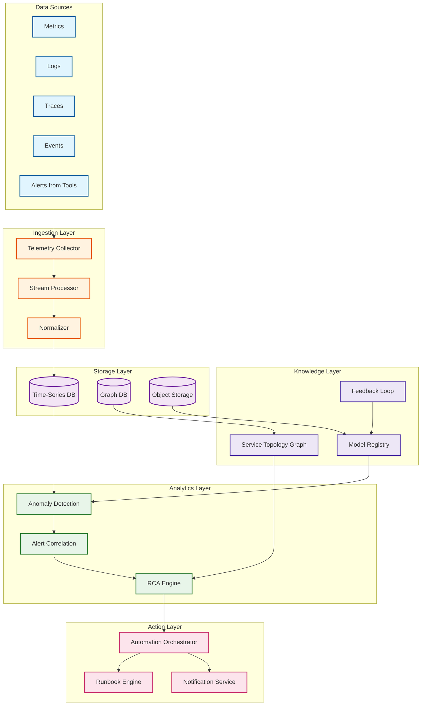

# AIOps System

> An intelligent IT operations platform that uses machine learning and artificial intelligence to automate monitoring, alerting, root cause analysis, and incident remediation across distributed systems.

---

## Overview

AIOps (Artificial Intelligence for IT Operations) represents a paradigm shift from reactive to proactive IT operations. Unlike traditional monitoring that floods operators with thousands of alerts, AIOps applies ML/AI to **observe** telemetry data, **analyze** patterns to detect anomalies and identify root causes, and **act** through automated remediation—creating a closed-loop system that reduces Mean Time to Resolution (MTTR) and alert fatigue.

The core challenge AIOps solves: modern microservices architectures generate 10,000+ alerts per day, yet 97% are noise or symptoms rather than root causes. AIOps compresses this into ~300 actionable incidents through intelligent correlation, causal analysis, and noise suppression.

---

## System Characteristics

| Characteristic | Description |
|----------------|-------------|
| **Architecture Style** | Event-driven, streaming-first, ML-augmented closed loop |
| **Deployment Model** | Kubernetes-native, multi-tenant, cloud-agnostic |
| **Primary Pattern** | Observe → Analyze → Act (closed-loop automation) |
| **Workload Type** | High-volume telemetry ingestion + real-time ML inference |
| **Data Sources** | Metrics, logs, traces, events from 90+ monitoring tools |
| **Scale Target** | 1M+ metrics/sec, 50K hosts, 100+ tool integrations |
| **Latency Target** | <5s anomaly detection, <30s RCA |
| **Consistency Model** | Eventually consistent for analytics, strongly consistent for actions |
| **Availability Target** | 99.99% (higher than monitored systems) |

---

## Complexity Rating

| Component | Complexity | Rationale |
|-----------|------------|-----------|
| Data Ingestion | Medium | Polyglot data normalization, high-throughput streaming |
| Anomaly Detection | High | Three-tier algorithms, model training, real-time inference |
| Alert Correlation | High | Dynamic clustering, topology awareness, noise suppression |
| Root Cause Analysis | Very High | Causal inference (not correlation), graph algorithms, Bayesian ranking |
| Automated Remediation | High | Approval workflows, rollback, blast radius limiting |
| Knowledge Graph | Medium | Service topology, dependency mapping |
| Overall | **Very High** | Meta-monitoring system that must be more reliable than monitored systems |

---

## Quick Navigation

| Document | Description |
|----------|-------------|
| [01 - Requirements & Estimations](./01-requirements-and-estimations.md) | Functional/non-functional requirements, capacity planning, SLOs |
| [02 - High-Level Design](./02-high-level-design.md) | 5-layer architecture, data flows, key decisions |
| [03 - Low-Level Design](./03-low-level-design.md) | Data models, API design, core algorithms (pseudocode) |
| [04 - Deep Dive & Bottlenecks](./04-deep-dive-and-bottlenecks.md) | Anomaly detection, RCA, correlation engines in depth |
| [05 - Scalability & Reliability](./05-scalability-and-reliability.md) | Horizontal scaling, fault tolerance, graceful degradation |
| [06 - Security & Compliance](./06-security-and-compliance.md) | AuthN/AuthZ, multi-tenancy, threat model |
| [07 - Observability](./07-observability.md) | Meta-observability: monitoring the monitor |
| [08 - Interview Guide](./08-interview-guide.md) | 45-min pacing, trap questions, trade-offs |

---

## Core Components

| Layer | Component | Responsibility | Key Technology Patterns |
|-------|-----------|----------------|------------------------|
| **Ingestion** | Telemetry Collector | Polyglot data collection from 90+ tools | OpenTelemetry, push/pull modes |
| **Ingestion** | Stream Processor | Real-time event processing and enrichment | Kafka, Flink-style processing |
| **Analytics** | Anomaly Detection Engine | Three-tier ML/statistical anomaly detection | Isolation Forest, LSTM, Prophet |
| **Analytics** | Alert Correlation Engine | Cluster related alerts into incidents | Dynamic-X-Y algorithm |
| **Analytics** | RCA Engine | Identify root cause using causal inference | Causal graphs, Bayesian ranking |
| **Action** | Automation Orchestrator | Execute runbooks with approval workflows | Workflow engine, rollback support |
| **Action** | Notification Service | Multi-channel alerting and escalation | PagerDuty/OpsGenie integration |
| **Knowledge** | Service Topology Graph | Store and query service dependencies | Graph database, materialized views |
| **Knowledge** | Model Registry | Version and serve ML models | A/B testing, fallback rules |
| **Knowledge** | Feedback Collector | Capture operator feedback for learning | Continuous model improvement |

---

## Architecture Overview



---

## The AIOps Value Proposition

### Before AIOps (Traditional Monitoring)

```
Raw Alerts: 10,000/day
    │
    └──→ All sent to on-call engineer
         │
         └──→ Manual triage (hours)
              │
              └──→ Manual investigation (hours)
                   │
                   └──→ Manual remediation
                        │
                        └──→ MTTR: 4-8 hours
```

### After AIOps

```
Raw Alerts: 10,000/day
    │
    ├──→ Deduplication (-30%) → 7,000
    │
    ├──→ Anomaly Filtering (-50%) → 3,500
    │
    ├──→ Alert Correlation (-80%) → 700
    │
    └──→ Noise Suppression (-50%) → 350 incidents
         │
         ├──→ Auto-remediated (60%) → 210 resolved automatically
         │
         └──→ Human attention (40%) → 140 with RCA + runbook suggestions
              │
              └──→ MTTR: 15-30 minutes
```

**Result:** 97% alert suppression, 90%+ reduction in MTTR

---

## Three Core Pillars

### 1. Observe (Data Ingestion)

- **What:** Collect metrics, logs, traces, and events from 90+ monitoring tools
- **Challenge:** Heterogeneous data formats, high-volume streaming, data quality
- **Solution:** OpenTelemetry-based collection with polyglot normalization

### 2. Analyze (Intelligence Layer)

- **Anomaly Detection:** Three-tier approach (Basic → Agile → Robust) balancing latency vs. accuracy
- **Alert Correlation:** Dynamic-X-Y algorithm clusters related alerts using time + topology
- **Root Cause Analysis:** Causal inference (not just correlation) with Bayesian ranking

### 3. Act (Automation Layer)

- **Automated Remediation:** Execute runbooks with approval workflows for critical actions
- **Human-in-the-Loop:** Maintain operator trust through explainable AI and gradual automation
- **Continuous Learning:** Feedback loop improves models over time

---

## Key Design Principles

| Principle | Description |
|-----------|-------------|
| **Trust Through Explainability** | Every alert and action must be traceable with clear reasoning |
| **Human-in-the-Loop** | Critical remediations require approval; earn trust before full automation |
| **Graceful Degradation** | Fall back to rule-based detection if ML fails |
| **Continuous Learning** | Operator feedback improves models over time |
| **Causal Over Correlation** | RCA uses causal inference to avoid correlation != causation trap |
| **Meta-Reliability** | AIOps must be more reliable than the systems it monitors |

---

## Real-World Implementations

| Platform | Key Innovation | Scale |
|----------|----------------|-------|
| **Datadog Watchdog** | Three-algorithm framework (Basic/Agile/Robust), early anomaly detection | Millions of metrics/sec |
| **IBM Watson AIOps** | 90+ tool integration, NLP for logs, knowledge graphs | Enterprise-scale |
| **New Relic Applied Intelligence** | AI-assisted metrics, predictive correlations | SaaS-native |
| **Splunk ITSI** | Service-centric monitoring, predictive analytics | Enterprise SIEM integration |
| **Apache SkyWalking** | Open-source APM with AIOps engine | Community-driven |
| **Salesforce PyRCA** | Open-source RCA library with causal inference | Research + production |

---

## Modern Trends (2025-2026)

| Trend | Description |
|-------|-------------|
| **LLM-Based Incident Analysis** | RAG for historical incident search, LLM-powered summarization |
| **Agentic SRE** | Autonomous AI agents that reason about infrastructure problems |
| **Causal Inference** | Moving beyond correlation to true causation for RCA |
| **Predictive Alerting** | ML forecasting to alert before issues occur |
| **Self-Healing Infrastructure** | Gartner predicts 60%+ enterprises will have self-healing by 2026 |

---

## Key Numbers

| Metric | Target |
|--------|--------|
| Metric ingestion throughput | 1M metrics/second |
| Log ingestion throughput | 100K lines/second |
| Monitored hosts | 50,000 |
| Tool integrations | 90+ |
| Alert suppression rate | >97% |
| Anomaly detection latency | <5 seconds |
| RCA latency | <30 seconds |
| False positive rate | <5% |
| System availability | 99.99% |
| MTTR reduction | 90%+ |

---

## When to Use AIOps

**Good Fit:**
- Large-scale microservices with 1000+ services
- High alert volume (>1000 alerts/day)
- Complex service dependencies
- Need to reduce MTTR from hours to minutes
- Multiple monitoring tools generating fragmented signals

**Not Ideal For:**
- Small monolithic applications
- Low-volume environments (<100 alerts/day)
- Single monitoring tool with built-in correlation
- Organizations not ready for ML-based operations

---

## References

- [Datadog Watchdog AI](https://www.datadoghq.com/blog/early-anomaly-detection-datadog-aiops/)
- [IBM Watson AIOps](https://www.ibm.com/products/watson-aiops)
- [Apache SkyWalking AIOps Engine](https://github.com/SkyAPM/aiops-engine-for-skywalking)
- [Salesforce PyRCA](https://github.com/salesforce/PyRCA)
- [Dynamic Alert Suppression for AIOps (ACM ICSE)](https://dl.acm.org/doi/10.1145/3639477.3639752)
- [A Survey of AIOps in the Era of LLMs (ACM Computing Surveys)](https://dl.acm.org/doi/10.1145/3746635)
