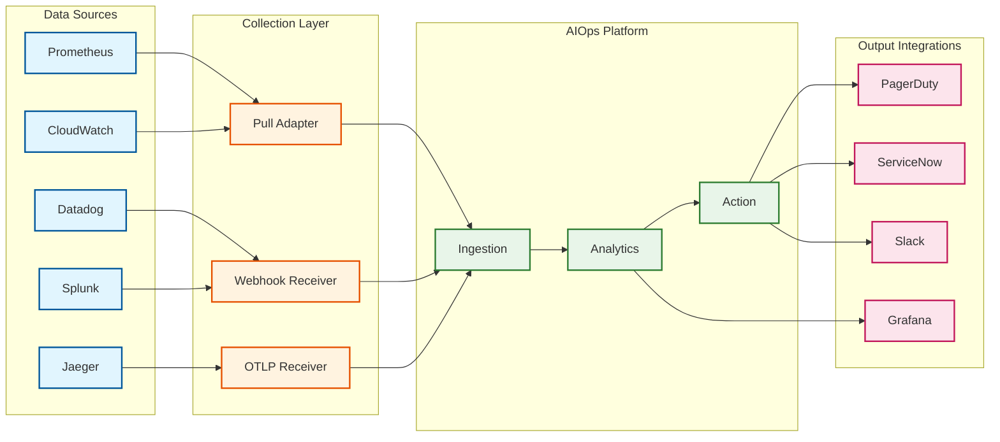

# Requirements & Capacity Estimations

This document defines the functional and non-functional requirements for an AIOps system, along with capacity estimations and SLO definitions.

---

## Functional Requirements

### Core Requirements (P0)

| ID | Requirement | Component | Description |
|----|-------------|-----------|-------------|
| FR-01 | Telemetry Ingestion | Ingestion | Ingest metrics, logs, traces, and events from 90+ monitoring tools |
| FR-02 | Anomaly Detection | Analytics | Detect anomalies using statistical and ML algorithms with configurable sensitivity |
| FR-03 | Alert Correlation | Analytics | Correlate related alerts into unified incidents using time and topology |
| FR-04 | Root Cause Analysis | Analytics | Identify root cause using causal inference, not just correlation |
| FR-05 | Automated Remediation | Action | Execute runbooks automatically with approval workflows for critical actions |
| FR-06 | Service Topology | Knowledge | Maintain and query service dependency graph |
| FR-07 | Notification & Escalation | Action | Route incidents to appropriate teams with configurable escalation |

### Enhanced Requirements (P1)

| ID | Requirement | Component | Description |
|----|-------------|-----------|-------------|
| FR-08 | Explainable AI | Analytics | Provide clear reasoning for every alert and recommended action |
| FR-09 | Predictive Alerting | Analytics | Predict issues before they occur using ML forecasting |
| FR-10 | LLM Incident Analysis | Analytics | Use LLMs with RAG for incident summarization and similar incident search |
| FR-11 | Multi-Tenancy | Platform | Support tenant isolation for SaaS deployment |
| FR-12 | Custom Integrations | Ingestion | Allow users to build custom connectors for unsupported tools |

### Future Requirements (P2)

| ID | Requirement | Component | Description |
|----|-------------|-----------|-------------|
| FR-13 | Self-Healing | Action | Fully autonomous remediation without human approval |
| FR-14 | Agentic SRE | Analytics | AI agents that reason about infrastructure problems autonomously |
| FR-15 | Chaos Integration | Analytics | Correlate incidents with chaos engineering experiments |

---

## Anomaly Detection Requirements

### Three-Tier Detection Strategy

| Tier | Algorithms | Latency | Accuracy | Use Case |
|------|------------|---------|----------|----------|
| **Basic** | Moving average, static thresholds, Holt-Winters | <100ms | 70% | High-volume infrastructure metrics |
| **Agile** | Prophet, ARIMA, adaptive thresholds | <1s | 85% | Business KPIs, seasonal metrics |
| **Robust** | Isolation Forest, LSTM, ensemble voting | <5s | 95% | Critical systems, anomaly chains |

### Detection Capabilities

- **Univariate Detection:** Single metric anomaly detection
- **Multivariate Detection:** Detect anomalies across correlated metrics
- **Seasonal Decomposition:** Handle daily/weekly/monthly patterns
- **Trend Detection:** Identify gradual degradation before threshold breach
- **Outlier Detection:** Detect sudden spikes and drops
- **Pattern Recognition:** Identify recurring anomaly patterns

### Configurable Parameters

```yaml
anomaly_detection_config:
  tier: "agile"                    # basic, agile, robust
  sensitivity: 0.7                 # 0.0 (lenient) to 1.0 (strict)
  min_data_points: 100             # Minimum history for ML models
  seasonality_mode: "auto"         # auto, daily, weekly, none
  aggregation_window: "5m"         # Time window for aggregation
  cooldown_period: "15m"           # Minimum time between alerts
```

---

## Root Cause Analysis Requirements

### Causal Inference Capabilities

| Capability | Description |
|------------|-------------|
| **Topology-Aware Analysis** | Use service dependency graph to constrain causal search |
| **Granger Causality** | Test temporal causation between metric pairs |
| **Intervention Analysis** | Apply do-calculus for causal inference |
| **Bayesian Ranking** | Rank root causes by posterior probability |
| **Service Impact Analysis** | Determine downstream impact of each root cause |

### RCA Output Format

```yaml
rca_result:
  incident_id: "INC-2024-001234"
  confidence: 0.87
  root_causes:
    - service: "payment-service"
      component: "database-connection-pool"
      probability: 0.72
      evidence:
        - "Connection pool exhaustion detected 30s before errors"
        - "Upstream services healthy during incident"
      suggested_remediation: "runbook-db-pool-resize"
    - service: "api-gateway"
      component: "rate-limiter"
      probability: 0.18
      evidence:
        - "Rate limit threshold reached at incident start"
  causal_chain:
    - "DB connection pool exhaustion"
    - "→ Payment service timeout"
    - "→ API gateway 5xx errors"
    - "→ Customer-facing failures"
```

---

## Alert Correlation Requirements

### Correlation Dimensions

| Dimension | Description | Example |
|-----------|-------------|---------|
| **Temporal** | Alerts within configurable time window | 5-minute sliding window |
| **Topological** | Alerts from dependent services | Service A depends on Service B |
| **Semantic** | Alerts with similar labels/messages | Same error code, same host |
| **Causal** | Alerts in known causal chains | DB failure → Service timeout |

### Correlation Parameters

```yaml
correlation_config:
  time_window: "5m"              # Maximum time gap between correlated alerts
  topology_depth: 3              # Maximum hops in dependency graph
  similarity_threshold: 0.7     # Minimum similarity for clustering
  min_cluster_size: 2           # Minimum alerts to form incident
  suppression_mode: "smart"     # none, time_based, smart
```

### Target Metrics

| Metric | Target | Current Industry Benchmark |
|--------|--------|---------------------------|
| Alert-to-Incident Compression | 97%+ | 90-95% |
| False Negative Rate | <3% | 5-10% |
| Correlation Accuracy | >95% | 85-90% |

---

## Automated Remediation Requirements

### Runbook Execution Model

```yaml
runbook_definition:
  id: "runbook-db-pool-resize"
  name: "Database Connection Pool Resize"
  description: "Increase connection pool size when exhaustion detected"
  trigger:
    condition: "db_connection_pool_utilization > 90%"
    duration: "5m"
  approval:
    required: true
    approvers: ["sre-team", "db-admin"]
    timeout: "10m"
    auto_approve_if: "off_peak_hours AND impact_score < 3"
  actions:
    - type: "api_call"
      endpoint: "/api/v1/services/payment/config"
      method: "PATCH"
      payload:
        connection_pool_size: "${current * 1.5}"
    - type: "notification"
      channel: "slack"
      message: "Connection pool resized for ${service}"
  rollback:
    enabled: true
    trigger: "error_rate > baseline + 5%"
    actions:
      - type: "api_call"
        endpoint: "/api/v1/services/payment/config"
        method: "PATCH"
        payload:
          connection_pool_size: "${original}"
  blast_radius:
    max_affected_services: 1
    max_affected_users: 10000
```

### Remediation Guardrails

| Guardrail | Description |
|-----------|-------------|
| **Approval Workflows** | Critical actions require human approval |
| **Blast Radius Limiting** | Prevent cascading failures from remediation |
| **Rollback Capability** | Automatic rollback if remediation worsens situation |
| **Audit Trail** | Complete log of all automated actions |
| **Rate Limiting** | Prevent runbook storms (max 10 executions/hour) |

---

## Out of Scope

| Capability | Reason | Alternative |
|------------|--------|-------------|
| Full SIEM | Security-focused analytics is a separate domain | Integrate with Splunk, Elastic SIEM |
| Dashboarding | Best handled by specialized tools | Integrate with Grafana |
| CMDB | Configuration management is separate | Integrate with ServiceNow |
| Log Search | Full-text search is a separate problem | Integrate with Elasticsearch |
| APM Code-Level Tracing | Deep code profiling is separate | Integrate with Datadog APM, New Relic |

---

## Non-Functional Requirements

### Performance Requirements

| Metric | Requirement | Rationale |
|--------|-------------|-----------|
| **Alert Ingestion Latency** | <1 second (p99) | Real-time detection requires fast ingestion |
| **Anomaly Detection Latency** | <5 seconds (p99) | Near-real-time alerting |
| **RCA Latency** | <30 seconds (p99) | Time-critical incident triage |
| **Remediation Execution** | <10 seconds | Fast response to incidents |
| **API Response Time** | <200ms (p95) | Responsive UI experience |

### Reliability Requirements

| Metric | Requirement | Rationale |
|--------|-------------|-----------|
| **System Availability** | 99.99% | Must be more reliable than monitored systems |
| **Data Durability** | 99.999999% | Cannot lose telemetry data |
| **Alert Delivery Rate** | 99.95% | Critical alerts must be delivered |
| **Detection Availability** | 99.9% | Anomaly detection must always run |

### Quality Requirements

| Metric | Requirement | Rationale |
|--------|-------------|-----------|
| **Alert Suppression Rate** | >97% | Reduce alert fatigue |
| **False Positive Rate** | <5% | Maintain operator trust |
| **RCA Accuracy** | >90% | Correct root cause identification |
| **Remediation Success Rate** | >90% | Effective automated fixes |

### Scalability Requirements

| Metric | Requirement |
|--------|-------------|
| **Metrics Ingestion** | 1M metrics/second |
| **Log Ingestion** | 100K lines/second |
| **Traces Ingestion** | 10K traces/second |
| **Hosts Monitored** | 50,000 |
| **Services Monitored** | 5,000 |
| **Concurrent Users** | 1,000 |
| **Tool Integrations** | 90+ |

---

## Capacity Estimations

### Traffic Estimations

| Metric | Calculation | Result |
|--------|-------------|--------|
| **Metrics/sec** | 50K hosts × 20 metrics/host | 1M metrics/sec |
| **Logs/sec** | 50K hosts × 2 logs/sec | 100K logs/sec |
| **Traces/sec** | 5K services × 2 traces/sec | 10K traces/sec |
| **Raw Alerts/day** | 1M metrics × 0.01% anomaly rate × 86400 sec | ~10K alerts/day |
| **Incidents/day** | 10K alerts × 3% (after 97% suppression) | ~300 incidents/day |

### Storage Estimations

| Data Type | Calculation | Daily | 30 Days | 1 Year |
|-----------|-------------|-------|---------|--------|
| **Metrics** | 1M/sec × 100 bytes × 86400 | 8.6 TB | 258 TB | 3.1 PB |
| **Logs** | 100K/sec × 500 bytes × 86400 | 4.3 TB | 129 TB | 1.6 PB |
| **Traces** | 10K/sec × 2KB × 86400 | 1.7 TB | 51 TB | 620 TB |
| **Incidents** | 300/day × 50KB | 15 MB | 450 MB | 5.4 GB |
| **Models** | 100 models × 100MB | - | 10 GB | 10 GB |

### Storage Strategy

| Tier | Retention | Storage Type | Data |
|------|-----------|--------------|------|
| **Hot** | 7 days | SSD, in-memory | Recent metrics, active incidents |
| **Warm** | 30 days | SSD | Recent history, ML training data |
| **Cold** | 90 days | HDD | Historical data, compliance |
| **Archive** | 1+ years | Object Storage | Audit trail, long-term analysis |

### Compute Estimations

| Component | Calculation | Resources |
|-----------|-------------|-----------|
| **Ingestion** | 1M metrics/sec ÷ 100K/node | 10 nodes |
| **Stream Processing** | 1M events/sec ÷ 50K/node | 20 nodes |
| **Anomaly Detection** | 1M metrics × 3 tiers | 30 nodes (10 GPU) |
| **RCA Engine** | 300 incidents/day | 5 nodes |
| **Correlation** | 10K alerts/day | 5 nodes |
| **Automation** | 200 remediations/day | 3 nodes |
| **Knowledge Graph** | 5K services, 50K hosts | 5 nodes |

### Network Bandwidth

| Flow | Calculation | Bandwidth |
|------|-------------|-----------|
| **Ingestion** | (1M × 100B + 100K × 500B + 10K × 2KB)/sec | ~200 MB/sec |
| **Inter-service** | Internal processing overhead | ~100 MB/sec |
| **External APIs** | User queries + integrations | ~10 MB/sec |
| **Total** | Sum of all flows | ~310 MB/sec (~2.5 Gbps) |

---

## SLOs and SLAs

### Service Level Objectives

| SLI | Target | Measurement |
|-----|--------|-------------|
| **Availability** | 99.99% | Uptime of core detection pipeline |
| **Ingestion Latency** | p99 < 1s | Time from source to storage |
| **Detection Latency** | p99 < 5s | Time from metric to alert |
| **RCA Latency** | p99 < 30s | Time from incident to root cause |
| **Alert Delivery** | 99.95% | Percentage of alerts successfully delivered |
| **False Positive Rate** | <5% | Percentage of alerts marked as false positive |

### Error Budget Policy

```yaml
error_budget:
  monthly_budget: 4.32 minutes  # 99.99% availability

  policies:
    - trigger: "budget_consumed > 50%"
      action: "freeze non-critical deployments"

    - trigger: "budget_consumed > 75%"
      action: "focus all engineering on reliability"

    - trigger: "budget_consumed > 100%"
      action: "incident review required before any changes"
```

### SLA Tiers

| Tier | Availability | Support | Price Multiplier |
|------|--------------|---------|------------------|
| **Standard** | 99.9% | Business hours | 1x |
| **Premium** | 99.95% | 24/7 with 1hr response | 2x |
| **Enterprise** | 99.99% | 24/7 with 15min response | 4x |

---

## Integration Requirements

### Supported Data Sources

| Category | Examples | Protocol |
|----------|----------|----------|
| **Metrics** | Prometheus, Datadog, CloudWatch, InfluxDB | Pull/Push, OTLP |
| **Logs** | Fluentd, Logstash, Splunk, CloudWatch Logs | Syslog, HTTP, OTLP |
| **Traces** | Jaeger, Zipkin, X-Ray, OpenTelemetry | OTLP, Zipkin format |
| **Alerts** | PagerDuty, OpsGenie, VictorOps, Prometheus Alertmanager | Webhook |
| **ITSM** | ServiceNow, Jira, Zendesk | REST API |
| **Cloud** | AWS, GCP, Azure | Cloud APIs |

### Integration Architecture



---

## Constraints and Assumptions

### Technical Constraints

| Constraint | Impact |
|------------|--------|
| **Kubernetes Deployment** | All components must be containerized and K8s-native |
| **Cloud-Agnostic** | No hard dependencies on specific cloud providers |
| **Multi-Tenant** | Data isolation required for SaaS deployment |
| **Data Residency** | Support for regional data storage compliance |

### Assumptions

| Assumption | Rationale |
|------------|-----------|
| Metrics have consistent naming | Required for ML model training |
| Service topology is available | Required for RCA |
| Historical data exists for training | Cold start requires 7+ days of data |
| Operators will provide feedback | Required for continuous improvement |

---

## Success Metrics

### Operational Metrics

| Metric | Baseline | Target | Measurement |
|--------|----------|--------|-------------|
| **MTTR** | 4 hours | 30 minutes | Average time to resolve incidents |
| **Alert Volume** | 10K/day | 300/day | Alerts requiring human attention |
| **On-Call Load** | 50 pages/week | 10 pages/week | Pages per on-call rotation |
| **Automation Rate** | 10% | 60% | Incidents resolved without human intervention |

### Business Metrics

| Metric | Measurement |
|--------|-------------|
| **Cost Savings** | Reduced on-call staffing, faster resolution |
| **Customer Impact** | Reduced customer-facing incidents |
| **Engineering Velocity** | Less time on ops, more on features |
| **Compliance** | Audit trail for all changes |
