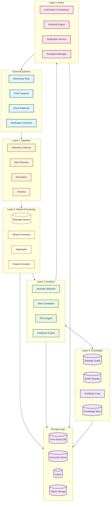
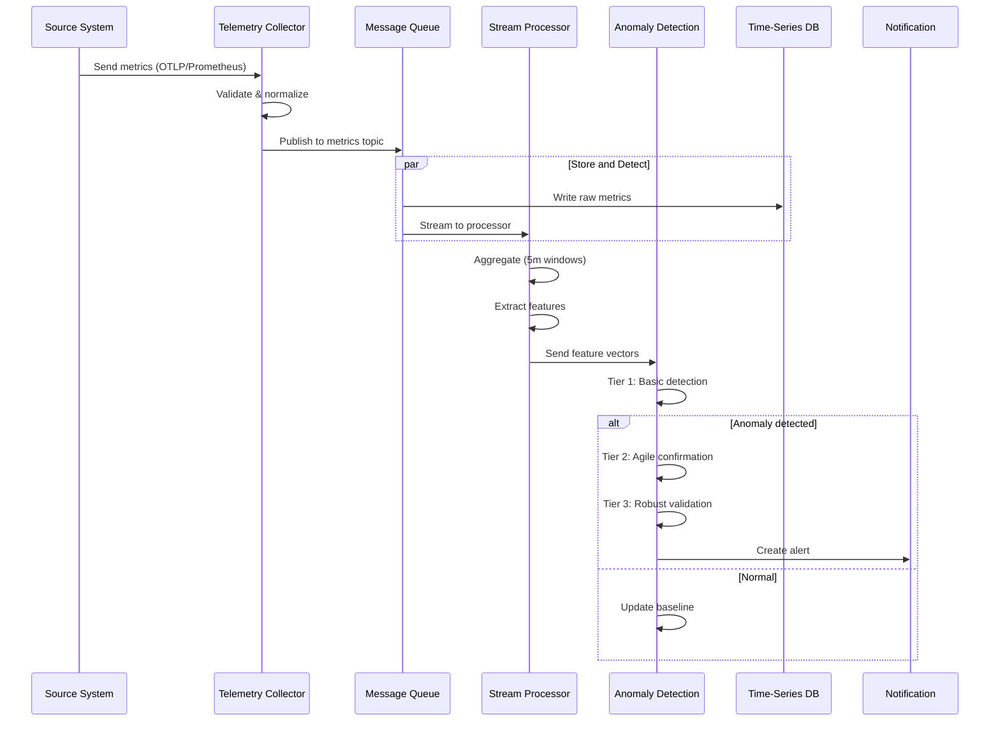
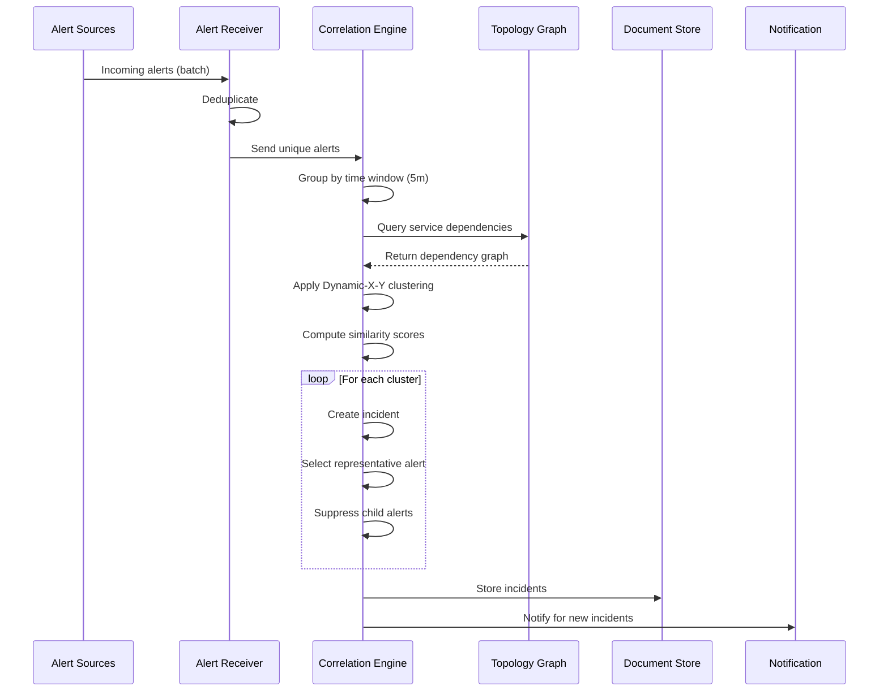
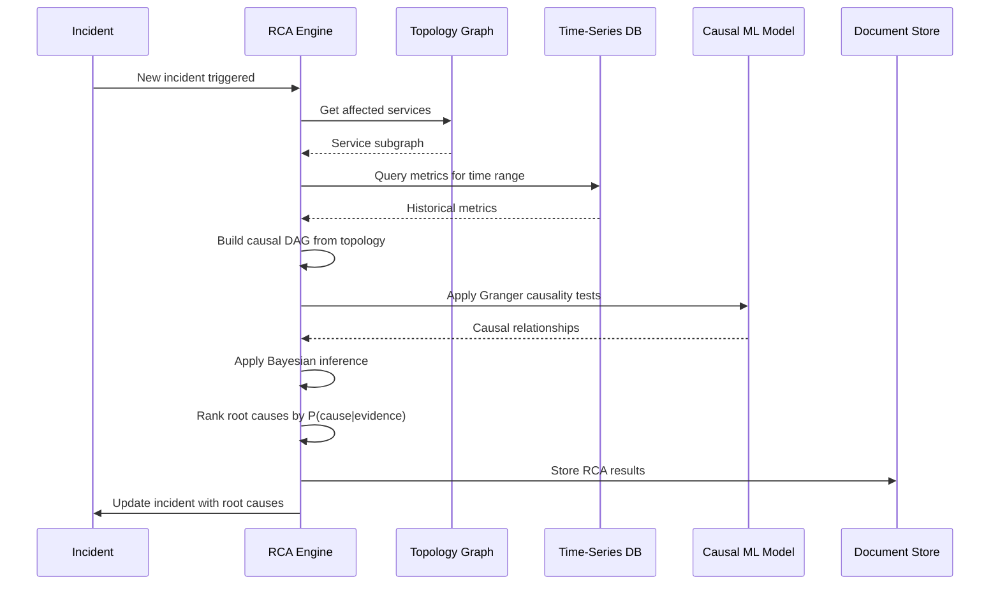
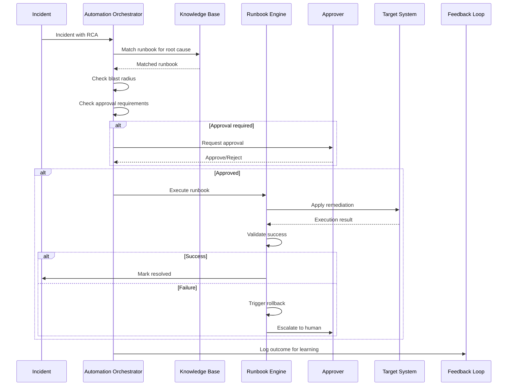
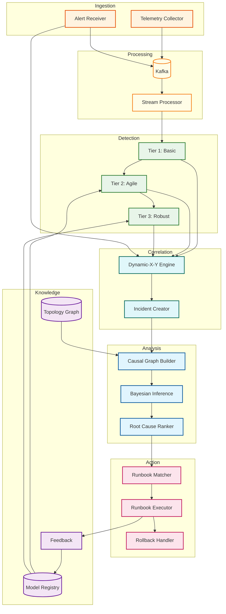
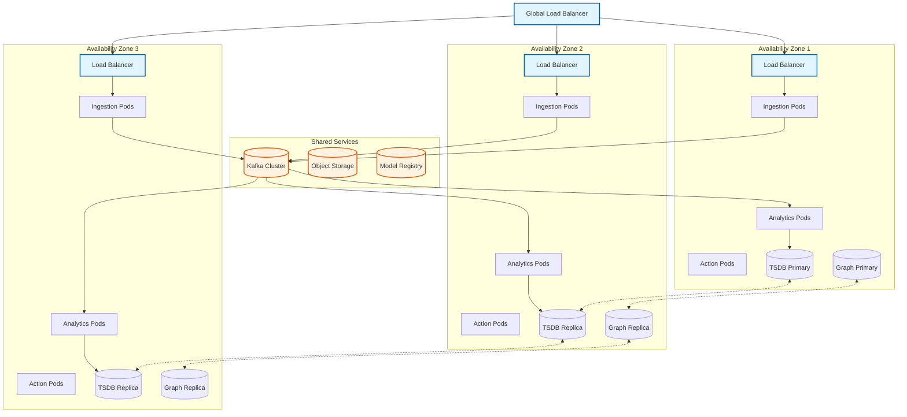
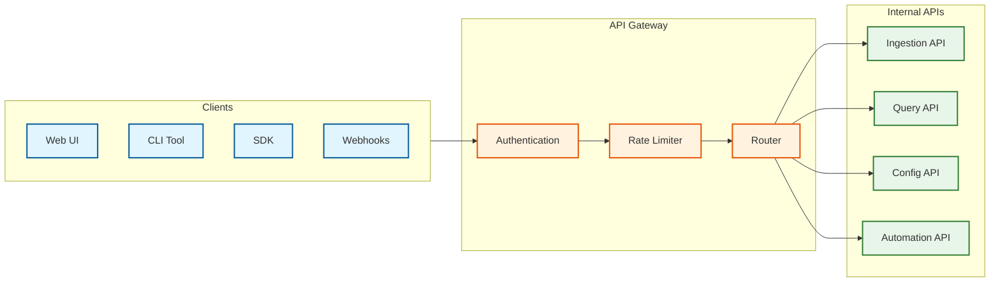

# High-Level Design

This document describes the high-level architecture, data flows, and key design decisions for the AIOps system.

---

## Architecture Overview

The AIOps system follows a **five-layer architecture** that implements the Observe-Analyze-Act paradigm:

---

## Layer Descriptions

### Layer 1: Ingestion Layer

**Purpose:** Collect and normalize telemetry data from heterogeneous sources.

| Component | Responsibility | Input | Output |
|-----------|----------------|-------|--------|
| Telemetry Collector | Receive metrics, logs, traces via OTLP/Prometheus/custom protocols | Raw telemetry | Normalized events |
| Alert Receiver | Receive alerts from external alerting systems | Webhook alerts | Unified alert format |
| Normalizer | Transform data to common schema | Heterogeneous data | Normalized data |
| Enricher | Add metadata (host info, service tags) | Normalized data | Enriched data |

### Layer 2: Stream Processing Layer

**Purpose:** Process data in real-time, aggregate, and extract features for ML.

| Component | Responsibility | Input | Output |
|-----------|----------------|-------|--------|
| Message Queue | Buffer and distribute events | Enriched events | Partitioned streams |
| Stream Processor | Real-time transformation and filtering | Event streams | Processed events |
| Aggregator | Compute time-window aggregations | Raw metrics | Aggregated metrics |
| Feature Extractor | Extract ML features from telemetry | Aggregated data | Feature vectors |

### Layer 3: Analytics Layer

**Purpose:** Detect anomalies, correlate alerts, and identify root causes.

| Component | Responsibility | Input | Output |
|-----------|----------------|-------|--------|
| Anomaly Detection | Three-tier ML/statistical detection | Feature vectors | Anomaly alerts |
| Alert Correlation | Cluster related alerts into incidents | Raw alerts | Incidents |
| RCA Engine | Identify root cause using causal inference | Incidents + topology | Root cause rankings |
| Predictive Engine | Forecast future issues | Historical data | Predictive alerts |

### Layer 4: Action Layer

**Purpose:** Execute automated remediations and notify stakeholders.

| Component | Responsibility | Input | Output |
|-----------|----------------|-------|--------|
| Automation Orchestrator | Coordinate runbook execution | RCA results | Remediation actions |
| Runbook Engine | Execute remediation scripts | Action requests | Execution results |
| Notification Service | Send alerts to channels | Incidents | Notifications |
| Escalation Manager | Handle escalation policies | Unresolved incidents | Escalations |

### Layer 5: Knowledge Layer

**Purpose:** Maintain state, models, and domain knowledge.

| Component | Responsibility | Input | Output |
|-----------|----------------|-------|--------|
| Topology Graph | Store service dependencies | Discovery data | Dependency queries |
| Model Registry | Version and serve ML models | Trained models | Model artifacts |
| Feedback Loop | Collect operator feedback | User actions | Training labels |
| Knowledge Base | Store runbooks, documentation | Documentation | Query results |

---

## Data Flow Diagrams

### Flow 1: Metric Ingestion and Anomaly Detection

### Flow 2: Alert Correlation

### Flow 3: Root Cause Analysis

### Flow 4: Automated Remediation

---

## Key Architectural Decisions

### Decision 1: Streaming vs Batch Processing

| Option | Pros | Cons |
|--------|------|------|
| **Batch** | Simpler, better for ML training | High latency, not real-time |
| **Streaming** | Real-time detection, low latency | Complex, harder to debug |
| **Lambda (Both)** | Best of both worlds | Operational complexity |

**Decision:** Streaming-first with batch for ML training

**Rationale:** AIOps requires real-time detection (<5s SLO). We use streaming for detection and batch jobs for periodic model retraining.

### Decision 2: Anomaly Detection Approach

| Option | Pros | Cons |
|--------|------|------|
| **Statistical Only** | Fast, explainable, no training | Limited accuracy for complex patterns |
| **ML Only** | High accuracy, learns patterns | Slow, black box, cold start |
| **Hybrid (Three-Tier)** | Balanced speed/accuracy | Implementation complexity |

**Decision:** Three-tier hybrid approach

**Rationale:** Different metrics need different detection strategies. Infrastructure metrics can use fast statistical methods; business KPIs benefit from ML. The three-tier system routes metrics to appropriate detectors.

### Decision 3: RCA Methodology

| Option | Pros | Cons |
|--------|------|------|
| **Correlation-Based** | Simple, fast | Correlation ≠ causation |
| **Rule-Based** | 100% accurate for known issues | Fails on novel issues |
| **Causal Inference** | True causation, handles novel cases | Complex, requires good topology |

**Decision:** Causal inference with rule-based fallback

**Rationale:** The fundamental RCA challenge is distinguishing causation from correlation. Causal inference using topology and time-series analysis provides directional causation. Rules handle known failure modes.

### Decision 4: Automation Trust Model

| Option | Pros | Cons |
|--------|------|------|
| **Full Automation** | Fast response, scalable | Risk of wrong actions, trust erosion |
| **Manual Only** | Full control, trust | Slow, doesn't scale |
| **Human-in-the-Loop** | Balanced risk/speed | Adds latency, requires availability |

**Decision:** Human-in-the-loop with progressive automation

**Rationale:** Trust is earned, not assumed. Start with human approval for all remediations, then progressively automate low-risk actions as the system proves itself.

### Decision 5: Data Store Selection

| Data Type | Recommended Store | Rationale |
|-----------|-------------------|-----------|
| Metrics | Time-Series DB (InfluxDB, VictoriaMetrics) | Optimized for time-series writes/queries |
| Logs | Document Store (Elasticsearch, Loki) | Full-text search, schema flexibility |
| Traces | Specialized Store (Jaeger, Tempo) | Trace-specific indexing and queries |
| Topology | Graph DB (Neo4j, JanusGraph) | Efficient graph traversal for RCA |
| Incidents | Document Store (MongoDB) | Flexible schema for incident data |
| Models | Object Storage (S3-compatible) | Large binary artifacts |

---

## Component Interaction Diagram

---

## Deployment Architecture

### Multi-Zone Deployment

### Kubernetes Resource Allocation

| Component | Replicas | CPU (request/limit) | Memory (request/limit) | GPU |
|-----------|----------|---------------------|------------------------|-----|
| Telemetry Collector | 10 | 2/4 cores | 4/8 GB | - |
| Stream Processor | 20 | 4/8 cores | 8/16 GB | - |
| Anomaly Detection (Tier 1) | 10 | 2/4 cores | 4/8 GB | - |
| Anomaly Detection (Tier 2) | 10 | 4/8 cores | 8/16 GB | - |
| Anomaly Detection (Tier 3) | 10 | 4/8 cores | 16/32 GB | 1 |
| Correlation Engine | 5 | 4/8 cores | 8/16 GB | - |
| RCA Engine | 5 | 8/16 cores | 16/32 GB | - |
| Automation Orchestrator | 3 | 2/4 cores | 4/8 GB | - |
| Notification Service | 3 | 1/2 cores | 2/4 GB | - |

---

## API Gateway Design

### API Endpoints Overview

| API | Method | Endpoint | Purpose |
|-----|--------|----------|---------|
| Ingestion | POST | `/api/v1/metrics/write` | Write metrics |
| Ingestion | POST | `/api/v1/logs/write` | Write logs |
| Ingestion | POST | `/api/v1/alerts/ingest` | Receive alerts |
| Query | GET | `/api/v1/incidents` | List incidents |
| Query | GET | `/api/v1/incidents/{id}` | Get incident details |
| Query | GET | `/api/v1/metrics/query` | Query metrics |
| Config | PUT | `/api/v1/config/detection` | Update detection config |
| Config | PUT | `/api/v1/config/topology` | Update topology |
| Automation | POST | `/api/v1/runbooks/{id}/execute` | Execute runbook |
| Automation | GET | `/api/v1/runbooks/{id}/status` | Check execution status |

---

## Technology Stack Reference

| Layer | Recommended | Alternatives |
|-------|-------------|--------------|
| **Message Queue** | Apache Kafka | Apache Pulsar, AWS Kinesis |
| **Stream Processing** | Apache Flink | Kafka Streams, Apache Spark Streaming |
| **Time-Series DB** | VictoriaMetrics | InfluxDB, TimescaleDB, Prometheus |
| **Graph DB** | Neo4j | JanusGraph, Amazon Neptune |
| **Document Store** | Elasticsearch | OpenSearch, MongoDB |
| **Cache** | Redis | Memcached, Hazelcast |
| **Object Storage** | MinIO | S3-compatible storage |
| **ML Framework** | PyTorch | TensorFlow, scikit-learn |
| **Container Orchestration** | Kubernetes | Nomad, Docker Swarm |
| **Service Mesh** | Istio | Linkerd, Consul Connect |

---

## Architecture Pattern Checklist

| Pattern | Decision | Rationale |
|---------|----------|-----------|
| Sync vs Async | **Async** for ingestion, Sync for queries | High-volume ingestion requires async |
| Event-driven vs Request-response | **Event-driven** for core pipeline | Decoupling, scalability |
| Push vs Pull | **Both** (push for metrics, pull for discovery) | Support different source types |
| Stateless vs Stateful | **Stateless** services with stateful storage | Horizontal scaling |
| Read-heavy vs Write-heavy | **Write-heavy** ingestion, **Read-heavy** queries | Optimize each path separately |
| Real-time vs Batch | **Real-time** detection, Batch training | Detection SLO requires real-time |
| Edge vs Origin | **Origin** processing (centralized analytics) | Complex ML requires centralized compute |
