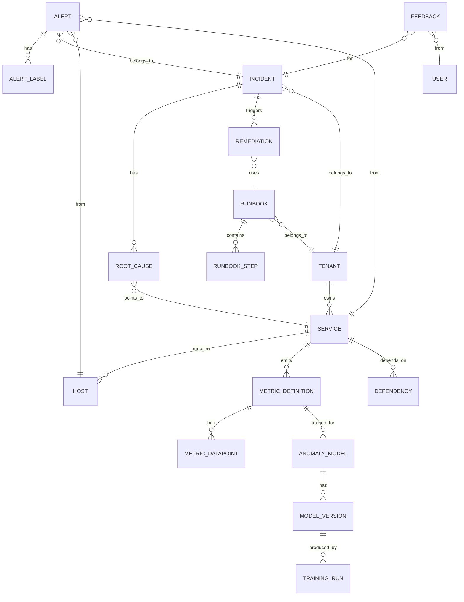

# Low-Level Design

This document covers the detailed data models, API specifications, and core algorithms for the AIOps system.

---

## Data Models

### Entity-Relationship Overview



---

### Core Schemas

#### Tenant Schema

```yaml
tenant:
  id: string (UUID)                    # Primary key
  name: string                          # Display name
  slug: string (unique)                 # URL-safe identifier
  tier: enum (standard, premium, enterprise)
  config:
    retention_days: int                 # Data retention
    alert_quota: int                    # Max alerts/day
    automation_enabled: boolean
  created_at: timestamp
  updated_at: timestamp

indexes:
  - slug (unique)
  - tier
```

#### Service Schema

```yaml
service:
  id: string (UUID)                    # Primary key
  tenant_id: string (FK -> tenant)
  name: string
  type: enum (api, database, queue, cache, worker, gateway)
  environment: enum (production, staging, development)
  tier: enum (critical, high, medium, low)
  owner_team: string
  metadata:
    repository: string
    runbook_url: string
    oncall_channel: string
  health_check:
    endpoint: string
    interval_seconds: int
  created_at: timestamp
  updated_at: timestamp

indexes:
  - tenant_id, name (unique)
  - tenant_id, type
  - tenant_id, tier
```

#### Dependency Schema

```yaml
dependency:
  id: string (UUID)
  tenant_id: string (FK -> tenant)
  source_service_id: string (FK -> service)
  target_service_id: string (FK -> service)
  type: enum (sync, async, database, cache)
  criticality: enum (critical, optional)
  metadata:
    protocol: string                   # http, grpc, kafka, etc.
    port: int
  discovered_at: timestamp
  last_seen_at: timestamp
  is_active: boolean

indexes:
  - tenant_id, source_service_id
  - tenant_id, target_service_id
  - tenant_id, is_active
```

#### Host Schema

```yaml
host:
  id: string (UUID)
  tenant_id: string (FK -> tenant)
  hostname: string
  ip_address: string
  cloud_provider: enum (aws, gcp, azure, on_prem, other)
  region: string
  availability_zone: string
  instance_type: string
  services: array[string (FK -> service)]
  tags: map[string, string]
  status: enum (healthy, unhealthy, unknown)
  last_heartbeat: timestamp
  created_at: timestamp

indexes:
  - tenant_id, hostname (unique)
  - tenant_id, status
  - tenant_id, region
```

---

### Alert and Incident Schemas

#### Alert Schema

```yaml
alert:
  id: string (UUID)                    # Primary key
  tenant_id: string (FK -> tenant)
  fingerprint: string                   # Deduplication key
  source: string                        # Origin system (prometheus, datadog, etc.)
  name: string                          # Alert name
  severity: enum (critical, high, medium, low, info)
  status: enum (firing, resolved)
  message: string
  labels: map[string, string]
  annotations: map[string, string]
  service_id: string (FK -> service, nullable)
  host_id: string (FK -> host, nullable)
  incident_id: string (FK -> incident, nullable)
  starts_at: timestamp
  ends_at: timestamp (nullable)
  received_at: timestamp
  is_suppressed: boolean
  suppression_reason: string (nullable)

indexes:
  - tenant_id, fingerprint (unique for dedup)
  - tenant_id, status, severity
  - tenant_id, incident_id
  - tenant_id, service_id
  - tenant_id, starts_at
```

#### Alert Label Schema

```yaml
alert_label:
  alert_id: string (FK -> alert)
  key: string
  value: string

indexes:
  - alert_id, key (composite primary)
  - key, value (for label-based queries)
```

#### Incident Schema

```yaml
incident:
  id: string (UUID)                    # Primary key
  tenant_id: string (FK -> tenant)
  title: string                         # Auto-generated summary
  description: string
  severity: enum (critical, high, medium, low)
  status: enum (open, acknowledged, investigating, resolved, closed)
  priority: int                         # 1-5 (1 = highest)
  affected_services: array[string (FK -> service)]
  primary_service_id: string (FK -> service)
  root_causes: array[root_cause]        # Embedded
  alert_count: int
  suppressed_alert_count: int
  assigned_to: string (nullable)
  escalation_level: int
  timeline: array[timeline_event]       # Embedded
  created_at: timestamp
  acknowledged_at: timestamp (nullable)
  resolved_at: timestamp (nullable)
  ttd: int                              # Time to detect (seconds)
  ttr: int                              # Time to resolve (seconds)

indexes:
  - tenant_id, status, severity
  - tenant_id, created_at
  - tenant_id, primary_service_id
  - tenant_id, assigned_to
```

#### Root Cause Schema (Embedded in Incident)

```yaml
root_cause:
  service_id: string (FK -> service)
  component: string
  probability: float (0.0 - 1.0)
  confidence: enum (high, medium, low)
  evidence: array[string]
  causal_chain: array[string]
  suggested_runbook_id: string (FK -> runbook, nullable)
  analysis_method: enum (causal, correlation, rule_based)
```

#### Timeline Event Schema (Embedded in Incident)

```yaml
timeline_event:
  timestamp: timestamp
  type: enum (alert_added, status_changed, comment_added,
              runbook_executed, escalated, resolved)
  actor: string                         # system or user_id
  details: map[string, any]
```

---

### Anomaly Detection Schemas

#### Metric Definition Schema

```yaml
metric_definition:
  id: string (UUID)
  tenant_id: string (FK -> tenant)
  name: string                          # metric name (e.g., http_requests_total)
  type: enum (counter, gauge, histogram, summary)
  labels: array[string]                 # Expected label keys
  unit: string                          # seconds, bytes, requests, etc.
  detection_config:
    enabled: boolean
    tier: enum (basic, agile, robust)
    sensitivity: float (0.0 - 1.0)
    seasonality: enum (auto, hourly, daily, weekly, none)
  aggregation_config:
    window: string                      # 1m, 5m, etc.
    function: enum (avg, sum, max, min, p50, p95, p99)
  service_id: string (FK -> service, nullable)
  created_at: timestamp
  updated_at: timestamp

indexes:
  - tenant_id, name (unique)
  - tenant_id, service_id
```

#### Anomaly Model Schema

```yaml
anomaly_model:
  id: string (UUID)
  tenant_id: string (FK -> tenant)
  metric_definition_id: string (FK -> metric_definition)
  model_type: enum (moving_average, holt_winters, prophet,
                    isolation_forest, lstm, ensemble)
  tier: enum (basic, agile, robust)
  current_version_id: string (FK -> model_version)
  status: enum (training, active, retired)
  performance_metrics:
    precision: float
    recall: float
    f1_score: float
    false_positive_rate: float
  created_at: timestamp
  updated_at: timestamp

indexes:
  - tenant_id, metric_definition_id (unique)
  - tenant_id, tier, status
```

#### Model Version Schema

```yaml
model_version:
  id: string (UUID)
  model_id: string (FK -> anomaly_model)
  version: int
  artifact_path: string                 # Object storage path
  training_run_id: string (FK -> training_run)
  hyperparameters: map[string, any]
  validation_metrics:
    precision: float
    recall: float
    f1_score: float
  training_data_range:
    start: timestamp
    end: timestamp
    sample_count: int
  created_at: timestamp
  promoted_at: timestamp (nullable)
  retired_at: timestamp (nullable)

indexes:
  - model_id, version (unique)
  - model_id, promoted_at
```

---

### Automation Schemas

#### Runbook Schema

```yaml
runbook:
  id: string (UUID)
  tenant_id: string (FK -> tenant)
  name: string
  description: string
  trigger:
    type: enum (manual, auto_on_incident, auto_on_alert)
    conditions: array[condition]
  approval:
    required: boolean
    approvers: array[string]            # Team names or user IDs
    timeout_seconds: int
    auto_approve_conditions: array[condition]
  steps: array[runbook_step]
  rollback:
    enabled: boolean
    trigger_condition: string
    steps: array[runbook_step]
  blast_radius:
    max_affected_services: int
    max_affected_hosts: int
  metadata:
    author: string
    documentation_url: string
  version: int
  is_active: boolean
  created_at: timestamp
  updated_at: timestamp

indexes:
  - tenant_id, name (unique)
  - tenant_id, is_active
```

#### Runbook Step Schema (Embedded)

```yaml
runbook_step:
  order: int
  name: string
  type: enum (api_call, script, wait, condition, notification)
  config:
    # For api_call
    endpoint: string
    method: enum (GET, POST, PUT, PATCH, DELETE)
    headers: map[string, string]
    payload: string (JSON template)
    timeout_seconds: int

    # For script
    interpreter: enum (bash, python)
    script: string

    # For wait
    duration_seconds: int

    # For condition
    expression: string
    on_true: int (next step)
    on_false: int (next step)

    # For notification
    channel: enum (slack, pagerduty, email, webhook)
    message_template: string
  on_failure: enum (abort, continue, retry)
  retry_config:
    max_attempts: int
    backoff_seconds: int
```

#### Remediation Schema

```yaml
remediation:
  id: string (UUID)
  tenant_id: string (FK -> tenant)
  incident_id: string (FK -> incident)
  runbook_id: string (FK -> runbook)
  runbook_version: int
  status: enum (pending_approval, approved, rejected, running,
                completed, failed, rolled_back)
  approval:
    requested_at: timestamp
    approved_by: string (nullable)
    approved_at: timestamp (nullable)
  execution:
    started_at: timestamp (nullable)
    completed_at: timestamp (nullable)
    current_step: int
    step_results: array[step_result]
  rollback:
    triggered: boolean
    reason: string (nullable)
    completed_at: timestamp (nullable)
  created_at: timestamp

indexes:
  - tenant_id, incident_id
  - tenant_id, status
  - tenant_id, created_at
```

---

## API Specifications

### Ingestion APIs

#### Write Metrics

```yaml
endpoint: POST /api/v1/metrics/write
description: Write metrics in Prometheus remote write format

request:
  headers:
    Content-Type: application/x-protobuf
    X-Tenant-ID: string (required)
    Authorization: Bearer <token>
  body: prometheus.WriteRequest (protobuf)

response:
  success:
    status: 204 No Content
  error:
    status: 400 | 401 | 429 | 500
    body:
      error: string
      message: string

rate_limit: 100,000 samples/second per tenant
```

#### Ingest Alert

```yaml
endpoint: POST /api/v1/alerts/ingest
description: Receive alerts from external systems

request:
  headers:
    Content-Type: application/json
    X-Tenant-ID: string (required)
    Authorization: Bearer <token>
  body:
    source: string (required)            # e.g., "prometheus", "datadog"
    alerts:
      - name: string (required)
        severity: enum (required)
        status: enum (required)          # firing, resolved
        message: string
        labels: map[string, string]
        annotations: map[string, string]
        starts_at: string (ISO8601)
        ends_at: string (ISO8601, optional)
        fingerprint: string (optional)   # For deduplication

response:
  success:
    status: 202 Accepted
    body:
      accepted: int
      rejected: int
      alert_ids: array[string]
  error:
    status: 400 | 401 | 429 | 500

rate_limit: 1,000 alerts/second per tenant
idempotency: Based on fingerprint + starts_at
```

### Query APIs

#### List Incidents

```yaml
endpoint: GET /api/v1/incidents
description: Query incidents with filters and pagination

request:
  headers:
    Authorization: Bearer <token>
  query_params:
    status: enum (optional)              # Filter by status
    severity: enum (optional)            # Filter by severity
    service_id: string (optional)        # Filter by affected service
    start_time: string (ISO8601)         # Incident created after
    end_time: string (ISO8601)           # Incident created before
    limit: int (default: 50, max: 200)
    offset: int (default: 0)
    sort: string (default: "-created_at") # Field to sort by

response:
  success:
    status: 200 OK
    body:
      incidents: array[incident_summary]
      total: int
      limit: int
      offset: int

incident_summary:
  id: string
  title: string
  severity: enum
  status: enum
  alert_count: int
  affected_services: array[string]
  created_at: string
  ttd: int
  ttr: int (nullable)
```

#### Get Incident Details

```yaml
endpoint: GET /api/v1/incidents/{id}
description: Get full incident details including alerts, RCA, and timeline

request:
  headers:
    Authorization: Bearer <token>
  path_params:
    id: string (required)
  query_params:
    include: array[string]               # alerts, timeline, rca, remediations

response:
  success:
    status: 200 OK
    body:
      incident: incident_full
      alerts: array[alert] (if requested)
      timeline: array[timeline_event] (if requested)
      root_causes: array[root_cause] (if requested)
      remediations: array[remediation] (if requested)
  error:
    status: 404 Not Found
```

### Automation APIs

#### Execute Runbook

```yaml
endpoint: POST /api/v1/runbooks/{id}/execute
description: Trigger runbook execution for an incident

request:
  headers:
    Authorization: Bearer <token>
  path_params:
    id: string (required)                # Runbook ID
  body:
    incident_id: string (required)
    parameters: map[string, any]         # Override runbook parameters
    skip_approval: boolean (default: false)  # Requires elevated permissions

response:
  success:
    status: 202 Accepted
    body:
      remediation_id: string
      status: enum
      approval_required: boolean
      estimated_completion: string (ISO8601)
  error:
    status: 400 | 403 | 404 | 409

conflict: 409 if runbook already running for incident
```

#### Get Remediation Status

```yaml
endpoint: GET /api/v1/remediations/{id}
description: Check status of a remediation execution

request:
  headers:
    Authorization: Bearer <token>
  path_params:
    id: string (required)

response:
  success:
    status: 200 OK
    body:
      remediation:
        id: string
        incident_id: string
        runbook_id: string
        status: enum
        current_step: int
        total_steps: int
        step_results: array[step_result]
        started_at: string
        completed_at: string (nullable)
        error: string (nullable)
```

#### Approve Remediation

```yaml
endpoint: POST /api/v1/remediations/{id}/approve
description: Approve a pending remediation

request:
  headers:
    Authorization: Bearer <token>
  path_params:
    id: string (required)
  body:
    approved: boolean (required)
    comment: string (optional)

response:
  success:
    status: 200 OK
    body:
      remediation_id: string
      status: enum
  error:
    status: 403 | 404 | 409

precondition: Remediation must be in pending_approval status
```

---

## Core Algorithms

### Algorithm 1: Three-Tier Anomaly Detection

```
ALGORITHM ThreeTierAnomalyDetection
INPUT:
  - metric_series: TimeSeries          # Recent metric values
  - config: DetectionConfig            # Sensitivity, tier preference
  - model_registry: ModelRegistry      # Trained models

OUTPUT:
  - is_anomaly: Boolean
  - confidence: Float (0.0 - 1.0)
  - tier_used: Enum (basic, agile, robust)
  - explanation: String

PROCEDURE:

  // Phase 1: Basic Detection (always runs first)
  basic_result = BasicDetection(metric_series, config)

  IF basic_result.is_anomaly == FALSE:
    RETURN {
      is_anomaly: FALSE,
      confidence: basic_result.confidence,
      tier_used: "basic",
      explanation: "Within normal bounds"
    }

  // Phase 2: Agile Detection (if basic triggers)
  IF config.tier >= "agile":
    agile_model = model_registry.get(metric_series.name, "agile")
    agile_result = AgileDetection(metric_series, agile_model, config)

    IF agile_result.is_anomaly == FALSE:
      RETURN {
        is_anomaly: FALSE,
        confidence: agile_result.confidence,
        tier_used: "agile",
        explanation: "Seasonal pattern - not anomalous"
      }

  // Phase 3: Robust Detection (if agile also triggers)
  IF config.tier >= "robust":
    robust_model = model_registry.get(metric_series.name, "robust")
    robust_result = RobustDetection(metric_series, robust_model, config)

    RETURN {
      is_anomaly: robust_result.is_anomaly,
      confidence: robust_result.confidence,
      tier_used: "robust",
      explanation: robust_result.explanation
    }

  // Default: Return agile result if robust not enabled
  RETURN {
    is_anomaly: agile_result.is_anomaly,
    confidence: agile_result.confidence,
    tier_used: "agile",
    explanation: agile_result.explanation
  }


FUNCTION BasicDetection(series, config):
  // Moving average with dynamic bounds
  window_size = 60  // 60 data points

  recent_window = series.last(window_size)
  historical_window = series.range(-7d, -6d)  // Same time last week

  mean = historical_window.mean()
  std = historical_window.std()

  current_value = series.last()

  // Dynamic threshold based on sensitivity
  threshold_multiplier = 3.0 - (config.sensitivity * 2.0)  // 1.0 to 3.0
  upper_bound = mean + (std * threshold_multiplier)
  lower_bound = mean - (std * threshold_multiplier)

  is_anomaly = (current_value > upper_bound) OR (current_value < lower_bound)

  // Confidence based on how far outside bounds
  IF is_anomaly:
    deviation = ABS(current_value - mean) / std
    confidence = MIN(deviation / 5.0, 1.0)
  ELSE:
    confidence = 0.0

  RETURN {is_anomaly, confidence}


FUNCTION AgileDetection(series, model, config):
  // Seasonal decomposition + adaptive baseline

  // Decompose into trend, seasonal, residual
  decomposed = SeasonalDecompose(series, period=config.seasonality)

  // Check if residual is anomalous
  residual = decomposed.residual
  residual_mean = residual.mean()
  residual_std = residual.std()

  current_residual = residual.last()

  // Z-score for residual
  z_score = (current_residual - residual_mean) / residual_std

  threshold = 2.5 - (config.sensitivity * 1.5)  // 1.0 to 2.5
  is_anomaly = ABS(z_score) > threshold

  // Also check predicted vs actual
  predicted = model.predict(series.features())
  actual = series.last()
  prediction_error = ABS(actual - predicted) / predicted

  is_anomaly = is_anomaly OR (prediction_error > 0.3)

  confidence = MIN(ABS(z_score) / 4.0, 1.0)

  RETURN {
    is_anomaly,
    confidence,
    explanation: "Z-score: " + z_score + ", Prediction error: " + prediction_error
  }


FUNCTION RobustDetection(series, model, config):
  // Ensemble of ML models

  feature_vector = ExtractFeatures(series)

  // Run multiple models
  isolation_forest_score = model.isolation_forest.score(feature_vector)
  lstm_score = model.lstm.predict(series.sequence())

  // Ensemble voting
  votes = []

  IF isolation_forest_score > 0.6:
    votes.append(1)
  ELSE:
    votes.append(0)

  IF lstm_score > 0.5:
    votes.append(1)
  ELSE:
    votes.append(0)

  is_anomaly = SUM(votes) >= 1  // At least one model flags
  confidence = (isolation_forest_score + lstm_score) / 2

  explanation = "Isolation Forest: " + isolation_forest_score +
                ", LSTM: " + lstm_score

  RETURN {is_anomaly, confidence, explanation}
```

---

### Algorithm 2: Dynamic-X-Y Alert Correlation

```
ALGORITHM DynamicXYCorrelation
INPUT:
  - alerts: Array[Alert]               # Raw alerts in time window
  - topology: ServiceGraph             # Service dependency graph
  - config: CorrelationConfig          # Time window, similarity threshold

OUTPUT:
  - incidents: Array[Incident]
  - suppressed_alerts: Array[Alert]

PROCEDURE:

  // Step 1: Time-based grouping (X dimension)
  time_groups = GroupByTimeWindow(alerts, config.time_window)

  // Step 2: Topology-based enrichment (Y dimension)
  FOR EACH group IN time_groups:
    FOR EACH alert IN group:
      alert.neighbors = GetTopologyNeighbors(
        alert.service_id,
        topology,
        config.topology_depth
      )

  // Step 3: Build similarity graph
  similarity_graph = BuildSimilarityGraph(time_groups, config)

  // Step 4: Cluster using connected components
  clusters = FindConnectedComponents(similarity_graph, config.similarity_threshold)

  // Step 5: Create incidents from clusters
  incidents = []
  suppressed_alerts = []

  FOR EACH cluster IN clusters:
    IF cluster.size() >= config.min_cluster_size:
      incident = CreateIncident(cluster)
      incidents.append(incident)

      // Select representative alert (highest severity, earliest)
      representative = SelectRepresentative(cluster)
      incident.primary_alert = representative

      // Suppress non-representative alerts
      FOR EACH alert IN cluster:
        IF alert != representative:
          alert.is_suppressed = TRUE
          alert.suppression_reason = "Correlated with incident " + incident.id
          suppressed_alerts.append(alert)

  RETURN {incidents, suppressed_alerts}


FUNCTION GroupByTimeWindow(alerts, window):
  // Group alerts into overlapping time windows
  groups = []

  sorted_alerts = SORT(alerts, BY: starts_at)

  current_group = []
  group_start = sorted_alerts[0].starts_at

  FOR EACH alert IN sorted_alerts:
    IF alert.starts_at - group_start <= window:
      current_group.append(alert)
    ELSE:
      IF current_group.size() > 0:
        groups.append(current_group)
      current_group = [alert]
      group_start = alert.starts_at

  IF current_group.size() > 0:
    groups.append(current_group)

  RETURN groups


FUNCTION GetTopologyNeighbors(service_id, topology, depth):
  // BFS to find services within N hops
  visited = SET()
  queue = [(service_id, 0)]
  neighbors = []

  WHILE queue.not_empty():
    (current, current_depth) = queue.pop_front()

    IF current IN visited:
      CONTINUE

    visited.add(current)

    IF current_depth > 0:  // Don't include self
      neighbors.append(current)

    IF current_depth < depth:
      FOR EACH neighbor IN topology.get_neighbors(current):
        IF neighbor NOT IN visited:
          queue.append((neighbor, current_depth + 1))

  RETURN neighbors


FUNCTION BuildSimilarityGraph(time_groups, config):
  // Build graph where edges represent similar alerts
  edges = []

  FOR EACH group IN time_groups:
    FOR i = 0 TO group.size() - 1:
      FOR j = i + 1 TO group.size() - 1:
        alert_a = group[i]
        alert_b = group[j]

        similarity = ComputeSimilarity(alert_a, alert_b)

        IF similarity >= config.similarity_threshold:
          edges.append((alert_a, alert_b, similarity))

  RETURN edges


FUNCTION ComputeSimilarity(alert_a, alert_b):
  // Multi-factor similarity score

  // Factor 1: Temporal proximity (0-1)
  time_diff = ABS(alert_a.starts_at - alert_b.starts_at)
  max_time_diff = 300  // 5 minutes
  temporal_score = MAX(0, 1 - (time_diff / max_time_diff))

  // Factor 2: Topology proximity (0-1)
  IF alert_a.service_id == alert_b.service_id:
    topology_score = 1.0
  ELSE IF alert_b.service_id IN alert_a.neighbors:
    topology_score = 0.8
  ELSE IF HasCommonNeighbor(alert_a, alert_b):
    topology_score = 0.5
  ELSE:
    topology_score = 0.0

  // Factor 3: Label similarity (0-1)
  common_labels = INTERSECTION(alert_a.labels, alert_b.labels)
  total_labels = UNION(alert_a.labels, alert_b.labels)
  label_score = common_labels.size() / total_labels.size()

  // Factor 4: Severity match (0-1)
  severity_score = 1.0 IF alert_a.severity == alert_b.severity ELSE 0.5

  // Weighted combination
  similarity = (
    0.3 * temporal_score +
    0.4 * topology_score +
    0.2 * label_score +
    0.1 * severity_score
  )

  RETURN similarity


FUNCTION CreateIncident(cluster):
  // Create incident from alert cluster

  severities = [alert.severity FOR alert IN cluster]
  max_severity = MAX(severities)

  services = UNIQUE([alert.service_id FOR alert IN cluster])
  primary_service = MostFrequent([alert.service_id FOR alert IN cluster])

  incident = Incident{
    id: GenerateUUID(),
    title: GenerateTitle(cluster),
    severity: max_severity,
    status: "open",
    alert_count: cluster.size(),
    suppressed_alert_count: cluster.size() - 1,
    affected_services: services,
    primary_service_id: primary_service,
    created_at: MIN([alert.starts_at FOR alert IN cluster])
  }

  RETURN incident
```

---

### Algorithm 3: Causal Root Cause Analysis

```
ALGORITHM CausalRootCauseAnalysis
INPUT:
  - incident: Incident
  - topology: ServiceGraph
  - metrics: MetricStore
  - time_range: TimeRange

OUTPUT:
  - root_causes: Array[RootCause]

PROCEDURE:

  // Step 1: Extract affected services subgraph
  affected_services = incident.affected_services
  subgraph = topology.induced_subgraph(affected_services)

  // Step 2: Add upstream services (potential causes)
  extended_services = ExtendWithUpstream(affected_services, topology, depth=2)
  extended_graph = topology.induced_subgraph(extended_services)

  // Step 3: Fetch metrics for all services
  service_metrics = {}
  FOR EACH service IN extended_services:
    service_metrics[service] = metrics.query(
      service_id: service,
      time_range: time_range,
      metrics: ["error_rate", "latency_p99", "throughput", "saturation"]
    )

  // Step 4: Build causal DAG
  causal_dag = BuildCausalDAG(extended_graph, service_metrics)

  // Step 5: Apply causal inference
  causal_effects = ComputeCausalEffects(causal_dag, incident.created_at)

  // Step 6: Rank root causes using Bayesian inference
  root_causes = RankRootCauses(causal_effects, incident)

  RETURN root_causes


FUNCTION BuildCausalDAG(graph, metrics):
  // Build causal DAG from topology + Granger causality

  dag = DirectedGraph()

  // Add edges from topology (known dependencies)
  FOR EACH edge IN graph.edges:
    dag.add_edge(edge.source, edge.target, weight=0.8, type="topology")

  // Add edges from Granger causality tests
  FOR EACH pair (service_a, service_b) IN graph.nodes:
    IF GrangerCausalityTest(metrics[service_a], metrics[service_b]):
      IF NOT dag.has_edge(service_a, service_b):
        dag.add_edge(service_a, service_b, weight=0.6, type="granger")

  // Remove cycles (keep topology edges, remove weaker Granger edges)
  dag = RemoveCycles(dag)

  RETURN dag


FUNCTION GrangerCausalityTest(series_a, series_b):
  // Test if series_a Granger-causes series_b

  // Fit AR model on series_b alone
  model_restricted = AutoRegression(series_b, lags=5)
  sse_restricted = model_restricted.sum_squared_errors

  // Fit AR model on series_b with series_a as exogenous
  model_full = AutoRegression(series_b, lags=5, exog=series_a)
  sse_full = model_full.sum_squared_errors

  // F-test
  n = series_b.length
  p = 5  // lags

  f_statistic = ((sse_restricted - sse_full) / p) / (sse_full / (n - 2*p - 1))
  p_value = FDistribution.sf(f_statistic, p, n - 2*p - 1)

  RETURN p_value < 0.05  // Significant at 5% level


FUNCTION ComputeCausalEffects(dag, incident_time):
  // Compute causal effect of each node on the outcome

  effects = {}

  FOR EACH node IN dag.nodes:
    // Get metrics around incident time
    pre_incident = node.metrics.range(incident_time - 30m, incident_time - 5m)
    post_incident = node.metrics.range(incident_time - 5m, incident_time + 10m)

    // Compute change
    pre_mean = pre_incident.mean()
    post_mean = post_incident.mean()

    IF pre_mean > 0:
      relative_change = (post_mean - pre_mean) / pre_mean
    ELSE:
      relative_change = post_mean

    // Timing: How early did this node show anomaly?
    anomaly_start = FindFirstAnomaly(node.metrics, incident_time - 30m, incident_time)

    IF anomaly_start IS NOT NULL:
      lead_time = incident_time - anomaly_start
    ELSE:
      lead_time = 0

    effects[node] = {
      relative_change: relative_change,
      lead_time: lead_time,
      is_anomalous: ABS(relative_change) > 0.2,
      downstream_count: dag.descendants(node).size()
    }

  RETURN effects


FUNCTION RankRootCauses(effects, incident):
  // Bayesian ranking of root causes

  candidates = [node FOR node IN effects IF effects[node].is_anomalous]

  ranked = []

  FOR EACH node IN candidates:
    effect = effects[node]

    // Prior: Based on topology position (upstream = more likely root cause)
    prior = 1.0 / (effect.downstream_count + 1)

    // Likelihood: Based on timing and magnitude
    timing_score = MIN(effect.lead_time / 300, 1.0)  // Max credit for 5min lead
    magnitude_score = MIN(ABS(effect.relative_change), 1.0)

    likelihood = 0.5 * timing_score + 0.5 * magnitude_score

    // Posterior (unnormalized)
    posterior = prior * likelihood

    ranked.append({
      service: node,
      probability: posterior,
      evidence: [
        "Anomaly detected " + effect.lead_time + "s before incident",
        "Metric changed by " + (effect.relative_change * 100) + "%",
        effect.downstream_count + " downstream services affected"
      ]
    })

  // Normalize probabilities
  total = SUM([r.probability FOR r IN ranked])
  FOR EACH r IN ranked:
    r.probability = r.probability / total

  // Sort by probability descending
  ranked = SORT(ranked, BY: probability, ORDER: DESC)

  // Keep top 5
  RETURN ranked[:5]
```

---

### Algorithm 4: Runbook Execution with Rollback

```
ALGORITHM RunbookExecution
INPUT:
  - runbook: Runbook
  - incident: Incident
  - parameters: Map[String, Any]
  - executor: ActionExecutor

OUTPUT:
  - result: ExecutionResult

PROCEDURE:

  remediation = CreateRemediation(runbook, incident, parameters)

  // Check approval if required
  IF runbook.approval.required:
    IF NOT CheckAutoApprove(runbook, incident):
      remediation.status = "pending_approval"
      SaveRemediation(remediation)

      approval = WaitForApproval(remediation, runbook.approval.timeout_seconds)

      IF NOT approval.approved:
        remediation.status = "rejected"
        SaveRemediation(remediation)
        RETURN ExecutionResult{status: "rejected", reason: approval.comment}

  // Check blast radius
  IF NOT CheckBlastRadius(runbook, incident):
    remediation.status = "failed"
    SaveRemediation(remediation)
    RETURN ExecutionResult{status: "failed", reason: "Blast radius exceeded"}

  // Execute steps
  remediation.status = "running"
  SaveRemediation(remediation)

  step_results = []
  current_step = 0

  FOR EACH step IN runbook.steps:
    current_step = current_step + 1
    remediation.current_step = current_step
    SaveRemediation(remediation)

    result = ExecuteStep(step, incident, parameters, executor)
    step_results.append(result)

    IF result.status == "failed":
      IF step.on_failure == "abort":
        // Trigger rollback
        IF runbook.rollback.enabled:
          rollback_result = ExecuteRollback(runbook, step_results, executor)
          remediation.status = "rolled_back"
          remediation.rollback.triggered = TRUE
          remediation.rollback.reason = result.error
          SaveRemediation(remediation)
          RETURN ExecutionResult{status: "rolled_back", reason: result.error}
        ELSE:
          remediation.status = "failed"
          SaveRemediation(remediation)
          RETURN ExecutionResult{status: "failed", reason: result.error}

      ELSE IF step.on_failure == "retry":
        FOR attempt = 1 TO step.retry_config.max_attempts:
          Sleep(step.retry_config.backoff_seconds * attempt)
          result = ExecuteStep(step, incident, parameters, executor)
          IF result.status == "success":
            BREAK

        IF result.status == "failed":
          IF runbook.rollback.enabled:
            ExecuteRollback(runbook, step_results, executor)
          remediation.status = "failed"
          SaveRemediation(remediation)
          RETURN ExecutionResult{status: "failed", reason: result.error}

      // on_failure == "continue": just proceed to next step

  // All steps completed
  remediation.status = "completed"
  remediation.execution.completed_at = NOW()
  remediation.step_results = step_results
  SaveRemediation(remediation)

  // Validate success
  IF runbook.rollback.enabled:
    success = ValidateSuccess(runbook.rollback.trigger_condition, incident)
    IF NOT success:
      rollback_result = ExecuteRollback(runbook, step_results, executor)
      remediation.status = "rolled_back"
      remediation.rollback.triggered = TRUE
      remediation.rollback.reason = "Validation failed"
      SaveRemediation(remediation)
      RETURN ExecutionResult{status: "rolled_back", reason: "Post-execution validation failed"}

  RETURN ExecutionResult{status: "completed", step_results: step_results}


FUNCTION ExecuteStep(step, incident, parameters, executor):

  SWITCH step.type:
    CASE "api_call":
      endpoint = InterpolateTemplate(step.config.endpoint, incident, parameters)
      payload = InterpolateTemplate(step.config.payload, incident, parameters)

      response = executor.http_request(
        method: step.config.method,
        url: endpoint,
        headers: step.config.headers,
        body: payload,
        timeout: step.config.timeout_seconds
      )

      IF response.status_code >= 200 AND response.status_code < 300:
        RETURN StepResult{status: "success", output: response.body}
      ELSE:
        RETURN StepResult{status: "failed", error: response.body}

    CASE "script":
      script = InterpolateTemplate(step.config.script, incident, parameters)

      result = executor.run_script(
        interpreter: step.config.interpreter,
        script: script,
        timeout: 60
      )

      IF result.exit_code == 0:
        RETURN StepResult{status: "success", output: result.stdout}
      ELSE:
        RETURN StepResult{status: "failed", error: result.stderr}

    CASE "wait":
      Sleep(step.config.duration_seconds)
      RETURN StepResult{status: "success"}

    CASE "notification":
      message = InterpolateTemplate(step.config.message_template, incident, parameters)
      executor.send_notification(step.config.channel, message)
      RETURN StepResult{status: "success"}


FUNCTION ExecuteRollback(runbook, completed_steps, executor):
  // Execute rollback steps in reverse order

  FOR EACH step IN REVERSE(runbook.rollback.steps):
    result = ExecuteStep(step, incident, parameters, executor)
    IF result.status == "failed":
      // Log but continue rollback
      Log.error("Rollback step failed: " + result.error)

  RETURN RollbackResult{completed: TRUE}
```

---

## Indexing Strategy

### Time-Series Database Indexes

```yaml
metrics_table:
  partition_key: tenant_id + metric_name + DAY(timestamp)
  clustering_key: timestamp DESC

  indexes:
    - (tenant_id, service_id, timestamp)
    - (tenant_id, host_id, timestamp)

  ttl: 30 days (hot), 90 days (warm)
```

### Document Store Indexes

```yaml
alerts_collection:
  indexes:
    - tenant_id: 1, fingerprint: 1 (unique, for dedup)
    - tenant_id: 1, status: 1, severity: -1, starts_at: -1
    - tenant_id: 1, incident_id: 1
    - tenant_id: 1, service_id: 1, starts_at: -1

incidents_collection:
  indexes:
    - tenant_id: 1, status: 1, severity: -1, created_at: -1
    - tenant_id: 1, primary_service_id: 1, created_at: -1
    - tenant_id: 1, assigned_to: 1, status: 1

remediations_collection:
  indexes:
    - tenant_id: 1, incident_id: 1
    - tenant_id: 1, status: 1, created_at: -1
```

### Graph Database Indexes

```yaml
service_nodes:
  indexes:
    - tenant_id + name (unique)
    - tenant_id + type
    - tenant_id + tier

dependency_edges:
  indexes:
    - source_service_id
    - target_service_id
    - tenant_id + is_active
```

---

## Data Retention Policy

| Data Type | Hot | Warm | Cold | Archive |
|-----------|-----|------|------|---------|
| Raw Metrics | 7 days | 30 days | 90 days | 1 year |
| Aggregated Metrics | 30 days | 90 days | 1 year | 3 years |
| Logs | 7 days | 30 days | 90 days | - |
| Alerts | 30 days | 90 days | 1 year | 3 years |
| Incidents | 1 year | 3 years | 7 years | 7 years |
| Remediations | 1 year | 3 years | 7 years | 7 years |
| Model Artifacts | Current + 5 versions | - | - | - |
| Audit Logs | 1 year | 3 years | 7 years | 7 years |
