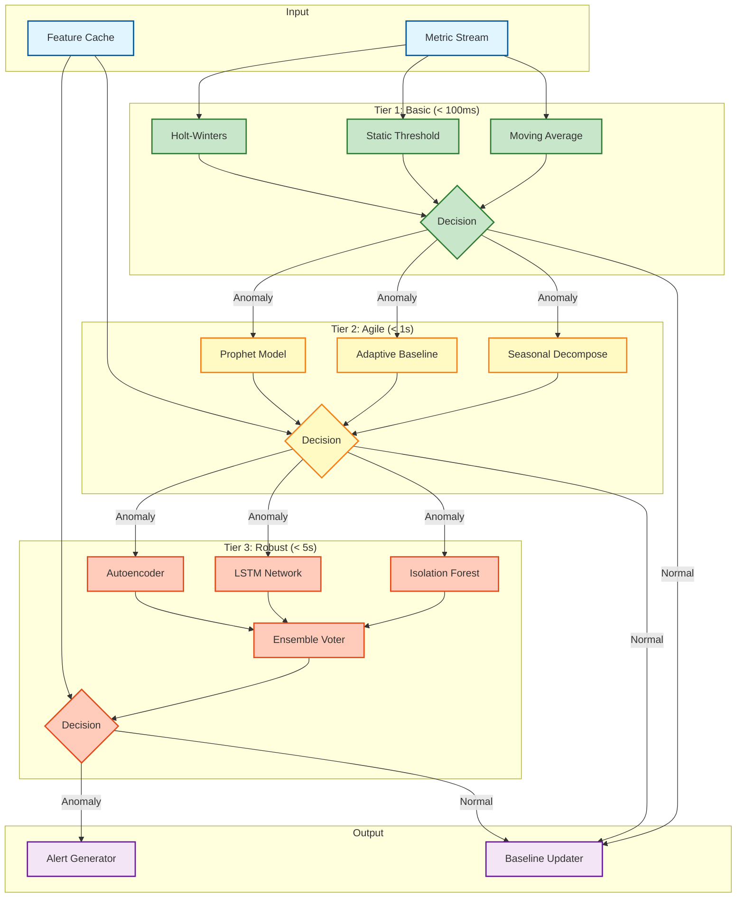
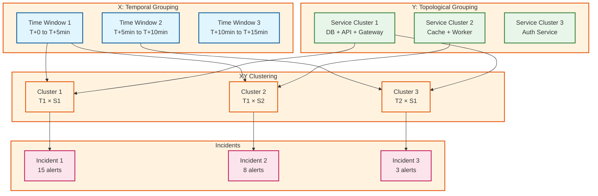
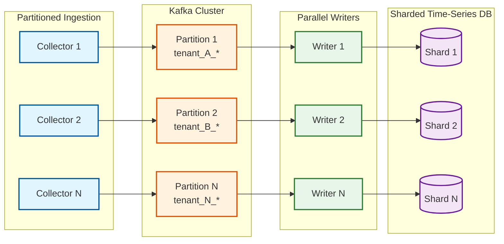

# Deep Dive & Bottlenecks

This document provides an in-depth analysis of the critical components in the AIOps system, including their internal workings, failure modes, and bottleneck mitigation strategies.

---

## Deep Dive 1: Anomaly Detection Engine

### Why It Matters

The anomaly detection engine is the **first line of defense** against operational issues. Its effectiveness directly determines:

- **Alert Quality:** High false positives erode operator trust; high false negatives miss real issues
- **Detection Latency:** Delayed detection means longer MTTR
- **Operational Load:** Poor detection quality leads to alert fatigue

A well-designed detection engine can reduce alert noise by 90%+ while maintaining high recall for real anomalies.

### Three-Tier Architecture Deep Dive



### Tier 1: Basic Detection

**Purpose:** Fast, low-latency detection for high-volume infrastructure metrics.

**Algorithms:**

| Algorithm | Use Case | Latency | Accuracy |
|-----------|----------|---------|----------|
| Moving Average | Stable metrics with occasional spikes | <10ms | 65% |
| Static Threshold | Well-understood metrics with known bounds | <5ms | 70% |
| Holt-Winters | Metrics with trend and seasonality | <50ms | 75% |

**Implementation Details:**

```
Moving Average Detection:
- Window: 60 data points (5 minutes at 5s intervals)
- Historical baseline: Same time window from previous 7 days
- Threshold: mean ± (N × stddev), where N = 3 - (2 × sensitivity)
- Minimum samples: 20 for reliable detection
```

**When to Use Tier 1:**
- CPU, memory, disk utilization metrics
- Network throughput metrics
- Request counts (high volume)
- Any metric where speed trumps accuracy

### Tier 2: Agile Detection

**Purpose:** Handle seasonal patterns and adaptive baselines for business-critical metrics.

**Algorithms:**

| Algorithm | Use Case | Latency | Accuracy |
|-----------|----------|---------|----------|
| Seasonal Decomposition | Metrics with hourly/daily/weekly patterns | <200ms | 80% |
| Adaptive Baseline | Metrics that evolve over time | <300ms | 82% |
| Prophet | Complex seasonality with holidays | <800ms | 87% |

**Seasonal Decomposition Process:**

```
1. Detect Seasonality:
   - Auto-correlate with 1h, 24h, 168h (1 week) lags
   - Select strongest period

2. Decompose:
   - Trend: Lowess smoothing with window = 2 × period
   - Seasonal: Average of values at same phase
   - Residual: Original - Trend - Seasonal

3. Detect Anomaly:
   - Anomaly if |residual| > threshold × residual_stddev
   - Threshold = 2.5 for agile tier
```

**When to Use Tier 2:**
- Error rates with daily patterns
- Latency metrics with business-hour spikes
- Traffic metrics with weekly seasonality
- Any metric with predictable patterns

### Tier 3: Robust Detection

**Purpose:** High-accuracy detection using ML ensemble for critical systems.

**Algorithms:**

| Algorithm | Strength | Weakness | Weight |
|-----------|----------|----------|--------|
| Isolation Forest | Multivariate anomalies | Needs training data | 0.35 |
| LSTM | Sequential patterns | Long training time | 0.35 |
| Autoencoder | Complex patterns | Black box | 0.30 |

**Ensemble Voting Strategy:**

```
1. Run all three models in parallel
2. Each model outputs:
   - anomaly_score: 0.0 to 1.0
   - confidence: 0.0 to 1.0

3. Weighted ensemble:
   final_score = Σ(model_score × model_weight × model_confidence)

4. Decision:
   - is_anomaly = final_score > threshold
   - threshold = 0.5 - (sensitivity × 0.2)  // 0.3 to 0.5
```

**Isolation Forest Details:**

```
Training:
- Sample 10,000 random data points
- Build 100 isolation trees
- Max depth = log2(10,000) ≈ 13

Inference:
- Compute average path length across all trees
- Anomaly score = 2^(-E(h)/c(n))
  where E(h) = average path length, c(n) = normalization factor

Retraining:
- Trigger: Every 24 hours OR when false positive rate > 10%
- Data: Last 7 days of metrics
```

### Failure Modes and Mitigations

| Failure Mode | Impact | Detection | Mitigation |
|--------------|--------|-----------|------------|
| Model drift | False negatives increase | Monitor F1 score daily | Auto-retrain when F1 < 0.8 |
| Cold start | No detection for new metrics | Check model coverage | Fall back to Tier 1 |
| Feature staleness | Stale predictions | Monitor feature freshness | Alert on staleness > 5 min |
| Model serving failure | No ML-based detection | Health check on model endpoints | Fall back to statistical detection |
| Training data poisoning | Incorrect baselines | Validate training data distributions | Anomaly detection on training data |

### Latency vs. Accuracy Trade-off

```
┌────────────────────────────────────────────────────────────────┐
│                                                                │
│  Accuracy                                                      │
│  100% ┤                                          ┌───────────  │
│       │                                    ┌─────┘             │
│   90% ┤                              ┌─────┘                   │
│       │                        ┌─────┘                         │
│   80% ┤                  ┌─────┘                               │
│       │            ┌─────┘                                     │
│   70% ┤      ┌─────┘                                           │
│       │ ─────┘                                                 │
│   60% ┤                                                        │
│       └───────┬─────────┬─────────┬─────────┬─────────┬───────│
│              10ms     100ms      1s        5s       10s       │
│                            Latency                             │
│                                                                │
│       [Tier 1: Basic]  [Tier 2: Agile]   [Tier 3: Robust]     │
└────────────────────────────────────────────────────────────────┘
```

---

## Deep Dive 2: Root Cause Analysis Engine

### Why It Matters

RCA is the **most intellectually challenging** component of AIOps. The fundamental problem:

> **Correlation ≠ Causation**

When Service A and Service B both show errors at the same time:
- Does A cause B? (A → B)
- Does B cause A? (B → A)
- Does a third service C cause both? (C → A, C → B)

Naive correlation-based RCA fails because it cannot distinguish these cases.

### Causal Inference Architecture

```mermaid
flowchart TB
    subgraph Input["Input"]
        INC[Incident]
        TOP[Service Topology]
        MET[Metric History]
    end

    subgraph GraphBuilder["Causal Graph Builder"]
        EXT[Extract Subgraph]
        GR[Granger Tests]
        PC[PC Algorithm]
        DAG[Causal DAG]
    end

    subgraph Inference["Causal Inference"]
        INT[Intervention Analysis]
        BAY[Bayesian Network]
        POST[Posterior Calculation]
    end

    subgraph Ranking["Ranking"]
        EVD[Evidence Collector]
        RANK[Root Cause Ranker]
        EXP[Explainer]
    end

    subgraph Output["Output"]
        RC[Ranked Root Causes]
        CH[Causal Chain]
        RB[Runbook Suggestions]
    end

    INC --> EXT
    TOP --> EXT
    EXT --> GR & PC
    MET --> GR

    GR --> DAG
    PC --> DAG

    DAG --> INT --> BAY --> POST

    POST --> EVD
    EVD --> RANK --> EXP

    EXP --> RC & CH & RB

    classDef input fill:#e1f5fe,stroke:#01579b,stroke-width:2px
    classDef graph fill:#e8f5e9,stroke:#2e7d32,stroke-width:2px
    classDef inference fill:#fff3e0,stroke:#e65100,stroke-width:2px
    classDef ranking fill:#fce4ec,stroke:#c2185b,stroke-width:2px
    classDef output fill:#f3e5f5,stroke:#6a1b9a,stroke-width:2px

    class INC,TOP,MET input
    class EXT,GR,PC,DAG graph
    class INT,BAY,POST inference
    class EVD,RANK,EXP ranking
    class RC,CH,RB output
```

### Causal Graph Construction

**Step 1: Topology-Based Prior**

The service dependency graph provides strong prior knowledge about causal relationships:

```
Known topology: Gateway → API → Database
                         ↓
                       Cache

Prior causal assumptions:
- Database issues can cause API issues
- Cache issues can cause API issues
- API issues can cause Gateway issues
- Gateway issues cannot cause Database issues
```

**Step 2: Granger Causality Testing**

Granger causality tests whether past values of X help predict Y beyond Y's own history:

```
Test: Does database_latency Granger-cause api_latency?

Model 1 (restricted): api_latency_t = Σ α_i × api_latency_{t-i} + ε
Model 2 (full):       api_latency_t = Σ α_i × api_latency_{t-i}
                                    + Σ β_i × db_latency_{t-i} + ε

If Model 2 significantly better than Model 1 (F-test p < 0.05):
   db_latency Granger-causes api_latency
```

**Step 3: PC Algorithm for Structure Learning**

The PC (Peter-Clark) algorithm discovers causal structure from data:

```
1. Start with fully connected undirected graph
2. Remove edge X-Y if X ⊥ Y | Z for some conditioning set Z
3. Orient edges using v-structures: X → Z ← Y if X-Z-Y and X ⊥ Y
4. Apply Meek's rules to orient remaining edges
```

### Bayesian Root Cause Ranking

**Prior Probability:**

Based on topology position (upstream = more likely root cause):

```
P(node = root cause) ∝ 1 / (downstream_count + 1)

Example:
- Database: 5 downstream → P = 1/6 = 0.17
- API: 2 downstream → P = 1/3 = 0.33
- Gateway: 0 downstream → P = 1/1 = 1.0

After normalization: DB=0.11, API=0.22, Gateway=0.67
```

**Likelihood:**

Based on observed evidence:

```
P(evidence | node = root cause) =
  0.5 × timing_score +
  0.3 × magnitude_score +
  0.2 × propagation_score

timing_score = How early did node show anomaly?
magnitude_score = How severe was the change?
propagation_score = Did downstream nodes show symptoms?
```

**Posterior:**

```
P(root cause | evidence) ∝ P(evidence | root cause) × P(root cause)

Normalize to sum to 1.0
```

### Example RCA Walkthrough

```
Incident: API service returning 500 errors

Affected services: Gateway, API, Database, Cache

Timeline:
  T-300s: Database connection pool at 95%
  T-120s: Database latency spikes to 5s
  T-60s:  API timeout errors begin
  T-30s:  Gateway 5xx errors spike
  T-0s:   Alert fired

Causal Graph (from topology):
  Database ← Cache
      ↓
    API
      ↓
  Gateway

Granger Tests:
  Database → API: p=0.001 ✓
  Cache → API: p=0.45 ✗
  API → Gateway: p=0.002 ✓

Bayesian Ranking:
  Database:
    Prior: 0.25 (3 downstream)
    Timing: 0.95 (earliest anomaly)
    Magnitude: 0.90 (5s latency)
    Posterior: 0.72

  API:
    Prior: 0.33 (1 downstream)
    Timing: 0.30 (late symptom)
    Magnitude: 0.80 (timeout errors)
    Posterior: 0.18

  Cache:
    Prior: 0.42 (0 downstream)
    Timing: 0.00 (no anomaly)
    Magnitude: 0.00
    Posterior: 0.00

  Gateway:
    Prior: 0.00 (downstream of everything)
    Posterior: 0.10 (symptom only)

Result:
  Root Cause: Database (72% probability)
  Component: Connection Pool
  Evidence:
    - "Connection pool exhaustion detected 300s before incident"
    - "Latency spike preceded downstream errors"
  Causal Chain: DB Pool → DB Latency → API Timeout → Gateway 5xx
```

### Failure Modes and Mitigations

| Failure Mode | Impact | Detection | Mitigation |
|--------------|--------|-----------|------------|
| Incomplete topology | Wrong causal direction | Audit topology coverage | Auto-discovery from traces |
| Metric gaps | Missing evidence | Monitor metric completeness | Interpolate short gaps |
| Concurrent failures | Multiple root causes | Detect bimodal distributions | Report multiple roots |
| Novel failure patterns | Low confidence scores | Alert on low confidence | Fall back to rule-based |
| Stale topology | Incorrect dependencies | Compare with trace data | Continuous topology refresh |

---

## Deep Dive 3: Alert Correlation Engine

### Why It Matters

In a modern microservices environment:
- A single infrastructure failure can trigger **thousands of alerts**
- Operators cannot process 10K alerts/day manually
- Without correlation, operators see symptoms, not problems

The correlation engine must compress 10K raw alerts into ~300 actionable incidents while:
- Not missing critical issues (low false negatives)
- Not creating duplicate incidents (proper grouping)
- Providing meaningful incident descriptions

### Dynamic-X-Y Algorithm

The Dynamic-X-Y algorithm (inspired by Datadog research) uses two dimensions for correlation:

**X Dimension: Temporal Proximity**
- Alerts within a configurable time window (default: 5 minutes)
- Handles cascading failures that propagate quickly

**Y Dimension: Topological Proximity**
- Alerts from services within N hops in the dependency graph
- Handles failures that affect related services



### Similarity Score Computation

Alerts are correlated based on multi-factor similarity:

```
Similarity(A, B) = w1 × temporal +
                   w2 × topological +
                   w3 × semantic +
                   w4 × severity

Weights: w1=0.30, w2=0.40, w3=0.20, w4=0.10
```

**Temporal Score:**
```
temporal = max(0, 1 - (time_diff / max_window))

Example: 2 min apart, 5 min window → 1 - (120/300) = 0.6
```

**Topological Score:**
```
IF same_service: 1.0
ELSE IF direct_dependency: 0.8
ELSE IF 2_hops: 0.5
ELSE IF common_upstream: 0.3
ELSE: 0.0
```

**Semantic Score:**
```
semantic = jaccard(A.labels, B.labels)

Example:
  A.labels = {env: prod, region: us-east, type: timeout}
  B.labels = {env: prod, region: us-east, type: error}

  Jaccard = 2/4 = 0.5
```

### Alert Suppression Strategy

```
Alert Suppression Flow:

Raw Alerts (10,000/day)
    │
    ├─► Deduplication (-30%)
    │   Fingerprint-based: same alert firing twice
    │   Result: 7,000 unique alerts
    │
    ├─► Time-based Suppression (-20%)
    │   Same alert within cooldown period (15 min)
    │   Result: 5,600 alerts
    │
    ├─► Correlation Clustering (-70%)
    │   Group related alerts into incidents
    │   Result: 1,680 alerts → ~300 incidents
    │
    └─► Noise Suppression (-50%)
        Suppress child alerts, keep representative
        Result: ~300 actionable incidents

Total Suppression: 97%
```

### Failure Modes and Mitigations

| Failure Mode | Impact | Detection | Mitigation |
|--------------|--------|-----------|------------|
| Over-correlation | Different issues merged | High incident churn rate | Reduce time window |
| Under-correlation | Same issue creates multiple incidents | High incident count | Increase time window |
| Topology stale | Wrong service grouping | Mismatch with traces | Refresh topology from traces |
| Time sync issues | Temporal grouping fails | Clock skew > 1s | Require NTP sync |
| Label inconsistency | Semantic matching fails | Low semantic scores | Enforce label standards |

---

## Bottleneck Analysis

### Bottleneck 1: Metric Ingestion at Scale

**Problem:**
- 1M metrics/second requires careful partitioning
- Single writer bottleneck at time-series DB
- Network bandwidth for raw ingestion

**Analysis:**

```
Ingestion Rate: 1,000,000 metrics/second
Metric Size: ~100 bytes average
Bandwidth: 1M × 100B = 100 MB/s = 800 Mbps

Write Amplification:
- Raw write: 100 MB/s
- Indexing: ~50 MB/s
- Compaction: ~30 MB/s
- Total: ~180 MB/s disk write
```

**Mitigation:**



**Solution:**
1. **Partition by tenant + metric hash** for even distribution
2. **Kafka as buffer** to absorb spikes (24-hour retention)
3. **Parallel writers** with one writer per partition
4. **Sharded TSDB** with consistent hashing

### Bottleneck 2: Real-Time ML Inference

**Problem:**
- 5-second SLO for anomaly detection
- 1M metrics need inference
- GPU resources are expensive

**Analysis:**

```
Metrics requiring ML inference: 1,000,000/sec
ML inference per metric (Tier 3): ~10ms on GPU

Naive approach: 1M × 10ms = 10,000 GPU-seconds/second
This requires 10,000 GPUs! Not feasible.
```

**Mitigation:**

```
Strategy: Tiered routing + batching + caching

1. Tier Routing:
   - 80% metrics → Tier 1 (statistical, no GPU): 800K/sec
   - 15% metrics → Tier 2 (light ML, CPU): 150K/sec
   - 5% metrics → Tier 3 (heavy ML, GPU): 50K/sec

2. Batching:
   - Batch size: 512 metrics
   - GPU throughput: 10,000 batches/sec = 5.12M metrics/sec
   - Latency: 50ms per batch (within SLO)

3. Feature Caching:
   - Cache pre-computed features (1-minute granularity)
   - Cache hit rate: 80%
   - Reduces compute by 4x

Result: 10 GPUs sufficient for 1M metrics/sec
```

### Bottleneck 3: Knowledge Graph Queries

**Problem:**
- RCA requires graph traversal
- Queries like "get all upstream services within 3 hops"
- Graph DB performance degrades with complex queries

**Analysis:**

```
Service count: 5,000
Average dependencies: 10 per service
3-hop query: O(10³) = 1,000 nodes traversed

Query latency (unoptimized): 500ms - 2s
RCA SLO: 30 seconds (graph query is small part)
But: 300 incidents/day × 500ms = 150 seconds of graph queries
```

**Mitigation:**

```
1. Materialized Views:
   Pre-compute "3-hop upstream" for each service
   Update on topology change (rare)
   Query: O(1) lookup

2. Graph Caching:
   Cache frequently queried subgraphs
   TTL: 5 minutes
   Invalidation: On topology update

3. Query Optimization:
   Limit traversal depth to 3 (configurable)
   Use bidirectional BFS
   Stop early if enough evidence found

4. Read Replicas:
   3 read replicas for graph queries
   Write to primary only
   Eventual consistency acceptable (seconds)
```

---

## Race Conditions and Concurrency

### Race Condition 1: Alert Deduplication

**Problem:** Same alert may arrive at multiple collectors simultaneously.

```
Timeline:
  T=0: Alert A arrives at Collector 1
  T=1ms: Alert A arrives at Collector 2
  T=2ms: Collector 1 checks fingerprint → not found → inserts
  T=3ms: Collector 2 checks fingerprint → not found → inserts
  Result: Duplicate alert
```

**Solution: Distributed Lock with TTL**

```
FUNCTION DeduplicateAlert(alert):
  lock_key = "alert_dedup:" + alert.fingerprint

  // Try to acquire lock
  acquired = Redis.SET(lock_key, "1", NX=true, EX=60)

  IF acquired:
    // First collector wins
    ProcessAlert(alert)
    RETURN true
  ELSE:
    // Duplicate, skip
    RETURN false
```

### Race Condition 2: Concurrent Model Updates

**Problem:** ML model retraining while inference is happening.

```
Timeline:
  T=0: Inference starts with Model V1
  T=1: Retraining completes, Model V2 deployed
  T=2: Inference finishes, uses stale V1 reference
  T=3: Next inference uses V2
  Result: Inconsistent predictions during rollout
```

**Solution: Blue-Green Model Deployment**

```
1. Train new model as "candidate"
2. Deploy candidate alongside "champion"
3. Gradually shift traffic: 1% → 10% → 50% → 100%
4. Monitor for regression
5. Promote candidate to champion OR rollback

Implementation:
- Model Registry tracks champion/candidate versions
- Inference router does weighted routing
- Atomic pointer swap for final promotion
```

### Race Condition 3: Runbook Execution Idempotency

**Problem:** Same runbook may be triggered multiple times for same incident.

```
Timeline:
  T=0: Incident created, triggers runbook
  T=1: Runbook execution starts
  T=2: Alert correlation adds more alerts to incident
  T=3: Incident update triggers runbook again
  Result: Double execution, potential damage
```

**Solution: Execution Locking**

```
FUNCTION TriggerRunbook(runbook_id, incident_id):
  lock_key = "runbook_exec:" + incident_id + ":" + runbook_id

  // Check if already running
  existing = GetRemediation(incident_id, runbook_id, status="running")
  IF existing:
    RETURN {status: "already_running", remediation_id: existing.id}

  // Acquire execution lock
  acquired = Redis.SET(lock_key, "1", NX=true, EX=3600)

  IF NOT acquired:
    RETURN {status: "locked", message: "Execution in progress"}

  TRY:
    remediation = CreateRemediation(runbook_id, incident_id)
    ExecuteRunbook(remediation)
    RETURN {status: "started", remediation_id: remediation.id}
  FINALLY:
    Redis.DEL(lock_key)
```

---

## Performance Optimization Checklist

| Component | Optimization | Expected Improvement |
|-----------|--------------|---------------------|
| Ingestion | Batch writes (100 metrics/batch) | 10x throughput |
| Ingestion | Compression (snappy) | 3x bandwidth savings |
| Detection | Feature caching | 4x inference reduction |
| Detection | Tiered routing | 10x GPU efficiency |
| Correlation | Pre-computed topology | 100x query speedup |
| RCA | Materialized views | 10x graph query speedup |
| Storage | Time-based partitioning | 50x query pruning |
| Storage | Columnar compression | 10x storage savings |
| API | Response caching (Redis) | 100x read throughput |
| API | Connection pooling | 5x database efficiency |
