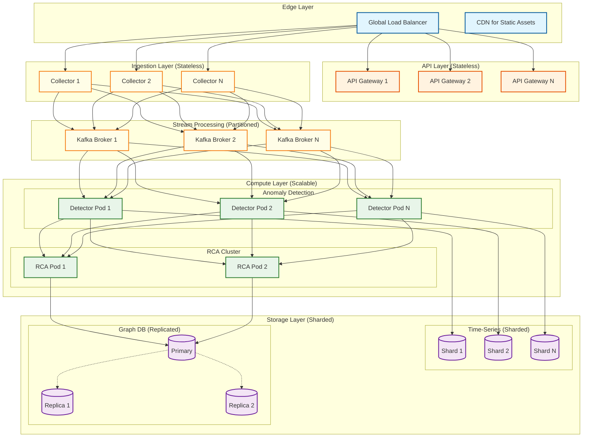
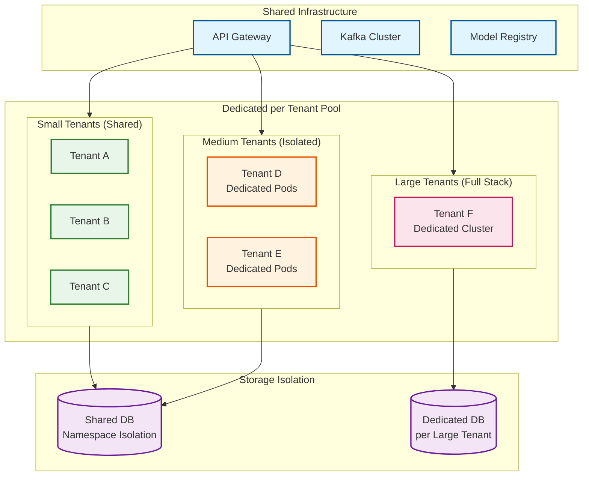
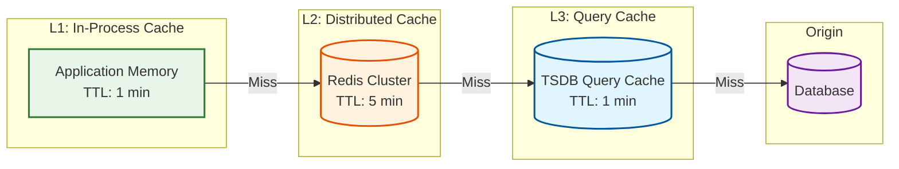
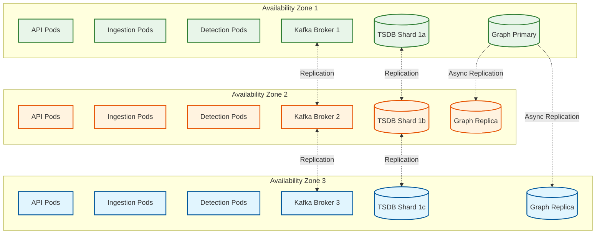
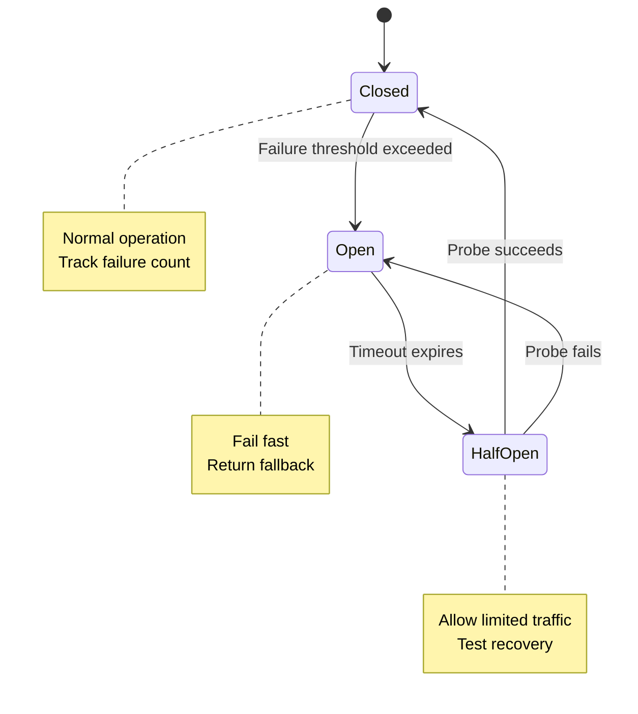
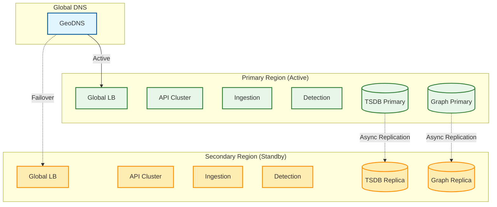

# Scalability & Reliability

This document covers the scaling strategies, fault tolerance mechanisms, and disaster recovery plans for the AIOps system.

---

## Scalability Strategy

### Scaling Dimensions

| Dimension | Current Scale | 10x Scale | 100x Scale |
|-----------|--------------|-----------|------------|
| Metrics/second | 1M | 10M | 100M |
| Hosts monitored | 50K | 500K | 5M |
| Services | 5K | 50K | 500K |
| Alerts/day | 10K | 100K | 1M |
| Tenants | 100 | 1K | 10K |
| Concurrent users | 1K | 10K | 100K |

### Horizontal Scaling Architecture



### Component-Specific Scaling

#### Ingestion Layer Scaling

| Scale Factor | Collectors | Kafka Partitions | Strategy |
|--------------|------------|------------------|----------|
| 1x (1M/s) | 10 | 100 | Baseline |
| 10x (10M/s) | 100 | 1,000 | Add collectors, increase partitions |
| 100x (100M/s) | 500 | 5,000 | Multi-cluster Kafka, edge pre-aggregation |

**Auto-scaling Configuration:**

```yaml
# Kubernetes HPA for collectors
apiVersion: autoscaling/v2
kind: HorizontalPodAutoscaler
metadata:
  name: telemetry-collector-hpa
spec:
  scaleTargetRef:
    apiVersion: apps/v1
    kind: Deployment
    name: telemetry-collector
  minReplicas: 10
  maxReplicas: 200
  metrics:
    - type: External
      external:
        metric:
          name: kafka_consumer_lag
        target:
          type: AverageValue
          averageValue: "10000"  # Scale if lag > 10K messages
    - type: Resource
      resource:
        name: cpu
        target:
          type: Utilization
          averageUtilization: 70
```

#### Anomaly Detection Scaling

| Tier | Scaling Unit | Max per Instance | Scale Trigger |
|------|--------------|------------------|---------------|
| Basic | CPU pod | 100K metrics/s | CPU > 70% |
| Agile | CPU pod | 20K metrics/s | Memory > 80% |
| Robust | GPU pod | 50K metrics/s | GPU > 70% |

**Model Serving Auto-scaling:**

```yaml
# KEDA ScaledObject for ML inference
apiVersion: keda.sh/v1alpha1
kind: ScaledObject
metadata:
  name: anomaly-detector-scaler
spec:
  scaleTargetRef:
    name: anomaly-detector
  minReplicaCount: 5
  maxReplicaCount: 50
  triggers:
    - type: prometheus
      metadata:
        serverAddress: http://prometheus:9090
        metricName: aiops_detection_queue_length
        threshold: "1000"
        query: |
          sum(aiops_detection_queue_length{tier="robust"})
```

#### Database Scaling

**Time-Series Database (Sharded):**

```
Sharding Strategy: Consistent hashing by tenant_id + metric_name

Shard count formula:
  num_shards = ceiling(total_metrics / 100M)

Example:
  1B metrics → 10 shards
  Each shard: 100M metrics, ~10TB data

Rebalancing:
  - Add new shard
  - Migrate hash range gradually
  - No downtime required
```

**Graph Database (Replicated):**

```
Replication Strategy: Primary with read replicas

Write path: Primary only (topology updates are rare)
Read path: Load balance across replicas

Replica count: 3 (1 primary + 2 replicas)
Replication lag: < 1 second (async replication)
```

### Multi-Tenancy Scaling



**Tenant Sizing Tiers:**

| Tier | Metrics/sec | Dedicated Resources | Isolation |
|------|-------------|---------------------|-----------|
| Small | < 10K | None | Namespace |
| Medium | 10K - 100K | Compute pods | Namespace + Resource Quota |
| Large | > 100K | Full stack | Separate cluster |

---

## Caching Strategy

### Multi-Layer Cache Architecture



### Cache Configuration by Data Type

| Data Type | L1 TTL | L2 TTL | Cache Key Pattern |
|-----------|--------|--------|-------------------|
| Service topology | 5 min | 30 min | `topo:{tenant}:{service}` |
| Metric metadata | 5 min | 60 min | `metric:{tenant}:{name}` |
| ML model weights | 10 min | - | In-memory only |
| Feature vectors | 1 min | 5 min | `feat:{tenant}:{metric}:{ts}` |
| Incident summary | 30 sec | 5 min | `inc:{tenant}:{id}` |
| User session | - | 24 hr | `session:{user_id}` |

### Cache Invalidation Strategy

```
Invalidation Patterns:

1. Time-based (TTL):
   - Metric data: 1 minute (acceptable staleness)
   - Topology: 5 minutes (rarely changes)

2. Event-based:
   - Topology change → Invalidate topology cache
   - Model deployment → Invalidate model cache
   - Incident update → Invalidate incident cache

3. Write-through:
   - On database write, update cache immediately
   - Used for: Incident status, runbook config

4. Write-behind:
   - Batch cache writes to database
   - Used for: Feature vectors (non-critical)
```

---

## Fault Tolerance

### Single Points of Failure Analysis

| Component | SPOF Risk | Mitigation | Recovery Time |
|-----------|-----------|------------|---------------|
| API Gateway | Low | Multiple instances + load balancer | < 1 sec (failover) |
| Kafka | Low | Multi-broker cluster + replication | < 10 sec (leader election) |
| Time-Series DB | Medium | Sharded + replicated | < 30 sec (replica promotion) |
| Graph DB | Medium | Primary + replicas | < 30 sec (replica promotion) |
| ML Model Service | Low | Multiple pods + fallback to rules | < 1 sec (failover) |
| Automation Engine | Medium | Active-passive + leader election | < 30 sec (leader election) |

### Redundancy Architecture



### Circuit Breaker Implementation



**Circuit Breaker Configuration:**

```yaml
circuit_breakers:
  ml_inference:
    failure_threshold: 5          # Open after 5 failures
    success_threshold: 2          # Close after 2 successes in half-open
    timeout_seconds: 30           # Time before half-open
    fallback: "statistical_detection"

  graph_db:
    failure_threshold: 3
    success_threshold: 1
    timeout_seconds: 60
    fallback: "cached_topology"

  external_integrations:
    failure_threshold: 10
    success_threshold: 3
    timeout_seconds: 120
    fallback: "queue_for_retry"
```

### Graceful Degradation Hierarchy

```
Level 0: Full Functionality
├── ML-based anomaly detection (all tiers)
├── Causal RCA with Bayesian inference
├── Full correlation with topology
└── Automated remediation

Level 1: Reduced ML (ML service degraded)
├── Statistical anomaly detection only
├── Correlation-based RCA (no causal)
├── Full correlation
└── Automated remediation

Level 2: No ML (ML completely down)
├── Rule-based anomaly detection
├── Rule-based RCA
├── Time-based correlation only
└── Manual remediation suggestions

Level 3: Minimal (Storage degraded)
├── Pass-through alerting
├── No RCA
├── No correlation
└── Direct notification to on-call

Level 4: Emergency (Multiple failures)
├── Static fallback alerts
├── Notify SRE team
└── Status page update
```

### Retry Strategy

| Operation | Max Retries | Backoff | Timeout |
|-----------|-------------|---------|---------|
| API calls | 3 | Exponential (1s, 2s, 4s) | 30s |
| Database writes | 5 | Linear (100ms) | 10s |
| Kafka produce | 10 | Exponential (100ms base) | 60s |
| ML inference | 2 | Fixed (500ms) | 5s |
| External webhooks | 5 | Exponential (5s, 10s, 20s, 40s, 80s) | 30s |

**Retry Implementation:**

```
FUNCTION RetryWithBackoff(operation, config):
  FOR attempt = 1 TO config.max_retries:
    TRY:
      result = operation.execute(timeout=config.timeout)
      RETURN result

    CATCH retriable_error:
      IF attempt == config.max_retries:
        THROW error

      wait_time = ComputeBackoff(attempt, config)
      Sleep(wait_time)

    CATCH non_retriable_error:
      THROW error

FUNCTION ComputeBackoff(attempt, config):
  IF config.backoff_type == "exponential":
    base = config.base_delay
    RETURN MIN(base * (2 ^ (attempt - 1)), config.max_delay) + random_jitter()

  ELSE IF config.backoff_type == "linear":
    RETURN config.base_delay * attempt

  ELSE:
    RETURN config.base_delay
```

---

## Disaster Recovery

### Recovery Objectives

| Metric | Target | Measurement |
|--------|--------|-------------|
| **RTO** (Recovery Time Objective) | 15 minutes | Time to restore service |
| **RPO** (Recovery Point Objective) | 5 minutes | Maximum data loss |
| **MTTR** (Mean Time to Repair) | 30 minutes | Average recovery time |

### Backup Strategy

| Data Type | Backup Frequency | Retention | Location |
|-----------|------------------|-----------|----------|
| Time-series data | Continuous replication | 7 days hot, 90 days cold | Cross-region |
| Graph database | Hourly snapshots | 30 days | Cross-region |
| Configuration | On change | 90 days | Multi-cloud |
| ML models | On deployment | 10 versions | Multi-cloud |
| Audit logs | Continuous | 1 year | Immutable storage |

### Multi-Region Architecture



### Failover Procedure

```
AUTOMATED FAILOVER PROCEDURE

Trigger: Primary region health check fails for > 3 minutes

Phase 1: Detection (0-1 min)
├── Health monitor detects failure
├── Confirm with secondary checks
└── Alert on-call SRE

Phase 2: Decision (1-2 min)
├── Auto-approve if automated failover enabled
├── OR wait for manual approval
└── Record decision in audit log

Phase 3: DNS Failover (2-5 min)
├── Update GeoDNS to route to secondary
├── TTL: 60 seconds (propagation time)
└── Monitor traffic shift

Phase 4: Promotion (5-10 min)
├── Promote secondary TSDB to primary
├── Promote secondary Graph DB to primary
├── Enable write path on secondary
└── Start accepting new data

Phase 5: Verification (10-15 min)
├── Verify data ingestion working
├── Verify anomaly detection running
├── Verify incident creation functional
└── Notify stakeholders

Phase 6: Stabilization
├── Monitor for issues
├── Prepare for failback
└── Post-incident review
```

### Data Consistency During Failover

| Data Type | Consistency Guarantee | Potential Loss |
|-----------|----------------------|----------------|
| Metrics | Eventually consistent | 5-min max (RPO) |
| Alerts | At-least-once | Duplicates possible |
| Incidents | Eventually consistent | Recent updates may be lost |
| Topology | Eventually consistent | Stale during failover |
| Models | Versioned | Use last known good |

### Failback Procedure

```
FAILBACK PROCEDURE (After Primary Recovery)

Phase 1: Primary Restoration (T+0)
├── Restore primary region infrastructure
├── Restore databases from backup
├── Replay missing data from secondary
└── Verify data integrity

Phase 2: Sync Verification (T+2h)
├── Compare data checksums
├── Identify missing records
├── Backfill missing data
└── Verify models are current

Phase 3: Traffic Migration (T+4h)
├── Enable read traffic to primary (10%)
├── Gradually increase (25%, 50%, 75%, 100%)
├── Monitor for errors
└── Disable write on secondary

Phase 4: Stabilization (T+6h)
├── Confirm all traffic on primary
├── Secondary returns to standby
├── Update runbooks with lessons learned
└── Close incident
```

---

## Load Testing and Capacity Planning

### Load Testing Strategy

| Test Type | Purpose | Frequency |
|-----------|---------|-----------|
| Baseline | Establish normal performance | Monthly |
| Stress | Find breaking point | Quarterly |
| Spike | Test auto-scaling | Monthly |
| Soak | Memory leaks, degradation | Quarterly |
| Chaos | Failure scenarios | Monthly |

### Capacity Planning Model

```
Monthly Capacity Review:

1. Measure current utilization:
   - Ingestion: X% of capacity
   - Detection: Y% of capacity
   - Storage: Z% used

2. Project growth:
   - Metric growth rate: A%/month
   - Tenant onboarding: B new tenants
   - Feature expansion: C% more detection

3. Calculate runway:
   - Months until 80% capacity
   - Cost of scaling
   - Lead time for procurement

4. Scaling trigger:
   - Scale when utilization > 70%
   - Order hardware when runway < 3 months
```

### Performance Benchmarks

| Operation | p50 | p95 | p99 | Target |
|-----------|-----|-----|-----|--------|
| Metric ingestion | 5ms | 20ms | 100ms | <200ms |
| Anomaly detection | 100ms | 500ms | 2s | <5s |
| Alert correlation | 50ms | 200ms | 500ms | <1s |
| RCA computation | 1s | 5s | 15s | <30s |
| Incident query | 20ms | 100ms | 500ms | <1s |
| Runbook execution | 5s | 30s | 120s | <300s |
