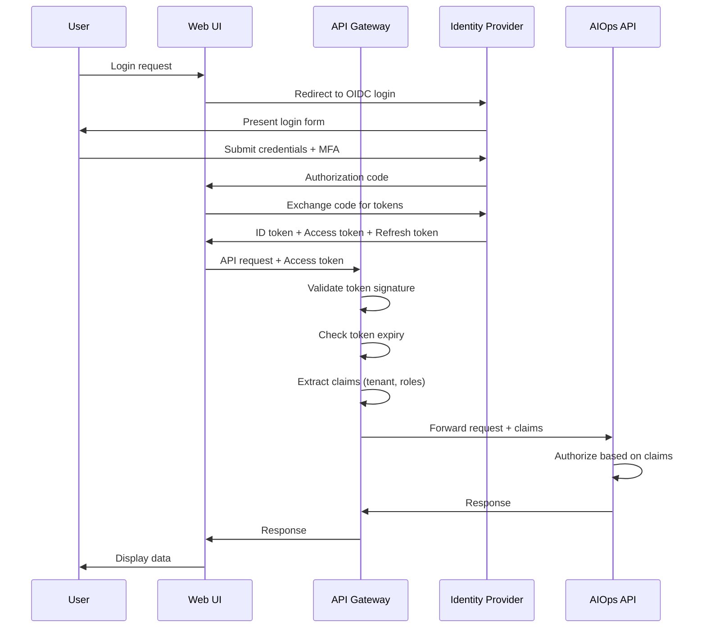
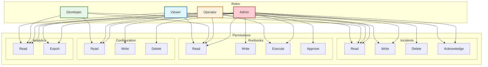
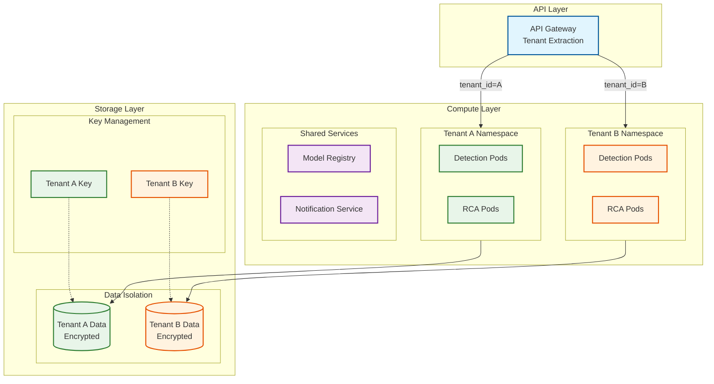
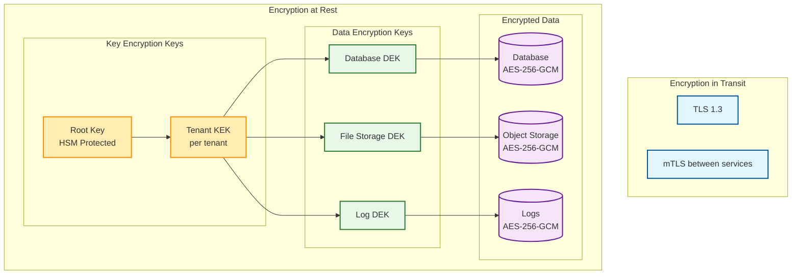

# Security & Compliance

This document covers authentication, authorization, data security, threat modeling, and compliance considerations for the AIOps system.

---

## Authentication Architecture

### Authentication Flow



### Authentication Methods

| Client Type | Auth Method | Token Lifetime | Refresh |
|-------------|-------------|----------------|---------|
| Web UI | OIDC + JWT | 1 hour | Yes, 7 days |
| CLI Tool | Device code flow | 1 hour | Yes, 30 days |
| Service Account | Client credentials | 24 hours | No (re-auth) |
| Webhook Sources | API key + HMAC | Permanent | N/A |
| Internal Services | mTLS | Session | N/A |

### Token Structure

```yaml
access_token_claims:
  iss: "https://auth.aiops.example.com"
  sub: "user:12345"                      # User ID
  aud: "aiops-api"                       # Audience
  exp: 1704067200                        # Expiration
  iat: 1704063600                        # Issued at
  tenant_id: "tenant-abc"                # Tenant identifier
  roles: ["admin", "operator"]           # User roles
  permissions:                           # Fine-grained permissions
    - "incidents:read"
    - "incidents:write"
    - "runbooks:execute"
  mfa_verified: true                     # MFA status
```

### API Key Management

```yaml
api_key_schema:
  id: string (UUID)
  tenant_id: string
  name: string                           # Human-readable name
  key_hash: string                       # bcrypt hash of key
  key_prefix: string                     # First 8 chars for identification
  permissions: array[string]             # Scoped permissions
  allowed_ips: array[string]             # IP allowlist (optional)
  rate_limit: int                        # Requests per minute
  last_used_at: timestamp
  expires_at: timestamp (optional)
  created_by: string
  created_at: timestamp
  revoked_at: timestamp (nullable)
```

---

## Authorization Model

### Role-Based Access Control (RBAC)



### Permission Matrix

| Permission | Admin | Operator | Developer | Viewer |
|------------|-------|----------|-----------|--------|
| **Incidents** |
| View incidents | Yes | Yes | Yes | Yes |
| Acknowledge incidents | Yes | Yes | No | No |
| Resolve incidents | Yes | Yes | No | No |
| Delete incidents | Yes | No | No | No |
| **Runbooks** |
| View runbooks | Yes | Yes | Yes | Yes |
| Create/edit runbooks | Yes | No | No | No |
| Execute runbooks | Yes | Yes | No | No |
| Approve executions | Yes | Yes | No | No |
| **Configuration** |
| View config | Yes | Yes | Yes | No |
| Modify detection config | Yes | No | No | No |
| Modify integrations | Yes | No | No | No |
| **Topology** |
| View topology | Yes | Yes | Yes | Yes |
| Modify topology | Yes | Yes | No | No |
| **Users** |
| Manage users | Yes | No | No | No |
| View audit logs | Yes | Yes | No | No |

### Attribute-Based Access Control (ABAC)

For fine-grained control beyond roles:

```yaml
abac_policy_example:
  name: "team-incident-access"
  description: "Team members can only access incidents for their services"
  effect: "allow"
  subjects:
    - type: "user"
      attributes:
        team: "${user.team}"
  resources:
    - type: "incident"
      attributes:
        owner_team: "${user.team}"
  actions:
    - "read"
    - "acknowledge"
    - "resolve"
  conditions:
    - "${incident.severity} != 'critical'"  # Critical needs escalation
```

### Authorization Check Flow

```
FUNCTION AuthorizeRequest(user, resource, action):

  // Step 1: Check RBAC
  user_roles = GetUserRoles(user, resource.tenant_id)
  role_permissions = GetRolePermissions(user_roles)

  IF action IN role_permissions:
    rbac_allowed = TRUE
  ELSE:
    RETURN DENIED("Insufficient role permissions")

  // Step 2: Check ABAC policies
  policies = GetApplicablePolicies(user, resource, action)

  FOR EACH policy IN policies:
    result = EvaluatePolicy(policy, user, resource, action)
    IF result == DENY:
      RETURN DENIED(policy.name)

  // Step 3: Check resource-level ACL
  acl = GetResourceACL(resource)
  IF acl.exists AND user NOT IN acl.allowed_users:
    RETURN DENIED("Not in resource ACL")

  RETURN ALLOWED
```

---

## Multi-Tenancy Security

### Tenant Isolation Architecture



### Isolation Mechanisms

| Layer | Isolation Method | Implementation |
|-------|------------------|----------------|
| Network | Network Policies | Kubernetes NetworkPolicy per namespace |
| Compute | Namespace Isolation | Separate K8s namespaces per tenant |
| Data | Row-Level Security | tenant_id filter on all queries |
| Encryption | Per-Tenant Keys | Unique DEK per tenant, wrapped by KEK |
| API | Tenant Context | Mandatory tenant_id in all requests |
| Storage | Logical Partitioning | Separate tables/collections per tenant |

### Network Isolation Policy

```yaml
# Kubernetes NetworkPolicy for tenant isolation
apiVersion: networking.k8s.io/v1
kind: NetworkPolicy
metadata:
  name: tenant-isolation
  namespace: tenant-abc
spec:
  podSelector: {}  # Apply to all pods in namespace
  policyTypes:
    - Ingress
    - Egress
  ingress:
    # Allow from API gateway
    - from:
        - namespaceSelector:
            matchLabels:
              name: api-gateway
    # Allow from same namespace
    - from:
        - podSelector: {}
  egress:
    # Allow to shared services
    - to:
        - namespaceSelector:
            matchLabels:
              type: shared-services
    # Allow to storage
    - to:
        - namespaceSelector:
            matchLabels:
              type: storage
    # Allow DNS
    - to:
        - namespaceSelector: {}
          podSelector:
            matchLabels:
              k8s-app: kube-dns
      ports:
        - protocol: UDP
          port: 53
```

---

## Data Security

### Encryption Architecture



### Encryption Specifications

| Data Type | Algorithm | Key Size | Key Rotation |
|-----------|-----------|----------|--------------|
| Data at rest | AES-256-GCM | 256 bits | 90 days |
| Data in transit | TLS 1.3 | 256 bits | Certificate: 1 year |
| API keys | bcrypt | N/A | On compromise |
| Secrets | ChaCha20-Poly1305 | 256 bits | On access |

### PII Handling

| Data Field | Classification | Handling |
|------------|----------------|----------|
| User email | PII | Encrypted, hashed for search |
| User name | PII | Encrypted |
| IP addresses | PII | Encrypted, anonymized after 30 days |
| Host names | Internal | Encrypted |
| Service names | Internal | Plain text |
| Metric values | Telemetry | Plain text |
| Log messages | Mixed | PII detection + masking |

### Data Masking Rules

```yaml
masking_rules:
  - pattern: "email"
    regex: "[a-zA-Z0-9._%+-]+@[a-zA-Z0-9.-]+\\.[a-zA-Z]{2,}"
    mask: "***@***.***"

  - pattern: "ip_address"
    regex: "\\d{1,3}\\.\\d{1,3}\\.\\d{1,3}\\.\\d{1,3}"
    mask: "xxx.xxx.xxx.xxx"

  - pattern: "credit_card"
    regex: "\\d{4}[- ]?\\d{4}[- ]?\\d{4}[- ]?\\d{4}"
    mask: "****-****-****-****"

  - pattern: "api_key"
    regex: "sk_[a-zA-Z0-9]{32}"
    mask: "sk_****"

  - pattern: "jwt_token"
    regex: "eyJ[a-zA-Z0-9_-]*\\.eyJ[a-zA-Z0-9_-]*\\.[a-zA-Z0-9_-]*"
    mask: "[JWT_REDACTED]"
```

---

## Threat Model

### STRIDE Analysis

| Threat | Category | Asset | Likelihood | Impact | Mitigation |
|--------|----------|-------|------------|--------|------------|
| Unauthorized API access | Spoofing | API Gateway | Medium | High | MFA, short-lived tokens |
| Alert data tampering | Tampering | Alert pipeline | Low | High | HMAC signatures, audit logs |
| Sensitive data exposure | Info Disclosure | Database | Medium | Critical | Encryption, access controls |
| DoS via alert storm | Denial of Service | Ingestion | High | High | Rate limiting, circuit breakers |
| Malicious runbook execution | Elevation | Automation | Medium | Critical | Approval workflows, blast radius |
| Model poisoning | Tampering | ML pipeline | Low | High | Training data validation |

### Attack Vectors and Mitigations

#### 1. Malicious Runbook Injection

**Threat:** Attacker injects malicious commands into runbook definitions.

**Mitigation:**
```yaml
runbook_security:
  # Code review required for all runbooks
  approval_required: true
  approvers:
    - security-team
    - sre-team

  # Restrict allowed actions
  allowed_actions:
    - type: "api_call"
      allowed_hosts:
        - "internal-api.company.com"
        - "kubernetes.default.svc"
    - type: "script"
      allowed_interpreters: ["python"]
      sandboxed: true
      max_runtime_seconds: 60

  # Audit all changes
  audit:
    enabled: true
    retention_days: 365
```

#### 2. Alert Spoofing

**Threat:** Attacker sends fake alerts to trigger unnecessary remediations.

**Mitigation:**
```yaml
alert_validation:
  # Require authentication for all alert sources
  authentication:
    type: "hmac"
    algorithm: "sha256"
    header: "X-Alert-Signature"

  # Validate source IP
  allowed_sources:
    - cidr: "10.0.0.0/8"  # Internal network
    - cidr: "192.168.0.0/16"

  # Rate limit per source
  rate_limit:
    requests_per_minute: 1000
    burst: 5000

  # Anomaly detection on alert patterns
  anomaly_detection:
    enabled: true
    baseline_period: "7d"
    threshold: 5.0  # Std deviations from baseline
```

#### 3. Credential Theft

**Threat:** API keys or tokens stolen and used for unauthorized access.

**Mitigation:**
```yaml
credential_security:
  # Short-lived tokens
  access_token_lifetime: 3600  # 1 hour

  # IP binding for sensitive operations
  ip_binding:
    enabled: true
    operations:
      - "runbook_execute"
      - "config_modify"

  # Anomaly detection on usage patterns
  usage_anomaly_detection:
    enabled: true
    features:
      - "request_rate"
      - "time_of_day"
      - "source_ip"
      - "user_agent"

  # Automatic revocation on suspicious activity
  auto_revoke:
    enabled: true
    triggers:
      - "impossible_travel"
      - "rate_spike"
      - "new_location"
```

#### 4. Model Poisoning via Feedback

**Threat:** Attacker provides malicious feedback to degrade model accuracy.

**Mitigation:**
```yaml
feedback_validation:
  # Rate limit feedback per user
  rate_limit:
    per_user_per_day: 100

  # Require explanation for contradicting alerts
  require_explanation:
    when: "feedback_contradicts_alert"
    min_length: 50

  # Statistical validation
  statistical_checks:
    - type: "outlier_detection"
      threshold: 3.0
    - type: "pattern_matching"
      suspicious_patterns:
        - "bulk_false_positive"
        - "single_user_high_volume"

  # Human review for suspicious feedback
  human_review:
    trigger: "suspicious_pattern_detected"
    reviewers: ["ml-team"]
```

---

## Compliance

### Compliance Framework Mapping

| Requirement | SOC 2 | GDPR | HIPAA | ISO 27001 |
|-------------|-------|------|-------|-----------|
| Access Control | CC6.1 | Art. 32 | §164.312 | A.9 |
| Encryption | CC6.7 | Art. 32 | §164.312 | A.10 |
| Audit Logging | CC7.2 | Art. 30 | §164.312 | A.12.4 |
| Data Retention | CC6.5 | Art. 17 | §164.530 | A.8.3 |
| Incident Response | CC7.4 | Art. 33 | §164.308 | A.16 |
| Vendor Management | CC9.2 | Art. 28 | §164.308 | A.15 |

### Audit Logging Requirements

```yaml
audit_log_schema:
  timestamp: datetime (ISO8601)
  event_id: uuid
  tenant_id: string
  actor:
    type: enum (user, service, system)
    id: string
    ip_address: string
    user_agent: string
  action: string
  resource:
    type: string
    id: string
  outcome: enum (success, failure, denied)
  details: map[string, any]
  request_id: string
  session_id: string

required_audit_events:
  - "user.login"
  - "user.logout"
  - "user.mfa_challenge"
  - "api_key.created"
  - "api_key.revoked"
  - "incident.acknowledged"
  - "incident.resolved"
  - "runbook.executed"
  - "runbook.approved"
  - "config.modified"
  - "data.exported"
  - "user.permissions_changed"
```

### Data Retention Policies

| Data Type | Retention | Legal Basis | Deletion Method |
|-----------|-----------|-------------|-----------------|
| Metrics | 90 days | Operational need | Automatic TTL |
| Logs | 90 days | Operational need | Automatic TTL |
| Alerts | 1 year | Compliance | Scheduled job |
| Incidents | 3 years | Compliance | Manual review |
| Audit logs | 7 years | Legal requirement | Immutable storage |
| User data | Until deletion request | Consent | On request |

### GDPR Compliance

```yaml
gdpr_features:
  # Right to access (Art. 15)
  data_export:
    endpoint: "POST /api/v1/users/{id}/data-export"
    format: "json"
    includes:
      - "profile"
      - "audit_logs"
      - "preferences"
    delivery: "encrypted_email"

  # Right to erasure (Art. 17)
  data_deletion:
    endpoint: "DELETE /api/v1/users/{id}"
    scope:
      - "profile": "delete"
      - "audit_logs": "anonymize"  # Keep for compliance
      - "alerts": "anonymize"
    confirmation: "email_verification"
    retention_period: "30_days"  # Before permanent deletion

  # Data portability (Art. 20)
  data_portability:
    endpoint: "GET /api/v1/users/{id}/export"
    format: "json"
    machine_readable: true

  # Consent management
  consent:
    tracking: true
    granular: true
    categories:
      - "essential"
      - "analytics"
      - "notifications"
```

---

## Security Operations

### Security Monitoring

```yaml
security_alerts:
  - name: "brute_force_detection"
    condition: "failed_logins > 10 in 5 minutes"
    severity: "high"
    action: "block_ip"

  - name: "privilege_escalation"
    condition: "role_change without approval"
    severity: "critical"
    action: "notify_security_team"

  - name: "data_exfiltration"
    condition: "export_volume > 100MB in 1 hour"
    severity: "high"
    action: "throttle_and_alert"

  - name: "suspicious_runbook"
    condition: "runbook_with_external_api_call"
    severity: "medium"
    action: "require_approval"

  - name: "impossible_travel"
    condition: "login from different country in < 1 hour"
    severity: "high"
    action: "require_mfa_reauth"
```

### Incident Response Plan

```
SECURITY INCIDENT RESPONSE

Phase 1: Detection (0-15 min)
├── Automated alert triggered
├── Security team notified
├── Initial triage
└── Severity assessment

Phase 2: Containment (15-60 min)
├── Isolate affected systems
├── Block suspicious IPs
├── Revoke compromised credentials
├── Preserve evidence
└── Document timeline

Phase 3: Eradication (1-24 hours)
├── Identify root cause
├── Remove malicious artifacts
├── Patch vulnerabilities
├── Update security controls
└── Verify eradication

Phase 4: Recovery (1-7 days)
├── Restore from clean backups
├── Gradually restore access
├── Monitor for recurrence
├── Verify system integrity
└── Update documentation

Phase 5: Post-Incident (7-30 days)
├── Conduct post-mortem
├── Update runbooks
├── Implement improvements
├── Train team
└── Report to stakeholders (if required)
```

### Vulnerability Management

| Severity | Response Time | Patching SLA |
|----------|---------------|--------------|
| Critical | 4 hours | 24 hours |
| High | 24 hours | 7 days |
| Medium | 7 days | 30 days |
| Low | 30 days | 90 days |

```yaml
vulnerability_scanning:
  frequency:
    infrastructure: "daily"
    application: "weekly"
    dependencies: "continuous"

  tools:
    - type: "SAST"
      tool: "semgrep"
      trigger: "pull_request"
    - type: "DAST"
      tool: "OWASP ZAP"
      trigger: "staging_deployment"
    - type: "SCA"
      tool: "snyk"
      trigger: "continuous"
    - type: "container"
      tool: "trivy"
      trigger: "image_build"
```
