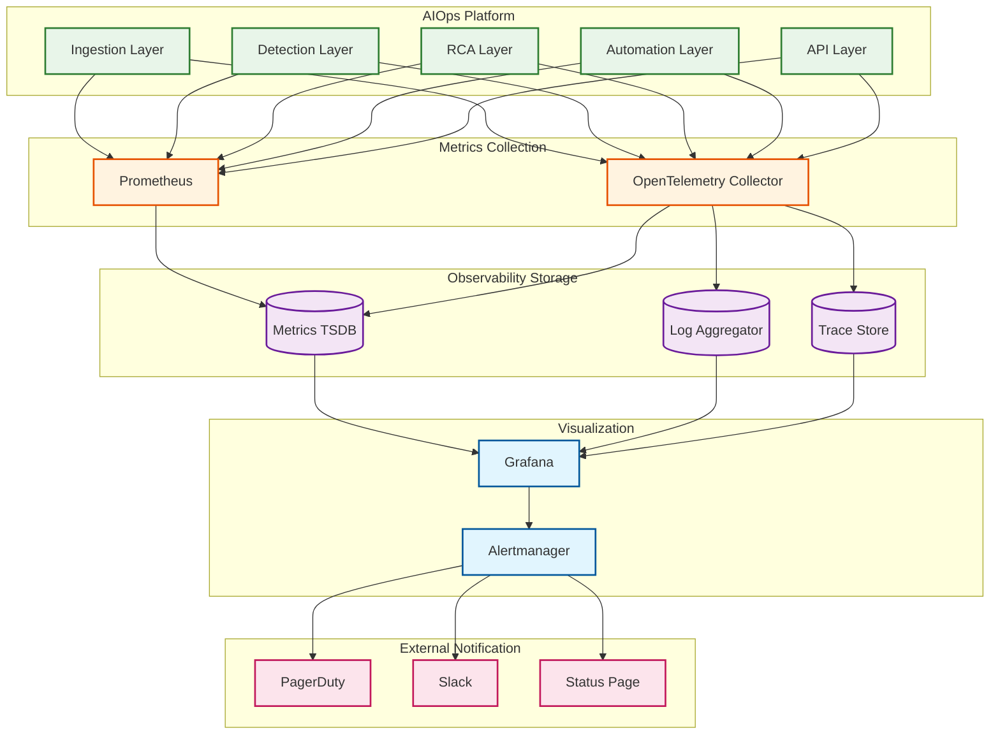
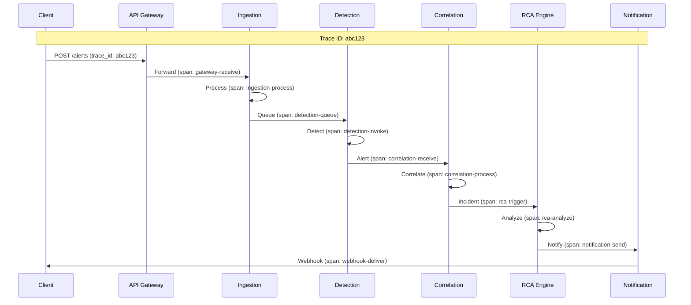

# Observability

This document covers the meta-observability strategy for the AIOps system—monitoring the system that monitors other systems.

---

## The Meta-Observability Challenge

> "Who monitors the monitor?"

AIOps faces a unique challenge: it must be **more reliable** than the systems it monitors. If the AIOps platform has an outage, operators lose visibility into all their infrastructure.

### Observability Principles for AIOps

| Principle | Description |
|-----------|-------------|
| **Self-Monitoring** | AIOps must detect its own anomalies |
| **Independence** | Observability stack must be separate from monitored systems |
| **Graceful Degradation** | Partial failures should not blind operators |
| **Alert on Alert Failure** | Notify if alert pipeline is broken |
| **Trust but Verify** | Monitor that monitoring is working |

---

## Observability Architecture



---

## Metrics (USE/RED Method)

### USE Metrics (Utilization, Saturation, Errors)

#### Ingestion Layer Metrics

```yaml
# Utilization
aiops_ingestion_throughput_total:
  type: counter
  description: "Total metrics ingested"
  labels: [tenant_id, source, protocol]
  unit: metrics

aiops_ingestion_bytes_total:
  type: counter
  description: "Total bytes ingested"
  labels: [tenant_id, source]
  unit: bytes

# Saturation
aiops_ingestion_queue_depth:
  type: gauge
  description: "Current queue depth"
  labels: [partition]
  unit: messages

aiops_ingestion_lag_seconds:
  type: gauge
  description: "Consumer lag in seconds"
  labels: [consumer_group, partition]
  unit: seconds

# Errors
aiops_ingestion_errors_total:
  type: counter
  description: "Total ingestion errors"
  labels: [tenant_id, error_type]
  unit: errors
```

#### Detection Layer Metrics

```yaml
# Utilization
aiops_detection_invocations_total:
  type: counter
  description: "Total detection invocations"
  labels: [tenant_id, tier, model_name]
  unit: invocations

aiops_detection_latency_seconds:
  type: histogram
  description: "Detection latency distribution"
  labels: [tier, model_name]
  buckets: [0.01, 0.05, 0.1, 0.5, 1, 2, 5, 10]
  unit: seconds

# Saturation
aiops_detection_queue_depth:
  type: gauge
  description: "Pending detection requests"
  labels: [tier]
  unit: requests

aiops_gpu_utilization_percent:
  type: gauge
  description: "GPU utilization for ML inference"
  labels: [gpu_id, model_name]
  unit: percent

# Errors
aiops_detection_failures_total:
  type: counter
  description: "Detection failures"
  labels: [tier, error_type]
  unit: failures
```

### RED Metrics (Rate, Errors, Duration)

#### API Layer Metrics

```yaml
# Rate
aiops_api_requests_total:
  type: counter
  description: "Total API requests"
  labels: [endpoint, method, status_code]
  unit: requests

# Errors
aiops_api_errors_total:
  type: counter
  description: "API errors"
  labels: [endpoint, method, error_type]
  unit: errors

# Duration
aiops_api_latency_seconds:
  type: histogram
  description: "API request latency"
  labels: [endpoint, method]
  buckets: [0.005, 0.01, 0.025, 0.05, 0.1, 0.25, 0.5, 1, 2.5, 5, 10]
  unit: seconds
```

### Business Metrics

```yaml
# Alert Funnel
aiops_alerts_received_total:
  type: counter
  description: "Raw alerts received"
  labels: [tenant_id, source, severity]

aiops_alerts_deduplicated_total:
  type: counter
  description: "Alerts after deduplication"
  labels: [tenant_id]

aiops_alerts_correlated_total:
  type: counter
  description: "Alerts after correlation"
  labels: [tenant_id]

aiops_incidents_created_total:
  type: counter
  description: "Incidents created"
  labels: [tenant_id, severity]

# Detection Quality
aiops_false_positive_rate:
  type: gauge
  description: "False positive rate (from feedback)"
  labels: [tenant_id, detection_tier]
  unit: ratio

aiops_detection_accuracy:
  type: gauge
  description: "Detection accuracy (from feedback)"
  labels: [tenant_id, detection_tier]
  unit: ratio

# RCA Quality
aiops_rca_accuracy:
  type: gauge
  description: "RCA accuracy (correct root cause identified)"
  labels: [tenant_id]
  unit: ratio

aiops_rca_latency_seconds:
  type: histogram
  description: "Time to identify root cause"
  labels: [tenant_id]
  buckets: [1, 5, 10, 30, 60, 120, 300]

# Automation
aiops_remediation_success_rate:
  type: gauge
  description: "Remediation success rate"
  labels: [tenant_id, runbook_name]
  unit: ratio

aiops_mttr_seconds:
  type: histogram
  description: "Mean time to resolution"
  labels: [tenant_id, severity]
  buckets: [60, 300, 900, 1800, 3600, 7200, 14400, 28800]
```

---

## ML Model Monitoring

### Model Performance Metrics

```yaml
# Prediction Distribution
aiops_model_prediction_distribution:
  type: histogram
  description: "Distribution of model predictions"
  labels: [model_name, model_version]
  buckets: [0.1, 0.2, 0.3, 0.4, 0.5, 0.6, 0.7, 0.8, 0.9, 1.0]

# Feature Drift
aiops_feature_psi:
  type: gauge
  description: "Population Stability Index for feature drift"
  labels: [model_name, feature_name]
  thresholds:
    warning: 0.1
    critical: 0.25

# Model Staleness
aiops_model_last_trained_timestamp:
  type: gauge
  description: "Unix timestamp of last training"
  labels: [model_name]

aiops_model_age_hours:
  type: gauge
  description: "Hours since last training"
  labels: [model_name]

# Inference Performance
aiops_model_inference_latency_seconds:
  type: histogram
  description: "Model inference latency"
  labels: [model_name, model_version]
  buckets: [0.001, 0.005, 0.01, 0.05, 0.1, 0.5, 1]

aiops_model_batch_size:
  type: histogram
  description: "Batch sizes for inference"
  labels: [model_name]
  buckets: [1, 8, 16, 32, 64, 128, 256, 512]
```

### Drift Detection Dashboard

```
┌─────────────────────────────────────────────────────────────────┐
│                    MODEL DRIFT DASHBOARD                        │
├─────────────────────────────────────────────────────────────────┤
│                                                                 │
│  Feature Distribution Drift (PSI)                               │
│  ┌──────────────────────────────────────────────────────────┐  │
│  │ Feature         │ PSI   │ Status │ Trend                 │  │
│  ├──────────────────────────────────────────────────────────┤  │
│  │ cpu_usage       │ 0.05  │ OK     │ ████░░░░░░ stable    │  │
│  │ memory_usage    │ 0.12  │ WARN   │ █████████░ ↑ drift   │  │
│  │ error_rate      │ 0.08  │ OK     │ ██████░░░░ stable    │  │
│  │ latency_p99     │ 0.22  │ CRIT   │ █████████████ ↑↑     │  │
│  └──────────────────────────────────────────────────────────┘  │
│                                                                 │
│  Prediction Distribution (Last 24h vs Baseline)                 │
│  ┌──────────────────────────────────────────────────────────┐  │
│  │                                                          │  │
│  │  Baseline: ████████████████████                          │  │
│  │  Current:  ██████████████████████████                    │  │
│  │            0.0  0.2  0.4  0.6  0.8  1.0                  │  │
│  │                                                          │  │
│  │  KL Divergence: 0.15 (Warning threshold: 0.2)            │  │
│  └──────────────────────────────────────────────────────────┘  │
│                                                                 │
│  Model Performance Over Time                                    │
│  ┌──────────────────────────────────────────────────────────┐  │
│  │ 1.0 ┤                                                    │  │
│  │     │  ───────────────────────────────── F1 Score        │  │
│  │ 0.9 ┤                          ╲                         │  │
│  │     │                            ╲─────────              │  │
│  │ 0.8 ┤                                     ↓ Retrain      │  │
│  │     │                                       triggered    │  │
│  │ 0.7 ┤────────────────────────────────────────────────    │  │
│  │     └─────────────────────────────────────────────────   │  │
│  │       Day 1   Day 3   Day 5   Day 7   Day 9   Day 11     │  │
│  └──────────────────────────────────────────────────────────┘  │
│                                                                 │
└─────────────────────────────────────────────────────────────────┘
```

---

## Logging Strategy

### Log Levels and Usage

| Level | Usage | Retention | Examples |
|-------|-------|-----------|----------|
| ERROR | System failures requiring attention | 90 days | Database connection failed, ML model error |
| WARN | Degraded operation, potential issues | 30 days | High queue depth, model drift detected |
| INFO | Significant events | 14 days | Incident created, runbook executed |
| DEBUG | Detailed debugging info | 3 days | Detection scores, correlation details |
| TRACE | Very verbose tracing | 1 day | Every metric processed |

### Structured Log Format

```json
{
  "timestamp": "2024-01-15T10:30:45.123Z",
  "level": "INFO",
  "service": "anomaly-detector",
  "instance": "detector-pod-abc123",
  "tenant_id": "tenant-xyz",
  "trace_id": "abc123def456",
  "span_id": "789ghi",
  "message": "Anomaly detected",
  "attributes": {
    "metric_name": "api_error_rate",
    "current_value": 0.15,
    "baseline_value": 0.02,
    "detection_tier": "robust",
    "model_version": "v1.2.3",
    "confidence": 0.92
  }
}
```

### Key Log Events

```yaml
logging_events:
  # Ingestion
  - event: "metric_batch_received"
    level: "DEBUG"
    fields: [tenant_id, source, count, bytes]

  - event: "ingestion_error"
    level: "ERROR"
    fields: [tenant_id, source, error_type, error_message]

  # Detection
  - event: "anomaly_detected"
    level: "INFO"
    fields: [tenant_id, metric_name, tier, confidence, value, baseline]

  - event: "detection_fallback"
    level: "WARN"
    fields: [tenant_id, reason, fallback_tier]

  # Correlation
  - event: "incident_created"
    level: "INFO"
    fields: [tenant_id, incident_id, alert_count, severity]

  - event: "alerts_correlated"
    level: "DEBUG"
    fields: [tenant_id, incident_id, correlated_count, suppressed_count]

  # RCA
  - event: "rca_completed"
    level: "INFO"
    fields: [tenant_id, incident_id, root_cause_service, confidence]

  # Automation
  - event: "runbook_executed"
    level: "INFO"
    fields: [tenant_id, incident_id, runbook_id, status, duration_ms]

  - event: "runbook_approval_required"
    level: "INFO"
    fields: [tenant_id, incident_id, runbook_id, approvers]
```

---

## Distributed Tracing

### Trace Propagation



### Key Spans to Instrument

| Span Name | Service | Duration Target | Attributes |
|-----------|---------|-----------------|------------|
| `gateway.receive` | API Gateway | <10ms | method, path, tenant_id |
| `ingestion.process` | Ingestion | <100ms | source, count, bytes |
| `detection.invoke` | Detection | <5s | tier, model, confidence |
| `correlation.process` | Correlation | <500ms | alert_count, incident_id |
| `rca.analyze` | RCA | <30s | incident_id, services_count |
| `runbook.execute` | Automation | <5min | runbook_id, step_count |
| `notification.send` | Notification | <5s | channel, recipient |

### Trace Sampling Strategy

```yaml
sampling_config:
  # Head-based sampling for high-volume paths
  head_based:
    rate: 0.01  # 1% of all requests

  # Tail-based sampling for interesting traces
  tail_based:
    rules:
      - name: "errors"
        condition: "status_code >= 500"
        sample_rate: 1.0  # 100% of errors

      - name: "slow_requests"
        condition: "duration_ms > 5000"
        sample_rate: 1.0  # 100% of slow requests

      - name: "incidents"
        condition: "span.name == 'incident.created'"
        sample_rate: 1.0  # 100% of incident-related

      - name: "remediations"
        condition: "span.name == 'runbook.execute'"
        sample_rate: 1.0  # 100% of remediations
```

---

## Dashboards

### Executive Dashboard

```
┌─────────────────────────────────────────────────────────────────┐
│                    AIOPS EXECUTIVE DASHBOARD                    │
├─────────────────────────────────────────────────────────────────┤
│                                                                 │
│  ┌───────────────┐  ┌───────────────┐  ┌───────────────┐       │
│  │   INCIDENTS   │  │     MTTR      │  │   AUTOMATION  │       │
│  │    TODAY      │  │               │  │     RATE      │       │
│  │               │  │               │  │               │       │
│  │     142       │  │   23 min      │  │     64%       │       │
│  │   ▼ 15%       │  │   ▼ 35%       │  │   ▲ 12%       │       │
│  └───────────────┘  └───────────────┘  └───────────────┘       │
│                                                                 │
│  Alert Funnel (Last 24 Hours)                                   │
│  ┌──────────────────────────────────────────────────────────┐  │
│  │  Raw Alerts     ████████████████████████████  8,547      │  │
│  │  After Dedup    ██████████████████           5,983       │  │
│  │  After Corr     █████                        1,247       │  │
│  │  Incidents      ██                             342       │  │
│  │  Auto-resolved  █                              219       │  │
│  │  Human needed                                  123       │  │
│  └──────────────────────────────────────────────────────────┘  │
│                                                                 │
│  Suppression Rate: 96%    False Positive Rate: 3.2%            │
│                                                                 │
│  Incidents by Severity (Last 7 Days)                           │
│  ┌──────────────────────────────────────────────────────────┐  │
│  │  50 ┤     ╭─╮                                            │  │
│  │     │    ╱   ╲    ╭─╮                                    │  │
│  │  25 ┤───╱     ╲──╱   ╲───────────  Critical             │  │
│  │     │                      ╭──────────  High             │  │
│  │   0 ┤──────────────────────────────────────────          │  │
│  │     └─────────────────────────────────────────           │  │
│  │       Mon   Tue   Wed   Thu   Fri   Sat   Sun            │  │
│  └──────────────────────────────────────────────────────────┘  │
│                                                                 │
└─────────────────────────────────────────────────────────────────┘
```

### System Health Dashboard

```
┌─────────────────────────────────────────────────────────────────┐
│                    AIOPS SYSTEM HEALTH                          │
├─────────────────────────────────────────────────────────────────┤
│                                                                 │
│  Component Status                                               │
│  ┌──────────────────────────────────────────────────────────┐  │
│  │ Component          │ Status │ Latency │ Error Rate       │  │
│  ├──────────────────────────────────────────────────────────┤  │
│  │ API Gateway        │   ●    │  12ms   │  0.01%           │  │
│  │ Ingestion Layer    │   ●    │  45ms   │  0.02%           │  │
│  │ Detection (Tier1)  │   ●    │  85ms   │  0.05%           │  │
│  │ Detection (Tier2)  │   ●    │ 650ms   │  0.10%           │  │
│  │ Detection (Tier3)  │   ◐    │  2.1s   │  0.50%  ← WARN   │  │
│  │ Correlation        │   ●    │ 120ms   │  0.03%           │  │
│  │ RCA Engine         │   ●    │  8.5s   │  0.20%           │  │
│  │ Automation         │   ●    │  1.2s   │  0.05%           │  │
│  └──────────────────────────────────────────────────────────┘  │
│                                                                 │
│  ● Healthy   ◐ Degraded   ○ Down                               │
│                                                                 │
│  Resource Utilization                                           │
│  ┌──────────────────────────────────────────────────────────┐  │
│  │ CPU: ████████████████░░░░ 78%                            │  │
│  │ MEM: ██████████████░░░░░░ 65%                            │  │
│  │ GPU: ████████████████████ 92%  ← HIGH                    │  │
│  │ Disk: ██████████░░░░░░░░░ 45%                            │  │
│  └──────────────────────────────────────────────────────────┘  │
│                                                                 │
│  Kafka Consumer Lag                                             │
│  ┌──────────────────────────────────────────────────────────┐  │
│  │ 10K ┤                  ╭─╮                                │  │
│  │     │                 ╱   ╲                               │  │
│  │  5K ┤────────────────╱     ╲─────────────────            │  │
│  │     │                                                    │  │
│  │   0 ┤────────────────────────────────────────            │  │
│  │     └─────────────────────────────────────────           │  │
│  │       00:00   04:00   08:00   12:00   16:00   20:00      │  │
│  └──────────────────────────────────────────────────────────┘  │
│                                                                 │
└─────────────────────────────────────────────────────────────────┘
```

---

## Alerting Rules

### Critical Alerts (Page-worthy)

```yaml
critical_alerts:
  - name: "aiops_ingestion_down"
    condition: "sum(up{job='ingestion'}) == 0"
    duration: "1m"
    severity: "critical"
    runbook: "runbook/ingestion-down"
    summary: "All ingestion pods are down"

  - name: "aiops_detection_stalled"
    condition: "rate(aiops_detection_invocations_total[5m]) == 0"
    duration: "5m"
    severity: "critical"
    runbook: "runbook/detection-stalled"
    summary: "Anomaly detection has stopped processing"

  - name: "aiops_high_error_rate"
    condition: "sum(rate(aiops_api_errors_total[5m])) / sum(rate(aiops_api_requests_total[5m])) > 0.05"
    duration: "5m"
    severity: "critical"
    runbook: "runbook/high-error-rate"
    summary: "API error rate exceeds 5%"

  - name: "aiops_kafka_lag_critical"
    condition: "max(kafka_consumer_lag_seconds) > 300"
    duration: "5m"
    severity: "critical"
    runbook: "runbook/kafka-lag"
    summary: "Kafka consumer lag exceeds 5 minutes"
```

### Warning Alerts

```yaml
warning_alerts:
  - name: "aiops_detection_slow"
    condition: "histogram_quantile(0.99, aiops_detection_latency_seconds) > 10"
    duration: "10m"
    severity: "warning"
    summary: "Detection p99 latency exceeds 10s"

  - name: "aiops_model_drift_detected"
    condition: "aiops_feature_psi > 0.1"
    duration: "30m"
    severity: "warning"
    summary: "Feature drift detected in ML model"

  - name: "aiops_gpu_high_utilization"
    condition: "avg(aiops_gpu_utilization_percent) > 90"
    duration: "15m"
    severity: "warning"
    summary: "GPU utilization consistently above 90%"

  - name: "aiops_false_positive_high"
    condition: "aiops_false_positive_rate > 0.1"
    duration: "1h"
    severity: "warning"
    summary: "False positive rate exceeds 10%"
```

### Meta-Alerts (Monitoring the Monitor)

```yaml
meta_alerts:
  - name: "aiops_prometheus_down"
    condition: "up{job='prometheus'} == 0"
    duration: "1m"
    severity: "critical"
    route: "backup_alerting_channel"
    summary: "Prometheus monitoring is down"

  - name: "aiops_alerting_silent"
    condition: "time() - aiops_last_alert_sent_timestamp > 3600"
    duration: "5m"
    severity: "warning"
    summary: "No alerts sent in the last hour - verify alerting pipeline"

  - name: "aiops_self_detection_failed"
    condition: "rate(aiops_self_anomaly_detected_total[1h]) == 0"
    duration: "30m"
    severity: "warning"
    summary: "AIOps not detecting its own anomalies - verify self-monitoring"
```

---

## Feedback Loop Monitoring

### Feedback Collection Metrics

```yaml
feedback_metrics:
  aiops_feedback_received_total:
    type: counter
    description: "Total feedback received"
    labels: [tenant_id, feedback_type, outcome]
    # feedback_type: false_positive, false_negative, correct, rca_correct, rca_incorrect

  aiops_feedback_response_time_hours:
    type: histogram
    description: "Time from alert to feedback"
    labels: [tenant_id]
    buckets: [0.5, 1, 2, 4, 8, 24, 48, 168]

  aiops_model_improvement_rate:
    type: gauge
    description: "F1 score improvement after retraining"
    labels: [model_name]
```

### Feedback Dashboard

```
┌─────────────────────────────────────────────────────────────────┐
│                    FEEDBACK & LEARNING                          │
├─────────────────────────────────────────────────────────────────┤
│                                                                 │
│  Feedback Summary (Last 30 Days)                                │
│  ┌──────────────────────────────────────────────────────────┐  │
│  │ Total Feedback: 1,247                                    │  │
│  │                                                          │  │
│  │ Correct Detections     ████████████████████ 78%          │  │
│  │ False Positives        █████ 15%                         │  │
│  │ False Negatives        ██ 4%                             │  │
│  │ RCA Correct            ████████████████ 72%              │  │
│  │ RCA Needs Improvement  ██████ 28%                        │  │
│  └──────────────────────────────────────────────────────────┘  │
│                                                                 │
│  Model Improvement After Retraining                            │
│  ┌──────────────────────────────────────────────────────────┐  │
│  │ Model              │ Before │ After │ Improvement         │  │
│  ├──────────────────────────────────────────────────────────┤  │
│  │ Isolation Forest   │ 0.82   │ 0.87  │ +6%    ████        │  │
│  │ LSTM Detector      │ 0.78   │ 0.85  │ +9%    █████       │  │
│  │ Prophet Baseline   │ 0.75   │ 0.79  │ +5%    ███         │  │
│  └──────────────────────────────────────────────────────────┘  │
│                                                                 │
│  Learning Loop Health                                           │
│  ┌──────────────────────────────────────────────────────────┐  │
│  │ Last Feedback Processed: 2 hours ago                     │  │
│  │ Last Model Retrained: 18 hours ago                       │  │
│  │ Pending Feedback: 23                                     │  │
│  │ Training Queue Depth: 2                                  │  │
│  │                                                          │  │
│  │ Status: ● Learning loop healthy                          │  │
│  └──────────────────────────────────────────────────────────┘  │
│                                                                 │
└─────────────────────────────────────────────────────────────────┘
```

---

## Runbooks for AIOps Issues

### Runbook: Detection Pipeline Stalled

```yaml
runbook_id: "rb-detection-stalled"
symptoms:
  - "No new anomalies detected for 5+ minutes"
  - "Detection invocation rate is zero"
  - "Kafka consumer lag increasing"

diagnosis_steps:
  1. Check detection pod status:
     command: "kubectl get pods -l app=anomaly-detector"
     expect: "All pods Running"

  2. Check detection pod logs:
     command: "kubectl logs -l app=anomaly-detector --tail=100"
     look_for: "Error", "Exception", "OOM"

  3. Check Kafka consumer group:
     command: "kafka-consumer-groups.sh --describe --group detection-consumer"
     look_for: "LAG > 10000"

  4. Check model registry:
     command: "curl http://model-registry/health"
     expect: "healthy"

remediation_steps:
  - if: "Pods in CrashLoopBackOff"
    action: "kubectl rollout restart deployment anomaly-detector"

  - if: "High Kafka lag"
    action: "Scale up detector pods: kubectl scale deployment anomaly-detector --replicas=20"

  - if: "Model registry down"
    action: "Enable statistical fallback: kubectl set env deployment/anomaly-detector FALLBACK_MODE=statistical"

escalation:
  - if: "Issue persists after 15 minutes"
    contact: "ml-platform-oncall"
```

### Runbook: High False Positive Rate

```yaml
runbook_id: "rb-high-false-positive"
symptoms:
  - "False positive rate > 10%"
  - "Increased operator complaints"
  - "High volume of 'mark as false positive' feedback"

diagnosis_steps:
  1. Check recent model deployments:
     query: "SELECT * FROM model_versions WHERE deployed_at > NOW() - INTERVAL '24 hours'"
     look_for: "Recent changes that may have caused regression"

  2. Check feature drift:
     query: "SELECT feature_name, psi FROM feature_drift WHERE psi > 0.1"
     look_for: "Features with high drift"

  3. Check detection thresholds:
     query: "SELECT * FROM detection_config WHERE sensitivity > 0.8"
     look_for: "Overly sensitive configurations"

  4. Analyze false positive patterns:
     query: "SELECT metric_name, COUNT(*) FROM feedback WHERE type='false_positive' GROUP BY metric_name"
     look_for: "Specific metrics with high FP"

remediation_steps:
  - if: "Recent model deployment caused regression"
    action: "Rollback model: kubectl set image deployment/detector model=registry/detector:v1.2.2"

  - if: "High feature drift"
    action: "Trigger model retraining: curl -X POST http://ml-pipeline/retrain"

  - if: "Overly sensitive config"
    action: "Reduce sensitivity: UPDATE detection_config SET sensitivity = 0.7 WHERE sensitivity > 0.8"

escalation:
  - if: "FP rate still > 10% after 24 hours"
    contact: "ml-team-lead"
```
