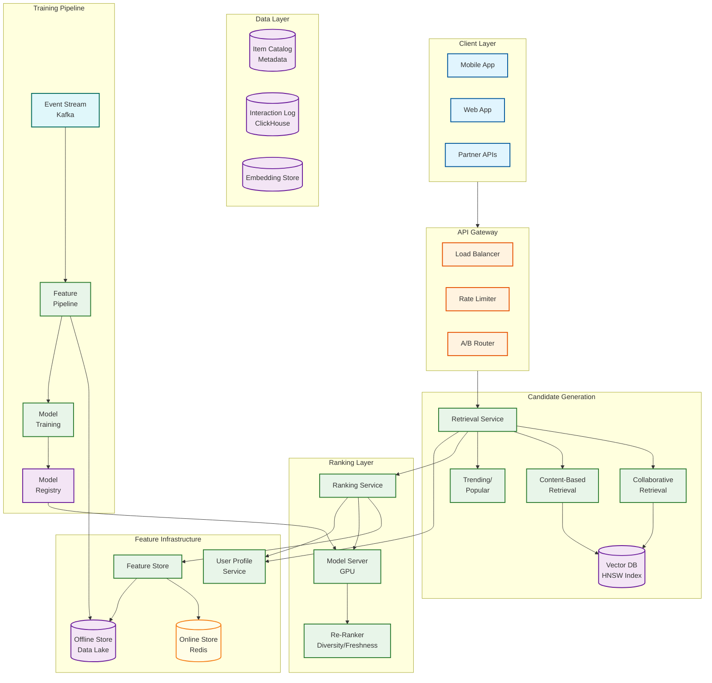
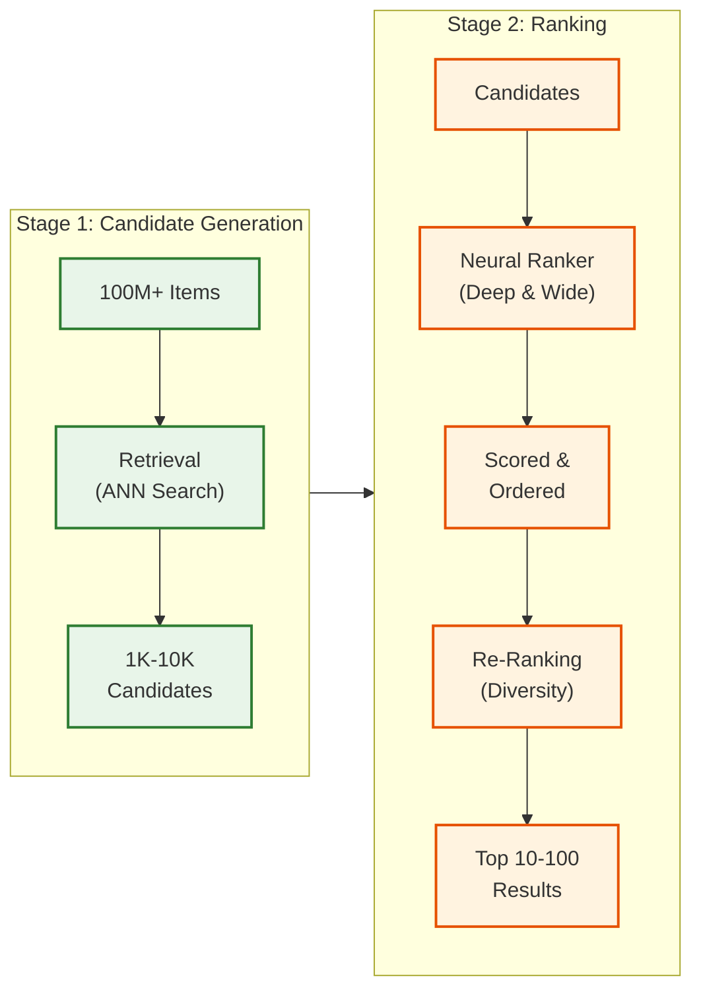

# Recommendation Engine

## Overview

The **Recommendation Engine** is a large-scale personalization system that surfaces relevant content to users from catalogs containing millions to billions of items. It employs a **two-stage architecture** (candidate generation + ranking) combined with **hybrid recommendation approaches** (collaborative filtering, content-based, and deep learning models) to deliver sub-100ms personalized recommendations at massive scale.

**Key Differentiator:** Production-grade two-tower embedding model with HNSW approximate nearest neighbor search for candidate generation, followed by a Deep & Wide neural ranking model - enabling real-time personalization for billions of users across hundreds of millions of items while handling cold start, diversity, and exploration challenges.

---

## System Characteristics

| Characteristic | Value | Implication |
|----------------|-------|-------------|
| Traffic Pattern | Read-heavy (serving), Write-heavy (training) | Separate serving and training infrastructure |
| Latency Target | <100ms p99 serving, <50ms p50 | ANN indexing, feature caching, model optimization |
| Consistency Model | Eventual (embeddings/features), Strong (user preferences) | Async embedding updates, real-time preference sync |
| Availability Target | 99.99% for serving | Multi-region, graceful degradation |
| Resource Type | GPU clusters (training + ranking), CPU (retrieval) | Heterogeneous compute scheduling |
| Scale Target | 1B+ users, 100M+ items, 1M+ QPS | Sharded indexes, distributed serving |

---

## Complexity Rating

| Component | Rating | Justification |
|-----------|--------|---------------|
| **Overall** | High | Two-stage ML pipeline + real-time features + multi-objective optimization |
| Candidate Generation | High | Embedding models, ANN indexing, multi-source retrieval |
| Ranking Model | High | Deep learning, real-time features, multi-objective |
| Feature Store | Medium-High | Online/offline consistency, point-in-time correctness |
| User Profile Service | Medium | Real-time aggregation, privacy controls |
| Cold Start Handler | Medium | Hybrid content/collaborative strategies |
| A/B Testing | Medium | Statistical validity, traffic allocation |
| Diversity/Exploration | Medium | Multi-armed bandits, re-ranking algorithms |

---

## Quick Navigation

| Document | Description |
|----------|-------------|
| [01 - Requirements & Estimations](./01-requirements-and-estimations.md) | Functional/non-functional requirements, capacity planning, SLOs |
| [02 - High-Level Design](./02-high-level-design.md) | Architecture, data flow, key decisions |
| [03 - Low-Level Design](./03-low-level-design.md) | Data model, APIs, core algorithms |
| [04 - Deep Dive & Bottlenecks](./04-deep-dive-and-bottlenecks.md) | Candidate generation, ranking, feature store internals |
| [05 - Scalability & Reliability](./05-scalability-and-reliability.md) | Scaling strategy, fault tolerance |
| [06 - Security & Compliance](./06-security-and-compliance.md) | Privacy, threat model, GDPR/CCPA |
| [07 - Observability](./07-observability.md) | Metrics, drift detection, alerting |
| [08 - Interview Guide](./08-interview-guide.md) | 45-minute pacing, trap questions, trade-offs |

---

## Core Modules

| Module | Responsibility | Key Challenge |
|--------|----------------|---------------|
| **Candidate Generation** | Reduce item space from billions to thousands | ANN index freshness, embedding quality, multi-source fusion |
| **Ranking Service** | Score and order candidates with rich features | Feature latency budget, model complexity, multi-objective |
| **Feature Store** | Online/offline feature serving | Training-serving skew, point-in-time correctness |
| **User Profile Service** | Aggregate user preferences and behavior | Real-time updates, privacy compliance |
| **Item Catalog** | Item metadata, embeddings, freshness scores | Index update latency, embedding staleness |
| **A/B Testing Service** | Experiment allocation and measurement | Statistical validity, interaction effects |
| **Feedback Collector** | Capture implicit/explicit signals | Bias correction, delayed feedback |
| **Cold Start Handler** | New user/item strategies | Content-based fallback, exploration |

---

## Architecture Overview



---

## Two-Stage Architecture Explained



**Why Two Stages?**
- Scoring all 100M items per request is infeasible (100M × 1M QPS = 100 trillion operations/sec)
- Stage 1 uses cheap O(log N) ANN search to narrow down
- Stage 2 uses expensive but accurate neural scoring on manageable subset

---

## Recommendation Approaches Comparison

| Approach | How It Works | Strengths | Weaknesses |
|----------|--------------|-----------|------------|
| **Collaborative Filtering** | "Users who liked X also liked Y" | Discovers preferences without content understanding | Cold start, popularity bias |
| **Content-Based** | Match item features to user preferences | Works for new items, interpretable | Filter bubbles, limited discovery |
| **Two-Tower (Embedding)** | Learn user and item embeddings, dot product similarity | Scalable, handles both signals | Training complexity |
| **Graph Neural Networks** | Propagate information on user-item graph | Rich relationship modeling | Computational cost |
| **Sequential Models** | Model user's sequence of interactions | Captures evolving interests | Needs sufficient history |
| **Hybrid** | Combine multiple approaches | Best of all worlds | System complexity |

---

## When to Use This Design

**Use Recommendation Engine When:**
- Large item catalog (100K+ items)
- Personalization significantly impacts engagement/revenue
- Users have diverse preferences
- Real-time personalization required
- Implicit feedback signals available (clicks, views, time)
- Cold start is a significant challenge

**Do NOT Use When:**
- Small catalog where browse/search suffices
- Homogeneous user preferences
- No historical interaction data
- Batch recommendations are acceptable (use simpler approaches)
- Strict explainability requirements (consider rule-based)

---

## Technology Stack Reference

| Layer | Technology Options | Selection Criteria |
|-------|-------------------|-------------------|
| **Vector Database** | Pinecone, Milvus, Weaviate, FAISS, Qdrant | Managed vs self-hosted, scale, latency |
| **Feature Store** | Feast, Tecton, Redis + custom | Online latency, offline scale, freshness |
| **Model Serving** | Triton, TorchServe, TFServing, vLLM | GPU support, batching, model format |
| **Streaming** | Kafka, Flink, Spark Streaming | Latency, throughput, exactly-once |
| **Online Store** | Redis Cluster, DynamoDB, ScyllaDB | Latency, consistency, scale |
| **Offline Store** | Delta Lake, Iceberg, Parquet on Object Storage | Schema evolution, time travel |
| **Training** | PyTorch, TensorFlow, JAX | Ecosystem, distributed training |
| **Orchestration** | Kubernetes, Ray | GPU scheduling, autoscaling |

---

## Key Numbers

| Metric | Value | Context |
|--------|-------|---------|
| Serving latency p99 | <100ms | User experience threshold |
| Retrieval latency | <20ms | Budget for ranking stage |
| Ranking latency | <50ms | Complex model, batching |
| Feature fetch latency | <10ms | Parallel fetching critical |
| Candidates from retrieval | 1,000-10,000 | Balance recall vs ranking cost |
| Final recommendations | 10-100 | UI/UX constraints |
| Embedding dimension | 128-512 | 256 is common balance |
| ANN recall@1000 | >95% | HNSW typical at scale |
| Model update frequency | Daily | Batch retraining |
| Feature freshness | <1 hour | Real-time signals |
| Cold start threshold | 10-50 interactions | Before personalization works |
| Index update latency | <15 minutes | New item discoverability |

---

## Interview Readiness Checklist

- [ ] Can explain two-stage architecture and why it's necessary at scale
- [ ] Understand two-tower model architecture and training
- [ ] Know HNSW algorithm for approximate nearest neighbor
- [ ] Can design feature store with online/offline consistency
- [ ] Understand cold start problem and hybrid solutions
- [ ] Know exploration vs exploitation trade-offs (bandits)
- [ ] Can discuss diversity and filter bubble prevention
- [ ] Understand position bias and its impact on training
- [ ] Can design multi-objective ranking (engagement + diversity + freshness)
- [ ] Know real-time feature computation challenges
- [ ] Understand training-serving skew and prevention
- [ ] Can discuss metrics: CTR, engagement, coverage, diversity

---

## Real-World References

| Company | System | Key Innovation |
|---------|--------|----------------|
| **Netflix** | 75-80% views from recs | SemanticGNN for knowledge graphs, Hydra multi-task model |
| **Spotify** | Discover Weekly | Two-tower embeddings, LLM-powered explanations |
| **YouTube** | Deep Neural Networks | Watch time optimization, exploration via epsilon-greedy |
| **Pinterest** | PinSage, PinRec | Graph neural networks, generative retrieval with transformers |
| **TikTok** | For You Page | Real-time interest modeling, Monolith system |
| **Alibaba** | MIND | Multi-interest network with dynamic routing |
| **Amazon** | Item-to-Item CF | Classic collaborative filtering at scale |
| **LinkedIn** | PYMK, Feed | Economic graph, multi-objective ranking |

---

## Quick Reference Card

```
+-----------------------------------------------------------------------+
|        RECOMMENDATION ENGINE - QUICK REFERENCE                         |
+-----------------------------------------------------------------------+
|                                                                        |
|  TWO-STAGE ARCHITECTURE                                                |
|  ----------------------                                                |
|  Stage 1: RETRIEVAL (Candidate Generation)                             |
|    * Two-tower embeddings: user_emb · item_emb                         |
|    * ANN search with HNSW: O(log N) from 100M items                    |
|    * Output: 1K-10K candidates                                         |
|                                                                        |
|  Stage 2: RANKING                                                      |
|    * Deep & Wide neural network                                        |
|    * Rich features (user, item, context, cross)                        |
|    * Multi-objective: engagement + diversity + freshness               |
|    * Output: Top 10-100 ranked                                         |
|                                                                        |
+-----------------------------------------------------------------------+
|                                                                        |
|  CORE ALGORITHMS                     COLD START STRATEGIES             |
|  ----------------                    ---------------------             |
|  * Two-Tower Model                   * New users: demographics,        |
|  * HNSW (ANN search)                   popular items, exploration      |
|  * Deep & Wide Ranking               * New items: content embedding,   |
|  * Thompson Sampling                   freshness boost, bandits        |
|  * MMR (diversity)                   * Hybrid: content + collaborative |
|                                                                        |
+-----------------------------------------------------------------------+
|                                                                        |
|  SCALE TARGETS                       LATENCY BUDGETS                   |
|  --------------                      ----------------                  |
|  * 1B+ users                         * Total: <100ms p99               |
|  * 100M+ items                       * Retrieval: <20ms                |
|  * 1M+ QPS                           * Feature fetch: <10ms            |
|  * 99.99% availability               * Ranking: <50ms                  |
|                                                                        |
+-----------------------------------------------------------------------+
|                                                                        |
|  INTERVIEW KEYWORDS                                                    |
|  ------------------                                                    |
|  Two-stage, two-tower, embedding, ANN, HNSW, collaborative filtering,  |
|  content-based, hybrid, cold start, exploration/exploitation,          |
|  Thompson sampling, feature store, online/offline, training-serving    |
|  skew, point-in-time, diversity, MMR, position bias, implicit feedback |
|                                                                        |
+-----------------------------------------------------------------------+
```

---

## Related Systems

- [3.2 ML Models Deployment System](../3.2-ml-models-deployment-system/00-index.md) - Model serving infrastructure
- [3.4 MLOps Platform](../3.4-mlops-platform/00-index.md) - Training pipeline and experiment tracking
- [3.14 Vector Database](../README.md) - ANN search deep dive (upcoming)
- [3.16 Feature Store](../README.md) - Feature infrastructure (upcoming)
- [1.4 Distributed LRU Cache](../1.4-distributed-lru-cache/00-index.md) - Caching patterns
- [2.7 Feature Flag Management](../2.7-feature-flag-management/00-index.md) - A/B testing infrastructure
