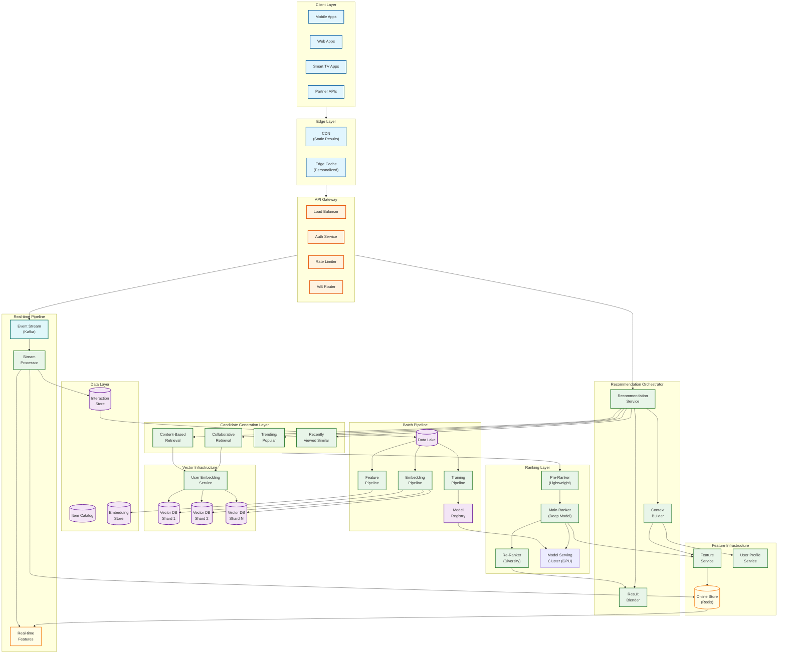
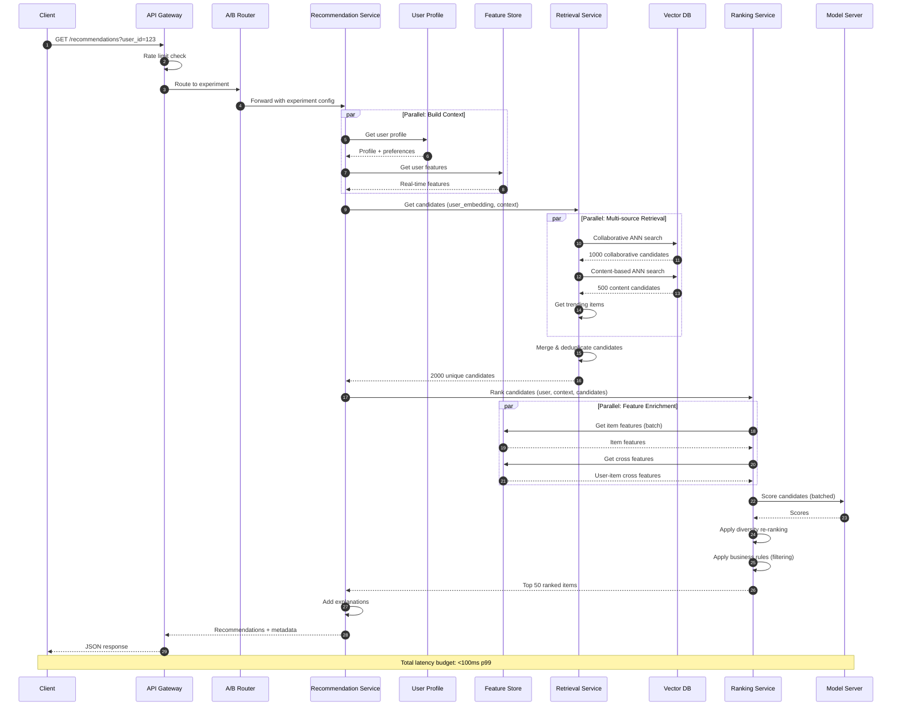
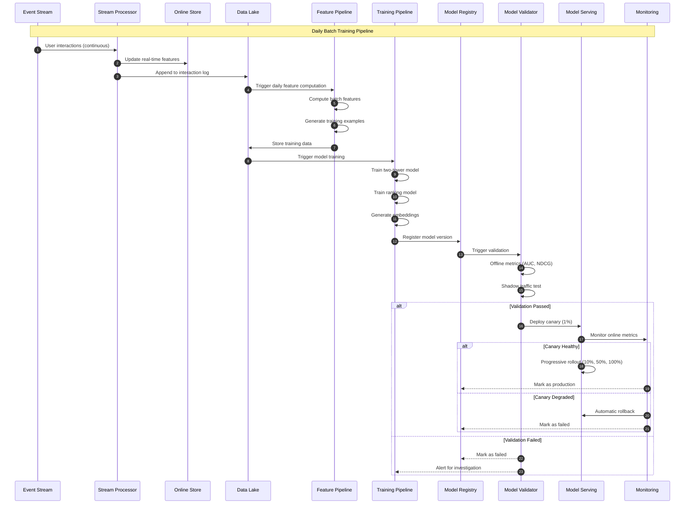
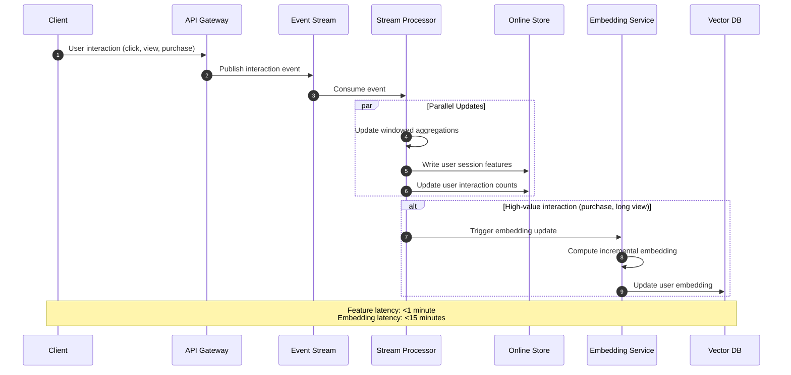
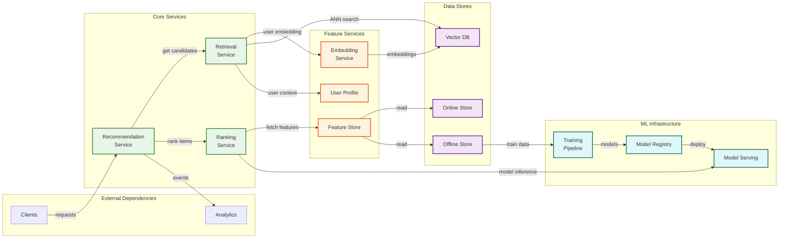
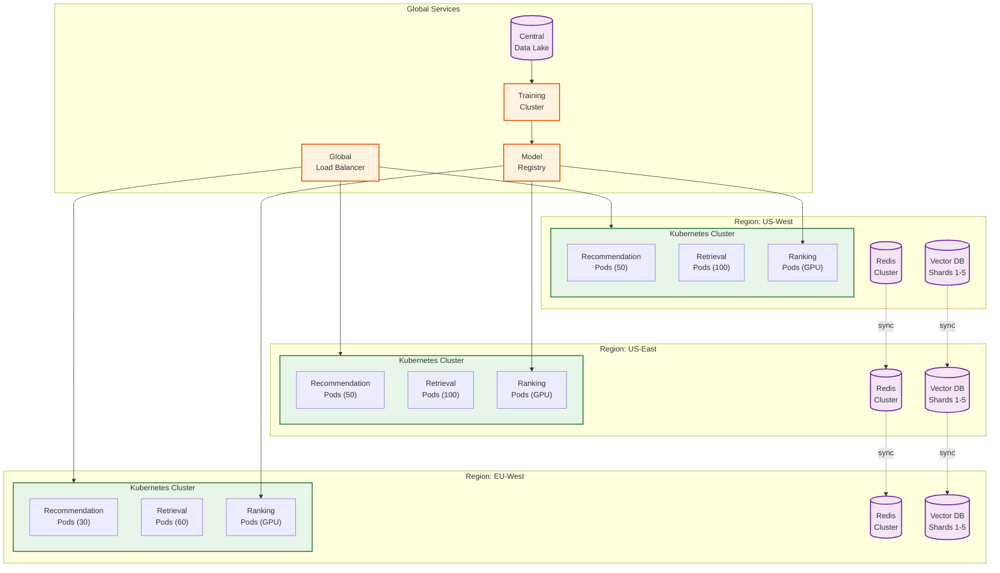

# High-Level Design

## System Architecture



---

## Data Flow: Recommendation Request



---

## Data Flow: Training Pipeline



---

## Data Flow: Real-time Feature Update



---

## Key Architectural Decisions

### Decision 1: Two-Stage vs End-to-End Architecture

| Criterion | Two-Stage (Retrieval + Ranking) | End-to-End Neural |
|-----------|--------------------------------|-------------------|
| **Scalability** | O(log N) retrieval + O(k) ranking | O(N) per request |
| **Latency** | <100ms achievable | Infeasible at scale |
| **Interpretability** | Separate components, easier debugging | Black box |
| **Flexibility** | Different models for each stage | Single model |
| **Complexity** | Higher system complexity | Lower system, higher model |

**Decision: Two-Stage Architecture**

**Rationale:**
- At 100M items and 1M QPS, scoring all items per request = 100 trillion operations/sec
- Two-stage reduces to: O(log N) ANN search + O(5000) ranking = feasible
- Industry standard: Netflix, YouTube, Pinterest, Spotify all use two-stage

---

### Decision 2: Retrieval Approach

| Criterion | Collaborative Only | Content Only | Two-Tower Hybrid |
|-----------|-------------------|--------------|------------------|
| **Cold Start (Users)** | Poor | Good | Good |
| **Cold Start (Items)** | Poor | Good | Good |
| **Personalization** | Excellent | Moderate | Excellent |
| **Diversity** | Limited | Good | Balanced |
| **Training Data** | Requires interactions | Requires metadata | Both |

**Decision: Two-Tower Model with Multi-Source Retrieval**

**Architecture:**
```
User Tower: user_features → MLP → user_embedding (256d)
Item Tower: item_features → MLP → item_embedding (256d)
Similarity: dot_product(user_embedding, item_embedding)
```

**Rationale:**
- Two-tower enables efficient ANN serving (pre-compute item embeddings)
- Combines collaborative signals (from interaction-based training) with content (from features)
- Multi-source retrieval (collaborative + content + trending) maximizes recall

---

### Decision 3: ANN Algorithm Selection

| Criterion | HNSW | IVF-PQ | ScaNN | Brute Force |
|-----------|------|--------|-------|-------------|
| **Query Latency** | ~1-5ms | ~5-10ms | ~1-3ms | 100ms+ |
| **Recall@1000** | >95% | 85-90% | >95% | 100% |
| **Memory** | High (graph + vectors) | Low (compressed) | Medium | High |
| **Index Build Time** | Medium | Fast | Fast | N/A |
| **Update Complexity** | Hard (rebuild) | Easy | Medium | Easy |

**Decision: HNSW with Product Quantization for Memory Optimization**

**Configuration:**
```
HNSW Parameters:
  M: 16 (connections per node)
  ef_construction: 200 (build-time accuracy)
  ef_search: 100 (query-time accuracy)

Product Quantization:
  segments: 32
  bits_per_segment: 8
  Memory reduction: ~4x
```

**Rationale:**
- HNSW provides best recall/latency trade-off
- Product quantization reduces memory for billion-scale indexes
- Widely supported (FAISS, Milvus, Pinecone)

---

### Decision 4: Ranking Model Architecture

| Criterion | Wide & Deep | DCN v2 | Transformer | Two-Tower |
|-----------|-------------|--------|-------------|-----------|
| **Feature Interactions** | Explicit + learned | Explicit cross | Attention-based | Limited |
| **Training Efficiency** | Good | Good | Expensive | Good |
| **Serving Latency** | ~5ms | ~5ms | ~20ms | ~1ms |
| **Accuracy** | High | Higher | Highest | Medium |

**Decision: Wide & Deep with Optional DCN Enhancement**

**Architecture:**
```
Wide Component (memorization):
  - Cross-product features
  - Linear model

Deep Component (generalization):
  - Concatenated features
  - MLP: 1024 → 512 → 256 → 128

Output: sigmoid(wide + deep)
```

**Rationale:**
- Balance of accuracy and serving latency
- Wide component captures frequent co-occurrences
- Deep component generalizes to unseen combinations
- Can enhance with DCN cross layers for better feature interactions

---

### Decision 5: Feature Store Architecture

| Criterion | Unified Store | Separate Online/Offline | Lambda Architecture |
|-----------|--------------|------------------------|---------------------|
| **Consistency** | Strong | Eventual | Eventual |
| **Latency** | Variable | Optimized per layer | Optimized |
| **Freshness** | Real-time | Tiered | Tiered |
| **Complexity** | Lower | Higher | Highest |
| **Cost** | Higher | Optimized | Optimized |

**Decision: Tiered Feature Store (Online + Offline + Real-time)**

**Architecture:**
```
Tier 1 - Real-time (sub-second):
  - Session features: last N interactions
  - Store: Redis (in-memory)
  - Update: Stream processor

Tier 2 - Online (hourly):
  - User aggregations: past 24h stats
  - Store: Redis cluster
  - Update: Micro-batch (hourly)

Tier 3 - Offline (daily):
  - Historical features: lifetime stats
  - Store: Data lake (Parquet)
  - Update: Daily batch
```

**Rationale:**
- Different freshness requirements for different features
- Cost optimization (hot/warm/cold storage tiers)
- Training uses offline store with point-in-time joins
- Serving uses online store with real-time overlay

---

## Component Interactions



---

## Architecture Pattern Checklist

| Pattern | Decision | Rationale |
|---------|----------|-----------|
| **Sync vs Async** | Sync (serving), Async (training) | Low latency serving, throughput training |
| **Event-driven vs Request-response** | Both | Events for features, request for recommendations |
| **Push vs Pull** | Pull (recommendations), Push (features) | On-demand recs, proactive feature updates |
| **Stateless vs Stateful** | Stateless services, Stateful stores | Horizontal scaling, persistent state |
| **Read-heavy vs Write-heavy** | Read-heavy serving, Write-heavy training | Optimize serving path, batch training |
| **Real-time vs Batch** | Both | Real-time features, batch models |
| **Edge vs Origin** | Edge caching for popular, Origin for personalized | Latency optimization |

---

## Technology Mapping

| Component | Technology Options | Recommended | Rationale |
|-----------|-------------------|-------------|-----------|
| **Vector Database** | Pinecone, Milvus, Weaviate, FAISS | Milvus (self-hosted) or Pinecone (managed) | Scale, HNSW support, GPU acceleration |
| **Online Feature Store** | Redis Cluster, DynamoDB, ScyllaDB | Redis Cluster | Sub-ms latency, rich data structures |
| **Offline Feature Store** | Delta Lake, Iceberg, Hudi | Delta Lake | Time travel, schema evolution |
| **Model Serving** | Triton, TorchServe, TFServing | Triton Inference Server | GPU batching, multi-framework |
| **Event Streaming** | Kafka, Pulsar, Kinesis | Kafka | Throughput, ecosystem |
| **Stream Processing** | Flink, Spark Streaming, Kafka Streams | Flink | Low latency, stateful processing |
| **Orchestration** | Kubernetes, Ray, Nomad | Kubernetes + Ray | GPU scheduling, ML-native |
| **API Gateway** | Kong, Envoy, custom | Envoy | Performance, observability |
| **Experiment Platform** | LaunchDarkly, Statsig, custom | Statsig | ML-native, statistical rigor |

---

## Deployment Topology



---

## Integration Points

| Integration | Protocol | Direction | Purpose |
|-------------|----------|-----------|---------|
| Client SDKs | REST/gRPC | Inbound | Recommendation requests |
| Event Collection | Kafka | Inbound | User interactions |
| Analytics | Kafka | Outbound | Recommendation events |
| A/B Testing | gRPC | Bidirectional | Experiment allocation, metrics |
| Model Registry | gRPC | Bidirectional | Model deployment |
| Monitoring | Prometheus | Outbound | Metrics export |
| Content Ingestion | Kafka | Inbound | New item catalog updates |
| User Management | gRPC | Inbound | User profile updates |
